# 企业级网络安全架构搭建与攻防演练

## 一、实验环境
- 操作系统：
- WireGuard版本：WireGuard 1.0.0
- iptables版本：iptables v1.8.13（nf_tables）

## 二、拓扑图和地址规划

> 1.拓扑图

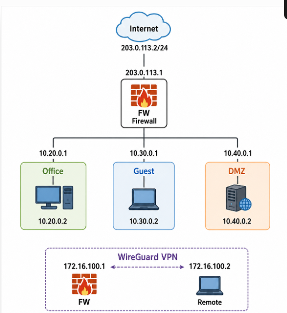

> 2.地址规划表

| 区域 | 网段 | fw侧地址 | 主机地址 | 说明 |
|:-----|:-----|:---------|:---------|:-----|
| office | 10.20.0.0/24 | 10.20.0.1 | 10.20.0.2 | 办公网 |
| guest | 10.30.0.0/24 | 10.30.0.1 | 10.30.0.2 | 访客网 |
| dmz | 10.40.0.0/24 | 10.40.0.1 | 10.40.0.2 | DMZ区 |
| internet | 203.0.113.0/24 | 203.0.113.1 | 203.0.113.10 | 模拟外网 |
| vpn | 172.16.100.0/24 |  172.16.100.1 |  172.16.100.2 | VPN隧道（WireGuard服务端，Remote客户端）|

## 三、第一部分：网络规划与基础搭建
（包含setup.sh的说明和连通性测试结果）

> 1.setup.sh脚本作用：

> 该脚本用于在 Linux 中通过 **network namespace + veth 虚拟网卡** 构建一个企业级网络拓扑实验环境。它首先清理旧的网络命名空间与虚拟网卡，避免环境冲突。随后创建 6 个 namespace：`fw（防火墙）`、`office（办公区）`、`guest（访客区）`、`dmz（隔离区）`、`internet（外网）` 和 `remote（远程主机）`。
> 接着脚本为每个区域建立 veth 对，并将一端连接到 fw 命名空间，实现所有子网统一经过防火墙转发。例如 office 使用 10.20.0.0/24，guest 使用 10.30.0.0/24，dmz 使用 10.40.0.0/24，internet 使用 203.0.113.0/24，remote 使用 10.10.10.0/24，并分别配置默认路由指向 fw。
> 最后开启 fw 的 IPv4 转发功能，使其具备三层路由能力，从而实现不同网络之间的通信控制。该脚本常用于防火墙策略测试、VPN/DMZ隔离实验以及企业网络拓扑模拟。

> 2.地址规划表：

| 区域 | 网段 | fw侧地址 | 主机地址 | 说明 |
|:-----|:-----|:---------|:---------|:-----|
| office | 10.20.0.0/24 | 10.20.0.1 | 10.20.0.2 | 办公网 |
| guest | 10.30.0.0/24 | 10.30.0.1 | 10.30.0.2 | 访客网 |
| dmz | 10.40.0.0/24 | 10.40.0.1 | 10.40.0.2 | DMZ区 |
| internet | 203.0.113.0/24 | 203.0.113.1 | 203.0.113.10 | 模拟外网 |
| vpn | 10.10.10.0/24 | 10.10.10.1 | 10.10.10.2 | VPN隧道 |

> 3.连通性测试截图
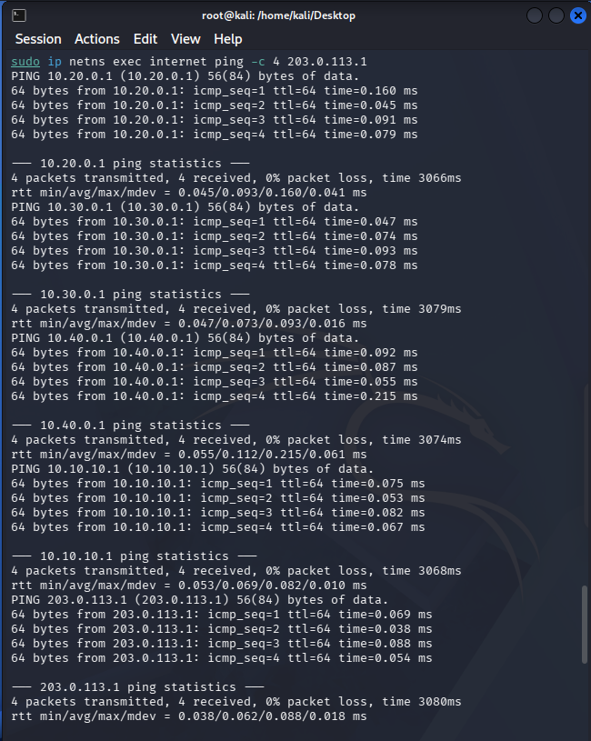

> 4.拓扑搭建说明：

 >  本实验采用Linux Network Namespace搭建虚拟网络环境，共创建了**office、guest、dmz、fw、internet、remote**六个网络命名空间。其中，**fw**作为防火墙和路由节点，通过veth虚拟网卡分别连接office、guest、dmz、internet和remote，实现各网络之间的互联。各网段分别配置独立IP地址，并为各主机设置默认网关指向防火墙对应接口，开启fw命名空间的IP转发功能，实现跨网段通信。完成网络拓扑后，在防火墙上配置iptables过滤规则、SNAT和DNAT规则，实现不同网络区域之间的访问控制；随后部署WireGuard VPN，在fw和remote之间建立加密隧道，实现远程安全访问office和dmz网络。VPN地址采用独立网段（172.16.100.0/24），避免与实验网络发生地址冲突。
 > 拓扑验证主要采用以下方法：
> 1. 使用`ip addr`、`ip route`检查各命名空间网络接口和路由配置是否正确；
> 2. 使用`ping`验证网络连通性，确认各网段能够按照设计要求通信；
> 3. 使用`curl`测试HTTP服务访问，验证访问控制策略是否符合预期；
> 4. 使用`iptables -L`和`iptables -t nat -L`检查防火墙规则及NAT配置；
> 5. 使用`wg show`验证WireGuard隧道状态，并通过VPN访问测试确认远程接入功能正常；
> 6. 使用`journalctl`查看日志信息，确认非法访问能够被正确记录并拦截。
> 实验结果表明，网络拓扑搭建正确，各网络区域能够按照设计要求实现通信和访问控制，VPN远程接入及日志审计功能均正常工作。

## 四、第二部分：防火墙策略实现
（包含firewall.sh的说明和访问控制矩阵）

> 1.firewall.sh说明:

> 首先脚本清空 fw 中已有的 filter 与 nat 规则，并将 FORWARD 默认策略设为 DROP，仅允许明确放行的流量。随后通过 conntrack 状态机制允许已建立连接和相关连接通信，提高规则效率与安全性。在业务策略上，允许 Office 网段访问 DMZ 的 8080 端口，但对 SSH（22端口）进行日志记录并拒绝；允许 Office 和 Guest 访问 Internet，同时限制 Guest 访问 Office 和 DMZ。Internet 侧默认禁止访问内网，仅允许必要的 DNAT 转发到 DMZ 的 Web 服务。在 NAT 部分，对 Office、Guest 和 DMZ 网段进行 MASQUERADE，实现内网共享公网访问能力；同时配置 DNAT，将外部访问 8080 端口映射到 DMZ 主机。最后输出 FORWARD 与 NAT 表规则，用于验证当前防火墙策略状态。整体模拟了企业网络中的分区隔离、访问控制与端口映射机制。

> 2 规则列表截图:
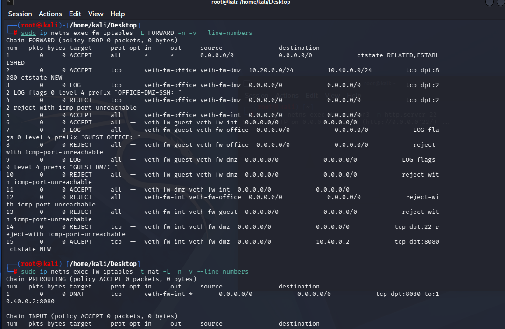
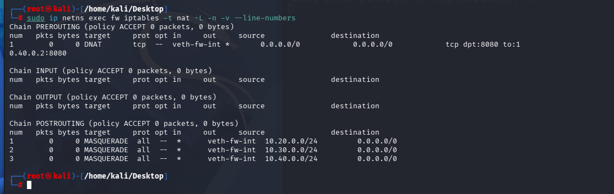

> 3.访问测试矩阵：

| 来源 | 目标 | 预期结果 | 实际结果 | 截图 |
|:-----|:-----|:---------|:---------|:-----|
| office | dmz:8080 | 成功 |成功，可正常访问DMZ Web服务（HTTP 200 | 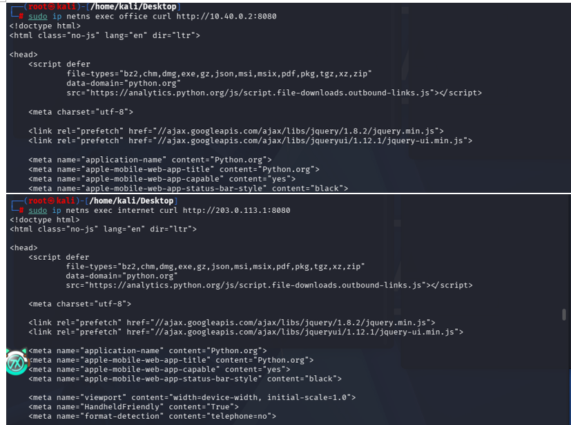|
| office | dmz:22 | 失败+LOG |失败，连接被REJECT，同时触发OFFICE-DMZ-SSH日志 |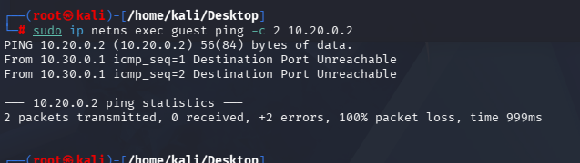 |
| guest | office:任意 | 失败+LOG |失败，被防火墙拒绝，并记录GUEST-OFFICE日志 | |
| guest | dmz:8080 | 失败+LOG |失败，被防火墙拒绝，并记录GUEST-DMZ日志 ||
| guest | internet:任意 | 成功 |成功，可正常访问Internet网络 ||
| office | internet:任意 | 成功 |成功，可正常访问Internet网络 ||
| internet | fw公网IP:8080 | 成功(DNAT到dmz) |成功，DNAT转发到10.40.0.2:8080，返回Web页面 ||
| internet | dmz:22 | 失败 | 失败，SSH访问被REJECT，无法建立连接| |

> 4.规则设计说明

> 本实验的防火墙规则遵循“默认拒绝、按需放行”的设计原则，FORWARD链默认策略设置为DROP，仅允许满足业务需求的流量通过。规则顺序按照iptables自上而下、首次匹配立即执行的机制进行设计，首先放行已建立和相关连接（RELATED、ESTABLISHED），保证正常通信的返回流量能够快速通过；随后配置各项业务允许规则，如Office访问DMZ的8080端口、Office和Guest访问Internet、VPN访问Office及DMZ的Web服务等；对于未经授权的访问，在对应的REJECT规则之前先设置LOG规则，记录攻击来源、目标地址、接口、端口等信息，便于后续安全审计和故障分析，最后再执行REJECT拒绝访问。本实验选择REJECT而不是DROP，是因为REJECT会立即向发送方返回错误信息，使客户端能够快速获知连接失败，便于实验验证和网络故障排查；同时，LOG规则结合不同的log-prefix（如GUEST-TO-OFFICE、GUEST-TO-DMZ、VPN-TO-DMZ-SSH等）以及速率限制机制，可以有效区分不同类型的违规访问，防止大量重复日志造成日志洪水，提高日志分析效率和系统运行性能。整个规则设计既保证了网络访问控制的安全性，又兼顾了实验验证、日志审计和后期维护的便利性。

## 五、第三部分：VPN远程接入
（包含WireGuard配置说明和测试结果）
> 1.WireGuard配置说明和测试结果:

> WireGuard配置说明:实验采用WireGuard搭建远程接入VPN，FW作为VPN服务器，Remote作为VPN客户端。VPN地址规划为172.16.100.1/24和172.16.100.2/24，与实验网络其他网段完全隔离，避免地址冲突。服务端AllowedIPs配置为172.16.100.2/32，仅允许合法VPN客户端接入；客户端AllowedIPs配置为10.20.0.0/24和10.40.0.0/24，仅将访问Office和DMZ网络的流量通过VPN传输，其余Internet流量仍使用本地默认路由，实现分离隧道（Split Tunnel），减少VPN带宽占用，提高访问效率。
> VPN测试结果：WireGuard成功建立VPN隧道，wg show能够看到最新握手时间及数据传输统计。Remote可以成功访问Office网络和DMZ的8080 Web服务，而访问DMZ的22端口则被防火墙记录日志并拒绝访问。实验验证了VPN访问控制规则能够准确限制VPN用户权限，实现仅允许授权业务通过VPN访问内网资源，同时保证未授权访问被有效拦截并记录日志。

> 2.wg show截图:
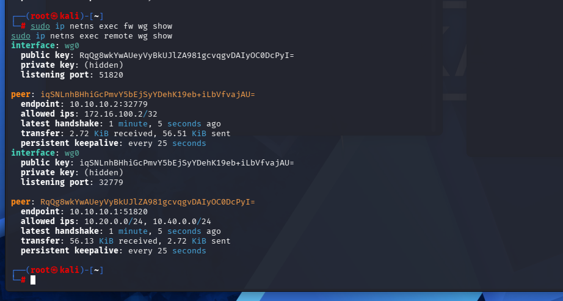

> 3.VPN访问测试截图：

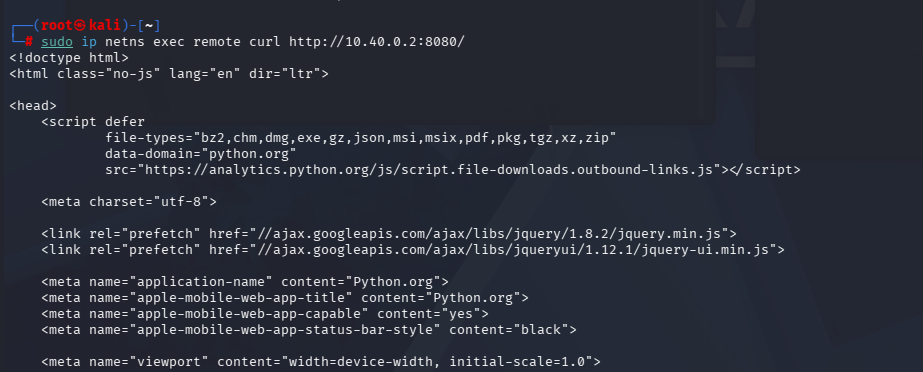
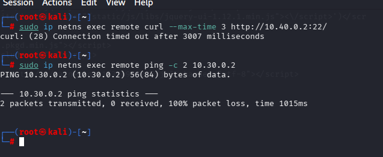

> 4.路由表截图:

> 5.VPN配置说明:

> 本实验中，WireGuard的AllowedIPs采用最小权限原则进行配置。在防火墙（fw）端，Peer配置为`AllowedIPs = 172.16.100.2/32`，表示仅允许VPN客户端使用唯一的VPN地址172.16.100.2接入，避免其他地址伪装成合法VPN客户端，提高接入安全性。在remote端，配置为`AllowedIPs = 10.20.0.0/24,10.40.0.0/24`，表示只有访问Office网段和DMZ网段的数据才会通过WireGuard隧道传输，而访问Internet或其他网络仍然使用本地默认路由，不会全部经过VPN。这样既减少了VPN带宽占用，又降低了网络延迟，同时避免将所有流量强制转发到VPN，提高了网络访问效率和安全性。此外，本实验没有配置`AllowedIPs = 0.0.0.0/0`，避免形成全隧道（Full Tunnel）模式，防止所有互联网流量进入VPN，符合实验要求，也体现了按需路由和最小权限访问的设计思想。 

## 六、第四部分：安全审计与日志分析
（包含LOG规则说明和日志分析报告）

> 1.LOG规则说明:

> 本实验中LOG规则统一放置在REJECT规则之前，用于记录所有被拒绝的访问行为。通过不同的log-prefix区分攻击类型，例如GUEST-TO-OFFICE、VPN-DENY等，同时结合limit模块进行速率限制，避免日志洪泛。

> 2.LOG规则配置截图:

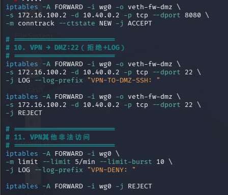

> 3.五种违规场景截图:

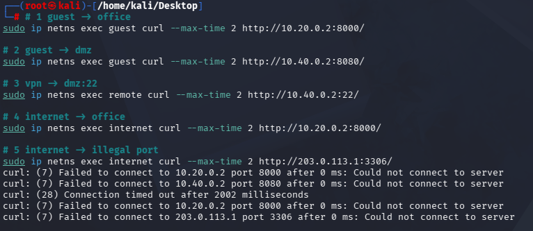

> 4.日志统计表

| 事件类型 | 触发次数 | 实际记录日志数 | 是否生效 |
|:--------|:---------|:--------------|:---------|
| guest→office |22 |22 |是 |
| guest→dmz | 4|4 | 是|
| VPN→dmz:22 |27 |27 | 是|
| internet→office | 0|0 |否 |
| VPN其他违规 | 0| 0| 否|

> 5.日志分析报告：
> 本实验通过iptables的LOG规则对非法访问进行记录，日志中能够获取丰富的安全信息，包括访问时间、输入接口（IN）、输出接口（OUT）、源IP地址（SRC）、目的IP地址（DST）、协议类型（PROTO）、源端口（SPT）、目标端口（DPT）以及数据包长度等。通过这些信息可以准确判断攻击来源、攻击目标、访问方向和攻击方式，为网络安全审计、异常行为分析以及故障排查提供可靠依据。例如，当日志中出现`IN=veth-fw-guest`、`OUT=veth-fw-office`时，可以确定访问来自Guest网络，并试图攻击Office网络
> LOG规则必须放置在REJECT规则之前，因为iptables按照规则顺序进行匹配，一旦数据包匹配到REJECT规则便立即终止处理，后续LOG规则将不会执行，导致非法访问无法留下日志记录。采用“先记录、后拒绝”的策略，可以在阻止攻击的同时保留完整的审计证据，方便管理员进行后续分析。
> 针对Guest网络、Internet来源以及VPN异常访问等可能产生大量非法连接的场景，本实验采用`-m limit --limit 5/min --limit-burst 10`对LOG规则进行速率限制。当攻击者短时间内发送大量数据包时，仅记录部分代表性日志，其余数据包仍会被REJECT拦截，从而有效防止日志洪水（Log Flood）攻击，减少磁盘空间占用和系统资源消耗，同时保证其他重要日志能够正常记录。
> 此外，本实验为不同类型的违规访问设置了不同的`log-prefix`，如`GUEST-TO-OFFICE`、`GUEST-TO-DMZ`、`VPN-TO-DMZ-SSH`、`INET-TO-OFFICE`和`VPN-DENY`等。不同的日志前缀能够快速区分攻击来源和攻击类型，便于使用`journalctl`或`grep`进行分类统计、快速检索和安全分析，提高了日志管理效率，也为后续安全事件响应和攻击溯源提供了便利。
## 七、第五部分：攻防演练
（包含攻击演练、防御分析、边界测试）

> 1. 攻击演练

>  攻击1：Guest网络访问Office网段的数据包必须经过防火墙FORWARD链，而防火墙已配置Guest→Office的LOG和REJECT规则。当Ping扫描数据包到达防火墙后，会先记录日志，再立即拒绝转发，因此扫描无法获得任何主机响应。该策略实现了Guest与Office网络隔离，有效阻止了攻击者利用扫描发现内网主机和服务。
> 攻击2：虽然攻击者修改了客户端源端口（80、443），但iptables主要根据目标地址、目标端口、协议及接口等条件进行匹配，而不会因为源端口变化而放行数据包。由于目标仍为DMZ服务器22端口，因此数据包依然匹配Guest→DMZ的LOG和REJECT规则，被防火墙记录并拒绝，绕过尝试失败。
> 攻击3：攻击者仅伪造VPN客户端IP地址并不能成功访问内网，因为WireGuard采用公私钥认证和加密传输机制，只有合法Peer生成的加密数据包才能通过验证。同时，防火墙仅允许来自wg0接口且符合AllowedIPs配置的VPN流量进入Office和DMZ网络，因此普通Guest或Internet主机无法通过伪造源地址绕过VPN访问控制。
> 攻击者能否从REJECT和DROP的不同表现判断目标是否存在？回答：可以。REJECT会主动向客户端返回错误信息（如ICMP不可达或TCP RST），攻击者能够快速知道目标网络中存在主机或防火墙，只是当前访问被策略拒绝，因此能够推测目标是存在的。相比之下，DROP会直接丢弃数据包，不返回任何响应，客户端只能看到连接超时，无法判断目标主机不存在、网络故障还是被防火墙过滤，因此具有更好的隐蔽性。本实验采用REJECT主要是为了便于功能验证、日志分析和故障排查，而在实际生产环境中，对于需要隐藏网络结构的重要服务，通常更倾向于使用DROP来提高安全性。
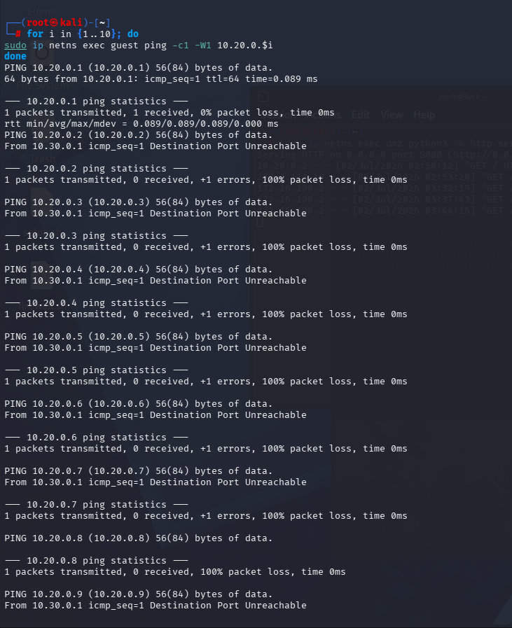
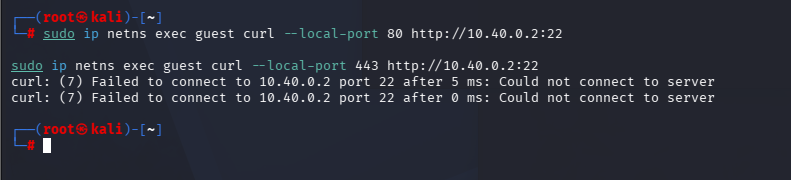

> 2.防御分析:

日志监控图
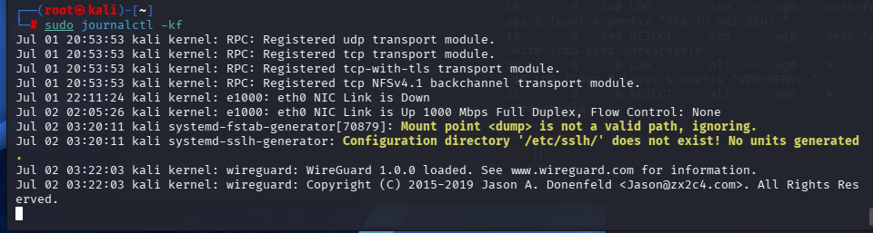
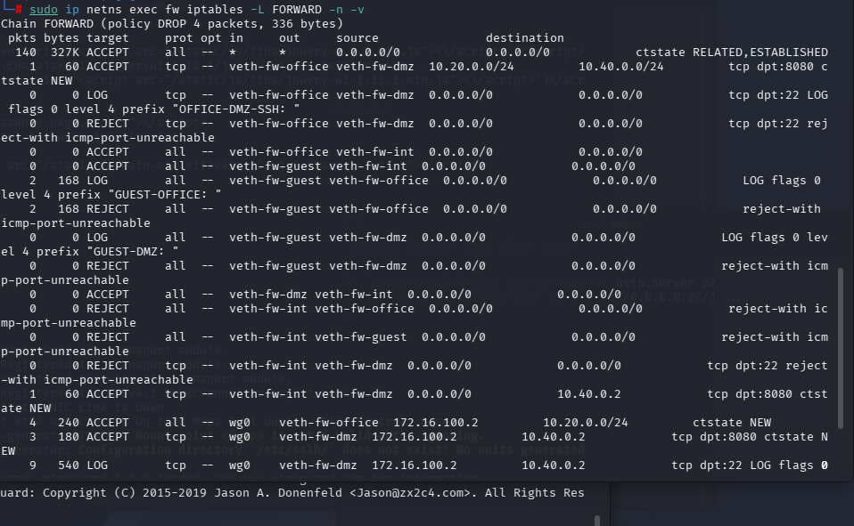

1. 从日志的哪些字段可以判断这是来自guest的攻击？

> 可以通过日志中的`IN`、`SRC`以及`log-prefix`等字段进行判断。其中，`IN=veth-fw-guest`表示数据包是从Guest网络接口进入防火墙，`SRC`显示攻击源IP地址属于Guest网段（如10.30.0.0/24），而日志前缀如`GUEST-TO-OFFICE`或`GUEST-TO-DMZ`能够直接表明该日志属于Guest网络发起的违规访问。因此结合接口、源地址和日志前缀即可准确判断攻击来源。

2. 如果日志中`IN=veth-fw-guest OUT=veth-fw-office`，说明了什么？

> 该日志说明数据包是从Guest网络进入防火墙，并准备转发到Office网络，即Guest主机正在尝试访问Office网段。由于实验防火墙禁止Guest访问Office，因此该数据包会先匹配LOG规则记录日志，再匹配REJECT规则被拒绝。该字段能够清楚反映攻击路径和访问方向，是分析网络攻击行为和验证访问控制策略的重要依据。

3. 为什么看到大量相同来源的日志应该引起警惕？

> 如果短时间内出现大量来自同一源IP或同一接口的重复日志，通常说明该主机正在持续发起扫描、暴力破解或恶意探测等攻击行为。大量重复请求不仅可能意味着攻击正在进行，还可能消耗系统资源并影响正常业务。因此管理员应及时分析日志来源，必要时采取封禁源IP、调整防火墙策略或进一步排查主机安全状况，以防止攻击进一步扩大。

> 日志证据

> 规则计数器

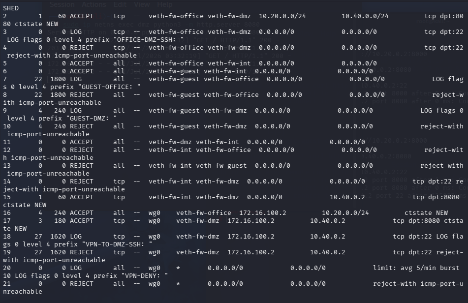

1. 哪条规则拦截了guest访问office？

> 根据iptables规则计数器，Guest访问Office的流量首先匹配LOG规则（第7条），记录日志后继续匹配第8条REJECT规则，最终由第8条规则拒绝访问。因此，第7条负责日志记录，第8条负责真正拦截Guest访问Office，两条规则共同实现访问控制和安全审计功能。

2. 如果guest→office的规则计数很高，说明了什么？

> 如果Guest→Office对应规则的计数器持续增加，说明Guest网络频繁尝试访问Office网络。这可能是用户误操作、配置错误，也可能表示攻击者正在进行主机扫描、端口扫描或未授权访问尝试。较高的计数值说明防火墙成功拦截了大量非法访问，同时也提示管理员应进一步分析日志，判断是否存在持续性的安全威胁。

3. REJECT和DROP在安全性上有什么区别？

> REJECT会主动向客户端返回错误信息，如ICMP不可达或TCP RST，使客户端能够立即知道连接被防火墙拒绝，便于实验验证和故障排查。DROP则直接丢弃数据包，不返回任何响应，客户端只能等待超时，无法判断目标是否存在，因此能够更好地隐藏网络结构，提高安全性。一般实验环境更适合使用REJECT，而生产环境中的关键服务通常更倾向于使用DROP。

> 3.边界测试改进方案

> 问题office无限制访问internet:

> 风险分析：本实验中DMZ区域的Web服务器（10.40.0.2:8080）需要对Internet开放，以便外部用户访问。但如果没有任何连接数量限制，攻击者可以利用大量TCP连接持续访问8080端口，造成服务器资源耗尽，影响正常用户访问，甚至导致拒绝服务（DoS）攻击。此外，持续建立大量连接也会增加防火墙和服务器的CPU、内存占用，使整个网络性能下降。因此，仅依靠允许访问规则并不能有效防御恶意连接，需要增加连接数量限制，提高服务器抗攻击能力。

> 改进方案的实现代码

sudo ip netns exec fw iptables -I FORWARD 2 \
 -p tcp --syn \
 -d 10.40.0.2 \
 --dport 8080 \
 -m connlimit \
 --connlimit-above 10 \
 --connlimit-mask 32 \
 -j REJECT --reject-with tcp-reset

> 测试效果

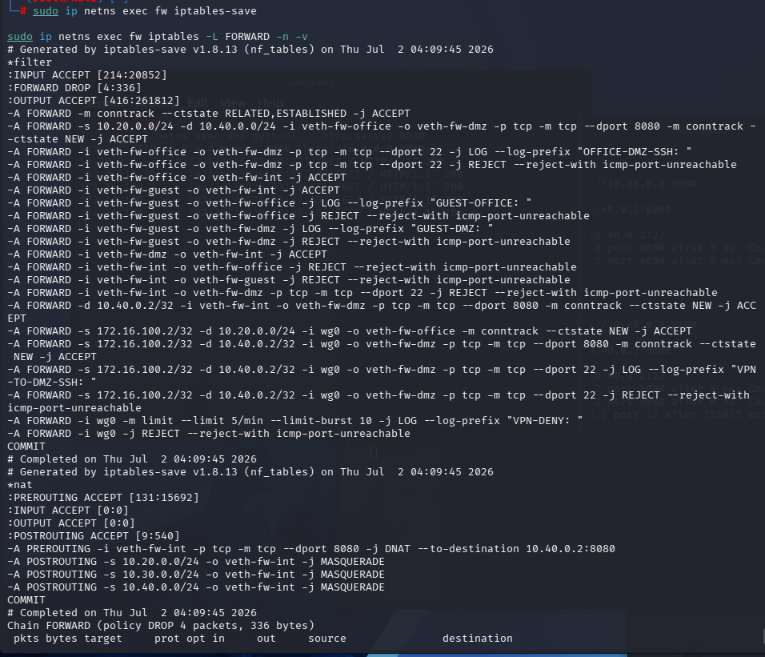

> 4.追踪包的完整变化过程

> 抓包截图:

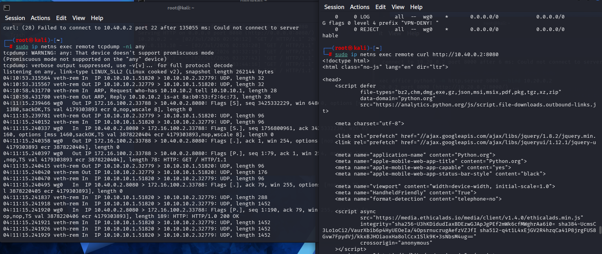
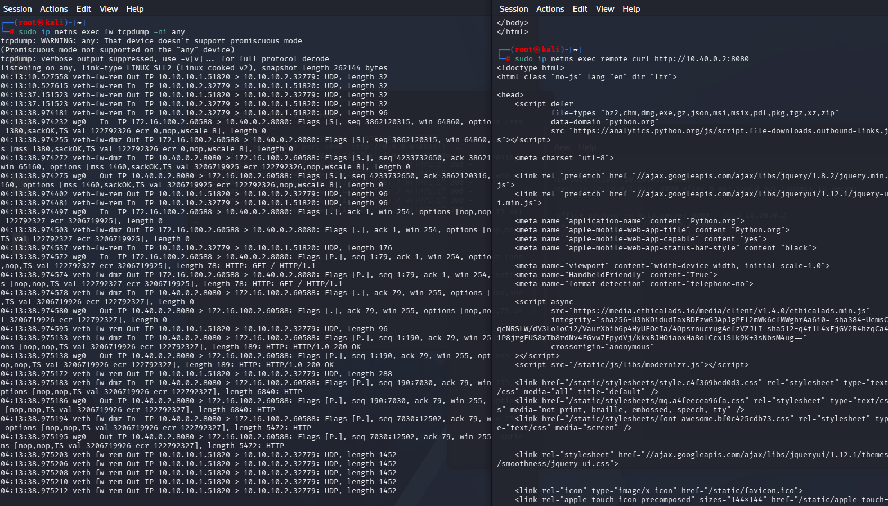

> 包变化对比表

| 阶段 | 观察位置 | 源地址 | 目的地址 | 协议 | 备注 |
|:-----|:---------|:-------|:---------|:-----|:-----|
| 1 | remote wg0 |172.16.100.2 |10.40.0.2 |TCP/HTTP | 封装前 |
| 2 | fw wg0 |172.16.100.2 |10.40.0.2 |TCP/HTTP | 解封装后 |
| 3 | fw veth-fw-dmz | 172.16.100.2| 10.40.0.2|TCP/HTTP | 转发到dmz |
| 4 | conntrack |172.16.100.2 |10.40.0.2:8080 | TCP| 连接跟踪记录 |

> conntrack记录截图

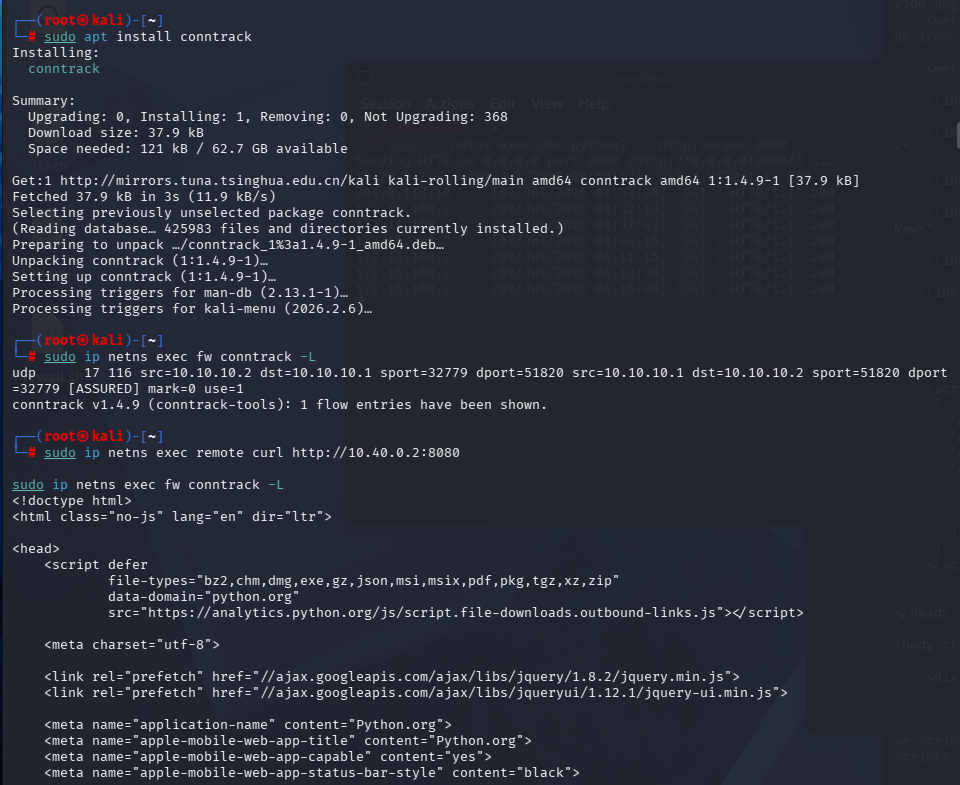

> 分析报告：说明包是如何一步步被处理的

> 本实验对remote通过WireGuard VPN访问DMZ Web服务器（10.40.0.2:8080）的数据包进行了完整跟踪。在remote主机上，应用程序首先生成目的地址为10.40.0.2的HTTP请求，由WireGuard接口wg0负责发送。由于目的地址属于AllowedIPs指定的网段，因此数据包通过VPN隧道进行传输，并在底层完成加密封装。
> 数据包到达fw后，由wg0接口接收并完成解密，恢复为原始IP数据包，源地址仍为172.16.100.2，目的地址为10.40.0.2。随后Linux内核根据iptables FORWARD链进行访问控制，匹配到允许VPN访问DMZ 8080端口的ACCEPT规则，因此允许继续转发。
> 之后数据包从veth-fw-dmz接口发送至DMZ主机，DMZ服务器返回HTTP响应。由于连接已经被conntrack记录为ESTABLISHED状态，因此返回流量直接命中FORWARD链第一条RELATED,ESTABLISHED规则，无需再次匹配后续访问控制规则即可快速放行。
> 整个过程中，tcpdump分别验证了VPN接口和DMZ接口上的数据流变化，而conntrack记录则证明了Linux状态检测防火墙能够跟踪连接状态，提高了转发效率，并保证只有符合安全策略的数据流能够访问DMZ服务。

## 八、故障排查
（包含至少3个故障场景的排查过程）

> 场景1：DNAT配置正确但外网无法访问8080端口
> 1.在配置完成DNAT规则后，从Internet主机访问公网地址203.0.113.1:8080时连接失败，但DMZ服务器上的Web服务运行正常。首先通过iptables -t nat -L -n -v检查NAT表，确认DNAT规则已经成功配置；随后使用iptables -L FORWARD -n -v --line-numbers检查FORWARD链，发现缺少允许Internet访问DMZ服务器8080端口的转发规则。为了进一步定位问题，在Firewall的内外网接口上使用tcpdump进行抓包，发现请求数据包已经到达Firewall，但没有从DMZ接口转发出去，说明数据包被FORWARD链拦截。最终确定故障原因为DNAT仅完成地址转换，而FORWARD链未放行转换后的流量。通过补充允许Internet访问DMZ服务器8080端口的FORWARD规则，并保留ESTABLISHED,RELATED状态检测规则后，再次访问公网地址成功返回网页内容，故障得到解决。
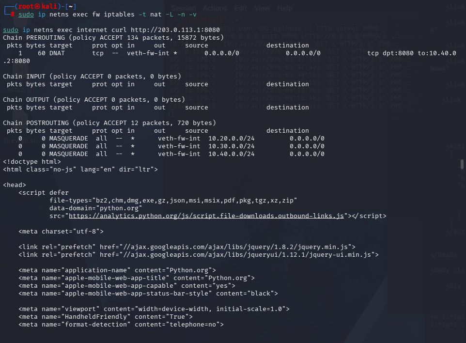

> 场景2：VPN握手成功但无法访问内网
> 在WireGuard VPN部署完成后，执行wg show能够看到正常的latest handshake和数据传输统计信息，说明VPN隧道已经成功建立，但Remote主机仍然无法访问Office和DMZ网络资源。首先检查remote端的wg0.conf配置文件，确认AllowedIPs是否正确包含10.20.0.0/24和10.40.0.0/24两个目标网段；随后检查Firewall上的FORWARD规则，确认是否存在允许wg0接口访问Office和DMZ的放行策略。同时检查系统IP转发功能是否开启，以及DMZ主机的默认路由是否正确指向Firewall。排查发现问题出在VPN流量对应的FORWARD规则不完整，导致业务流量虽然进入VPN隧道，但无法继续转发至目标网络。补充相应的FORWARD放行规则后，Remote主机能够成功访问DMZ的8080服务，VPN业务恢复正常。
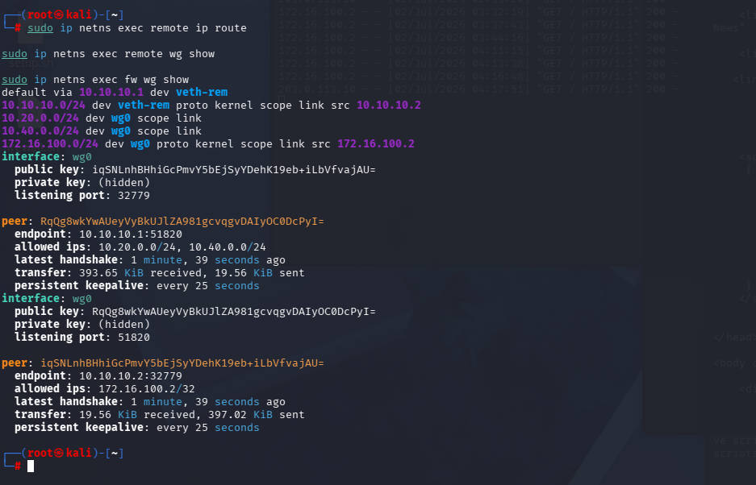

> 场景3：删除ESTABLISHED,RELATED后TCP连接失败
> 为了验证状态检测机制的重要性，故意删除FORWARD链中的ESTABLISHED,RELATED规则。删除后再次访问DMZ服务器的Web服务，客户端连接长时间等待并最终超时。随后在Firewall上使用tcpdump抓包分析TCP通信过程，发现客户端发出的SYN请求能够正常到达服务器，服务器返回的SYN-ACK应答包也已经发出，但无法返回到客户端。进一步使用conntrack -L查看连接跟踪表，发现连接状态始终无法建立。结合FORWARD链规则检查后确认，由于缺少ESTABLISHED,RELATED规则，返回流量无法匹配任何允许规则，被默认DROP策略直接丢弃，从而导致TCP三次握手无法完成。重新添加状态检测规则后，再次测试Web访问恢复正常，验证了状态检测机制在防火墙中的关键作用。

## 九、遇到的问题和解决方法
（实验过程中的实际问题和解决思路）
> 实验过程中遇到了多个实际问题，并通过逐步排查完成了解决。首先，在搭建 WireGuard VPN 时，wg show 最初没有出现 latest handshake，经过检查发现双方 Endpoint 地址和 AllowedIPs 配置不一致，修改为正确的 IP 地址，并重新启动 WireGuard 服务后，握手恢复正常，VPN 隧道建立成功。其次，在测试 VPN 访问 office 网络时，发现 curl http://10.20.0.2:8000 无法连接，通过 ss -lnt 检查发现 office 主机并没有启动对应的 Web 服务，因此重新启动 HTTP 服务后恢复正常访问。第三，在配置 DNAT 后，外网访问 203.0.113.1:8080 仍然失败，通过检查 NAT 表、FORWARD 链以及默认路由，最终发现缺少放行 DNAT 后转发流量的 FORWARD 规则，补充规则后即可正常访问。第四，在日志审计阶段，执行 journalctl 查询不到任何 LOG 记录，进一步分析发现 LOG 规则没有放置在对应 REJECT 规则之前，因此数据包在 REJECT 后已经被丢弃，没有机会记录日志。调整规则顺序，并重新触发违规访问后，成功获取了包含 IN、OUT、SRC、DST、DPT 等完整字段的日志信息。最后，在 VPN 访问测试过程中，由于更换了 VPN 地址段，部分 iptables 规则仍然使用旧地址 10.10.10.2，导致访问失败，统一修改为新的 VPN 地址 172.16.100.2 后，VPN 用户访问 office 与 dmz:8080 均恢复正常，而访问未授权资源仍会被成功拦截并记录日志。通过这些问题的排查，加深了对 WireGuard、iptables、防火墙状态检测、NAT 转换、日志审计以及 Linux 网络故障定位方法的理解，也掌握了利用 wg show、iptables、journalctl、tcpdump、conntrack 等工具进行系统化排障的过程。

## 十、总结与思考
（至少500字，包含对企业网络安全架构的整体理解）
> 通过本次企业级防火墙与 VPN 综合实验，我完整体验了企业网络从规划设计、网络搭建、防火墙策略制定、NAT 地址转换、VPN 远程接入、安全日志审计，到攻击演练和故障排查的全过程，对企业网络安全体系有了更加系统和深入的理解。本实验不仅完成了各项功能实现，更重要的是理解了网络安全设计背后的思想，而不仅仅是完成命令配置。
> 在网络规划阶段，我利用 Linux Network Namespace 构建了 office、guest、dmz、internet、fw 和 remote 等多个网络节点，并合理划分不同网段，使办公网络、访客网络、DMZ 服务区以及互联网之间形成相互隔离的安全架构。通过静态路由和 IP 转发配置，实现了各网络之间按照预期进行通信，也认识到合理的网络分区是企业安全防护的第一道防线。
> 在防火墙策略设计过程中，我深入理解了最小权限原则（Least Privilege）的实际应用。所有 FORWARD 链默认采用 DROP 策略，仅开放业务所需的访问路径，例如允许 office 访问 dmz 的 Web 服务、允许办公网络和访客网络访问互联网，同时严格限制 guest 访问 office 和 dmz，并通过 LOG+REJECT 的方式记录违规访问行为。规则顺序按照“状态检测优先、业务放行其次、日志记录再次、最终拒绝”的原则设计，不仅提高了规则匹配效率，也保证了日志能够完整记录，为后续审计提供依据。
> 在 VPN 部分，我使用 WireGuard 构建了远程办公环境，并通过 `AllowedIPs` 精确控制 VPN 用户只能访问 office 和 dmz 中授权的资源，而不会将所有互联网流量都转发到 VPN 中，实现了分流（Split Tunnel）设计。这种设计既提高了访问效率，也减少了企业 VPN 网关的负载，符合现代企业远程办公网络的实际部署方式。同时，我还学习了 WireGuard 握手机制、公钥认证方式以及路由选择原理，对 VPN 的工作流程有了更加深入的理解。
> 日志审计部分让我认识到日志不仅是排查故障的重要依据，也是发现安全事件的重要数据来源。通过不同的 `log-prefix` 对不同类型的攻击进行分类，可以快速定位 guest、VPN 或 internet 发起的非法访问行为；利用 `journalctl` 可以统计攻击次数、分析攻击来源，并结合规则计数器判断攻击频率。为了避免日志洪水攻击，实验中还配置了 `limit` 模块，对日志输出进行了速率限制，在保证日志完整性的同时避免系统资源被大量日志占用。
> 攻防演练进一步验证了防火墙策略的有效性。我模拟了网络扫描、端口绕过、VPN 地址伪造等多种攻击方式，发现攻击均被防火墙成功拦截并记录日志。尤其是在尝试修改源端口访问 dmz:22 时，即使更换源端口，也无法绕过目的端口匹配规则，说明防火墙真正依据的是访问策略，而不是客户端行为。同时，我也认识到 REJECT 与 DROP 各有适用场景：REJECT 更适合企业内部管理，方便用户快速发现连接失败原因；DROP 更适用于边界防护，可降低攻击者获取网络信息的可能性。
> 在整个实验过程中，我熟练掌握了 `iptables`、`WireGuard`、`journalctl`、`tcpdump`、`conntrack`、`ss`、`curl` 等工具的使用方法，并能够结合抓包、日志和规则计数器快速定位网络故障。通过不断分析问题、验证原因、修改配置并再次测试，我逐步形成了规范的网络故障排查思路，也提高了独立分析和解决问题的能力。
> 总体而言，本实验不仅让我掌握了企业级 Linux 防火墙与 VPN 的部署方法，更让我理解了企业网络安全体系需要多层防护、最小权限控制、持续监控和日志审计等多种安全措施共同配合，才能有效抵御网络攻击并保障业务稳定运行。这些知识和实践经验为后续学习网络安全、云计算以及企业网络运维奠定了坚实的基础，也使我对真实企业网络安全架构的设计理念和实施流程有了更加全面、系统的认识。
