# 企业级网络安全架构搭建与攻防演练

## 一、实验环境
- 操作系统：Linux debianvm-server 6.12.74+deb13+1-amd64 #1 SMP PREEMPT_DYNAMIC Debian 6.12.74-2 (2026-03-08) x86_64 GNU/Linux
- WireGuard版本：wireguard-tools v1.0.20210914 - https://git.zx2c4.com/wireguard-tools/
- iptables版本：iptables v1.8.11 (legacy)

## 二、拓扑图和地址规划
### 网络拓扑图


### 地址规划表
| 区域 | 网段 | fw侧地址 | 主机地址 | 说明 |
|---|---|---|---|---|
| office | 10.20.0.0/24 | 10.20.0.1 | 10.20.0.2 | 办公网 |
| guest | 10.30.0.0/24 | 10.30.0.1 | 10.30.0.2 | 访客网 |
| dmz | 10.40.0.0/24 | 10.40.0.1 | 10.40.0.2 | DMZ服务器 |
| internet | 203.0.113.0/24 | 203.0.113.1 | 203.0.113.10 | 外网模拟 |
| vpn | 10.10.10.0/24 | 10.10.10.1 | 10.10.10.2 | VPN远程 |

## 三、第一部分：网络规划与基础搭建
### 脚本说明
根据上表，下面是setup.sh的说明，脚本详见[setup.sh](./setup.sh)
```bash
#!/bin/bash

set -e  # 遇到任何错误立即退出，避免“半搭建成功”的脏环境

echo "[1] 清理旧环境..."

# 删除已有 namespace（如果存在就删除，避免重复创建报错）
for ns in fw office guest dmz internet remote; do
    sudo ip netns del $ns 2>/dev/null || true
    # 2>/dev/null：隐藏错误输出
    # || true：即使删除失败也不终止脚本
done

echo "[2] 创建 namespaces..."

# 创建所有网络命名空间（模拟不同网络区域）
for ns in fw office guest dmz internet remote; do
    sudo ip netns add $ns
done

echo "[3] 创建 veth 对（虚拟网线）..."

# ---------------- OFFICE ----------------
# 创建一对虚拟网卡（类似一根网线两端）
sudo ip link add veth-fw-office type veth peer name veth-office

# 一端放入防火墙namespace
sudo ip link set veth-fw-office netns fw

# 另一端放入office网络
sudo ip link set veth-office netns office

# ----------------GUEST----------------
sudo ip link add veth-fw-guest type veth peer name veth-guest
sudo ip link set veth-fw-guest netns fw
sudo ip link set veth-guest netns guest

# ----------------DMZ----------------
sudo ip link add veth-fw-dmz type veth peer name veth-dmz
sudo ip link set veth-fw-dmz netns fw
sudo ip link set veth-dmz netns dmz

# ----------------INTERNET----------------
sudo ip link add veth-fw-inet type veth peer name veth-inet
sudo ip link set veth-fw-inet netns fw
sudo ip link set veth-inet netns internet

# ----------------VPN REMOTE----------------
sudo ip link add veth-fw-vpn type veth peer name veth-vpn
sudo ip link set veth-fw-vpn netns fw
sudo ip link set veth-vpn netns remote

echo "[4] 配置 IP 地址..."

# ---------------- fw（核心路由器/防火墙）----------------
# fw作为中心节点，需要连接所有子网
sudo ip netns exec fw ip addr add 10.20.0.1/24 dev veth-fw-office   # office网关地址
sudo ip netns exec fw ip addr add 10.30.0.1/24 dev veth-fw-guest    # guest网关地址
sudo ip netns exec fw ip addr add 10.40.0.1/24 dev veth-fw-dmz  # dmz网关地址
sudo ip netns exec fw ip addr add 203.0.113.1/24 dev veth-fw-inet   # 外网接口（模拟Internet）
sudo ip netns exec fw ip addr add 10.10.10.1/24 dev veth-fw-vpn # VPN隧道网关

# ---------------- office 主机 ----------------
sudo ip netns exec office ip addr add 10.20.0.2/24 dev veth-office

# ---------------- guest 主机 ----------------
sudo ip netns exec guest ip addr add 10.30.0.2/24 dev veth-guest

# ---------------- dmz 服务器 ----------------
sudo ip netns exec dmz ip addr add 10.40.0.2/24 dev veth-dmz

# ---------------- internet 外网主机 ----------------
sudo ip netns exec internet ip addr add 203.0.113.10/24 dev veth-inet

# ---------------- remote 远程员工 ----------------
sudo ip netns exec remote ip addr add 10.10.10.2/24 dev veth-vpn

echo "[5] 启动所有网络接口..."

for ns in fw office guest dmz internet remote; do
    sudo ip netns exec $ns ip link set lo up
done    # 启动回环接口

sudo ip netns exec office ip link set veth-office up    # 启动office网络接口
sudo ip netns exec guest ip link set veth-guest up  # 启动guest网络接口
sudo ip netns exec dmz ip link set veth-dmz up  # 启动dmz网络接口
sudo ip netns exec internet ip link set veth-inet up    # 启动internet网络接口
sudo ip netns exec remote ip link set veth-vpn up   # 启动remote网络接口

sudo ip netns exec fw ip link set veth-fw-office up # 启动fw到veth-fw-office的接口
sudo ip netns exec fw ip link set veth-fw-guest up  # 启动fw到veth-fw-guest的接口
sudo ip netns exec fw ip link set veth-fw-dmz up    # 启动fw到veth-fw-dmz的接口
sudo ip netns exec fw ip link set veth-fw-inet up   # 启动fw到veth-fw-inet的接口
sudo ip netns exec fw ip link set veth-fw-vpn up    # 启动fw到veth-fw-vpn的接口

echo "[6] 配置默认路由..."

# 所有主机默认流量都必须经过fw
sudo ip netns exec office ip route add default via 10.20.0.1
sudo ip netns exec guest ip route add default via 10.30.0.1
sudo ip netns exec dmz ip route add default via 10.40.0.1
sudo ip netns exec internet ip route add default via 203.0.113.1
sudo ip netns exec remote ip route add default via 10.10.10.1

echo "[7] 开启防火墙 IP 转发功能..."

# fw变成“路由器”，必须开启转发，否则不同网段无法通信
sudo ip netns exec fw sysctl -w net.ipv4.ip_forward=1

echo "网络拓扑基础搭建完成"
```
### 连通性测试
通过执行上面的bash脚本后分别进行连通性测试并检查各接口状态，可以看到下面的输出。
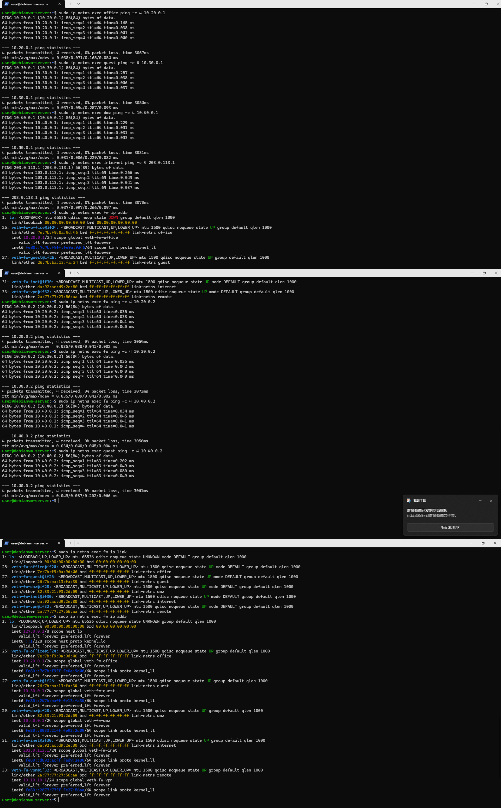

### 拓扑搭建说明
#### 1. 拓扑搭建步骤
本实验采用Linux network namespace构建虚拟企业网络环境，整体步骤如下：

##### （1）创建网络隔离环境
首先创建六个network namespace，分别模拟企业中的不同网络区域：
* fw（防火墙/核心网关）
* office（办公网）
* guest（访客网）
* dmz（对外服务区）
* internet（外部网络）
* remote（远程用户）

各namespace之间默认相互隔离。

##### （2）构建二层链路（veth）
使用 veth pair 虚拟网卡对连接各子网与防火墙 fw：
* office <-> fw
* guest <-> fw
* dmz <-> fw
* internet <-> fw
* remote <-> fw

每一对 veth 相当于一根“虚拟网线”，用于模拟真实物理链路。

##### （3）配置IP地址
为每个接口分配对应网段IP地址：
* office：10.20.0.0/24
* guest：10.30.0.0/24
* dmz：10.40.0.0/24
* internet：203.0.113.0/24
* vpn：10.10.10.0/24

fw在每个网段中分别配置对应网关地址（.1），各主机使用 .2 或指定地址。

##### （4）配置路由关系
各子网主机默认网关统一指向fw：
* office -> 10.20.0.1
* guest -> 10.30.0.1
* dmz -> 10.40.0.1
* internet -> 203.0.113.1
* remote -> 10.10.10.1

同时在 fw 上开启 IP 转发功能，使其具备三层路由能力。

##### （5）启动接口与系统配置
所有network namespace中的loopback接口与veth接口均被启用，确保链路处于UP状态，从而实现正常通信。
#### 2. 验证方法
为验证拓扑搭建的正确性，采用以下测试方式：
##### （1）基础连通性测试
使用 ping 命令测试各子网主机到 fw 的连通性：
* office -> fw（10.20.0.1）
* guest -> fw（10.30.0.1）
* dmz -> fw（10.40.0.1）
* internet -> fw（203.0.113.1）

若均能收到ICMP Reply，说明：
* veth链路建立成功
* IP配置正确
* 接口处于UP状态


##### （2）防火墙节点检查
在 fw 节点执行以下命令验证配置：
* `ip addr`：检查各接口IP是否正确绑定
* `ip link`：检查接口状态是否为UP
* `ip route`：检查路由表是否完整

##### （3）综合验证
通过跨网段ping（如office -> dmz）进一步验证fw的三层转发能力是否正常，为后续NAT、防火墙策略与VPN配置提供基础。

## 四、第二部分：防火墙策略实现
> **为配置方便以及集中配置，后续有关防火墙的操作均会修改此处内容，即此处配置包含后面所有内容**
### 脚本说明
下面是firewall.sh的说明，脚本详见[firewall.sh](./firewall.sh)
```bash
#!/bin/bash
set -e

FW=fw

echo "[1] 清空旧规则..."
sudo ip netns exec $FW iptables -F
sudo ip netns exec $FW iptables -t nat -F
sudo ip netns exec $FW iptables -X
sudo ip netns exec $FW iptables -t nat -X

echo "[2] 默认策略（最小权限）..."
sudo ip netns exec $FW iptables -P FORWARD DROP

echo "[3] 允许已建立连接（必须最先）..."
sudo ip netns exec $FW iptables -A FORWARD \
  -m conntrack --ctstate ESTABLISHED,RELATED \
  -j ACCEPT

# =========================
# OFFICE区域策略
# =========================
echo "[4] office -> dmz:8080允许..."
sudo ip netns exec $FW iptables -A FORWARD \
  -s 10.20.0.0/24 -d 10.40.0.2 \
  -p tcp --dport 8080 \
  -m conntrack --ctstate NEW \
  -j ACCEPT

echo "[5] office -> dmz:22拒绝 + LOG..."
sudo ip netns exec $FW iptables -A FORWARD \
  -s 10.20.0.0/24 -d 10.40.0.2 \
  -p tcp --dport 22 \
  -j LOG --log-prefix "OFFICE-TO-DMZ-SSH: "

sudo ip netns exec $FW iptables -A FORWARD \
  -s 10.20.0.0/24 -d 10.40.0.2 \
  -p tcp --dport 22 \
  -j REJECT

echo "[6] office -> internet允许..."
sudo ip netns exec $FW iptables -A FORWARD \
  -s 10.20.0.0/24 -o veth-fw-inet \
  -m conntrack --ctstate NEW,ESTABLISHED,RELATED \
  -j ACCEPT

# =========================
# GUEST区域策略
# =========================
echo "[7] guest -> office拒绝 + LOG..."
sudo ip netns exec fw iptables -A FORWARD \
  -s 10.30.0.0/24 -d 10.20.0.0/24 \
  -m limit --limit 5/min --limit-burst 10 \
  -j LOG --log-prefix "GUEST-TO-OFFICE: " \
  --log-level 4 # 第四部分补充：日志限制

sudo ip netns exec $FW iptables -A FORWARD \
  -s 10.30.0.0/24 -d 10.20.0.0/24 \
  -j REJECT

echo "[8] guest -> dmz拒绝 + LOG..."
sudo ip netns exec fw iptables -A FORWARD \
  -s 10.30.0.0/24 -d 10.40.0.0/24 \
  -m limit --limit 5/min --limit-burst 10 \
  -j LOG --log-prefix "GUEST-TO-DMZ: " \
  --log-level 4 # 第四部分补充：日志限制

sudo ip netns exec $FW iptables -A FORWARD \
  -s 10.30.0.0/24 -d 10.40.0.0/24 \
  -j REJECT

echo "[9] guest -> internet允许..."
sudo ip netns exec $FW iptables -A FORWARD \
  -s 10.30.0.0/24 -o veth-fw-inet \
  -m conntrack --ctstate NEW,ESTABLISHED,RELATED \
  -j ACCEPT

# =========================
# DMZ区域策略
# =========================
echo "[10] dmz -> internet允许..."
sudo ip netns exec $FW iptables -A FORWARD \
  -s 10.40.0.0/24 -o veth-fw-inet \
  -m conntrack --ctstate NEW,ESTABLISHED,RELATED \
  -j ACCEPT

echo "[11] internet -> dmz:22拒绝..."
sudo ip netns exec $FW iptables -A FORWARD \
  -i veth-fw-inet -d 10.40.0.2 \
  -p tcp --dport 22 \
  -j REJECT

# =========================
# INTERNET -> 内网隔离
# =========================
echo "[12] internet -> office拒绝..."
sudo ip netns exec fw iptables -A FORWARD \
  -i veth-fw-inet -d 10.20.0.0/24 \
  -m limit --limit 5/min --limit-burst 10  \
  -j LOG --log-prefix "INET-TO-OFFICE: " \
  --log-level 4 # 第四部分补充：日志限制

sudo ip netns exec $FW iptables -A FORWARD \
  -i veth-fw-inet -d 10.20.0.0/24 \
  -j REJECT

echo "[13] internet -> guest拒绝..."
sudo ip netns exec $FW iptables -A FORWARD \
  -i veth-fw-inet -d 10.30.0.0/24 \
  -j REJECT

# =========================
# NAT区域
# =========================
echo "[14] SNAT（内网访问外网）..."
sudo ip netns exec $FW iptables -t nat -A POSTROUTING \
  -s 10.20.0.0/24 -o veth-fw-inet -j MASQUERADE

sudo ip netns exec $FW iptables -t nat -A POSTROUTING \
  -s 10.30.0.0/24 -o veth-fw-inet -j MASQUERADE

sudo ip netns exec $FW iptables -t nat -A POSTROUTING \
  -s 10.40.0.0/24 -o veth-fw-inet -j MASQUERADE

echo "[15] DNAT（外网访问DMZ:8080）...（第六部分修改版）"
sudo ip netns exec $FW iptables -A FORWARD \
  -i veth-fw-inet -o veth-fw-dmz \
  -p tcp --dport 8080 -d 10.40.0.2 \
  -m conntrack --ctstate NEW \
  -m recent --rcheck --seconds 60 --hitcount 10 --name DMZ8080 \
  -j REJECT --reject-with tcp-reset

sudo ip netns exec $FW iptables -A FORWARD \
  -i veth-fw-inet -o veth-fw-dmz \
  -p tcp --dport 8080 -d 10.40.0.2 \
  -m conntrack --ctstate NEW \
  -m recent --set --name DMZ8080 \
  -j ACCEPT

# =========================
# VPN区域策略（第三部分）
# =========================
echo "[16] VPN -> office"
sudo ip netns exec $FW iptables -A FORWARD \
  -i wg0 -o veth-fw-office \
  -s 10.10.10.0/24 -d 10.20.0.0/24 \
  -m conntrack --ctstate NEW,ESTABLISHED,RELATED \
  -j ACCEPT

echo "[17] VPN -> dmz 8080"
sudo ip netns exec $FW iptables -A FORWARD \
  -i wg0 -o veth-fw-dmz \
  -d 10.40.0.2 -p tcp --dport 8080 \
  -m conntrack --ctstate NEW,ESTABLISHED,RELATED \
  -j ACCEPT

echo "[18] VPN -> dmz ssh reject"
sudo ip netns exec $FW iptables -A FORWARD \
  -i wg0 -o veth-fw-dmz \
  -d 10.40.0.2 -p tcp --dport 22 \
  -j LOG --log-prefix "VPN-TO-DMZ-SSH: "

sudo ip netns exec $FW iptables -A FORWARD \
  -i wg0 -o veth-fw-dmz \
  -d 10.40.0.2 -p tcp --dport 22 \
  -j REJECT

echo "[19] VPN其余拒绝"
sudo ip netns exec $FW iptables -A FORWARD \
  -i wg0 \
  -m limit --limit 5/min --limit-burst 10 \
  -j LOG --log-prefix "VPN-DENY: "\
  --log-level 4 # 第四部分补充：日志限制

sudo ip netns exec $FW iptables -A FORWARD \
  -i wg0 \
  -j REJECT

echo "[20] 完成"
```

### 访问控制矩阵
| 来源 | 目标 | 预期结果 | 实际结果 | 截图 |
|:-----|:-----|:---------|:---------|:-----|
| office | dmz:8080 | 成功 | 成功 |  |
| office | dmz:22 | 失败+LOG | 失败+LOG |  |
| guest | office:任意 | 失败+LOG | 失败+LOG |  |
| guest | dmz:8080 | 失败+LOG | 失败+LOG | 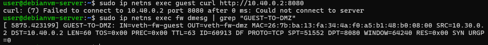 |
| guest | internet:任意 | 成功 | 成功 |  |
| office | internet:任意 | 成功 | 成功 | 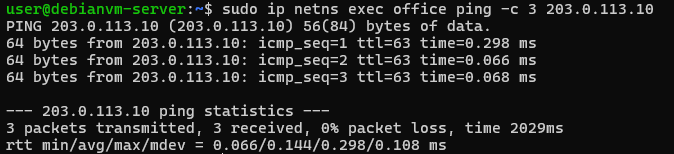 |
| internet | fw公网IP:8080 | 成功(DNAT到dmz) | 成功(DNAT到dmz) | 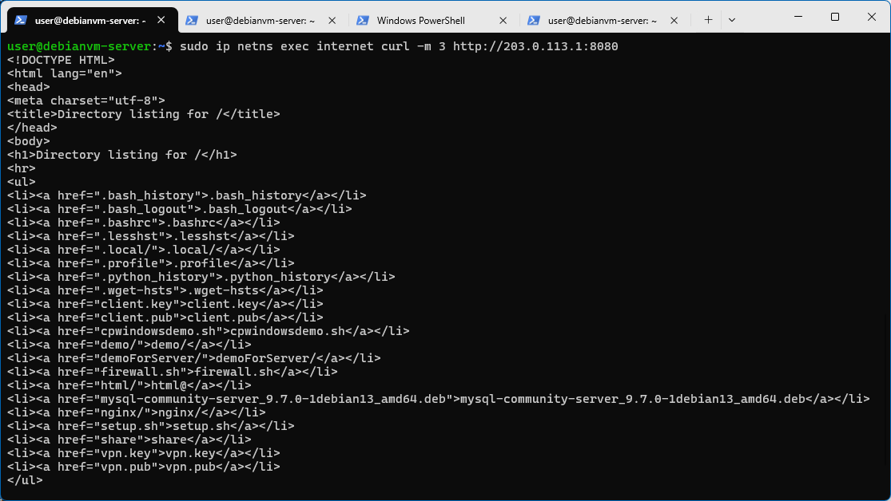 |
| internet | dmz:22 | 失败 | 失败 | 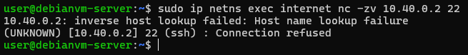 |

### 访问控制情况测试截图

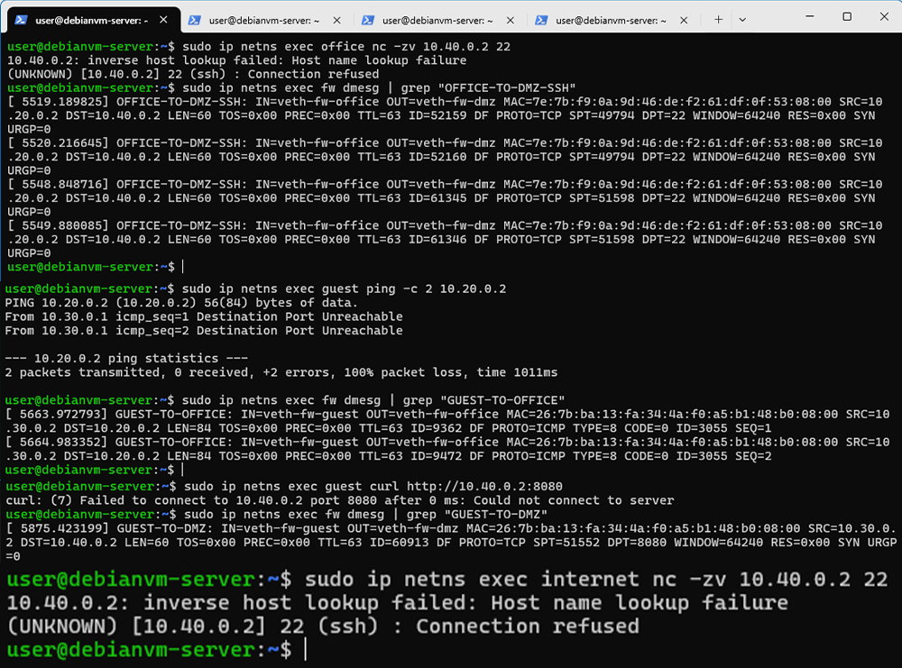

### 规则列表截图
* 防火墙规则列表

* NAT规则列表


### 规则设计说明
#### 1. 设计原则
本防火墙采用默认拒绝（Default Drop）策略，仅允许明确授权的通信。
#### 2. 规则顺序设计
规则顺序遵循以下原则：
1. ESTABLISHED/RELATED优先放行（保证回包正常）
2. 具体业务允许规则（office -> dmz:8080）
3. 拒绝+LOG规则（安全审计）
4. NAT规则（SNAT / DNAT）
#### 3. REJECT vs DROP
* REJECT：立即返回错误，便于调试与实验验证
* DROP：静默丢弃，用于生产环境隐藏目标

本实验中：使用REJECT便于观察访问结果

#### 4. NAT设计说明
* SNAT（MASQUERADE）：实现内网访问外网
* DNAT：实现外网访问DMZ Web服务
* NAT仅作用于fw的公网接口（veth-fw-inet）

## 五、第三部分：VPN远程接入
此部分使用WireGuard实现远程用户（remote）安全接入企业内网（office与dmz）。
### fw端WireGuard配置解析
* 配置文件（详见[vpn-fw.conf](./vpn-fw.conf)）
```ini
[Interface]
Address = 10.10.10.4/24
PrivateKey = wD8M4E+M01JCKqJoMhDiqbnNq9551VFKOKtsF4282U0=
ListenPort = 51820

[Peer]
PublicKey = nAf7kVh8pDHy3VxZMZoP3Enr84ACZ5k7/XDTY1RVxDY=
AllowedIPs = 10.10.10.3/32
PersistentKeepalive = 25
```

* 配置文件解析
  |配置|作用|
  |---|---|
  |`Address = 10.10.10.4/24`|VPN网段中fw的地址|
  |`PrivateKey`|fw用于加密/解密VPN数据|
  |`ListenPort = 51820`|监听UDP 51820等待remote连接|
  |`PublicKey`|remote的身份公钥|
  |`AllowedIPs = 10.10.10.3/32`|只允许remote这个VPN IP|
  |`PersistentKeepalive = 25`|防止NAT超时断连|

* `AllowedIPs`设计思路
此配置文件仅用于在服务端进行VPN流量的解密与转发，因此仅需监听来自客户端（remote）的流量，所以`AllowedIPs`仅监听remote的IP即可。

### remote端WireGuard配置解析
* 配置文件（详见[vpn-remote.conf](./vpn-remote.conf)）
```ini
[Interface]
Address = 10.10.10.3/24
PrivateKey = IHifBFZiUXkOU801Nf9a6tSlXnkmjc4YrLT+7ZFR1Ww=

[Peer]
PublicKey = eNF0bgsPv19aY9nrv0cP7PTBGB/qgw8bJp5RnUF8gxk=
Endpoint = 10.10.10.1:51820
AllowedIPs = 10.10.10.1/32,10.20.0.0/24,10.40.0.0/24
PersistentKeepalive = 25
```

* 配置文件解析
  |配置|作用|
  |---|---|
  |`Address = 10.10.10.3/24`|remote在VPN中的地址|
  |`PrivateKey`|remote身份标识|
  |`PublicKey`|fw身份验证|
  |`Endpoint`|fw的公网/可达IP|
  |`AllowedIPs`|指定哪些流量走VPN|

* `AllowedIPs`设计思路
由于区域vpn的IP是10.10.10.1，而VPN流量均来自此接口，所以需要监听；而按照要求仅允许10.20.0.0/24,10.40.0.0/24这些地址通过，所以仅允许这些IP通过。

### 截图与测试结果
* VPN隧道状态
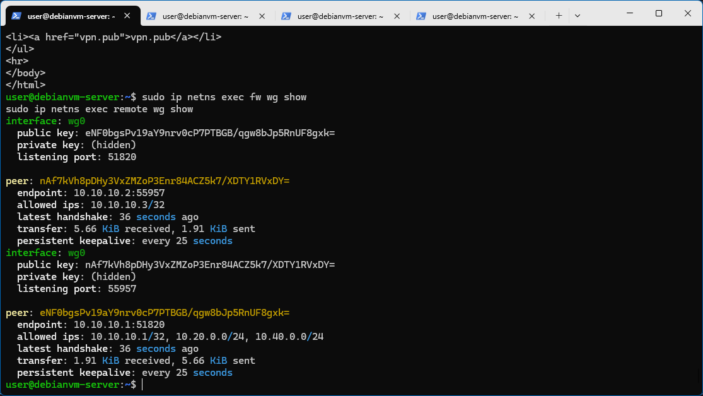

* 测试VPN访问成功
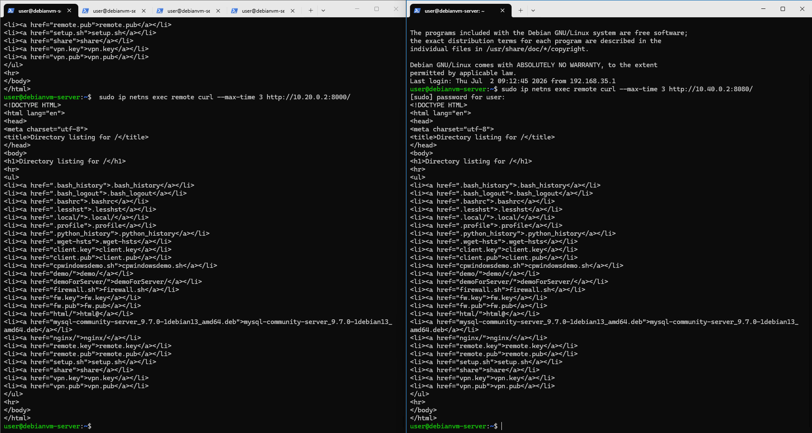

* 测试VPN访问失败
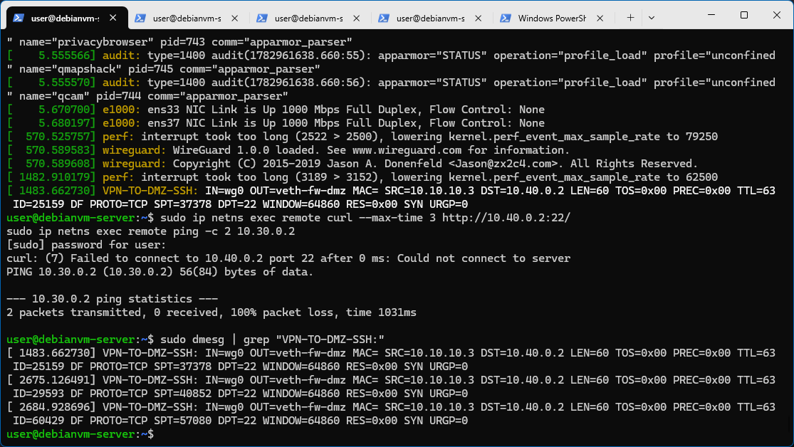

## 六、第四部分：安全审计与日志分析
### LOG规则说明
```bash
sudo ip netns exec fw iptables -I FORWARD \
  -s 10.30.0.0/24 -d 10.20.0.0/24 \
  -m limit --limit 5/min --limit-burst 10 \
  -j LOG --log-prefix "GUEST-TO-OFFICE: " \
  --log-level 4 # 第四部分补充：日志限制
```
> 在不影响后续防火墙策略执行的前提下，对“访客访问办公网”的异常行为进行审计记录。
`-m limit --limit 5/min --limit-burst 10`通过对日志生成进行速率限制，每分钟最多记录5条，突发上限10条，用于防止日志洪泛攻击。
`--log-prefix "GUEST-TO-OFFICE: "`为日志添加统一前缀，便于后续快速筛选与分类分析。
`--log-level 4`设置日志级别为warning级别，便于系统日志分类管理。

```bash
sudo ip netns exec fw iptables -I FORWARD \
  -s 10.30.0.0/24 -d 10.40.0.0/24 \
  -m limit --limit 5/min --limit-burst 10 \
  -j LOG --log-prefix "GUEST-TO-DMZ: " \
  --log-level 4 # 第四部分补充：日志限制
```
> 用于检测访客是否尝试访问DMZ敏感资源，并提供审计追踪能力。该规则用于记录访客网（guest）访问DMZ区域时的所有流量行为，用于安全审计与异常访问分析。
`-m limit --limit 5/min --limit-burst 10`通过对日志生成进行速率限制，每分钟最多记录5条，突发上限10条，用于防止日志洪泛攻击。
`--log-prefix "GUEST-TO-DMZ: "`为日志添加统一前缀，便于后续快速筛选与分类分析。
`--log-level 4`设置日志级别为warning级别，便于系统日志分类管理。

```bash
sudo ip netns exec $FW iptables -A FORWARD \
  -i wg0 -o veth-fw-dmz \
  -d 10.40.0.2 -p tcp --dport 22 \
  -j LOG --log-prefix "VPN-TO-DMZ-SSH: "
```
> 用于监控VPN用户是否尝试访问被禁止的SSH管理端口，属于高敏感审计规则。该规则用于记录VPN用户尝试访问DMZ的SSH服务（22端口）的行为。

```bash
sudo ip netns exec fw iptables -I FORWARD \
  -i veth-fw-inet -d 10.20.0.0/24 \
  -m limit --limit 5/min --limit-burst 10  \
  -j LOG --log-prefix "INET-TO-OFFICE: " \
  --log-level 4 # 第四部分补充：日志限制
```
> 用于检测外部攻击或非法访问内网办公资源的行为。该规则用于记录外网访问办公网的行为。
`-m limit --limit 5/min --limit-burst 10`通过对日志生成进行速率限制，每分钟最多记录5条，突发上限10条，用于防止日志洪泛攻击。
`--log-prefix "GUEST-TO-DMZ: "`为日志添加统一前缀，便于后续快速筛选与分类分析。
`--log-level 4`设置日志级别为warning级别，便于系统日志分类管理。

```bash
sudo ip netns exec $FW iptables -A FORWARD \
  -i wg0 \
  -m limit --limit 5/min --limit-burst 10 \
  -j LOG --log-prefix "VPN-DENY: "\
  --log-level 4 # 第四部分补充：日志限制
```
> 作为VPN访问控制的兜底审计规则，用于记录所有未授权访问行为，是VPN安全策略的最后一道审计防线。该规则用于记录VPN用户的所有未匹配允许规则的非法访问行为。
`-m limit --limit 5/min --limit-burst 10`通过对日志生成进行速率限制，每分钟最多记录5条，突发上限10条，用于防止日志洪泛攻击。
`--log-prefix "GUEST-TO-DMZ: "`为日志添加统一前缀，便于后续快速筛选与分类分析。
`--log-level 4`设置日志级别为warning级别，便于系统日志分类管理。

### 日志分析
```text
[ 7503.129394] GUEST-TO-OFFICE: IN=veth-fw-guest OUT=veth-fw-office MAC=26:7b:ba:13:fa:34:4a:f0:a5:b1:48:b0:08:00 SRC=10.30.0.2 DST=10.20.0.2 LEN=60 TOS=0x00 PREC=0x00 TTL=63 ID=65501 DF PROTO=TCP SPT=47176 DPT=8000 WINDOW=64240 RES=0x00 SYN URGP=0
[ 7503.157878] GUEST-TO-DMZ: IN=veth-fw-guest OUT=veth-fw-dmz MAC=26:7b:ba:13:fa:34:4a:f0:a5:b1:48:b0:08:00 SRC=10.30.0.2 DST=10.40.0.2 LEN=60 TOS=0x00 PREC=0x00 TTL=63 ID=3379 DF PROTO=TCP SPT=45700 DPT=8080 WINDOW=64240 RES=0x00 SYN URGP=0
[ 7503.184606] VPN-TO-DMZ-SSH: IN=wg0 OUT=veth-fw-dmz MAC= SRC=10.10.10.3 DST=10.40.0.2 LEN=60 TOS=0x00 PREC=0x00 TTL=63 ID=57133 DF PROTO=TCP SPT=39316 DPT=22 WINDOW=64860 RES=0x00 SYN URGP=0
[ 7503.211230] INET-TO-OFFICE: IN=veth-fw-inet OUT=veth-fw-office MAC=da:92:ac:d9:2e:80:a2:e3:1c:58:f0:39:08:00 SRC=203.0.113.10 DST=10.20.0.2 LEN=60 TOS=0x00 PREC=0x00 TTL=63 ID=28366 DF PROTO=TCP SPT=56966 DPT=8000 WINDOW=64240 RES=0x00 SYN URGP=0
```
1. GUEST TO OFFICE
  * 源IP：10.30.0.2:47176
  * 目的IP：10.20.0.2:8000

2. GUEST TO DMZ
  * 源IP：10.30.0.2:45700
  * 目的IP：10.40.0.2:8080

3. VPN TO DMZ SSH
  * 源IP：10.10.10.3:39316
  * 目的IP：10.40.0.2:22

4. INET TO OFFICE
  * 源IP：203.0.113.10:56966
  * 目的IP：10.20.0.2:8000

### 日志统计表
| 事件类型 | 触发次数 | 实际记录日志数 | 是否生效 |
|:--------|:---------|:--------------|:---------|
| guest→office | 1 | 2 | 是 |
| guest→dmz | 1 | 2 | 是 |
| VPN→dmz:22 | 1 | 5 | 是 |
| internet→office | 1 | 1 | 是 |
| VPN其他违规 | 0 | 0 | 是 |

### 日志情况图
* 日志实时监控
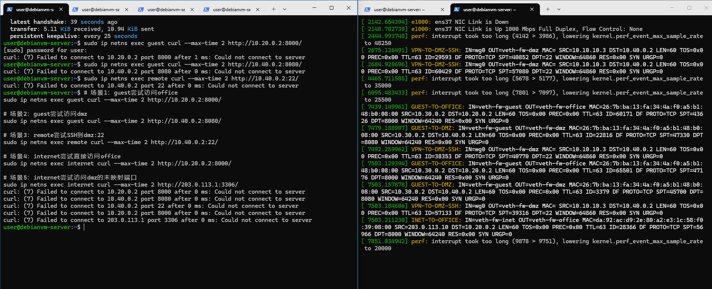

* 日志统计结果
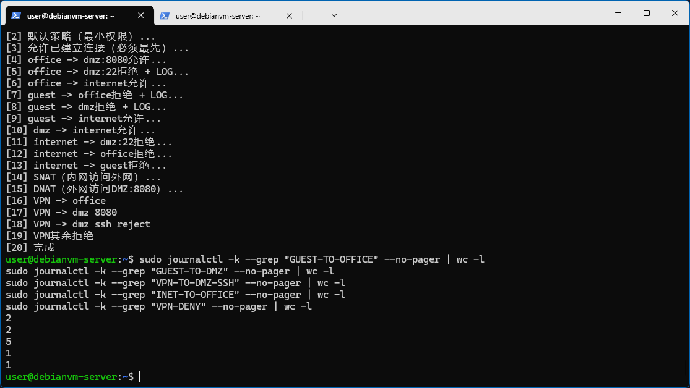

### 日志分析报告
1. 从日志中能获取哪些安全信息？
> 日志系统在本实验中用于记录网络访问控制事件，通过iptables的LOG规则对不同类型的非法访问进行标记，并结合dmesg或journalctl进行统一分析。从日志中可以获取攻击源IP、目标IP、协议类型以及端口等关键信息，从而帮助管理员定位异常访问行为。

2. LOG规则为什么要放在REJECT之前？
> LOG规则必须放在REJECT之前，是因为iptables是按顺序匹配规则的。如果REJECT先执行，则数据包会被直接丢弃，LOG规则将无法记录该事件，从而导致安全审计缺失。

3. 速率限制如何防止日志洪水攻击？
> 通过对LOG规则设置速率限制，可以有效防止日志洪水攻击。当攻击者频繁触发拒绝规则时，limit模块会限制日志生成频率，从而避免系统日志被大量无效信息占满。

4. 不同log-prefix的作用是什么？
> 不同log-prefix用于区分不同类型的安全事件，例如GUEST-TO-OFFICE表示访客访问办公网行为，VPN-DENY表示VPN用户的非法访问行为。通过前缀可以快速分类日志，提高安全分析效率。

## 七、第五部分：攻防演练
此部分同[analysis.md](./analysis.md)
### 边界测试
选择dmz:8080对外开放
* 风险分析
dmz:8080作为Web服务对外开放，虽然满足业务访问需求，但也存在明显安全风险。首先，攻击者可以通过持续连接或并发请求对该端口发起拒绝服务攻击（DoS），导致服务资源耗尽。其次，Web服务本身可能存在漏洞（如SQL注入、XSS或未授权访问），攻击者可直接利用公网入口进行入侵。由于该端口对外暴露，一旦没有连接限制或访问控制策略，将极大扩大攻击面。此外，默认iptables规则仅进行端口过滤，无法限制单IP连接数量，因此容易被恶意用户利用进行高频访问或扫描行为，增加系统负载并降低服务可用性。

* 改进方案
限制单IP最大连接次数，首先记录访问dmz:8080的源IP行为，如果60秒内访问超过10次则拒绝连接，对应配置如下：
```bash
sudo ip netns exec $FW iptables -A FORWARD \
  -i veth-fw-inet -o veth-fw-dmz \
  -p tcp --dport 8080 -d 10.40.0.2 \
  -m conntrack --ctstate NEW \
  -m recent --rcheck --seconds 60 --hitcount 10 --name DMZ8080 \
  -j REJECT --reject-with tcp-reset

sudo ip netns exec $FW iptables -A FORWARD \
  -i veth-fw-inet -o veth-fw-dmz \
  -p tcp --dport 8080 -d 10.40.0.2 \
  -m conntrack --ctstate NEW \
  -m recent --set --name DMZ8080 \
  -j ACCEPT
```

* 改进后压测结果


### 截图展示
#### 攻击方
* 扫描office网段


* 尝试绕过防火墙访问dmz:22


#### 防御方
* 日志证据


* 规则计数器


### 高级任务
#### 截图记录
* 4个位置抓包截图
remote抓包


fw抓包


* conntrack记录截图


#### 包变化对比表
| 阶段 | 观察位置 | 源地址 | 目的地址 | 协议 | 备注 |
|:-----|:---------|:-------|:---------|:-----|:-----|
| 1 | remote wg0 | 10.10.10.3 | 10.40.0.2 | TCP | 封装前 |
| 2 | fw wg0 | 10.10.10.3 | 10.40.0.2 | TCP | 解封装后 |
| 3 | fw veth-fw-dmz | 10.40.0.2 | 10.10.10.3 | TCP | 转发到dmz |
| 4 | conntrack | 10.10.10.1 | 10.10.10.2 | UDP | 连接跟踪记录 |

#### 分析报告
该实验展示了VPN流量在Linux网络栈中的完整处理过程。remote端发出的请求首先经过WireGuard加密封装，在wg0接口上表现为加密UDP流量。当数据到达fw节点后，WireGuard驱动首先进行解密，还原为原始IP数据包，此时防火墙的FORWARD链开始对其进行规则匹配。在允许规则匹配成功后，数据包通过veth接口被转发至DMZ网络。整个过程中，conntrack模块负责记录连接状态，使返回流量能够被自动放行，实现状态防火墙功能。该实验清晰展示了VPN“加密隧道—解密处理—策略过滤—转发”的完整路径，同时验证了iptables在不同网络层面的控制能力。通过多点抓包，可以直观观察到数据包在不同接口之间的变化过程，从而理解VPN与防火墙协同工作的机制，便于后期进行高级操作保证VPN与防火墙协同工作的正常进行，同时更加深入了解VPN的工作原理。

### 问题回答
#### 攻击方
1. 扫描office网段失败原因
> 该攻击失败的原因是防火墙在FORWARD链中对guest->office的流量进行了严格限制。根据策略设计，guest网段（10.30.0.0/24）被禁止访问office网段（10.20.0.0/24），并且匹配规则中同时配置了LOG + REJECT动作，直接丢弃或拒绝报文。因此即使ICMP请求能够发出，也会在fw层被拦截，无法到达目标主机，从而无法获得任何存活节点信息。

2. 尝试绕过防火墙访问dmz:22失败原因
> 该攻击失败的根本原因是防火墙基于“五元组规则”（源IP、目标IP、协议、目标端口、状态）进行匹配，而不是仅依赖源端口。策略中明确禁止guest网络访问DMZ的SSH服务（22端口），并通过REJECT明确拒绝连接。因此攻击者无论如何伪造源端口，均无法改变目标端口匹配结果，连接请求都会被防火墙直接丢弃。

3. 攻击者能否伪造源地址为`10.10.10.2`的包来访问内网？
> 虽然攻击者可以伪造源IP为 10.10.10.2，但无法建立真实VPN隧道。WireGuard使用基于密钥的加密认证机制，所有数据包必须经过有效握手才能被接受。同时防火墙只允许wg0接口上经过认证的流量进入内网。因此单纯伪造IP地址无法通过加密验证，也无法被内网设备接受。

4. 攻击者能否从REJECT和DROP的不同表现判断目标是否存在？
> 攻击者可以一定程度判断目标是否存在：REJECT：会返回ICMP/错误响应（如connection refused），DROP：无任何响应（超时）。因此REJECT可推测目标存在但被拒绝访问,DROP无法判断目标是否存在（更隐蔽）

#### 防御方
1. 从日志的哪些字段可以判断这是来自guest的攻击？
> 可以通过日志中的`SRC`字段、入接口`IN`字段以及`log-prefix`共同判断攻击来源。例如`SRC=10.30.0.0/24`或`IN=veth-fw-guest`可明确表明流量来自guest网络，同时`GUEST-TO-OFFICE`或`GUEST-TO-DMZ`等前缀进一步标识攻击类型。三者结合可以精准定位攻击源、攻击路径及目标区域，从而实现完整的攻击溯源分析，便于安全人员定位以及确定攻击情况，指定适合的防御措施，保证网络中设备安全和数据的安全，防止被不法利用。

2. 如果日志中`IN=veth-fw-guest OUT=veth-fw-office`，说明了什么？
> 当日志显示`IN=veth-fw-guest OUT=veth-fw-office`时，说明数据包从guest网络进入防火墙并试图转发至office网络。这表示访客正在尝试访问办公网资源，属于典型的越权访问行为。由于策略中已禁止guest访问office，该流量会被REJECT规则拦截，同时记录日志，用于后续安全审计与攻击分析，定位攻击源，建立攻击链路，确保网络中设备安全和数据安全，并指定适合的防御措施，禁止更多的越权访问的情况出现。

3. 为什么看到大量相同来源的日志应该引起警惕？
> 当同一来源产生大量相同类型日志时，通常意味着存在扫描行为或自动化攻击工具在持续探测网络资源，例如端口扫描或地址枚举。同时也可能是错误配置导致的重复访问请求。这种高频日志会对系统审计造成压力，因此通常需要结合限速策略进行控制，避免日志洪泛攻击，并作为入侵检测的重要指标，及时指定相关防御措施，保证网络服务正常进行。

4. 哪条规则拦截了guest访问office？
> 在guest访问office的场景中，真正执行拦截的是REJECT规则，而LOG仅用于记录行为。REJECT会直接返回拒绝响应并终止连接，从而阻止数据包继续转发到目标网络。如果仅有LOG而没有REJECT，流量仍可能继续被后续规则处理。因此REJECT是访问控制的核心执行点，而LOG属于辅助审计机制，用于安全分析，同时规则适配为自上到下，适配到对应的规则即终止（LOG除外）。

5. 如果guest→office的规则计数很高，说明了什么？
> 当iptables规则计数器显示guest→office相关规则命中次数较高时，说明该方向存在大量访问尝试，可能是扫描行为或持续攻击流量。计数增长代表防火墙持续拦截该类请求，说明访问控制规则正在生效，同时也提示该流量来源异常，需要进一步进行安全分析或加强限速与封禁策略，以保证网络中设备正常运行不会因此导致核心设备宕机以及内部数据不会被泄露到公网中。

6. REJECT和DROP在安全性上有什么区别？
> REJECT与DROP的主要区别在于反馈机制。REJECT会向发送方返回错误响应，例如ICMP不可达或连接拒绝信息，使攻击者能够判断目标存在但被拒绝访问；而DROP则直接丢弃数据包，不返回任何响应，使攻击者无法确认目标是否存在。因此DROP在安全性上更高，但调试困难；REJECT更便于排错但信息暴露更多，在生产环境中优先选择DROP，保证网络安全，而在调试环境中优先选择REJECT，便于找寻因配置导致的错误。

## 八、故障排查
此处内容同[troubleshooting](./troubleshooting.md)
### 场景1：DNAT配置存在但外网无法访问（排查与修复）
#### 一、故障现象
> issue：实验指导中写的是`internet`访问`203.0.113.1:8080`失败，即internet->fw:8080失败，解决方法很简单，服务开在fw上就行，我觉得应该改为dmz访问internet时失败才对，**此处将基于内部网络dmz访问internet时失败**

内部网络dmz访问internet时失败，但：
* `iptables -t nat -L`显示DNAT规则存在

说明问题不在服务本身，而在转发路径。

#### 二、排查过程
##### 1️. 检查NAT是否生效
```bash
sudo ip netns exec fw iptables -t nat -L -n -v
sudo ip netns exec fw  conntrack -L | grep 203.0.113.10
```
输出：
```text
user@debianvm-server:~$ sudo ip netns exec fw iptables -t nat -L -n -v
Chain PREROUTING (policy ACCEPT 0 packets, 0 bytes)
 pkts bytes target     prot opt in     out     source               destination

Chain INPUT (policy ACCEPT 0 packets, 0 bytes)
 pkts bytes target     prot opt in     out     source               destination

Chain OUTPUT (policy ACCEPT 0 packets, 0 bytes)
 pkts bytes target     prot opt in     out     source               destination

Chain POSTROUTING (policy ACCEPT 6 packets, 408 bytes)
 pkts bytes target     prot opt in     out     source               destination
    0     0 MASQUERADE  all  --  *      veth-fw-inet  10.20.0.0/24         0.0.0.0/0
    0     0 MASQUERADE  all  --  *      veth-fw-inet  10.30.0.0/24         0.0.0.0/0
    2   120 MASQUERADE  all  --  *      veth-fw-inet  10.40.0.0/24         0.0.0.0/0
user@debianvm-server:~$ sudo ip netns exec fw  conntrack -L | grep 203.0.113.10
conntrack v1.4.8 (conntrack-tools): 1 flow entries have been shown.
```

发现：没有DNAT转换记录->说明包根本没走到NAT或被FORWARD拦截。

##### 2️. 检查 FORWARD 规则
检查：
```bash
sudo iptables -L FORWARD -n -v
```
输出：
```text
user@debianvm-server:~$ sudo ip netns exec fw iptables -L FORWARD -n -v
Chain FORWARD (policy DROP 3 packets, 180 bytes)
 pkts bytes target     prot opt in     out     source               destination
    0     0 ACCEPT     all  --  *      *       0.0.0.0/0            0.0.0.0/0            ctstate RELATED,ESTABLISHED
    0     0 ACCEPT     tcp  --  *      *       10.20.0.0/24         10.40.0.2            tcp dpt:8080 ctstate NEW
    0     0 LOG        tcp  --  *      *       10.20.0.0/24         10.40.0.2            tcp dpt:22 LOG flags 0 level 4 prefix "OFFICE-TO-DMZ-SSH: "
    0     0 REJECT     tcp  --  *      *       10.20.0.0/24         10.40.0.2            tcp dpt:22 reject-with icmp-port-unreachable
    0     0 ACCEPT     all  --  *      veth-fw-inet  10.20.0.0/24         0.0.0.0/0            ctstate NEW,RELATED,ESTABLISHED
    0     0 LOG        all  --  *      *       10.30.0.0/24         10.20.0.0/24         limit: avg 5/min burst 10 LOG flags 0 level 4 prefix "GUEST-TO-OFFICE: "
    0     0 REJECT     all  --  *      *       10.30.0.0/24         10.20.0.0/24         reject-with icmp-port-unreachable
    0     0 LOG        all  --  *      *       10.30.0.0/24         10.40.0.0/24         limit: avg 5/min burst 10 LOG flags 0 level 4 prefix "GUEST-TO-DMZ: "
    0     0 REJECT     all  --  *      *       10.30.0.0/24         10.40.0.0/24         reject-with icmp-port-unreachable
    0     0 ACCEPT     all  --  *      veth-fw-inet  10.30.0.0/24         0.0.0.0/0            ctstate NEW,RELATED,ESTABLISHED
    0     0 REJECT     tcp  --  veth-fw-inet *       0.0.0.0/0            10.40.0.2            tcp dpt:22 reject-with icmp-port-unreachable
    0     0 LOG        all  --  veth-fw-inet *       0.0.0.0/0            10.20.0.0/24         limit: avg 5/min burst 10 LOG flags 0 level 4 prefix "INET-TO-OFFICE: "
    0     0 REJECT     all  --  veth-fw-inet *       0.0.0.0/0            10.20.0.0/24         reject-with icmp-port-unreachable
    0     0 REJECT     all  --  veth-fw-inet *       0.0.0.0/0            10.30.0.0/24         reject-with icmp-port-unreachable
    0     0 REJECT     tcp  --  veth-fw-inet veth-fw-dmz  0.0.0.0/0            10.40.0.2            tcp dpt:8080 ctstate NEW recent: CHECK seconds: 60 hit_count: 10 name: DMZ8080 side: source mask: 255.255.255.255 reject-with tcp-reset
    0     0 ACCEPT     tcp  --  veth-fw-inet veth-fw-dmz  0.0.0.0/0            10.40.0.2            tcp dpt:8080 ctstate NEW recent: SET name: DMZ8080 side: source mask: 255.255.255.255
    0     0 ACCEPT     all  --  wg0    veth-fw-office  10.10.10.0/24        10.20.0.0/24         ctstate NEW,RELATED,ESTABLISHED
    0     0 ACCEPT     tcp  --  wg0    veth-fw-dmz  0.0.0.0/0            10.40.0.2            tcp dpt:8080 ctstate NEW,RELATED,ESTABLISHED
    0     0 LOG        tcp  --  wg0    veth-fw-dmz  0.0.0.0/0            10.40.0.2            tcp dpt:22 LOG flags 0 level 4 prefix "VPN-TO-DMZ-SSH: "
    0     0 REJECT     tcp  --  wg0    veth-fw-dmz  0.0.0.0/0            10.40.0.2            tcp dpt:22 reject-with icmp-port-unreachable
    0     0 LOG        all  --  wg0    *       0.0.0.0/0            0.0.0.0/0            limit: avg 5/min burst 10 LOG flags 0 level 4 prefix "VPN-DENY: "
    0     0 REJECT     all  --  wg0    *       0.0.0.0/0            0.0.0.0/0            reject-with icmp-port-unreachable
```

发现问题：
* DNAT后的流量未被显式允许
* FORWARD默认策略为DROP

##### 3️. 抓包定位
```bash
sudo ip netns exec internet tcpdump port 8080
sudo ip netns exec dmz tcpdump port 8080
```
输出：
```text
user@debianvm-server:~$ sudo ip netns exec internet tcpdump port 8080
tcpdump: verbose output suppressed, use -v[v]... for full protocol decode
listening on veth-inet, link-type EN10MB (Ethernet), snapshot length 262144 bytes
^C
0 packets captured
0 packets received by filter
0 packets dropped by kernel
user@debianvm-server:~$ sudo ip netns exec dmz tcpdump port 8080
[sudo] password for user:
tcpdump: verbose output suppressed, use -v[v]... for full protocol decode
listening on veth-dmz, link-type EN10MB (Ethernet), snapshot length 262144 bytes
^C23:04:00.484633 IP 10.40.0.2.41834 > 203.0.113.10.http-alt: Flags [S], seq 3549287420, win 64240, options [mss 1460,sackOK,TS val 853261120 ecr 0,nop,wscale 7], length 0
23:04:01.510115 IP 10.40.0.2.41834 > 203.0.113.10.http-alt: Flags [S], seq 3549287420, win 64240, options [mss 1460,sackOK,TS val 853262145 ecr 0,nop,wscale 7], length 0

2 packets captured
2 packets received by filter
0 packets dropped by kernel
```
结果：
* dmz口能看到SYN
* inte口完全没有流量

结论：包在fw被FORWARD丢弃

#### 三、根本原因
DNAT只修改目标地址，不会自动放行转发流量
FORWARD链缺少匹配`veth-fw-dmz->veth-fw-inte`的放行规则

#### 四、修复方法

```bash
sudo ip netns exec fw iptables -A FORWARD \
  -s 10.40.0.0/24 -o veth-fw-inet \
  -m conntrack --ctstate NEW,ESTABLISHED,RELATED \
  -j ACCEPT
```

#### 五、验证结果

* dmz->203.0.113.10:8080 成功访问
* internet tcpdump能看到请求
* conntrack出现NAT映射记录

情况图片


---

### 场景2：VPN握手正常但业务失败（AllowedIPs/路由问题）
#### 一、现象
* `wg show`显示handshake正常
* `remote ping 10.40.0.2`失败
* fw无日志输出

#### 二、可能原因分析
##### 原因1：AllowedIPs错误
```
AllowedIPs = 10.20.0.0/24
```

结果：
* VPN不转发 10.40.0.0/24
* 包根本不进入隧道

##### 原因2：FORWARD未放行VPN流量
检查：
```bash
sudo ip netns exec fw iptables -L FORWARD
```

查看终端输出发现fw中没有相关规则
结果：包进入fw但被DROP

#### 三、快速定位方法

```bash
tcpdump -ni wg0
tcpdump -ni veth-fw-dmz
conntrack -L | grep 10.10.10.2
```

判断链路断点：
* wg0没包->VPN问题
* wg0有包但dmz无->FORWARD问题
* dmz有包但无返回->路由问题

#### 四、修复方法
##### AllowedIPs修复
```
AllowedIPs = 10.20.0.0/24, 10.40.0.0/24
```
##### FORWARD修复
```bash
sudo ip netns exec fw iptables -A FORWARD \
  -i wg0 -o veth-fw-dmz \
  -j ACCEPT
```
* 过程展示


---

### 场景3：去掉ESTABLISHED,RELATED后TCP连接失败
#### 一、现象
* 三次握手的第一个SYN包能通过
* 服务器的SYN-ACK回包被防火墙拦截
* curl命令超时

#### 二、排查步骤
* 抓包证明SYN-ACK被拦截
在两个终端分别执行下面的指令
```bash
sudo ip netns exec fw tcpdump -ni veth-fw-dmz tcp port 8080
sudo ip netns exec fw tcpdump -ni veth-fw-inet tcp port 8080
```
终端输出如下
```text
user@debianvm-server:~$ sudo ip netns exec fw tcpdump -ni veth-fw-dmz tcp port 8080
tcpdump: verbose output suppressed, use -v[v]... for full protocol decode
listening on veth-fw-dmz, link-type EN10MB (Ethernet), snapshot length 262144 bytes
^C23:58:44.165881 IP 10.40.0.2.8080 > 10.10.10.3.49274: Flags [S.], seq 3580400780, ack 3907889820, win 65160, options [mss 1460,sackOK,TS val 1772813409 ecr 549067525,nop,wscale 7], length 0
23:58:51.689051 IP 10.10.10.3.36576 > 10.40.0.2.8080: Flags [S], seq 1272313532, win 64860, options [mss 1380,sackOK,TS val 549107689 ecr 0,nop,wscale 7], length 0
23:58:51.689109 IP 10.40.0.2.8080 > 10.10.10.3.36576: Flags [S.], seq 3000405910, ack 1272313533, win 65160, options [mss 1460,sackOK,TS val 1772820932 ecr 549107689,nop,wscale 7], length 0
23:58:52.709794 IP 10.40.0.2.8080 > 10.10.10.3.36576: Flags [S.], seq 3000405910, ack 1272313533, win 65160, options [mss 1460,sackOK,TS val 1772821953 ecr 549107689,nop,wscale 7], length 0
23:58:52.710134 IP 10.10.10.3.36576 > 10.40.0.2.8080: Flags [S], seq 1272313532, win 64860, options [mss 1380,sackOK,TS val 549108710 ecr 0,nop,wscale 7], length 0
23:58:52.710149 IP 10.40.0.2.8080 > 10.10.10.3.36576: Flags [S.], seq 3000405910, ack 1272313533, win 65160, options [mss 1460,sackOK,TS val 1772821953 ecr 549107689,nop,wscale 7], length 0
23:58:53.734176 IP 10.10.10.3.36576 > 10.40.0.2.8080: Flags [S], seq 1272313532, win 64860, options [mss 1380,sackOK,TS val 549109734 ecr 0,nop,wscale 7], length 0
23:58:53.734198 IP 10.40.0.2.8080 > 10.10.10.3.36576: Flags [S.], seq 3000405910, ack 1272313533, win 65160, options [mss 1460,sackOK,TS val 1772822977 ecr 549107689,nop,wscale 7], length 0
23:58:55.749928 IP 10.40.0.2.8080 > 10.10.10.3.36576: Flags [S.], seq 3000405910, ack 1272313533, win 65160, options [mss 1460,sackOK,TS val 1772824993 ecr 549107689,nop,wscale 7], length 0

9 packets captured
9 packets received by filter
0 packets dropped by kernel
user@debianvm-server:~$ sudo ip netns exec fw tcpdump -ni veth-fw-inet tcp port 8080
tcpdump: verbose output suppressed, use -v[v]... for full protocol decode
listening on veth-fw-inet, link-type EN10MB (Ethernet), snapshot length 262144 bytes
^C
0 packets captured
0 packets received by filter
0 packets dropped by kernel
```
显然问题是SYN-ACK在fw被丢弃

* 用conntrack观察连接状态
通过终端输出发现可能只有SYN_SENT没有ESTABLISHED

#### 三、修复方法

```bash
sudo ip netns exec fw iptables -A FORWARD \
  -m conntrack --ctstate ESTABLISHED,RELATED \
  -j ACCEPT
```

* 过程展示


#### 四、ESTABLISHED,RELATED的作用
ESTABLISHED,RELATED规则用于允许已经建立连接的返回流量通过防火墙，否则防火墙会将所有返回数据包当作“新连接”处理并丢弃。
在 TCP 协议中：
* SYN：发起连接
* SYN-ACK：必须回程
* ACK：完成握手

没有 ESTABLISHED 规则时只有“出去的请求”，没有“回来的响应”。

## 九、遇到的问题和解决方法
### 问题1
* 问题：本次实验中的第三部分VPN远程接入，按照指导手册配置，配置结束后发现完全不可用，通过对各namespace下IP的检查发现IP冲突，检查配置文件发现内部有问题。
* 解决方法：修改配置文件中的`Address`、`Endpoint`和`AllowedIPs`进行适合环境的配置后修复。

### 问题2
* 问题：在故障排查的场景1中，被指导手册的“`internet`访问`203.0.113.1:8080`失败”误导了思路，在这个上面消耗了大量时间，最后检查fw和internet的IP发现203.0.113.1是internet的fw侧IP，经过思考和AI交流后发现题目有问题。
* 解决方法：将“`internet`访问`203.0.113.1:8080`失败”替换为“内部网络dmz访问internet时失败”让场景复现继续下去。

## 十、总结与思考
本次实验构建了一个基于Linux network namespace的多区域虚拟网络环境，通过iptables实现了类似企业级网络中的分区隔离、防火墙策略控制、NAT转换以及VPN安全接入等功能。从整体来看，该实验不仅是对Linux网络栈的实践验证，更是对企业网络安全架构设计思维的一次完整模拟。
在企业真实网络中，通常会将网络划分为多个安全域，例如办公网（Office）、业务区（DMZ）、访客网络（Guest）以及外网（Internet）。本次实验中的10.20.0.0/24、10.40.0.0/24等网段正对应了这种分层思想。通过防火墙进行跨区域访问控制，可以有效降低横向移动风险，即使某一区域被入侵，也不会直接影响其他核心业务系统。
iptables在本实验中承担了核心策略执行的角色。通过FORWARD链实现跨网段访问控制，通过NAT表实现地址转换，使内部网络能够访问外网，同时隐藏真实结构。而conntrack状态机制则进一步提升了安全性，使防火墙能够识别“连接状态”，只允许合法会话的返回流量，从而避免了大量基于单包攻击或伪造回包的安全风险。
VPN（WireGuard）部分则模拟了远程接入企业内网的场景。实验中可以看到，即使隧道握手正常，如果缺少正确的转发规则或路由配置，业务依然无法访问目标资源。这说明在企业网络中，VPN不仅仅是“连通性问题”，更是“策略与路由协同设计问题”。
在故障排查过程中，tcpdump与conntrack是最关键的工具。tcpdump提供了“数据包级别”的真实证据，可以判断流量在哪一跳丢失；而conntrack则提供了“连接状态视角”，能够分析TCP会话是否被正确跟踪。这种“数据包+状态表”的双视角分析方法，是理解Linux防火墙工作机制的核心。
此外，本次实验也暴露出规则设计中的一个重要原则：顺序即安全策略本身。iptables是线性匹配模型，规则顺序直接决定安全逻辑，因此在企业环境中通常需要采用“先允许状态连接，再允许特定业务，最后统一拒绝”的结构，否则极易出现安全漏洞或误拦截。
总体而言，本实验完整模拟了企业网络安全架构的基本组成：分区隔离、防火墙策略、NAT、VPN接入以及日志审计机制。通过实际配置与故障排查，加深了对Linux网络栈和安全策略执行机制的理解，也强化了在复杂网络环境中系统性排错的能力。