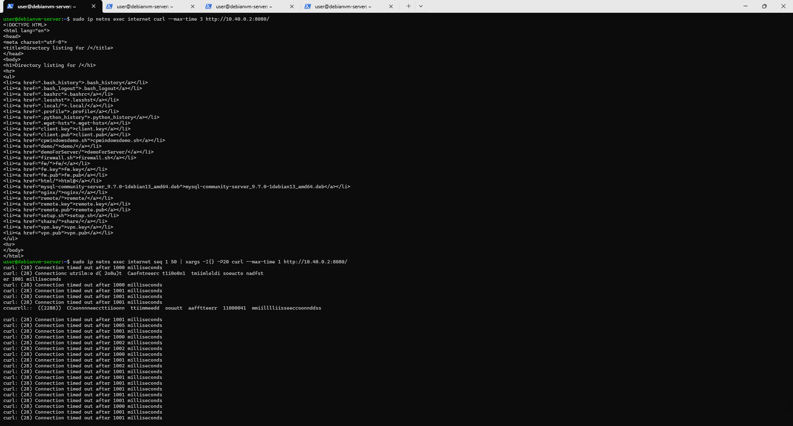
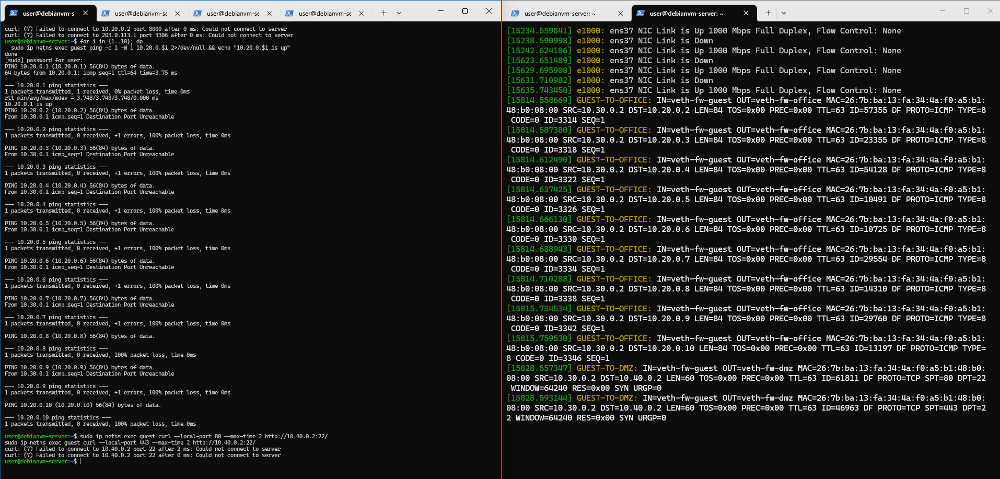
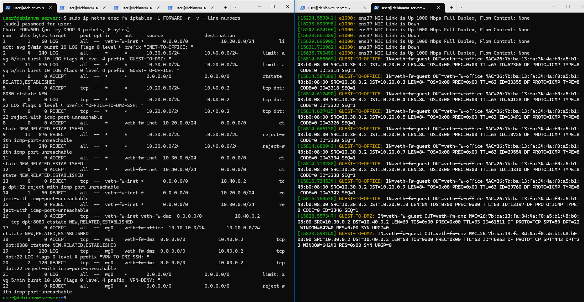
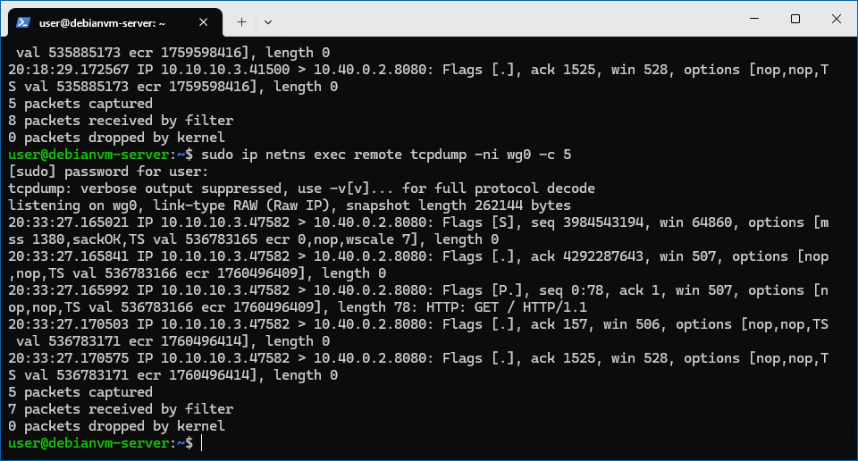
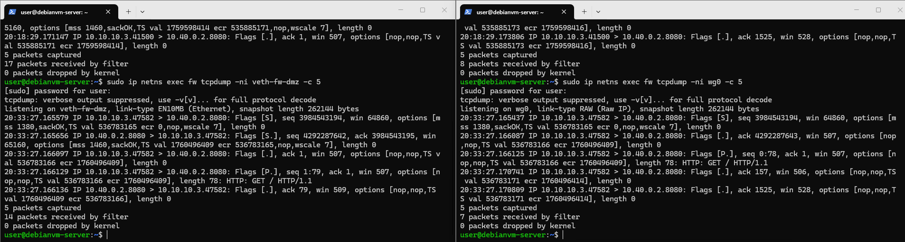
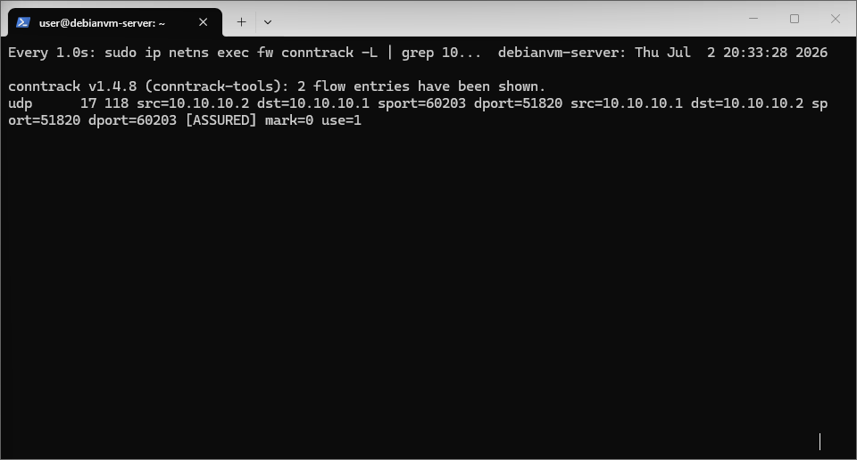

# 边界测试
选择dmz:8080对外开放
* 风险分析
dmz:8080作为Web服务对外开放，虽然满足业务访问需求，但也存在明显安全风险。首先，攻击者可以通过持续连接或并发请求对该端口发起拒绝服务攻击（DoS），导致服务资源耗尽。其次，Web服务本身可能存在漏洞（如SQL注入、XSS或未授权访问），攻击者可直接利用公网入口进行入侵。由于该端口对外暴露，一旦没有连接限制或访问控制策略，将极大扩大攻击面。此外，默认iptables规则仅进行端口过滤，无法限制单IP连接数量，因此容易被恶意用户利用进行高频访问或扫描行为，增加系统负载并降低服务可用性。

* 改进方案
限制单IP最大连接次数，首先记录访问dmz:8080的源IP行为，如果60秒内访问超过10次则拒绝连接，对应配置如下：
```bash
sudo ip netns exec $FW iptables -A FORWARD \
  -i veth-fw-inet -o veth-fw-dmz \
  -p tcp --dport 8080 -d 10.40.0.2 \
  -m conntrack --ctstate NEW \
  -m recent --rcheck --seconds 60 --hitcount 10 --name DMZ8080 \
  -j REJECT --reject-with tcp-reset

sudo ip netns exec $FW iptables -A FORWARD \
  -i veth-fw-inet -o veth-fw-dmz \
  -p tcp --dport 8080 -d 10.40.0.2 \
  -m conntrack --ctstate NEW \
  -m recent --set --name DMZ8080 \
  -j ACCEPT
```

* 改进后压测结果


# 截图展示
## 攻击方
* 扫描office网段


* 尝试绕过防火墙访问dmz:22


## 防御方
* 日志证据


* 规则计数器


# 高级任务
## 截图记录
* 4个位置抓包截图
remote抓包


fw抓包


* conntrack记录截图


## 包变化对比表
| 阶段 | 观察位置 | 源地址 | 目的地址 | 协议 | 备注 |
|:-----|:---------|:-------|:---------|:-----|:-----|
| 1 | remote wg0 | 10.10.10.3 | 10.40.0.2 | TCP | 封装前 |
| 2 | fw wg0 | 10.10.10.3 | 10.40.0.2 | TCP | 解封装后 |
| 3 | fw veth-fw-dmz | 10.40.0.2 | 10.10.10.3 | TCP | 转发到dmz |
| 4 | conntrack | 10.10.10.1 | 10.10.10.2 | UDP | 连接跟踪记录 |

## 分析报告
该实验展示了VPN流量在Linux网络栈中的完整处理过程。remote端发出的请求首先经过WireGuard加密封装，在wg0接口上表现为加密UDP流量。当数据到达fw节点后，WireGuard驱动首先进行解密，还原为原始IP数据包，此时防火墙的FORWARD链开始对其进行规则匹配。在允许规则匹配成功后，数据包通过veth接口被转发至DMZ网络。整个过程中，conntrack模块负责记录连接状态，使返回流量能够被自动放行，实现状态防火墙功能。该实验清晰展示了VPN“加密隧道—解密处理—策略过滤—转发”的完整路径，同时验证了iptables在不同网络层面的控制能力。通过多点抓包，可以直观观察到数据包在不同接口之间的变化过程，从而理解VPN与防火墙协同工作的机制，便于后期进行高级操作保证VPN与防火墙协同工作的正常进行，同时更加深入了解VPN的工作原理。

# 问题回答
## 攻击方
1. 扫描office网段失败原因
> 该攻击失败的原因是防火墙在FORWARD链中对guest->office的流量进行了严格限制。根据策略设计，guest网段（10.30.0.0/24）被禁止访问office网段（10.20.0.0/24），并且匹配规则中同时配置了LOG + REJECT动作，直接丢弃或拒绝报文。因此即使ICMP请求能够发出，也会在fw层被拦截，无法到达目标主机，从而无法获得任何存活节点信息。

2. 尝试绕过防火墙访问dmz:22失败原因
> 该攻击失败的根本原因是防火墙基于“五元组规则”（源IP、目标IP、协议、目标端口、状态）进行匹配，而不是仅依赖源端口。策略中明确禁止guest网络访问DMZ的SSH服务（22端口），并通过REJECT明确拒绝连接。因此攻击者无论如何伪造源端口，均无法改变目标端口匹配结果，连接请求都会被防火墙直接丢弃。

3. 攻击者能否伪造源地址为`10.10.10.2`的包来访问内网？
> 虽然攻击者可以伪造源IP为 10.10.10.2，但无法建立真实VPN隧道。WireGuard使用基于密钥的加密认证机制，所有数据包必须经过有效握手才能被接受。同时防火墙只允许wg0接口上经过认证的流量进入内网。因此单纯伪造IP地址无法通过加密验证，也无法被内网设备接受。

4. 攻击者能否从REJECT和DROP的不同表现判断目标是否存在？
> 攻击者可以一定程度判断目标是否存在：REJECT：会返回ICMP/错误响应（如connection refused），DROP：无任何响应（超时）。因此REJECT可推测目标存在但被拒绝访问,DROP无法判断目标是否存在（更隐蔽）

#### 防御方
1. 从日志的哪些字段可以判断这是来自guest的攻击？
> 可以通过日志中的`SRC`字段、入接口`IN`字段以及`log-prefix`共同判断攻击来源。例如`SRC=10.30.0.0/24`或`IN=veth-fw-guest`可明确表明流量来自guest网络，同时`GUEST-TO-OFFICE`或`GUEST-TO-DMZ`等前缀进一步标识攻击类型。三者结合可以精准定位攻击源、攻击路径及目标区域，从而实现完整的攻击溯源分析，便于安全人员定位以及确定攻击情况，指定适合的防御措施，保证网络中设备安全和数据的安全，防止被不法利用。

2. 如果日志中`IN=veth-fw-guest OUT=veth-fw-office`，说明了什么？
> 当日志显示`IN=veth-fw-guest OUT=veth-fw-office`时，说明数据包从guest网络进入防火墙并试图转发至office网络。这表示访客正在尝试访问办公网资源，属于典型的越权访问行为。由于策略中已禁止guest访问office，该流量会被REJECT规则拦截，同时记录日志，用于后续安全审计与攻击分析，定位攻击源，建立攻击链路，确保网络中设备安全和数据安全，并指定适合的防御措施，禁止更多的越权访问的情况出现。

3. 为什么看到大量相同来源的日志应该引起警惕？
> 当同一来源产生大量相同类型日志时，通常意味着存在扫描行为或自动化攻击工具在持续探测网络资源，例如端口扫描或地址枚举。同时也可能是错误配置导致的重复访问请求。这种高频日志会对系统审计造成压力，因此通常需要结合限速策略进行控制，避免日志洪泛攻击，并作为入侵检测的重要指标，及时指定相关防御措施，保证网络服务正常进行。

4. 哪条规则拦截了guest访问office？
> 在guest访问office的场景中，真正执行拦截的是REJECT规则，而LOG仅用于记录行为。REJECT会直接返回拒绝响应并终止连接，从而阻止数据包继续转发到目标网络。如果仅有LOG而没有REJECT，流量仍可能继续被后续规则处理。因此REJECT是访问控制的核心执行点，而LOG属于辅助审计机制，用于安全分析，同时规则适配为自上到下，适配到对应的规则即终止（LOG除外）。

5. 如果guest→office的规则计数很高，说明了什么？
> 当iptables规则计数器显示guest→office相关规则命中次数较高时，说明该方向存在大量访问尝试，可能是扫描行为或持续攻击流量。计数增长代表防火墙持续拦截该类请求，说明访问控制规则正在生效，同时也提示该流量来源异常，需要进一步进行安全分析或加强限速与封禁策略，以保证网络中设备正常运行不会因此导致核心设备宕机以及内部数据不会被泄露到公网中。

6. REJECT和DROP在安全性上有什么区别？
> REJECT与DROP的主要区别在于反馈机制。REJECT会向发送方返回错误响应，例如ICMP不可达或连接拒绝信息，使攻击者能够判断目标存在但被拒绝访问；而DROP则直接丢弃数据包，不返回任何响应，使攻击者无法确认目标是否存在。因此DROP在安全性上更高，但调试困难；REJECT更便于排错但信息暴露更多，在生产环境中优先选择DROP，保证网络安全，而在调试环境中优先选择REJECT，便于找寻因配置导致的错误。
