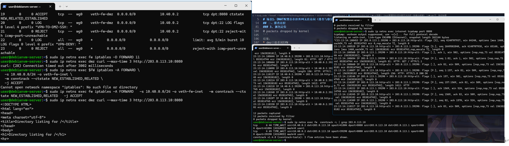
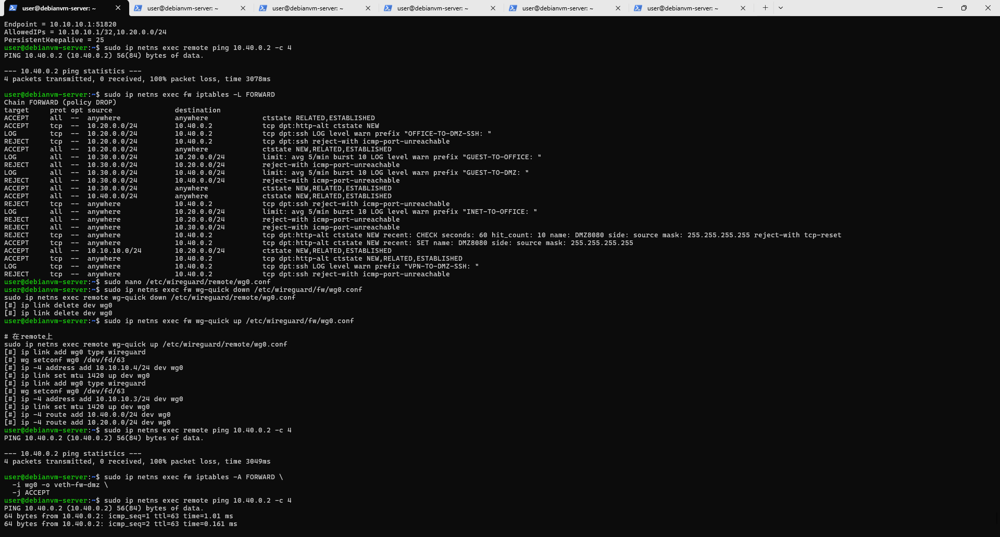
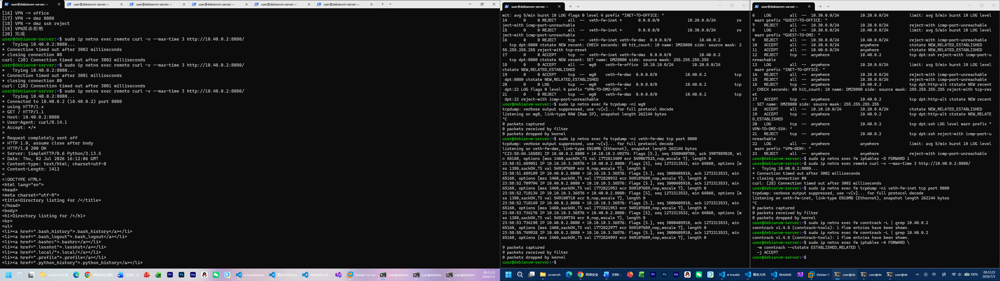

# 场景1：DNAT配置存在但外网无法访问（排查与修复）
## 一、故障现象
> issue：实验指导中写的是`internet`访问`203.0.113.1:8080`失败，即internet->fw:8080失败，解决方法很简单，服务开在fw上就行，我觉得应该改为dmz访问internet时失败才对，**此处将基于内部网络dmz访问internet时失败**

内部网络dmz访问internet时失败，但：
* `iptables -t nat -L`显示DNAT规则存在

说明问题不在服务本身，而在转发路径。

## 二、排查过程
### 1️. 检查NAT是否生效
```bash
sudo ip netns exec fw iptables -t nat -L -n -v
sudo ip netns exec fw  conntrack -L | grep 203.0.113.10
```
输出：
```text
user@debianvm-server:~$ sudo ip netns exec fw iptables -t nat -L -n -v
Chain PREROUTING (policy ACCEPT 0 packets, 0 bytes)
 pkts bytes target     prot opt in     out     source               destination

Chain INPUT (policy ACCEPT 0 packets, 0 bytes)
 pkts bytes target     prot opt in     out     source               destination

Chain OUTPUT (policy ACCEPT 0 packets, 0 bytes)
 pkts bytes target     prot opt in     out     source               destination

Chain POSTROUTING (policy ACCEPT 6 packets, 408 bytes)
 pkts bytes target     prot opt in     out     source               destination
    0     0 MASQUERADE  all  --  *      veth-fw-inet  10.20.0.0/24         0.0.0.0/0
    0     0 MASQUERADE  all  --  *      veth-fw-inet  10.30.0.0/24         0.0.0.0/0
    2   120 MASQUERADE  all  --  *      veth-fw-inet  10.40.0.0/24         0.0.0.0/0
user@debianvm-server:~$ sudo ip netns exec fw  conntrack -L | grep 203.0.113.10
conntrack v1.4.8 (conntrack-tools): 1 flow entries have been shown.
```

发现：没有DNAT转换记录->说明包根本没走到NAT或被FORWARD拦截。

### 2️. 检查 FORWARD 规则
检查：
```bash
sudo iptables -L FORWARD -n -v
```
输出：
```text
user@debianvm-server:~$ sudo ip netns exec fw iptables -L FORWARD -n -v
Chain FORWARD (policy DROP 3 packets, 180 bytes)
 pkts bytes target     prot opt in     out     source               destination
    0     0 ACCEPT     all  --  *      *       0.0.0.0/0            0.0.0.0/0            ctstate RELATED,ESTABLISHED
    0     0 ACCEPT     tcp  --  *      *       10.20.0.0/24         10.40.0.2            tcp dpt:8080 ctstate NEW
    0     0 LOG        tcp  --  *      *       10.20.0.0/24         10.40.0.2            tcp dpt:22 LOG flags 0 level 4 prefix "OFFICE-TO-DMZ-SSH: "
    0     0 REJECT     tcp  --  *      *       10.20.0.0/24         10.40.0.2            tcp dpt:22 reject-with icmp-port-unreachable
    0     0 ACCEPT     all  --  *      veth-fw-inet  10.20.0.0/24         0.0.0.0/0            ctstate NEW,RELATED,ESTABLISHED
    0     0 LOG        all  --  *      *       10.30.0.0/24         10.20.0.0/24         limit: avg 5/min burst 10 LOG flags 0 level 4 prefix "GUEST-TO-OFFICE: "
    0     0 REJECT     all  --  *      *       10.30.0.0/24         10.20.0.0/24         reject-with icmp-port-unreachable
    0     0 LOG        all  --  *      *       10.30.0.0/24         10.40.0.0/24         limit: avg 5/min burst 10 LOG flags 0 level 4 prefix "GUEST-TO-DMZ: "
    0     0 REJECT     all  --  *      *       10.30.0.0/24         10.40.0.0/24         reject-with icmp-port-unreachable
    0     0 ACCEPT     all  --  *      veth-fw-inet  10.30.0.0/24         0.0.0.0/0            ctstate NEW,RELATED,ESTABLISHED
    0     0 REJECT     tcp  --  veth-fw-inet *       0.0.0.0/0            10.40.0.2            tcp dpt:22 reject-with icmp-port-unreachable
    0     0 LOG        all  --  veth-fw-inet *       0.0.0.0/0            10.20.0.0/24         limit: avg 5/min burst 10 LOG flags 0 level 4 prefix "INET-TO-OFFICE: "
    0     0 REJECT     all  --  veth-fw-inet *       0.0.0.0/0            10.20.0.0/24         reject-with icmp-port-unreachable
    0     0 REJECT     all  --  veth-fw-inet *       0.0.0.0/0            10.30.0.0/24         reject-with icmp-port-unreachable
    0     0 REJECT     tcp  --  veth-fw-inet veth-fw-dmz  0.0.0.0/0            10.40.0.2            tcp dpt:8080 ctstate NEW recent: CHECK seconds: 60 hit_count: 10 name: DMZ8080 side: source mask: 255.255.255.255 reject-with tcp-reset
    0     0 ACCEPT     tcp  --  veth-fw-inet veth-fw-dmz  0.0.0.0/0            10.40.0.2            tcp dpt:8080 ctstate NEW recent: SET name: DMZ8080 side: source mask: 255.255.255.255
    0     0 ACCEPT     all  --  wg0    veth-fw-office  10.10.10.0/24        10.20.0.0/24         ctstate NEW,RELATED,ESTABLISHED
    0     0 ACCEPT     tcp  --  wg0    veth-fw-dmz  0.0.0.0/0            10.40.0.2            tcp dpt:8080 ctstate NEW,RELATED,ESTABLISHED
    0     0 LOG        tcp  --  wg0    veth-fw-dmz  0.0.0.0/0            10.40.0.2            tcp dpt:22 LOG flags 0 level 4 prefix "VPN-TO-DMZ-SSH: "
    0     0 REJECT     tcp  --  wg0    veth-fw-dmz  0.0.0.0/0            10.40.0.2            tcp dpt:22 reject-with icmp-port-unreachable
    0     0 LOG        all  --  wg0    *       0.0.0.0/0            0.0.0.0/0            limit: avg 5/min burst 10 LOG flags 0 level 4 prefix "VPN-DENY: "
    0     0 REJECT     all  --  wg0    *       0.0.0.0/0            0.0.0.0/0            reject-with icmp-port-unreachable
```

发现问题：
* DNAT后的流量未被显式允许
* FORWARD默认策略为DROP

### 3️. 抓包定位
```bash
sudo ip netns exec internet tcpdump port 8080
sudo ip netns exec dmz tcpdump port 8080
```
输出：
```text
user@debianvm-server:~$ sudo ip netns exec internet tcpdump port 8080
tcpdump: verbose output suppressed, use -v[v]... for full protocol decode
listening on veth-inet, link-type EN10MB (Ethernet), snapshot length 262144 bytes
^C
0 packets captured
0 packets received by filter
0 packets dropped by kernel
user@debianvm-server:~$ sudo ip netns exec dmz tcpdump port 8080
[sudo] password for user:
tcpdump: verbose output suppressed, use -v[v]... for full protocol decode
listening on veth-dmz, link-type EN10MB (Ethernet), snapshot length 262144 bytes
^C23:04:00.484633 IP 10.40.0.2.41834 > 203.0.113.10.http-alt: Flags [S], seq 3549287420, win 64240, options [mss 1460,sackOK,TS val 853261120 ecr 0,nop,wscale 7], length 0
23:04:01.510115 IP 10.40.0.2.41834 > 203.0.113.10.http-alt: Flags [S], seq 3549287420, win 64240, options [mss 1460,sackOK,TS val 853262145 ecr 0,nop,wscale 7], length 0

2 packets captured
2 packets received by filter
0 packets dropped by kernel
```
结果：
* dmz口能看到SYN
* inte口完全没有流量

结论：包在fw被FORWARD丢弃

## 三、根本原因
DNAT只修改目标地址，不会自动放行转发流量
FORWARD链缺少匹配`veth-fw-dmz->veth-fw-inte`的放行规则

## 四、修复方法

```bash
sudo ip netns exec fw iptables -A FORWARD \
  -s 10.40.0.0/24 -o veth-fw-inet \
  -m conntrack --ctstate NEW,ESTABLISHED,RELATED \
  -j ACCEPT
```

## 五、验证结果

* dmz->203.0.113.10:8080 成功访问
* internet tcpdump能看到请求
* conntrack出现NAT映射记录

情况图片


---

# 场景2：VPN握手正常但业务失败（AllowedIPs/路由问题）
## 一、现象
* `wg show`显示handshake正常
* `remote ping 10.40.0.2`失败
* fw无日志输出

## 二、可能原因分析
### 原因1：AllowedIPs错误
```
AllowedIPs = 10.20.0.0/24
```

结果：
* VPN不转发 10.40.0.0/24
* 包根本不进入隧道

### 原因2：FORWARD未放行VPN流量
检查：
```bash
sudo ip netns exec fw iptables -L FORWARD
```

查看终端输出发现fw中没有相关规则
结果：包进入fw但被DROP

## 三、快速定位方法

```bash
tcpdump -ni wg0
tcpdump -ni veth-fw-dmz
conntrack -L | grep 10.10.10.2
```

判断链路断点：
* wg0没包->VPN问题
* wg0有包但dmz无->FORWARD问题
* dmz有包但无返回->路由问题

## 四、修复方法
### AllowedIPs修复
```
AllowedIPs = 10.20.0.0/24, 10.40.0.0/24
```
### FORWARD修复
```bash
sudo ip netns exec fw iptables -A FORWARD \
  -i wg0 -o veth-fw-dmz \
  -j ACCEPT
```
* 过程展示


---

# 场景3：去掉ESTABLISHED,RELATED后TCP连接失败
## 一、现象
* 三次握手的第一个SYN包能通过
* 服务器的SYN-ACK回包被防火墙拦截
* curl命令超时

## 二、排查步骤
* 抓包证明SYN-ACK被拦截
在两个终端分别执行下面的指令
```bash
sudo ip netns exec fw tcpdump -ni veth-fw-dmz tcp port 8080
sudo ip netns exec fw tcpdump -ni veth-fw-inet tcp port 8080
```
终端输出如下
```text
user@debianvm-server:~$ sudo ip netns exec fw tcpdump -ni veth-fw-dmz tcp port 8080
tcpdump: verbose output suppressed, use -v[v]... for full protocol decode
listening on veth-fw-dmz, link-type EN10MB (Ethernet), snapshot length 262144 bytes
^C23:58:44.165881 IP 10.40.0.2.8080 > 10.10.10.3.49274: Flags [S.], seq 3580400780, ack 3907889820, win 65160, options [mss 1460,sackOK,TS val 1772813409 ecr 549067525,nop,wscale 7], length 0
23:58:51.689051 IP 10.10.10.3.36576 > 10.40.0.2.8080: Flags [S], seq 1272313532, win 64860, options [mss 1380,sackOK,TS val 549107689 ecr 0,nop,wscale 7], length 0
23:58:51.689109 IP 10.40.0.2.8080 > 10.10.10.3.36576: Flags [S.], seq 3000405910, ack 1272313533, win 65160, options [mss 1460,sackOK,TS val 1772820932 ecr 549107689,nop,wscale 7], length 0
23:58:52.709794 IP 10.40.0.2.8080 > 10.10.10.3.36576: Flags [S.], seq 3000405910, ack 1272313533, win 65160, options [mss 1460,sackOK,TS val 1772821953 ecr 549107689,nop,wscale 7], length 0
23:58:52.710134 IP 10.10.10.3.36576 > 10.40.0.2.8080: Flags [S], seq 1272313532, win 64860, options [mss 1380,sackOK,TS val 549108710 ecr 0,nop,wscale 7], length 0
23:58:52.710149 IP 10.40.0.2.8080 > 10.10.10.3.36576: Flags [S.], seq 3000405910, ack 1272313533, win 65160, options [mss 1460,sackOK,TS val 1772821953 ecr 549107689,nop,wscale 7], length 0
23:58:53.734176 IP 10.10.10.3.36576 > 10.40.0.2.8080: Flags [S], seq 1272313532, win 64860, options [mss 1380,sackOK,TS val 549109734 ecr 0,nop,wscale 7], length 0
23:58:53.734198 IP 10.40.0.2.8080 > 10.10.10.3.36576: Flags [S.], seq 3000405910, ack 1272313533, win 65160, options [mss 1460,sackOK,TS val 1772822977 ecr 549107689,nop,wscale 7], length 0
23:58:55.749928 IP 10.40.0.2.8080 > 10.10.10.3.36576: Flags [S.], seq 3000405910, ack 1272313533, win 65160, options [mss 1460,sackOK,TS val 1772824993 ecr 549107689,nop,wscale 7], length 0

9 packets captured
9 packets received by filter
0 packets dropped by kernel
user@debianvm-server:~$ sudo ip netns exec fw tcpdump -ni veth-fw-inet tcp port 8080
tcpdump: verbose output suppressed, use -v[v]... for full protocol decode
listening on veth-fw-inet, link-type EN10MB (Ethernet), snapshot length 262144 bytes
^C
0 packets captured
0 packets received by filter
0 packets dropped by kernel
```
显然问题是SYN-ACK在fw被丢弃

* 用conntrack观察连接状态
通过终端输出发现可能只有SYN_SENT没有ESTABLISHED

## 三、修复方法

```bash
sudo ip netns exec fw iptables -A FORWARD \
  -m conntrack --ctstate ESTABLISHED,RELATED \
  -j ACCEPT
```

* 过程展示


## 四、ESTABLISHED,RELATED的作用
ESTABLISHED,RELATED规则用于允许已经建立连接的返回流量通过防火墙，否则防火墙会将所有返回数据包当作“新连接”处理并丢弃。
在 TCP 协议中：
* SYN：发起连接
* SYN-ACK：必须回程
* ACK：完成握手

没有 ESTABLISHED 规则时只有“出去的请求”，没有“回来的响应”。
