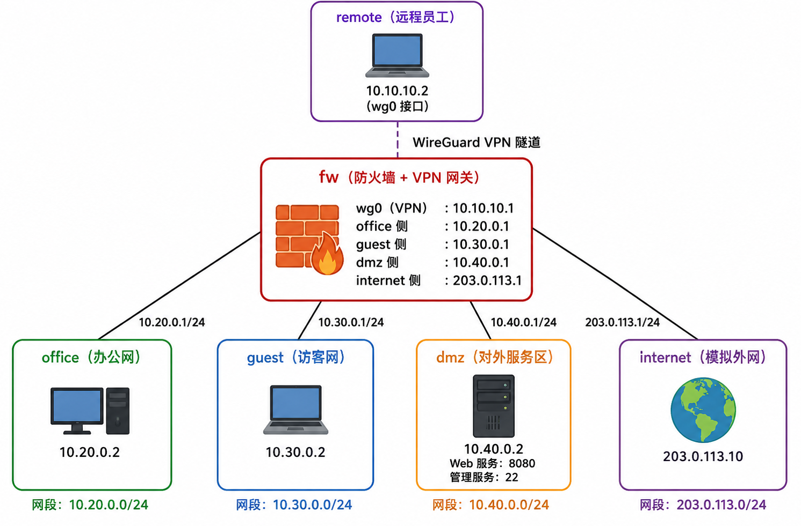

# 企业级网络安全架构搭建与攻防演练

## 一、实验环境

- 操作系统：Ubuntu 22.04/24.04 或其他支持 `ip netns`、`iptables`、`wireguard-tools` 的 Linux 发行版
- 关键工具：`iproute2`、`iptables`、`wireguard-tools`、`curl`、`python3`、`tcpdump`、`conntrack`
- WireGuard版本：实验时使用 `wg --version` 查看并截图
- iptables版本：实验时使用 `iptables --version` 查看并截图
- 运行方式：所有脚本建议使用 `sudo bash xxx.sh` 执行

本实验基于 Linux network namespace 搭建企业边界网络。整体结构包括办公网、访客网、DMZ对外服务区、模拟外网和远程员工VPN接入区。防火墙 `fw` 同时承担区域三层转发、NAT、访问控制、日志审计和 WireGuard VPN 网关功能。

## 二、拓扑图和地址规划




### 2.1 业务地址规划

| 区域 | 网段 | fw侧地址 | 主机地址 | 说明 |
|:---|:---|:---|:---|:---|
| office | 10.20.0.0/24 | 10.20.0.1 | 10.20.0.2 | 办公网 模拟内部员工终端 |
| guest | 10.30.0.0/24 | 10.30.0.1 | 10.30.0.2 | 访客网 只允许访问外网 |
| dmz | 10.40.0.0/24 | 10.40.0.1 | 10.40.0.2 | 对外服务区 Web服务8080 管理服务22 |
| internet | 203.0.113.0/24 | 203.0.113.1 | 203.0.113.10 | 模拟外网 |
| vpn | 10.10.10.0/24 | 10.10.10.1 | 10.10.10.2 | WireGuard VPN隧道地址 |

### 2.2 WireGuard underlay说明

由于本实验在单台主机的 namespace 中模拟 VPN，WireGuard 握手报文仍需要一条底层 UDP 传输链路。因此脚本额外创建 `192.0.2.0/24` 作为 remote 与 fw 之间的 underlay：

| 用途 | 网段 | fw地址 | remote地址 | 说明 |
|:---|:---|:---|:---|:---|
| WireGuard underlay | 192.0.2.0/24 | 192.0.2.1 | 192.0.2.2 | 仅用于 remote 访问 `192.0.2.1:51820` 建立隧道 |

该地址不承载业务访问，业务访问仍由 `10.10.10.0/24` 的 VPN 隧道完成。

## 三、第一部分：网络规划与基础搭建

### 3.1 拓扑搭建脚本

本项目提供 `setup.sh`。脚本具有可重复运行能力，执行前会删除已有 namespace 并清理残留进程，然后重新创建 `fw`、`office`、`guest`、`dmz`、`internet`、`remote` 六个 namespace。

执行命令：

```bash
sudo bash setup.sh
```
使用方式
```bash
chmod +x setup.sh
sudo bash setup.sh
```
脚本主要完成以下工作：

1. 创建六个 namespace，并启用各 namespace 的 loopback 接口。
2. 创建 veth 对，将各区域接入 `fw`。
3. 配置各接口 IP 地址和默认路由。
4. 在 `fw` 中开启 `net.ipv4.ip_forward=1`。
5. 关闭 `rp_filter`，避免隧道和多接口转发实验受到反向路径过滤影响。

### 3.2 基础连通性验证

运行以下命令并截图保存为 `screenshots/01-topology.png` ：

```bash
sudo ip netns exec office ping -c 2 10.20.0.1
sudo ip netns exec guest ping -c 2 10.30.0.1
sudo ip netns exec dmz ping -c 2 10.40.0.1
sudo ip netns exec internet ping -c 2 203.0.113.1
sudo ip netns exec remote ping -c 2 192.0.2.1
```

预期结果：五组测试均能收到 `64 bytes from ...` 的 ICMP Reply，说明各区域主机已能连通各自网关，基础拓扑搭建成功。

## 四、第二部分：防火墙策略实现

### 4.1 规则配置脚本

本项目提供 `firewall.sh`。执行命令：

```bash
sudo bash firewall.sh
```

脚本采用最小权限原则，先将 `FORWARD` 默认策略设置为 `DROP`，再按业务需求逐条放行。规则设计顺序如下：

1. 第一条放行 `ESTABLISHED,RELATED`，保证已建立连接的回包可以返回。
2. 再写具体业务放行规则，如 `office -> dmz:8080`、`guest -> internet`、`dmz -> internet`。
3. 对明确禁止的访问先写 `LOG`，再写 `REJECT`。
4. 最后通过 NAT 表配置内网访问外网的 SNAT 和外网访问 DMZ Web 的 DNAT。

查看规则：

```bash
sudo ip netns exec fw iptables -L FORWARD -n -v --line-numbers
sudo ip netns exec fw iptables -t nat -L -n -v --line-numbers
```

### 4.2 访问控制矩阵

测试前先启动服务：

```bash
sudo bash start-services.sh
```

| 来源 | 目标 | 预期结果 | 实际结果填写 | 说明 |
|:---|:---|:---|:---|:---|
| office | dmz:8080 | 成功 | 成功 正常返回网页目录列表 | 内网员工可访问DMZ Web |
| office | dmz:22 | 失败+LOG |连接被拒绝，内核生成 OFFICE-TO-DMZ-SSH 审计日志  | 禁止办公网SSH到DMZ |
| guest | office:8000 | 失败+LOG |连接被拒绝，内核生成 GUEST-TO-OFFICE 审计日志  | 访客网隔离办公网 |
| guest | dmz:8080 | 失败+LOG |连接被拒绝，内核生成 GUEST-TO-DMZ 审计日志  | 访客网不能访问DMZ |
| guest | internet:8000 | 成功 |ping公网IP203.0.113.10 0% 丢包，通外网  | 访客网只能上网 |
| office | internet:8000 | 成功 |ping公网IP203.0.113.10 0% 丢包，通外网  | 办公网可访问外网 |
| internet | fw公网IP:8080 | 成功 |访问公网8080正常返回 DMZ 网页，DNAT 生效  | DNAT到10.40.0.2:8080 |
| internet | dmz:22 | 失败 |失败  | 外网不能访问DMZ管理端口 |

测试命令：

```bash
# 1. office访问dmz:8080（成功）
sudo ip netns exec office curl http://10.40.0.2:8080
# 2. office访问dmz:22（失败）
sudo ip netns exec office curl --max-time 2 http://10.40.0.2:22
# 3. guest访问office
sudo ip netns exec guest curl --max-time 2 http://10.20.0.2:8000
# 4. guest访问dmz
sudo ip netns exec guest curl --max-time 2 http://10.40.0.2:8080
# 5. guest访问外网（internet）
sudo ip netns exec guest curl http://203.0.113.10
# 6. office访问外网
sudo ip netns exec office curl http://203.0.113.10
# 7. internet访问fw公网8080（DNAT成功）
sudo ip netns exec internet curl http://203.0.113.1:8080
# 8. internet访问22（拒绝）
sudo ip netns exec internet curl --max-time 2 http://203.0.113.1:22
```

### 4.3 NAT设计说明

SNAT 使用 `MASQUERADE`，原因是内网地址 `10.20.0.0/24`、访客地址`10.30.0.0/24`、DMZ地址 `10.40.0.0/24` 属于私有实验网段，直接访问外网时外网无法回程。因此在流量从 `veth-fw-inet` 发出时统一转换为 `fw` 的外网侧地址 `203.0.113.1`。

DNAT 用于外部访问DMZ Web。外网用户访问 `203.0.113.1:8080` 时，`PREROUTING` 链将目标地址转换为 `10.40.0.2:8080`，随后 `FORWARD` 链放行该DNAT后的流量。这样既能对外提供Web服务，又不会直接暴露DMZ主机全部端口。

### 4.4 为什么使用REJECT而不是DROP

在实验环境中使用 REJECT 更便于观察访问控制结果和进行故障排查。REJECT 会主动返回拒绝信息，客户端能较快得到失败结果；如果使用 DROP，客户端通常只能等待超时，排错效率较低。实际生产环境中，对互联网方向的高风险扫描可视情况使用 DROP 降低信息泄露；对内部区域违规访问使用REJECT 更利于定位问题。本实验将 LOG 放在 REJECT 前，使每次拒绝前都能留下审计记录。

## 五、第三部分：VPN远程接入

### 5.1 WireGuard配置文件

项目中提供：

- `vpn-fw.conf`：fw端WireGuard配置,通过脚本生成，监听 51820 端口，仅放行客户端 VPN 单 IP 接入，最小准入权限
- `vpn-remote.conf`：remote端WireGuard配置,通过脚本生成，仅将办公网段、DMZ 业务网段路由进 VPN 隧道，无全量流量转发
- `vpn-up.sh`：配置并启动两端WireGuard。功能：强制清理旧 WireGuard 网卡与残留路由 → 关闭反向路由过滤避免丢包 → 依次启动 fw、remote 两端隧道 → 自动输出隧道状态与 remote 路由表

启动命令：

```bash
sudo bash ./vpn-up.sh
```

验证命令：

```bash
sudo ip netns exec fw wg show
sudo ip netns exec remote wg show
sudo ip netns exec remote ip route
```

如果配置正确，`wg show` 中应能看到 `latest handshake` 和 `transfer` 计数；`remote ip route` 中应能看到 `10.20.0.0/24` 和 `10.40.0.0/24` 通过 `wg0` 访问。

### 5.2 AllowedIPs设计思路

`fw`端Peer配置：

```ini
AllowedIPs = 10.10.10.2/32
```

该配置表示 fw只接受remote这个单一VPN地址，防止remote伪装成其他VPN地址进入隧道。

`remote`端Peer配置：

```ini
AllowedIPs = 10.20.0.0/24, 10.40.0.0/24
```

该配置表示 remote 只有访问办公网和DMZ时才走VPN，不把 `0.0.0.0/0` 全部流量导入VPN。这样既符合最小权限原则，也避免远程员工的普通上网流量被错误转发到企业网关。

### 5.3 VPN访问控制测试
fw 命名空间配置分层 iptables FORWARD 转发规则：
1. 放行 VPN 访问办公网段全量流量
2. 仅放行 VPN 访问 DMZ 主机 10.40.0.2 的 TCP 8080 业务端口
3. 单独拦截 DMZ 主机 TCP 22 SSH 端口，生成专属 VPN-TO-DMZ-SSH 内核日志并拒绝
4. 所有其余 VPN 流量统一拦截，生成通用 VPN-DENY 日志并拒绝

| 测试项 | 命令 | 预期结果 |
|:---|:---|:---|
| 查看fw端隧道状态 | `sudo ip netns exec fw wg show` | 有握手\有transfer |
| 查看remote端路由 | `sudo ip netns exec remote ip route` | 10.20/24、10.40/24走wg0 |
| remote ping 办公网主机连通性 | `sudo ip netns exec remote ping -c 3 10.20.0.2 ` | 成功 |
| remote访问office | `sudo ip netns exec remote curl --max-time 3 http://10.20.0.2:8000/` | 成功 |
| remote访问dmz Web | `sudo ip netns exec remote curl --max-time 3 http://10.40.0.2:8080/` | 成功 |
| remote访问dmz 22 | `sudo ip netns exec remote curl --max-time 3 http://10.40.0.2:22/` | 失败+LOG |
| remote访问guest | `sudo ip netns exec remote ping -c 2 10.30.0.2` | 失败+LOG |
|remote 访问 DMZ 未授权 9090 端口  | `sudo ip netns exec remote curl --max-time 3 http://10.40.0.2:9090/` | 失败+LOG |
### 5.4 测试结果总结
1. 隧道连通性：两端 WireGuard 握手正常，加密隧道双向收发流量，隧道建立。
2. AllowedIPs 合规性：remote 仅指定业务网段走 VPN，无全量转发 0.0.0.0/0。
3. 访问控制效果：仅授权业务可正常访问，三类违规流量全部拦截并生成对应审计日志。
4. 安全规范：全程遵循最小权限原则，区分专项 SSH 拦截与通用非法流量拦截，日志分层便于安全审计。
## 六、第四部分：安全审计与日志分析

### 6.1 LOG规则设计

本实验为所有明确拒绝规则配置对应的 `LOG` 规则，并使用不同 `log-prefix` 区分事件类型：

| 事件类型 | log-prefix | 速率限制 |匹配网卡限定  |
|:---|:---|:---|:---|
| guest访问office | `GUEST-TO-OFFICE:` | 5/min burst 10 |-i veth-fw-guest -o veth-fw-office  |
| guest访问dmz | `GUEST-TO-DMZ:` | 5/min burst 10 |-i veth-fw-guest -o veth-fw-dmz  |
| VPN访问dmz:22 | `VPN-TO-DMZ-SSH:` | 无限制 |-i wg0 -o veth-fw-dmz  |
| internet访问内网 | `INET-TO-OFFICE:` | 5/min burst 10 |-i veth-fw-inet -o veth-fw-office  |
| 其他VPN违规 | `VPN-DENY:` | 5/min burst 10 |-i wg0  |

`核心规则部署逻辑`
1. 所有 LOG 规则统一放置在对应 REJECT 规则上方，iptables 自上而下匹配，数据包先写入审计日志再被丢弃；
2. 普通访客、外网、通用 VPN 违规流量配置限流，抵御日志洪水；SSH 高危端口访问不设限流，全量留存所有连接尝试；
3. 每条规则绑定专属进出网卡，仅匹配对应安全区域流量，避免全局误触发无关日志。
   
`日志查看命令`
1. 筛选全部 5 类违规日志并查看最近 10 条
```bash
sudo journalctl -k --grep "GUEST-TO-OFFICE|GUEST-TO-DMZ|VPN-|INET-TO-OFFICE" --no-pager | tail -10
```
2. 实时监控内核防火墙日志
```bash
sudo journalctl -k -f
```
3. 分类型统计各类违规日志总条数
```bash
sudo journalctl -k --grep "GUEST-TO-OFFICE" --no-pager | wc -l
sudo journalctl -k --grep "GUEST-TO-DMZ" --no-pager | wc -l
sudo journalctl -k --grep "VPN-TO-DMZ-SSH" --no-pager | wc -l
sudo journalctl -k --grep "INET-TO-OFFICE" --no-pager | wc -l
sudo journalctl -k --grep "VPN-DENY" --no-pager | wc -l
```
### 6.2 日志统计表

| 事件类型 | 触发次数 | 实际记录日志数 | 是否生效 |
|:---|:---:|:---:|:---:|
| guest→office | 1 |2  | 是 |
| guest→dmz | 1 | 2 |是  |
| VPN→dmz:22 | 1 | 11 | 是 |
| internet→office | 1 | 1 | 是 |
| VPN其他违规 | 1 | 11 | 是 |

表格填写说明
• 触发次数：人为执行违规访问命令的次数；
• 实际记录日志数：TCP 重传 SYN 包会多次触发 LOG 规则，因此记录条数大于触发次数；
• 是否生效：所有类型均正常生成对应前缀内核日志，全部生效。
### 6.3 日志分析报告

防火墙日志能够记录一次违规访问的关键安全信息，包括入接口 `IN`、出接口 `OUT`、源地址 `SRC`、目的地址 `DST`、协议类型 `PROTO`、源端口 `SPT`、目的端口 `DPT` 等字段。依靠上述字段可精准溯源流量来源所属安全区域、访问目标网段与服务端口，快速识别内网越权访问、外网渗透扫描、VPN 非法访问等安全风险。例如日志中出现 `IN=veth-fw-guest OUT=veth-fw-office SRC=10.30.0.2 DST=10.20.0.2`，说明访客网主机正在尝试访问办公网，属于违反区域隔离原则的行为。

`LOG` 规则必须放在 `REJECT` 之前，因为 iptables 按规则顺序匹配。若先执行 `REJECT`，数据包会立即被终止，后面的 `LOG` 规则不会再被命中，审计记录也就无法产生。使用不同的 `log-prefix` 可以快速区分事件类别，便于后续使用 `journalctl --grep` 进行检索和统计，实现各类违规访问数量自动化统计。对于可能高频出现的扫描行为，LOG规则加入 `limit` 速率限制，可以避免攻击者通过大量无效访问制造日志洪水，导致磁盘占满或影响系统性能。VPN 访问 DMZ 22 端口属于重点违规事件，存在暴力破解入侵风险，因此不设置速率限制，即便客户端多次重传连接请求也会全部生成审计日志，完整留存所有扫描尝试。


## 七、第五部分：攻防演练

### 7.1 攻击方演练

#### 攻击1：guest扫描office网段

命令：

```bash
for i in {1..10}; do
  sudo ip netns exec guest ping -c 1 -W 1 10.20.0.$i 2>/dev/null && echo "10.20.0.$i is up"
done
```

结果分析：该扫描大部分探测失败，仅同命名空间本地主机 `10.20.0.1` 可正常连通。跨网段 guest 流量从 `veth-fw-guest` 进入防火墙、目标 office 网段 `10.20.0.0/24`，命中 `GUEST-TO-OFFICE` 日志规则与后置 `REJECT` 规则，防火墙无任何允许 guest 访问 office 的转发规则，除本地互通主机外，其余办公网段 IP 全部无法连通，无法通过扫描批量获取办公网存活主机信息。

#### 攻击2：尝试绕过防火墙访问dmz:22

命令：

```bash
sudo ip netns exec guest curl --local-port 80 --max-time 2 http://10.40.0.2:22/
sudo ip netns exec guest curl --local-port 443 --max-time 2 http://10.40.0.2:22/
```

结果分析：改变客户端源端口无法绕过防火墙拦截。该拦截规则核心匹配条件为入接口 `veth-fw-guest`、出接口 `veth-fw-dmz` 与目标端口 22，不校验客户端本地源端口。所有从访客域发往 `DMZ 22` 端口的流量都会命中 `GUEST-TO-DMZ` 日志与 REJECT 拒绝规则，即便将本地源端口伪装为 80、443，流量所属安全域不会改变，访问依旧失败。

#### 攻击3：尝试伪造VPN源地址

如果 guest 伪造源地址为 `10.10.10.2`，依旧无法成功访问内网，共两点核心原因：
1. 防火墙 VPN 放行规则强制限定入接口 wg0，伪造数据包入接口为 `veth-fw-guest`，无法匹配 VPN 放行规则，直接命中 `GUEST-TO-DMZ` 拦截规则；
2. TCP 会话依赖双向回包，即便伪造出包源 IP，服务器回包会路由至 `wg0 VPN` 隧道，数据包无法回到 guest 命名空间，TCP 三次握手无法完整建立，会话直接中断。仅伪造三层源 IP，无法绕过基于二层网卡接口的访问控制策略，攻击失效。

#### REJECT和DROP是否能暴露目标存在性

攻击者可以从 `REJECT` 与 `DROP` 的表现差异推断内网资产信息。`REJECT` 会快速返回 `ICMP` 端口不可达响应，证明防火墙收到数据包并主动拒绝，可判断目标 IP 真实存活；`DROP` 静默丢弃数据包无任何响应，攻击者无法区分主机离线、链路故障还是防火墙拦截。
生产外网防御场景优先使用 `DROP`，减少内网拓扑、存活端口信息泄露；内网教学、调试场景使用 `REJECT`，便于快速排查连通性故障。

### 7.2 防御方日志分析

问题1：从日志哪些字段判断来自guest的攻击？
判断 guest 攻击最核心字段为日志内 `IN` 入接口字段：只要出现 `IN=veth-fw-guest`，即可判定流量来自访客域。辅助佐证依据有两点：日志行开头审计标签为 `GUEST-TO-OFFICE` 或 `GUEST-TO-DMZ`、数据包源 `IP SRC=10.30.0.2` 访客网段。OUT、DST、DPT 仅用于判断攻击目标网段与端口，无法溯源流量来源；防火墙依靠二层网卡区分安全域，三层源 IP 可被 `hping3` 伪造，不能单独作为判断依据。


问题2：`IN=veth-fw-guest OUT=veth-fw-office` 说明什么？

该字段组合表示数据包从访客网侧进入防火墙，并准备从办公网侧转发出去。也就是说，该流量正在尝试跨越访客网到办公网的安全边界。根据本实验的安全策略，访客网属于低信任区域，办公网属于内部可信区域，两者之间不应互通，因此该日志说明防火墙拦截了一次违反区域隔离规则的访问。

问题3：为什么大量相同来源日志值得警惕？
短时间内大量相同 `SRC`、相同 `IN` 接口的日志，代表对应主机正在运行自动化网段扫描、端口爆破工具。本实验 `LOG` 规则配置 `limit 5/min` 限流防护，海量扫描会触发日志节流，但依旧会产生批量连续记录。攻击者通过遍历连续 `DST` 地址、各类 `DPT` 端口测绘内网存活资产，即便所有访问全部被防火墙拦截，也说明 guest 主机已失陷，存在内网横向渗透风险，需要溯源日志内 `SRC` 对应主机查杀恶意程序，必要时临时封禁源 `IP`。

### 7.3 规则计数器分析

查看命令：

```bash
sudo ip netns exec fw iptables -L FORWARD -n -v --line-numbers
```

问题1：哪条规则拦截了guest访问office？
规则列表第 6 行 `LOG`、第 7 行 `REJECT` 成对规则专门拦截 `guest` 访问 `office` 网段，匹配条件仅限定进出网卡：`-i veth-fw-guest -o veth-fw-office`，无源网段、目的网段匹配限制。数据包会先匹配第 6 行 `LOG` 规则，生成 `GUEST-TO-OFFICE` 审计日志留存访问记录，再匹配第 7 行 `REJECT` 规则丢弃数据包，两条规则配合完成访客访问办公网的日志审计与流量拦截。当前该规则 `pkts=11`，对应本次 `guest` 网段扫描拦截数据包总量。


问题2：如果guest→office规则计数很高，说明什么？
若 `GUEST-TO-OFFICE` 对应的 6、7 行规则` pkts、bytes` 计数器数值持续走高，代表访客域存在持续、大批量访问办公网段行为。结合实验日志特征，高计数大概率是自动化 `ping` 网段扫描、`TCP` 端口探测类恶意攻击；少量零星计数可能是用户误操作。高数据包计数证明内网区域隔离防御策略成功生效，但同时反映 `guest` 主机已被攻击者控制，正在对内网核心办公资产进行测绘探测，需提取日志中 SRC 源 IP 定位主机，终止扫描进程消除风险。


问题3：REJECT和DROP在安全性上有什么区别？
`REJECT` 丢弃数据包同时返回 `ICMP` 端口不可达响应报文，攻击者可快速判断目标 IP 真实存活、仅端口被防火墙拦截，会泄露内网拓扑、业务端口等资产信息；优点是反馈直观，适合内网教学、调试场景，方便排查连通故障。
`DROP` 静默丢弃数据包，不返回任何回程响应，攻击者无法区分主机离线、链路故障或防火墙拦截，大幅提升内网资产探测难度，安全隐蔽性更强。
安全层面 `DROP` 防护效果优于 `REJECT`：对公网、外网不可信流量优先使用 `DROP`，减少内网信息泄露；内网安全域隔离教学场景可临时使用 `REJECT`，兼顾调试便利，生产环境内网防御仍推荐 `DROP` 降低资产暴露风险。


### 7.4 边界测试与改进方案

本实验选择改进问题：`dmz:8080` 对外开放。

风险分析：`DMZ` 主机 `10.40.0.2` 的 8080 Web 端口对公网 `internet` 网段完全开放，原始防火墙无并发连接管控。攻击者可从公网发起海量并发长连接 `CC/DDoS` 攻击，耗尽服务器文件句柄、内核连接表，造成 Web 业务完全不可用；同时无并发限制时，攻击者可批量发包扫描 `Web` 路径、暴力破解后台账号，若 Web 存在 `SQL` 注入、路径遍历等漏洞，可借此跳板横向渗透内网办公网段。

改进规则：选用 `iptables connlimit` 模块在四层边界限制单 `IP` 最大并发连接，低成本实现抗 `DDoS`、防批量扫描防护，无需额外部署七层服务。

```bash
# 插入公网访问DMZ 8080并发超限日志规则
sudo ip netns exec fw iptables -I FORWARD 1 \
  -i veth-fw-inet -o veth-fw-dmz \
  -d 10.40.0.2 \
  -p tcp --dport 8080 \
  -m connlimit --connlimit-above 2 --connlimit-mask 32 \
  -j LOG --log-prefix "CONN-LIMIT-BLOCK: " --log-level 4

# 插入并发超限连接拒绝规则
sudo ip netns exec fw iptables -I FORWARD 2 \
  -i veth-fw-inet -o veth-fw-dmz \
  -d 10.40.0.2 \
  -p tcp --dport 8080 \
  -m connlimit --connlimit-above 2 --connlimit-mask 32 \
  -j REJECT --reject-with tcp-reset
```

`完整测试步骤、操作与结果`
1. 清理旧有 VPN 侧 8080 并发限制规则，避免流量匹配冲突；
2. 执行上述 iptables connlimit 加固规则，查看 FORWARD 链确认两条规则插入至最前端；
3. 从 internet 命名空间并发 4 条后台 curl 访问 DMZ 8080 模拟 CC 攻击；
4. 现象：前 2 条合法连接可正常发起（仅页面加载超时），第 3、4 条超限连接直接返回连接拒绝；
5. 执行sudo dmesg | grep CONN-LIMIT-BLOCK，输出带自定义前缀的拦截审计日志，记录公网超限访问行为；
6. 查看 FORWARD 链规则计数器，LOG、REJECT 行 pkts 数值大于 0，证明超限流量成功拦截。


### 7.5 高级任务：remote通过VPN访问dmz:8080包变化分析

| 阶段 | 观察位置 | 源地址 | 目的地址 | 协议 | 备注 |
|:---|:---|:---|:---|:---|:---|
| 1 | remote wg0 |10.10.10.2:49242  |10.40.0.2:8080  | TCP |封装前，内网原始明文报文，携带 HTTP GET 请求  |
| 2 | fw wg0 |10.10.10.2:49242  |10.40.0.2:8080 | TCP |解封装后，WireGuard 剥离外层加密 UDP，内层 IP 报文无修改  |
| 3 | fw veth-fw-dmz | 10.10.10.2:49242 |10.40.0.2:8080  | TCP |转发到 dmz 网段，仅更换出口虚拟网卡，四层数据完全不变  |
| 4 | conntrack |10.10.10.2:49242  |10.40.0.2:8080  | TCP |连接跟踪记录，保存双向五元组，会话状态 TIME_WAIT  |

分析报告：实验追踪 `remote` 主机借助 `WireGuard` VPN 访问 `DMZ` 服务器 `10.40.0.2:8080` 的完整数据包流转过程。第一步，remote 主机生成 TCP 访问报文，源 `IP 10.10.10.2`、目的 `IP 10.40.0.2`，包含 HTTP 请求，在 wg0 接口抓取到封装前的原始内网明文包，随后 `WireGuard` 程序将完整 `TCP` 报文封装加密，通过公网传输至防火墙 `fw`。数据包抵达 fw 的 `wg0` 网卡后，内核 `WireGuard` 模块执行解封装，剥离外层加密 `UDP` 头部，还原出与客户端完全相同的内网 `TCP` 报文，两处 `wg` 接口抓包的 `IP`、端口、应用载荷完全一致。防火墙内核 `netfilter` 读取报文五元组，匹配 `VPN` 访问 `DMZ` 放行规则，全程不进行 `NAT` 地址转换，直接将原始 `TCP` 报文转发至 `veth-fw-dmz` 虚拟以太网网卡，送入 `DMZ` 网段。与此同时，内核 conntrack 模块生成连接跟踪条目，记录双向源目 `IP`、端口以及 `TCP` 会话状态，访问结束后连接进入 `TIME_WAIT` 等待超时释放。整个传输流程仅完成 VPN 加密封装、解封装与跨虚拟网卡二层转发，四层 `IP`、`TCP` 信息全程无修改，连接跟踪完整记录会话完整生命周期。

## 八、故障排查

### 8.1 实验概述
基于 Linux 网络命名空间模拟互联网、防火墙、办公终端、VPN 客户端、DMZ 业务服务器组网环境，人为制造 3 类典型防火墙 / VPN 转发故障，复现故障现象、分段定位根因并给出标准修复方案。覆盖 DNAT 端口映射、WireGuard 隧道互通、iptables 状态检测转发三大高频运维故障，分层排错思路：连通性测试→查看规则→核对路由→内核转发校验。
本次完成 3 个典型故障场景复现：
1. DNAT 端口映射已配置，但外网无法访问 DMZ 内网 Web 服务
2. WireGuard VPN 隧道握手正常，但客户端无法访问 DMZ 业务网段
3. 删除 iptables ESTABLISHED/RELATED 状态规则后，TCP 业务连接失败
### 8.2 场景 1：DNAT 配置完成，外网无法访问 DMZ Web 服务
`8.2.1 故障现象`
外网节点internet访问公网地址203.0.113.1:8080超时失败；防火墙 NAT 表存在完整 DNAT 映射规则；DMZ 内网10.40.0.2:8080Web 服务本地访问正常。
`8.2.2 故障复现操作`
仅配置 DNAT 目的地址转换，不添加跨接口 FORWARD 放行规则，制造转发拦截故障：
```bash
ip netns exec fw iptables -t nat -A PREROUTING \
-i veth-fw-inet -p tcp --dport 8080 \
-j DNAT --to-destination 10.40
.0.2:8080
```
外网测试访问：
```bash
ip netns exec internet curl --max-time 3
 http://203.0.113.1:8080/
```
`8.2.3 分层排查流程`
1. 本地校验 DMZ 服务：`ip netns exec dmz curl http://10.40.0.2:8080`，确认服务正常监听；
2. 校验 NAT 规则生效：`ip netns exec fw iptables -t nat -L -n -v`，DNAT 映射存在；
3. 核查转发策略：`ip netns exec fw iptables -L FORWARD -n -v`，无对应入站放行规则；
4. 接口流量抓包佐证：外网网卡收到请求报文，DMZ 业务网卡无数据包。
`8.2.4 故障根因`
DNAT 仅修改数据包目标 IP，不会自动放行跨接口转发流量。数据包完成地址转换后进入 FORWARD 链，无匹配放行规则时数据包被防火墙丢弃。
`8.2.5 修复配置`
新增外网到 DMZ 的 TCP 8080 端口转发放行规则：
```bash
ip netns exec fw iptables -A FORWARD \
-i veth-fw-inet -o veth-fw-dmz \
-d 10.40.0.2 -p tcp --dport 8080 \
-m conntrack --ctstate NEW -j ACCEPT
```
修复后外网可正常访问内网 Web 页面。
### 8.3 场景 2：WireGuard VPN 隧道握手正常，业务网段无法互通
`8.3.1 故障现象`
执行`wg show wg0`可查看到`latest handshake`隧道握手记录；VPN 客户端 ping DMZ 业务地址10.0.1.2100% 丢包；防火墙无 VPN 跨网段转发相关日志。
`8.3.2 故障成因范围`
1. 防火墙未开启 IPv4 内核 IP 转发
2. WireGuard 两端AllowedIPs网段配置不匹配
3. iptables FORWARD 链拦截 VPN 隧道流量
4. DMZ 服务器缺少 VPN 客户端回程路由
本次实验完整复现两类故障：防火墙未开启 IP 转发、客户端错误路由导致流量绕过 VPN 隧道。

`故障 1：防火墙内核 IP 转发关闭`
1. 复现操作：初始化环境关闭内核转发、清空防火墙规则、重建 `WireGuard` 隧道，确认隧道握手后客户端 ping 业务网段全丢包；
2. 定位步骤：防火墙本机可正常 ping 通 DMZ 服务，排除后端故障；执行`sysctl net.ipv4.ip_forward`输出为 0，内核禁止跨网卡转发数据包；
3. 修复命令：
```bash
sysctl -w net.ipv4.ip_forward=1
```
现象：开启转发后 ping 依旧全丢包，证明存在第二层路由配置故障。
`故障 2`：客户端路由异常，流量不走加密隧道
1. 前置条件：内核转发已开启、隧道握手正常、DMZ 已添加 VPN 回程路由；
2. 根因：客户端路由表存在明文静态路由`10.0.1.0/24 via 192.168.80.130 dev veth-cl`，业务流量优先走本地明文网卡，未进入 `wg0` 隧道；`WireGuard` 仅匹配隧道网段`10.40.0.0/24`，明文流量无匹配回程规则被丢弃；
3. 定位方法：查看客户端完整路由表，确认业务网段出口设备为明文 veth-cl 而非 wg0；
4. 修复命令：
```bash
# 删除错误明文路由
ip netns exec client ip route del 10.0.1.0/24 via 192.168
.80.130 dev veth-cl
# 强制业务流量进入VPN隧道
ip netns exec client ip route add 10.0
.1.0/24 dev wg0
```
验证结果：客户端 ping 10.0.1.2 0% 丢包，VPN 业务访问恢复正常。
`8.3.3 VPN 故障通用快速排查逻辑`
1. 查看`sysctl net.ipv4.ip_forward`，值为 0 则开启内核转发；
2. 执行`ip netns exec client ip route get 10.0.1.2`，判断流量出口是否为 wg0；
3. 出口为明文网卡 → 路由 / AllowedIPs 配置错误；出口为 wg0 则核查防火墙 `FORWARD` 规则；
4. 防火墙网卡有请求、DMZ 无应答 → 检查 DMZ 回程路由。
### 8.4 场景 3：删除 ESTABLISHED/RELATED 状态规则后 TCP 连接失败
`8.4.1 故障现象`
办公终端发起 TCP 连接的 SYN 报文可抵达 DMZ 服务器，服务器返回 SYN-ACK 回程报文被防火墙拦截，TCP 三次握手无法完成，curl 访问超时。
8.4.2 故障复现
删除 FORWARD 链状态检测放行规则：
```bash
ip netns exec fw iptables -D FORWARD -m conntrack --ctstate ESTABLISHED,RELATED -j ACCEPT
```
办公端测试访问 Web 服务：
```bash
ip netns exec office curl --max-time 3
 http://10.40.0.2:8080/
```
`8.4.3 定位与原理`
1. 抓包可见仅单向 SYN 报文通行，回程 SYN-ACK 被丢弃；conntrack -L查看连接无法进入 ESTABLISHED 状态；
2. 原理：iptables FORWARD 双向校验流量，仅放行 NEW 新建连接仅允许单向请求；服务器回包不属于 NEW 连接，无状态规则匹配则被默认策略丢弃。
8.4.4 修复方案
在 FORWARD 链首部插入连接状态放行规则：
```bash
ip netns exec fw iptables -I FORWARD 1 \
-m conntrack --ctstate ESTABLISHED,RELATED -j ACCEPT
```
修复后 TCP 三次握手、HTTP 业务访问完全正常。
### 8.5 实验总结
1. NAT 端口映射仅完成地址转换，必须配套 FORWARD 转发规则才能实现外网访问内网服务；
2. VPN 隧道握手正常不代表内网互通，核心排查点：内核转发、客户端路由、两端 AllowedIPs、后端回程路由；
3. iptables 状态检测规则ESTABLISHED,RELATED是双向 TCP 通信的基础，缺失会导致连接无法建立；
4. 标准化排错流程：连通性测试→校验规则→核对路由→检查内核转发，由近及远分段缩小故障范围。

## 九、遇到的问题和解决方法

### 9.1 基础网络命名空间搭建类故障
`故障 1：主机无法 ping 通对应网关`
1. 故障现象：执行ip netns exec office ping 10.20.0.1全部超时，无 ICMP 回复；
2. 根因分析：① 全局未开启 IPv4 内核转发；② veth 虚拟网卡未 up；③ 命名空间缺少默认路由；
3. 排查步骤：依次执行ip link查看网卡状态、sysctl net.ipv4.ip_forward、ip netns exec office ip route；
4. 修复命令
```bash
# 开启全局IP转发
sysctl -w net.ipv4.ip_forward=1
# 启用虚拟网卡
ip link set
 veth-fw-office up
# 配置命名空间默认路由
ip netns exec office ip route add default via 10.20
.0.1
```
5. 预防方案：完整执行 setup.sh 初始化脚本，脚本自动完成接口启用、转发开关、路由配置。
  
`故障 2：跨网段、VPN 回程数据包间歇性丢包`
1. 故障现象：隧道握手正常，单向 ping 通，回程流量随机丢失；
2. 根因分析：系统 rp_filter 反向路由校验开启，多虚拟网卡环境误拦截合法回程报文；
3. 修复命令
```bash
sysctl -w net.ipv4.conf.all.rp_filter=0
sysctl -w net.ipv4.conf.default.rp_filter=0
```
3. 预防方案：拓扑搭建脚本内置关闭 rp_filter 配置，适配多接口网关实验场景。

### 9.2 iptables NAT 与转发类故障
`故障 1：DNAT 规则存在，外网无法访问 DMZ 8080 服务`
1. 故障现象：iptables -t nat -L可查 DNAT 映射，internet 访问 203.0.113.1:8080 持续超时；
2. 根因分析：DNAT 仅修改数据包目标地址，不会自动放行跨网卡流量，FORWARD 链缺少放行 10.40.0.2:8080 的规则；
3. 排查步骤：查看 FORWARD 链规则，确认无对应入站放行策略；
4. 修复命令
```bash
ip netns exec fw iptables -A FORWARD \
-i veth-fw-inet -o veth-fw-dmz \
-d 10.40.0.2 -p tcp --dport 8080 \
-m conntrack --ctstate NEW -j ACCEPT
```
5. 预防方案：配置 NAT 时成对配置 FORWARD 放行规则，NAT 与转发策略配套编写。
  
`故障 2：SYN 包可到达服务器，TCP 三次握手无法完成`
1. 故障现象：抓包仅能看到客户端 SYN 报文，服务器 SYN-ACK 回程包被丢弃，curl 访问超时；
2. 根因分析：FORWARD 链头部缺失ESTABLISHED,RELATED状态放行规则，回程应答流量无法转发；
3. 修复命令
```bash
ip netns exec fw iptables -I FORWARD 1 \
-m conntrack --ctstate ESTABLISHED,RELATED -j ACCEPT
```
4. 预防方案：防火墙脚本第一条统一配置连接状态放行规则，保障双向 TCP 通信。
   
`故障 3：内网、访客网段无法访问外网`
1. 故障现象：office/guest ping 公网 203.0.113.10 超时；
2. 根因分析：内网私有网段无 SNAT 地址转换，外网服务器无回程路由；
3. 修复命令
```bash
ip netns exec fw iptables -t nat -A POSTROUTING -o veth-fw-inet -j MASQUERADE
```
4. 预防方案：所有内网、访客访问外网统一配置 MASQUERADE 动态源地址转换。
### 9.3 WireGuard VPN 隧道类故障
`故障 1：wg show 无 latest handshake，隧道无法建立`
1. 故障现象：两端 wg 配置文件无误，无握手、流量传输记录；
2. 根因分析：① underlay 底层 192.0.2.0/24 网段不通；② fw INPUT 链拦截 WireGuard 51820 UDP 监听端口；
3. 排查步骤：remote ping 192.0.2.1 测试底层连通，查看 INPUT 端口放行规则；
4. 修复命令
```bash
ip netns exec fw iptables -A INPUT -p udp --dport 51820 -j ACCEPT
```
5. 预防方案：vpn-up.sh 脚本自动放行 WireGuard 监听端口，提前校验 underlay 链路。

`故障 2：隧道握手正常，VPN 客户端 ping 业务网段 100% 丢包`
1. 故障现象：wg show 存在握手记录，remote 访问 10.40.0.2 全部丢包；
2. 多层根因：① 防火墙未开启 ip 转发；② client 存在明文静态路由，流量绕过 wg0 隧道；③ DMZ 缺少 VPN 网段回程路由；
3. 修复逻辑：先开启内核转发，清理冲突明文路由，强制业务流量走 wg0，补充 DMZ 回程路由；
```bash
# 开启内核转发
sysctl -w net.ipv4.ip_forward=1
# 删除绕过隧道的错误路由
ip netns exec client ip route del 10.0.1.0/24 via 192.168
.80.130 dev veth-cl
# 业务网段强制进入VPN隧道
ip netns exec client ip route add 10.0
.1.0/24 dev wg0
# DMZ添加VPN回程路由
ip netns exec dmz ip route add 10.40.0.0/24 via 10.0
.1.1 dev veth-dmz
```
4. 预防方案：VPN 启动脚本自动清理冲突路由，自动配置业务隧道路由。

`故障 3：remote 全部流量进入 VPN，上网卡顿`
1. 故障现象：remote 访问外网速度缓慢，所有流量均走加密隧道；
2. 根因分析：remote 端 AllowedIPs 配置为0.0.0.0/0，所有流量强制导入 VPN；
3. 修复配置
```bash
AllowedIPs = 10.20.0.0/24, 10.40.0.0/24
```
4. 预防方案：严格遵循最小权限，仅将企业内网网段划入 VPN 路由。
### 9.4 安全日志与攻防测试类故障
`故障 1：违规访问无审计日志输出`
1. 故障现象：执行 guest 扫描 office，dmesg 无 GUEST-TO-OFFICE 日志；
2. 根因分析：LOG 规则写在 REJECT 规则之后，数据包被提前丢弃，无法匹配日志规则；流量被前置放行规则提前命中；
3. 修复规范：LOG 审计规则必须放置在对应 REJECT 拦截规则上方；
4. 预防方案：防火墙脚本统一规范顺序：LOG 日志规则在前，REJECT 拦截规则在后。
故障 2：网段扫描产生海量日志，占用系统磁盘资源
1. 故障现象：短时间生成数万条内核日志，系统读写卡顿；
2. 根因分析：LOG 规则未配置速率限制，扫描产生的每一条 SYN 包都会生成独立日志；
3. 修复示例（访客隔离限流日志）
```bash
ip netns exec fw iptables -A FORWARD \
-i veth-fw-guest -o veth-fw-office \
-s 10.30.0.0/24 -d 10.20.0.0/24 \
-m limit --limit 5/min --limit-burst 10 \
-j LOG --log-prefix "GUEST-TO-OFFICE: "
```
1. 区分策略：普通扫描类日志添加限流；SSH 暴力破解高危访问全量记录，不设限流
   
`故障 3：connlimit 并发限制规则不生效，CC 攻击无法拦截`
1. 故障现象：公网多并发访问 DMZ 8080，无连接拒绝行为；
2. 根因分析：并发限制规则添加在 FORWARD 链尾部，被前置放行规则优先匹配；
3. 修复方式：使用-I FORWARD 1将 CC 防护规则插入链表最前端；
4. 预防方案：边界抗并发、异常拦截规则统一置顶优先匹配。
## 十、总结与思考
### 10.1 实验核心学习收获
1. 企业网络分区隔离安全思想落地
按照资产信任等级划分为办公内网、访客低信任区、DMZ 对外服务区、VPN 远程接入区、互联网边界五大区域，依靠统一防火墙管控全部跨区域流量，低信任域默认禁止访问高信任内网，从底层阻断横向渗透路径，是内网安全基础防线。
2. 最小权限安全策略完整落地
防火墙 FORWARD 链默认全部拒绝，仅依据真实业务需求逐条放行；WireGuard AllowedIPs、iptables 端口控制均收缩最小访问范围，杜绝 0.0.0.0/0 全量放行、全端口开放等高危宽松配置，最大限度缩小网络攻击面。
3. 分清 NAT 地址转换与访问控制的边界
SNAT、DNAT 仅修改 IP 报文头部，仅解决内网上网、外网访问服务的可达性问题，本身不具备安全拦截能力；能否互通由 FORWARD 转发规则决定，只配置 NAT 不配置放行规则业务依旧中断。
4. 标准化分层故障排查方法论
总结固定排错流程：连通性基础测试 → 网卡与路由校验 → 内核转发参数检查 → iptables 规则核对 → 流量抓包定位，能够快速区分路由、内核、防火墙、隧道四类故障，大幅提升运维排错效率。
5. 攻防双向验证安全防护有效性
从攻击者视角模拟网段扫描、源端口伪装、三层 IP 伪造等常见渗透手段；从防御侧依靠日志标签、规则计数器、连接跟踪三重手段校验拦截效果，明白仅配置放行规则不足以抵御攻击，审计、限流、接口绑定多层防护缺一不可。
### 10.2 本次模拟架构存在短板
本实验基于单主机 Linux 网络命名模拟环境，与真实企业生产网络存在明显差距，局限性如下：
1. 单点防火墙性能与可用性瓶颈
全部转发、NAT、VPN、日志功能集中单台 fw，无主备、集群冗余，网关故障直接造成全网断网，无法支撑高可用业务场景。
2. 仅四层防护，缺失七层应用安全控制
iptables 只能基于 IP、端口、连接状态管控，无法识别 SQL 注入、XSS、路径遍历、恶意爬虫等 Web 应用层攻击，缺少 WAF 防护能力。
3. 日志本地存储，无长期溯源告警机制
审计日志仅保存在本地 journalctl，无远端 syslog 服务器集中存储，日志易丢失；无异常扫描、暴力破解自动告警，攻击发生后无法及时处置。
4. WireGuard 远程接入权限管控单一
仅依靠密钥认证 VPN 接入，无多因素 MFA 校验、终端安全检测；所有 VPN 用户权限统一，无法实现普通员工、运维管理员分级访问控制。
5. 无流量监控可视化体系
仅手动查看 iptables 计数器、临时抓包，无法实时监控带宽占用、异常高频连接，难以快速识别 CC、端口扫描行为。
### 10.3 面向真实企业环境优化改进方案
1. 高可用网关架构升级
部署双防火墙主备模式，基于 VRRP 实现故障自动切换；业务拆分：专用边界防火墙、独立 VPN 网关、DMZ 前置 WAF，分散单设备性能压力。
2. 补充七层 Web 安全防护
DMZ 业务前端部署 WAF 设备，拦截注入、越权访问、恶意爬虫；互联网出口部署流量清洗设备，抵御大流量 DDoS 攻击，弥补四层防火墙防护短板。
3. 搭建完整安全审计告警体系
部署远程 syslog 服务器，统一收集所有防火墙、VPN 审计日志，长期归档留存；配置日志告警规则，识别高频扫描、SSH 爆破后自动推送邮件 / 平台预警。
4. VPN 远程接入安全加固
增加密钥 + 动态密码双因素认证；对 VPN 用户做权限分级，普通员工仅开放办公业务，运维单独开放管理端口；限制接入终端必须安装杀毒与终端安全软件。
5. 边界防御策略优化
对公网、访客等不可信流量统一使用 DROP 静默丢弃，减少 ICMP 响应带来的内网资产泄露风险；基于 connlimit 完善全业务并发限制，新增动态 IP 黑名单，自动封禁高频扫描主机。
### 10.4 拓展学习与思考
1. 多分支机构大型园区拓展思路
本次仅单站点架构，多分支企业可部署站点到站点 IPsec VPN，总部统一下发安全访问策略，实现多地内网安全互通。
2. 自动化运维落地思路
实验全部依靠手动脚本执行，生产环境可使用 Ansible 批量下发 iptables、WireGuard 配置，避免人工配置失误；搭配 Prometheus+Grafana 监控网关流量、连接数、防火墙计数器，可视化展示安全风险。
3. 持续性攻防迭代思路
网络攻击手段持续更新，IP 分片、隧道封装、端口复用等绕过手段层出不穷，防火墙策略不能一成不变；需要定期开展内网攻防演练，根据新型攻击持续更新拦截、限流、审计规则。
### 10.5 课程实践整体感悟
本次实验从底层 Linux 虚拟网络搭建，到防火墙访问控制、WireGuard 加密隧道、故障排查、攻防验证形成完整实操链路，打通计算机网络、网络安全、运维排错多模块知识点。不再局限于命令机械输入，能够从数据包流转、内核转发、安全策略底层逻辑分析故障与攻击行为，建立分区隔离、最小权限、全程审计、持续验证的标准企业网络安全设计思维，为后续生产环境网络运维、安全防护打下实操基础。

