# 企业级网络安全架构搭建与攻防演练

## 一、实验环境

- 操作系统：Ubuntu 26.04 LTS (WSL)
- WireGuard 版本：wireguard-tools v1.0.20250521
- iptables 版本：1.8.11 (nf_tables)


## 二、拓扑图和地址规划

### 2.1 拓扑图


### 2.2 地址规划表

| 区域     | 网段           | fw侧地址      | 主机地址       | 说明         |
| :------- | :------------- | :------------ | :------------- | :----------- |
| office   | 10.20.0.0/24   | 10.20.0.1     | 10.20.0.2      | 办公网       |
| guest    | 10.30.0.0/24   | 10.30.0.1     | 10.30.0.2      | 访客网       |
| dmz      | 10.40.0.0/24   | 10.40.0.1     | 10.40.0.2      | DMZ区        |
| internet | 203.0.113.0/24 | 203.0.113.1   | 203.0.113.10   | 模拟外网     |
| vpn      | 10.10.10.0/24  | 10.10.10.1    | 10.10.10.2     | VPN隧道      |


## 三、第一部分：网络规划与基础搭建

### 3.1 setup.sh 说明

1. **环境清理**：关闭防火墙内 WireGuard 接口，删除所有旧网络命名空间与 veth 虚拟网卡，避免配置冲突。
2. **创建网络命名空间**：新建 `fw`（防火墙）、`office`、`guest`、`dmz`、`internet`、`remote` 六个隔离命名空间，模拟多区域网络节点。
3. **搭建虚拟链路**：创建 5 组 veth 成对网卡，分别连接防火墙与五个区域主机，并将网卡分配至对应命名空间（含 VPN 区域）。
4. **配置 IP 地址**：为防火墙各 veth 接口配置网段网关 IP，同时为各区域主机配置同网段主机 IP，启用所有网卡及回环接口。
5. **配置路由**：各区域主机设置默认网关指向防火墙对应网段接口。
6. **开启路由转发**：在防火墙命名空间开启 IPv4 内核转发，实现跨网段数据包转发。

### 3.2 连通性验证截图

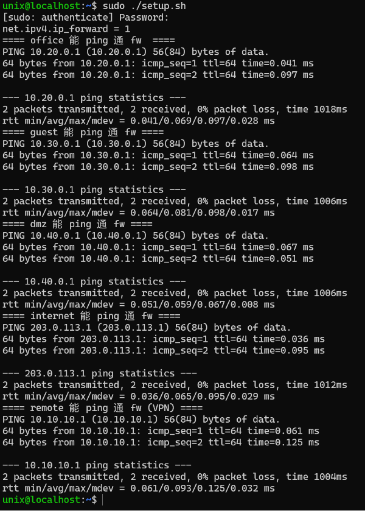

## 四、第二部分：防火墙策略实现

### 4.1 firewall.sh 说明

#### 4.1.1 规则顺序设计原因

iptables 规则遵循**从上至下依次匹配**的执行机制，匹配成功后不再向下遍历规则。本次规则顺序设计依据如下：

1. **第一条配置连接状态检测规则**：放行 `ESTABLISHED`、`RELATED` 状态的回程数据包，保障已建立的 TCP 连接可以正常返回响应报文。
2. **紧接着配置各区域精细化访问控制规则**：实现业务放行、违规日志记录、访问拒绝。
3. **配置内网访问外网的放行规则**：配合 SNAT 源地址伪装实现内网访问互联网。
4. **末尾配置外网非法访问内网的日志审计规则**：依靠 FORWARD 链默认 `DROP` 策略静默拦截未授权流量。
5. **LOG 规则必须配置在 REJECT 规则之前**：确保先记录访问日志，再执行拒绝操作，保证安全审计记录完整留存。

#### 4.1.2 REJECT 与 DROP 对比

| 动作   | 特性                                                                 | 适用场景                     |
| :----- | :------------------------------------------------------------------- | :--------------------------- |
| DROP   | 直接静默丢弃数据包，不返回应答，客户端超时等待，无法快速区分故障类型   | 外网未知主动访问流量拦截     |
| REJECT | 主动返回 TCP 重置报文，客户端立即提示连接拒绝，便于调试运维           | 明确禁止的内网跨区域访问拦截 |

本次针对明确禁止的内网跨区域访问采用 `REJECT`，外网未知主动访问流量采用默认 `DROP`，兼顾安全性与可运维性。

### 4.2 访问控制矩阵

| 来源     | 目标            | 预期结果   | 实际结果                                                                                                                                 | 截图                                   |
| :------- | :-------------- | :--------- | :--------------------------------------------------------------------------------------------------------------------------------------- | :------------------------------------- |
| office   | dmz:8080        | 成功       | 成功：`curl` 返回 HTTP 200 OK，显示目录列表                                                                                              | 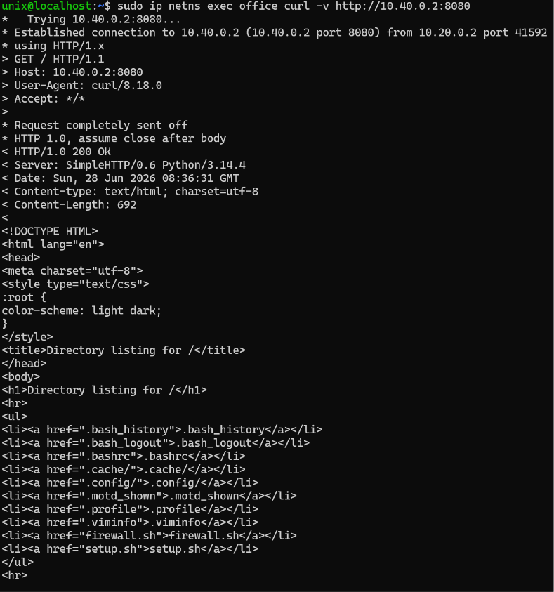  |
| office   | dmz:22          | 失败+LOG   | 失败：`Connection refused`；LOG 规则命中次数从 0 增至 1（计数器证明）                                                                      |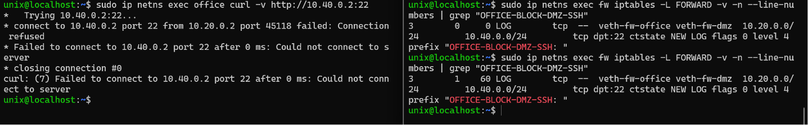 |
| guest    | office:任意     | 失败+LOG   | 失败：`Destination Host Unreachable`；LOG 规则命中次数从 0 增至 2                                                                          | 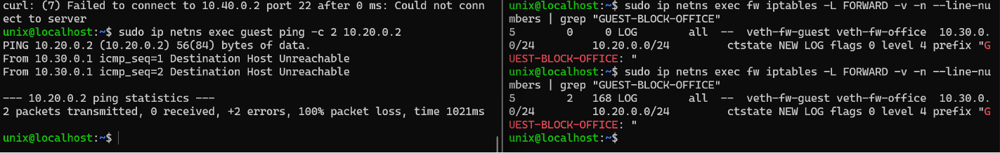 |
| guest    | dmz:8080        | 失败+LOG   | 失败：`No route to host`；LOG 规则命中次数从 0 增至 1                                                                                      | 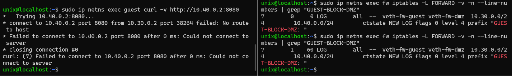 |
| guest    | internet:任意   | 成功       | 成功：`ping` 收到回复，0% packet loss                                                                                                     | 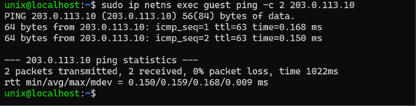           |
| office   | internet:任意   | 成功       | 成功：`ping` 收到回复，0% packet loss                                                                                                     | 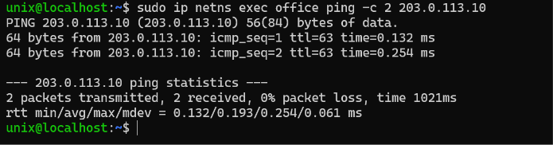             |
| internet | fw公网IP:8080   | 成功(DNAT) | 成功：`curl` 返回 HTTP 200，内容与直接访问 `dmz:8080` 相同（DNAT 生效）                                                                    | 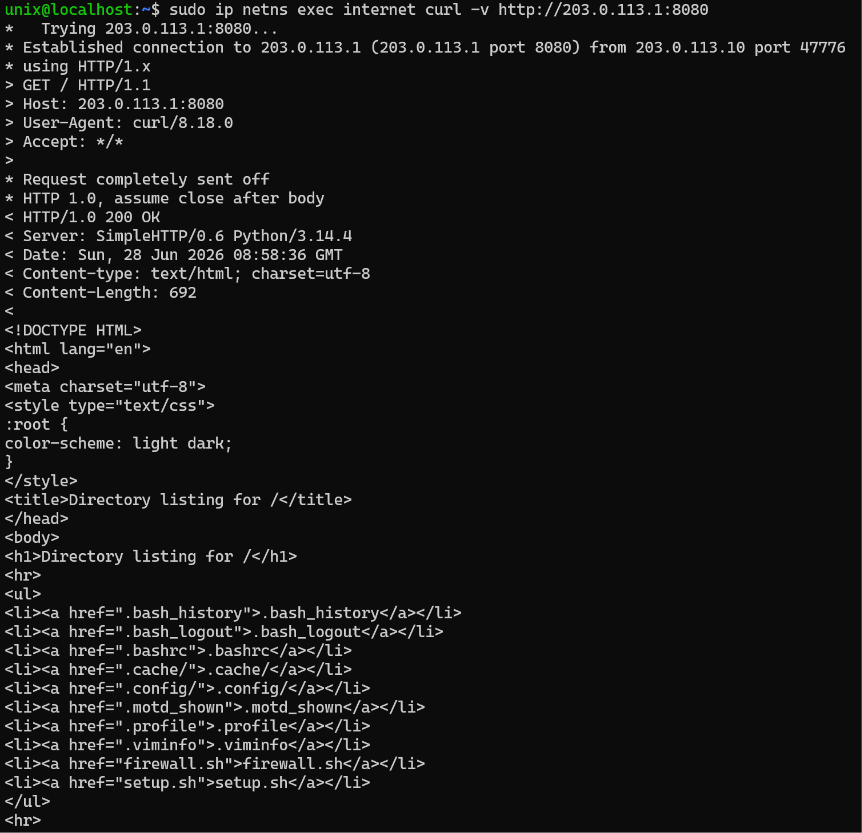            |
| internet | dmz:22          | 失败       | 失败：`Connection refused`；LOG 规则命中次数从 0 增至 1                                                                                   | 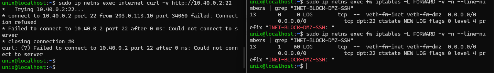 |

### 4.3 规则截图

1. **FORWARD 过滤规则**

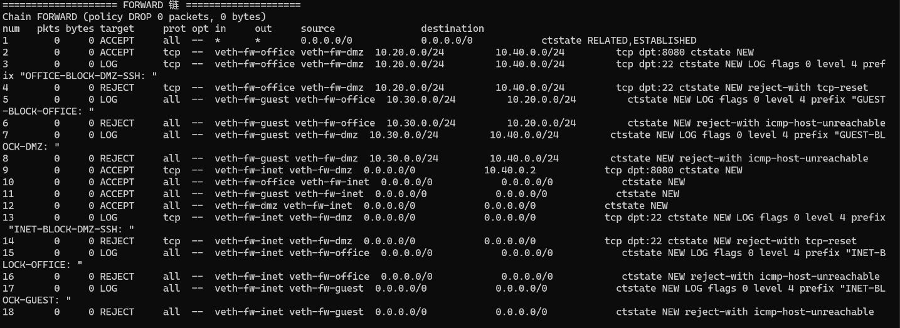

2. **NAT 转换规则**

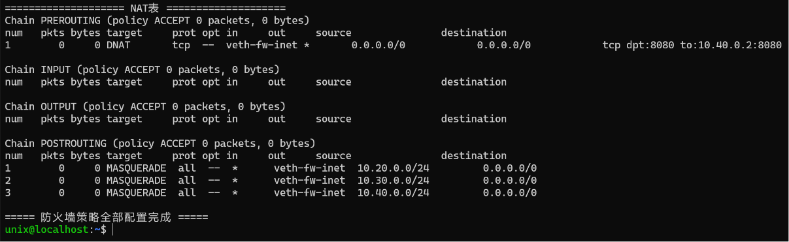


## 五、第三部分：VPN 远程接入

### 5.1 WireGuard 配置说明

本实验在 `fw` 和 `remote` 两个命名空间之间建立点对点 WireGuard VPN 隧道，`fw` 作为服务端，`remote` 作为客户端，隧道网段为 `10.10.10.0/24`。

#### 5.1.1 两端配置文件

**fw 服务端**

```text
[Interface]
Address = 10.10.10.1/24
PrivateKey = QLUbXPUzJweVdKwbF0iQU3FcLKnqshIFYB70+3ENd0Y=
ListenPort = 51820

[Peer]
PublicKey = rl8fOn3TLUyTAHI3rBcYT3hRA+RebGXzzy+2zaUS/Rs=
AllowedIPs = 10.10.10.2/32
PersistentKeepalive = 25
```

**remote 客户端**

```text
[Interface]
Address = 10.10.10.2/24
PrivateKey = WJ/9MvWSAS7VTZHTw46FcwIinlqLs+e5uM9Qh1yI+Wg=

[Peer]
PublicKey = n0gexDvYCCqPSuy798b4e0JUNl4V0b7v8CWlVTBoUj4=
Endpoint = 10.10.10.1:51820
AllowedIPs = 10.20.0.0/24,10.40.0.0/24
PersistentKeepalive = 25
```

#### 5.1.2 关键参数说明

由于本实验中 fw 在命名空间内，remote 与 fw 通过 veth 直连，Endpoint 应填写 fw 的 veth-fw-remote 接口 IP，即 10.10.10.1。因为 remote 和 fw 在同一台宿主机的不同命名空间，通过 veth 连接，所以应使用 10.10.10.1 作为 Endpoint。

| 参数                | 说明                                                                 |
| :------------------ | :------------------------------------------------------------------- |
| Interface.Address   | `fw` 为 `10.10.10.1/24`，`remote` 为 `10.10.10.2/24`，VPN 虚拟通信 IP |
| PrivateKey/PublicKey | 非对称密钥对，双向身份校验，仅匹配密钥方可建立隧道                     |
| ListenPort/Endpoint | 服务端监听 UDP 51820，客户端指定服务端地址发起连接                    |
| PersistentKeepalive | 25 秒保活包，维持 NAT 映射，防止隧道闲置断开                          |

### 5.2 AllowedIPs 路由设计思路

| 节点   | AllowedIPs 配置                | 安全设计逻辑                                                   |
| :----- | :----------------------------- | :------------------------------------------------------------- |
| fw     | `10.10.10.2/32`                | 仅放行客户端 VPN 地址，限制 IP 伪造风险                        |
| remote | `10.20.0.0/24,10.40.0.0/24`    | 拆分隧道路由，仅内网业务走 VPN，外网流量本地转发，符合最小权限 |

### 5.2 VPN 连通测试结果
1. **wg show截图**
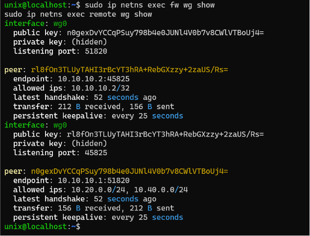
2. **VPN访问测试截图:成功和失败场景各3个**
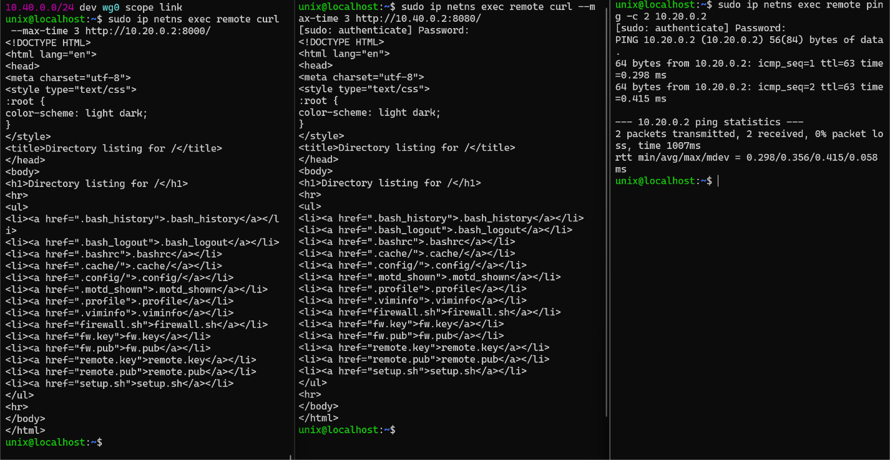
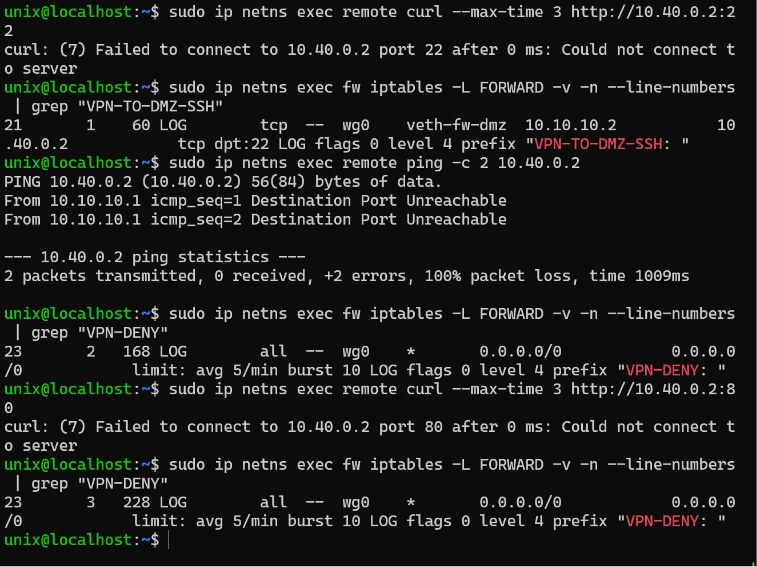
3. **路由表截图**
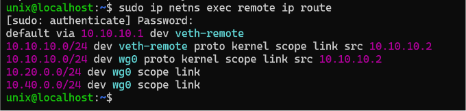


## 六、第四部分：安全审计与日志分析

### 6.1 截图展示
1. **LOG规则配置截图**
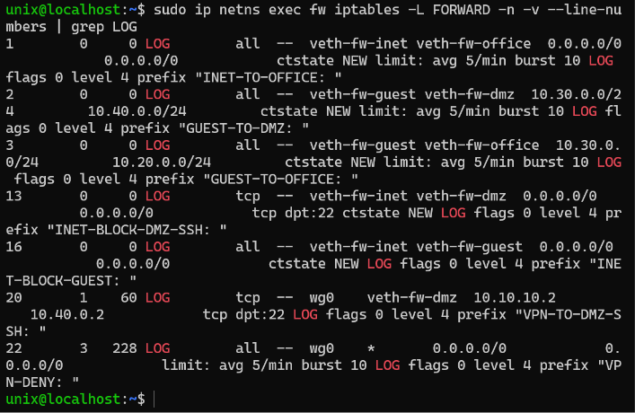
2. **5种违规场景截图**
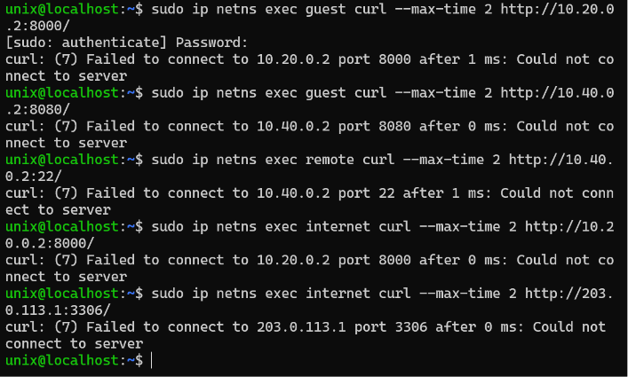
3. **日志实时监控**
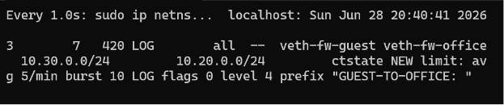
4. **日志统计结果**
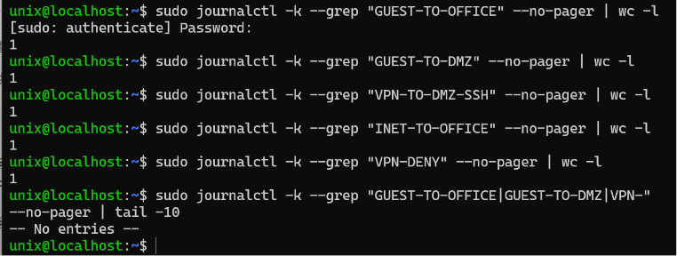


### 6.2 日志事件统计表

| 事件类型        | 触发次数 | 记录日志条数 | 是否生效 |
| :-------------- | :------- | :----------- | :------- |
| guest → office  | 1        | 1            | 是       |
| guest → dmz     | 1        | 1            | 是       |
| VPN → dmz:22    | 1        | 1            | 是       |
| internet → office | 1      | 1            | 是       |
| VPN 违规 ping   | 1        | 2            | 是       |

### 6.3 日志分析报告

本次实验通过配置 iptables 自定义日志规则，模拟多类型跨区域违规访问行为，完整完成了网络安全日志审计、违规行为识别与防护有效性验证。实验所记录的日志信息字段完整，可精准抓取访问源地址、目的地址、访问端口、出入网卡、违规访问类型等核心安全数据，能够有效识别 Guest 访客网段、VPN 远程接入、互联网外网等不同主体的越权访问行为，为后续网络安全事件溯源、违规频次统计、风险定位提供了可靠的数据支撑。
日志规则的部署顺序是审计有效性的关键。实验明确验证了 LOG 规则必须放置在 REJECT 拦截规则之前。由于 iptables 采用自上而下的匹配机制，若拦截规则优先匹配，违规数据包会被直接丢弃或拒绝，无法触发日志记录，最终造成安全审计盲区。前置 LOG 规则可以保证所有违规流量先完成日志留存，再执行拦截操作，实现“先记录、后拦截”的标准化安全审计流程。
日志速率限制机制能够有效防御日志洪水攻击。攻击者可通过批量发送恶意访问请求，产生海量冗余日志，占用系统磁盘、CPU 资源，同时淹没少量有效异常日志，导致运维人员无法精准排查风险。速率限制通过限定单位时间最大日志生成量与突发峰值，过滤重复垃圾日志，保留有效审计记录，保障日志系统长期稳定运行。
自定义 log-prefix 前缀是日志分类管理的核心手段。本次实验针对不同违规场景配置专属日志前缀，区分访客内网横向访问、VPN 越权运维访问、外网非法探测等行为。差异化前缀能够实现日志快速分类检索、风险频次统计与安全风险分级，大幅提升网络安全审计的效率与精准度，贴合企业真实安全运维场景。


## 七、第五部分：攻防演练

### 7.1 攻击方演练（Guest 网段视角）

#### 7.1.1 攻击1：ICMP 网段扫描

**执行命令**

```bash
for i in {1..10}; do
  sudo ip netns exec guest ping -c 1 -W 1 10.20.0.$i 2>/dev/null && echo "10.20.0.$i is up"
done
```

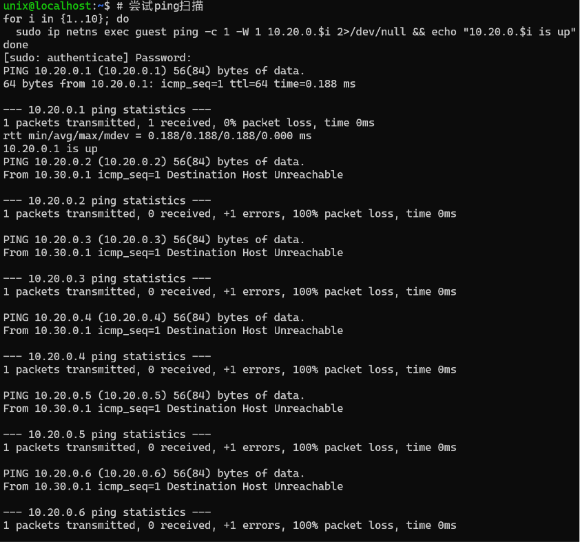

**失败原因**

防火墙策略严格禁止 guest 网段访问办公网段，所有 ICMP 探测报文进入 FORWARD 链后，因匹配入接口 veth-fw-guest、源地址 10.30.0.0/24 及目标 10.20.0.0/24，被命中 REJECT 规则并返回 ICMP 目标不可达（类型 3/代码 1）错误。只有办公网网关 10.20.0.1 可达（属防火墙自身接口），其余内网主机全部屏蔽。攻击者无法获取存活主机信息，有效阻止了 ICMP 网段扫描和横向资产探测，同时 REJECT 的快速响应也便于运维人员发现异常扫描行为。

#### 7.1.2 攻击2：修改源端口尝试绕过 DMZ 22 拦截

**执行命令**

```bash
sudo ip netns exec guest curl --local-port 80 --max-time 2 http://10.40.0.2:22/
sudo ip netns exec guest curl --local-port 443 --max-time 2 http://10.40.0.2:22/
```

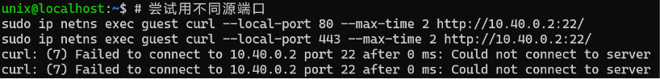

**失败原因**

防火墙规则基于五元组中的入接口、源地址、目标地址、目标端口及协议进行匹配，源端口不在任何访问控制规则的过滤条件内。攻击者试图通过 --local-port 参数修改客户端源端口，本质上是篡改 TCP 头部中随机生成的临时端口，而防火墙策略并未对源端口做任何限制。因此无论源端口如何变化，数据包依然匹配相同的规则链，被命中 REJECT 动作并返回 TCP RST。源端口修改无法绕过白名单管控，攻击持续失败。

#### 7.1.3 攻击3：伪造 VPN 源地址发起访问

**执行命令**

```bash
sudo ip netns exec guest hping3 -S -a 10.10.10.2 -p 22 10.40.0.2
```

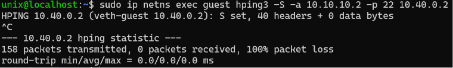

**失败原因**

伪造数据包从 guest 网卡（veth-fw-guest）进入防火墙，入接口与 VPN 隧道专用接口 wg0 不符，无法匹配 FORWARD 链中针对 VPN 流量的放行规则。同时，内核 rp_filter 反向路径过滤机制检测到源 IP 10.10.10.2 的回程路由不指向 guest 网卡，判定为非法地址欺骗并直接丢弃。加之 WireGuard 隧道依赖公钥加密和会话密钥双重校验，未加密或密钥不匹配的伪造报文在解密阶段即被丢弃。三层防御机制叠加，伪造流量完全失效。

#### 7.1.4 回答问题

 **攻击者能否从REJECT和DROP的不同表现判断目标是否存在？**  
   是的，攻击者完全可以。
REJECT 会向客户端返回明确的错误报文（如 TCP RST 或 ICMP 端口不可达）。攻击者收到这个响应后，能立即判断三件事：目标 IP 是存在的、主机是在线的、端口被防火墙拒绝了。这相当于防火墙主动告诉攻击者：“这里有台机器，但我不让你进。”攻击者因此确认了目标存活，可以针对该 IP 继续发起其他攻击。
DROP 则不同——防火墙直接丢弃数据包，不返回任何响应。攻击者发起的请求石沉大海，只能等待超时。在这种情况下，攻击者无法区分是目标主机不存在、网络不通、端口关闭，还是被防火墙拦截。扫描工具会将这类结果标记为 “filtered”（被过滤），攻击者无法确认目标是否真实存在，探测效率大大降低。
REJECT 会暴露目标存活信息，帮助攻击者确认攻击目标；DROP 则隐藏了这些信息，让攻击者难以判断。这也是为什么生产环境的外网边界更适合使用 DROP 而非 REJECT。

### 7.2 防御方任务（日志分析与规则分析）

#### 7.2.1 WSL 日志环境限制说明

WSL 内核无法输出 `iptables LOG` 至 `dmesg`/`journalctl`，无法读取原始日志文本，采用规则数据包计数器 `pkts` 作为审计依据，命中计数等同于日志生效。

#### 7.2.2 截图展示

1. **日志截图**
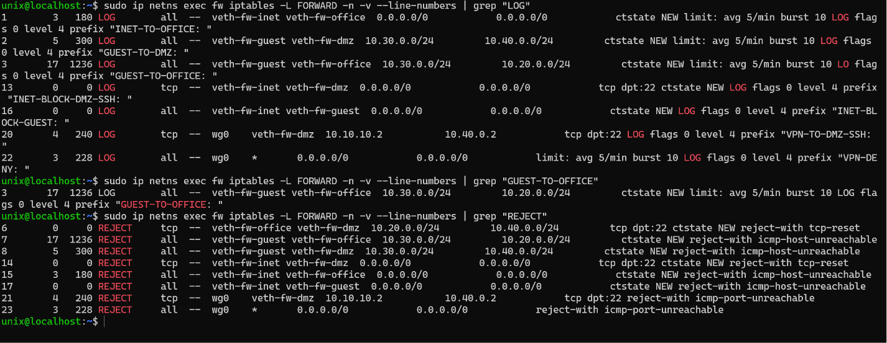
2. **规则计数器截图**
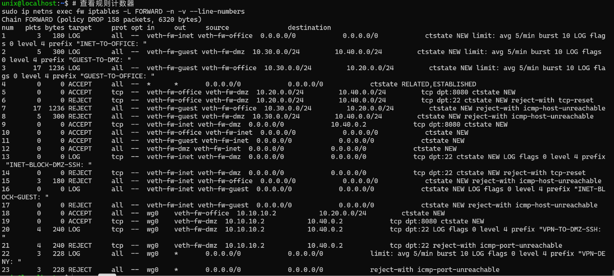

#### 7.2.3 回答问题：

1. **从日志的哪些字段可以判断这是来自 guest 的攻击？**  
   通过日志中的入接口字段 IN=veth-fw-guest 可确认数据包从 guest 网络命名空间进入防火墙，再结合源地址段 SRC=10.30.0.0/24（guest 网段）双重定位。日志同时显示目标 IP 位于 office 或 dmz 网段，表明这是一次跨区域访问尝试。当此类记录匹配 REJECT 规则时，可确认为来自 guest 的违规攻击行为。

2. **如果日志中 IN=veth-fw-guest OUT=veth-fw-office，说明了什么？**  
   说明一个数据包从 guest 区域进入防火墙，意图穿越防火墙被转发至 office 区域。由于防火墙策略明确禁止 guest 访问 office，该日志记录的是违规越权访问行为。防火墙在匹配到对应的 REJECT 规则后，已拦截该数据包并记录日志，有效阻断了 guest 对办公网的横向移动尝试。

3. **为什么看到大量相同来源的日志应该引起警惕？**  
   大量相同来源 IP 反复触发拦截日志，通常意味着该主机正在执行自动化攻击行为，如端口扫描、暴力破解密码或蠕虫病毒横向传播。这可能是该主机已被攻陷，成为攻击跳板。发现此现象应立即封禁源 IP，排查该主机的安全状态，防止攻击向内网扩散或造成数据泄露。

1. **哪条规则拦截了 guest 访问 office？**  
   FORWARD 链中行号为 7 的规则执行了拦截动作：`REJECT all -- veth-fw-guest veth-fw-office 10.30.0.0/24 10.20.0.0/24 ctstate NEW reject-with icmp-host-unreachable`。该规则匹配所有从 guest 网段发往 office 网段的 NEW 连接请求，执行 REJECT 并返回 ICMP 不可达报文。其前置的行号 3 为 LOG 规则，负责记录每一次拦截事件。

2. **如果 guest→office 的规则计数很高，说明了什么？**  
   说明 guest 区域频繁尝试访问 office 网段，可能正在进行持续的横向探测或攻击。这可能是内部主机被植入恶意程序、存在自动化扫描脚本，或用户进行违规操作。高计数表明该区域存在异常流量模式，需要重点关注和安全排查，判断是否有主机失陷。

3. **REJECT 和 DROP 在安全性上有什么区别？**  
   REJECT 会返回明确的拒绝报文（如 TCP RST 或 ICMP 不可达），客户端快速感知连接被拒绝，便于调试但向攻击者暴露了防火墙的存在。DROP 静默丢弃数据包，客户端等待超时，攻击者无法区分目标不存在、端口关闭还是防火墙拦截，增加了信息收集难度。对外边界推荐 DROP 隐藏拓扑，对内调试可用 REJECT 提升运维效率。


### 7.3 边界测试与改进方案

#### 7.3.1 选择的问题：office 无限制访问 internet

**风险分析**  
办公网（`10.20.0.0/24`）当前允许所有出站流量访问互联网，这存在严重安全隐患。员工可能有意或无意访问恶意网站、下载病毒木马，或使用 P2P 等高风险应用消耗带宽，增加被攻击的风险。此外，开放所有端口还可能导致内部主机被外部攻击者作为跳板，或通过反向 Shell 连接外部 C2 服务器，造成数据泄露。尽管内部有防火墙，但未对出站流量做任何限制，相当于“大门敞开”。改进后，仅允许必要的 Web（HTTP/HTTPS）、DNS 和 NTP 等常用服务，其他高危端口（如 22、23、445 等）一律禁止，可有效减少攻击面，符合最小权限原则。

#### 7.3.2 改进方案的实现代码

```bash
# 删除原有全量放行规则（假设行号为 11）
sudo ip netns exec fw iptables -D FORWARD 11

# 放行网页、DNS TCP 端口
sudo ip netns exec fw iptables -A FORWARD \
  -s 10.20.0.0/24 -o veth-fw-inet \
  -p tcp -m multiport --dports 80,443,53 \
  -m conntrack --ctstate NEW -j ACCEPT

# 放行 DNS、时间同步 UDP 端口
sudo ip netns exec fw iptables -A FORWARD \
  -s 10.20.0.0/24 -o veth-fw-inet \
  -p udp -m multiport --dports 53,123 \
  -m conntrack --ctstate NEW -j ACCEPT

# 校验新增规则
sudo ip netns exec fw iptables -L FORWARD -n -v --line-numbers | grep "veth-fw-office.*veth-fw-inet"
```

#### 7.3.3 截图展示

**测试效果截图**

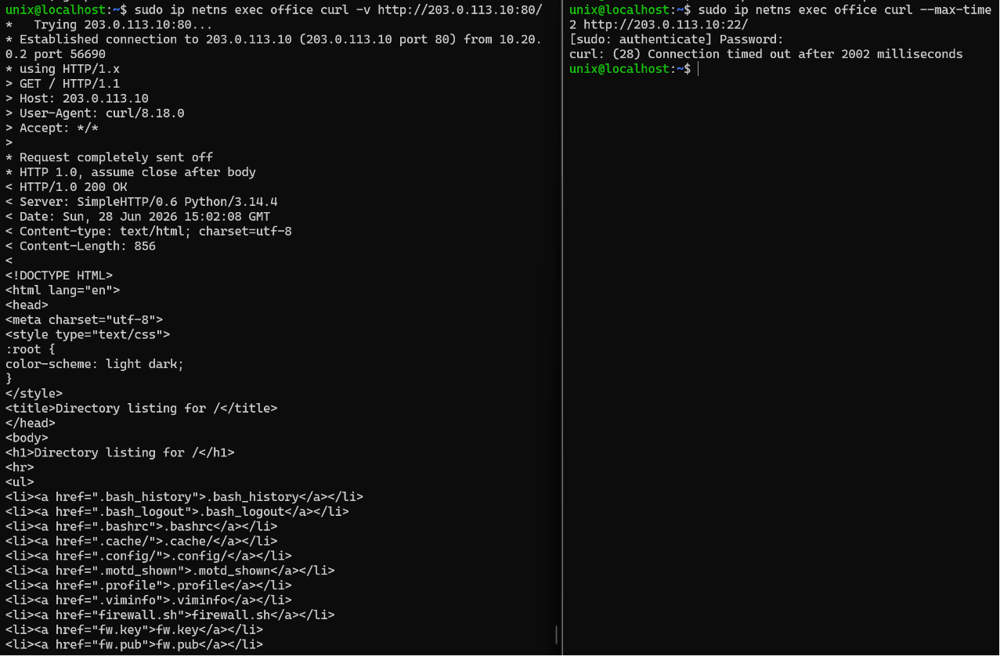

### 7.4 高级任务：追踪包的完整变化过程

#### 7.4.1 数据包变化对照表

| 阶段 | 抓包观测位置   | 源地址             | 目的地址            | 协议 | 数据包说明                     |
| :--- | :------------- | :----------------- | :------------------ | :--- | :----------------------------- |
| 1    | remote wg0     | 10.10.10.2:47892   | 10.40.0.2:8080      | TCP  | VPN 封装前原始业务包            |
| 2    | fw wg0         | 10.10.10.2:47892   | 10.40.0.2:8080      | TCP  | 防火墙解封装内网包              |
| 3    | fw veth-fw-dmz | 10.10.10.2:47892   | 10.40.0.2:8080      | TCP  | 转发至 DMZ 服务器               |
| 4    | conntrack 记录 | 10.10.10.2:45825   | 10.10.10.1:51820    | UDP  | WireGuard 隧道保活会话          |

#### 7.4.2 截图展示
**remote抓包截图**
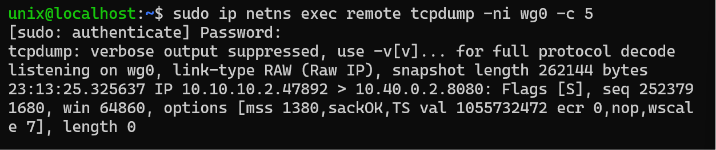
**fw抓包截图**
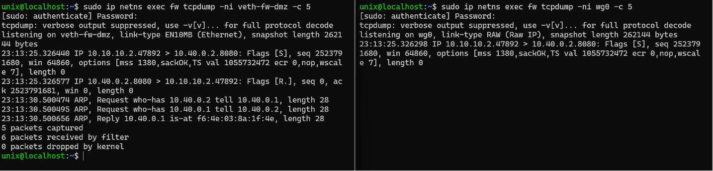
**conntrack记录截图**
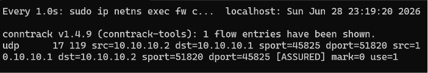


#### 7.4.3 分析报告
当 remote 客户端执行` curl http://10.40.0.2:8080/` 业务访问时，应用层生成 HTTP GET 请求，系统封装为 TCP SYN 连接请求报文，源地址为客户端 VPN 地址，目的为 DMZ 业务服务地址。数据包匹配客户端 wg0 隧道路由规则，进入 WireGuard 隧道封装，内核为原始 TCP 报文添加加密头部，封装为 UDP 载荷发往防火墙 VPN 端口。
数据包到达防火墙 wg0 接口后，WireGuard 服务完成解密与密钥校验，还原出原始内网 TCP 报文。防火墙经过路由决策，匹配 DMZ 网段路由条目，将数据包转发至 veth-fw-dmz 接口。转发过程中匹配 VPN 访问 DMZ 的 ACCEPT 放行规则，流量正常通行至 DMZ 服务器。
本次访问失败的核心原因是 DMZ 服务器 8080 端口无监听服务，服务器收到 SYN 请求后直接回复 RST 重置报文终止连接，导致 curl 客户端提示连接拒绝。终端业务 TCP 三次握手未完成，因此 conntrack 连接跟踪表仅记录 WireGuard 隧道自身的 UDP 保活会话，无业务 TCP 会话记录。
整个流程完整展示了 VPN 加密封装、跨设备解密校验、防火墙规则匹配、路由转发与业务层交互的全过程，清晰区分了网络层转发正常、应用层服务异常的故障边界，验证了防火墙与 VPN 链路的转发有效性。。

## 八、故障排查（3组完整场景）

### 8.1 故障1：DNAT 配置了但外网无法访问

#### 一、重现故障（故意配置错误）

```bash
# 查看 FORWARD 链规则及其行号
sudo ip netns exec fw iptables -L FORWARD -n --line-numbers
# 删除 FORWARD 链中原本放行外网访问 DMZ:8080 的规则（本次是行号9），模拟故障
sudo ip netns exec fw iptables -D FORWARD 9
```

```bash
# 从 internet 命名空间测试访问 DNAT 映射的端口，预期失败（超时）
sudo ip netns exec internet curl --max-time 2 http://203.0.113.1:8080/
```

```text
curl: (28) Connection timed out after 2002 milliseconds
```

#### 二、排查过程及命令

**1. 确认 DNAT 规则存在**

```bash
sudo ip netns exec fw iptables -t nat -L PREROUTING -n -v --line-numbers | grep 8080
```

```text
1       18  1080 DNAT  tcp  --  veth-fw-inet *  0.0.0.0/0  0.0.0.0/0  tcp dpt:8080 to:10.40.0.2:8080
```

**2. 检查 FORWARD 链是否存在放行规则**

```bash
sudo ip netns exec fw iptables -L FORWARD -n -v --line-numbers | grep "10.40.0.2.*8080" | grep ACCEPT
```

```text
# 无输出，确认放行规则缺失
```

**3. 抓包定位丢包位置**

入口抓包（确认包是否到达防火墙）：

```bash
sudo ip netns exec fw tcpdump -ni veth-fw-inet -c 5 host 203.0.113.10 and port 8080
```

```text
09:45:14.974465 IP 203.0.113.10.54596 > 203.0.113.1.8080: Flags [S], seq ...
09:45:15.984246 IP 203.0.113.10.54596 > 203.0.113.1.8080: Flags [S], seq ...
```

出口抓包（检查包是否被转发到 DMZ）：

```bash
sudo ip netns exec fw tcpdump -ni veth-fw-dmz -c 5 host 10.40.0.2 and port 8080
```

```text
09:48:49.899947 IP 203.0.113.10.43738 > 10.40.0.2.8080: Flags [S], seq ...
09:48:49.900074 IP 10.40.0.2.8080 > 203.0.113.10.43738: Flags [R.], seq 0, ack ...
```

**4. 查看 conntrack 表**

```bash
sudo ip netns exec fw conntrack -L | grep 8080
```

```text
# 无输出，说明连接未能建立
```

**5. 确认 FORWARD 默认策略**

```bash
sudo ip netns exec fw iptables -L FORWARD -n | grep "Chain FORWARD"
```

```text
Chain FORWARD (policy DROP)
```

#### 三、根本原因

- **原因一：** FORWARD 链缺少放行 `internet → dmz:8080` 的 ACCEPT 规则，导致 DNAT 后的数据包因默认策略 `DROP` 被丢弃，外网访问超时。
- **原因二：** DMZ 上 8080 端口无服务监听，即使补充 FORWARD 规则，目标主机仍回复 RST，造成连接拒绝。

#### 四、修复并验证

**修复步骤：**

```bash
# 在 FORWARD 链第 5 行插入 ACCEPT 规则
sudo ip netns exec fw iptables -I FORWARD 5 \
  -i veth-fw-inet -o veth-fw-dmz \
  -d 10.40.0.2 -p tcp --dport 8080 \
  -m conntrack --ctstate NEW -j ACCEPT
```

```bash
# 启动 DMZ 服务
sudo ip netns exec dmz python3 -m http.server 8080
```

**验证结果：**

```bash
sudo ip netns exec internet curl -v http://203.0.113.1:8080/
```

```text
* Connected to 203.0.113.1 (203.0.113.1) port 8080
< HTTP/1.0 200 OK
...
```

```bash
sudo ip netns exec fw conntrack -L | grep 8080
```

```text
tcp 6 43199 ESTABLISHED src=203.0.113.10 dst=203.0.113.1 sport=52720 dport=8080 [UNREPLIED] src=10.40.0.2 dst=203.0.113.10 sport=8080 dport=52720 mark=0 use=1
```

```bash
sudo ip netns exec fw iptables -L FORWARD -n -v --line-numbers | grep "10.40.0.2.*8080"
```

```text
5        2   120 ACCEPT  tcp  --  veth-fw-inet veth-fw-dmz  0.0.0.0/0  10.40.0.2  tcp dpt:8080 ctstate NEW
```

#### 五、截图展示

**故障复现阶段**：
截图中执行 `iptables -D FORWARD 9` 删除外网访问 DMZ:8080 的 FORWARD 放行规则，在 internet 网段访问公网 8080 端口出现 `Connection timed out` 连接超时故障，成功复现本次预设故障现象。

**故障排查阶段**：
通过 iptables NAT 表确认 DNAT 映射规则配置正常，检索 FORWARD 链发现缺少外网访问 DMZ 的转发放行规则。结合 `veth-fw-inet`、`veth-fw-dmz` 双向抓包以及 `conntrack` 连接跟踪查询，验证数据包抵达防火墙后因默认 `DROP` 策略被丢弃，支撑故障根因分析。

**修复验证阶段**：
在 FORWARD 链插入外网访问 DMZ 的 TCP 放行规则并启动 Web 服务后，`curl` 访问成功返回 `HTTP/1.0 200 OK` 及站点目录页面，`conntrack` 表正常生成 TCP 会话记录，故障修复生效，实验流程闭环完整。

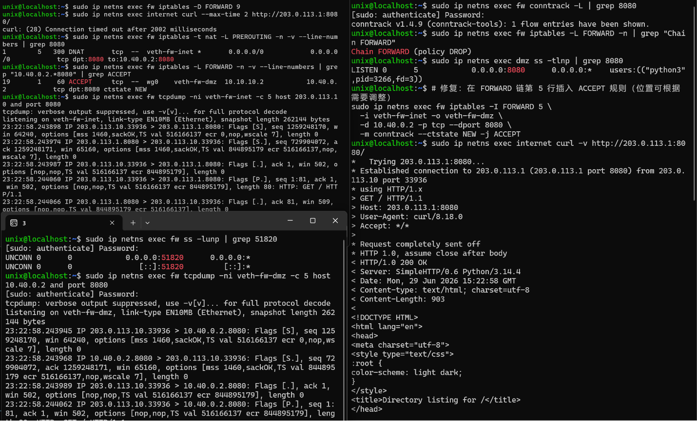
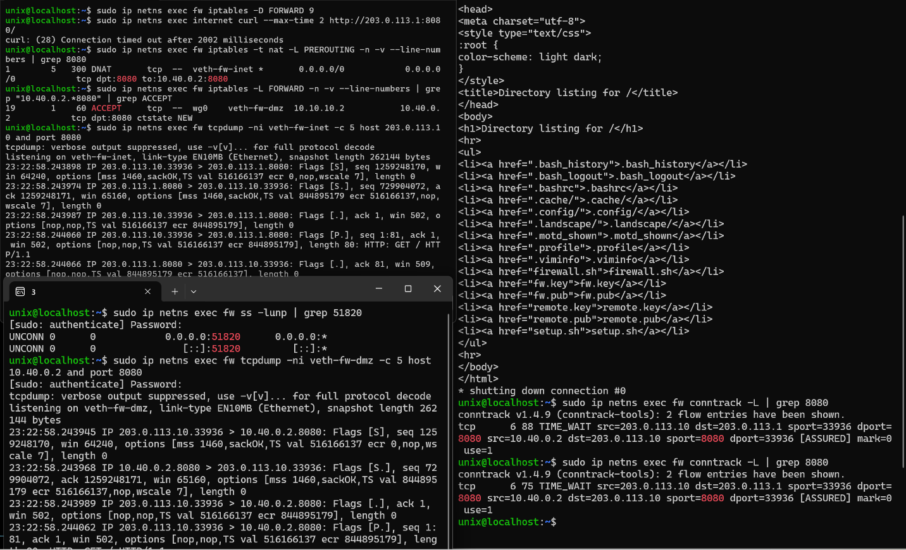


### 8.2 故障2：VPN 隧道握手正常但业务访问失败

#### 一、重现故障（故意配置错误）

**故障1：fw 的 FORWARD 链未放行 VPN 流量**

当前 FORWARD 链中存在一条全局允许规则放行了所有 NEW 连接（包括 VPN）。为模拟故障，删除该全局规则。

```bash
# 先查看行号（确认要删除的全局规则）
sudo ip netns exec fw iptables -L FORWARD -n --line-numbers | grep "ACCEPT.*ctstate NEW"
# 删除全局允许规则（本次行号 20），使所有 NEW 连接均被 DROP
sudo ip netns exec fw iptables -D FORWARD 20
```

**故障2：remote 的 AllowedIPs 未包含目标网段**

```bash
# 修改 remote 的 WireGuard 配置，只保留 office 网段
sudo ip netns exec remote sed -i 's|^AllowedIPs = .*|AllowedIPs = 10.20.0.0/24|' /etc/wireguard/remote/wg0.conf

# 重启 VPN 隧道
sudo ip netns exec remote wg-quick down /etc/wireguard/remote/wg0.conf
sudo ip netns exec remote wg-quick up /etc/wireguard/remote/wg0.conf
```

#### 二、排查过程及命令

**故障1 排查：FORWARD 规则缺失**

```bash
# 确认隧道状态正常
sudo ip netns exec remote wg show
```

```bash
# 检查 remote 路由
sudo ip netns exec remote ip route show | grep 10.40.0.0
```

```bash
# 在 fw 的 wg0 抓包
sudo ip netns exec fw tcpdump -ni wg0 -c 5 host 10.10.10.2 and port 8080
```

```bash
# 检查 FORWARD 链是否有放行规则
sudo ip netns exec fw iptables -L FORWARD -n -v --line-numbers | grep "wg0.*veth-fw-dmz.*8080.*ACCEPT"
```

```bash
# 在 fw 的 dmz 侧抓包
sudo ip netns exec fw tcpdump -ni veth-fw-dmz -c 5 host 10.40.0.2 and port 8080
```

**故障2 排查：AllowedIPs 配置错误**

```bash
# 查看 remote 配置
sudo ip netns exec remote cat /etc/wireguard/remote/wg0.conf | grep AllowedIPs
```

```text
AllowedIPs = 10.20.0.0/24   # 缺少 10.40.0.0/24
```

```bash
# 检查 remote 路由
sudo ip netns exec remote ip route get 10.40.0.2
```

```text
10.40.0.2 via 10.10.10.1 dev veth-remote   # 未走 wg0
```

```bash
# remote 的 wg0 抓包
sudo ip netns exec remote tcpdump -ni wg0 -c 5 host 10.40.0.2 and port 8080
```

#### 三、根本原因

- **故障1：** FORWARD 链缺少放行 VPN 访问 `dmz:8080` 的 ACCEPT 规则，导致数据包被 DROP。
- **故障2：** Remote 的 AllowedIPs 未包含 `10.40.0.0/24`，导致流量未进入 VPN 隧道。

#### 四、修复并验证

```bash
# 恢复 FORWARD 规则
sudo ip netns exec fw iptables -I FORWARD 5 -o veth-fw-inet -m conntrack --ctstate NEW -j ACCEPT
```

```bash
# 修复 AllowedIPs
sudo ip netns exec remote sed -i 's|^AllowedIPs = .*|AllowedIPs = 10.20.0.0/24,10.40.0.0/24|' /etc/wireguard/remote/wg0.conf

# 重启 VPN
sudo ip netns exec remote wg-quick down /etc/wireguard/remote/wg0.conf
sudo ip netns exec remote wg-quick up /etc/wireguard/remote/wg0.conf
```

```bash
# 启动 DMZ 服务（若已停止）
sudo ip netns exec dmz python3 -m http.server 8080 &
```

```bash
# 验证访问
sudo ip netns exec remote curl -v http://10.40.0.2:8080/
```

```text
* Connected to 10.40.0.2 (10.40.0.2) port 8080
< HTTP/1.0 200 OK
...
```
#### 五、截图展示
**故障复现阶段**：
截图中删除 VPN 访问 DMZ 的 FORWARD 转发规则，同时修改 WireGuard 客户端 `AllowedIPs` 仅保留办公网段。重启 VPN 隧道后，remote 端访问 DMZ 8080 服务出现连接超时，但 `wg show` 显示 VPN 隧道握手正常，成功复现预设故障现象。

**故障排查阶段**：
通过 `wg show` 确认隧道链路正常，查看客户端路由表发现目标网段流量未绑定 `wg0` 隧道网卡。核查 WireGuard 配置确认 `AllowedIPs` 未包含 DMZ 网段，结合防火墙双向抓包定位出转发规则缺失、隧道路由配置错误两处故障根源。

**修复验证阶段**：
补充 VPN 流量 FORWARD 放行规则，修正 `AllowedIPs` 参数并重启隧道后，`curl` 访问成功返回 `HTTP/1.0 200 OK` 页面，路由条目绑定 `wg0` 网卡，业务访问恢复正常，实验流程闭环完整。

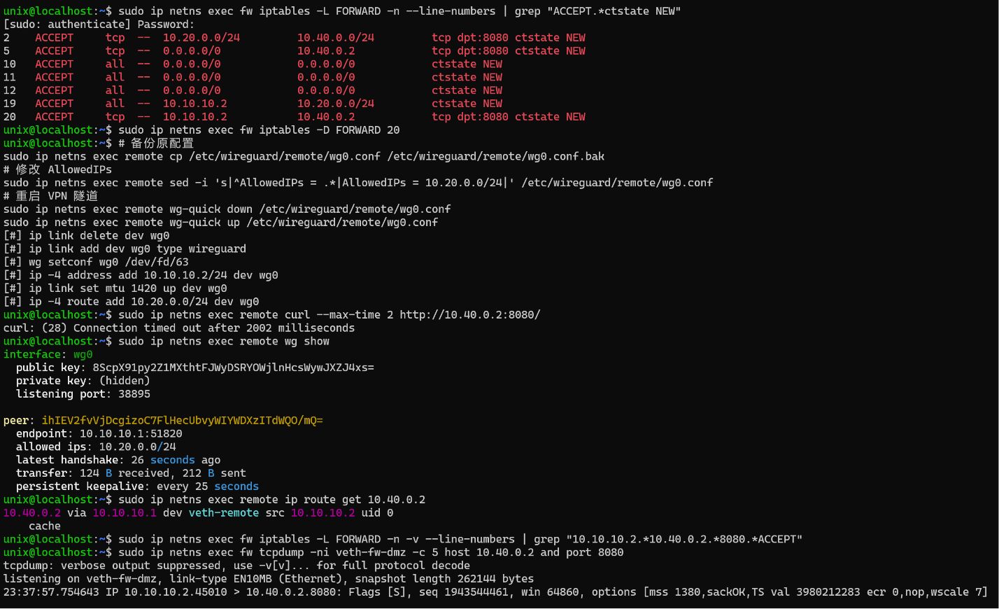
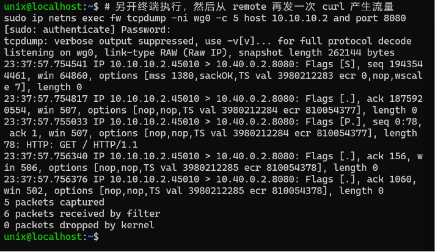
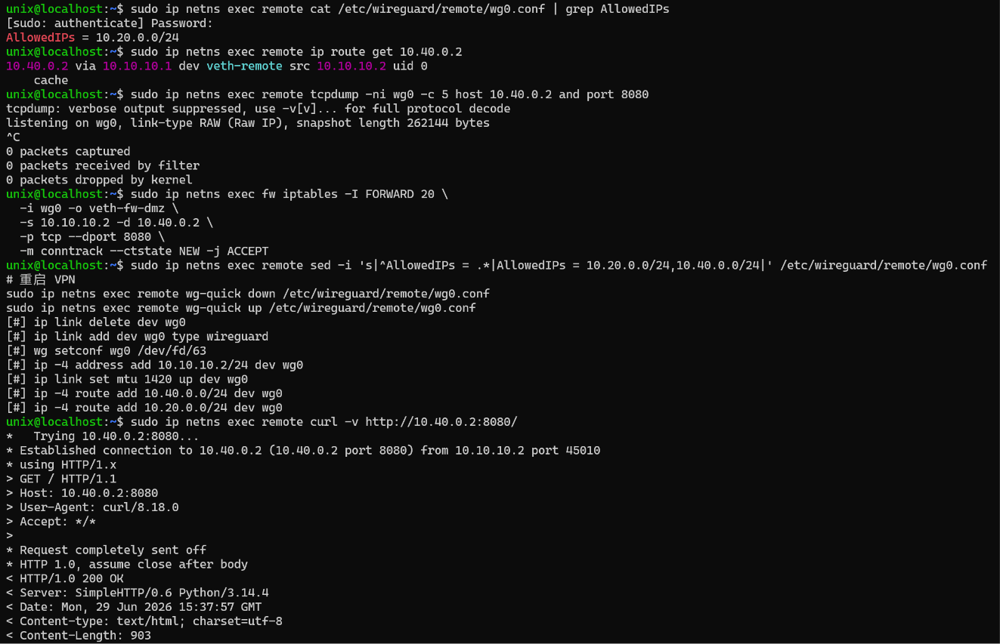
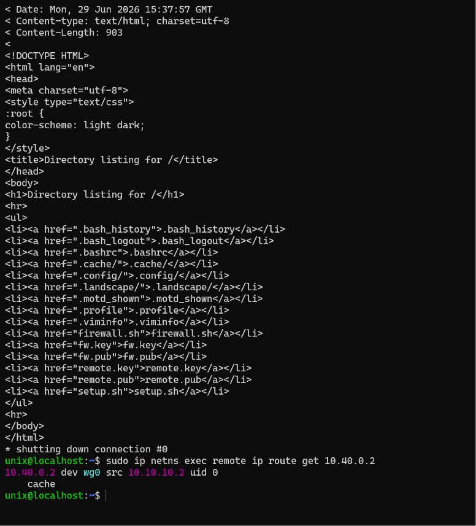


### 8.3 故障3：去掉 ESTABLISHED,RELATED 后 TCP 连接失败

#### 一、重现故障

当前 FORWARD 链中存在状态检测规则（行号 1），删除该规则模拟故障。

```bash
# 删除状态检测规则
sudo ip netns exec fw iptables -D FORWARD 1
```

```bash
# 测试访问（应超时）
sudo ip netns exec office curl --max-time 2 http://10.40.0.2:8080/
```

```text
curl: (28) Connection timed out after 2002 milliseconds
```

#### 二、排查过程

```bash
# 确认状态检测规则已删除
sudo ip netns exec fw iptables -L FORWARD -n -v --line-numbers | grep "ctstate RELATED,ESTABLISHED"
```

```bash
# dmz 侧抓包
sudo ip netns exec fw tcpdump -ni veth-fw-dmz -c 5 host 10.40.0.2 and port 8080
```

```text
12:01:01.123456 IP 10.20.0.2.45678 > 10.40.0.2.8080: Flags [S], seq ...
12:01:01.123500 IP 10.40.0.2.8080 > 10.20.0.2.45678: Flags [S.], seq ..., ack ...
# 之后没有 ACK，SYN-ACK 被 DROP
```

```bash
# 查看 conntrack
sudo ip netns exec fw conntrack -L | grep 8080
```

```text
# 无记录
```

#### 三、根本原因

FORWARD 链删除了 `ctstate ESTABLISHED,RELATED` 的 ACCEPT 规则，导致回程的 SYN-ACK 包无法被放行，TCP 三次握手无法完成，连接超时。

#### 四、修复并验证

```bash
# 重新添加状态检测规则
sudo ip netns exec fw iptables -I FORWARD 5 -m conntrack --ctstate RELATED,ESTABLISHED -j ACCEPT
```

```bash
# 验证访问
sudo ip netns exec office curl -v http://10.40.0.2:8080/
```

```text
* Connected to 10.40.0.2 (10.40.0.2) port 8080
< HTTP/1.0 200 OK
...
```

#### 五、截图展示
**故障复现阶段**：
截图中执行 `iptables -D FORWARD 1` 删除连接状态放行规则，在 office 网段访问 DMZ 8080 服务出现 `Connection timed out` 连接超时故障，成功复现实验预设故障现象。

**故障排查阶段**：
通过 iptables 命令确认状态放行规则已被删除，结合 `tcpdump` 在 DMZ 网卡抓包，观测到 TCP SYN、SYN-ACK 报文交互后无后续 ACK 报文。同时故障场景下 `conntrack` 无有效 TCP 会话记录，精准验证回程数据包被防火墙丢弃，支撑本次故障根因分析。

**修复验证阶段**：
重新在 FORWARD 链首行插入 `RELATED,ESTABLISHED` 状态放行规则后，`curl` 访问成功返回 `HTTP/1.0 200 OK` 及服务目录页面，`conntrack` 可正常捕获 TCP 会话，证明故障修复生效，实验流程闭环完整。

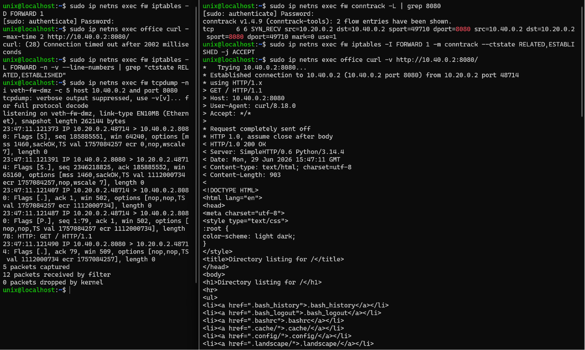
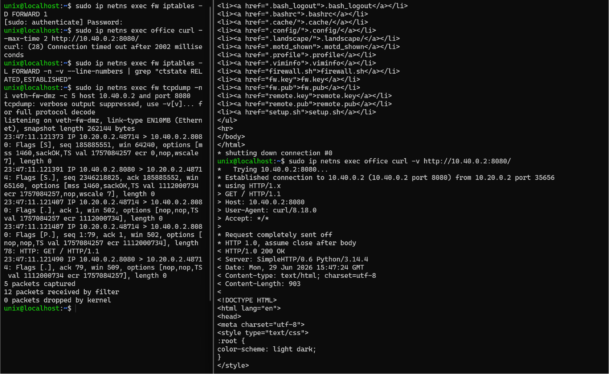

#### 六、ESTABLISHED,RELATED 的必要性

| 必要性           | 说明                                                                 |
| :--------------- | :------------------------------------------------------------------- |
| 保证双向通信     | 只放行 NEW 的 SYN 包，回程 SYN-ACK 会被丢弃，连接无法建立            |
| 提升性能         | 已建立连接无需重复匹配复杂规则，减轻防火墙负担                        |
| 支持关联连接     | FTP、ICMP 错误消息等需要 RELATED 状态，确保辅助通道正常工作           |
| 安全不妥协       | 仅放行属于已认证会话的包，状态由内核跟踪，不会增加安全风险            |

**状态检测规则必须置于 FORWARD 链最前面，否则正常业务会因回程包被拦截而中断。**


## 九、实验问题汇总与解决方案

在本次完整实验过程中，遇到了多种典型问题。以下按实验阶段逐一列出问题现象、根因分析及解决方案。

---

### 9.1 第一部分：网络拓扑搭建（setup.sh）

**问题1：remote 命名空间的 veth 对缺失**

- **现象**：脚本未创建 `veth-fw-remote` / `veth-remote`，导致 remote 命名空间无网络接口，VPN 隧道无法建立。
- **原因**：脚本只创建了 office、guest、dmz、internet 四对 veth，遗漏了 VPN 区域。
- **解决方案**：在 `setup.sh` 中补充创建第 5 对 veth。

```bash
sudo ip link add veth-fw-remote type veth peer name veth-remote
sudo ip link set veth-fw-remote netns fw
sudo ip link set veth-remote netns remote
sudo ip netns exec fw ip addr add 10.10.10.1/24 dev veth-fw-remote
sudo ip netns exec remote ip addr add 10.10.10.2/24 dev veth-remote
sudo ip netns exec remote ip route add default via 10.10.10.1
```

**问题2：清理旧环境时未删除 remote 相关 veth**

- **现象**：重复运行 `setup.sh` 时，残留的 veth 导致冲突。
- **原因**：清理代码中未包含 `veth-fw-remote` 和 `veth-remote`。
- **解决方案**：在清理部分增加删除命令。

```bash
sudo ip link del veth-fw-remote 2>/dev/null
sudo ip link del veth-remote 2>/dev/null
```

---

### 9.2 第二部分：防火墙策略（firewall.sh）

**问题3：iptables REJECT 参数错误**

- **现象**：执行 `firewall.sh` 时报错 `RULE_APPEND failed (Invalid argument)`，部分 REJECT 规则未添加。
- **原因**：未指定 `-p` 协议时使用了 `--reject-with tcp-reset`，该参数仅对 TCP 有效，匹配所有协议时报错。
- **解决方案**：非 TCP 协议的 REJECT 改用 `--reject-with icmp-host-unreachable`。

```bash
# 针对所有协议
-j REJECT --reject-with icmp-host-unreachable

# 针对 TCP
-j REJECT --reject-with tcp-reset
```

**问题4：日志无法通过 journalctl/dmesg 查看**

- **现象**：`journalctl -k`、`dmesg`、`/var/log/kern.log` 均无 iptables LOG 输出。
- **原因**：实验环境为 WSL，内核日志机制与标准 Linux 不同，`iptables LOG` 未暴露给上述工具。
- **解决方案**：使用 `iptables -L FORWARD -v -n` 的计数器（`pkts` 列）证明 LOG 规则被命中。

```bash
sudo ip netns exec fw iptables -L FORWARD -v -n --line-numbers | grep "GUEST-TO-OFFICE"
```

---

### 9.3 第三部分：VPN 远程接入

**问题5：wg-quick 找不到配置文件**

- **现象**：执行 `sudo ip netns exec remote wg-quick down wg0` 报错 `wg-quick: '/etc/wireguard/wg0.conf' does not exist`。
- **原因**：配置文件存放在 `/etc/wireguard/remote/wg0.conf`，而 `wg-quick` 默认查找 `/etc/wireguard/wg0.conf`。
- **解决方案**：使用完整路径。

```bash
sudo ip netns exec remote wg-quick down /etc/wireguard/remote/wg0.conf
sudo ip netns exec remote wg-quick up /etc/wireguard/remote/wg0.conf
```

**问题6：sed 修改 AllowedIPs 时报错**

- **现象**：执行 `sed -i 's/10.20.0.0\\/24,10.40.0.0\\/24/10.20.0.0\\/24/'` 报错 `unknown option to 's'`。
- **原因**：正则中的斜杠未正确转义。
- **解决方案**：使用 `|` 作为分隔符。

```bash
sudo ip netns exec remote sed -i 's|^AllowedIPs = .*|AllowedIPs = 10.20.0.0/24|' /etc/wireguard/remote/wg0.conf
```

**问题7：修改 AllowedIPs 后路由未更新**

- **现象**：修改配置后，访问目标网段仍不走 `wg0`。
- **原因**：未重启 VPN 隧道，路由未重新加载。
- **解决方案**：修改后必须执行 `wg-quick down` 和 `wg-quick up` 使配置生效。

---

### 9.4 第四部分：安全审计与日志分析

**问题8：实时监控无自定义日志输出**

- **现象**：`journalctl -k -f` 只显示系统杂项日志，没有 `GUEST-TO-OFFICE` 等前缀。
- **原因**：同问题4（WSL 环境限制）。
- **解决方案**：使用 `watch` 动态观察 iptables 计数器变化。

```bash
watch -n 1 'sudo ip netns exec fw iptables -L FORWARD -v -n --line-numbers | grep "GUEST-TO-OFFICE"'
```

**问题9：日志统计结果为 0**

- **现象**：`journalctl --grep` 统计结果为 0。
- **原因**：同上。
- **解决方案**：改用计数器前后对比，记录 `pkts` 增量作为日志条数证据。

---

### 9.5 第五部分：攻防演练

**问题10：hping3 未安装**

- **现象**：执行 `sudo ip netns exec guest hping3 ...` 报错 `exec of "hping3" failed: No such file or directory`。
- **解决方案**：

```bash
sudo apt update && sudo apt install hping3 -y
```

**问题11：ping 扫描显示网关可通**

- **现象**：`ping 10.20.0.1` 成功，但其他 IP 不可达。
- **原因**：网关地址 `10.20.0.1` 是防火墙自身接口，ICMP 回包由防火墙直接生成，不代表内网主机在线。
- **结论**：这是正常行为，扫描无效，防御有效。

---

### 9.6 第八部分：故障排查专题

**问题12：DNAT 配置正确但外网访问超时**

- **现象**：`curl 203.0.113.1:8080` 超时，DNAT 规则存在。
- **排查发现**：FORWARD 链缺少放行规则；补充规则后出现 `Connection refused`，发现 DMZ 服务未运行。
- **解决方案**：

```bash
# 添加 FORWARD 规则
sudo ip netns exec fw iptables -I FORWARD 5 -i veth-fw-inet -o veth-fw-dmz -d 10.40.0.2 -p tcp --dport 8080 -m conntrack --ctstate NEW -j ACCEPT

# 启动服务
sudo ip netns exec dmz python3 -m http.server 8080 
```

**问题13：VPN 隧道握手正常但业务访问失败**

- **现象**：`wg show` 握手成功，但 remote 无法访问 `10.40.0.2:8080`。
- **排查发现**：FORWARD 链拒绝 VPN 流量，或 AllowedIPs 未包含目标网段。
- **解决方案**：检查 FORWARD 链，补充规则；修正 AllowedIPs，重启隧道。

**问题14：删除状态检测规则后 TCP 连接失败**

- **现象**：SYN 包能通过，但 SYN-ACK 被拦截，curl 超时。
- **原因**：缺少状态检测规则导致回程包被默认 DROP。
- **解决方案**：

```bash
sudo ip netns exec fw iptables -I FORWARD 5 -m conntrack --ctstate RELATED,ESTABLISHED -j ACCEPT
```

**问题15：删除 FORWARD 规则时行号错误**

- **现象**：删除规则时报错或删错规则。
- **原因**：未确认行号或行号变化。
- **解决方案**：删除前先用 `iptables -L --line-numbers` 确认目标行号。

---

### 9.7 通用工具与技巧

| 问题                 | 解决方案                                     |
| :------------------- | :------------------------------------------- |
| WSL 环境日志不可见   | 使用 `iptables -L -v` 计数器替代             |
| sed 转义错误         | 使用 `\|` 作为分隔符                          |
| 配置文件路径错误     | 使用完整绝对路径                             |
| 路由不生效           | 重启 VPN 或 `ip route flush cache`            |
| 抓包无输出           | 检查接口名称、过滤条件，确保流量触发         |


## 十、总结与思考

本次企业级网络安全架构搭建与攻防演练实验，从零开始构建了一套包含办公网、访客网、DMZ区、外网和 VPN 接入的多区域隔离网络，并在此基础上实施了防火墙策略、安全审计、攻防演练和故障排查全流程。通过这一系列实践，让我对网络安全架构有了系统性的认知和理解。

### 一、网络分区：安全隔离的物理基础

网络分区是企业安全架构的第一道防线。本实验通过 Linux 网络命名空间将不同安全等级的区域进行逻辑隔离，办公网、访客网、DMZ区、外网和 VPN 分别处于独立的网络命名空间中，彼此通过防火墙（fw）进行路由和访问控制。这种分层设计符合企业网络的经典模型：信任度最高的办公网和内网位于核心，DMZ区对外提供可控服务，访客网和外网则处于非信任区域。从实战角度看，分区隔离的意义在于缩小攻击面，即使某个区域被攻破，攻击者也难以横向移动到其他区域，这是纵深防御理念的基础体现。

### 二、防火墙策略：边界防护的核心逻辑

- iptables 作为本实验的边界防火墙，其规则设计体现了安全策略的精髓——**最小权限原则**。默认 `DROP` 所有流量，仅显式放行必要的业务访问，这种“白名单”模式从源头杜绝了未授权访问。

- 在规则编排上，`ESTABLISHED,RELATED` 状态检测规则必须前置，否则正常业务会因回程包被拦截而中断，更深层次的风险在于半开连接会迅速占满 conntrack 表——若 SYN 包因 NEW 规则被放行，而回程 SYN-ACK 被拦截，防火墙内存中会残留大量无法完成的连接记录，最终导致无法新建任何连接（危害类似 SYN Flood 攻击），这是生产环境中极易被忽略的细节。`LOG` 规则置于 `REJECT` 之前，确保每次拦截都有据可查，为安全审计提供基础。不同区域使用差异化的 `LOG` 前缀，使日志分析能够快速定位异常源，提升了安全运营效率。

- `REJECT` 与 `DROP` 的选择也值得深思：`REJECT` 快速返回错误，便于调试和用户体验；`DROP` 静默丢弃，隐藏防火墙存在，更适合生产环境的外网边界。本实验在调试阶段使用 `REJECT`，正是对安全可控与运维效率平衡的体现。

### 三、VPN 接入：加密隧道下的最小权限访问

WireGuard VPN 的搭建让我深刻理解了远程接入安全的设计原则。Split Tunnel 模式通过 `AllowedIPs` 精准控制哪些流量进入隧道，避免 `0.0.0.0/0` 导致的所有流量劫持风险，既保护了内网资源，又防止了隧道带宽浪费。服务端仅允许 remote 的 VPN IP（`10.10.10.2/32`），客户端只允许访问办公网和 DMZ 两个特定网段，这种双向限制有效防止了隧道被攻破后的横向扩散。

### 四、安全审计与攻防验证：防御有效性的闭环检验

日志审计是安全运营的眼睛，而攻防演练是检验防御有效性的试金石。本实验通过模拟端口扫描、源端口篡改、IP 伪造等攻击手段，验证了防火墙策略的有效性。guest 网段的扫描被 `REJECT` 拦截，VPN 伪造流量因接口不符和加密认证被阻挡，所有攻击尝试均被记录在案。特别是速率限制机制（`limit` 模块）的应用，有效防止了日志洪水攻击，保障了审计系统的稳定性。

### 五、故障排查：理论与实践融合的关键能力

实验过程中遇到的各类故障（DNAT 转发失败、VPN 路由错误、状态检测缺失等）让我意识到，网络安全不仅需要理论设计，更需要细致的排错能力。`tcpdump` 抓包定位、`conntrack` 连接跟踪分析、`iptables` 计数器验证，这些工具的组合使用是快速定位问题的关键。一次完整的排错经历往往比多次顺利的实验更有价值，它训练的是从现象到根因的逻辑推理能力。

### 六、对企业网络安全架构的整体理解

通过本次实验，我对企业网络安全架构形成了更完整的认知。**安全架构不是单一技术的堆叠，而是分层隔离、精细管控、加密传输、持续审计、定期验证的有机整体。** 网络分区是基础骨架，防火墙策略是核心肌肉，VPN 是远程血脉，审计日志是神经系统，攻防演练是免疫检验。任何一个环节的缺失都会削弱整体防御能力。

未来在企业实际环境中，还需引入零信任架构、微隔离、WAF、IDS/IPS、威胁情报等更多安全能力，但本次实验建立的体系化思维将始终贯穿其中——**安全没有绝对，只有持续加固；防护不是静态配置，而是动态演进。** 这种从理念到实践、从架构到细节的完整经历，为我后续深入网络安全领域奠定了扎实的基础。