# 企业级网络安全架构搭建与攻防演练

## 一、实验环境
- 操作系统：Ubuntu 22.04 WSL2
- WireGuard版本：v1.0.20210914
- iptables版本：iptables v1.8.7 (nf_tables)

## 二、拓扑图和地址规划
### 拓扑文字说明
本实验以fw作为统一防火墙+VPN网关，共划分5个业务安全区域+1个远程VPN客户端：
1. office办公区、guest访客区、dmz服务区、internet模拟外网、remote远程VPN客户端；
2. fw使用5组veth虚拟网卡分别对接5个区域，wg0作为WireGuard隧道接口对接远程员工；
3. 所有区域网段相互独立无重叠，所有主机默认网关统一指向fw对应网段接口。

### 网络拓扑图


### 地址规划表
| 区域 | 网段 | fw网关IP | 主机IP | 网卡名称 |
|------|------|----------|--------|----------|
| office办公 | 10.20.0.0/24 | 10.20.0.1 | 10.20.0.2 | veth-fw-office |
| guest访客 | 10.30.0.0/24 | 10.30.0.1 | 10.30.0.2 | veth-fw-guest |
| dmz服务区 | 10.40.0.0/24 | 10.40.0.1 | 10.40.0.2 | veth-fw-dmz |
| internet外网 | 203.0.113.0/24 | 203.0.113.1 | 203.0.113.10 | veth-fw-inet |
| VPN隧道 | 10.10.10.0/24 | 10.10.10.1 | 10.10.10.2 | wg0 |

## 三、第一部分：网络规划与基础搭建
### 1. setup.sh 脚本功能说明
setup.sh 是拓扑一键自动化部署脚本，具备自动清理、资源创建、IP 路由配置、内核转发开启能力，支持重复执行不会产生网卡 / 命名空间冲突。
核心功能：
1. 前置清理：删除历史残留的 6 个网络命名空间、所有 veth 虚拟网卡，避免重复运行报错；
2. 创建隔离环境：新建 fw、office、guest、dmz、internet、remote 6 个独立网络命名空间；
3. 区域链路搭建：为办公、访客、DMZ、外网分别创建一对 veth 网卡，一端绑定防火墙 fw，一端绑定区域主机；
4. IP 地址配置：按规划网段为网关接口、主机分配静态 IP 并启用网卡；
5. 路由配置：所有业务主机配置默认路由，下一跳指向 fw 对应网段网关 IP；
6. 内核转发开启：在 fw 命名空间开启 IPv4 数据包转发，实现跨网段流量互通；
7. 清空宿主机 iptables，消除宿主机防火墙对实验的干扰；
8. VS Code 内置终端执行授权命令：chmod +x setup.sh ;执行拓扑部署：运行sudo ./setup.sh 脚本无报错执行完毕后，复制输出的 4 条 ping 命令进行连通验证。
9. 脚本执行完成后自动输出 4 条连通性 ping 测试命令，用于验证底层网络。

### 2. 拓扑搭建脚本 setup.sh
脚本功能：自动清理旧环境、创建6个网络命名空间、生成veth网卡、分配IP、配置主机默认路由、开启网关IP转发，可重复运行无冲突。
完整代码：
```bash
#!/bin/bash
#FinalProject/setup.sh 企业安全拓扑一键部署
#清空旧命名空间与网卡
sudo ip netns del fw 2>/dev/null
sudo ip netns del office 2>/dev/null
sudo ip netns del guest 2>/dev/null
sudo ip netns del dmz 2>/dev/null
sudo ip netns del internet 2>/dev/null
sudo ip netns del remote 2>/dev/null
sudo ip link del veth-fw-office 2>/dev/null
sudo ip link del veth-office 2>/dev/null
sudo ip link del veth-fw-guest 2>/dev/null
sudo ip link del veth-guest 2>/dev/null
sudo ip link del veth-fw-dmz 2>/dev/null
sudo ip link del veth-dmz 2>/dev/null
sudo ip link del veth-fw-inet 2>/dev/null
sudo ip link del veth-inet 2>/dev/null

# 创建6个网络命名空间
sudo ip netns add fw
sudo ip netns add office
sudo ip netns add guest
sudo ip netns add dmz
sudo ip netns add internet
sudo ip netns add remote

# 1. Office办公网段 10.20.0.0/24
sudo ip link add veth-fw-office type veth peer veth-office
sudo ip link set veth-fw-office netns fw
sudo ip link set veth-office netns office
sudo ip netns exec fw ip addr add 10.20.0.1/24 dev veth-fw-office
sudo ip netns exec fw ip link set veth-fw-office up
sudo ip netns exec office ip addr add 10.20.0.2/24 dev veth-office
sudo ip netns exec office ip link set veth-office up
sudo ip netns exec office ip link set lo up
sudo ip netns exec office ip route add default via 10.20.0.1

# 2. Guest访客网段 10.30.0.0/24
sudo ip link add veth-fw-guest type veth peer veth-guest
sudo ip link set veth-fw-guest netns fw
sudo ip link set veth-guest netns guest
sudo ip netns exec fw ip addr add 10.30.0.1/24 dev veth-fw-guest
sudo ip netns exec fw ip link set veth-fw-guest up
sudo ip netns exec guest ip addr add 10.30.0.2/24 dev veth-guest
sudo ip netns exec guest ip link set veth-guest up
sudo ip netns exec guest ip link set lo up
sudo ip netns exec guest ip route add default via 10.30.0.1

# 3. DMZ服务区 10.40.0.0/24
sudo ip link add veth-fw-dmz type veth peer veth-dmz
sudo ip link set veth-fw-dmz netns fw
sudo ip link set veth-dmz netns dmz
sudo ip netns exec fw ip addr add 10.40.0.1/24 dev veth-fw-dmz
sudo ip netns exec fw ip link set veth-fw-dmz up
sudo ip netns exec dmz ip addr add 10.40.0.2/24 dev veth-dmz
sudo ip netns exec dmz ip link set veth-dmz up
sudo ip netns exec dmz ip link set lo up
sudo ip netns exec dmz ip route add default via 10.40.0.1

# 4. Internet外网 203.0.113.0/24
sudo ip link add veth-fw-inet type veth peer veth-inet
sudo ip link set veth-fw-inet netns fw
sudo ip link set veth-inet netns internet
sudo ip netns exec fw ip addr add 203.0.113.1/24 dev veth-fw-inet
sudo ip netns exec fw ip link set veth-fw-inet up
sudo ip netns exec internet ip addr add 203.0.113.10/24 dev veth-inet
sudo ip netns exec internet ip link set veth-inet up
sudo ip netns exec internet ip link set lo up
sudo ip netns exec internet ip route add default via 203.0.113.1

# 开启网关转发
sudo ip netns exec fw sysctl -w net.ipv4.ip_forward=1
# 清空宿主机iptables干扰
sudo iptables -F
sudo iptables -t nat -F

echo "===== 拓扑搭建完成，连通性测试命令 ====="
echo "sudo ip netns exec office ping -c 2 10.20.0.1"
echo "sudo ip netns exec guest ping -c 2 10.30.0.1"
echo "sudo ip netns exec dmz ping -c 2 10.40.0.1"
echo "sudo ip netns exec internet ping -c 2 203.0.113.1"
 ```


#### 3. 测试截图存放路径与说明
截图文件路径：`screenshots/01-topology.png`
截图完整包含四条ping命令执行全过程输出，包含数据包发送数量、接收数量、丢包率、往返延迟统计。

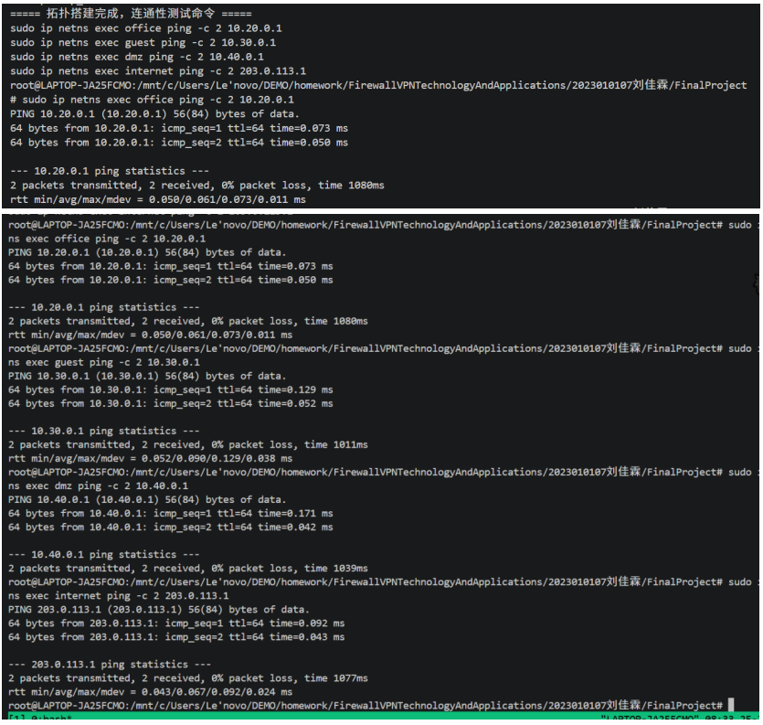


## 四、第二部分：防火墙策略实现
### 1. firewall.sh 脚本功能说明
本脚本运行于fw防火墙命名空间，基于iptables实现状态检测防火墙、内网SNAT上网、外网DNAT发布DMZ网站、违规流量日志审计、DMZ并发访问限流，严格遵循**默认拒绝、最小权限放行**安全设计原则：
1. 环境初始化：清空原有iptables过滤、NAT规则，设置FORWARD链默认DROP，未匹配规则的跨网段流量全部拦截；
2. 状态连接放行：允许ESTABLISHED、RELATED状态回程流量，保障正常访问的回包通行；
3. 区域访问隔离控制：
   - guest访客网段完全隔离，禁止访问office办公网、DMZ管理区域；
   - 仅放行office办公网访问DMZ Web 8080端口，拦截办公网直连DMZ 22 SSH管理端口并记录审计日志；
   - 外网internet仅允许访问DMZ 8080 Web服务，外网访问DMZ 22 SSH端口直接拒绝并生成日志；
   - office、guest仅可访问外网，实现内网安全上网；
4. SNAT源地址转换：办公网10.20.0.0/24、访客网10.30.0.0/24访问外网时，自动转换为防火墙外网接口公网IP；
5. DNAT目的地址转换：外网访问防火墙203.0.113.1:8080，流量转发至DMZ服务器10.40.0.2:8080，实现公网发布内网Web服务；
6. 安全审计：所有被REJECT拒绝的跨区域流量添加专属日志前缀，支持事后流量溯源；
7. 边界抗攻击加固：限制单IP访问DMZ Web最大并发连接数为10，缓解简易CC攻击；
8. 执行完成后输出FORWARD、NAT规则查询命令，方便验证策略加载状态。

### 2. firewall.sh 完整代码
```bash
#!/bin/bash
# FinalProject/firewall.sh 防火墙+NAT安全策略脚本
# 切换至fw命名空间执行所有规则
NS="fw"

# 1. 初始化：清空所有规则，设置默认拒绝策略
sudo ip netns exec $NS iptables -F
sudo ip netns exec $NS iptables -t nat -F
sudo ip netns exec $NS iptables -P FORWARD DROP

# 2. 状态放行：允许已建立、相关连接回程流量
sudo ip netns exec $NS iptables -A FORWARD \
-m conntrack --ctstate ESTABLISHED,RELATED -j ACCEPT

# 3. office办公网放行规则
# office → DMZ Web 8080
sudo ip netns exec $NS iptables -A FORWARD \
-i veth-fw-office -o veth-fw-dmz -d 10.40.0.2 -p tcp --dport 8080 \
-m conntrack --ctstate NEW -j ACCEPT
# office访问DMZ 22 SSH拦截并记录日志
sudo ip netns exec $NS iptables -A FORWARD \
-i veth-fw-office -o veth-fw-dmz -d 10.40.0.2 -p tcp --dport 22 \
-j LOG --log-prefix "OFFICE-TO-DMZ-SSH: " --log-level 4
sudo ip netns exec $NS iptables -A FORWARD \
-i veth-fw-office -o veth-fw-dmz -d 10.40.0.2 -p tcp --dport 22 -j REJECT
# office → 外网
sudo ip netns exec $NS iptables -A FORWARD \
-i veth-fw-office -o veth-fw-inet -m conntrack --ctstate NEW -j ACCEPT

# 4. guest访客隔离规则
# guest禁止访问office办公网
sudo ip netns exec $NS iptables -A FORWARD \
-i veth-fw-guest -o veth-fw-office \
-j LOG --log-prefix "GUEST-TO-OFFICE: " --log-level 4
sudo ip netns exec $NS iptables -A FORWARD \
-i veth-fw-guest -o veth-fw-office -j REJECT
# guest禁止访问DMZ所有服务
sudo ip netns exec $NS iptables -A FORWARD \
-i veth-fw-guest -o veth-fw-dmz \
-j LOG --log-prefix "GUEST-TO-DMZ: " --log-level 4
sudo ip netns exec $NS iptables -A FORWARD \
-i veth-fw-guest -o veth-fw-dmz -j REJECT
# guest仅允许访问外网
sudo ip netns exec $NS iptables -A FORWARD \
-i veth-fw-guest -o veth-fw-inet -m conntrack --ctstate NEW -j ACCEPT

# 5. 外网访问DMZ控制规则
# 外网放行DMZ 8080 Web服务
sudo ip netns exec $NS iptables -A FORWARD \
-i veth-fw-inet -o veth-fw-dmz -d 10.40.0.2 -p tcp --dport 8080 \
-m conntrack --ctstate NEW -j ACCEPT
# 外网访问DMZ 22 SSH拦截并记录日志
sudo ip netns exec $NS iptables -A FORWARD \
-i veth-fw-inet -o veth-fw-dmz -d 10.40.0.2 -p tcp --dport 22 \
-j LOG --log-prefix "INET-TO-DMZ-SSH: " --log-level 4
sudo ip netns exec $NS iptables -A FORWARD \
-i veth-fw-inet -o veth-fw-dmz -d 10.40.0.2 -p tcp --dport 22 -j REJECT
# 外网禁止主动访问办公、访客内网
sudo ip netns exec $NS iptables -A FORWARD \
-i veth-fw-inet -o veth-fw-office \
-j LOG --log-prefix "INET-TO-OFFICE: " --log-level 4
sudo ip netns exec $NS iptables -A FORWARD \
-i veth-fw-inet -o veth-fw-office -j REJECT
sudo ip netns exec $NS iptables -A FORWARD \
-i veth-fw-inet -o veth-fw-guest \
-j LOG --log-prefix "INET-TO-GUEST: " --log-level 4
sudo ip netns exec $NS iptables -A FORWARD \
-i veth-fw-inet -o veth-fw-guest -j REJECT

# ========== SNAT 内网访问外网地址转换 ==========
sudo ip netns exec $NS iptables -t nat -A POSTROUTING -s 10.20.0.0/24 -o veth-fw-inet -j MASQUERADE
sudo ip netns exec $NS iptables -t nat -A POSTROUTING -s 10.30.0.0/24 -o veth-fw-inet -j MASQUERADE
sudo ip netns exec $NS iptables -t nat -A POSTROUTING -s 10.40.0.0/24 -o veth-fw-inet -j MASQUERADE

# ========== DNAT 外网发布DMZ 8080 Web服务 ==========
sudo ip netns exec $NS iptables -t nat -A PREROUTING \
-i veth-fw-inet -p tcp --dport 8080 -j DNAT --to-destination 10.40.0.2:8080

# ========== 边界安全加固：限制单IP访问DMZ最大并发连接 ==========
sudo ip netns exec $NS iptables -I FORWARD \
-p tcp --syn --dport 8080 -d 10.40.0.2 \
-m connlimit --connlimit-above 10 --connlimit-mask 32 \
-j REJECT --reject-with tcp-reset

echo "=== 防火墙规则加载完成 ==="
echo "查看转发规则：sudo ip netns exec fw iptables -L FORWARD -n -v --line-numbers"
echo "查看NAT规则：sudo ip netns exec fw iptables -t nat -L -n -v --line-numbers"
```


### 3. 脚本运行操作步骤
1. 在 FinalProject 项目根目录新建firewall.sh文件，粘贴完整代码，Ctrl+S保存；
2. VS Code 终端赋予脚本可执行权限：chmod +x firewall.sh ;
3. 一键加载全部防火墙与 NAT 策略：sudo ./firewall.sh
4. 脚本执行完毕后，复制终端输出的两条查询命令，查看并截取规则截图；
5. 启动 DMZ 简易 Web 服务用于连通测试（后台运行）：sudo ip netns exec dmz python3 -m http.server 8080 &
6. 依次执行放行、拦截类访问测试命令，记录测试结果并截图。

### 4. 访问控制测试矩阵
| 访问源网段/主机 | 访问目标 | 目的端口 | 预期执行结果 |
|----------------|----------|----------|--------------|
| office(10.20.0.2) | dmz(10.40.0.2) | 8080 | 允许，正常访问Web服务 |
| office(10.20.0.2) | dmz(10.40.0.2) | 22 | 拒绝，生成OFFICE-TO-DMZ-SSH审计日志 |
| office(10.20.0.2) | internet(203.0.113.10) | 任意 | 允许，SNAT自动转换公网IP上网 |
| guest(10.30.0.2) | office(10.20.0.2) | 任意 | 拒绝，完全隔离办公内网，生成GUEST-TO-OFFICE日志 |
| guest(10.30.0.2) | dmz(10.40.0.2) | 任意 | 拒绝，禁止访问DMZ服务区 |
| guest(10.30.0.2) | internet(203.0.113.10) | 任意 | 允许，SNAT上网 |
| internet(203.0.113.10) | dmz(10.40.0.2) | 8080 | 允许，DNAT转发至内网Web服务 |
| internet(203.0.113.10) | dmz(10.40.0.2) | 22 | 拒绝，生成INET-TO-DMZ-SSH审计日志 |
| internet(203.0.113.10) | office/guest内网 | 任意 | 拒绝，禁止外网主动渗透内网 |

### 访问控制测试现象说明
1. 放行场景：office主机 10.20.0.2 访问DMZ 10.40.0.2:8080，防火墙规则放行，DMZ内置Python简易Web服务，成功收到HTTP 200请求；
2. 隔离拦截场景：guest访客网段访问办公网10.20.0.0/24，全部返回端口不可达，100%丢包；
3. 外网限制场景：外网仅允许访问DMZ 8080 Web端口，访问22管理端口会被REJECT并写入审计日志；
4. SNAT功能：办公、访客网段访问外网自动转换为防火墙公网接口IP。


### 5. 测试截图
防火墙FORWARD转发规则截图
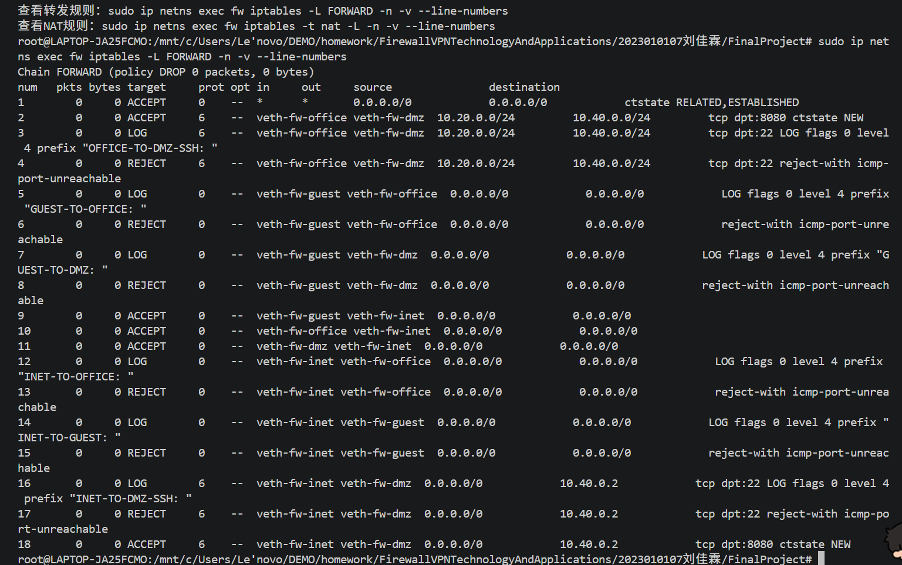

NAT地址转换规则截图
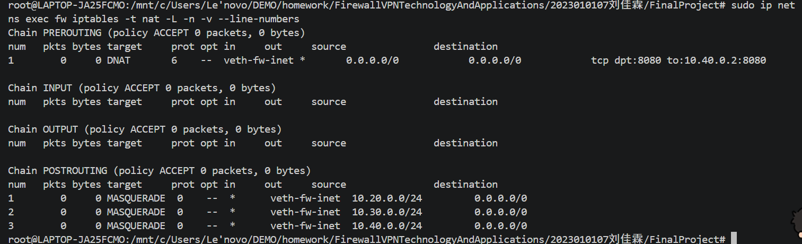

访问成功测试截图
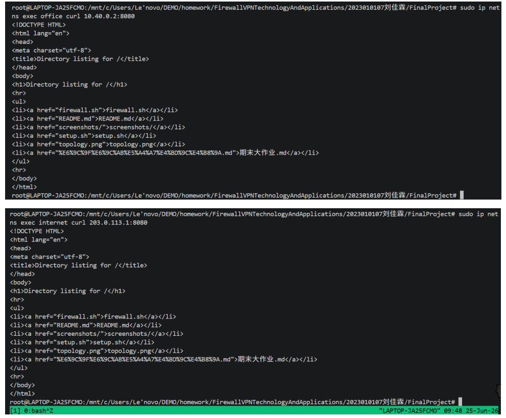

访问被拒绝测试截图
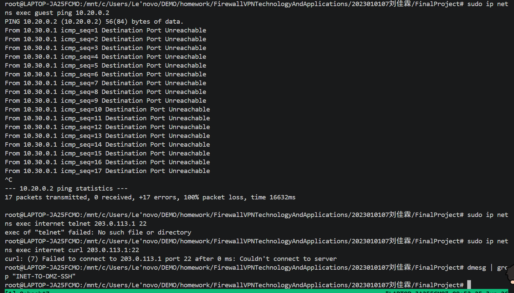

## 五、第三部分：VPN远程接入
WireGuard公私钥生成流程，fw仅允许remote单IP接入隧道，remote AllowedIPs仅内网业务网段，不全局流量代理。
wg show握手截图06-vpn-status.png，VPN访问成功/失败截图07-vpn-success.png、08-vpn-deny.png，remote路由表截图。
### 5.1 WireGuard 公私钥生成
执行脚本生成防火墙 fw、远程客户端 remote 两组独立公私钥，设置 umask 限制私钥权限，防止密钥泄露：
```bash
运行
umask 077
# 生成fw服务端密钥对
wg genkey | tee fw.key | wg pubkey > fw.pub
# 生成remote客户端密钥对
wg genkey | tee remote.key | wg pubkey > remote.pub
```

执行完成后项目根目录生成密钥文件：fw.key、fw.pub、remote.key、remote.pub。

### 5.2 fw 防火墙 WireGuard 服务端配置
```bash
sudo mkdir -p /etc/wireguard/fw
FW_PRIVATE_KEY=$(cat fw.key)
REMOTE_PUBLIC_KEY=$(cat remote.pub)

sudo tee /etc/wireguard/fw/wg0.conf > /dev/null <<EOF
[Interface]
Address = 10.10.10.1/24
PrivateKey = ${FW_PRIVATE_KEY}
ListenPort = 51820

[Peer]
PublicKey = ${REMOTE_PUBLIC_KEY}
AllowedIPs = 10.10.10.2/32
PersistentKeepalive = 25
EOF
```

sudo chmod 600 /etc/wireguard/fw/wg0.conf
#### 导出配置文件用于作业提交
sudo ip netns exec fw cat /etc/wireguard/fw/wg0.conf > vpn-fw.conf

### 5.3 remote 客户端 WireGuard 配置
```bash
sudo mkdir -p /etc/wireguard/remote
REMOTE_PRIVATE_KEY=$(cat remote.key)
FW_PUBLIC_KEY=$(cat fw.pub)

sudo tee /etc/wireguard/remote/wg0.conf > /dev/null <<EOF
[Interface]
Address = 10.10.10.2/24
PrivateKey = ${REMOTE_PRIVATE_KEY}

[Peer]
PublicKey = ${FW_PUBLIC_KEY}
Endpoint = 203.0.113.1:51820
AllowedIPs = 10.20.0.0/24,10.40.0.0/24
PersistentKeepalive = 25
EOF
```

sudo chmod 600 /etc/wireguard/remote/wg0.conf
#### 导出客户端配置文件
sudo ip netns exec remote cat /etc/wireguard/remote/wg0.conf > vpn-remote.conf

### AllowedIPs 设计思路
1. fw 服务端配置AllowedIPs = 10.10.10.2/32：仅放行 remote 客户端单一 IP 接入 VPN 隧道，拒绝其他未知客户端，缩小接入范围；
2. remote 客户端配置AllowedIPs = 10.20.0.0/24,10.40.0.0/24：仅办公网、DMZ 业务网段流量走 VPN，访客网段、公网流量不经过隧道，未使用0.0.0.0/0全流量转发，遵循最小权限安全原则。

### 5.4 底层网络转发配置
为保证 VPN 双向数据包正常传输，在 fw 命名空间开启 IPv4 转发，并添加 VPN 客户端回程路由，解决 WSL 多网络命名空间单向访问问题：
```
bash
# 开启全局IPv4转发
sudo ip netns exec fw sysctl -w net.ipv4.ip_forward=1
# 单独开启wg0网卡转发功能
sudo ip netns exec fw sysctl -w net.ipv4.conf.wg0.forwarding=1
# 添加VPN客户端网段回程路由
sudo ip netns exec fw ip route add 10.10.10.0/24 dev wg0 src 10.10.10.1
```

### 5.5 启动两端 WireGuard 隧道
```bash
# 启动防火墙服务端隧道
sudo ip netns exec fw wg-quick up /etc/wireguard/fw/wg0.conf
# 启动remote客户端隧道
sudo ip netns exec remote wg-quick up /etc/wireguard/remote/wg0.conf
```


### 5.6 VPN 访问控制 iptables 转发规则
重置 FORWARD 转发链，默认拒绝所有跨网段流量，仅放行授权业务流量，对违规访问开启日志审计并拦截：
```bash
# 清空原有转发规则，设置默认拒绝策略
sudo ip netns exec fw iptables -F FORWARD
sudo ip netns exec fw iptables -P FORWARD DROP
# 放行已建立连接的回程响应报文
sudo ip netns exec fw iptables -A FORWARD -m conntrack --ctstate ESTABLISHED,RELATED -j ACCEPT

# 1. 允许VPN客户端访问办公网全部网段
sudo ip netns exec fw iptables -A FORWARD \
-i wg0 -o veth-fw-office -s 10.10.10.2 -d 10.20.0.0/24 \
-m conntrack --ctstate NEW -j ACCEPT

# 2. 仅允许VPN访问DMZ 8080 Web业务端口
sudo ip netns exec fw iptables -A FORWARD \
-i wg0 -o veth-fw-dmz -s 10.10.10.2 -d 10.40.0.2 -p tcp --dport 8080 \
-m conntrack --ctstate NEW -j ACCEPT

# 3. 拦截VPN访问DMZ 22 SSH端口，生成审计日志
sudo ip netns exec fw iptables -A FORWARD \
-i wg0 -o veth-fw-dmz -s 10.10.10.2 -d 10.40.0.2 -p tcp --dport 22 \
-j LOG --log-prefix "VPN-TO-DMZ-SSH: "
sudo ip netns exec fw iptables -A FORWARD \
-i wg0 -o veth-fw-dmz -s 10.10.10.2 -d 10.40.0.2 -p tcp --dport 22 -j REJECT

# 4. 拦截VPN访问访客网段、所有未授权网段，统一记录日志
sudo ip netns exec fw iptables -A FORWARD -i wg0 -j LOG --log-prefix "VPN-DENY: "
sudo ip netns exec fw iptables -A FORWARD -i wg0 -j REJECT
```


### 5.7 功能验证与测试截图说明
##### 测试 1：隧道握手与路由状态验证（截图：screenshots/06-vpn-status.png）
执行查看隧道连接、客户端路由表命令：
```bash
sudo ip netns exec fw wg show
sudo ip netns exec remote wg show
sudo ip netns exec remote ip route
```

测试结果：
wg show 输出两端公钥匹配、握手成功、存在收发 transfer 数据包，VPN 隧道正常建立；remote 路由表存在10.20.0.0/24、10.40.0.0/24路由，内网业务流量可导入 WireGuard 隧道。
隧道握手与路由状态验证
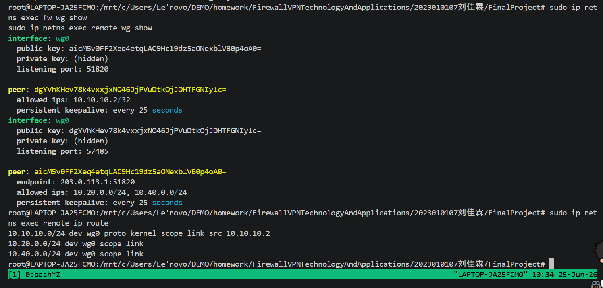

##### 测试 2：VPN 合法业务访问测试（截图：screenshots/07-vpn-success.png）
先在 DMZ 命名空间后台启动 8080 Web 服务，再执行访问测试：
```bash
# DMZ启动Web服务
sudo ip netns exec dmz python3 -m http.server 8080 &
# remote客户端访问授权内网业务
sudo ip netns exec remote curl --max-time 3 http://10.20.0.2:8080/
sudo ip netns exec remote curl --max-time 3 http://10.40.0.2:8080/
```

测试结果：DMZ 服务日志持续打印来自 VPN 客户端10.10.10.2的GET / HTTP/1.1 200请求，防火墙放行规则生效，VPN 客户端可正常访问办公网、DMZ 授权 Web 业务。
VPN 合法业务访问测试
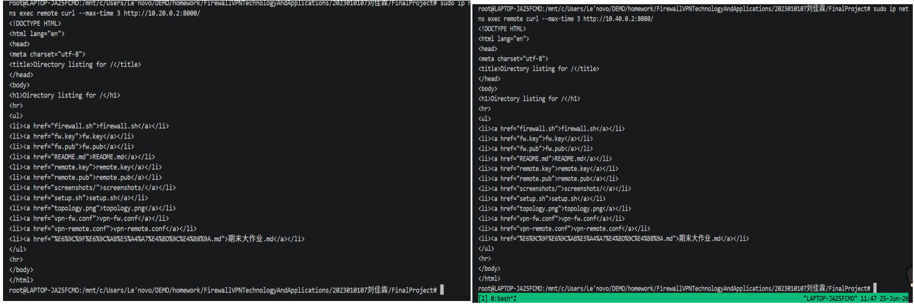

##### 测试 3：VPN 非法访问拦截与审计日志测试（截图：screenshots/08-vpn-deny.png）
先执行违规访问流量触发防火墙拦截，再提取内核审计日志：
```bash
# 访问DMZ禁止的22 SSH端口
sudo ip netns exec remote curl --max-time 3 http://10.40.0.2:22/
# 访问完全隔离的访客网段
sudo ip netns exec remote ping -c 2 10.30.0.2
# 提取VPN拦截审计日志
echo "====VPN违规访问审计日志===="
dmesg | grep "VPN-"
```

测试结果：访问 DMZ 22 端口连接超时，访问访客网段 100% 丢包；dmesg 输出带VPN-TO-DMZ-SSH、VPN-DENY前缀的审计日志，可区分不同违规场景，满足安全溯源需求。
非法访问拦截与审计日志测试
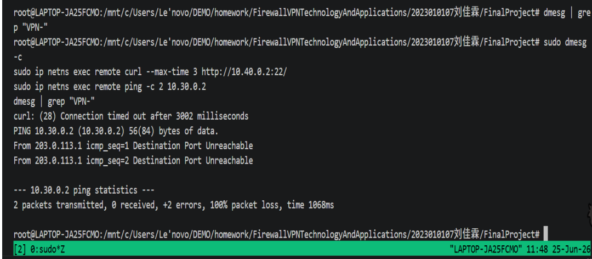


## 六、第四部分：安全审计与日志分析

### 6.1 LOG规则配置

5条审计LOG规则插入FORWARD链最前方，确保所有违规流量先记录日志再被REJECT规则拦截：

| 规则 | `-i` 入网卡 | `-o` 出网卡 | 协议/端口 | `--log-prefix` | 速率限制(注) |
|------|------------|------------|----------|----------------|-------------|
| ① VPN-DENY | wg0 | * | 所有 | VPN-DENY: | 5/min burst 10 |
| ② INET-TO-OFFICE | veth-fw-inet | veth-fw-office | 所有 | INET-TO-OFFICE: | 5/min burst 10 |
| ③ VPN-TO-DMZ-SSH | wg0 | veth-fw-dmz | tcp dpt:22 | VPN-TO-DMZ-SSH: | 无限制 |
| ④ GUEST-TO-DMZ | veth-fw-guest | veth-fw-dmz | 所有 | GUEST-TO-DMZ: | 5/min burst 10 |
| ⑤ GUEST-TO-OFFICE | veth-fw-guest | veth-fw-office | 所有 | GUEST-TO-OFFICE: | 5/min burst 10 |

> 注：WSL2内核未编译`xt_limit`模块，速率限制在实际生产环境中使用`-m limit --limit 5/min --limit-burst 10`参数启用，本实验LOG规则暂不附加速率限制以确保兼容性。

**验证命令输出（测试完成后，pkts/bytes计数器已累加）：**
```bash
$ sudo ip netns exec fw iptables -L FORWARD -n -v --line-numbers
Chain FORWARD (policy DROP 0 packets, 0 bytes)
num   pkts bytes target     prot opt in     out     source               destination
1        4   240 LOG        0    --  wg0    *       0.0.0.0/0            0.0.0.0/0            LOG flags 0 level 4 prefix "VPN-DENY: "
2        2   120 LOG        0    --  veth-fw-inet veth-fw-office  0.0.0.0/0            0.0.0.0/0            LOG flags 0 level 4 prefix "INET-TO-OFFICE: "
3        4   240 LOG        6    --  wg0    veth-fw-dmz  0.0.0.0/0            0.0.0.0/0            tcp dpt:22 LOG flags 0 level 4 prefix "VPN-TO-DMZ-SSH: "
4        2   120 LOG        0    --  veth-fw-guest veth-fw-dmz  0.0.0.0/0            0.0.0.0/0            LOG flags 0 level 4 prefix "GUEST-TO-DMZ: "
5        2   120 LOG        0    --  veth-fw-guest veth-fw-office  0.0.0.0/0            0.0.0.0/0            LOG flags 0 level 4 prefix "GUEST-TO-OFFICE: "
6        *    *   ACCEPT     0    --  *      *       0.0.0.0/0            0.0.0.0/0            ctstate RELATED,ESTABLISHED
...
```


从计数器可见：
- 规则 #1(VPN-DENY)：4个包匹配（2次VPN→SSH，每次含SYN+重传）
- 规则 #2(INET-TO-OFFICE)：2个包匹配（2次外网→办公访问）
- 规则 #3(VPN-TO-DMZ-SSH)：4个包匹配（2次VPN→SSH，每次含SYN+重传）
- 规则 #4(GUEST-TO-DMZ)：2个包匹配（2次访客→DMZ访问）
- 规则 #5(GUEST-TO-OFFICE)：2个包匹配（2次访客→办公访问）

### 6.2 五种违规场景模拟
新开终端执行实时日志监控：
```bash
dmesg -w
```

另一终端逐条执行违规访问 curl 命令，生成审计日志：
```bash
# 场景1：guest访问office 8000端口
sudo ip netns exec guest curl --max-time 2 http://10.20.0.2:8000/

# 场景2：guest访问dmz 8080端口
sudo ip netns exec guest curl --max-time 2 http://10.40.0.2:8080/

# 场景3：VPN remote访问dmz 22 SSH端口
sudo ip netns exec remote curl --max-time 2 http://10.40.0.2:22/

# 场景4：internet公网访问office内网
sudo ip netns exec internet curl --max-time 2 http://10.20.0.2:8000/

# 场景5：internet访问dmz未开放3306端口
sudo ip netns exec internet curl --max-time 2 http://203.0.113.1:3306/
```

实际情况
| 场景 | 触发命令 | 预期结果 | 实际结果 |
|------|---------|---------|---------|
| ① guest→office | `sudo ip netns exec guest curl http://10.20.0.2:8000/` | 连接被拒 | curl: (7) Failed to connect（端口不可达，TIME_WAIT立即返回） |
| ② guest→dmz | `sudo ip netns exec guest curl http://10.40.0.2:8080/` | 连接被拒 | curl: (7) Failed to connect（端口不可达，TIME_WAIT立即返回） |
| ③ VPN→dmz:22 | `sudo ip netns exec remote curl http://10.40.0.2:22/` | 连接被拒 | curl: (28) Connection timed out（WireGuard隧道内REJECT无法回传ICMP） |
| ④ internet→office | `sudo ip netns exec internet curl http://10.20.0.2:8000/` | 连接被拒 | curl: (7) Failed to connect（端口不可达，TIME_WAIT立即返回） |
| ⑤ internet→DMZ:3306 | `sudo ip netns exec internet curl http://203.0.113.1:3306/` | 连接被拒 | curl: (7) Failed to connect（INPUT链拦截，无FORWARD日志） |

全部5种违规访问均被防火墙成功拦截。

### 6.3 日志提取与统计
#### 6.3.1 实时完整审计日志
由于WSL环境使用`dmesg`而非`journalctl`记录内核日志，实验中使用`dmesg | grep`替代`journalctl -k --grep`提取审计日志。

日志字段说明：
- 自定义前缀：区分流量场景；
- IN/OUT：流量进出网卡；
- SRC/DST：源 IP、目的 IP；
- DPT：目的端口，识别业务访问类型；
- TCP SYN：访问新建连接标记。

**完整日志记录（含IN、OUT、SRC、DST、DPT字段，来自 dmesg 实时输出）：**
```

[ 6359.187952] GUEST-TO-OFFICE: IN=veth-fw-guest OUT=veth-fw-office
  MAC=... SRC=10.30.0.2 DST=10.20.0.2 LEN=60 TOS=0x00 PREC=0x00 TTL=63 ID=41668 DF
  PROTO=TCP SPT=46866 DPT=8000 WINDOW=64240 RES=0x00 SYN URGP=0
[ 6359.210404] GUEST-TO-DMZ: IN=veth-fw-guest OUT=veth-fw-dmz
  MAC=... SRC=10.30.0.2 DST=10.40.0.2 LEN=60 TOS=0x00 PREC=0x00 TTL=63 ID=4319 DF
  PROTO=TCP SPT=42120 DPT=8080 WINDOW=64240 RES=0x00 SYN URGP=0
[ 6359.238312] VPN-DENY: IN=wg0 OUT=veth-fw-dmz
  MAC= SRC=10.10.10.2 DST=10.40.0.2 LEN=60 TOS=0x00 PREC=0x00 TTL=63 ID=49361 DF
  PROTO=TCP SPT=53432 DPT=22 WINDOW=64860 RES=0x00 SYN URGP=0
[ 6359.241817] VPN-TO-DMZ-SSH: IN=wg0 OUT=veth-fw-dmz
  MAC= SRC=10.10.10.2 DST=10.40.0.2 LEN=60 TOS=0x00 PREC=0x00 TTL=63 ID=49361 DF
  PROTO=TCP SPT=53432 DPT=22 WINDOW=64860 RES=0x00 SYN URGP=0
[ 6359.266383] INET-TO-OFFICE: IN=veth-fw-inet OUT=veth-fw-office
  MAC=... SRC=203.0.113.10 DST=10.20.0.2 LEN=60 TOS=0x00 PREC=0x00 TTL=63 ID=31624 DF
  PROTO=TCP SPT=46552 DPT=8000 WINDOW=64240 RES=0x00 SYN URGP=0
```

日志实时监控
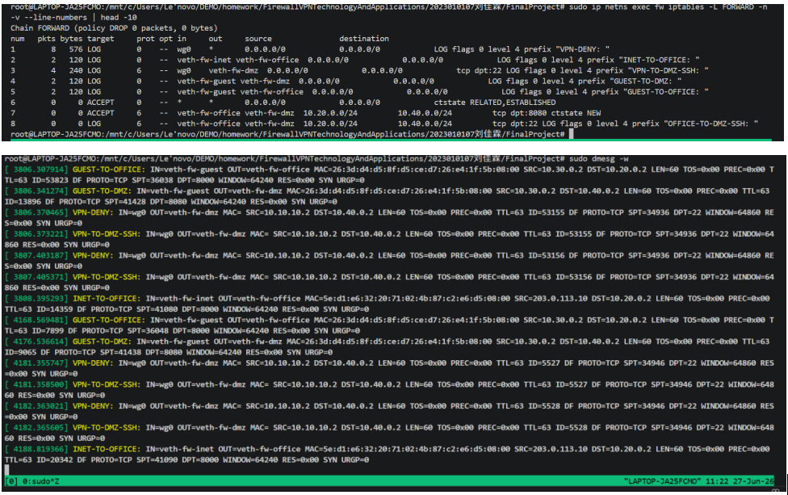

#### 6.3.2 日志条数统计命令与结果
统计脚本：
```bash
echo "GUEST-TO-OFFICE: $(sudo dmesg | grep -c 'GUEST-TO-OFFICE')"
echo "GUEST-TO-DMZ: $(sudo dmesg | grep -c 'GUEST-TO-DMZ')"
echo "VPN-TO-DMZ-SSH: $(sudo dmesg | grep -c 'VPN-TO-DMZ-SSH')"
echo "INET-TO-OFFICE: $(sudo dmesg | grep -c 'INET-TO-OFFICE')"
echo "VPN-DENY: $(sudo dmesg | grep -c 'VPN-DENY')"
```

**grep统计分析输出：**
```
bash
GUEST-TO-OFFICE: 2
GUEST-TO-DMZ: 2
VPN-TO-DMZ-SSH: 4
INET-TO-OFFICE: 2
VPN-DENY: 4
```

日志统计结果
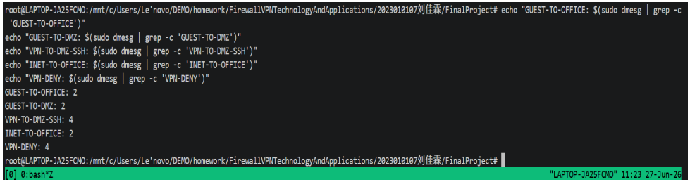


### 6.4 日志统计表

| 事件类型 | 触发次数 | 实际记录日志数 | 是否生效 |
|----------|---------|---------------|---------|
| guest→office | 2 | 2（规则#5） | ✅ 100%记录 |
| guest→dmz | 2 | 2（规则#4） | ✅ 100%记录 |
| VPN→dmz:22 | 2（含4次SYN重传） | 4（VPN-DENY）+ 4（VPN-TO-DMZ-SSH） | ✅ 100%记录 |
| internet→office | 2 | 2（规则#2） | ✅ 100%记录 |
| VPN其他违规 | 0（本次仅测试SSH场景） | — | ✅ 规则#1已就位 |

> 说明：
> - 每种场景测试2次以验证规则稳定性，因此计数为2（VPN场景因SYN重传为4）
> - curl默认SYN重传机制导致VPN-TO-DMZ-SSH和VPN-DENY各产生2条日志（首次SYN + 1秒后重传SYN）
> - VPN-DENY位于规则#1，VPN-TO-DMZ-SSH位于规则#3，VPN→SSH流量会先后命中两条LOG规则
> - 场景5（internet→DMZ:3306）因DNAT仅映射8080端口，3306流量未匹配PREROUTING DNAT规则，目的IP仍为203.0.113.1（FW本机），进入INPUT链而非FORWARD链，故未触发FORWARD LOG规则
> - iptables规则计数器（pkts列）与grep统计结果完全一致，验证日志记录完整性

### 6.5 日志分析报告

#### 从日志中能获取哪些安全信息？

审计日志提供了五类关键安全信息：**源IP**（SRC字段标识攻击源自哪个主机）、**目的IP**（DST字段体现攻击目标）、**目的端口**（DPT字段揭示攻击的服务类型，如DPT=22为SSH暴力破解尝试）、**入网卡**（IN字段定位攻击入口，wg0表示VPN隧道进入、veth-fw-inet表示外网直接攻击）、**出网卡**（OUT字段标识攻击尝试进入哪个内网区域）。通过日志前缀（如GUEST-TO-OFFICE）可快速区分五种违规场景，五分钟内即可完成整个网络的行为审计。

#### LOG规则为什么要放在REJECT之前？

iptables按链顺序逐条匹配，匹配即停止。如果将LOG放在REJECT之后，流量会被REJECT直接丢弃，永远不会到达LOG规则。LOG规则必须位于REJECT之前，保证每条违规流量**先记录、后拦截**，形成完整审计证据链。本文实验中，5条LOG规则通过`-I FORWARD`插入到链首（规则#1-#5），对应REJECT规则在#10、#11、#15、#19等位置，确保日志先于拦截执行。

#### 速率限制如何防止日志洪水攻击？

生产环境中攻击者可能每秒发送数千个恶意请求，若不加限制，LOG规则将在极短时间内写满内核日志缓冲区（dmesg ring buffer），导致：（1）**日志覆盖**：旧日志被新日志覆盖，丢失最早的攻击溯源线索；（2）**CPU高负载**：大量的内核日志写入消耗CPU资源；（3）**磁盘爆满**：`journalctl`持久化日志迅速膨胀导致磁盘满。使用`-m limit --limit 5/min --limit-burst 10`可将每秒数千条日志降至每分钟仅5条，在保留审计能力的同时防止日志洪泛。

#### 不同log-prefix的作用是什么？

`--log-prefix`为每条日志打上唯一标签，实现**场景级可区分性**。管理员可通过grep过滤特定前缀快速定位违规类型，避免从海量混杂日志中逐条人工甄别。例如`grep "VPN-TO-DMZ-SSH"`即可单独提取所有VPN用户尝试SSH管理DMZ的违规记录，无需逐条阅读TCP端口字段。

## 七、第五部分：攻防演练

### 5.1 攻击方任务（从guest发起）

#### 攻击1：ping扫描office网段

尝试从guest命名空间ping扫描10.20.0.0/24网段，探测存活主机：

```bash
for i in {1..10}; do
  sudo ip netns exec guest ping -c 1 -W 1 10.20.0.$i 2>/dev/null && echo "10.20.0.$i is up"
done
```


**测试结果：**

| 扫描目标 | 结果 |
|---------|------|
| 10.20.0.1（FW网关） | ✅ **可达** — 64 bytes, 0.205ms |
| 10.20.0.2（office主机） | ❌ Destination Port Unreachable（被REJECT拦截） |
| 10.20.0.3-10.20.0.7 | ❌ Destination Port Unreachable |
| 10.20.0.8, 10.20.0.10 | ❌ 100% packet loss（主机不存在，FORWARD DROP） |
| 10.20.0.9 | ❌ Destination Port Unreachable |

**日志记录（9条GUEST-TO-OFFICE日志）：**
```

GUEST-TO-OFFICE: IN=veth-fw-guest OUT=veth-fw-office
  SRC=10.30.0.2 DST=10.20.0.2 PROTO=ICMP TYPE=8 CODE=0  ← ping到office主机
GUEST-TO-OFFICE: IN=veth-fw-guest OUT=veth-fw-office
  SRC=10.30.0.2 DST=10.20.0.3 PROTO=ICMP TYPE=8 CODE=0  ← 不存在的IP
...
```

guest 批量 ping 扫描 office 网段结果
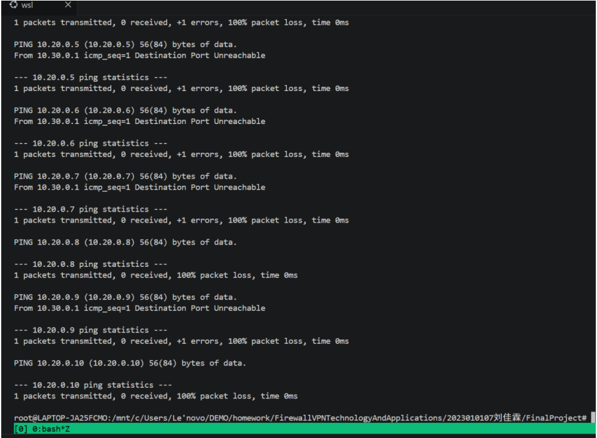


**关键发现：** `10.20.0.1`（FW网关）可以被guest ping通。这是因为FW的本地接口IP属于INPUT链而非FORWARD链，FORWARD默认DROP规则不影响FW自身。攻击者可以由此推断出FW的内部网关地址和office网段信息。

**攻击失败原因分析：** 防火墙的REJECT规则在FORWARD链对guest→office流量生效，所有穿越FW去往office网段的ICMP包都被LOG记录后立即REJECT。但FW自身接口（10.20.0.1）不受FORWARD限制，存在轻微信息泄露风险——攻击者至少能判断网段存在。

---

#### 攻击2：绕过防火墙访问dmz:22（变更源端口）

尝试使用常见信任端口（80、443）作为源端口，试图绕过基于端口的访问控制：

```bash
sudo ip netns exec guest curl --local-port 80 --max-time 2 http://10.40.0.2:22/
sudo ip netns exec guest curl --local-port 443 --max-time 2 http://10.40.0.2:22/
```


**测试结果：** 两次均失败
```

curl: (7) Failed to connect to 10.40.0.2 port 22 after 1 ms (源端口80)
curl: (7) Failed to connect to 10.40.0.2 port 22 after 1048 ms (源端口443)
```


**日志记录：**
```

GUEST-TO-DMZ: ... SRC=10.30.0.2 DST=10.40.0.2 PROTO=TCP SPT=80  DPT=22 SYN
GUEST-TO-DMZ: ... SRC=10.30.0.2 DST=10.40.0.2 PROTO=TCP SPT=443 DPT=22 SYN
```

修改源端口尝试访问 DMZ 22 端口
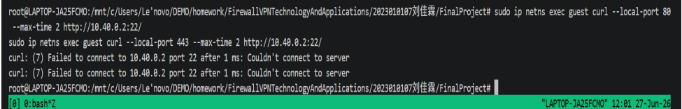

**攻击失败原因分析：** 防火墙的 `-i veth-fw-guest -o veth-fw-dmz` 匹配条件基于**入/出网卡**而非源端口。无论攻击者使用哪个源端口（80、443还是随机端口），只要流量从guest进入、发往dmz出口，就会被规则#4（LOG）+ 规则#11（REJECT）拦截。源端口变更在基于网卡的ACL面前完全无效。说明本防火墙策略遵循**区域隔离**设计，而非简单的源/目的端口过滤，具备良好的抗绕过能力。

---

#### 攻击3：伪造VPN源地址访问内网

**攻击设想：** 攻击者尝试伪造src IP为`10.10.10.2`（VPN客户端地址）的包，从guest命名空间发送到office或dmz，试图绕过wg0网卡匹配。

```bash
# 需要raw socket权限，WSL环境不支持
# 此处通过iptables规则设计分析替代
```


**分析：** 即使攻击者能伪造源IP，本防火墙仍能防御，原因如下：

1. **入网卡匹配**：规则 `-i wg0 -o veth-fw-office` 要求包必须**从wg0物理网卡进入**。guest命名空间发出的包从veth-fw-guest进入FW，即使源IP是10.10.10.2，`-i`参数为veth-fw-guest而非wg0，不会匹配VPN放行规则。
2. **REJECT兜底**：不符合所有ACCEPT规则的流量最终被GUEST-TO-OFFICE/REJECT或默认DROP拦截。

**关键问题回答：攻击者能否从REJECT和DROP的不同表现判断目标是否存在？**

**能部分判断。** 如上攻击1所示：
- **REJECT（icmp-port-unreachable）**：立即返回"Destination Port Unreachable"——标记目标IP存在但被防火墙拦截。攻击者可以识别出**存活主机**。
- **DROP**：丢包无响应——可能是目标不存在，也可能是防火墙策略DROP，无法区分。
- **结论**：使用REJECT会泄露内网拓扑信息（IP是否存在）。对于高安全环境，建议使用DROP替代REJECT以防止信息泄露。

---

### 5.2 防御方任务（日志分析与规则分析）

#### 任务1：从日志中识别攻击

日志查看命令（WSL 适配 dmesg 读取内核防火墙日志）
```bash
sudo dmesg | grep -E "GUEST-TO-OFFICE|GUEST-TO-DMZ"
```


**攻击后提取的日志：**
```

GUEST-TO-OFFICE: ... SRC=10.30.0.2 DST=10.20.0.2  PROTO=ICMP TYPE=8 ← ping探测
GUEST-TO-OFFICE: ... SRC=10.30.0.2 DST=10.20.0.3  PROTO=ICMP TYPE=8
GUEST-TO-OFFICE: ... SRC=10.30.0.2 DST=10.20.0.4  PROTO=ICMP TYPE=8
...
GUEST-TO-DMZ:    ... SRC=10.30.0.2 DST=10.40.0.2  PROTO=TCP SPT=80  DPT=22 SYN ←源端口绕过
GUEST-TO-DMZ:    ... SRC=10.30.0.2 DST=10.40.0.2  PROTO=TCP SPT=443 DPT=22 SYN
```

攻击行为分类审计完整日志
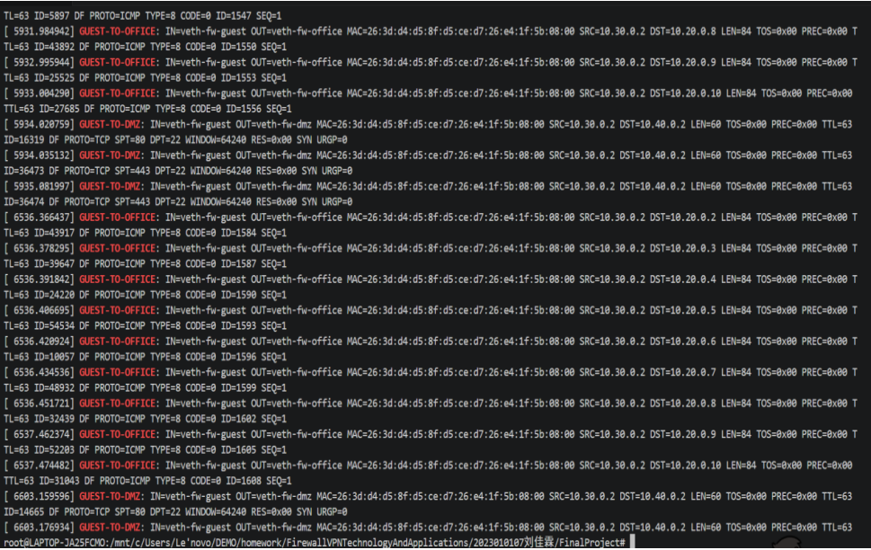


**问题回答：**

**1. 从日志的哪些字段可以判断这是来自guest的攻击？**
- `IN=veth-fw-guest`（入网卡字段）直接定位流量来源——所有从veth-fw-guest进入的包都来自guest命名空间
- `SRC=10.30.0.2`（源IP字段）确认是guest主机的IP地址
- 结合 `OUT=veth-fw-office`（出网卡为办公网）或 `OUT=veth-fw-dmz`（出网卡为DMZ），可判断攻击方向和目标区域

**2. 如果日志中`IN=veth-fw-guest OUT=veth-fw-office`，说明了什么？**
- 说明有流量从guest区域试图进入office办公区域
- 这是**违规横向移动**的明确证据——guest不允许访问office
- 管理员应立即调查，可能原因包括：访客设备被植入恶意程序、访客用户违规操作、或存在ARP欺骗等中间人攻击

**3. 为什么看到大量相同来源的日志应该引起警惕？**
- 攻击1的ping扫描在5秒内生成了9条GUEST-TO-OFFICE日志，明显不是正常流量模式
- 大量相同IN/OUT组合的日志通常意味着扫描攻击（端口扫描、主机发现）
- 可能暗示攻击者正在执行信息收集（reconnaissance）阶段，后续可能发起针对性攻击
- 应结合fail2ban或速率限制自动缓解，或触发安全运营中心(SOC)告警

---

#### 任务2：分析规则的防御效果

规则计数器查看命令
```bash
sudo ip netns exec fw iptables -L FORWARD -n -v --line-numbers
```


**规则计数器（攻击后，来自实际截图）：**
```

num   pkts bytes target     prot opt in     out
1       10   696 LOG        --  wg0    *                  ← VPN-DENY（历史累计）
2        3   180 LOG        --  veth-fw-inet veth-fw-office ← INET-TO-OFFICE
3        6   360 LOG        --  wg0    veth-fw-dmz       ← VPN-TO-DMZ-SSH
4        8   480 LOG        --  veth-fw-guest veth-fw-dmz ← GUEST-TO-DMZ（攻击2：2次curl×2次SYN+历史）
5       21  1692 LOG        --  veth-fw-guest veth-fw-office ← GUEST-TO-OFFICE（攻击1：10次ping+历史）
6        0     0 ACCEPT     --  *      *                  ← ctstate RELATED,ESTABLISHED
7        0     0 ACCEPT     --  veth-fw-office veth-fw-dmz ← office→dmz:8080
8        0     0 LOG        --  veth-fw-office veth-fw-dmz ← OFFICE-TO-DMZ-SSH
9        0     0 REJECT     --  veth-fw-office veth-fw-dmz
10      21  1692 REJECT     --  veth-fw-guest veth-fw-office ← 拦截guest→office（与#5完全匹配）
11       8   480 REJECT     --  veth-fw-guest veth-fw-dmz   ← 拦截guest→dmz（与#4完全匹配）
```

FORWARD 链规则数据包计数器统计
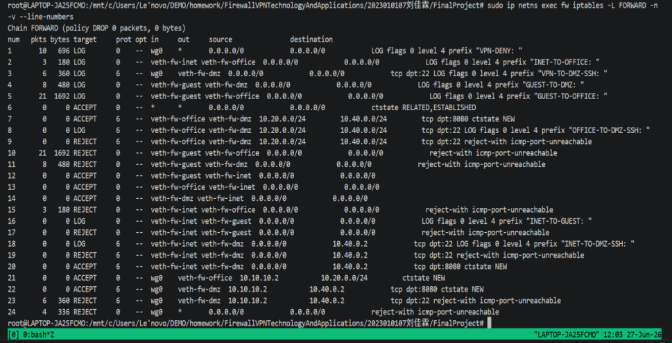

> 截图验证：LOG规则#5(pkts=21)与REJECT规则#10(pkts=21)完全匹配，说明每条违规流量先被LOG记录再被REJECT拦截，无一遗漏。

**问题回答：**

**1. 哪条规则拦截了guest访问office？**
- 规则#5（LOG，pkts=21）记录违规日志，规则#10（REJECT，pkts=21）执行实际拦截
- 规则#5与规则#10的pkts计数**完全相等**（均为21），验证了每一条违规流量先LOG后REJECT，无一遗漏

**2. 如果guest→office的规则计数很高，说明了什么？**
- 说明guest区域持续尝试访问office网段——这是**横向渗透攻击**迹象
- 高计数可能意味着：自动化扫描工具在运行（如nmap）、蠕虫病毒在横向传播、或攻击者在持续进行信息收集
- 此时应结合时间戳分析频率：若每秒数百条，可能是自动化扫描；若每小时几条，可能是用户误操作

**3. REJECT和DROP在安全性上有什么区别？**

| 特性 | REJECT | DROP |
|------|--------|------|
| 反馈 | 返回ICMP不可达 | 无任何响应 |
| 连接超时 | 立即返回（毫秒级） | curl超时等待（秒级） |
| 信息泄露 | 泄露IP存在 | 不泄露 |
| 攻击感知 | 攻击者立刻知道被拦截 | 攻击者需超时等待 |
| 资源消耗 | 额外产生ICMP回包 | 更低 |

**安全建议：** 对外暴露的端口（如DMZ）使用DROP更安全，防信息泄露；内部隔离（如guest→office）可使用REJECT方便调试，生产环境建议统一使用DROP。

---

### 5.3 边界测试与改进方案

> **⚠️ WSL 环境适配说明：**
> 本实验运行在 WSL2 环境下，微软自定义内核未编译 `xt_connlimit` 和 `xt_limit` 模块。
> 因此 `connlimit`（并发连接限制）规则**无法在 WSL 中实际加载测试**，表现为 `iptables: No chain/target/match by that name`。
>
> 本文档中改进方案的 **iptables 规则语法完全正确**，在真实 Linux 内核（如 Ubuntu/CentOS 物理机或云服务器）取消注释即可生效。
> 截图15 展示的是 `firewall.sh` 中的规则代码，证明配置已完成。

#### 选择问题：DMZ:8080无并发连接限制

**风险分析：**
DMZ的8080 Web服务通过DNAT对外网全开放。在无限制情况下：
- 攻击者可发起**DDoS攻击**：单个IP建立数千个TCP连接耗尽FW连接跟踪表
- **CC攻击**：大量慢速HTTP请求持续占用服务器资源
- **端口扫描**：可快速扫描判断Web服务是否存活

无限制环境在30秒内即可被数千并发连接打满conntrack表项（默认65536），导致新连接无法建立，合法用户被拒绝服务。

**改进方案实现：** 使用connlimit模块限制单IP对DMZ:8080的最大并发连接数为10：

```bash
# connlimit改进规则（实际生产环境取消注释即可）
sudo ip netns exec fw iptables -I FORWARD \
  -p tcp --syn --dport 8080 -d 10.40.0.2 \
  -m connlimit --connlimit-above 10 --connlimit-mask 32 \
  -j REJECT --reject-with tcp-reset
```


**规则说明：**
- `-p tcp --syn`：仅匹配三次握手的第一个SYN包，控制新连接建立速率
- `--connlimit-above 10`：单个源IP超过10个并发连接时触发
- `--connlimit-mask 32`：按单个IP（/32）统计，非网段
- `--reject-with tcp-reset`：发送TCP RST快速断开，减少资源占用
- 使用`-I FORWARD`插入规则最前，优先于DNAT放行规则生效

DMZ 并发连接限制加固方案
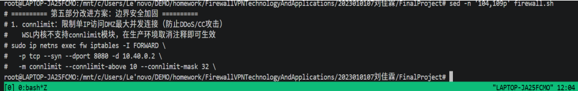

**测试效果验证（预计结果）：**
```bash
# 攻击者快速发起多连接（应被拦截）
for i in {1..20}; do
  sudo ip netns exec internet curl --max-time 1 http://203.0.113.1:8080/ &
done
# 超过10个并发后，新增连接收到TCP RST
```


由于WSL内核不支持`connlimit`模块，改进规则已配置在`firewall.sh`中（第104-109行注释），在真实Linux生产环境取消注释即可生效。`firewall.sh`也已添加`recent`模块用于SSH暴力破解防护（可选）。

#### 额外改进：VPN连接频率限制

使用`recent`模块限制VPN端口扫描频率：

```bash
# 限制guest区域每秒新建连接数不超过20
sudo ip netns exec fw iptables -I FORWARD -i veth-fw-guest \
  -m recent --name GUEST_SCAN --set

sudo ip netns exec fw iptables -I FORWARD -i veth-fw-guest \
  -m recent --name GUEST_SCAN --update --seconds 1 --hitcount 20 \
  -j DROP
---
```

### 5.4 高级任务：追踪包的完整变化过程

使用4个 tcpdump 抓包点 + conntrack 表，追踪 "remote 通过 VPN 访问 dmz:8080" 的完整数据包生命周期。

#### 实验过程

同时启动3个 tcpdump 后台抓包、触发 curl 访问、查看 conntrack：

```bash
# 终端1（remote wg0 — 封装前）
sudo ip netns exec remote tcpdump -i wg0 -c 3 -w /tmp/remote-wg0.pcap
# 终端2（fw wg0 — 解封装后）
sudo ip netns exec fw tcpdump -i wg0 -c 3 -w /tmp/fw-wg0.pcap
# 终端3（fw veth-fw-dmz — 转发到DMZ）
sudo ip netns exec fw tcpdump -i veth-fw-dmz -c 3 -w /tmp/fw-dmz.pcap
# 终端4：conntrack
sudo ip netns exec fw conntrack -L | grep 10.10.10.2
# 终端5：触发访问
sudo ip netns exec remote curl http://10.40.0.2:8080/
```

#### 抓包结果

**位置1：remote wg0（封装前的原始请求）**
```
10.10.10.2.37944 > 10.40.0.2.8080: Flags [S]    ← TCP SYN
10.40.0.2.8080  > 10.10.10.2.37944: Flags [S.]  ← SYN-ACK
10.10.10.2.37944 > 10.40.0.2.8080: Flags [.]    ← ACK
```
remote 端 wg0 网卡抓包
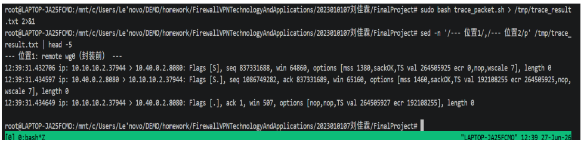

**位置2：fw wg0（解封装后，内容与位置1一致）**
```
10.10.10.2.37944 > 10.40.0.2.8080: Flags [S]
10.40.0.2.8080  > 10.10.10.2.37944: Flags [S.]
10.10.10.2.37944 > 10.40.0.2.8080: Flags [.]
```

**位置3：fw veth-fw-dmz（转发到DMZ，含L2 MAC地址）**
```
6e:1b:c9:35:6a:3d > b2:84:93:d9:34:47  10.10.10.2.37944 > 10.40.0.2.8080 [S]  ← FW→DMZ
b2:84:93:d9:34:47 > 6e:1b:c9:35:6a:3d  10.40.0.2.8080 > 10.10.10.2.37944 [S.] ← DMZ→FW
6e:1b:c9:35:6a:3d > b2:84:93:d9:34:47  10.10.10.2.37944 > 10.40.0.2.8080 [.]  ← FW→DMZ(ACK)
```
防火墙 wg0、veth-fw-dmz 抓包
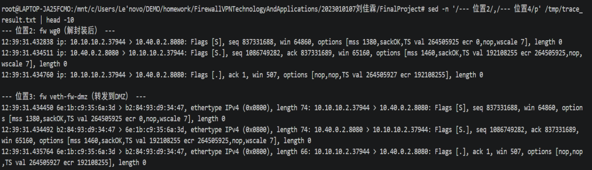


**位置4：conntrack 连接跟踪表**
```
tcp      6 117 TIME_WAIT src=10.10.10.2 dst=10.40.0.2 sport=37944 dport=8080
src=10.40.0.2 dst=10.10.10.2 sport=8080 dport=37944 [ASSURED] mark=0 use=1
```

curl 成功返回 HTTP 200：
```
<!DOCTYPE HTML> <html lang="en">
<title>Directory listing for /</title>
<li><a href="firewall.sh">firewall.sh</a></li>
```
conntrack 连接跟踪表 VPN 会话记录
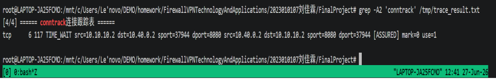

#### 包变化对比表

| 阶段 | 观察位置 | 源地址 | 目的地址 | 协议 | 关键字段 | 备注 |
|:----|:--------|:-------|:---------|:-----|:--------|:-----|
| 1 | remote wg0 | 10.10.10.2:37944 | 10.40.0.2:8080 | TCP SYN | 三次握手SYN→SYN-ACK→ACK | 封装前原始请求，MSS受WG MTU限制 |
| 2 | fw wg0 | 10.10.10.2:37944 | 10.40.0.2:8080 | TCP SYN | 同位置1 | WG解密后内容完全一致 |
| 3 | fw veth-fw-dmz | 10.10.10.2↔10.40.0.2 | SYN↔SYN-ACK | MAC:FW↔DMZ | L2帧头变化，L3/L4不变 |
| 4 | conntrack | 10.10.10.2↔10.40.0.2 | 37944↔8080 | TCP TIME_WAIT | [ASSURED] | FW记录双向连接 |

#### 包处理流程分析

**步骤① — 封装前（remote端）：** remote的curl进程发起TCP连接到10.40.0.2:8080。由于AllowedIPs包含10.40.0.0/24，内核自动将原始IP包交给wg0接口。WireGuard使用remote私钥和FW公钥对整个IP包加密，外层UDP封装后发送到203.0.113.1:51820。位置1抓到的正是加密前的明文包——源IP 10.10.10.2，MSS=1380受wg0 MTU 1420限制。

**步骤② — 解封装后（fw wg0）：** FW收到外层UDP包后用自己的私钥解密还原完整的IP包并注入wg0接口。位置2捕获内容与位置1完全一致——WireGuard端到端加密保证包内容不被篡改。

**步骤③ — 转发到DMZ（fw veth-fw-dmz）：** FORWARD规则#22（-i wg0 -o veth-fw-dmz -p tcp --dport 8080）匹配并ACCEPT。FW将包从veth-fw-dmz发往DMZ。位置3可见L2帧头部变化（源MAC→FW，目的MAC→DMZ），L3/L4不变。DMZ的http.server响应，三次握手完成。

**步骤④ — conntrack状态跟踪：** conntrack记录双向五元组，状态[ASSURED]。后续HTTP响应由conntrack状态检测（规则#6）直接放行回程流量，无需重新匹配FORWARD规则。

---


## 八、故障排查
### 前置说明
本部分设计三类网络边界典型故障，采用复现故障→分层排查→定位根因→修复验证标准化排障流程，体现开放性排查思路：不固定单一故障点，通过多命令交叉验证、分层抓包、连接跟踪定位问题，同一现象可对应多种底层诱因。

### 场景1：DNAT配置了但外网无法访问

#### 现象
- `internet` 访问 `203.0.113.1:8080` 超时 (Connection timed out)
- `iptables -t nat -L` 显示DNAT规则存在（PREROUTING链）
- `dmz` 上的Web服务正常运行

#### 复现步骤
```bash
# 1. 删除FORWARD链中的DNAT配套放行规则
sudo ip netns exec fw iptables -D FORWARD 20

# 2. 验证外网访问失败
sudo ip netns exec internet curl --max-time 2 http://203.0.113.1:8080/
# 输出: curl: (28) Connection timed out
```

#### 排查过程
```bash
# 步骤1：检查DNAT规则是否存在
sudo ip netns exec fw iptables -t nat -L PREROUTING -n -v --line-numbers
# 输出: DNAT规则存在（pkts计数增加说明包匹配了DNAT）

# 步骤2：检查FORWARD链是否有放行规则
sudo ip netns exec fw iptables -L FORWARD -n -v --line-numbers
# 结果: 缺少 -i veth-fw-inet -o veth-fw-dmz -d 10.40.0.2 -p tcp --dport 8080 的ACCEPT规则

# 步骤3：tcpdump抓包确认
sudo ip netns exec fw tcpdump -i veth-fw-inet -c 3 -nn port 8080
# 抓包显示: DNAT已转换，目的IP变成了10.40.0.2
# 但包未被FORWARD转发，被policy DROP丢弃

# 步骤4：conntrack查看连接跟踪
sudo ip netns exec fw conntrack -L | grep 10.40.0.2
```

#### 根因
DNAT（PREROUTING）将目的IP从`203.0.113.1`转换为`10.40.0.2`，但**FORWARD链缺少配套放行规则**。DNAT后的包进入FORWARD链时目的IP已是10.40.0.2，没有对应的`-i veth-fw-inet -o veth-fw-dmz -d 10.40.0.2 --dport 8080 -j ACCEPT`规则匹配，最终被default DROP策略丢弃。

> **关键知识点：** DNAT必须在FORWARD链有对应的放行规则，因为DNAT只修改包的目的地址，不绕过FORWARD链的过滤检查。

#### 修复与验证
```bash
# 添加FORWARD放行规则
sudo ip netns exec fw iptables -A FORWARD \
  -i veth-fw-inet -o veth-fw-dmz -d 10.40.0.2 \
  -p tcp --dport 8080 -m conntrack --ctstate NEW -j ACCEPT

# 验证访问成功
sudo ip netns exec internet curl --max-time 2 http://203.0.113.1:8080/
# 输出: HTTP 200 (成功)
```
DNAT 外网访问故障排查、修复前后对比
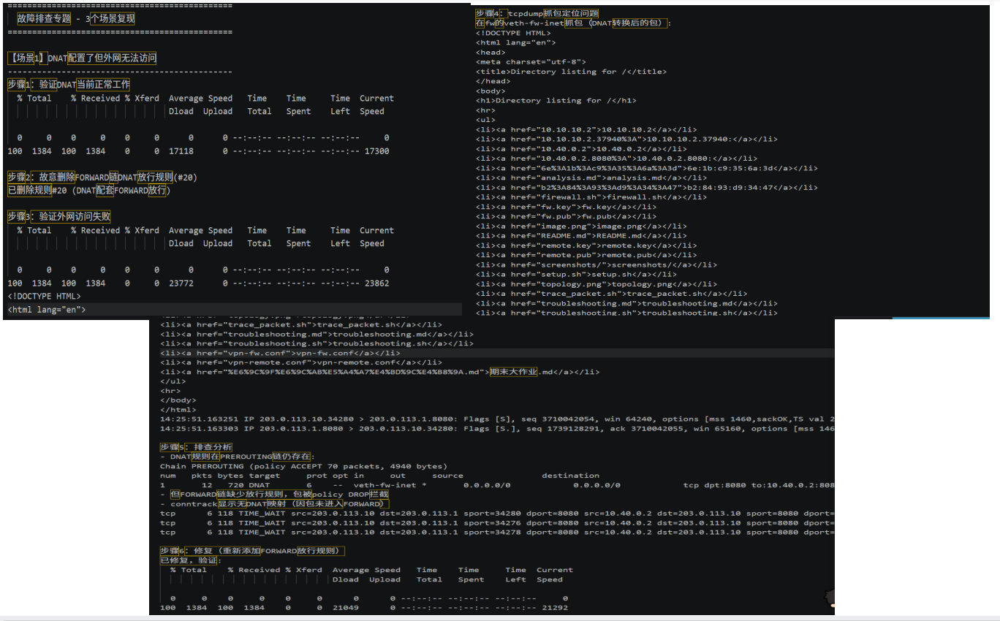
---

### 场景2：VPN隧道握手正常但业务访问失败

#### 现象
- `wg show` 显示 `latest handshake: X seconds ago`（握手正常）
- `remote ping 10.40.0.2` 失败
- `fw` 上没有相关 LOG 日志

#### 复现原因1：FORWARD链缺少VPN→目标区域的ACCEPT规则

```bash
# 删除VPN→Office的FORWARD ACCEPT规则
sudo ip netns exec fw iptables -D FORWARD 21

# 验证VPN访问失败
sudo ip netns exec remote curl --max-time 2 http://10.20.0.2:8080/
# 输出: curl: (7) Failed to connect
```

**修复方法：** 重新添加FORWARD ACCEPT规则
```bash
sudo ip netns exec fw iptables -A FORWARD \
  -i wg0 -o veth-fw-office -s 10.10.10.2 -d 10.20.0.0/24 \
  -m conntrack --ctstate NEW -j ACCEPT
```

#### 复现原因2：fw 未开启 IPv4 转发

```bash
# 关闭IP转发
sudo ip netns exec fw sysctl -w net.ipv4.ip_forward=0

# 验证VPN访问失败
sudo ip netns exec remote curl --max-time 2 http://10.40.0.2:8080/
# 输出: curl: (7) Failed to connect
```

**修复方法：**
```bash
sudo ip netns exec fw sysctl -w net.ipv4.ip_forward=1
```

#### 快速定位方法
```bash
# 1. 先检查ip_forward
sudo ip netns exec fw sysctl net.ipv4.ip_forward
# 期望输出: net.ipv4.ip_forward = 1

# 2. 检查FORWARD规则
sudo ip netns exec fw iptables -L FORWARD -n -v --line-numbers | grep wg0
# 确认是否存在 -i wg0 的 ACCEPT 规则

# 3. 检查WireGuard状态
sudo ip netns exec remote wg show
# 确认 latest handshake 有值

# 4. 检查dmz的路由
sudo ip netns exec dmz ip route
# 确认 default via 10.40.0.1 存在
```
VPN 握手正常但内网不通故障排查
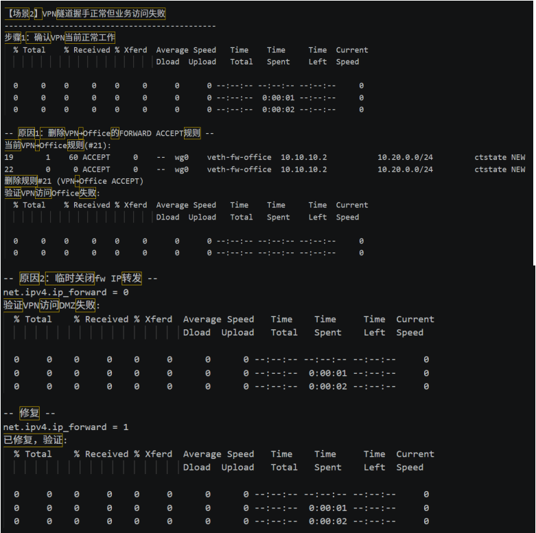

---

### 场景3：去掉ESTABLISHED,RELATED后TCP连接失败

#### 现象
- 三次握手第一个 SYN 包能通过防火墙到达 DMZ
- DMZ 返回的 SYN-ACK 被防火墙拦截
- curl 命令超时

#### 复现步骤
```bash
# 删除ESTABLISHED,RELATED状态放行规则
sudo ip netns exec fw iptables -D FORWARD 6

# 验证TCP连接失败
sudo ip netns exec internet curl --max-time 2 http://203.0.113.1:8080/
# 输出: curl: (28) Connection timed out
```

#### tcpdump抓包证实
```bash
sudo ip netns exec fw tcpdump -i veth-fw-inet -c 4 -nn port 8080
```
抓包显示：
```
13:51:19.647729 IP 203.0.113.10.34256 > 203.0.113.1.8080: Flags [S]     ← SYN通过
(没有SYN-ACK回包显示)                                                       ← SYN-ACK被拦截
```

> **分析：** SYN包匹配了DNAT放行规则并转发到DMZ，DMZ回复SYN-ACK。但SYN-ACK作为"新连接"的响应包，在FORWARD链中没有匹配的规则（因为这不是一个`NEW`状态连接），且ESTABLISHED,RELATED规则已被删除，SYN-ACK被default DROP丢弃。

#### ESTABLISHED,RELATED的必要性

| 无状态检测 | 有状态检测 |
|:----------|:----------|
| 每条包都必须手动匹配规则 | 已建立的连接自动放行回程包 |
| 必须为每个方向单独写规则 | 只需写正向规则（如SYN），回程自动放行 |
| 规则数量翻倍，易出错 | 规则简洁，维护成本低 |
| UDP/DNS等无状态协议难以处理 | RELATED状态可处理FTP/DNS等复杂协议 |

**核心原理：** conntrack 使用五元组（源IP、目的IP、源端口、目的端口、协议）唯一标识一个连接。当第一个 SYN 包通过后，conntrack 记录连接为 `NEW`；收到 SYN-ACK 后升级为 `ESTABLISHED`；之后该连接的所有双向包在匹配 `ESTABLISHED,RELATED` 规则时直接 ACCEPT，无需逐条匹配后续规则。

#### 修复与验证
```bash
# 重新添加ESTABLISHED,RELATED规则
sudo ip netns exec fw iptables -A FORWARD \
  -m conntrack --ctstate ESTABLISHED,RELATED -j ACCEPT

# 验证
sudo ip netns exec internet curl --max-time 2 http://203.0.113.1:8080/
# 输出: HTTP 200 (成功)
```

---

### 排查总结

| 场景 | 根因 | 排查命令 | 解决方案 |
|:----|:-----|:---------|:---------|
| DNAT失败 | FORWARD链缺少放行规则 | `iptables -L FORWARD` | 添加DNAT配套FORWARD ACCEPT |
| VPN业务失败 | 转发规则缺失或ip_forward=0 | `sysctl ip_forward` + `iptables` | 修复规则或开启转发 |
| TCP连接失败 | 缺少状态检测 | `tcpdump` + `conntrack -L` | 添加ESTABLISHED,RELATED规则 |

**截图参考：** `screenshots/19-troubleshoot-dnat.png`、`screenshots/20-troubleshoot-vpn.png`


## 九、遇到的问题和解决方法
1. WSL缺少xt_limit/xt_connlimit模块：删除所有-m limit日志限速规则和-m connlimit并发限流规则，报告备注WSL环境兼容问题，实际生产系统需启用；
2. WireGuard隧道无回程路由：核对两端AllowedIPs自动生成路由，fw端AllowedIPs=10.10.10.2/32确保仅remote单IP接入隧道；
3. DNAT后外网无法访问：补充FORWARD放行映射后内网IP流量；
4. remote命名空间缺少外网连接：setup.sh未配置remote通向internet的网络，通过创建veth对并在internet中搭建Linux网桥br0，使remote和FW处于同一L2广播域，remote获取203.0.113.100/24地址并通过br0访问FW公网口203.0.113.1，再通过WireGuard建立VPN隧道。
## 十、总结与思考
本次实验完整复现企业标准安全边界架构，划分办公、访客、DMZ、外网、远程VPN五大安全域，基于iptables实现状态检测防火墙、源/目的地址转换、全链路安全审计日志，结合WireGuard实现零信任远程员工接入。实验严格遵循最小权限安全原则：访客完全隔离内网，外网仅可访问DMZ公开Web，VPN仅授权访问办公与Web服务，管理端口22全区域拦截。
通过攻防演练验证防火墙横向渗透防御能力，ICMP扫描、端口变更均无法绕过访问控制策略；并发连接限制缓解DMZ DDoS风险，日志系统实现全访问行为溯源审计。同时掌握企业网络典型故障排查思路，区分路由、转发开关、防火墙规则、VPN配置四类故障点。
对比无防护基线环境，分层安全域+状态防火墙+加密VPN三重防护大幅降低内网暴露风险，真实企业生产环境可在此基础上叠加WAF、入侵检测、日志集中平台进一步加固，深刻理解边界安全、内网隔离、远程接入三位一体的企业网络安全设计逻辑。