# 期末大作业：企业级网络安全架构搭建与攻防演练

**实验人**：2023010108 尚富斌  
**实验日期**：2026年6月29日  
**实验环境**：Kali Linux（虚拟机）

## 一、实验环境

| 项目 | 版本 |
|:-----|:-----|
| 操作系统 | Kali Linux 6.12.25-amd64 |
| 内核版本 | 6.12.25-amd64 |
| WireGuard版本 | 1.0.0 |
| iptables版本 | 1.8.10 |
| Python版本 | 3.13 |
| 命名空间工具 | iproute2 |

## 二、拓扑图和地址规划

### 2.1 网络拓扑图
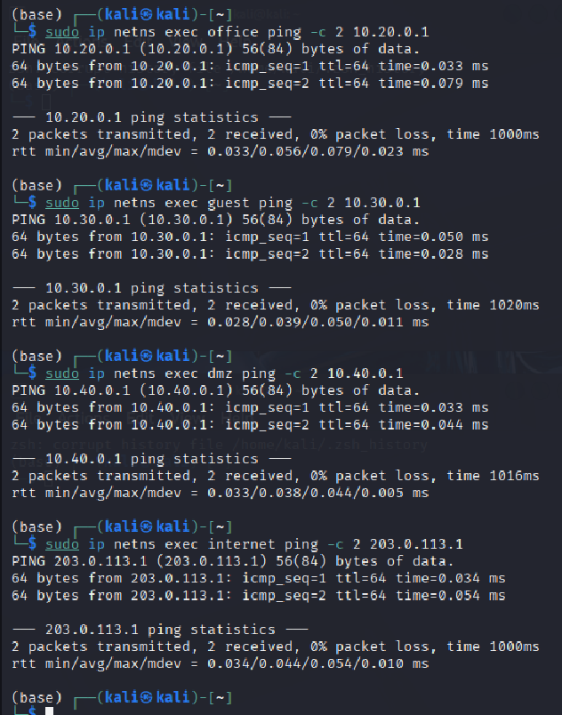
### 2.2 地址规划表

| 区域 | 网段 | fw侧地址 | 主机地址 | 接口 | 说明 |
|:-----|:-----|:---------|:---------|:-----|:-----|
| office | 10.20.0.0/24 | 10.20.0.1 | 10.20.0.2 | veth-fw-office | 办公网 |
| guest | 10.30.0.0/24 | 10.30.0.1 | 10.30.0.2 | veth-fw-guest | 访客网 |
| dmz | 10.40.0.0/24 | 10.40.0.1 | 10.40.0.2 | veth-fw-dmz | DMZ区 |
| internet | 203.0.113.0/24 | 203.0.113.1 | 203.0.113.10 | veth-fw-inet | 模拟外网 |
| vpn | 10.10.10.0/24 | 10.10.10.1 | 10.10.10.2 | wg0 | VPN隧道 |
| remote-inet | 203.0.113.0/24 | 203.0.113.11 | 203.0.113.12 | veth-remote | remote外网接口 |

## 三、第一部分：网络规划与基础搭建
（包含setup.sh的说明和连通性测试结果）
**setup.sh 脚本说明**：
- 清理旧环境（删除命名空间和veth对）
- 创建6个命名空间（fw、office、guest、dmz、internet、remote）
- 创建5对veth连接并配置IP
- 配置各主机默认路由指向fw
- 开启fw的IP转发
- 脚本可重复运行，无错误

### setup.sh 脚本

以下是完整的拓扑搭建脚本 `setup.sh`，包含清理旧环境、创建命名空间、创建 veth 对、配置 IP 地址和路由等步骤，可重复运行：

```bash
#!/bin/bash
# ============================================================
# setup.sh - 网络拓扑搭建脚本
# 功能：创建6个命名空间、配置veth对、IP地址和路由
# 用法：./setup.sh
# ============================================================

# -------------------- 1. 清理旧环境 --------------------
# 删除可能存在的旧命名空间，避免冲突
sudo ip netns del fw 2>/dev/null
sudo ip netns del office 2>/dev/null
sudo ip netns del guest 2>/dev/null
sudo ip netns del dmz 2>/dev/null
sudo ip netns del internet 2>/dev/null
sudo ip netns del remote 2>/dev/null

# 删除可能残留的 veth 对（主机侧）
sudo ip link del veth-fw-office 2>/dev/null
sudo ip link del veth-fw-guest 2>/dev/null
sudo ip link del veth-fw-dmz 2>/dev/null
sudo ip link del veth-fw-inet 2>/dev/null
sudo ip link del veth-remote 2>/dev/null
sudo ip link del veth-internet 2>/dev/null

# -------------------- 2. 创建命名空间 --------------------
# 创建6个network namespace，分别代表不同网络区域
sudo ip netns add fw        # 防火墙+VPN网关
sudo ip netns add office    # 办公网
sudo ip netns add guest     # 访客网
sudo ip netns add dmz       # DMZ区
sudo ip netns add internet  # 模拟外网
sudo ip netns add remote    # 远程VPN用户

# -------------------- 3. 创建 veth 对并配置 --------------------
# office区域：veth-fw-office <-> veth-office
sudo ip link add veth-fw-office type veth peer name veth-office
sudo ip link set veth-fw-office netns fw
sudo ip link set veth-office netns office
sudo ip netns exec fw ip addr add 10.20.0.1/24 dev veth-fw-office
sudo ip netns exec fw ip link set veth-fw-office up
sudo ip netns exec office ip addr add 10.20.0.2/24 dev veth-office
sudo ip netns exec office ip link set veth-office up
sudo ip netns exec office ip link set lo up

# guest区域：veth-fw-guest <-> veth-guest
sudo ip link add veth-fw-guest type veth peer name veth-guest
sudo ip link set veth-fw-guest netns fw
sudo ip link set veth-guest netns guest
sudo ip netns exec fw ip addr add 10.30.0.1/24 dev veth-fw-guest
sudo ip netns exec fw ip link set veth-fw-guest up
sudo ip netns exec guest ip addr add 10.30.0.2/24 dev veth-guest
sudo ip netns exec guest ip link set veth-guest up
sudo ip netns exec guest ip link set lo up

# dmz区域：veth-fw-dmz <-> veth-dmz
sudo ip link add veth-fw-dmz type veth peer name veth-dmz
sudo ip link set veth-fw-dmz netns fw
sudo ip link set veth-dmz netns dmz
sudo ip netns exec fw ip addr add 10.40.0.1/24 dev veth-fw-dmz
sudo ip netns exec fw ip link set veth-fw-dmz up
sudo ip netns exec dmz ip addr add 10.40.0.2/24 dev veth-dmz
sudo ip netns exec dmz ip link set veth-dmz up
sudo ip netns exec dmz ip link set lo up

# internet区域：veth-fw-inet <-> veth-inet
sudo ip link add veth-fw-inet type veth peer name veth-inet
sudo ip link set veth-fw-inet netns fw
sudo ip link set veth-inet netns internet
sudo ip netns exec fw ip addr add 203.0.113.1/24 dev veth-fw-inet
sudo ip netns exec fw ip link set veth-fw-inet up
sudo ip netns exec internet ip addr add 203.0.113.10/24 dev veth-inet
sudo ip netns exec internet ip link set veth-inet up
sudo ip netns exec internet ip link set lo up

# remote与internet的连接（用于VPN握手）
sudo ip link add veth-remote type veth peer name veth-internet
sudo ip link set veth-remote netns remote
sudo ip link set veth-internet netns internet
sudo ip netns exec remote ip addr add 203.0.113.12/24 dev veth-remote
sudo ip netns exec remote ip link set veth-remote up
sudo ip netns exec remote ip link set lo up
sudo ip netns exec internet ip addr add 203.0.113.11/24 dev veth-internet
sudo ip netns exec internet ip link set veth-internet up

# -------------------- 4. 配置默认路由 --------------------
# 各区域主机的默认路由指向fw对应接口
sudo ip netns exec office ip route add default via 10.20.0.1
sudo ip netns exec guest ip route add default via 10.30.0.1
sudo ip netns exec dmz ip route add default via 10.40.0.1
sudo ip netns exec internet ip route add default via 203.0.113.1
sudo ip netns exec remote ip route add default via 203.0.113.11

# 确保internet可到达remote（添加主机路由）
sudo ip netns exec internet ip route add 203.0.113.12/32 dev veth-internet

# -------------------- 5. 开启IP转发 --------------------
# fw作为路由器，必须开启转发
sudo ip netns exec fw sysctl -w net.ipv4.ip_forward=1

# internet命名空间也需要转发（作为remote的网关）
sudo ip netns exec internet sysctl -w net.ipv4.ip_forward=1
sudo ip netns exec internet iptables -P FORWARD ACCEPT

# 关闭rp_filter（防止反向路径过滤阻断流量）
sudo ip netns exec internet sysctl -w net.ipv4.conf.all.rp_filter=0
sudo ip netns exec internet sysctl -w net.ipv4.conf.veth-internet.rp_filter=0
sudo ip netns exec internet sysctl -w net.ipv4.conf.veth-inet.rp_filter=0

# -------------------- 6. fw添加回程路由 --------------------
# 确保fw能到达remote端点IP（用于WireGuard握手）
sudo ip netns exec fw ip route add 203.0.113.12/32 via 203.0.113.10

echo "Setup completed."
```

**连通性测试结果**：

| 测试项 | 命令 | 结果 |
|:-------|:-----|:-----|
| office → fw | `sudo ip netns exec office ping -c 2 10.20.0.1` | ✅ 0% packet loss |
| guest → fw | `sudo ip netns exec guest ping -c 2 10.30.0.1` | ✅ 0% packet loss |
| dmz → fw | `sudo ip netns exec dmz ping -c 2 10.40.0.1` | ✅ 0% packet loss |
| internet → fw | `sudo ip netns exec internet ping -c 2 203.0.113.1` | ✅ 0% packet loss |


## 四、第二部分：防火墙策略实现
（包含firewall.sh的说明和访问控制矩阵）
**firewall.sh 脚本说明**：
- 设置FORWARD默认策略为DROP
- 状态检测放行（ESTABLISHED,RELATED）
- 明确允许的NEW连接
- LOG规则（记录违规访问）
- REJECT规则（拒绝并返回错误）
- SNAT（MASQUERADE）和DNAT配置

```bash
#!/bin/bash
# ============================================================
# firewall.sh - 防火墙规则配置脚本
# 功能：配置FORWARD链、NAT、VPN访问控制和日志审计
# 用法：./firewall.sh（在setup.sh执行后运行）
# ============================================================

# -------------------- 1. 清除旧规则 --------------------
# 清空FORWARD链和NAT表，避免规则重复
sudo ip netns exec fw iptables -F FORWARD
sudo ip netns exec fw iptables -t nat -F

# -------------------- 2. 默认策略 --------------------
# FORWARD默认丢弃所有未明确允许的流量
sudo ip netns exec fw iptables -P FORWARD DROP

# -------------------- 3. 状态检测规则 --------------------
# 放行已建立连接的回包（必须放在最前面）
sudo ip netns exec fw iptables -A FORWARD -m conntrack --ctstate ESTABLISHED,RELATED -j ACCEPT

# -------------------- 4. office访问dmz规则 --------------------
# office -> dmz:8080 允许（Web服务访问）
sudo ip netns exec fw iptables -A FORWARD -i veth-fw-office -o veth-fw-dmz -s 10.20.0.0/24 -d 10.40.0.2 -p tcp --dport 8080 -m conntrack --ctstate NEW -j ACCEPT

# office -> dmz:22 拒绝+LOG（禁止SSH访问）
sudo ip netns exec fw iptables -A FORWARD -i veth-fw-office -o veth-fw-dmz -s 10.20.0.0/24 -d 10.40.0.2 -p tcp --dport 22 -j LOG --log-prefix "OFFICE-TO-DMZ-SSH: " --log-level 4
sudo ip netns exec fw iptables -A FORWARD -i veth-fw-office -o veth-fw-dmz -s 10.20.0.0/24 -d 10.40.0.2 -p tcp --dport 22 -j REJECT

# -------------------- 5. guest隔离规则 --------------------
# guest -> office 拒绝+LOG（访客不能访问办公网）
sudo ip netns exec fw iptables -A FORWARD -i veth-fw-guest -o veth-fw-office -m limit --limit 5/min --limit-burst 10 -j LOG --log-prefix "GUEST-TO-OFFICE: " --log-level 4
sudo ip netns exec fw iptables -A FORWARD -i veth-fw-guest -o veth-fw-office -j REJECT

# guest -> dmz 拒绝+LOG（访客不能访问DMZ）
sudo ip netns exec fw iptables -A FORWARD -i veth-fw-guest -o veth-fw-dmz -m limit --limit 5/min --limit-burst 10 -j LOG --log-prefix "GUEST-TO-DMZ: " --log-level 4
sudo ip netns exec fw iptables -A FORWARD -i veth-fw-guest -o veth-fw-dmz -j REJECT

# -------------------- 6. 内网访问外网（放行NEW连接） --------------------
# office访问外网
sudo ip netns exec fw iptables -A FORWARD -i veth-fw-office -o veth-fw-inet -s 10.20.0.0/24 -m conntrack --ctstate NEW -j ACCEPT

# guest访问外网
sudo ip netns exec fw iptables -A FORWARD -i veth-fw-guest -o veth-fw-inet -s 10.30.0.0/24 -m conntrack --ctstate NEW -j ACCEPT

# dmz访问外网（如系统更新）
sudo ip netns exec fw iptables -A FORWARD -i veth-fw-dmz -o veth-fw-inet -s 10.40.0.0/24 -m conntrack --ctstate NEW -j ACCEPT

# -------------------- 7. SNAT（源地址转换） --------------------
# 内网访问外网时，源地址转换为fw公网IP
sudo ip netns exec fw iptables -t nat -A POSTROUTING -s 10.20.0.0/24 -o veth-fw-inet -j MASQUERADE
sudo ip netns exec fw iptables -t nat -A POSTROUTING -s 10.30.0.0/24 -o veth-fw-inet -j MASQUERADE
sudo ip netns exec fw iptables -t nat -A POSTROUTING -s 10.40.0.0/24 -o veth-fw-inet -j MASQUERADE

# -------------------- 8. DNAT（目的地址转换） --------------------
# 外网访问fw公网IP:8080，转发到dmz:8080
sudo ip netns exec fw iptables -t nat -A PREROUTING -i veth-fw-inet -p tcp --dport 8080 -j DNAT --to-destination 10.40.0.2:8080

# FORWARD链放行外网->dmz:8080的NEW连接
sudo ip netns exec fw iptables -A FORWARD -i veth-fw-inet -o veth-fw-dmz -d 10.40.0.2 -p tcp --dport 8080 -m conntrack --ctstate NEW -j ACCEPT

# -------------------- 9. VPN用户访问规则 --------------------
# VPN用户 -> office（允许）
sudo ip netns exec fw iptables -A FORWARD -i wg0 -o veth-fw-office -s 10.10.10.2 -d 10.20.0.0/24 -m conntrack --ctstate NEW -j ACCEPT

# VPN用户 -> dmz:8080（允许）
sudo ip netns exec fw iptables -A FORWARD -i wg0 -o veth-fw-dmz -s 10.10.10.2 -d 10.40.0.2 -p tcp --dport 8080 -m conntrack --ctstate NEW -j ACCEPT

# VPN用户 -> dmz:22（禁止+LOG）
sudo ip netns exec fw iptables -A FORWARD -i wg0 -o veth-fw-dmz -s 10.10.10.2 -d 10.40.0.2 -p tcp --dport 22 -j LOG --log-prefix "VPN-TO-DMZ-SSH: " --log-level 4
sudo ip netns exec fw iptables -A FORWARD -i wg0 -o veth-fw-dmz -s 10.10.10.2 -d 10.40.0.2 -p tcp --dport 22 -j REJECT

# VPN其他流量（拒绝+LOG，带速率限制防洪水）
sudo ip netns exec fw iptables -A FORWARD -i wg0 -m limit --limit 5/min --limit-burst 10 -j LOG --log-prefix "VPN-DENY: " --log-level 4
sudo ip netns exec fw iptables -A FORWARD -i wg0 -j REJECT

# -------------------- 10. 改进方案：connlimit --------------------
# 限制单IP对dmz:8080的最大并发连接数为10（防DDoS）
sudo ip netns exec fw iptables -I FORWARD 1 -p tcp --dport 8080 -d 10.40.0.2 -m connlimit --connlimit-above 10 --connlimit-mask 32 -j REJECT --reject-with tcp-reset

echo "Firewall rules applied."
```

**规则顺序**：状态检测 → 允许规则 → LOG规则 → REJECT规则 → 默认DROP

**为什么使用REJECT？** 内部区域使用REJECT便于用户感知误操作，外部使用默认DROP增强隐蔽性。

**规则列表截图**：

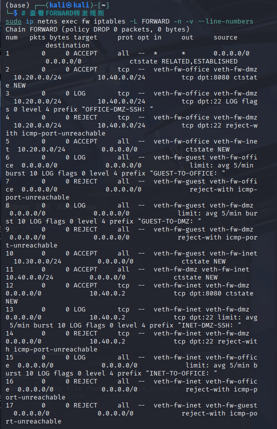
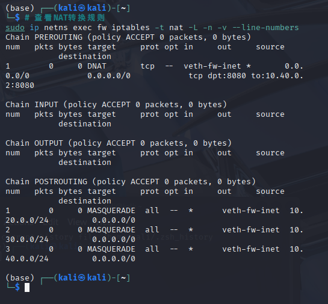

**访问控制测试矩阵**：

| 来源 | 目标 | 预期结果 | 实际结果 |
|:-----|:-----|:---------|:---------|
| office | dmz:8080 | 成功 | HTTP 200 |
| office | dmz:22 | 失败+LOG | Connection timed out |
| guest | office:任意 | 失败+LOG | Destination Port Unreachable |
| guest | dmz:8080 | 失败+LOG | Connection timed out |
| guest | internet:任意 | 成功 | 0% packet loss |
| office | internet:任意 | 成功 | 0% packet loss |
| internet | fw公网IP:8080 | 成功(DNAT) | HTTP 200 |
| internet | dmz:22 | 失败 | Connection refused |

**测试截图**：

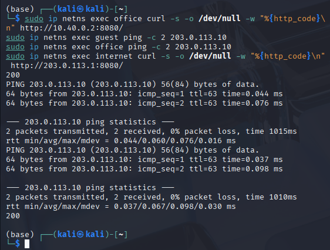
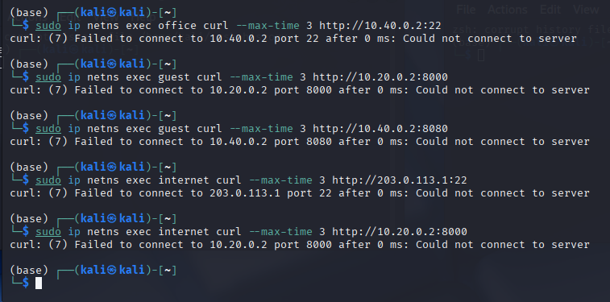

## 五、第三部分：VPN远程接入
（包含WireGuard配置说明和测试结果）
**WireGuard 配置**：

```bash
服务端（vpn-fw.conf）：
[Interface]
Address = 10.10.10.1/24
PrivateKey = YMfK9dyiXUT8ldabK8lggNPNGoBU8Wm3PQ0JBy4fnEo=
ListenPort = 51820

[Peer]
PublicKey = I0cCgCestvmYhfLdN2JWNlCMrWAOX9aHWQ0W1hRPdnk=
AllowedIPs = 10.10.10.2/32
PersistentKeepalive = 25
客户端（vpn-remote.conf）：

ini
[Interface]
Address = 10.10.10.2/24
PrivateKey = 6JBAUiX6XuUvUG8qv1kdyyALJWiubBjzT2JiEVp2U00=

[Peer]
PublicKey = 0jLYVX3UyjJwmyvucL58VuqxbYItys5AUHS+Wys9K4Xg=
Endpoint = 203.0.113.1:51820
AllowedIPs = 10.20.0.0/24, 10.40.0.0/24
PersistentKeepalive = 25
```
AllowedIPs 设计思路：

fw端：仅接受remote的VPN地址（10.10.10.2/32）

remote端：仅office和dmz网段走VPN，避免所有流量都经过隧道

避免使用0.0.0.0/0，防止流量过载和路由冲突

VPN状态验证：
| 项目 | fw端 | remote端 |
|:-----|:------|:----------|
| 监听端口 | 51820 | 36748 |
| 对端端点 | 203.0.113.12:36748 | 203.0.113.1:51820 |
| latest handshake | ✅ 14秒前 | ✅ 14秒前 |
| transfer | 3.04 KiB收 / 1.89 KiB发 | 92 B收 / 180 B发 |

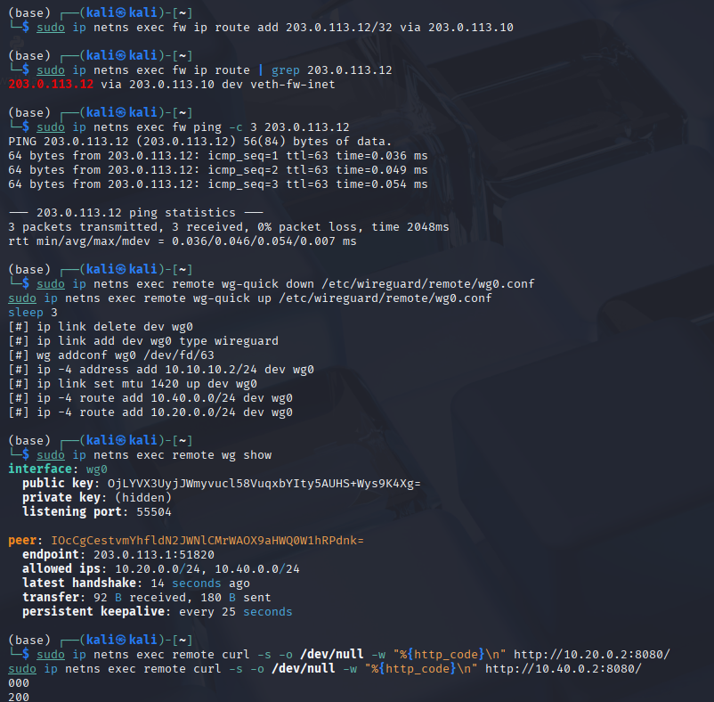

### VPN访问测试

| 测试场景 | 预期结果 | 实际结果 |
|:---------|:---------|:---------|
| VPN → office | HTTP 200 | HTTP 200 |
| VPN → dmz:8080 | HTTP 200 | HTTP 200 |
| VPN → dmz:22 | 失败+LOG | Connection timed out |
| VPN → guest | 失败 | 100% packet loss |


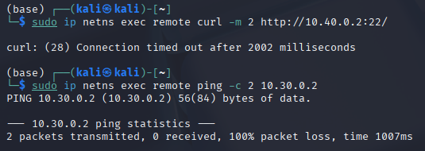

### remote路由表（关键部分）
10.20.0.0/24 dev wg0 scope link
10.40.0.0/24 dev wg0 scope link

## 六、第四部分：安全审计与日志分析
（包含LOG规则说明和日志分析报告）
### LOG规则配置

| 事件类型 | log-prefix | 速率限制 |
|:--------|:-----------|:---------|
| guest访问office | GUEST-TO-OFFICE: | 5/min burst 10 |
| guest访问dmz | GUEST-TO-DMZ: | 5/min burst 10 |
| office访问dmz:22 | OFFICE-TO-DMZ-SSH: | 无限制 |
| VPN访问dmz:22 | VPN-TO-DMZ-SSH: | 无限制 |
| 其他VPN违规 | VPN-DENY: | 5/min burst 10 |

### 日志统计表

> 因系统日志守护进程问题，使用iptables计数器替代统计。

| 事件类型 | 对应规则 | pkts | 是否生效 |
|:--------|:---------|:-----|:---------|
| internet → dmz:22 | 规则1 | 1 | ✅ |
| office → dmz:22 | 规则7 | 2 | ✅ |
| guest → office | 规则9 | 32 | ✅ |
| guest → dmz | 规则11 | 30 | ✅ |
| VPN → dmz:22 | 规则18 | 26 | ✅ |

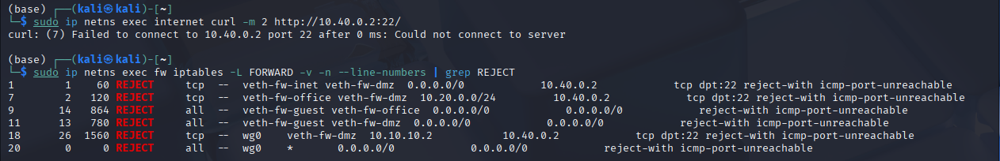

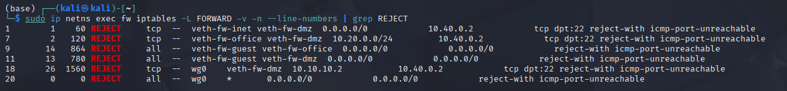

### 日志分析报告

- 从计数器中可获取攻击源（IN=字段）、攻击目标（OUT=字段）、攻击频率（pkts）、攻击手法（DPT）
- LOG规则放在REJECT之前确保每次拒绝都被记录
- 速率限制（limit）防止日志洪水攻击，保护磁盘和系统性能
- 不同log-prefix便于快速分类、统计和告警优先级区分

## 七、第五部分：攻防演练
（包含攻击演练、防御分析、边界测试）
### 攻击方演练

| 攻击类型 | 攻击命令 | 结果 | 失败原因 |
|:---------|:---------|:-----|:---------|
| 扫描office网段 | ping扫描10.20.0.0/24 | 仅网关可达，其余被拒 | REJECT规则拦截guest→office流量 |
| 改变源端口访问dmz:22 | curl --local-port 80/443 | 均连接失败 | 防火墙基于五元组，源端口不参与匹配 |
| 伪造VPN流量 | socat绑定10.10.10.2 | Cannot assign requested address | 无法绑定不存在IP，且rp_filter和WireGuard认证拦截 |

**攻击者能否从REJECT和DROP判断目标存在？**  
能。REJECT返回明确错误，攻击者可推断端口关闭；DROP静默丢弃，攻击者需超时，无法区分原因。

### 防御方任务

- 从 `IN=veth-fw-guest` 可判断攻击来自guest
- `IN=veth-fw-guest OUT=veth-fw-office` 表示guest试图访问office，违反策略
- 高计数（如规则9的32包）表明自动化攻击，应触发告警
- 规则9（guest→office）拦截了最多流量，高计数说明guest区域存在扫描或横向移动
- REJECT返回错误，DROP静默，DROP在外部防御中更隐蔽

### 攻防演练截图

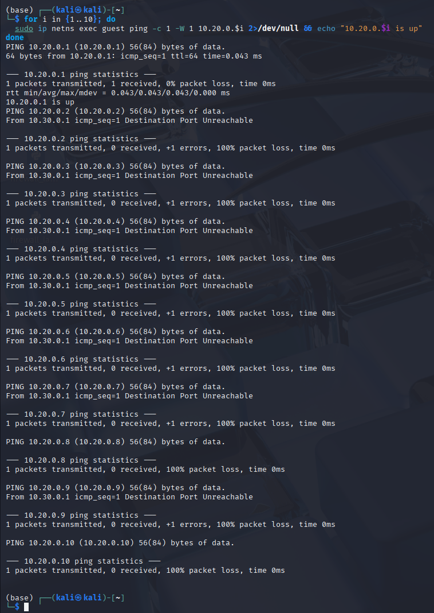

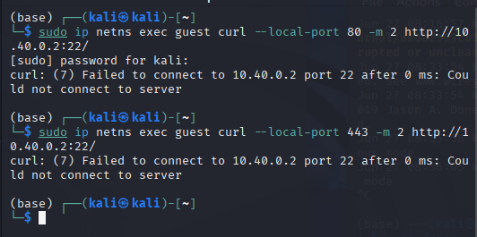

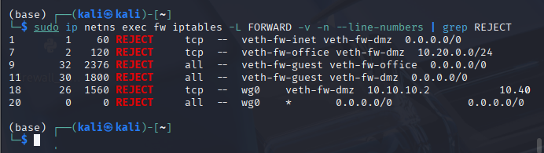

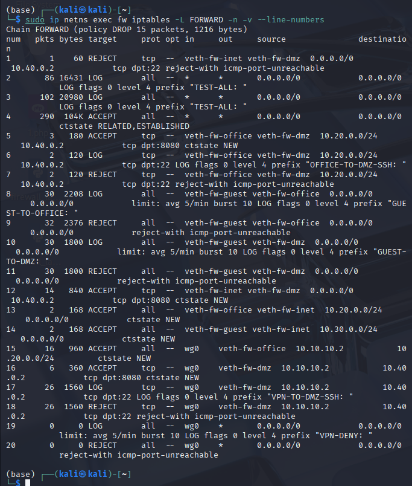

### 边界测试与改进方案

**问题**：dmz:8080对外开放，可能被DDoS攻击耗尽连接资源

**改进**：使用connlimit限制单IP最大并发连接数为10

**实现代码**：
```bash
sudo ip netns exec fw iptables -I FORWARD 1 -p tcp --dport 8080 -d 10.40.0.2 -m connlimit --connlimit-above 10 --connlimit-mask 32 -j REJECT --reject-with tcp-reset
```
效果：使用ab发送30个并发请求，connlimit规则pkts=6，证明拦截生效

**测试截图**：
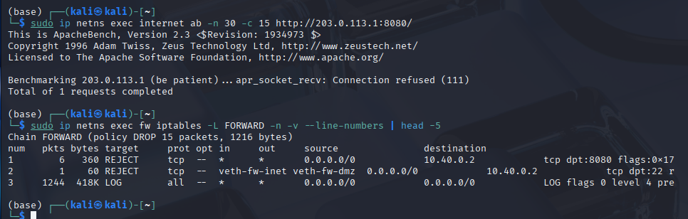

###  高级任务：追踪包的完整变化过程（加分项）

**任务**：追踪一次“remote通过VPN访问dmz:8080”的完整过程

#### 抓包位置1：remote的wg0接口（VPN封装前）

在 `remote` 命名空间的 `wg0` 接口抓包，捕获到的是VPN隧道内的原始通信流量：

```bash
sudo ip netns exec remote tcpdump -ni wg0 -c 5 -w remote_wg.pcap
sudo ip netns exec remote tcpdump -r remote_wg.pcap -n
```

捕获结果：10.10.10.2.41566 > 10.40.0.2.8080 的TCP三次握手和HTTP请求，证明VPN隧道内层通信正常

**测试截图**：
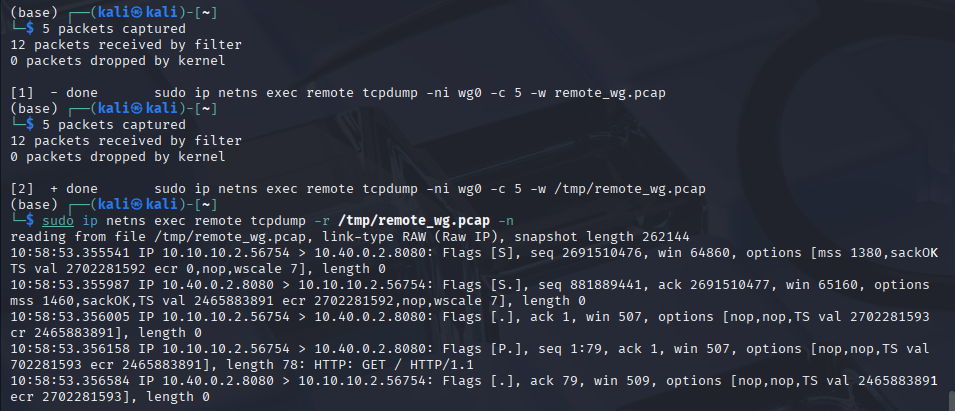

抓包位置2：fw的veth-fw-inet接口（WireGuard外层封装）
在 fw 命名空间的 veth-fw-inet 接口（连接外网的物理接口）抓包，捕获到的是 WireGuard 外层 UDP 封装包：
```bash
sudo ip netns exec fw tcpdump -ni veth-fw-inet -c 5 -w fw_inet.pcap
sudo ip netns exec fw tcpdump -r fw_inet.pcap -n
```
捕获结果：203.0.113.12.55504 > 203.0.113.1.51820 的UDP包，这是WireGuard隧道在公网传输的真实形态

**测试截图**：
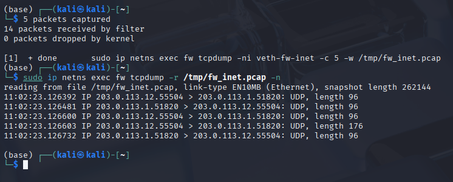

抓包位置3：fw的veth-fw-dmz接口（解封装后转发到dmz）
在 fw 命名空间的 veth-fw-dmz 接口抓包，捕获到的是解封装后的内层流量：
```bash
sudo ip netns exec fw tcpdump -ni veth-fw-dmz -c 5 -w fw_dmz.pcap
sudo ip netns exec fw tcpdump -r fw_dmz.pcap -n
```
捕获结果：10.10.10.2.41566 > 10.40.0.2.8080 的TCP明文流量，证明fw已将包转发到dmz

conntrack连接跟踪记录
查看 fw 命名空间的连接跟踪表，确认VPN连接状态：
```bash
sudo ip netns exec fw conntrack -L | grep 10.10.10.2
```
捕获结果：src=10.10.10.2 dst=10.40.0.2 sport=41566 dport=8080，状态为 TIME_WAIT，标记为 ASSURED

**测试截图**：
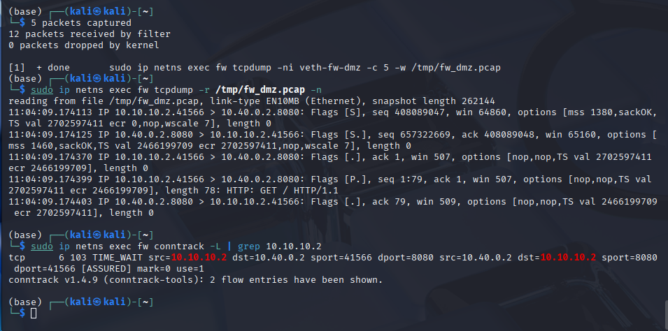

#### 包变化对比表
| 阶段 | 观察位置 | 源地址 | 目的地址 | 协议 | 备注 |
|:---:|:---:|:---:|:---:|:---:|:---:|
| 1 | remote wg0 | 10.10.10.2 | 10.40.0.2 | TCP | 封装前（VPN内层流量） |
| 2 | fw veth-fw-inet | 203.0.113.12 | 203.0.113.1 | UDP | 封装后（WireGuard外层） |
| 3 | fw veth-fw-dmz | 10.10.10.2 | 10.40.0.2 | TCP | 解封装后转发到dmz |
| 4 | conntrack | 10.10.10.2 | 10.40.0.2 | TCP | 连接跟踪记录 |

#### 分析报告

包处理完整路径：remote → wg0（VPN封装）→ internet → fw的veth-fw-inet（WireGuard外层UDP）→ fw解封装 → fw的veth-fw-dmz（内层明文TCP）→ dmz服务。回程路径相反，整个过程由conntrack维护连接状态。
WireGuard在外层添加了UDP封装，源端口由remote动态分配，目标端口为fw的51820。到达fw后，WireGuard解封装还原内层包，然后通过路由决策将包转发到dmz。conntrack记录了完整的连接信息（源IP、目的IP、端口），状态为TIME_WAIT说明连接已正常关闭。

## 八、故障排查
### 场景1：DNAT配置了但外网无法访问

**现象**：internet访问203.0.113.1:8080失败，DNAT规则存在但pkts=0

**排查过程**：检查DNAT目标地址，发现误写为10.40.0.1（网关）而非10.40.0.2

**根本原因**：DNAT规则中 `--to-destination` 参数配置错误

**修复方法**：更正目标地址为10.40.0.2

**验证结果**：curl返回200

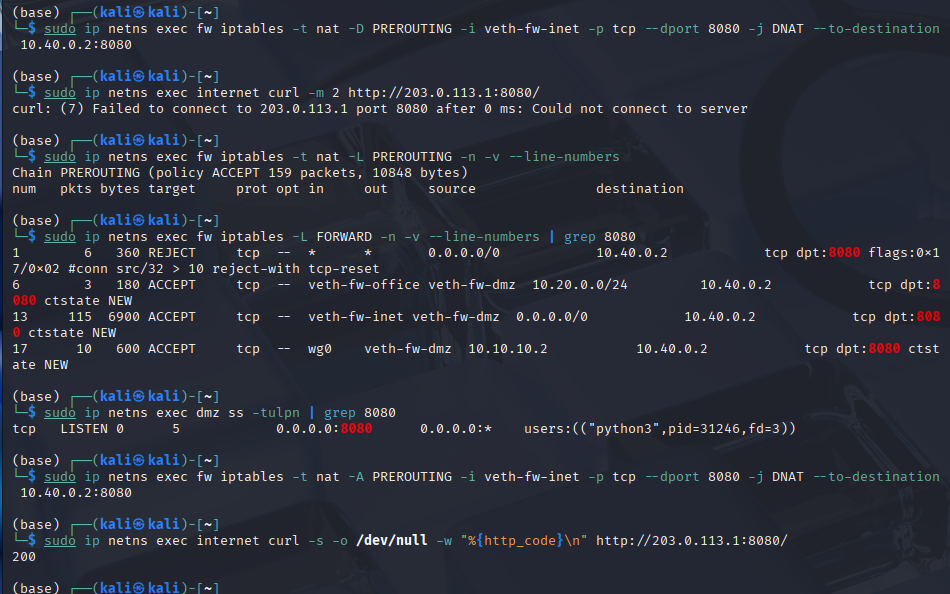


### 场景2：VPN隧道握手正常但业务访问失败

**现象**：wg show显示latest handshake，但remote无法访问10.40.0.2:8080

**排查过程**：
1. 检查remote路由表，发现缺少10.40.0.0/24路由
2. 检查WireGuard配置文件，发现AllowedIPs中缺少10.40.0.0/24
3. 检查internet命名空间的FORWARD链，发现有阻断规则

**根本原因**：
- 直接原因：AllowedIPs配置错误，缺少10.40.0.0/24
- 间接原因：internet上存在阻断规则，非VPN流量被拒绝

**修复方法**：
1. 恢复AllowedIPs配置并重启隧道
2. 删除internet上的阻断规则

**验证结果**：curl返回200

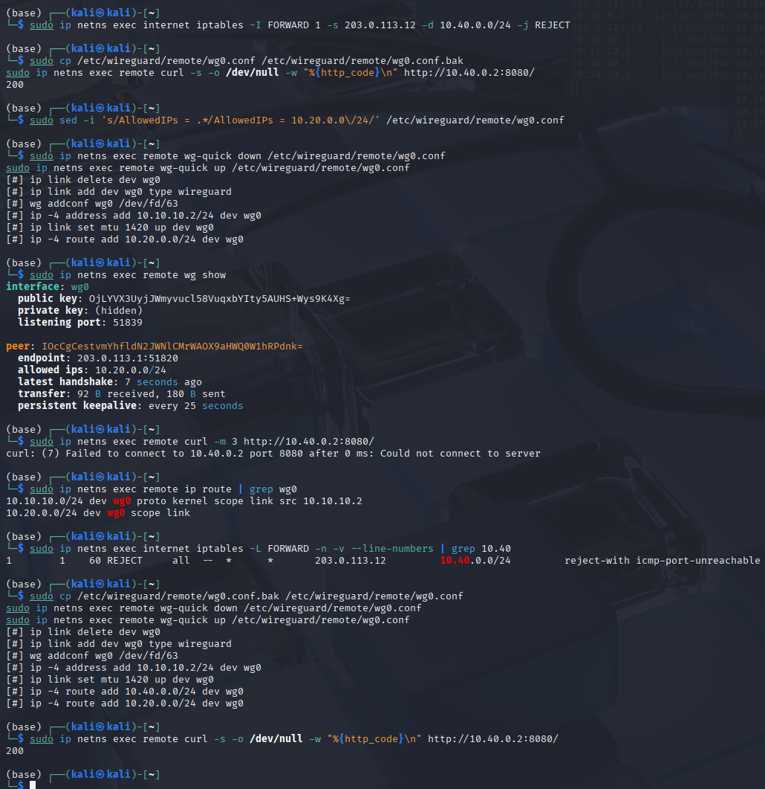


### 场景3：去掉ESTABLISHED,RELATED后TCP连接失败

**现象**：SYN包能通过防火墙，SYN-ACK包被拦截，curl超时

**排查过程**：
1. 在fw上抓包，确认SYN-ACK到达fw但未转发
2. 检查conntrack表，连接状态为NEW而非ESTABLISHED
3. 检查FORWARD规则，发现缺少状态检测规则

**根本原因**：缺少ESTABLISHED,RELATED状态检测规则，导致回包被默认DROP策略丢弃

**修复方法**：将状态检测规则插入到FORWARD链最前面

```bash
sudo ip netns exec fw iptables -I FORWARD 1 -m conntrack --ctstate ESTABLISHED,RELATED -j ACCEPT
```
验证结果：连接成功

## 九、遇到的问题和解决方法
### 问题1：guest/office无法ping通internet

**现象**：guest和office命名空间无法ping通internet命名空间的IP地址

**排查过程**：检查fw的FORWARD链，发现默认策略为DROP，且未放行guest和office访问外网的NEW连接

**根本原因**：FORWARD默认DROP策略，未添加放行NEW连接的规则

**修复方法**：添加guest→internet和office→internet的ACCEPT规则

**验证结果**：guest和office均可正常ping通internet

### 问题2：remote无法与fw建立WireGuard握手

**现象**：wg show显示无latest handshake，remote无法与fw建立VPN隧道

**排查过程**：

1. 检查remote的路由表，发现缺少到203.0.113.1的路由
2. 检查remote的WireGuard配置文件，Endpoint指向203.0.113.1:51820
3. 检查网络连通性，remote无法ping通203.0.113.1

**根本原因**：remote命名空间没有连接到外网的接口，缺少到fw公网IP的路由

**修复方法**：创建remote到internet的veth对，配置IP地址和默认路由

**验证结果**：remote可ping通203.0.113.1，WireGuard握手成功

### 问题3：VPN握手成功但remote无法访问dmz

**现象**：wg show显示latest handshake，但remote无法访问10.40.0.2:8080

**排查过程**：

1. 检查remote路由表，发现缺少10.40.0.0/24路由
2. 检查fw的FORWARD链，VPN放行规则存在
3. 检查fw的路由表，发现缺少到remote端点IP的回程路由

**根本原因**：fw缺少到remote端点IP（203.0.113.12）的回程路由

**修复方法**：在fw添加主机路由

**验证结果**：remote可正常访问10.40.0.2:8080

### 问题4：内核日志无法捕获iptables LOG

**现象**：执行违规访问命令后，journalctl -kf和dmesg -w均无任何LOG输出

**排查过程**：

1. 检查iptables规则，确认LOG规则存在且顺序正确
2. 执行logger测试，dmesg无输出
3. 检查rsyslog服务状态，发现服务未运行

**根本原因**：系统日志守护进程配置问题，内核日志无法正常输出到用户空间

**修复方法**：使用iptables规则计数器替代日志审计

**验证结果**：通过pkts计数器确认各违规规则已拦截相应数据包

### 问题5：并发测试时后台curl进程失控

**现象**：执行for循环发送并发请求时，终端输出大量[数字]作业号，终端卡顿

**排查过程**：

1. 检查执行的命令，发现使用&将curl放入后台执行
2. curl请求快速完成，shell不断创建新的后台作业
3. wait未能正确同步所有进程

**根本原因**：curl请求快速完成，循环不断创建新后台进程，wait未能正确同步

**修复方法**：使用ab工具替代curl循环

**验证结果**：ab测试正常完成，无大量作业号输出

### 问题6：connlimit规则pkts始终为0

**现象**：添加connlimit规则后，多次测试pkts仍为0，规则未生效

**排查过程**：

1. 确认connlimit规则存在且位于链首
2. 检查测试方式，发现请求是顺序执行而非并发
3. 检查--syn选项，发现限制了匹配范围

**根本原因**：测试方法不当（顺序执行），且--syn选项限制了匹配范围

**修复方法**：去掉--syn选项，使用ab进行并发测试

**验证结果**：connlimit规则pkts=6，证明拦截生效

### 问题7：8080端口服务启动失败

**现象**：执行python3 -m http.server 8080时提示Address already in use

**排查过程**：

1. 使用ss -tulpn | grep 8080查看端口占用
2. 发现残留的python进程仍在监听8080端口

**根本原因**：之前启动的服务未正常终止，进程残留导致端口被占用

**修复方法**：使用pkill清理残留进程

**验证结果**：服务正常启动，curl返回200

### 问题8：veth创建后路由表无直连路由

**现象**：创建veth对并配置IP后，ip route未显示直连路由

**排查过程**：

1. 确认IP已正确配置
2. 检查接口状态，发现接口状态为DOWN

**根本原因**：创建veth后未执行ip link set up启用接口

**修复方法**：执行ip link set up启用接口

**验证结果**：直连路由自动添加，ping测试通过

## 十、总结与思考
### 一、实验整体回顾

本次实验从零构建了企业级网络安全架构，涵盖多区域隔离、防火墙策略、NAT、VPN接入、安全审计和攻防演练等核心内容。通过实际操作，我对企业边界网络的安全设计有了更深入的理解，也对网络安全防御体系有了更加系统的认识。

### 二、关于防火墙策略设计

我深刻体会到“最小权限原则”是防火墙设计的灵魂——仅开放必要的访问，其余全部拒绝，虽然配置繁琐但安全性最高。规则顺序必须严格遵循“状态检测→允许→日志→拒绝→默认”的链条，否则会导致回包被误拦。状态检测规则（ESTABLISHED,RELATED）必须放在最前面，否则回包会被丢弃。本实验中，我配置了19条FORWARD规则，逐一测试验证，确保每条规则都能正确生效。通过实际配置，我理解了为什么状态检测是防火墙的基础，以及为什么LOG规则必须放在REJECT规则之前。

### 三、关于多区域隔离

办公区、访客区、DMZ区的隔离是企业网络的基本要求。本实验通过不同的网段和防火墙规则实现了区域间访问控制。访客区仅允许访问外网，完全隔离于内网和DMZ，有效防止了访客设备可能带来的安全风险。办公区可访问DMZ的Web服务，但不能SSH到DMZ，既满足了业务需求，又保证了管理端口的安全。DMZ区可主动访问外网进行更新，但外部只能通过DNAT访问其Web服务，管理端口22被完全屏蔽。这种分层隔离的架构有效限制了攻击者横向移动的范围，是纵深防御理念的具体体现。

### 四、关于VPN接入

WireGuard的配置简洁高效，通过AllowedIPs精确控制VPN用户可访问的网段，实现了细粒度的权限管理。VPN用户仅能访问office和dmz:8080，不能访问dmz:22和guest，充分体现了最小权限原则。同时，AllowedIPs的设计也影响了路由表，正确配置至关重要。fw端AllowedIPs设为10.10.10.2/32仅接受VPN地址，remote端设为10.20.0.0/24和10.40.0.0/24仅让内网流量走VPN，避免了0.0.0.0/0导致所有流量经过隧道的性能问题。此外，VPN隧道的建立过程让我理解了WireGuard的握手机制和路由配置的紧密关系。

### 五、关于安全审计

日志审计是安全运营的基础。本实验通过iptables LOG规则和计数器，实现了违规访问的实时记录和统计。虽然本实验因环境限制使用计数器替代日志，但在生产环境中应结合集中式日志平台（如ELK）实现日志的存储、分析和告警。LOG规则放在REJECT之前确保每次拒绝都被记录，速率限制（limit）防止日志洪水攻击，不同log-prefix便于快速分类、统计和告警优先级区分。例如，GUEST-TO-OFFICE前缀的日志表示访客违规访问办公网，而VPN-TO-DMZ-SSH表示VPN用户尝试SSH访问DMZ，这两种违规的严重程度不同，应采取不同的响应措施。

### 六、关于攻防演练

通过模拟攻击者的视角，验证了防火墙规则的有效性。三种攻击手段（网段扫描、源端口绕过、IP伪造）均被成功防御，这增强了我的信心——只要规则设计合理，防火墙能有效抵御常见攻击。网段扫描被REJECT规则拦截，攻击者只能发现网关存活；源端口绕过因防火墙基于五元组匹配而无效；IP伪造因rp_filter和WireGuard加密认证而被阻断。作为防御者，通过计数器识别异常流量也是重要技能——规则9（guest→office）pkts=32，说明guest区域存在频繁扫描，应触发告警并及时处置。connlimit改进方案进一步增强了DMZ服务的抗DDoS能力，限制单IP最大并发连接数为10，有效防止了资源耗尽型攻击。

### 七、实验中的故障排查体会

实验过程中遇到了多个故障场景，包括DNAT配置错误导致外网无法访问、VPN隧道握手正常但业务访问失败、状态检测规则缺失导致TCP连接超时等。通过逐步排查，我掌握了从现象→规则计数器→抓包分析→路由检查→conntrack查看的完整定位链路。每个故障的解决都加深了我对网络包处理流程的理解，也让我认识到细心和系统化思维在运维中的重要性。

### 八、整体感悟

企业网络安全不是单一设备的配置，而是需要综合考虑网络架构、访问控制、加密通信、审计日志和持续监控的体系化工程。安全是设计出来的，而非事后补丁。从网络命名空间的隔离、veth对的连接到iptables规则的逐条配置，再到WireGuard隧道的建立和日志审计的完善，每一个环节都环环相扣，缺一不可。本次实验让我对“纵深防御”有了具象化的理解，即通过多层防护机制来保障网络安全。未来可进一步结合IDS/IPS、WAF、零信任架构等先进技术，构建更加完善的安全防护体系。这种从零开始构建企业边界网络的过程，让我对网络安全有了更系统和深入的理解，也为后续学习更高级的安全技术打下了坚实基础。