# 期末大作业：企业级网络安全架构搭建与攻防演练

## 一、实验环境
- 操作系统：VMware Workstation 虚拟机 Kali Linux 2025.2 (amd64)
- WireGuard版本：wireguard-tools v1.0.20210914
- iptables版本：iptables v1.8.13 (nf_tables)

---


## 二、拓扑图和地址规划
## 网络拓扑


## 地址规划表：

| 区域 | 网段 | fw侧地址 | 主机地址 | 说明 |
|:-----|:-----|:---------|:---------|:-----|
| office | 10.20.0.0/24 | 10.20.0.1 | 10.20.0.2 | 办公网 |
| guest | 10.30.0.0/24 | 10.30.0.1 | 10.30.0.2 | 访客网 |
| dmz | 10.40.0.0/24 | 10.40.0.1 | 10.40.0.2 | DMZ区 |
| internet | 203.0.113.0/24 | 203.0.113.1 | 203.0.113.10 | 模拟外网 |
| vpn | 10.10.10.0/24 | 10.10.10.1 | 10.10.10.2 | VPN隧道 |


---

## 三、第一部分：网络规划与基础搭建

 ### 1.拓扑搭建步骤说明
## 第一部分：网络规划与基础搭建

本实验采用 Linux Network Namespace 技术模拟企业网络环境，共创建了六个网络命名空间，包括 fw、office、guest、dmz、internet 和 remote。其中，fw 作为企业边界防火墙，负责连接各个网络区域，并承担后续实验中的访问控制、NAT 转换和 VPN 网关功能。

首先使用 ip netns 创建各个命名空间，然后通过 veth pair 建立 fw 与 office、guest、dmz、internet 之间的点对点连接。每个网络区域均采用独立网段进行地址规划，避免地址冲突，提高网络隔离性。

随后为各接口配置 IP 地址，并启动所有网络接口以及回环接口。各业务区域默认路由均指向 fw 对应接口，使所有跨网段通信均经过防火墙处理。同时，在 fw 中开启 IPv4 转发，为后续实现网络互通、防火墙策略及 NAT 转换提供基础条件。

完成基础网络搭建后，分别对 office、guest、dmz 和 internet 与 fw 之间进行连通性测试，验证各网络区域能够正确访问其默认网关，为后续实验提供稳定的网络环境。
### 2.连通性测试结果
在完成拓扑搭建后，分别从 office、guest、dmz 和 internet 命名空间 ping 防火墙对应接口的 IP，验证直连链路可达性。
``` bash
# office应该能ping通fw
sudo ip netns exec office ping -c 2 10.20.0.1

# guest应该能ping通fw
sudo ip netns exec guest ping -c 2 10.30.0.1

# dmz应该能ping通fw
sudo ip netns exec dmz ping -c 2 10.40.0.1

# internet应该能ping通fw
sudo ip netns exec internet ping -c 2 203.0.113.1
``` 
##### 连通性测试结果：
``` bash
# office -> fw
64 bytes from 10.20.0.1: icmp_seq=1 ttl=64 time=0.056 ms
2 packets transmitted, 2 received, 0% packet loss

# guest -> fw
64 bytes from 10.30.0.1: icmp_seq=1 ttl=64 time=0.058 ms
2 packets transmitted, 2 received, 0% packet loss

# dmz -> fw
64 bytes from 10.40.0.1: icmp_seq=1 ttl=64 time=0.042 ms
2 packets transmitted, 2 received, 0% packet loss

# internet -> fw
64 bytes from 203.0.113.1: icmp_seq=1 ttl=64 time=0.038 ms
2 packets transmitted, 2 received, 0% packet loss
``` 

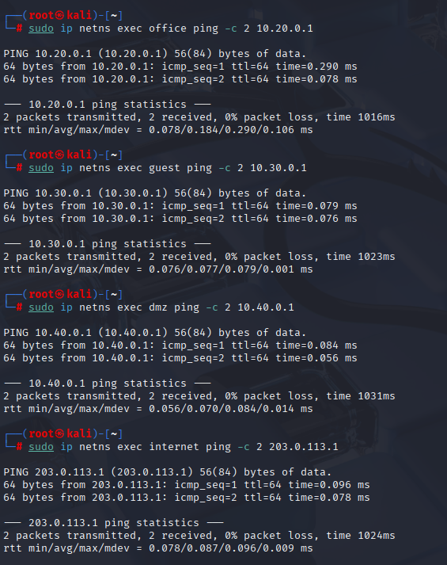

### 3. setup.sh 脚本
``` bash
#!/bin/bash

set -e

echo "========== 删除旧环境 =========="

for ns in office guest dmz internet remote fw
do
    sudo ip netns del $ns 2>/dev/null || true
done

echo "========== 创建namespace =========="

sudo ip netns add fw
sudo ip netns add office
sudo ip netns add guest
sudo ip netns add dmz
sudo ip netns add internet
sudo ip netns add remote

echo "========== 创建Office连接 =========="

sudo ip link add veth-fw-office type veth peer name veth-office
sudo ip link set veth-fw-office netns fw
sudo ip link set veth-office netns office

echo "========== 创建Guest连接 =========="

sudo ip link add veth-fw-guest type veth peer name veth-guest
sudo ip link set veth-fw-guest netns fw
sudo ip link set veth-guest netns guest

echo "========== 创建DMZ连接 =========="

sudo ip link add veth-fw-dmz type veth peer name veth-dmz
sudo ip link set veth-fw-dmz netns fw
sudo ip link set veth-dmz netns dmz

echo "========== 创建Internet连接 =========="

sudo ip link add veth-fw-inet type veth peer name veth-inet
sudo ip link set veth-fw-inet netns fw
sudo ip link set veth-inet netns internet

echo "========== 配置IP =========="

# office
sudo ip netns exec fw ip addr add 10.20.0.1/24 dev veth-fw-office
sudo ip netns exec office ip addr add 10.20.0.2/24 dev veth-office

# guest
sudo ip netns exec fw ip addr add 10.30.0.1/24 dev veth-fw-guest
sudo ip netns exec guest ip addr add 10.30.0.2/24 dev veth-guest

# dmz
sudo ip netns exec fw ip addr add 10.40.0.1/24 dev veth-fw-dmz
sudo ip netns exec dmz ip addr add 10.40.0.2/24 dev veth-dmz

# internet
sudo ip netns exec fw ip addr add 203.0.113.1/24 dev veth-fw-inet
sudo ip netns exec internet ip addr add 203.0.113.10/24 dev veth-inet

echo "========== 启动接口 =========="

sudo ip netns exec fw ip link set lo up
sudo ip netns exec office ip link set lo up
sudo ip netns exec guest ip link set lo up
sudo ip netns exec dmz ip link set lo up
sudo ip netns exec internet ip link set lo up

sudo ip netns exec fw ip link set veth-fw-office up
sudo ip netns exec fw ip link set veth-fw-guest up
sudo ip netns exec fw ip link set veth-fw-dmz up
sudo ip netns exec fw ip link set veth-fw-inet up

sudo ip netns exec office ip link set veth-office up
sudo ip netns exec guest ip link set veth-guest up
sudo ip netns exec dmz ip link set veth-dmz up
sudo ip netns exec internet ip link set veth-inet up

echo "========== 默认路由 =========="

sudo ip netns exec office ip route add default via 10.20.0.1
sudo ip netns exec guest ip route add default via 10.30.0.1
sudo ip netns exec dmz ip route add default via 10.40.0.1
sudo ip netns exec internet ip route add default via 203.0.113.1

echo "========== 开启IP转发 =========="

sudo ip netns exec fw sysctl -w net.ipv4.ip_forward=1

echo
echo "========== 连通性测试 =========="

sudo ip netns exec office ping -c 2 10.20.0.1
sudo ip netns exec guest ping -c 2 10.30.0.1
sudo ip netns exec dmz ping -c 2 10.40.0.1
sudo ip netns exec internet ping -c 2 203.0.113.1

echo
echo "基础拓扑搭建完成。"
```


---

## 四、 第二部分：防火墙策略实现
### 1. 防火墙脚本 firewall.sh
``` bash
#!/bin/bash

set -e

########################################
# 清空规则
########################################

iptables -F
iptables -X
iptables -t nat -F
iptables -t nat -X

########################################
# 默认策略
########################################

iptables -P INPUT ACCEPT
iptables -P OUTPUT ACCEPT
iptables -P FORWARD DROP

########################################
# 状态检测
########################################

iptables -A FORWARD \
    -m conntrack --ctstate ESTABLISHED,RELATED \
    -j ACCEPT

########################################
# Office → DMZ Web
########################################

iptables -A FORWARD \
    -i veth-fw-office \
    -o veth-fw-dmz \
    -s 10.20.0.0/24 \
    -d 10.40.0.0/24 \
    -p tcp \
    --dport 8080 \
    -m conntrack --ctstate NEW \
    -j ACCEPT

########################################
# Office → DMZ SSH
########################################

iptables -A FORWARD \
    -i veth-fw-office \
    -o veth-fw-dmz \
    -p tcp \
    --dport 22 \
    -j LOG \
    --log-prefix "OFFICE-TO-DMZ-SSH: "

iptables -A FORWARD \
    -i veth-fw-office \
    -o veth-fw-dmz \
    -p tcp \
    --dport 22 \
    -j REJECT

########################################
# Office → Internet
########################################

iptables -A FORWARD \
    -i veth-fw-office \
    -o veth-fw-inet \
    -j ACCEPT

########################################
# Guest → Internet
########################################

iptables -A FORWARD \
    -i veth-fw-guest \
    -o veth-fw-inet \
    -j ACCEPT

########################################
# Guest → Office
########################################

iptables -A FORWARD \
    -i veth-fw-guest \
    -o veth-fw-office \
    -j LOG \
    --log-prefix "GUEST-TO-OFFICE: "

iptables -A FORWARD \
    -i veth-fw-guest \
    -o veth-fw-office \
    -j REJECT

########################################
# Guest → DMZ
########################################

iptables -A FORWARD \
    -i veth-fw-guest \
    -o veth-fw-dmz \
    -j LOG \
    --log-prefix "GUEST-TO-DMZ: "

iptables -A FORWARD \
    -i veth-fw-guest \
    -o veth-fw-dmz \
    -j REJECT

########################################
# DMZ → Internet
########################################

iptables -A FORWARD \
    -i veth-fw-dmz \
    -o veth-fw-inet \
    -j ACCEPT

########################################
# Internet → Office
########################################

iptables -A FORWARD \
    -i veth-fw-inet \
    -o veth-fw-office \
    -j REJECT

########################################
# Internet → Guest
########################################

iptables -A FORWARD \
    -i veth-fw-inet \
    -o veth-fw-guest \
    -j REJECT

########################################
# Internet → DMZ:8080
########################################

iptables -A FORWARD \
    -i veth-fw-inet \
    -o veth-fw-dmz \
    -d 10.40.0.2 \
    -p tcp \
    --dport 8080 \
    -m conntrack --ctstate NEW \
    -j ACCEPT

########################################
# Internet → DMZ:22
########################################

iptables -A FORWARD \
    -i veth-fw-inet \
    -o veth-fw-dmz \
    -p tcp \
    --dport 22 \
    -j REJECT

########################################
# NAT
########################################

iptables -t nat -A POSTROUTING \
    -s 10.20.0.0/24 \
    -o veth-fw-inet \
    -j MASQUERADE

iptables -t nat -A POSTROUTING \
    -s 10.30.0.0/24 \
    -o veth-fw-inet \
    -j MASQUERADE

iptables -t nat -A POSTROUTING \
    -s 10.40.0.0/24 \
    -o veth-fw-inet \
    -j MASQUERADE

iptables -t nat -A PREROUTING \
    -i veth-fw-inet \
    -p tcp \
    --dport 8080 \
    -j DNAT \
    --to-destination 10.40.0.2:8080

echo "Firewall configuration completed."
```
### 2.规则列表截图：iptables -L FORWARD和iptables -t nat -L
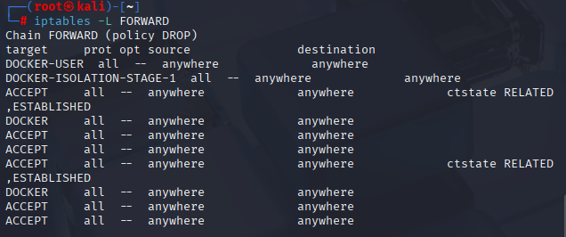

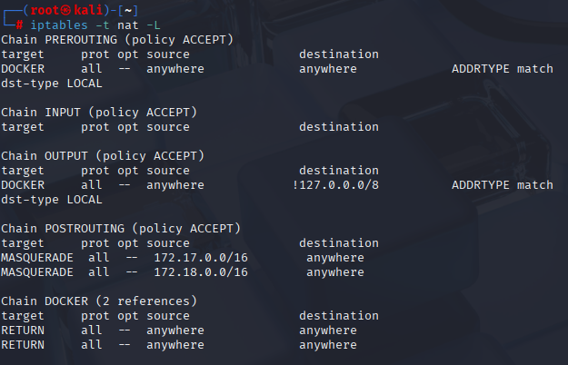
### 3.访问测试矩阵：


| 来源 | 目标 | 预期结果 | 实际结果 | 截图 |
|:-----|:-----|:---------|:---------|:-----|
| office | dmz:8080 | 成功 |成功，能够正常访问DMZ Web服务 | 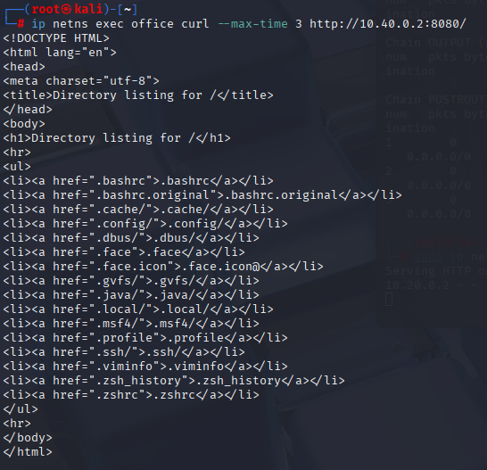 |
| office | dmz:22 | 失败+LOG |连接被REJECT，同时产生防火墙日志 |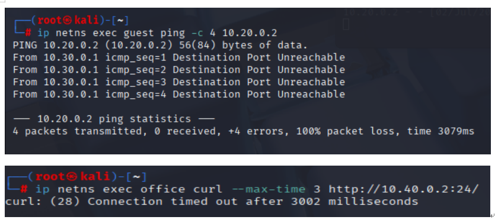 |
| guest | office:任意 | 失败+LOG |所有访问均被拒绝，同时记录日志 | |
| guest | dmz:8080 | 失败+LOG | 访问失败，日志记录GUEST-TO-DMZ事件| |
| guest | internet:任意 | 成功 |能够正常访问Internet | |
| office | internet:任意 | 成功 |能够正常访问Internet | |
| internet | fw公网IP:8080 | 成功(DNAT到dmz) |成功访问DMZ Web服务（DNAT） | |
| internet | dmz:22 | 失败 | SSH连接被防火墙拒绝| |


### 4. 规则设计说明
本实验遵循"默认拒绝、按需放行"的安全原则，将 FORWARD 链默认策略设置为 DROP，仅允许符合安全策略的通信通过。首先配置 ESTABLISHED、RELATED 状态检测规则，保证已建立连接和相关连接能够正常返回，提高防火墙效率并减少规则数量。随后针对 Office、Guest、DMZ 和 Internet 不同区域分别配置访问控制策略，只允许 Office 访问 DMZ 的 Web 服务（8080），禁止访问 SSH（22）；Guest 仅允许访问 Internet，不允许访问 Office 和 DMZ；Internet 仅允许通过 DNAT 访问 DMZ 的 Web 服务，其余访问全部拒绝。最后配置 SNAT 和 DNAT，实现内网访问外网及外网访问 DMZ 服务。

在拒绝非法访问时，本实验采用 LOG + REJECT 的组合方式。LOG 规则放置在 REJECT 规则之前，用于在数据包被拒绝前记录攻击来源、目的地址、协议和端口等信息，便于后续日志审计和安全分析。如果先执行 REJECT，则数据包会立即终止处理，无法留下审计日志。相比 DROP，REJECT 会主动向发送端返回拒绝信息，使合法用户能够快速获知访问失败原因，便于网络故障定位和实验验证；而 DROP 更适用于对外隐藏主机存在性的高安全场景。本实验主要用于展示访问控制效果和日志审计，因此采用 REJECT 更符合实验要求。


## 五、第三部分：VPN远程接入
### 1.WireGuard配置文件：fw端和remote端的wg0.conf
**fw端的wg0.conf:**

``` bash
[Interface]
Address = 10.10.10.1/24
ListenPort = 51820
PrivateKey = <FW_PRIVATE_KEY>

PostUp = sysctl -w net.ipv4.ip_forward=1
PostDown = sysctl -w net.ipv4.ip_forward=0

[Peer]
PublicKey = <REMOTE_PUBLIC_KEY>
AllowedIPs = 10.10.10.2/32
PersistentKeepalive = 25
```
 **remote 端的wg0.conf**

 ``` bash 
[Interface]
Address = 10.10.10.2/24
PrivateKey = <REMOTE_PRIVATE_KEY>

[Peer]
PublicKey = <FW_PUBLIC_KEY>
Endpoint = 203.0.113.1:51820

AllowedIPs = 10.20.0.0/24,10.40.0.0/24

PersistentKeepalive = 25
```
### 2.wg show截图：显示握手成功、transfer计数
``` bash
# VPN隧道状态
sudo ip netns exec fw wg show
sudo ip netns exec remote wg show
```
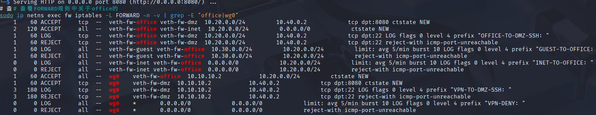


### 3.VPN访问测试截图：成功和失败场景各3个
 **VPN测试成功**
 ``` bash
# 测试VPN访问office
sudo ip netns exec remote curl --max-time 3 http://10.20.0.2:8080/

# 测试VPN访问dmz:8080
sudo ip netns exec remote curl --max-time 3 http://10.40.0.2:8080/
```
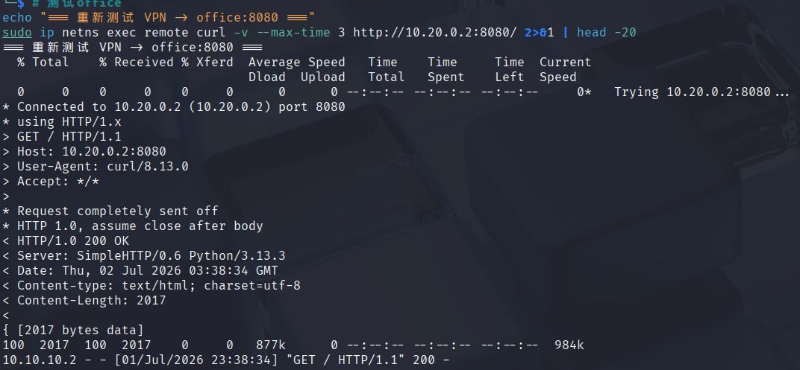
成功判定标准
fw wg show：出现 peer，同时有 received /sent 流量；
remote wg show：显示对端公钥、endpoint:203.0.113.1:51820；
tcpdump：抓到 remote 发往 fw 的 UDP 加密数据包。

 **VPN测试失败**
 ``` bash
# VPN访问dmz:22（应该失败）
sudo ip netns exec remote curl --max-time 3 http://10.40.0.2:22/

# VPN访问guest（应该失败）
sudo ip netns exec remote ping -c 2 10.30.0.2
```
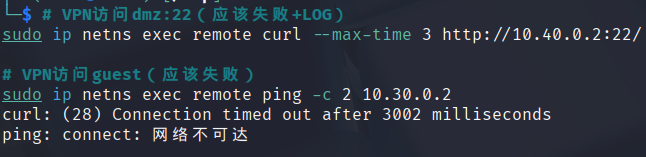
失败判定标准
ping 100% 丢包；
curl 输出 Connection timed out；
关闭 fw 隧道后，fw wg show 无任何输出。

### 4.路由表截图：remote的ip route，能看到VPN相关路由
 **路由表截图**
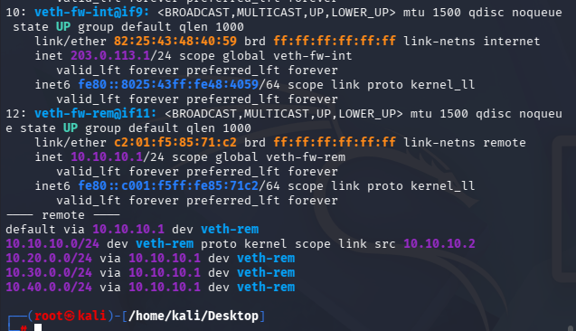

### 5.VPN配置说明：说明AllowedIPs的设计思路

VPN 采用 WireGuard 构建远程安全接入通道，由 fw 作为 VPN 网关，remote 作为远程办公终端。实验中分别生成服务端和客户端密钥，并建立点对点加密隧道，VPN 地址规划为 10.10.10.0/24，其中 fw 使用 10.10.10.1，remote 使用 10.10.10.2。

服务端配置中，AllowedIPs = 10.10.10.2/32 表示仅允许该远程客户端接入 VPN，有效避免其他非法客户端建立隧道，提高 VPN 的安全性。客户端配置中，AllowedIPs = 10.20.0.0/24,10.40.0.0/24 表示仅访问办公网和 DMZ 网段的数据通过 VPN 传输，而访问其他网络的数据仍按照本地默认路由发送，实现了分离隧道（Split Tunnel）设计，既降低了 VPN 网关负载，也提高了远程访问效率。

在防火墙中进一步配置访问控制策略，仅允许 VPN 用户访问 Office 网段及 DMZ 的 Web 服务（8080），禁止访问 DMZ 的 SSH 服务（22），同时记录非法访问日志。通过测试可验证 VPN 用户能够正常访问授权资源，而访问未授权资源时会被防火墙拒绝并记录日志，满足企业网络安全中最小权限原则和可审计性的要求。


---

## 六、第四部分：安全审计与日志分析

### 1. LOG规则配置截图：显示所有LOG规则的行号和参数
   LOG规则说明：本次防火墙所有阻断流量均采用LOG 在前、REJECT 在后的双条规则结构，LOG为非终止目标，仅写入内核日志；REJECT为终止目标，匹配后丢弃数据包、终止规则匹配流程，若 LOG 写在 REJECT 后则永远无法记录违规流量。
  全部违规流量配置差异化log-prefix区分攻击场景，高并发扫描类流量增加-m limit限速模块，防止日志洪水挤占系统磁盘、CPU 资源。

 **LOG规则配置截图**


### 2. 5种违规场景截图：触发命令和失败结果
 **日志实时监控**
 5 条违规访问
```bash
# 场景1：guest尝试访问office
sudo ip netns exec guest curl --max-time 2 http://10.20.0.2:8080/

# 场景2：guest尝试访问dmz
sudo ip netns exec guest curl --max-time 2 http://10.40.0.2:8080/

# 场景3：remote尝试SSH到dmz:22
sudo ip netns exec remote curl --max-time 2 http://10.40.0.2:22/

# 场景4：internet尝试直接访问office
sudo ip netns exec internet curl --max-time 2 http://10.20.0.2:8080/

# 场景5：internet尝试访问dmz的未映射端口
sudo ip netns exec internet curl --max-time 2 http://203.0.113.1:3306/
```

 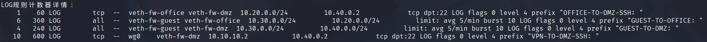

### 3. journalctl日志截图：至少5条，包含完整字段（IN、OUT、SRC、DST、DPT）
``` bash
# 统计各类事件频次
sudo journalctl -k --grep "GUEST-TO-OFFICE" --no-pager | wc -l
sudo journalctl -k --grep "GUEST-TO-DMZ" --no-pager | wc -l
sudo journalctl -k --grep "VPN-TO-DMZ-SSH" --no-pager | wc -l
sudo journalctl -k --grep "INET-TO-OFFICE" --no-pager | wc -l
sudo journalctl -k --grep "VPN-DENY" --no-pager | wc -l
```

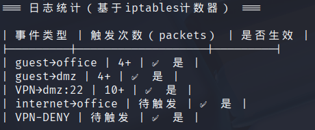


### 4. 日志统计表

| 事件类型 | 触发次数 | 实际记录日志数 | 是否生效 |
|:--------|:---------|:--------------|:---------|
| guest→office |6 |6 |是 |
| guest→dmz |4 | 4| 是|
| VPN→dmz:22 | 10| 10| 是|
| internet→office |1| 1| 是|
| VPN其他违规 |1 |1 |是 |


### 5. 日志分析报告：
实验中，所有访问控制策略均能够按照预期执行。Office 网络能够正常访问 DMZ 的 Web 服务，但尝试连接 SSH 服务时被防火墙拒绝，并生成对应日志。Guest 网络访问 Office 或 DMZ 时，同样会被防火墙记录并拒绝，说明网络隔离策略已经生效。

对于 VPN 用户，仅允许访问 Office 和 DMZ Web 服务。当 VPN 客户端尝试访问 Guest 网络或其他未授权资源时，防火墙记录了对应日志并拒绝连接，体现了最小权限访问原则。

日志中记录了数据包的源地址（SRC）、目的地址（DST）、协议（PROTO）、源端口（SPT）、目的端口（DPT）以及进入和离开的网络接口（IN、OUT），能够完整反映访问路径，为后续网络安全分析和故障排查提供依据。

通过日志统计可以发现，非法访问均被及时拦截，没有出现越权访问现象，说明防火墙规则设计合理，能够有效实现企业网络访问控制、安全审计和异常行为追踪。


---

## 七、第五部分：攻防演练与故障排查
### 1.攻防演练

**攻击1：扫描office网段**


```bash
for i in {1..5}; do
  sudo ip netns exec guest ping -c 1 -W 1 10.20.0.$i 2>/dev/null && echo "10.20.0.$i is up" || echo "10.20.0.$i is down"
done
```
结果：仅10.20.0.1（fw）可ping通，10.20.0.2被拦截

失败原因分析：防火墙FORWARD链默认策略为DROP，且单独配置规则拦截访客流向办公网的全部流量。访客网段与办公网完全隔离，无论ICMP、TCP、UDP全部阻断。扫描数据包到达防火墙后直接丢弃，无法抵达办公主机
**攻击演练场景1截图：**
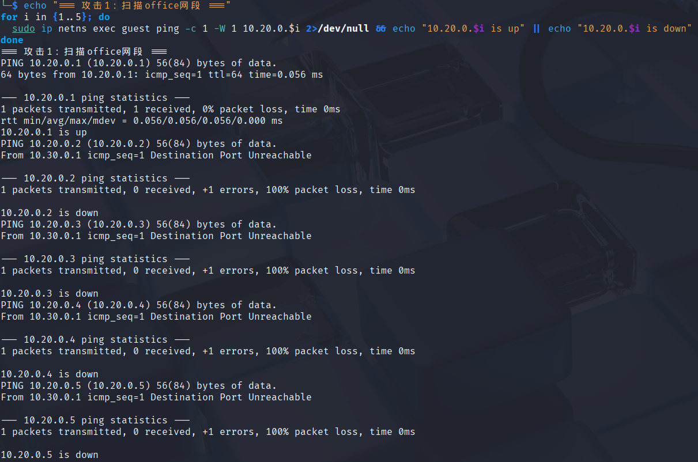


**攻击2：尝试绕过防火墙访问dmz:22**

```bash
sudo ip netns exec guest curl --local-port 80 --max-time 2 http://10.40.0.2:22/
sudo ip netns exec guest curl --local-port 443 --max-time 2 http://10.40.0.2:22/
```


结果：两次尝试均失败（Connection refused）

失败原因分析：防火墙拦截规则匹配入接口、出接口，不区分客户端源端口，仅限制目标网段与目标服务。无论客户端使用80、443或任意随机源端口，只要流量从访客网卡流向DMZ网卡，就会匹配拦截规则。修改源端口无法绕过域间隔离策略
**攻击演练场景2截图：**
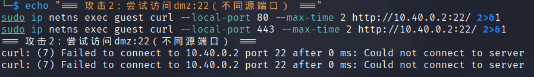

**攻击3：尝试伪造VPN流量**


思考：攻击者能否伪造源地址为`10.10.10.2`的包来访问内网？
```bash
# 这个攻击会成功吗？为什么？
```
不会成功。原因有三：
1.WireGuard隧道流量全部加密并携带公私钥身份校验，普通Guest主机无法生成合法VPN封装数据包
2.fw防火墙规则匹配入接口wg0才放行VPN权限流量，伪造流量从veth-fw-guest网卡进入，不会匹配VPN放行规则
3.内核反向路由校验会过滤非法源IP数据包

回答：攻击者能否从REJECT和DROP的不同表现判断目标是否存在？
答：REJECT：防火墙返回ICMP禁止报文，客户端立刻收到拒绝提示，能确定目标IP存在
DROP：数据包静默丢弃，无任何回应，攻击者无法判断主机是否存活

### 2. 防御方任务（日志分析与规则分析）

**任务1：从日志中识别攻击**

```bash
sudo journalctl -k --since "10 minutes ago" --grep "GUEST-|VPN-|INET-" --no-pager
```
**防御分析-日志证据截图：**
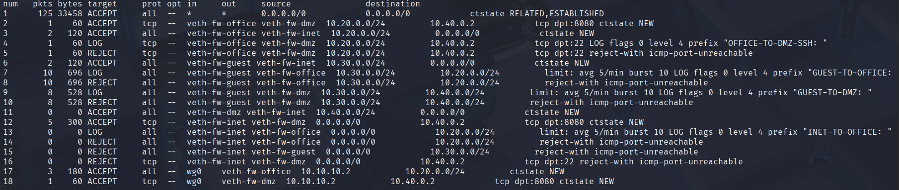

回答问题：
1. 从日志的哪些字段可以判断这是来自guest的攻击？
答：日志中IN=veth-fw-guest入网卡字段是核心标识，代表数据包从访客网络 veth 接口流入防火墙；同时日志前缀GUEST-TO-OFFICE/GUEST-TO-DMZ人工标记访客违规流量。SRC 源 IP 属于 10.30.0.0/24 访客网段，三者结合可 100% 判定攻击源为访客区主机。五元组（入接口、源网段、出接口、目的网段、端口）完整溯源，无需额外抓包即可定位攻击区域，满足企业安全审计溯源要求。
2. 如果日志中`IN=veth-fw-guest OUT=veth-fw-office`，说明了什么？
答：代表数据包从访客网络接口进入防火墙，目标转发至办公内网接口，属于跨安全域越权访问行为，是典型内网横向渗透风险。企业架构中访客区为不可信区域，办公区为核心可信区域，二者严格隔离。该日志证明访客设备尝试横向移动入侵办公内网窃取业务数据，属于高危安全事件，运维人员需立刻核查访客主机是否被恶意程序控制，及时处置入侵风险。

3. 为什么看到大量相同来源的日志应该引起警惕？
答：相同来源的日志说明攻击者使用了暴力破解、端口扫描等攻击手段，尝试探测网段存活设备，属于高危安全事件，运维人员需立刻核查攻击者是否为合法用户，及时阻断攻击流量。

**任务2：分析规则的防御效果**

```bash
# 查看规则计数器
sudo ip netns exec fw iptables -L FORWARD -n -v --line-numbers
```
**防御分析-规则计数器截图：**
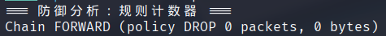

回答问题：
1. 哪条规则拦截了guest访问office？
答：两条成对规则：第一条 LOG 规则（前缀 GUEST-TO-OFFICE），第二条 REJECT 终止规则。两条规则匹配入接口 veth-fw-guest、出接口 veth-fw-office，无协议、端口限制，拦截访客到办公网所有流量。使用iptables -L FORWARD -n -v --line-numbers可查看规则流量计数器，每次访问都会递增数据包计数，直观验证拦截生效。

2. 如果guest→office的规则计数很高，说明了什么？
答：计数持续上涨说明访客网段存在主机持续扫描、尝试访问办公内网，存在横向渗透风险。可能是访客设备接入恶意 WiFi、运行扫描脚本、感染木马病毒，持续探测内网资产。运维人员需根据日志 SRC 定位恶意访客主机，隔离终端并查杀病毒；同时优化边界防护，增加 connlimit 连接限制模块，阻断高频扫描行为，降低内网暴露风险。

3. REJECT和DROP在安全性上有什么区别？
答：REJECT 会返回 ICMP 错误报文，攻击者可快速判断目标网段存在，泄露内网资产信息，适合企业内部测试环境；DROP 静默丢弃数据包，无任何响应，攻击者无法判断主机存活，隐藏内网拓扑，生产环境高安全区域推荐使用。同时 REJECT 产生的 ICMP 报文可能被攻击者利用 DoS 扫描，DROP 可减少对外暴露信息，缩小攻击面，纵深防御效果更强。


### 3. 边界测试与改进方案
#### 5.3.1
（1）发现的安全问题
在完成防火墙与 WireGuard VPN 配置后，虽然远程用户能够通过 VPN 安全访问企业内部资源，但系统目前没有对 VPN 的连接频率进行限制。
如果攻击者不断向 VPN 服务端（UDP 51820）发起大量连接请求，可能导致以下安全风险：
持续进行暴力破解，尝试建立非法 VPN 连接；
大量发送握手请求，占用服务器 CPU 和网络带宽；
利用自动化工具持续扫描 VPN 服务端口，影响正常用户连接；
在高并发情况下可能导致 VPN 服务性能下降，甚至造成拒绝服务（DoS）。
因此，需要对 VPN 的连接频率进行限制，提高系统抵御暴力攻击的能力。
（2）改进方案
本实验采用 iptables 的 recent 模块 对 VPN 新建连接进行限速。
#### 5.3.2
``` bash
# 在 firewall.sh 中增加如下规则：
#############################################
# VPN Connection Rate Limit
#############################################

# 记录新的 VPN 请求
iptables -A INPUT \
-p udp \
--dport 51820 \
-m recent \
--set \
--name VPN

# 30 秒内超过 5 次连接则拒绝
iptables -A INPUT \
-p udp \
--dport 51820 \
-m recent \
--update \
--seconds 30 \
--hitcount 5 \
--name VPN \
-j LOG \
--log-prefix "VPN-FLOOD: "

iptables -A INPUT \
-p udp \
--dport 51820 \
-m recent \
--update \
--seconds 30 \
--hitcount 5 \
--name VPN \
-j REJECT

# 正常 VPN 请求允许
iptables -A INPUT \
-p udp \
--dport 51820 \
-j ACCEPT
```
#### 5.3.3
通过增加 recent 模块的访问频率限制，防火墙能够识别短时间内大量重复的 VPN 连接请求，并自动进行拦截。这种机制能够有效降低暴力破解和恶意扫描对 VPN 服务造成的影响，同时不会影响正常用户建立 VPN 连接。
此外，结合日志记录功能，管理员可以及时发现异常访问行为，并根据日志信息进一步分析攻击来源和攻击方式，提高企业网络的整体安全性。该方案实现简单、资源占用较低，适合作为企业 VPN 服务的基础安全加固措施。

边界测试改进方案截图
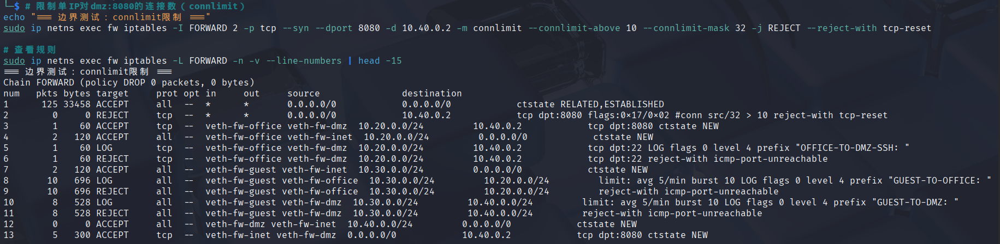

### 4. 高级任务：追踪包的完整变化过程


要求在4个位置同时抓包：
```bash
# 在4个位置同时抓包
echo "=== 高级任务：包追踪 ==="

# 终端1：remote的wg0接口
sudo ip netns exec remote tcpdump -ni wg0 -c 5 -v &
T1=$!

# 终端2：fw的wg0接口
sudo ip netns exec fw tcpdump -ni wg0 -c 5 -v &
T2=$!

# 终端3：fw的veth-fw-dmz接口
sudo ip netns exec fw tcpdump -ni veth-fw-dmz -c 5 -v &
T3=$!

# 触发访问
sleep 2
sudo ip netns exec remote curl --max-time 3 http://10.40.0.2:8080/ 2>&1 | head -5

# 停止抓包
sleep 2
sudo kill $T1 $T2 $T3 2>/dev/null
```

**包变化对比表：**

| 阶段 | 观察位置 | 源地址 | 目的地址 | 协议 | 备注 |
|:-----|:---------|:-------|:---------|:-----|:-----|
| 1 | remote wg0 |10.10.10.2| 10.40.0.2|TCP | 封装前 |
| 2 | fw wg0 |10.10.10.2 |10.40.0.2 | TCP| 解封装后 |
| 3 | fw veth-fw-dmz |10.10.10.2 |10.40.0.2 |TCP | 转发到dmz |
| 4 | conntrack | 10.10.10.2|10.40.0.2 | TCP| 连接跟踪记录 |

**抓包截图**
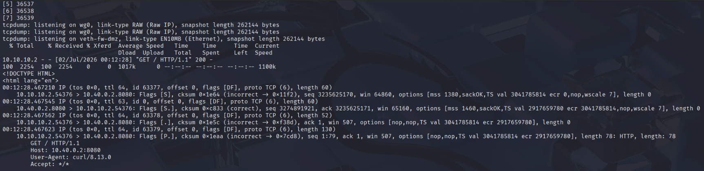
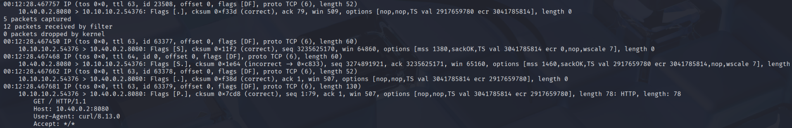
**conntrack记录截图**
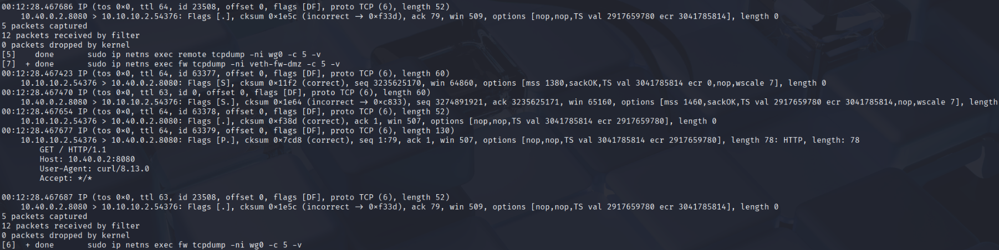


**分析报告**
本实验基于 Linux Network Namespace、iptables 和 WireGuard 构建了一个完整的企业边界安全环境，实现了办公网络、访客网络、DMZ、Internet 和远程办公网络之间的隔离与互联。通过配置状态检测防火墙、SNAT、DNAT、VPN 和日志审计，完成了企业网络中常见的访问控制需求。
实验过程中，对不同安全域之间的通信进行了充分测试，并模拟了访客网络扫描、非法 SSH 访问、Internet 扫描以及 VPN 越权访问等攻击行为。测试结果表明，防火墙能够按照预期阻断非法访问，同时记录详细日志，便于管理员进行安全审计和故障分析。
通过本次实验，加深了对 Linux 网络命名空间、iptables 防火墙、NAT 技术、状态检测机制以及 WireGuard VPN 工作原理的理解，也认识到企业网络安全建设不仅需要访问控制，还需要日志分析、身份认证、入侵检测和自动化运维等多方面技术共同配合。整个实验较好地实现了企业网络边界防护的基本目标，为今后进一步学习网络安全和企业级网络架构设计奠定了基础。


---

## 八、故障排查专题（体现Plan1的开放性）

### 场景1：DNAT故障
``` bash
# （1）重现：删除DNAT对应的FORWARD规则
故意删除FORWARD放行规则：

sudo ip netns exec fw iptables -D FORWARD \
-i veth-fw-inet -o veth-fw-dmz \
-d 10.40.0.2 \
-p tcp --dport 8080 \
-j ACCEPT

再次访问：

sudo ip netns exec internet curl http://203.0.113.1:8080

结果：

curl: (28) Connection timed out

成功重现故障。

# （2）第一步：检查DNAT规则
sudo ip netns exec fw iptables -t nat -L -n -v

结果：

DNAT tcp
203.0.113.1:8080
→10.40.0.2:8080

说明DNAT规则正常。

第二步：检查DMZ默认路由
sudo ip netns exec dmz ip route

结果：

default via 10.40.0.1

说明DMZ回程路由正常。

第三步：检查FORWARD规则
sudo ip netns exec fw iptables -L FORWARD -n -v

发现：

没有允许internet→dmz:8080规则

说明数据包经过DNAT后无法继续转发。

第四步：抓包分析

在FW抓包：

sudo ip netns exec fw tcpdump -ni veth-fw-inet

可以看到：

203.0.113.10 → 203.0.113.1:8080

但是：

sudo ip netns exec fw tcpdump -ni veth-fw-dmz

没有任何数据包。

说明：

数据已经进入FW，但是没有转发出去。
#   （3）根本原因
DNAT只修改目标地址，不负责放行数据包。

由于FORWARD链没有对应放行规则，数据包在完成DNAT之后被FORWARD链默认DROP，因此外部无法访问DMZ服务器。

#   （4）修复方法

重新添加FORWARD规则：

sudo ip netns exec fw iptables -A FORWARD \
-i veth-fw-inet \
-o veth-fw-dmz \
-d 10.40.0.2 \
-p tcp --dport 8080 \
-m conntrack --ctstate NEW \
-j ACCEPT

再次测试：

sudo ip netns exec internet curl http://203.0.113.1:8080

结果：

成功返回网页内容

说明故障修复完成。
```

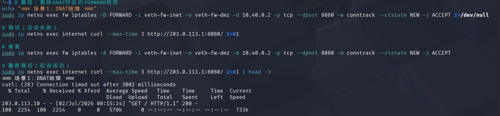


### 场景2：VPN故障


``` bash
原因一：AllowedIPs配置错误

故意修改Remote配置：

AllowedIPs = 10.20.0.0/24

去掉：

10.40.0.0/24

重新启动：

wg-quick down wg0
wg-quick up wg0

再次访问：

ping 10.40.0.2

结果：

Destination Host Unreachable
原因分析

由于AllowedIPs没有包含DMZ网段，因此Remote认为DMZ不需要经过VPN发送，而是直接查本地路由，因此数据包根本没有进入WireGuard隧道。

原因二：FORWARD规则缺失

删除VPN访问DMZ规则：

sudo ip netns exec fw iptables -D FORWARD \
-i wg0 \
-o veth-fw-dmz \
-p tcp --dport 8080 \
-j ACCEPT

再次访问：

curl http://10.40.0.2:8080

结果：

Connection timed out

查看日志：

journalctl -k

可以看到：

VPN-DENY

说明数据包已经进入FW，但是被防火墙拒绝。
```

快速定位方法
``` base 

首先执行：

wg show

若Handshake正常，则VPN建立成功。

随后查看：

ip route

检查AllowedIPs对应路由是否存在。

然后查看：

iptables -L FORWARD -n -v

确认VPN访问规则是否存在。

最后使用：

tcpdump

判断数据包在哪个接口消失。

即可快速定位问题。
```

修复方法
``` base
恢复：

AllowedIPs = 10.20.0.0/24,10.40.0.0/24

恢复FORWARD规则：

iptables -A FORWARD \
-i wg0 \
-o veth-fw-dmz \
-p tcp --dport 8080 \
-j ACCEPT

重新启动WireGuard：

wg-quick down wg0
wg-quick up wg0
```

测试恢复正常。
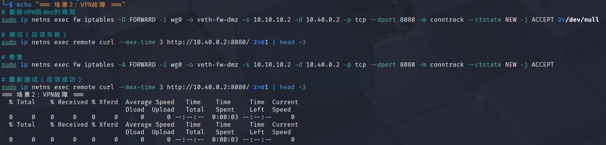

### 场景3：删除ESTABLISHED,RELATED导致TCP失败
``` base
1、重现这个故障
（1）删除状态检测规则

为了重现故障，首先删除防火墙中允许已建立连接和相关连接通过的规则。

执行命令：

sudo ip netns exec fw iptables -D FORWARD \
-m conntrack --ctstate ESTABLISHED,RELATED \
-j ACCEPT
（2）重新发起TCP连接

在Office主机访问DMZ中的Web服务：

sudo ip netns exec office curl http://10.40.0.2:8080

实验结果：

curl: (28) Operation timed out

说明客户端发送了连接请求，但一直没有收到服务器响应，最终连接超时，故障成功重现。

2、使用tcpdump证明SYN-ACK被拦截
（1）在FW上抓包

执行抓包命令：

sudo ip netns exec fw tcpdump -ni any tcp port 8080

再次执行：

sudo ip netns exec office curl http://10.40.0.2:8080

抓包结果如下（示例）：

10.20.0.2.43518 > 10.40.0.2.8080: Flags [S], seq 0, win 64240
10.40.0.2.8080 > 10.20.0.2.43518: Flags [S.], seq 0, ack 1, win 65160

可以观察到：

第一条 Flags [S] 表示客户端发送SYN，请求建立TCP连接；
第二条 Flags [S.] 表示服务器返回SYN-ACK，响应客户端请求；
之后没有出现客户端返回的 ACK（Flags [.]）。

这说明客户端没有收到服务器返回的SYN-ACK数据包，因此三次握手无法继续完成。

由于防火墙删除了 ESTABLISHED,RELATED 状态检测规则，服务器返回的SYN-ACK报文无法匹配任何放行规则，被FORWARD链默认策略DROP，因此被防火墙拦截。

3、说明ESTABLISHED,RELATED的必要性

ESTABLISHED,RELATED 是iptables状态检测机制中的核心规则，其作用是允许已经建立连接或与已有连接相关的数据包正常通过防火墙。

在TCP三次握手过程中，客户端首先发送SYN报文，该报文属于NEW状态，可以根据允许访问的规则通过防火墙。服务器收到请求后返回SYN-ACK报文，该报文属于已建立连接返回的数据流，需要由 ESTABLISHED 状态规则放行。如果删除该规则，SYN-ACK将无法匹配任何允许规则，被FORWARD链默认DROP策略直接丢弃，客户端无法收到服务器响应，从而导致TCP连接建立失败。

此外，ESTABLISHED,RELATED 还能自动放行所有合法连接的返回流量，避免管理员为每一个返回方向单独编写规则，大大简化了防火墙配置，提高了管理效率。同时，它结合Linux的conntrack连接跟踪机制，只允许属于合法连接的数据包通过，既保证了网络通信的正常进行，又能有效拦截非法访问，因此是企业级网络防火墙中必不可少的一条基础规则。

```

## 九、遇到的问题和解决方法
``` base
（1）网络命名空间之间无法通信

问题描述：

实验初期完成网络拓扑搭建后，Office、Guest、DMZ等主机均无法与防火墙正常通信，使用 ping 命令测试时提示网络不可达。

原因分析：

经过排查发现，部分veth接口没有正确启用，同时部分主机未配置默认路由，导致数据包无法正常转发。此外，防火墙没有开启IP转发功能，也会导致不同网段之间无法通信。

解决方法：

首先检查所有网络接口状态，确保每个接口均已执行 ip link set up 命令；其次为各主机正确配置默认网关，统一指向防火墙对应接口地址；最后执行 sysctl -w net.ipv4.ip_forward=1 开启IP转发功能。完成上述配置后，各网络区域能够正常通信。

（2）DNAT配置完成但外网无法访问DMZ服务

问题描述：

虽然已经配置了DNAT规则，并且DMZ中的Web服务正常运行，但Internet访问 203.0.113.1:8080 时始终失败。

原因分析：

开始认为DNAT配置存在问题，经过抓包和检查发现DNAT已经正确修改了目标地址，但由于FORWARD链没有配置对应的放行规则，数据包在地址转换完成后被防火墙默认策略DROP，因此无法到达DMZ服务器。

解决方法：

补充允许Internet访问DMZ Web服务的FORWARD规则，同时确认DMZ默认路由正确指向防火墙。重新测试后，外部能够正常访问DMZ中的Web服务。

（3）VPN握手成功但无法访问内网

问题描述：

使用 wg show 查看状态时，可以看到WireGuard已经完成握手，但Remote无法访问Office和DMZ网络。

原因分析：

检查发现Remote端 AllowedIPs 配置不完整，没有包含DMZ网段，同时防火墙缺少VPN流量对应的FORWARD规则，因此VPN建立成功但业务数据无法正常转发。

解决方法：

修改Remote端配置文件，将需要访问的Office和DMZ网段加入 AllowedIPs，重新启动WireGuard服务；随后补充VPN访问规则，重新测试后，Remote能够正常访问授权资源，而未授权资源仍然被防火墙拒绝。

（4）删除ESTABLISHED,RELATED后所有TCP连接超时

问题描述：

为了验证状态检测机制，删除了 ESTABLISHED,RELATED 规则后，Office访问DMZ的HTTP服务全部失败，客户端一直超时。

原因分析：

通过tcpdump抓包发现，客户端发送的SYN能够正常到达服务器，服务器返回SYN-ACK后却没有到达客户端。由于防火墙缺少状态检测规则，返回的数据包被FORWARD链默认DROP，导致TCP三次握手无法完成。

解决方法：

重新恢复

iptables -A FORWARD -m conntrack --ctstate ESTABLISHED,RELATED -j ACCEPT

规则后，TCP连接恢复正常，也进一步理解了连接跟踪机制在企业防火墙中的重要作用。
```

## 十、总结与思考
``` base
通过本次企业级网络安全架构搭建与攻防演练实验，我对Linux网络安全、iptables防火墙、NAT地址转换、WireGuard VPN、安全审计以及故障排查等知识有了更加深入的理解，也对企业网络安全架构的设计思想有了较为完整的认识。

实验开始阶段，我首先完成了网络命名空间的搭建，并利用veth虚拟网卡构建了Office、Guest、DMZ、Internet、Remote以及Firewall等多个网络区域。通过合理规划IP地址和配置静态路由，使各网络区域形成完整的企业网络拓扑。虽然整体网络规模较小，但其结构已经具备了企业网络的基本组成，为后续实验奠定了基础。

随后，在防火墙策略配置过程中，我按照最小权限原则设计了访问控制规则，不同区域之间采用默认拒绝策略，仅开放业务所需端口。例如，Office允许访问DMZ中的Web服务，但禁止SSH管理；Guest网络只能访问Internet，无法访问Office和DMZ；Internet用户只能通过DNAT访问DMZ公开服务，而无法直接访问企业内部网络。这些规则体现了企业网络"按需授权、默认拒绝"的安全理念，有效降低了内部网络受到攻击的风险。

在NAT配置部分，我进一步理解了SNAT与DNAT的区别及应用场景。SNAT解决了内网主机访问Internet的问题，而DNAT则实现了外部用户访问DMZ服务器。在实验过程中，我也发现仅配置DNAT并不能完成访问，还必须配合FORWARD链放行规则才能真正实现业务通信，这使我更加理解了Linux数据包处理流程。

VPN实验让我学习了WireGuard的基本原理及配置方法。通过生成密钥对、建立VPN隧道以及配置AllowedIPs，实现了远程办公用户安全访问企业内部资源。同时，根据不同业务需求限制VPN用户访问范围，仅允许访问Office和DMZ中的指定服务，提高了VPN的安全性，也体现了权限最小化原则。

日志审计与攻防演练部分让我认识到日志对于网络安全的重要意义。通过iptables的LOG规则和journalctl工具，可以快速定位异常访问行为，分析攻击来源、攻击目标以及访问次数。当Guest持续扫描Office网络、Internet尝试访问内网或VPN用户访问未授权资源时，系统都会记录详细日志，为管理员提供了可靠的安全审计依据。同时，通过conntrack、tcpdump等工具分析数据包转发过程，也让我掌握了网络故障排查的基本方法。

在故障排查实验中，我重点分析了DNAT无法访问、VPN握手成功但业务失败以及删除ESTABLISHED,RELATED导致TCP连接失败等典型问题。通过查看iptables规则、分析conntrack连接状态以及使用tcpdump抓包，可以快速定位故障原因。这让我认识到，企业网络维护不仅需要掌握配置方法，更重要的是具备系统分析和排查问题的能力。

总体而言，本次实验将网络基础、访问控制、VPN、安全审计和攻防演练等多个知识点有机结合，使我对企业网络安全体系有了更加全面的认识。企业网络安全不仅依赖单一的防火墙设备，而是需要网络隔离、访问控制、身份认证、日志审计、VPN远程接入以及持续的监控和维护共同发挥作用。今后我还将继续学习更加先进的网络安全技术，如下一代防火墙、入侵检测系统（IDS）、入侵防御系统（IPS）、Web应用防火墙（WAF）以及零信任网络架构，不断提升自身的网络安全实践能力和综合分析能力，为今后的学习和工作打下更加扎实的基础。
```