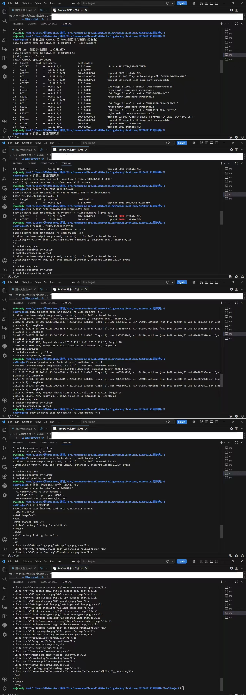
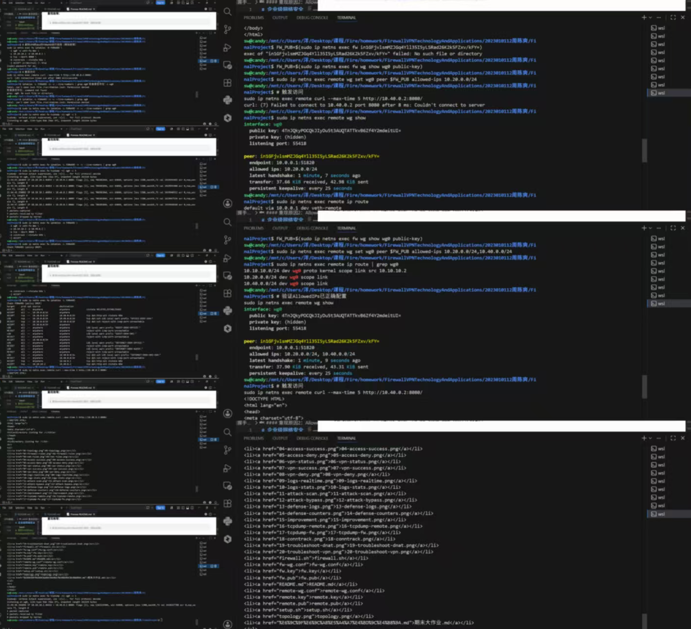

# 故障排查报告

## 概述

本报告记录了在企业级网络安全架构实验中遇到的三个典型故障场景的完整排查过程。每个场景按照"现象 → 重现 → 排查 → 定位 → 修复 → 验证 → 总结"的标准化流程进行记录。

---

## 场景一：DNAT配置了但外网无法访问

### 1.1 现象

- `internet`命名空间访问`203.0.113.1:8080`连接超时
- `iptables -t nat -L`显示DNAT规则已配置
- `dmz`上的HTTP服务正常运行（`python3 -m http.server 8080`）

### 1.2 重现故障

```bash
# 删除DNAT配套的FORWARD放行规则（模拟故障）
sudo ip netns exec fw iptables -D FORWARD \
  -i veth-fw-inet -o veth-fw-dmz \
  -d 10.40.0.2 -p tcp --dport 8080 \
  -m conntrack --ctstate NEW \
  -j ACCEPT

# 确认规则已被删除
sudo ip netns exec fw iptables -L FORWARD -n --line-numbers | grep "veth-fw-inet.*veth-fw-dmz"
# 无输出，规则已删除

# 触发访问
sudo ip netns exec internet curl --max-time 5 http://203.0.113.1:8080/
# curl: (28) Connection timed out after 3003 milliseconds
```

### 1.3 排查过程

| 步骤 | 命令 | 结果 | 结论 |
|:-----|:-----|:-----|:------|
| 1 | `sudo ip netns exec internet curl --max-time 5 http://203.0.113.1:8080/` | `curl: (28) Connection timed out after 3003 milliseconds` | 确认故障可复现 |
| 2 | `sudo ip netns exec fw iptables -t nat -L PREROUTING -n -v --line-numbers` | DNAT规则存在（`DNAT 203.0.113.1:8080 -> 10.40.0.2:8080`） | DNAT配置正确 |
| 3 | `sudo ip netns exec fw iptables -L FORWARD -n -v --line-numbers` | 缺少`-i veth-fw-inet -o veth-fw-dmz -d 10.40.0.2 -p tcp --dport 8080`的ACCEPT规则 | **找到根本原因：FORWARD链缺少DNAT配套放行规则** |
| 4 | `sudo ip netns exec fw tcpdump -ni veth-fw-inet -c 5` | 捕获到`203.0.113.10 -> 203.0.113.1`的SYN包 | 包到达fw入接口 |
| 5 | `sudo ip netns exec fw tcpdump -ni veth-fw-dmz -c 5` | 无任何数据包捕获 | 确认包未转发到dmz接口，在转发链被丢弃 |

### 1.4 抓包验证

**终端A（veth-fw-inet 入接口抓包）：**
```
$ sudo ip netns exec fw tcpdump -ni veth-fw-inet -c 5
tcpdump: verbose output suppressed, use -v[v]... for full protocol decode
listening on veth-fw-inet, link-type EN10MB (Ethernet), snapshot length 262144 bytes
21:09:21.509502 IP 203.0.113.10.38536 > 203.0.113.1.8080: Flags [S], seq 1385336745, ...
21:09:22.526083 IP 203.0.113.10.38536 > 203.0.113.1.8080: Flags [S], seq 1385336745, ...
21:09:23.549778 IP 203.0.113.10.38536 > 203.0.113.1.8080: Flags [S], seq 1385336745, ...
21:09:26.717788 ARP, Request who-has 203.0.113.1 tell 203.0.113.10, length 28
21:09:26.717801 ARP, Reply 203.0.113.1 is-at ea:7d:d2:a9:db:dc, length 28
```

**分析：** veth-fw-inet捕获到来自internet的TCP SYN握手包，目标地址仍为公网IP `203.0.113.1:8080`（DNAT前），说明包已正常到达防火墙入接口。

**终端B（veth-fw-dmz 出接口抓包）：**
```
$ sudo ip netns exec fw tcpdump -ni veth-fw-dmz -c 5
tcpdump: verbose output suppressed, use -v[v]... for full protocol decode
listening on veth-fw-dmz, link-type EN10MB (Ethernet), snapshot length 262144 bytes
（无任何输出，等待超时）
```

**分析：** veth-fw-dmz未捕获到任何数据包，说明DNAT虽完成了地址转换，但转换后的数据包在FORWARD链中未被放行，直接被默认DROP策略丢弃，未能转发到dmz接口。

### 1.5 根本原因

DNAT规则仅修改了数据包的目标地址（`203.0.113.1:8080` → `10.40.0.2:8080`），但数据包仍然需要通过FORWARD链的检查才能被转发到dmz。防火墙FORWARD链默认策略为DROP，且缺少外网到dmz:8080的FORWARD ACCEPT规则，导致DNAT转换后的数据包在FORWARD链被丢弃。

### 1.6 修复方法

```bash
# 添加DNAT配套的FORWARD放行规则
sudo ip netns exec fw iptables -A FORWARD \
  -i veth-fw-inet -o veth-fw-dmz \
  -d 10.40.0.2 -p tcp --dport 8080 \
  -m conntrack --ctstate NEW \
  -j ACCEPT
```

### 1.7 验证修复

```bash
sudo ip netns exec internet curl --max-time 5 http://203.0.113.1:8080/
# 成功返回DMZ的HTML目录列表
```

### 1.8 经验总结

DNAT与FORWARD规则必须配套配置。PREROUTING链的DNAT只做地址转换，转发决策仍在FORWARD链完成。配置DNAT时容易遗漏FORWARD放行规则，排查时应优先检查这两点。通过双接口并行抓包可以快速定位断点：入接口有包但出接口无包，说明包在防火墙内部被丢弃，问题锁定在FORWARD链。

### 1.9 过程截图


---

## 场景二：VPN隧道握手正常但业务访问失败

### 2.1 现象

- `wg show`显示`latest handshake: 4 seconds ago`，隧道握手正常
- `remote ping 10.20.0.2`和`curl http://10.40.0.2:8080/`均超时失败
- `fw`上没有相关日志

### 2.2 可能原因

1. **AllowedIPs配置错误**：remote端的AllowedIPs未包含目标网段
2. **FORWARD规则拒绝VPN流量**：缺少`-i wg0`的ACCEPT规则
3. **dmz没有回程路由**：dmz默认网关未指向fw
4. **fw未开启IP转发**：`net.ipv4.ip_forward=0`

### 2.3 排查方法论

**快速排查顺序（1分钟内定位）：**

| 排查顺序 | 检查项 | 命令 | 判断依据 |
|:---------|:-------|:-----|:---------|
| 1 | **隧道状态** | `sudo ip netns exec remote wg show` | 确认latest handshake正常 |
| 2 | **remote路由表** | `sudo ip netns exec remote ip route \| grep wg0` | 检查目标网段是否有路由指向wg0 |
| 3 | **fw IP转发** | `sudo ip netns exec fw sysctl net.ipv4.ip_forward` | 确认输出为1 |
| 4 | **FORWARD规则** | `sudo ip netns exec fw iptables -L FORWARD -n -v \| grep wg0` | 检查是否有`-i wg0`的ACCEPT规则 |
| 5 | **dmz回程路由** | `sudo ip netns exec dmz ip route \| grep default` | 确认默认路由指向10.40.0.1 |

**关键判断逻辑：**
- 若`ip route`缺少目标网段 → AllowedIPs配置错误
- 若路由存在但FORWARD链无规则 → FORWARD规则缺失
- 若dmz无默认路由 → dmz回程路由问题
- 若ip_forward=0 → 内核转发未开启

---

### 2.4 原因1：FORWARD规则拒绝VPN流量

#### 2.4.1 重现故障

```bash
# 删除VPN到dmz的FORWARD放行规则（模拟故障）
sudo ip netns exec fw iptables -D FORWARD \
  -i wg0 -o veth-fw-dmz \
  -s 10.10.10.2 -d 10.40.0.2 \
  -p tcp --dport 8080 \
  -m conntrack --ctstate NEW \
  -j ACCEPT 2>/dev/null || true

# 触发访问
sudo ip netns exec remote curl --max-time 5 http://10.40.0.2:8080/
# curl: (28) Connection timed out after 5000 milliseconds
```

#### 2.4.2 tcpdump验证

```bash
# 终端A：fw的wg0接口抓包
sudo ip netns exec fw tcpdump -ni wg0 -c 5
# 输出显示：10.10.10.2.46432 > 10.40.0.2.8080: Flags [S], seq ...（SYN包到达VPN接口）

# 终端B：fw的veth-fw-dmz接口抓包
sudo ip netns exec fw tcpdump -ni veth-fw-dmz -c 5
# 无任何输出（包未转发到dmz）
```

**结论：** SYN包已到达wg0接口，但未转发到veth-fw-dmz，说明FORWARD链拦截了VPN流量。

#### 2.4.3 修复方法

```bash
# 添加VPN到dmz:8080的FORWARD放行规则
sudo ip netns exec fw iptables -A FORWARD \
  -i wg0 -o veth-fw-dmz \
  -s 10.10.10.2 -d 10.40.0.2 \
  -p tcp --dport 8080 \
  -m conntrack --ctstate NEW \
  -j ACCEPT
```

#### 2.4.4 验证修复

```bash
# 验证规则已生效
sudo ip netns exec fw iptables -L FORWARD -n -v --line-numbers | grep wg0
#   5    ACCEPT     tcp  --  wg0    veth-fw-dmz   10.10.10.2          10.40.0.2          tcp dpt:8080 ctstate NEW

# 触发访问
sudo ip netns exec remote curl --max-time 5 http://10.40.0.2:8080/
# 成功返回DMZ的HTML目录列表

# 双接口抓包验证数据流恢复正常
sudo ip netns exec fw tcpdump -ni wg0 -c 1
sudo ip netns exec fw tcpdump -ni veth-fw-dmz -c 1
# 两个接口均能抓到SYN包
```

#### 2.4.5 过程截图（图左）


---

### 2.5 原因2：AllowedIPs配置错误

#### 2.5.1 重现故障

```bash
# 将remote的AllowedIPs修改为不包含目标网段（只允许访问office，不含dmz）
FW_PUB=$(sudo ip netns exec fw wg show wg0 public-key)
sudo ip netns exec remote wg set wg0 peer $FW_PUB allowed-ips 10.20.0.0/24

# 触发访问
sudo ip netns exec remote curl --max-time 5 http://10.40.0.2:8080/
# curl: (7) Failed to connect to 10.40.0.2 port 8080 after 1 ms: Couldn't connect to server
```

**注意：** 该错误的特征与原因1不同。AllowedIPs配置错误会导致立即报错（`Couldn't connect to server`），因为本地无路由，数据包根本无法发出；而FORWARD规则缺失则表现为超时（`Connection timed out`），因为数据包能在隧道中传输但无法到达目标。

#### 2.5.2 路由表对比

| 状态 | `ip route`输出 | 说明 |
|:-----|:---------------|:-----|
| 配置正确 | `10.20.0.0/24 dev wg0 ...` + `10.40.0.0/24 dev wg0 ...` | 两个网段都走VPN隧道 |
| 配置错误 | `10.20.0.0/24 dev wg0 ...`（缺少dmz路由） | dmz网段无路由，数据包无法发送 |

#### 2.5.3 修复方法

```bash
FW_PUB=$(sudo ip netns exec fw wg show wg0 public-key)
sudo ip netns exec remote wg set wg0 peer $FW_PUB allowed-ips 10.20.0.0/24,10.40.0.0/24
```

#### 2.5.4 验证修复

```bash
# 验证路由表已恢复
sudo ip netns exec remote ip route | grep wg0
# 10.10.10.0/24 dev wg0 proto kernel scope link src 10.10.10.2
# 10.20.0.0/24 dev wg0 scope link
# 10.40.0.0/24 dev wg0 scope link

# 验证AllowedIPs
sudo ip netns exec remote wg show
# allowed ips显示：10.20.0.0/24, 10.40.0.0/24

# 触发访问
sudo ip netns exec remote curl --max-time 5 http://10.40.0.2:8080/
# 成功返回DMZ的HTML目录列表
```

#### 2.5.5 过程截图（图右）


---

### 2.6 经验总结

VPN隧道握手正常不代表业务可通。控制面（握手）与数据面（业务流量）依赖不同的系统组件：

- **控制面（握手）**：依赖WireGuard配置（Endpoint、密钥、端口）、UDP 51820通信
- **数据面（业务流量）**：依赖路由表、内核IP转发、FORWARD规则、回程路由

排查时应遵循"先检查IP转发、再检查路由表、最后检查FORWARD规则"的标准化流程，避免在一个问题上钻牛角尖而忽略更基础的配置。

---

## 场景三：去掉ESTABLISHED,RELATED后TCP连接失败

### 3.1 现象

- 三次握手的第一个SYN包能通过
- 服务器的SYN-ACK回包被防火墙拦截
- curl命令超时

### 3.2 重现故障

```bash
# 步骤1：查看当前FORWARD规则（确认ESTABLISHED,RELATED规则存在）
sudo ip netns exec fw iptables -L FORWARD -n -v --line-numbers
# 输出显示第1行为：ACCEPT all -- anywhere anywhere ctstate RELATED,ESTABLISHED

# 步骤2：删除ESTABLISHED,RELATED状态检测规则（模拟故障）
sudo ip netns exec fw iptables -D FORWARD \
  -m conntrack --ctstate ESTABLISHED,RELATED \
  -j ACCEPT 2>/dev/null || true

# 步骤3：触发访问，确认故障复现
sudo ip netns exec office curl --max-time 5 http://10.40.0.2:8080/
# curl: (28) Connection timed out after 5002 milliseconds
```

### 3.3 tcpdump证明SYN-ACK被拦截

**三终端同步抓包方案：**

| 终端 | 命令 | 观察目标 |
|:-----|:-----|:---------|
| A | `sudo ip netns exec fw tcpdump -ni veth-fw-office -c 3` | 观察office侧发出的SYN及重传 |
| B | `sudo ip netns exec fw tcpdump -ni veth-fw-dmz -c 1` | 观察dmz侧是否收到SYN |
| C | `sudo ip netns exec office curl --max-time 5 http://10.40.0.2:8080/` | 触发访问 |

**终端B（veth-fw-dmz）输出：**
```
listening on veth-fw-dmz, link-type EN10MB (Ethernet), snapshot length 262144 bytes
22:37:47.366629 IP 10.20.0.2.44898 > 10.40.0.2.8080: Flags [S], seq 3898375516, win 64240, ...
1 packet captured
```
> SYN包成功从office转发到dmz — 说明FORWARD链中`office → dmz:8080`的NEW规则正常放行。

**终端A（veth-fw-office）输出：**
```
listening on veth-fw-office, link-type EN10MB (Ethernet)
22:37:47.366330 IP 10.20.0.2.44898 > 10.40.0.2.8080: Flags [S], seq ...  ← office发出的SYN
22:37:48.381802 IP 10.20.0.2.44898 > 10.40.0.2.8080: Flags [S], seq ...  ← 重传SYN（未收到SYN-ACK）
22:37:49.405768 IP 10.20.0.2.44898 > 10.40.0.2.8080: Flags [S], seq ...  ← 重传SYN（超时重传）
```
> veth-fw-office接口只捕获到出去的SYN和重传包，**完全没有SYN-ACK**。因为dmz回复的SYN-ACK进入FORWARD链后，不匹配任何ACCEPT规则，被默认DROP丢弃。

**补充验证（在dmz侧抓包，证明dmz确实回复了）：**
```bash
sudo ip netns exec dmz tcpdump -c 2 -i any port 8080

# 输出：
# 22:42:51.807428 veth-dmz In  IP 10.20.0.2.47160 > 10.40.0.2.8080: Flags [S]    ← dmz收到SYN
# 22:42:51.807523 veth-dmz Out IP 10.40.0.2.8080 > 10.20.0.2.47160: Flags [S.]   ← dmz回复SYN-ACK
```

> dmz侧同时抓到了入站SYN和出站SYN-ACK，证明dmz确实正常回复了。但fw上的veth-fw-office接口抓不到任何SYN-ACK，说明回包在fw的FORWARD链被DROP，未能转发回office。

### 3.4 对比故障前后数据流

| 阶段 | 数据流 | 故障时 | 正常时 |
|:-----|:-------|:-------|:-------|
| ① | office → dmz (SYN) | 通过  | 通过|
| ② | dmz → office (SYN-ACK) | 被拦截 | 通过  |
| ③ | office → dmz (ACK) | 不会发生 | 通过  |
| 结果 | TCP三次握手 | 失败  | 成功  |

### 3.5 conntrack验证

```bash
sudo ip netns exec fw conntrack -L | grep 10.20.0.2
# 故障时：conntrack v1.4.8 (conntrack-tools): 1 flow entries have been shown.（无匹配记录）
# 正常时：tcp 6 112 TIME_WAIT src=10.20.0.2 dst=10.40.0.2 sport=52984 dport=8080 src=10.40.0.2 dst=10.20.0.2 sport=8080 dport=52984 [ASSURED] mark=0 use=1
```

### 3.6 根本原因分析

当去掉`-m conntrack --ctstate ESTABLISHED,RELATED -j ACCEPT`规则后，数据包的处理流程如下：

1. office发出的SYN包命中`office → dmz:8080`的NEW状态放行规则，成功转发到dmz
2. dmz服务器回复SYN-ACK回包进入FORWARD链
3. 回包属于`ESTABLISHED`状态，但因为没有状态检测放行规则，且不匹配任何NEW规则（SYN-ACK不是新建连接）
4. SYN-ACK包遍历所有规则均未匹配ACCEPT，被默认DROP策略丢弃
5. office收不到SYN-ACK，TCP三次握手无法完成，连接超时

### 3.7 修复方法

```bash
# 恢复ESTABLISHED,RELATED状态检测规则（必须放在FORWARD链最顶部）
sudo ip netns exec fw iptables -I FORWARD 1 \
  -m conntrack --ctstate ESTABLISHED,RELATED \
  -j ACCEPT
```

### 3.8 验证修复

```bash
# 验证TCP连接恢复
sudo ip netns exec office curl --max-time 5 http://10.40.0.2:8080/
# 成功返回网页内容

# 验证conntrack连接跟踪已建立
sudo ip netns exec fw conntrack -L | grep 10.20.0.2
# tcp 6 112 TIME_WAIT src=10.20.0.2 dst=10.40.0.2 sport=52984 dport=8080 ...

# 验证规则位置正确（必须是FORWARD链第1条）
sudo ip netns exec fw iptables -L FORWARD -n -v --line-numbers
# 1    ACCEPT     all  --  *      *       0.0.0.0/0            0.0.0.0/0            ctstate RELATED,ESTABLISHED
```

### 3.9 ESTABLISHED,RELATED的必要性

**为什么ESTABLISHED,RELATED是必须的？**

在无状态防火墙中，需要为**每个方向**分别配置规则。例如office访问dmz:8080，必须同时配置两条规则：

```bash
# 规则A：放行office→dmz的请求
iptables -A FORWARD -s 10.20.0.0/24 -d 10.40.0.0/24 -p tcp --dport 8080 -j ACCEPT

# 规则B：放行dmz→office的回包
iptables -A FORWARD -s 10.40.0.0/24 -d 10.20.0.0/24 -p tcp --sport 8080 -j ACCEPT
```

这在有N个网段时，规则数量呈O(N²)增长，配置复杂且易出错。

**conntrack（连接跟踪）机制解决这个问题：**

```bash
iptables -A FORWARD -m conntrack --ctstate ESTABLISHED,RELATED -j ACCEPT
```

- **ESTABLISHED**：自动放行所有已建立连接的回包。当一个NEW规则放行了SYN，conntrack会记录这条连接，后续的SYN-ACK、ACK等回包自动匹配ESTABLISHED状态通过。
- **RELATED**：放行关联连接（如FTP的数据连接、ICMP差错报文），确保复杂协议也能正常工作。

**去掉ESTABLISHED,RELATED后的影响：**

| 协议 | 场景 | 影响 |
|:-----|:-----|:-----|
| TCP | office访问dmz:8080 | SYN通过 → SYN-ACK被拦截 → 三次握手失败 → curl超时 |
| TCP | 任何双向通信 | 单向可通过，回包全被拦截 |
| UDP/DNS | 内网DNS查询 | 请求发出，响应被拦截，域名解析失败 |
| ICMP | ping测试 | 请求发出，echo reply被拦截，显示100%丢包 |
| FTP | 主动/被动模式 | 数据连接无法建立 |

**结论：** `ESTABLISHED,RELATED`规则是防火墙最基础、最核心的规则。它利用conntrack连接跟踪，让防火墙具备状态感知能力，只需配置单方向的新建连接放行规则，conntrack自动管理回包通行。缺少这条规则，所有需要双向通信的协议都将无法正常工作。该规则必须放在FORWARD链最顶部，确保所有合法回包第一时间匹配通过，不被后续规则错误拦截。

---

## 故障排查总结

### 排查工具使用总结

| 工具 | 适用场景 | 关键命令 |
|:-----|:---------|:---------|
| `iptables -L` | 检查规则是否存在、顺序、计数器 | `-n -v --line-numbers` |
| `tcpdump` | 定位包在哪个环节丢失 | 双接口并行抓包对比 |
| `conntrack -L` | 验证连接跟踪是否建立 | `grep [IP]` |
| `wg show` | 检查VPN隧道状态 | 查看 handshake、allowed ips |
| `ip route` | 检查路由表是否正确 | `grep wg0` |
| `sysctl net.ipv4.ip_forward` | 检查内核转发是否开启 | |

### 标准化排查流程

```
1. 确认故障现象（curl/ping测试）
    ↓
2. 检查基础网络（路由表、IP转发）
    ↓
3. 检查防火墙规则（iptables -L）
    ↓
4. 抓包定位断点（tcpdump双接口）
    ↓
5. 确认根本原因
    ↓
6. 修复并验证
```

### 核心经验

1. **DNAT与FORWARD必须配套**：PREROUTING的DNAT只做地址转换，转发决策由FORWARD链完成
2. **VPN握手不等于业务可通**：控制面与数据面独立，排查需检查路由、转发、IP转发多个环节
3. **状态检测是核心**：ESTABLISHED,RELATED规则必须置顶，缺少它将导致所有双向通信失败
4. **抓包是最直观的定位手段**：通过对比入接口和出接口的抓包结果，可以在数秒内定位断点
