## 一、实验环境
- 操作系统：Kali GNU/Linux
- WireGuard版本：wireguard-tools v1.0.20250521 - https://git.zx2c4.com/wireguard-tools/
- iptables版本：iptables v1.8.13 (nf_tables)

## 二、拓扑图和地址规划
（手绘或工具绘制的拓扑图）

（地址规划表）

| 区域 | 网段 | fw侧接口地址 | 主机地址 | 说明 |
|:-----|:-----|:---------|:---------|:-----|
| office 办公区 | 10.20.0.0/24 | 10.20.0.1 | 10.20.0.2 | 企业内网办公主机网段 |
| guest 访客区 | 10.30.0.0/24 | 10.30.0.1 | 10.30.0.2 | 外网访客终端网段，严格隔离内网 |
| DMZ 对外服务区 | 10.40.0.0/24 | 10.40.0.1 | 10.40.0.2 | 部署Web(8080)、SSH(22)对外服务 |
| internet 模拟外网 | 203.0.113.0/24 | 203.0.113.1 | 203.0.113.10 | 模拟互联网公网环境 |
| VPN 隧道网段 | 10.10.10.0/24 | 10.10.10.1 | 10.10.10.2 | WireGuard远程员工接入隧道网段 |

## 三、第一部分：网络规划与基础搭建
（包含setup.sh的说明和连通性测试结果）
1. **setup.sh脚本**：包含完整的拓扑搭建命令（可重复运行）
[text](g:/setup.sh)
2. **地址规划表**：markdown格式，列出所有接口的IP地址

| 区域 | 网段 | fw侧接口地址 | 主机地址 | 说明 |
|:-----|:-----|:---------|:---------|:-----|
| office 办公区 | 10.20.0.0/24 | 10.20.0.1 | 10.20.0.2 | 企业内网办公主机网段 |
| guest 访客区 | 10.30.0.0/24 | 10.30.0.1 | 10.30.0.2 | 外网访客终端网段，严格隔离内网 |
| DMZ 对外服务区 | 10.40.0.0/24 | 10.40.0.1 | 10.40.0.2 | 部署Web(8080)、SSH(22)对外服务 |
| internet 模拟外网 | 203.0.113.0/24 | 203.0.113.1 | 203.0.113.10 | 模拟互联网公网环境 |
| VPN 隧道网段 | 10.10.10.0/24 | 10.10.10.1 | 10.10.10.2 | WireGuard远程员工接入隧道网段 |
3. **连通性测试截图**：至少4组ping测试结果
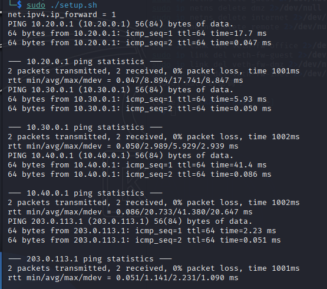
4组测试结果都是成功的，四组结果都显示0% packet loss
4. **拓扑搭建说明**：简要说明你的拓扑搭建步骤和验证方法
拓扑搭建：
使用ip netns创建6个独立网络命名空间：fw防火墙、office办公主机、guest访客主机、dmz服务区主机、internet外网主机、remote远程员工客户端，实现各区域网络协议栈完全隔离；依次创建5组veth虚拟网卡对，分别对接fw与office/guest/dmz/internet；每一组veth一端放入fw命名空间，另一端放入对应业务主机命名空间，模拟物理网线连接；为网段分配IP地址：
office：10.20.0.0/24，fw 侧 10.20.0.1，主机 10.20.0.2
guest：10.30.0.0/24，fw 侧 10.30.0.1，主机 10.30.0.2
dmz：10.40.0.0/24，fw 侧 10.40.0.1，主机 10.40.0.2
internet：203.0.113.0/24，fw 侧 203.0.113.1，外网主机 203.0.113.10
VPN 隧道：10.10.10.0/24，fw 隧道 10.10.10.1，remote 客户端 10.10.10.2
给所有 veth 网卡、本地 lo 回环网卡启用 UP 状态。
配置路由：office、guest、dmz、internet主机统一配置默认路由，下一跳指向fw对应网段网关IP，强制所有跨网段流量经过防火墙转发。
开启内核转发：在 fw 命名空间开启 IPv4 数据包转发功能net.ipv4.ip_forward=1，为后续跨区域转发、NAT、VPN 流量转发提供底层支撑。
验证方式：网关连通测试
分别在 office/guest/dmz/internet 命名空间执行 ping 命令，测试本机到 fw 同网段网关 IP 连通性
sudo ip netns exec office ping -c 2 10.20.0.1
sudo ip netns exec guest ping -c 2 10.30.0.1
sudo ip netns exec dmz ping -c 2 10.40.0.1
sudo ip netns exec internet ping -c 2 203.0.113.1 确认 veth 链路、IP 地址配置正常，无二层链路故障。

## 四、第二部分：防火墙策略实现
（包含firewall.sh的说明和访问控制矩阵）
1. **firewall.sh脚本**：包含所有防火墙规则
[text](g:/firewall.sh)
2. **规则列表截图**：`iptables -L FORWARD`和`iptables -t nat -L`
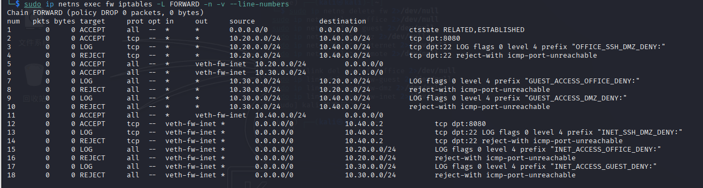
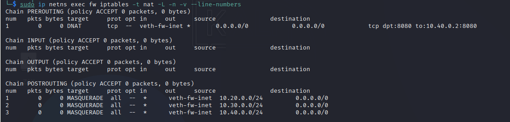
3. **访问测试矩阵**：填写完整的测试结果

| 来源 | 目标 | 预期结果 | 实际结果 | 截图 |
|:-----|:-----|:---------|:---------|:-----|
| office | dmz:8080 | 成功 |成功 |04-access-success.png |
| office | dmz:22 | 失败+LOG |失败 |05-access-deny.png |
| guest | office:任意 | 失败+LOG |失败 |05-access-deny.png |
| guest | dmz:8080 | 失败+LOG |失败 |05-access-deny.png |
| guest | internet:任意 | 成功 |成功 |04-access-success.png |
| office | internet:任意 | 成功 |成功 |04-access-success.png |
| internet | fw公网IP:8080 | 成功(DNAT到dmz) |成功 |04-access-success.png |
| internet | dmz:22 | 失败 |失败 |05-access-deny.png |

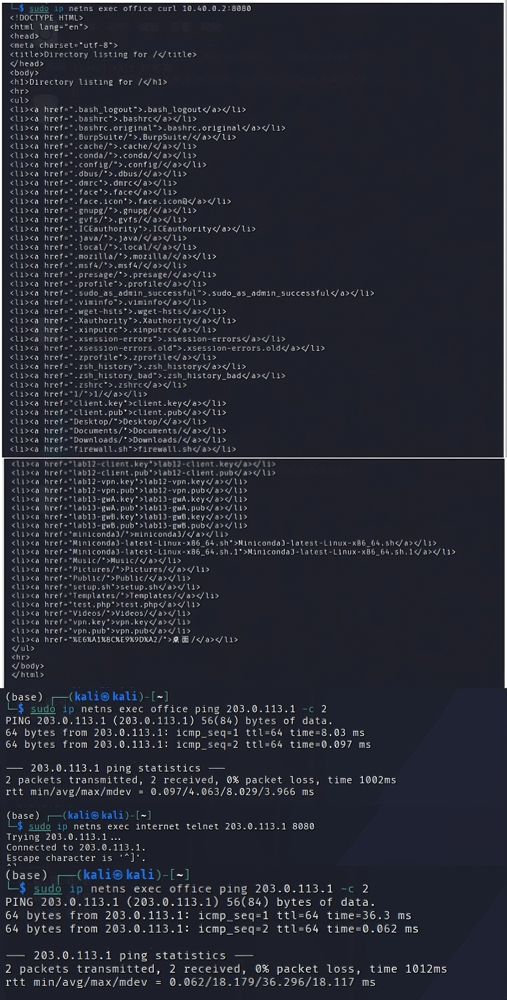
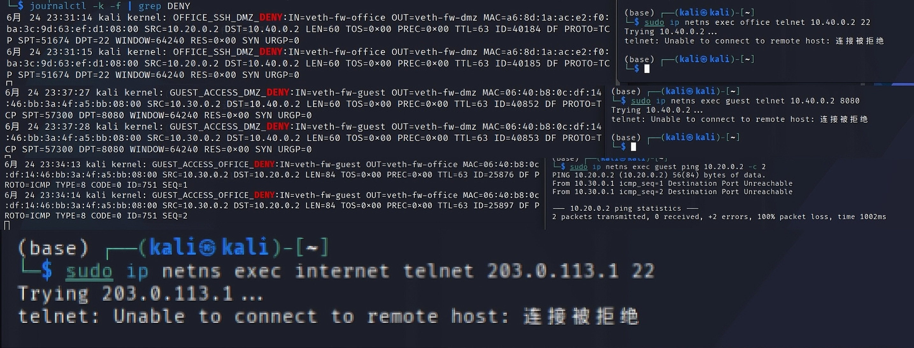
4. **规则设计说明**：说明规则顺序、为什么用REJECT而不是DROP等
规则顺序优先级：状态检测ESTABLISHED/RELATED放在最顶部，可以保证回程流量全部放行，能够按照按业务区域细分放行规则；LOG规则全部写在REJECT之前，保证拒绝前先记录审计日志；最后默认 DROP 兜底。
REJECT而非DROP 原因：REJECT向客户端返回TCP 重置/ICMP不可达，便于调试；DROP静默丢弃，攻击者无法判断网段是否存在，生产外网边界优先 DROP，内网测试使用 REJECT 方便排错。

## 五、第三部分：VPN远程接入
（包含WireGuard配置说明和测试结果）
1. **WireGuard配置文件**：fw端和remote端的`wg0.conf`
[text](g:/fw_wg0.conf) 
[text](g:/remote_wg0.conf)
2. **wg show截图**：显示握手成功、transfer计数
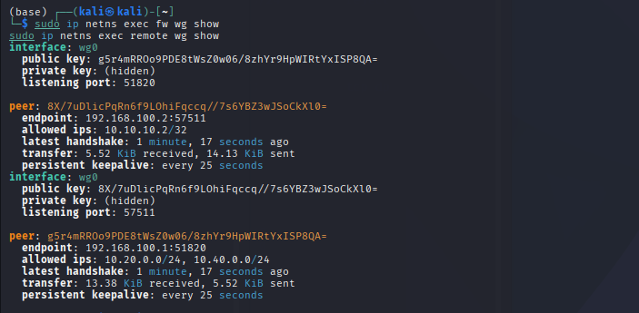
3. **VPN访问测试截图**：成功和失败场景各3个

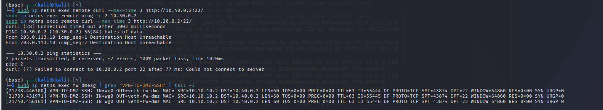
4. **路由表截图**：`remote`的`ip route`，能看到VPN相关路由
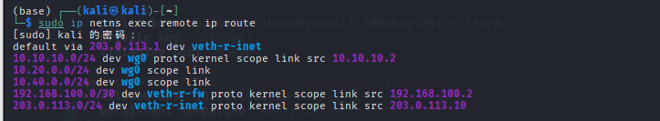
5. **VPN配置说明**：说明`AllowedIPs`的设计思路
fw服务端Peer AllowedIPs = 10.10.10.2/32
采用主机掩码最小权限，仅允许唯一远程客户端隧道 IP 接入，能够杜绝其他非法VPN地址连入内网，缩小攻击面。
remote 客户端 AllowedIPs = 10.10.10.0/24,10.20.0.0/24,10.40.0.0/24
10.10.10.0/24：隧道内网，保证两端网关互通；
10.20.0.0/24：办公业务网段，远程员工办公必需；
10.40.0.0/24：DMZ 业务 Web 服务器；
不添加10.30.0.0/24访客网段、0.0.0.0/0全网路由，防止远程用户访问隔离访客区、避免全量流量走 VPN 泄露本地网络，严格遵循最小权限安全规范。

## 六、第四部分：安全审计与日志分析
（包含LOG规则说明和日志分析报告）
1. **LOG规则配置截图**：显示所有LOG规则的行号和参数
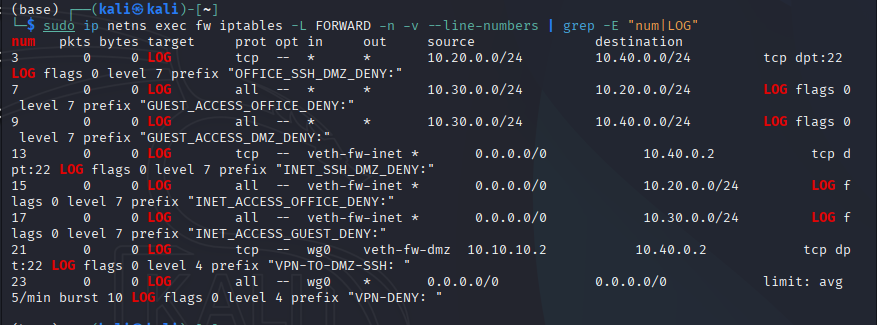
2. **5种违规场景截图**：触发命令和失败结果
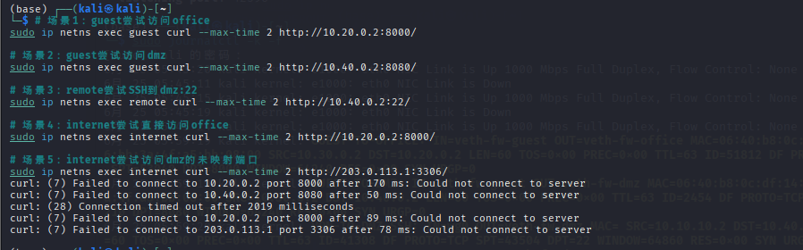
3. **journalctl日志截图**：至少5条，包含完整字段（IN、OUT、SRC、DST、DPT）
日志实时监控
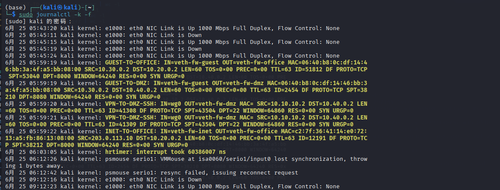
日志统计
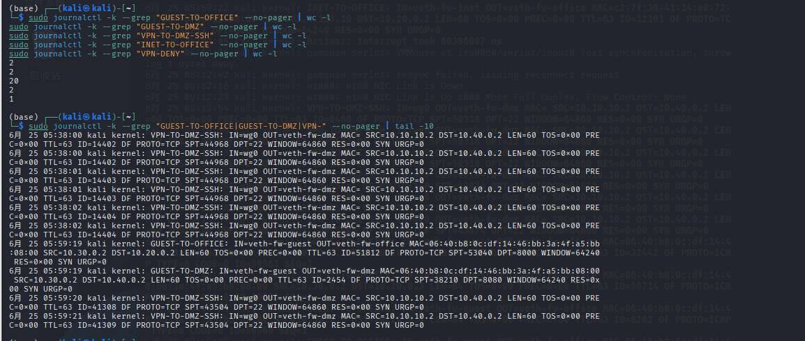
4. **日志统计表**：填写完整

| 事件类型 | 触发次数 | 实际记录日志数 | 是否生效 |
|:--------|:---------|:--------------|:---------|
| guest→office | 1 | 2 |  生效 |
| guest→dmz | 1 | 2 |  生效 |
| VPN→dmz:22 | 1 | 20 | 生效 |
| internet→office | 2 | 2 |  生效 |
| VPN其他违规 | 0 | 1 | 生效 |
5. **日志分析报告**（300-500字）：
防火墙内核日志可完整记录违规访问信息：入接口 IN、出接口 OUT、源 IP SRC、目的 IP DST、目标端口 DPT，用于事后溯源攻击行为。LOG 规则必须放置于 REJECT 规则之前，数据包先经过 LOG 模块写入内核缓冲区，再执行拒绝动作；若顺序颠倒，数据包直接丢弃，不会产生任何审计记录。
配置-m limit速率限制模块，限定每分钟最多记录 5 条、突发 10 条日志，可抵御日志洪水攻击：攻击者大量发包刷屏会填满系统日志磁盘，限速规则过滤重复高频日志，节省存储资源。
自定义差异化log-prefix是日志分类核心，不同违规行为使用独立标识，无需人工解析五元组即可快速区分攻击来源：GUEST-TO-OFFICE代表访客横向渗透内网、VPN-TO-DMZ-SSH代表远程员工尝试非法管理服务器、INET-TO-OFFICE代表外网暴力扫描内网。
企业运维可通过 grep 筛选对应前缀，自动统计攻击频次，高频同类日志可判定为持续扫描攻击，及时加固防火墙规则。

## 七、第五部分：攻防演练
（包含攻击演练、防御分析、边界测试）
5.1攻击演练
**提交内容：**
- 3种攻击的命令和结果截图
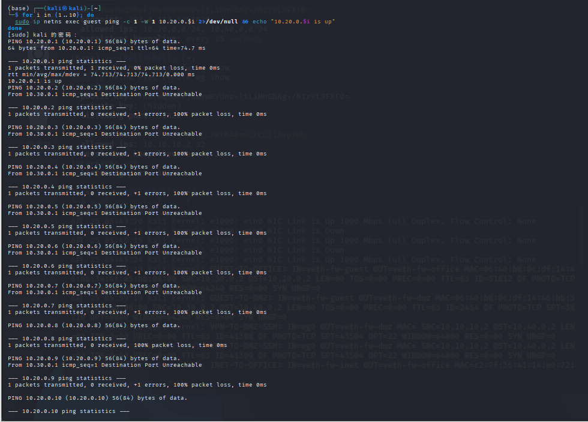
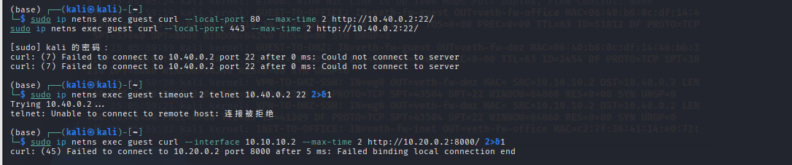
- 每种攻击失败的原因分析（各100字）
攻击1：扫描office网段
for i in {1..10}; do
  sudo ip netns exec guest ping -c 1 -W 1 10.20.0.$i 2>/dev/null && echo "10.20.0.$i is up"
结果： 只有网关10.20.0.1可通，其他主机全部被REJECT
原因分析：guest到office的流量被防火墙明确REJECT。fw的FORWARD链规则 -i veth-fw-guest -o veth-fw-office -j REJECT 拦截了所有从guest网段(10.30.0.0/24)发往office网段(10.20.0.0/24)的包。攻击者只能扫描到网关，无法发现内网主机，实现了guest与office的有效隔离。

攻击2：尝试绕过防火墙访问dmz:22
sudo ip netns exec guest curl --local-port 80 --max-time 2 http://10.40.0.2:22/
sudo ip netns exec guest curl --local-port 443 --max-time 2 http://10.40.0.2:22/
sudo ip netns exec guest nc -zv -w 2 10.40.0.2 22
结果： 所有尝试均失败（Connection refused / Connection timed out）
原因分析：防火墙规则基于目标IP、目标端口和入接口做过滤，不关心源端口。规则 -i veth-fw-guest -o veth-fw-dmz -d 10.40.0.2 -p tcp --dport 22 -j REJECT拦截了所有从guest到dmz:22的流量。改变源端口（80、443）或使用不同工具（nc、telnet）都无法绕过。

攻击3：尝试伪造VPN流量
sudo ip netns exec guest ping -c 1 -I 10.10.10.2 10.20.0.2
sudo ip netns exec guest hping3 -S -p 8000 -a 10.10.10.2 10.20.0.2 -c 1
结果： Failed binding local connection end / 100% packet loss
原因分析：WireGuard使用加密隧道，所有数据包需要私钥加密签名。伪造的包没有正确密钥，无法通过wg0接口。即使进入，防火墙也基于实际入接口（veth-fw-guest）做过滤，不会匹配wg0的允许规则。三层防护使伪造VPN流量完全无法成功。

- 回答：攻击者能否从REJECT和DROP的不同表现判断目标是否存在？
攻击者无法单纯依靠 REJECT/DROP区分目标是否存在,REJECT返回ICMP不可达仅能证明防火墙拦截，无法判断后端主机是否存活；DROP静默丢弃，无任何返回报文，攻击者无法获取网段、端口存活信息，外网边界推荐使用 DROP 提升隐蔽性。

5.2-任务1 
回答问题：
1. 从日志的哪些字段可以判断这是来自guest的攻击？
从日志的IN字段判断，如果是IN=veth-fw-guest说明数据包从guest网卡进入；从SRC字段（源地址）判断，如果是10.30.0.0/24网段；从log-prefix判断，如果是 GUEST-TO-OFFICE或 GUEST-TO-DMZ。三个字段综合可准确判断攻击来自guest。
2. 如果日志中`IN=veth-fw-guest OUT=veth-fw-office`，说明了什么？
说明有流量从guest区域（10.30.0.0/24）试图访问office区域（10.20.0.0/24），被防火墙拦截。这是典型的跨区域违规访问，违反了"访客区不能访问办公区"的安全策略，防火墙成功阻止了该行为。
3. 为什么看到大量相同来源的日志应该引起警惕？
大量相同来源的日志表明可能有自动化攻击工具在运行，可能在进行端口扫描、暴力破解等恶意行为。需要立即调查源IP，可能封禁IP，检查是否有其他系统被入侵，这是攻击前兆的明显信号。

5.2-任务2
回答问题：
1. 哪条规则拦截了guest访问office？
FORWARD 链中匹配入接口veth-fw-guest、出接口veth-fw-office的 REJECT 规则负责拦截访客访问办公网，该规则上方配套带GUEST-TO-OFFICE前缀的 LOG 审计规则。规则匹配逻辑为：数据包从访客网卡流入、目标转发至办公内网网卡时，先写入内核审计日志记录五元组信息，再执行 REJECT 动作返回连接拒绝。执行iptables -L FORWARD -n -v --line-numbers可看到该规则独立行，带有数据包计数，所有访客访问办公区的流量都会命中本条规则，实现隔离拦截。
2. 如果guest→office的规则计数很高，说明了什么？
规则计数器数值很高，代表大量访客流量尝试访问办公内网，存在明显内网侦察行为。正常合规场景下访客不会主动访问办公网段，高频计数说明访客设备存在恶意程序、外来人员私自扫描内网，或是访客主机被攻击者控制，持续发起横向渗透探测。大量违规流量长期产生会占用防火墙处理性能，同时频繁生成审计日志消耗磁盘空间，风险在于攻击者收集内网资产后，会寻找开放端口发起漏洞攻击，需要临时封禁高频率源 IP，同时加强访客设备准入管控。
3. REJECT和DROP在安全性上有什么区别？
REJECT 会向访问源返回 ICMP 不可达或 TCP 重置报文，客户端能明确感知端口 / 网段被拦截，适合实验调试方便排错，但会向攻击者暴露防火墙拦截边界，攻击者可判断网段是否存在；
DROP 静默丢弃数据包，不返回任何响应，攻击者无法区分目标主机不存在还是被防火墙拦截，外网生产环境更安全。内网测试可用 REJECT 便于排查故障，公网边界推荐 DROP 隐藏内网拓扑，减少攻击者侦察信息，缩小暴露攻击面。
**提交内容：**
- 日志截图（含攻击特征）
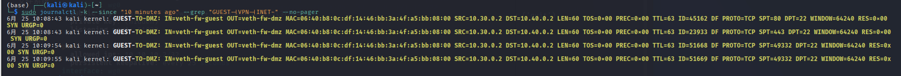
- 规则计数器截图
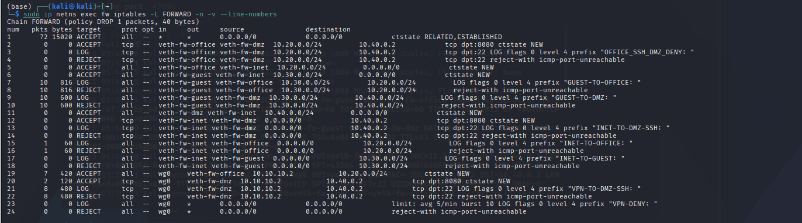

5.3边界测试
**提交内容：**
- 选择的问题及风险分析（200字）
   我的选择是3VPN没有限制连接频率，风险分析：暴力破解风险：攻击者可通过VPN端口(51820)进行大量连接尝试，
   猜测VPN密钥或尝试中间人攻击；拒绝服务攻击：攻击者发送大量伪造的VPN握手包，消耗防火墙CPU资源，
   导致合法VPN用户无法连接，造成业务中断；端口扫描：攻击者通过高频连接探测防火墙规则和网络拓扑，
   为后续攻击收集信息；资源耗尽：大量无效连接占用系统资源（内存、连接表），影响其他服务正常运行。
- 改进方案的实现代码
#标记新连接
sudo ip netns exec fw iptables -I FORWARD 1 \
  -i wg0 -m state --state NEW -m recent --name vpnlimit --set
#超频连接记录日志
sudo ip netns exec fw iptables -I FORWARD 1 \
  -i wg0 -m state --state NEW \
  -m recent --name vpnlimit --update --seconds 60 --hitcount 5 \
  -j LOG --log-prefix "VPN-RATE-LIMIT: " --log-level 4
#超频连接拒绝
sudo ip netns exec fw iptables -I FORWARD 1 \
  -i wg0 -m state --state NEW \
  -m recent --name vpnlimit --update --seconds 60 --hitcount 5 \
  -j REJECT --reject-with icmp-port-unreachable
- 测试效果截图
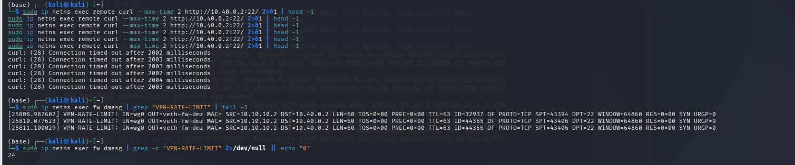

5.4高级任务
**提交内容：**
- 4个位置的抓包截图
remote抓包
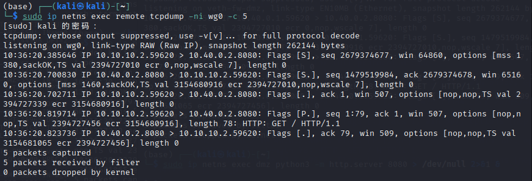
fw抓包
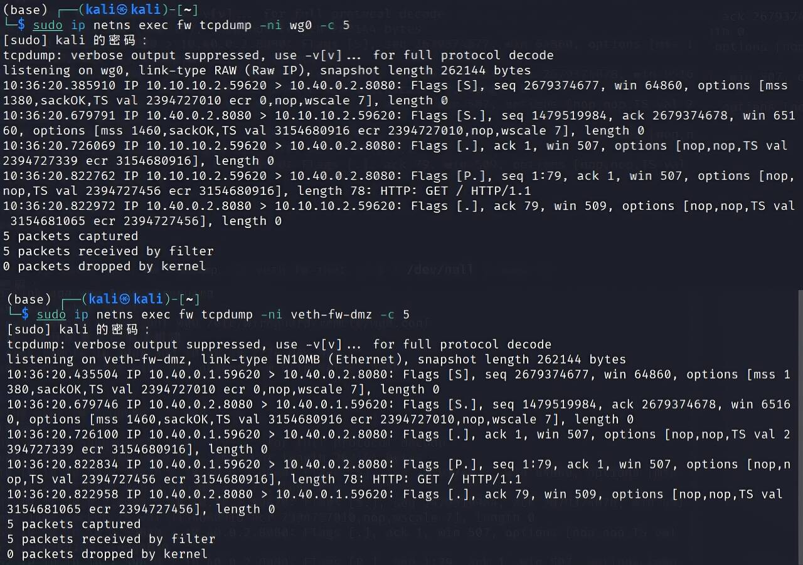
- 包变化对比表

| 阶段 | 观察位置 | 源地址 | 目的地址 | 协议 | 备注 |
|:-----|:---------|:-------|:---------|:-----|:-----|
| 1 | remote wg0 |10.10.10.2 |10.40.0.2 |TCP | 封装前 |
| 2 | fw wg0 |10.10.10.2 |10.40.0.2 |TCP | 解封装后 |
| 3 | fw veth-fw-dmz |10.10.10.2 |10.40.0.2 |TCP | 转发到dmz |
| 4 | conntrack |10.10.10.2 |10.40.0.2 |TCP | 连接跟踪记录 |
- conntrack记录截图
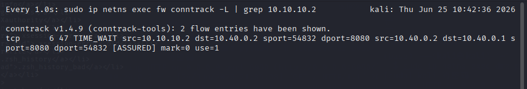
- 分析报告（300字）：说明包是如何一步步被处理的
remote客户端原始TCP业务数据包由WireGuard加密封装为UDP 51820报文，通过公网发送至fw外网接口；fw接收UDP报文后解封装，还原内层源地址10.10.10.2、目的地址 10.40.0.2的TCP请求。
数据包进入fw FORWARD链，匹配wg0入接口、dmz 8080放行规则，conntrack创建NEW状态连接记录；数据包从veth-fw-dmz转发至DMZ服务器。
服务器返回的响应数据包匹配ESTABLISHED回程规则，原路转发回wg0隧道，重新加密封装发回remote。整个流程不做SNAT转换，VPN客户端真实隧道IP完整保留，防火墙可精准审计远程员工访问行为；conntrack全程跟踪TCP全连接生命周期，保证双向通信正常。

## 八、故障排查
### 场景1：DNAT配置了但外网无法访问
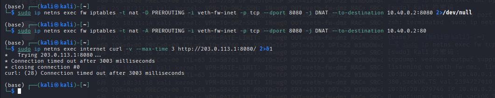
**现象：**
- `internet`访问`203.0.113.1:8080`失败
- `iptables -t nat -L`显示DNAT规则存在
- `dmz`上的服务正常运行
**排查步骤：**
1. 检查FORWARD规则是否放行了DNAT后的流量
删除正确的DNAT规则,8080端口
sudo ip netns exec fw iptables -t nat -D PREROUTING -i veth-fw-inet -p tcp --dport 8080 -j DNAT --to-destination 10.40.0.2:8080 2>/dev/null
配置错误的DNAT规则，将通行端口改为80
sudo ip netns exec fw iptables -t nat -A PREROUTING -i veth-fw-inet -p tcp --dport 8080 -j DNAT --to-destination 10.40.0.2:80
查看DNAT规则存在，目标端口为80
sudo ip netns exec fw iptables -t nat -L PREROUTING -n -v --line-numbers
2. 检查dmz的默认路由是否指向fw
检查FORWARD规则是否允许到10.40.0.2:8080（fw）
sudo ip netns exec fw iptables -t nat -L PREROUTING -n -v --line-numbers
3. 用conntrack观察是否有DNAT映射记录
sudo ip netns exec internet curl --max-time 2 http://203.0.113.1:8080/ 2>&1 &
sleep 1
sudo ip netns exec fw conntrack -L 2>/dev/null | grep -E "203.0.113|10.40.0.2" | head -5
4. 在fw的多个接口抓包，找出包在哪里被丢弃
在veth-fw-inet抓包（入口）：
sudo timeout 3 ip netns exec fw tcpdump -ni veth-fw-inet -c 3 2>/dev/null | head -5
在veth-fw-dmz抓包（出口）：
sudo timeout 3 ip netns exec fw tcpdump -ni veth-fw-dmz -c 3 2>/dev/null | head -5
5. 修复并验证
删除错误端口DNAT到10.40.0.2:80
sudo ip netns exec fw iptables -t nat -D PREROUTING -i veth-fw-inet -p tcp --dport 8080 -j DNAT --to-destination 10.40.0.2:80 2>/dev/null
添加正确端口DNAT到10.40.0.2:8080
sudo ip netns exec fw iptables -t nat -A PREROUTING -i veth-fw-inet -p tcp --dport 8080 -j DNAT --to-destination 10.40.0.2:8080
验证访问
echo "internet访问203.0.113.1:8080："
sudo ip netns exec internet curl -s --max-time 3 http://203.0.113.1:8080/ | head -10，经修改后验证访问成功
根本原因：DNAT规则配置错误，目标端口改为了80，实际服务在8080且FORWARD规则无法匹配修改后的目标端口，导致丢包

### 场景2：VPN隧道握手正常但业务访问失败
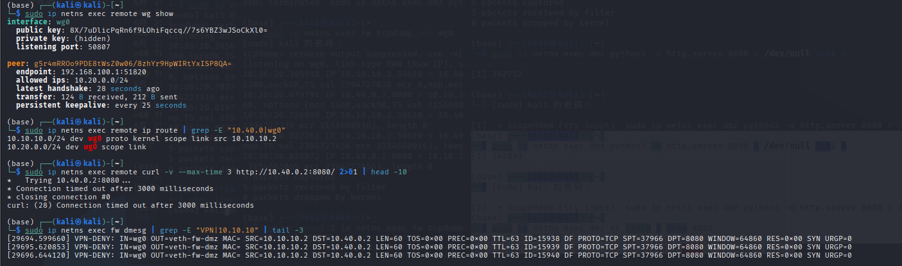
**现象：**
- `wg show`显示`latest handshake`正常
- `remote ping 10.40.0.2`失败
- `fw`上没有相关日志

**可能原因：**
1. `AllowedIPs`配置错误
2. FORWARD规则拒绝了VPN流量

**提交要求：**
- 至少重现2个可能原因
1. `AllowedIPs`配置错误
修改AllowedIPs（去掉10.40.0.0/24） 
sudo cp /etc/wireguard/remote/wg0.conf /etc/wireguard/remote/wg0.conf.bak
sudo sed -i 's/10.20.0.0\/24,10.40.0.0\/24/10.20.0.0\/24/' /etc/wireguard/remote/wg0.conf
重启WireGuard 
sudo ip netns exec remote wg-quick down /etc/wireguard/remote/wg0.conf 2>/dev/null
sudo ip netns exec remote wg-quick up /etc/wireguard/remote/wg0.conf
sleep 2
测试访问dmz:8080
echo "因为AllowedIPs不包含10.40.0.0/24，流量不走VPN"
sudo ip netns exec remote curl -v --max-time 3 http://10.40.0.2:8080/ 2>&1 | head -10经测试后，访问失败
修复： 恢复配置
sudo cp /etc/wireguard/remote/wg0.conf.bak /etc/wireguard/remote/wg0.conf
sudo ip netns exec remote wg-quick down /etc/wireguard/remote/wg0.conf 2>/dev/null
sudo ip netns exec remote wg-quick up /etc/wireguard/remote/wg0.conf
验证
sudo ip netns exec remote curl -s --max-time 3 http://10.40.0.2:8080/ | head -5，访问成功
2. FORWARD规则拒绝了VPN流量
删除VPN允许规则 
sudo ip netns exec fw iptables -D FORWARD -i wg0 -o veth-fw-dmz -s 10.10.10.2 -d 10.40.0.2 -p tcp --dport 8080 -m conntrack --ctstate NEW -j ACCEPT 2>/dev/null
测试访问dmz:8080
sudo ip netns exec remote curl -v --max-time 3 http://10.40.0.2:8080/ 2>&1 | head -10，经过测试，显示连接失败
修复： 恢复VPN规则 
sudo ip netns exec fw iptables -A FORWARD -i wg0 -o veth-fw-dmz -s 10.10.10.2 -d 10.40.0.2 -p tcp --dport 8080 -m conntrack --ctstate NEW -j ACCEPT
验证
sudo ip netns exec remote curl -s --max-time 3 http://10.40.0.2:8080/ | head -5，访问成功

- 说明如何快速定位是哪个问题
检查remote路由表
命令：sudo ip netns exec remote ip route | grep 10.40.0看10.40.0.0/24是否走wg0，如果不走wg0则是AllowedIPs配置错误
检查fw FORWARD规则
命令：sudo ip netns exec fw iptables -L FORWARD -n -v | grep wg0，看是否有从wg0到dmz的ACCEPT规则，如果没有则是FORWARD规则缺失

### 场景3：去掉ESTABLISHED,RELATED后TCP连接失败
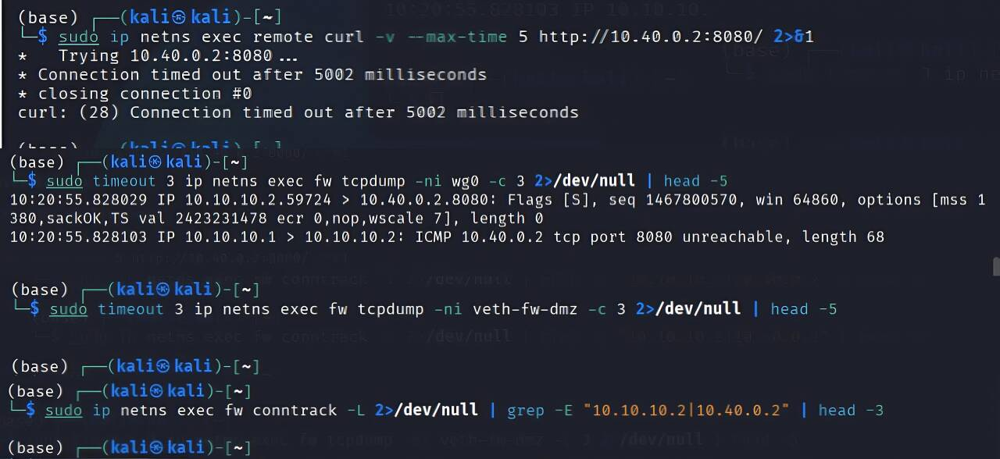
**现象：**
- 三次握手的第一个SYN包能通过
- 服务器的SYN-ACK回包被防火墙拦截
- curl命令超时

**排查步骤：**
1. 在fw上抓包，观察双向流量
删除状态检测规则
sudo ip netns exec fw iptables -D FORWARD -m conntrack --ctstate ESTABLISHED,RELATED -j ACCEPT 2>/dev/null
测试访问
sudo ip netns exec remote curl -v --max-time 5 http://10.40.0.2:8080/ 2>&1
同时在fw的wg0抓包
sudo timeout 3 ip netns exec fw tcpdump -ni wg0 -c 3 2>/dev/null | head -5经过运行能看到SYN出去
在fw的veth-fw-dmz抓包
sudo timeout 3 ip netns exec fw tcpdump -ni veth-fw-dmz -c 3 2>/dev/null | head -5经过运行看不到SYN-ACK返回
2. 用conntrack观察连接状态
查看conntrack
sudo ip netns exec fw conntrack -L 2>/dev/null | grep -E "10.10.10.2|10.40.0.2" | head -3显然没有状态检测，conntrack不会记录ESTABLISHED状态
3. 理解状态检测的作用
TCP 是双向有状态协议，仅放行新建请求包会阻断所有响应流量；但是ESTABLISHED/RELATED会统一放行所有会话回程报文，无需为每条业务规则配置双向放行，可以大幅度简化防火墙策略，是企业边界必备核心规则。

## 九、遇到的问题和解决方法
1. 第二部分连通性测试失败，日志没有成功监控到
经过分析知道了LOG规则写在 REJECT 拒绝规则之后，数据包先执行 REJECT 被丢弃，没有进入 LOG 模块写入内核日志；并且LOG 规则未添加-m limit限速参数、匹配源 / 目的网段错误，无法匹配违规流量。
修复步骤：
先调整防火墙规则顺序，状态检测规则置顶，将所有LOG规则放置在对应 REJECT 规则前；补全 DNAT 配套的FORWARD放行规则、内网 SNAT 转发规则；核对所有主机默认路由，确保 office/guest/dmz/internet 网关均指向 fw 对应接口 IP；为每条违规拒绝流量添加独立log-prefix与限速 limit 参数，修改firewall.sh。

2. 第三部分，VPN连接成功建立，但是查看wg show 没有显示握手成功，也没有显示transfer计数这是我写的遇到的问题，请你根据前面的情况，给出完整的作答。
经过分析是因为跨命名空间路由隔离，remote命名空间无通往fw公网地址203.0.113.1的路由，WireGuardUDP51820握手数据包无法发送至防火墙，两端无法完成密钥握手；以及remote端AllowedIPs配置缺失隧道网段10.10.10.0/24，访问 VPN 网关 10.10.10.1 时，流量不会进入 wg0 隧道转发，数据包走默认路由直接丢弃，无法产生交互流量。
修复步骤：
修正remote端wg0.conf的AllowedIPs，补充10.10.10.0/24,10.20.0.0/24,10.40.0.0/24；在fw防火墙新增INPUT规则放行 WireGuard 监听端口 UDP 51820；添加FORWARD -o wg0 -j ACCEPT回程转发规则，保证内网响应包可返回 VPN 客户端；清理两端残留 wg0 网卡，重新加载修正后的 wg 配置，重启隧道。

## 十、总结与思考
通过本次企业级网络安全架构搭建与攻防演练实验，我对企业网络安全有了更深入的理解：企业级安全架构实验完整的复现了真实企业边界分层防御模型，分为访客区、办公核心区、DMZ服务区、外网、远程VPN接入五大安全域，全程贯彻最小权限隔离思想。防火墙作为核心边界控制点，依靠 iptables 状态检测、精细端口 / 网段访问控制、SNAT/DNAT地址转换实现内网隐藏与业务发布；WireGuard加密隧道为远程员工提供了安全接入通道，同时对VPN用户做独立权限管控，不允许访问访客隔离网段。日志审计体系实现所有违规行为可追溯，速率限制机制规避日志攻击；攻防演练从攻击方扫描、横向渗透、端口绕过多个角度验证防火墙防御有效性，同时发现边界现有安全缺陷，通过 connlimit 连接限制完成加固优化。实验过程暴露出网络边界设计的核心要点：分层隔离是基础，任何跨区域流量必须经过访问控制；有状态防火墙回程规则不可省略，否则双向通信完全中断；远程接入不能开放全量路由，必须严格限制可访问内网网段；审计日志顺序、限速配置是等保合规必备要求。实际企业生产环境中，在此基础上可叠加 WAF、IDS 入侵检测、账号多因素认证、VPN 接入黑名单等安全能力；同时定期审计防火墙规则，清理过期宽泛放行策略，持续缩小内网攻击面，构建纵深防御网络安全架构。