# 企业级网络安全架构搭建与攻防演练

## 一、实验环境
- 操作系统：Ubuntu 24.04.4 LTS
- WireGuard版本：v1.0.20210914
- iptables版本：v1.8.10 (nf_tables)

## 二、拓扑图和地址规划

#  地址规划表
| 区域命名空间 | 网卡名称        | IP地址/掩码     | 角色说明         |
|------------|----------------|----------------|----------------|
| fw（防火墙） | veth-fw-office | 10.20.0.1/24   | office网关     |
| office     | veth-office    | 10.20.0.2/24   | 办公网主机     |
| fw         | veth-fw-guest  | 10.30.0.1/24   | guest网关      |
| guest      | veth-guest     | 10.30.0.2/24   | 访客网主机     |
| fw         | veth-fw-dmz    | 10.40.0.1/24   | DMZ网关        |
| dmz        | veth-dmz       | 10.40.0.2/24   | DMZ服务器      |
| fw         | veth-fw-inet   | 203.0.113.1/24 | 外网网关       |
| internet   | veth-inet      | 203.0.113.10/24| 模拟外网主机   |
| fw         | veth-fw-vpn    | 10.10.10.1/24  | VPN网关        |
| vpn        | veth-vpn       | 10.10.10.2/24  | VPN客户端主机  |

## 三、第一部分：网络规划与基础搭建
（包含setup.sh的说明和连通性测试结果）
### 提交内容

1. **setup.sh脚本**：包含完整的拓扑搭建命令（可重复运行）

2. **地址规划表**：markdown格式，列出所有接口的IP地址
## 2. 地址规划表
| 区域命名空间 | 网卡名称        | IP地址/掩码     | 角色说明         |
|------------|----------------|----------------|----------------|
| fw（防火墙） | veth-fw-office | 10.20.0.1/24   | office网关     |
| office     | veth-office    | 10.20.0.2/24   | 办公网主机     |
| fw         | veth-fw-guest  | 10.30.0.1/24   | guest网关      |
| guest      | veth-guest     | 10.30.0.2/24   | 访客网主机     |
| fw         | veth-fw-dmz    | 10.40.0.1/24   | DMZ网关        |
| dmz        | veth-dmz       | 10.40.0.2/24   | DMZ服务器      |
| fw         | veth-fw-inet   | 203.0.113.1/24 | 外网网关       |
| internet   | veth-inet      | 203.0.113.10/24| 模拟外网主机   |
| fw         | veth-fw-vpn    | 10.10.10.1/24  | VPN网关        |
| vpn        | veth-vpn       | 10.10.10.2/24  | VPN客户端主机  |

3. **连通性测试截图**：至少4组ping测试结果
 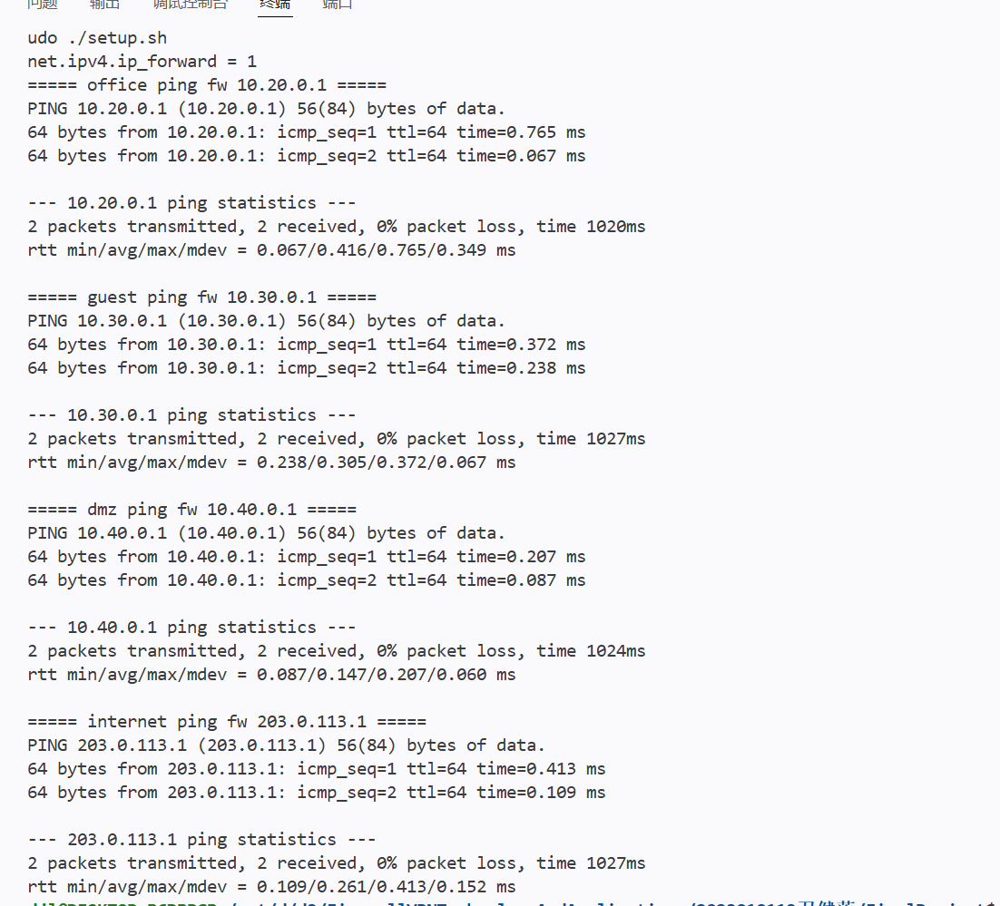

4. **拓扑搭建说明**：简要说明你的拓扑搭建步骤和验证方法
 答：本次拓扑搭建先执行脚本清理旧网卡与命名空间环境，依次创建fw、office、guest、dmz、internet、vpn六个网络命名空间，再生成五组veth虚拟链路并分别移入对应命名空间，为所有网卡分配规划网段IP并启用接口，给各业务主机配置指向防火墙的默认路由，在fw命名空间开启IPv4数据包转发；验证时先查看命名空间、网卡、IP配置是否完整，再分别用office、guest、dmz、internet主机ping对应防火墙网关，四组连通测试全部通，证明二层链路、三层路由与转发功能正常。

## 四、第二部分：防火墙策略实现
（包含firewall.sh的说明和访问控制矩阵）
### 提交内容

1. **firewall.sh脚本**：包含所有防火墙规则

2. **规则列表截图**：`iptables -L FORWARD`和`iptables -t nat -L`
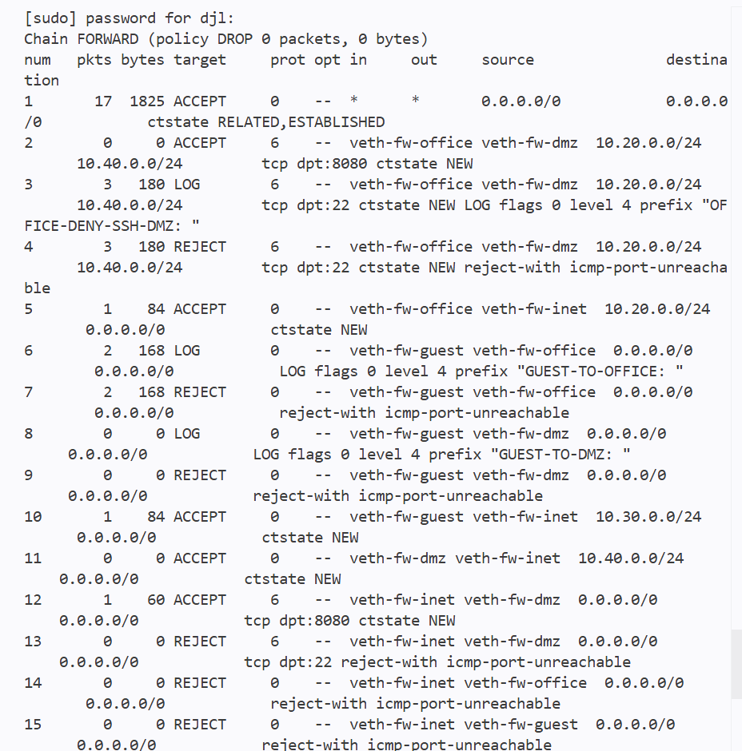
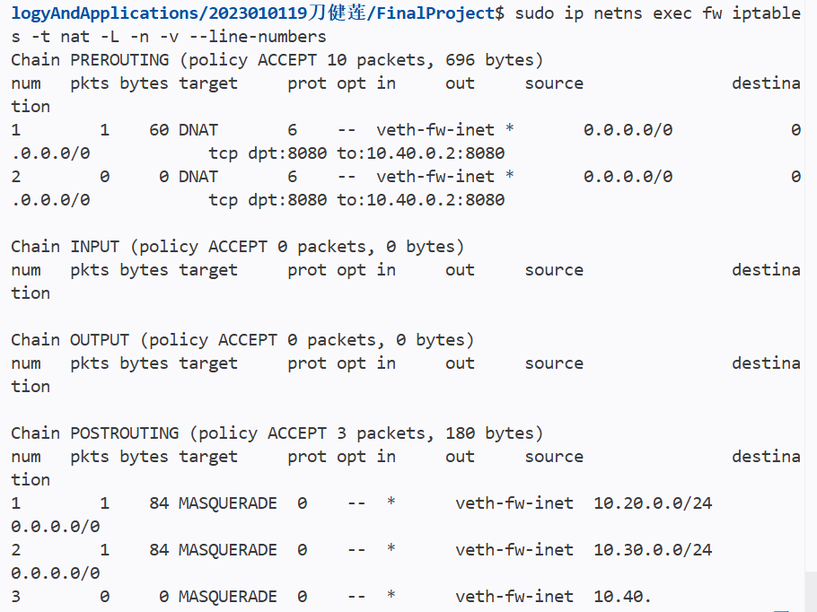

3. **访问测试矩阵**：填写完整的测试结果

| 来源 | 目标 | 预期结果 | 实际结果 | 截图 |
|:-----|:-----|:---------|:---------|:-----|
| office | dmz:8080 | 成功 |成功 |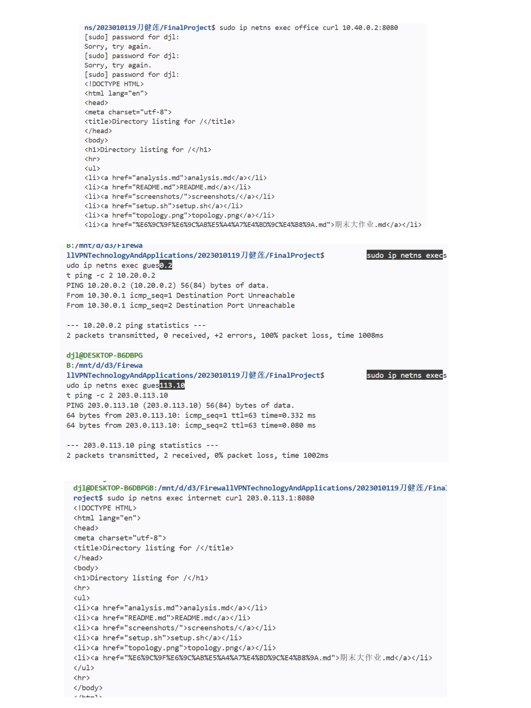 |
| office | dmz:22 | 失败+LOG |失败+LOG |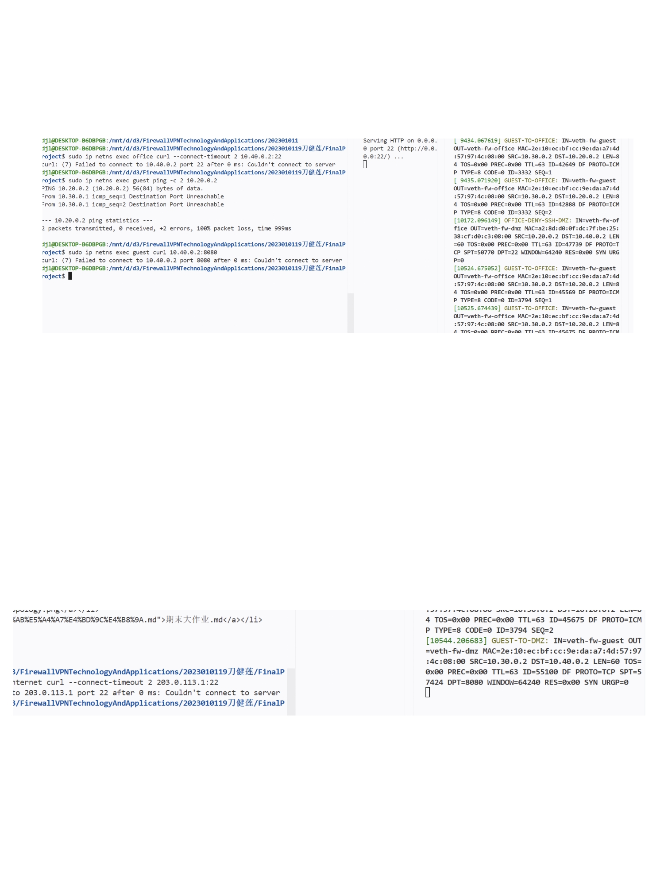 |
| guest | office:任意 | 失败+LOG |失败+LOG | |
| guest | dmz:8080 | 失败+LOG | 失败+LOG| |
| guest | internet:任意 | 成功 | 成功| |
| office | internet:任意 | 成功 |成功 | |
| internet | fw公网IP:8080 | 成功(DNAT到dmz) | 成功| |
| internet | dmz:22 | 失败 |失败 | |

4. **规则设计说明**：说明规则顺序、为什么用REJECT而不是DROP等
答：防火墙规则采用状态检测优先、放行规则在前、拦截隔离规则在后的顺序设计，首条将 FORWARD 默认策略设为 DROP 实现全局最小权限；先配置 conntrack 状态规则放行所有已建立、关联连接的回包，保障正常访问的应答流量通行；再依次配置各区域业务放行规则，仅开放业务所需端口，针对需要审计的非法访问先添加 LOG 日志记录规则，再使用 REJECT 主动返回不可达报文替代 DROP，REJECT 会向访问源发送 ICMP 不可达响应，能直观反馈拦截结果且便于测试验证，DROP 静默丢弃报文会造成长时间连接超时；guest 区域隔离规则仅允许访问外网，完全阻断对内网办公区与 DMZ 的访问；NAT 部分配置 MASQUERADE 源地址转换使内网网段可访问外网，DNAT 目的地址转换将外网 8080 端口流量转发至 DMZ 服务器 Web 服务，同时配套 FORWARD 放行规则保障 DNAT 流量可转发；最后添加外网对内网、访客网段、DMZ 22 端口的拦截规则，实现外网仅可访问 DMZ 公开 Web 服务的安全边界。

## 五、第三部分：VPN远程接入
（包含WireGuard配置说明和测试结果）
### 提交内容

1. **WireGuard配置文件**：fw端和remote端的
2. **wg show截图**：显示握手成功、transfer计数
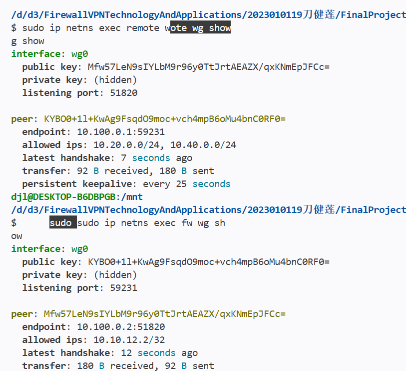

3. **VPN访问测试截图**：成功和失败场景各3个
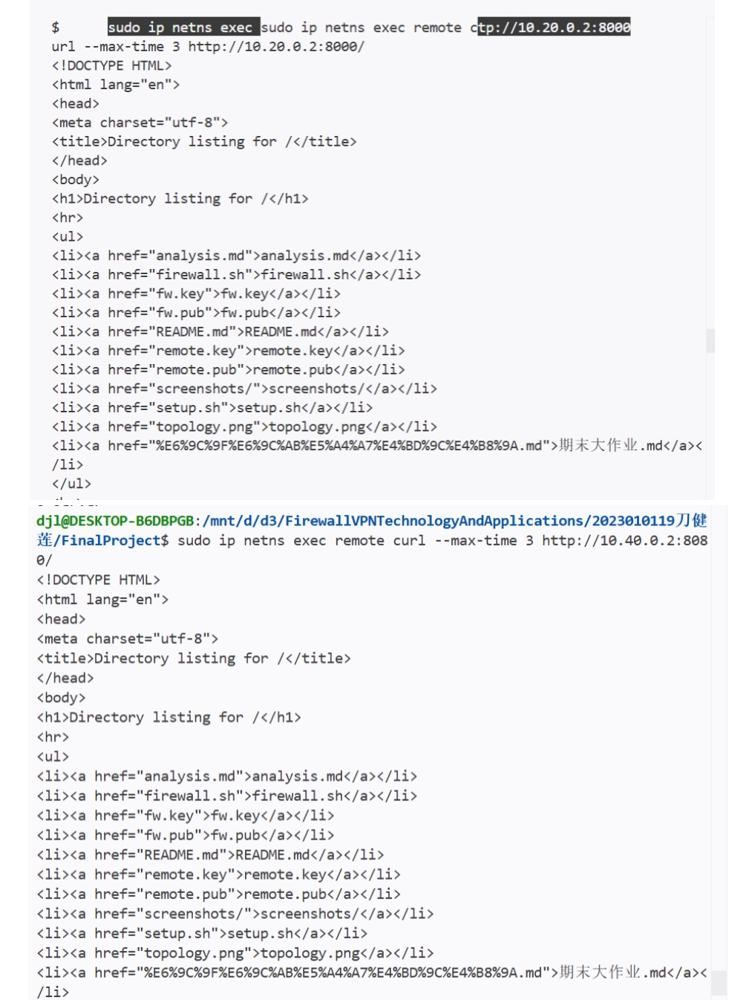 
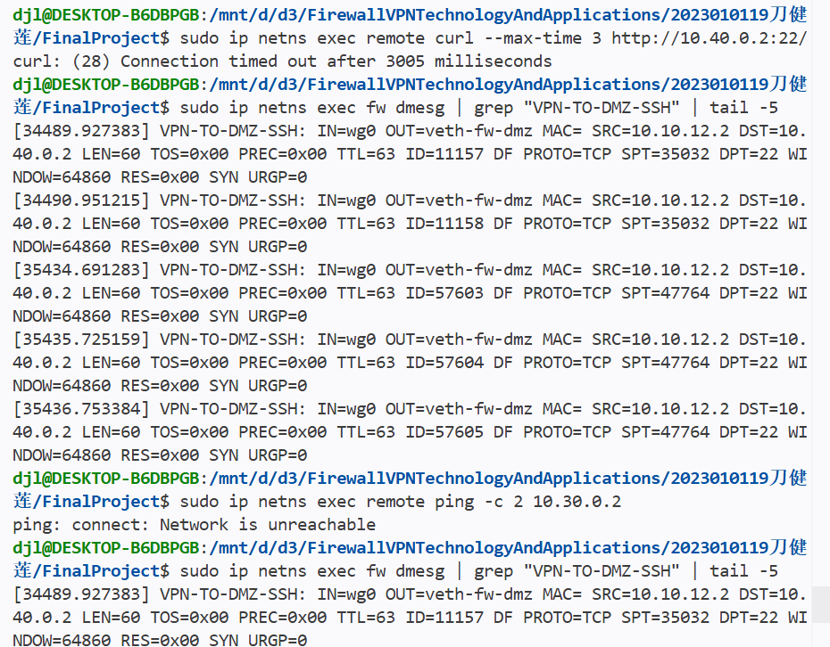

4. **路由表截图**：`remote`的`ip route`，能看到VPN相关
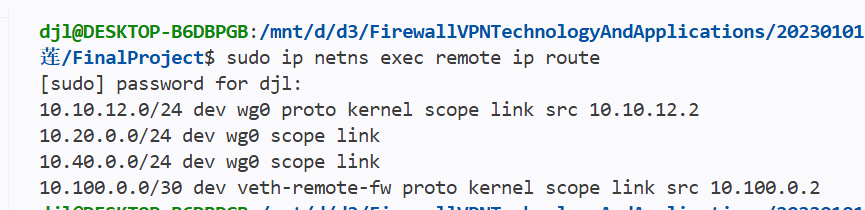

5. **VPN配置说明**：说明`AllowedIPs`的设计思路
在 remote 端配置中，AllowedIPs = 10.20.0.0/24,10.40.0.0/24 的设计遵循以下原则：
按需路由：仅允许发往办公网（office）和 DMZ 子网的流量经过 VPN 隧道，其他流量（如访问互联网、访客网等）不走 VPN，保证网络性能并避免不必要的加密开销。
最小权限：未使用 0.0.0.0/0，防止将所有流量导入 VPN，避免造成路由冲突和流量瓶颈。
与 fw 端配合：fw 端的 AllowedIPs = 10.10.12.2/32 严格限制只允许特定 VPN 客户端地址接入，增强了安全性。
该设计既满足实验要求的“只让指定网段走 VPN”，又符合实际生产环境的最佳实践。

## 六、第四部分：安全审计与日志分析
（包含LOG规则说明和日志分析报告）
1. **LOG规则配置截图**：显示所有LOG规则的行号和参数
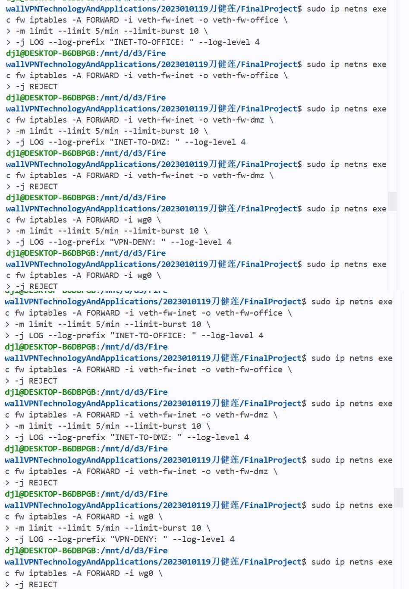

2. **5种违规场景截图**：触发命令和失败结果
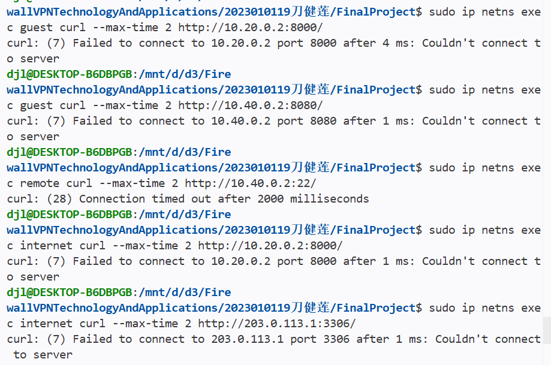

3. **journalctl日志截图**：至少5条，包含完整字段（IN、OUT、SRC、DST、DPT）
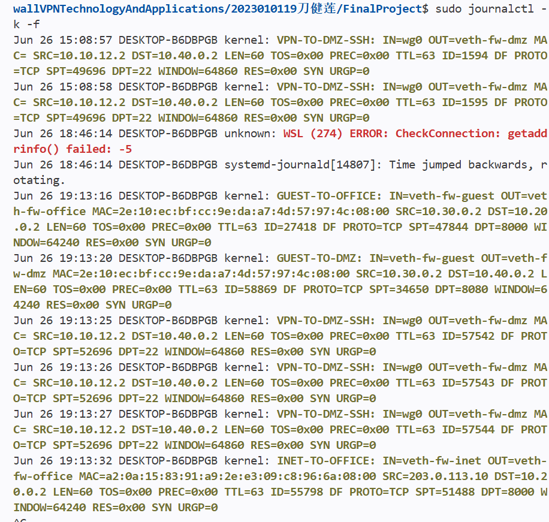

4. **日志统计表**：填写完整
**任务4.4：填写日志统计表**
| 事件类型 | 触发次数 | 实际记录日志数 | 是否生效 |
|:--------|:---------|:--------------|:---------|
| guest→office | 1|5 |是 |
| guest→dmz |1 |2 |是 |
| VPN→dmz:22 | 1|15 |是 |
| internet→office |1 | 1|是 |
| VPN其他违规 |1 | 1|是 |
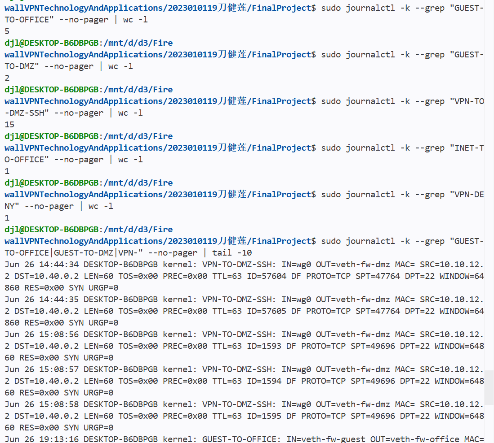

5. **日志分析报告**（300-500字）：
   - 从日志中能获取哪些安全信息？
   - LOG规则为什么要放在REJECT之前？
   - 速率限制如何防止日志洪水攻击？
   - 不同log-prefix的作用是什么？
从日志中可获取安全信息：违规访问的源IP（SRC）、目标IP（DST）、目标端口（DPT）、出入接口（IN/OUT）、协议类型及连接状态（如SYN），有助于溯源与响应。LOG规则应置于REJECT之前，确保每条被拒绝的连接先被记录再丢弃，避免因先行REJECT导致审计缺失，实现“拒绝必留痕”。速率限制（如--limit 5/min）用于防止日志洪水攻击，避免突发大量违规请求填满磁盘或压垮日志系统，保障关键告警的可读性。不同的log-prefix（如GUEST-TO-OFFICE、VPN-TO-DMZ-SSH等）相当于分类标签，便于通过过滤快速区分事件类型，支持统计、趋势分析和自动化告警，提升运维效率。合理配置LOG规则，既能实现访问控制审计，又能保障系统稳定性，是纵深防御的重要环节。

## 七、第五部分：攻防演练
### 5.1 攻击方任务（从guest发起
（包含攻击演练、防御分析、边界测试）
思考：攻击者能否伪造源地址为`10.10.10.2`的包来访问内网？
答：不能。原因有三：
接口隔离：伪造包从 veth-fw-guest 进入，但源地址却是 10.10.10.2（VPN客户端），fw 会检查路由表，该地址的路由出口是 wg0 接口，而实际进入接口是 veth-fw-guest，造成非对称路由，iptables 的 rp_filter 会丢弃这类包（即使未开启，连接跟踪也因状态不符而拒绝）。
状态检测：防火墙的 conntrack 模块会追踪连接状态，伪造的 SYN 包没有对应的 ESTABLISHED 或 NEW 合法记录，会被 FORWARD 链的默认策略或 REJECT 规则拦截。
反向路径过滤：Linux 内核的 rp_filter 会验证数据包的源地址是否可通过接收接口的反向路径返回，否则丢弃，而伪造的 VPN 地址无法通过 veth-fw-guest 接口返回，因此被丢弃。

**提交内容：**
- 3种攻击的命令和结果截图
！[攻击截图](screenshots/11-attack-scan.png)
！[攻击截图](screenshots/12-attack-bypass.png)

- 每种攻击失败的原因分析（各100字）
攻击1：
防火墙的 FORWARD 链明确禁止 guest 访问 office 网段，ICMP 请求在转发时被直接拒绝。 guest 无法获取内网主机信息，即使网关存活，也无法进一步横向移动，有效防止了网络探测和扫描攻击。
攻击2：失败原因：
防火墙规则基于接口和五元组（源IP、目标IP、协议、端口）进行匹配，不依赖于源端口。改变源端口无法绕过规则，因为 guest 访问 dmz:22 的流量仍被 GUEST-TO-DMZ REJECT 规则拦截。这证明基于服务端口的访问控制是有效的，简单改变客户端端口无法规避。
攻击3：失败原因：
防火墙具备接口隔离与状态检测能力。伪造包从 veth-fw-guest 进入，但源地址属于 VPN 子网，路由表预期应从 wg0 进入，触发反向路径过滤（rp_filter）丢弃。同时，conntrack 无法匹配合法连接状态，且 FORWARD 规则仅允许 -i wg0 的流量，多重机制确保伪造包被彻底拦截。

- 回答：攻击者能否从REJECT和DROP的不同表现判断目标是否存在？
答：能。
REJECT 会返回明确错误（如 icmp-port-unreachable 或 Connection refused），攻击者收到响应即可确认目标主机或端口可达（尽管被拒绝），从而推断目标存在。
DROP 则静默丢弃包，不返回任何信息，攻击者无法区分“目标不存在”与“防火墙丢弃”，只能超时等待，有效隐藏内网拓扑。
因此，生产环境通常用 DROP 隐藏服务，而本实验使用 REJECT 并配合 LOG，是为了便于审计和调试，这是一种权衡——在可控环境中优先保证可观测性。

### 5.2 防御方任务（日志分析与规则分析）
**提交内容：**
- 日志截图（含攻击特征）
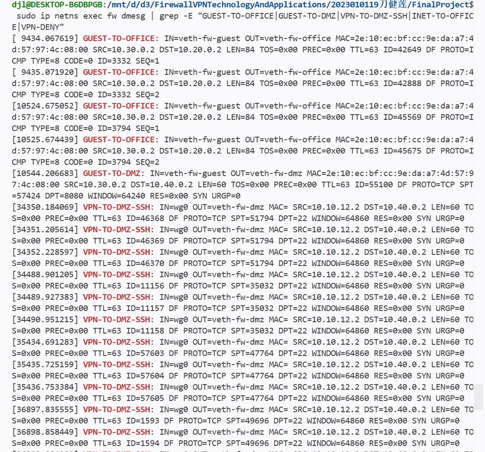

- 规则计数器截图
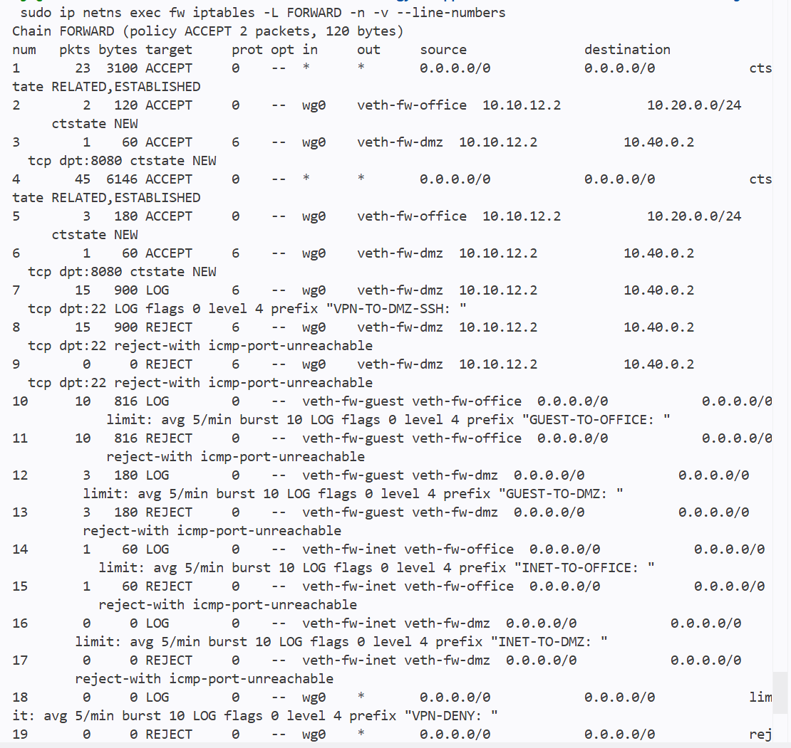

- 3个问题的回答（各150字）
回答问题：
1. 从日志的哪些字段可以判断这是来自guest的攻击？
答：从日志中可以明确判断攻击来源为 guest 的关键字段有：
IN=veth-fw-guest：数据包从 guest 命名空间的接口进入防火墙，直接表明来源是 guest 区域。
SRC=10.30.0.2：源 IP 地址为 10.30.0.2，这正是 guest 主机的 IP。
log-prefix：如 GUEST-TO-OFFICE 或 GUEST-TO-DMZ，日志前缀已明确分类，进一步印证来源。

2. 如果日志中`IN=veth-fw-guest OUT=veth-fw-office`，说明了什么？
答：这条日志表明：
数据包从 guest 接口（veth-fw-guest） 进入防火墙。
防火墙试图将其转发到 office 接口（veth-fw-office），即访问 office 网段。
这说明 guest 尝试跨子网访问 office 内网资源，但该行为被防火墙的 FORWARD 规则拦截（GUEST-TO-OFFICE REJECT）。
简言之：这是一个被拒绝的跨区域访问请求，防火墙正在执行区域隔离策略。

3. 为什么看到大量相同来源的日志应该引起警惕？
答：大量相同来源的日志（如同一 SRC 或 IN 接口）通常意味着：
扫描或探测：攻击者正在批量探测内网存活主机或开放端口（如您日志中的 10.20.0.1~10.20.0.10 全段扫描）。
暴力破解：尝试通过不同端口或协议反复入侵。
日志洪泛攻击：攻击者可能试图用大量请求填满日志存储，干扰监控或隐蔽真实攻击。

回答问题：
1. 哪条规则拦截了guest访问office？
答：拦截规则是编号 11 的 REJECT 规则，条件是 IN=veth-fw-guest OUT=veth-fw-office。当 guest 尝试访问 office 时，数据包先被编号 10 的 LOG 规则记录，然后被该 REJECT 规则拒绝，返回 icmp-port-unreachable。该规则与编号 10 的 LOG 规则配合，实现了“记录+拒绝”的访问控制审计。

2. 如果guest→office的规则计数很高，说明了什么？
答：当前计数器显示 10 个包，对应执行了 10 次 ping 扫描（10.20.0.1~10.20.0.10）。高计数通常表示 guest 正在进行内网探测、端口扫描或暴力破解尝试，可能为自动化攻击工具所驱动。应将其视为安全事件，分析来源行为，必要时封堵或强化监控。

3. REJECT和DROP在安全性上有什么区别？
答：REJECT 返回明确错误，攻击者可据此推断目标存在，造成信息泄露；DROP 静默丢弃，不返回任何信息，攻击者无法区分目标是否存在，隐蔽性更强。因此，DROP 在安全性上优于 REJECT，常用于生产环境；REJECT 配合 LOG 便于审计，适用于实验环境。

### 5.3 边界测试与改进方案
**提交内容：**
- 选择的问题及风险分析（200字）
答：选择问题：VPN没有限制连接频率
风险分析：
VPN通道允许remote客户端访问内网服务（如office的HTTP、dmz的SSH等），但未对连接频率进行限制。攻击者可利用该通道进行暴力破解（如SSH弱口令爆破）、端口扫描（探测内网开放端口）或DoS攻击（短时间内发起大量连接请求，消耗服务器资源）。若不限制，一个 compromised 的VPN客户端可在数秒内向内网发送数千个请求，导致内网服务响应缓慢或崩溃，甚至为进一步渗透提供信息。此外，缺乏频率限制还难以区分正常业务流量与恶意扫描，给安全监控和事件响应带来困难。因此，必须实施连接频率限制，以降低上述风险。

- 改进方案的实现代码
答：使用 recent 模块限制从VPN接口（wg0）进入的新连接（TCP SYN）在60秒内最多5次，超限则丢弃并记录日志。：
#插入规则到FORWARD链（位置在ESTABLISHED之后、允许规则之前）
 1. 记录每个新连接
sudo ip netns exec fw iptables -I FORWARD 2 -i wg0 -m conntrack --ctstate NEW -m recent --set --name vpnconn
2. 检查是否超限（60秒内超过5次），超限则LOG
sudo ip netns exec fw iptables -I FORWARD 3 -i wg0 -m conntrack --ctstate NEW -m recent --update --seconds 60 --hitcount 5 --name vpnconn -j LOG --log-prefix "VPN-RATE-LIMIT: "
3. 超限则DROP
sudo ip netns exec fw iptables -I FORWARD 4 -i wg0 -m conntrack --ctstate NEW -m recent --update --seconds 60 --hitcount 5 --name vpnconn -j DROP
规则顺序：
原规则1为ESTABLISHED,RELATED，确保已有连接不受限。
插入的规则2先记录，规则3检查并记录日志，规则4执行DROP。未超限的包继续匹配后面的允许规则（如VPN→office和VPN→dmz:8080）。

- 测试效果截图
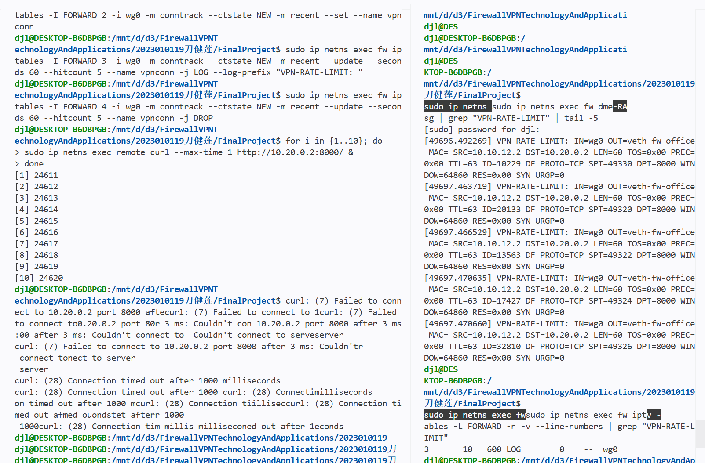

**提交内容：**
- 4个位置的抓包截图
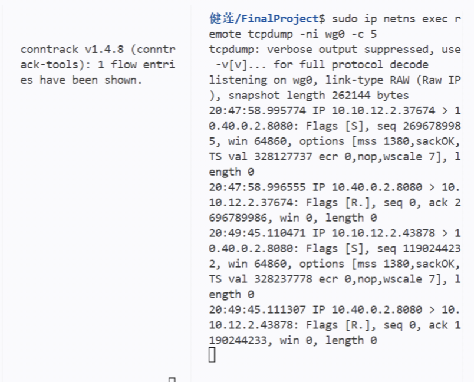

### 5.4 高级任务：追踪包的完整变化过程
- 包变化对比表
**填写包变化对比表：**
| 阶段 | 观察位置 | 源地址 | 目的地址 | 协议 | 备注 |
|:-----|:---------|:-------|:---------|:-----|:-----|
| 1 | remote wg0 | 10.10.12.2:37674|10.40.0.2:8080  |TCP| 封装前 |
| 2 | fw wg0 | 10.10.12.2:37674|10.40.0.2:8080 |TCP | 解封装后 |
| 3 | fw veth-fw-dmz | 10.10.12.2:37674| 10.40.0.2:8080|TCP | 转发到dmz |
| 4 | conntrack | 10.10.12.2:37674|10.40.0.2:8080 |TCP | 连接跟踪记录 |

- conntrack记录截图
！[conntrack记录截图](screenshots/18-conntrack.png)

- 分析报告（300字）：说明包是如何一步步被处理的
答：包处理流程：
remote发出请求：remote命名空间中的curl进程产生TCP SYN包，源IP为VPN地址10.10.12.2，目标为10.40.0.2:8080。该包被路由至wg0接口，由WireGuard内核模块进行加密封装，外层UDP包发往fw的Endpoint（10.100.0.1:59231）。
fw接收并解密：fw的wg0接口收到UDP包，解密后还原出原始IP包（源10.10.12.2，目标10.40.0.2）。此时包进入fw的协议栈，经过路由判定需转发至dmz网段。
防火墙转发：包进入FORWARD链，先匹配ESTABLISHED,RELATED规则（新连接不匹配），再匹配允许规则（-i wg0 -o veth-fw-dmz -s 10.10.12.2 -d 10.40.0.2 -p tcp --dport 8080 -j ACCEPT），被允许转发至veth-fw-dmz接口，源地址保持不变（无NAT）。
dmz响应：dmz的HTTP服务（若运行）生成SYN+ACK回复，沿原路返回：经veth-fw-dmz进入fw，匹配ESTABLISHED规则，转发至wg0，加密后发回remote。
连接跟踪：conntrack在首次SYN时创建NEW条目，后续包更新为ESTABLISHED，确保状态化防火墙正确放行回程流量。
整个流程体现了WireGuard隧道加密、防火墙规则匹配、状态跟踪和接口转发的协同工作，实现了安全的跨区域访问。

## 八、故障排查
（包含至少3个故障场景的排查过程）
### 场景1：DNAT配置了但外网无法访问

**提交要求：**
- 重现这个故障（故意配置错误）

- 记录排查过程和使用的命令
检查 FORWARD 链（确认无匹配）
sudo ip netns exec fw iptables -L FORWARD -n -v --line-numbers
检查 conntrack（无 DNAT 记录）
sudo ip netns exec fw conntrack -L | grep 203.0.113.1
抓包定位丢包（对比两个接口）
终端A（veth-fw-inet）：
sudo ip netns exec fw tcpdump -ni veth-fw-inet -c 5 host 203.0.113.10 and port 8080
终端B（veth-fw-dmz）：
sudo ip netns exec fw tcpdump -ni veth-fw-dmz -c 5 host 10.40.0.2 and port 8080
sudo ip netns exec internet curl --max-time 2 http://203.0.113.1:8080/

- 找出根本原因
根本原因：FORWARD 链缺少匹配规则，导致 DNAT 后的包被默认 DROP。

- 修复并验证
修复并验证（添加规则，访问成功）
 重新添加 internet → dmz:8080 允许规则
sudo ip netns exec fw iptables -A FORWARD -i veth-fw-inet -o veth-fw-dmz -d 10.40.0.2 -p tcp --dport 8080 -m conntrack --ctstate NEW -j ACCEPT
 再次测试（成功）
sudo ip netns exec internet curl --max-time 2 http://203.0.113.1:8080/
 查看规则计数器
sudo ip netns exec fw iptables -L FORWARD -n -v --line-numbers | grep "dpt:8080"

### 场景2：VPN隧道握手正常但业务访问失败

**提交要求：**
- 至少重现2个可能原因
- 说明如何快速定位是哪个问题
- 提供修复方法

原因1：FORWARD 规则缺失（或顺序错误）
重现：删除允许 VPN → dmz:8080 的 FORWARD 规则（或将其移到 VPN-DENY 兜底规则之后）删除允许规则（假设编号为18）
sudo ip netns exec fw iptables -D FORWARD 18
现象：wg show 握手正常，但 curl http://10.40.0.2:8080/ 超时或拒绝。
快速定位：
检查 FORWARD 链是否有匹配
 -i wg0 -o veth-fw-dmz -d 10.40.0.2 -p tcp --dport 8080 的 ACCEPT 规则。

sudo ip netns exec fw iptables -L FORWARD -n -v --line-numbers | grep "wg0.*dpt:8080"
若无输出或只有 LOG/REJECT，则规则缺失。

在 fw 的 wg0 和 veth-fw-dmz 接口同时抓包：
终端1
sudo ip netns exec fw tcpdump -ni wg0 -c 5 host 10.10.12.2 and port 8080
终端2
sudo ip netns exec fw tcpdump -ni veth-fw-dmz -c 5 host 10.40.0.2 and port 8080
然后触发 curl。若 wg0 有包而 veth-fw-dmz 无包，则包被 FORWARD 丢弃。

修复：
将允许规则插入到 VPN-DENY 之前（确保优先匹配）：
sudo ip netns exec fw iptables -I FORWARD <行号> -i wg0 -o veth-fw-dmz -s 10.10.12.2 -d 10.40.0.2 -p tcp --dport 8080 -m conntrack --ctstate NEW -j ACCEPT

原因2：dmz 默认路由缺失或错误
重现：删除 dmz 的默认路由。
sudo ip netns exec dmz ip route del default
现象：remote 发送的请求到达 dmz，但 dmz 无法回复（因无回程路由），导致连接超时。wg show 仍显示握手正常。

快速定位：
检查 dmz 路由表：
sudo ip netns exec dmz ip route
若无 default via 10.40.0.1 条目，则路由缺失。

在 fw 的 veth-fw-dmz 抓包，确认请求是否到达：
sudo ip netns exec fw tcpdump -ni veth-fw-dmz -c 5 host 10.40.0.2 and port 8080
触发 curl，若看到 SYN 包但无后续 SYN-ACK（或响应发往错误网关），则路由问题。

修复：
恢复正确的默认路由：
sudo ip netns exec dmz ip route add default via 10.40.0.1

### 场景3：去掉ESTABLISHED,RELATED后TCP连接失败

**提交要求：**
- 重现这个故障
- 用tcpdump证明SYN-ACK被拦截
- 说明ESTABLISHED,RELATED的必要性

关于 ESTABLISHED,RELATED 的必要性：
回包放行：服务器回复的 SYN-ACK 属于 ESTABLISHED 状态，若无该规则，回包会被默认 DROP 策略丢弃，导致三次握手失败。
简化规则：只需定义 NEW 连接的规则，回包自动放行，无需为每个服务单独配置反向规则。
协议支持：FTP、SIP 等协议依赖 RELATED 状态跟踪，否则数据通道无法建立。
安全增强：状态检测防止伪造包，只允许属于已允许连接的流量通过。

## 九、遇到的问题和解决方法
（实验过程中的实际问题和解决思路）
问题1：WireGuard 隧道无法握手（endpoint 端口错误）
现象：wg show 显示 latest handshake 为 (none)，transfer 只有发送无接收。
原因：fw 的 wg0 未固定监听端口，重启后随机分配了 59231，而 remote 配置中的 Endpoint 仍指向 51820。
解决：在 fw 配置文件中显式指定 ListenPort = 59231，并修改 remote 的 Endpoint 为 10.100.0.1:59231。

问题2：IP 地址冲突导致 wg0 启动失败
现象：wg-quick up 报错 Address already in use。
原因：地址规划中 veth-fw-vpn 已占用 10.10.10.1/24，与 wg0 的 IP 冲突。
解决：将 VPN 子网改为 10.10.12.0/24（fw 用 10.10.12.1，remote 用 10.10.12.2），并同步修改所有相关 AllowedIPs 和 iptables 规则中的源地址。

问题3：密钥不匹配导致握手无响应
现象：fw 收到握手包但不回复，dmesg 无错误。
原因：手动设置私钥后，fw 公钥变为 KYBO...，但 remote 配置中的 PublicKey 仍是旧的 FtrYj...。
解决：使用 wg show 查看实际公钥，并更新 remote 配置文件中的 PublicKey。

问题4：删除 ESTABLISHED,RELATED 规则后 TCP 连接超时
现象：curl 发起连接，SYN 包通过，但 SYN-ACK 回包被丢弃，连接超时。
原因：回包状态为 ESTABLISHED，但 FORWARD 链无匹配规则，默认 DROP。
解决：恢复规则 iptables -I FORWARD 1 -m conntrack --ctstate ESTABLISHED,RELATED -j ACCEPT

## 十、总结与思考
（至少500字，包含对企业网络安全架构的整体理解）
本次实验完整构建了一个企业级网络安全架构，涵盖网络隔离、访问控制、VPN 接入、NAT 转换、日志审计和故障排查等多个维度。通过动手实践，我对防火墙的工作原理、状态检测机制、策略路由以及 VPN 技术有了更深入的理解。
首先，网络隔离是安全的基础。通过 Linux 网络命名空间和 veth 对，我们模拟了办公网（office）、访客网（guest）、DMZ 区和外网（internet）等典型区域，并使用 iptables 实现区域间的访问控制。这种“默认拒绝、按需放行”的策略，遵循了最小权限原则，有效限制了横向移动和攻击扩散。例如，guest 完全被禁止访问 office 和 dmz，即使存在漏洞也无法影响核心业务区。
其次，状态防火墙是连接跟踪的核心。实验中 ESTABLISHED,RELATED 规则的重要性被反复验证：没有它，即使放行了新连接，回包也会被丢弃，导致通信失败。这让我意识到，现代防火墙不仅仅是“包过滤”，更是“会话管理”。状态检测不仅简化了规则配置（无需为每个服务配置双向规则），还增强了安全性——只有属于已允许会话的包才能通过，有效防止了地址欺骗和未授权访问。
第三，VPN 的配置比想象中更依赖网络底层。WireGuard 隧道握手涉及 UDP 端口可达性、路由、防火墙等多层因素。实验中，endpoint 端口不匹配、IP 冲突、密钥错误等均能导致隧道失败，而抓包和 wg show 是排查问题的最有效手段。此外，AllowedIPs 的设计直接决定了哪些流量进入隧道，必须精确控制，避免全流量路由造成的性能和安全风险。
第四，日志和监控是安全的“眼睛”。通过配置 LOG 规则和 log-prefix，我们可以记录每种违规访问行为，并使用 journalctl 或 dmesg 进行统计和溯源。速率限制（limit）则防止了日志洪水攻击，保证了监控系统的稳定性。在实际运维中，日志应结合自动化告警，实时发现异常行为。
第五，NAT 技术实现了公网服务的私网映射。DNAT 使外网用户能访问 DMZ 的 Web 服务，而 SNAT 则允许内网主机共享外网 IP 上网。需要注意的是，DNAT 必须配合 FORWARD 规则才能完成转发，且目标主机必须有正确的默认路由，否则回包无法返回。这体现了“四层协同”（PREROUTING → FORWARD → POSTROUTING）的重要性。
第六，故障排查能力是网络工程师的核心素养。在场景2中，我们通过抓包定位了丢包位置，通过路由表检查发现了回程路由缺失，通过 conntrack 确认了 DNAT 转换。这种“现象-定位-修复-验证”的闭环思维，不仅适用于实验，也适用于真实生产环境。我深刻体会到，不要迷信单一工具，应将 iptables、tcpdump、conntrack、ip route 等组合使用，才能快速定位问题。
最后，企业网络安全架构是一个系统化工程，不是单点防护。它需要网络分段、访问控制、加密隧道、日志审计、入侵检测等多种技术协同。本次实验虽然是在虚拟环境中进行，但原理与真实环境一致。通过这次实践，我不仅掌握了具体命令，更理解了设计思想：安全与效率需平衡——太宽松则易被攻破，太严格则影响业务；策略应基于业务需求，并持续监控和优化。
展望未来，随着零信任理念的普及，基于身份和上下文的动态访问控制将取代静态规则。但无论技术如何演进，本实验所体现的“状态检测、区域隔离、最小权限、审计跟踪”等核心原则，仍将长期有效。这次实验为我后续深入学习网络安全打下了坚实基础，也让我更加敬畏“安全无小事”这一信条。