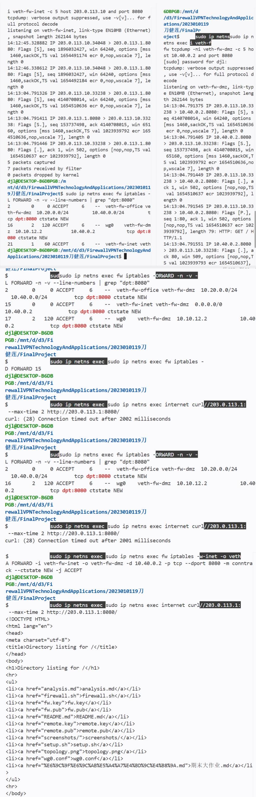
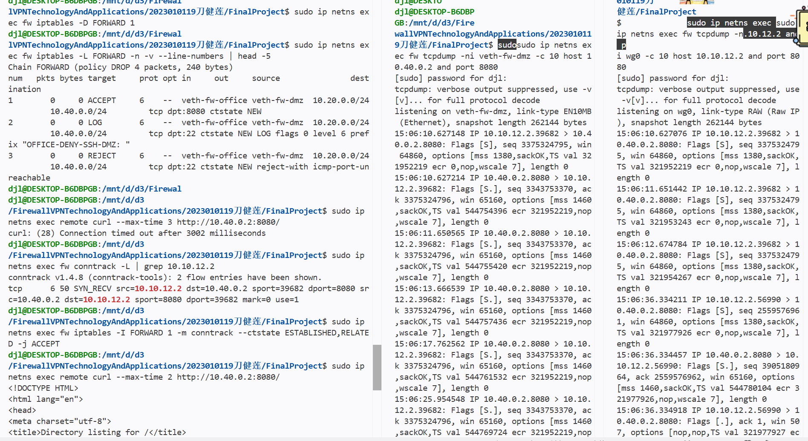

## 故障排查专题（体现Plan1的开放性）

### 场景1：DNAT配置了但外网无法访问

**现象：**
- `internet`访问`203.0.113.1:8080`失败
- `iptables -t nat -L`显示DNAT规则存在
- `dmz`上的服务正常运行

**排查步骤：**
1. 检查FORWARD规则是否放行了DNAT后的流量
2. 检查dmz的默认路由是否指向fw
3. 用conntrack观察是否有DNAT映射记录
4. 在fw的多个接口抓包，找出包在哪里被丢弃

**提交要求：**
- 重现这个故障（故意配置错误）

- 记录排查过程和使用的命令
检查 FORWARD 链（确认无匹配）
sudo ip netns exec fw iptables -L FORWARD -n -v --line-numbers
检查 conntrack（无 DNAT 记录）
sudo ip netns exec fw conntrack -L | grep 203.0.113.1
抓包定位丢包（对比两个接口）
终端A（veth-fw-inet）：
sudo ip netns exec fw tcpdump -ni veth-fw-inet -c 5 host 203.0.113.10 and port 8080
终端B（veth-fw-dmz）：
sudo ip netns exec fw tcpdump -ni veth-fw-dmz -c 5 host 10.40.0.2 and port 8080
sudo ip netns exec internet curl --max-time 2 http://203.0.113.1:8080/

- 找出根本原因
根本原因：FORWARD 链缺少匹配规则，导致 DNAT 后的包被默认 DROP。

- 修复并验证
修复并验证（添加规则，访问成功）
 重新添加 internet → dmz:8080 允许规则
sudo ip netns exec fw iptables -A FORWARD -i veth-fw-inet -o veth-fw-dmz -d 10.40.0.2 -p tcp --dport 8080 -m conntrack --ctstate NEW -j ACCEPT
 再次测试（成功）
sudo ip netns exec internet curl --max-time 2 http://203.0.113.1:8080/
 查看规则计数器
sudo ip netns exec fw iptables -L FORWARD -n -v --line-numbers | grep "dpt:8080"

### 场景2：VPN隧道握手正常但业务访问失败

**现象：**
- `wg show`显示`latest handshake`正常
- `remote ping 10.40.0.2`失败
- `fw`上没有相关日志

**可能原因：**
1. `AllowedIPs`配置错误
2. FORWARD规则拒绝了VPN流量
3. dmz没有回程路由
4. fw未开启IP转发

**提交要求：**
- 至少重现2个可能原因
- 说明如何快速定位是哪个问题
- 提供修复方法

原因1：FORWARD 规则缺失（或顺序错误）
重现：删除允许 VPN → dmz:8080 的 FORWARD 规则（或将其移到 VPN-DENY 兜底规则之后）删除允许规则（假设编号为18）
sudo ip netns exec fw iptables -D FORWARD 18
现象：wg show 握手正常，但 curl http://10.40.0.2:8080/ 超时或拒绝。
快速定位：
检查 FORWARD 链是否有匹配
 -i wg0 -o veth-fw-dmz -d 10.40.0.2 -p tcp --dport 8080 的 ACCEPT 规则。

sudo ip netns exec fw iptables -L FORWARD -n -v --line-numbers | grep "wg0.*dpt:8080"
若无输出或只有 LOG/REJECT，则规则缺失。

在 fw 的 wg0 和 veth-fw-dmz 接口同时抓包：
终端1
sudo ip netns exec fw tcpdump -ni wg0 -c 5 host 10.10.12.2 and port 8080
终端2
sudo ip netns exec fw tcpdump -ni veth-fw-dmz -c 5 host 10.40.0.2 and port 8080
然后触发 curl。若 wg0 有包而 veth-fw-dmz 无包，则包被 FORWARD 丢弃。

修复：
将允许规则插入到 VPN-DENY 之前（确保优先匹配）：
sudo ip netns exec fw iptables -I FORWARD <行号> -i wg0 -o veth-fw-dmz -s 10.10.12.2 -d 10.40.0.2 -p tcp --dport 8080 -m conntrack --ctstate NEW -j ACCEPT

原因2：dmz 默认路由缺失或错误
重现：删除 dmz 的默认路由。
sudo ip netns exec dmz ip route del default
现象：remote 发送的请求到达 dmz，但 dmz 无法回复（因无回程路由），导致连接超时。wg show 仍显示握手正常。

快速定位：
检查 dmz 路由表：
sudo ip netns exec dmz ip route
若无 default via 10.40.0.1 条目，则路由缺失。

在 fw 的 veth-fw-dmz 抓包，确认请求是否到达：
sudo ip netns exec fw tcpdump -ni veth-fw-dmz -c 5 host 10.40.0.2 and port 8080
触发 curl，若看到 SYN 包但无后续 SYN-ACK（或响应发往错误网关），则路由问题。

修复：
恢复正确的默认路由：
sudo ip netns exec dmz ip route add default via 10.40.0.1

### 场景3：去掉ESTABLISHED,RELATED后TCP连接失败

**现象：**
- 三次握手的第一个SYN包能通过
- 服务器的SYN-ACK回包被防火墙拦截
- curl命令超时

**排查步骤：**
1. 在fw上抓包，观察双向流量
2. 用conntrack观察连接状态
3. 理解状态检测的作用

**提交要求：**
- 重现这个故障
- 用tcpdump证明SYN-ACK被拦截

- 说明ESTABLISHED,RELATED的必要性
关于 ESTABLISHED,RELATED 的必要性：
回包放行：服务器回复的 SYN-ACK 属于 ESTABLISHED 状态，若无该规则，回包会被默认 DROP 策略丢弃，导致三次握手失败。
简化规则：只需定义 NEW 连接的规则，回包自动放行，无需为每个服务单独配置反向规则。
协议支持：FTP、SIP 等协议依赖 RELATED 状态跟踪，否则数据通道无法建立。
安全增强：状态检测防止伪造包，只允许属于已允许连接的流量通过。