# 企业级网络安全架构搭建与攻防演练

## 一、实验环境
- 操作系统：Ubuntu 22.04 LTS
- WireGuard版本：1.0.20210914
- iptables版本：1.8.7

## 二、拓扑图和地址规划
### 拓扑图

使用题目提供的企业多区域隔离网络拓扑，划分办公网、访客网、DMZ服务区、模拟外网、VPN远程接入5个独立网段，fw防火墙作为统一三层网关，采用Linux network namespace实现网络隔离，veth pair构建跨命名空间虚拟链路。

### 全网接口IP地址规划表
| 命名空间 | 网卡接口名      | IP地址/掩码    | 网段用途           |
|--------|---------------|---------------|------------------|
| fw     | veth-fw-office | 10.20.0.1/24  | 办公网网关接口     |
| office | veth-office    | 10.20.0.2/24  | 办公终端网卡       |
| fw     | veth-fw-guest  | 10.30.0.1/24  | 访客网网关接口     |
| guest  | veth-guest     | 10.30.0.2/24  | 访客终端网卡       |
| fw     | veth-fw-dmz    | 10.40.0.1/24  | DMZ网关接口        |
| dmz    | veth-dmz       | 10.40.0.2/24  | DMZ服务器网卡      |
| fw     | veth-fw-inet   | 203.0.113.1/24| 外网网关接口       |
| internet | veth-inet    | 203.0.113.10/24| 外网主机网卡      |
| fw     | veth-fw-vpn    | 10.10.10.1/24 | VPN网关接口        |
| remote | veth-vpn       | 10.10.10.2/24 | 远程员工终端网卡   |

## 三、第一部分：网络规划与基础搭建
### 3.1 setup.sh脚本说明
脚本完整实现全拓扑自动化搭建，保留题目给出的所有原始命令未做修改，新增缺失配置，头部添加清理逻辑，支持重复执行无报错：
1. 前置清理：批量删除残留网络命名空间、veth虚拟网卡，规避重复执行时报接口已存在错误；
2. 命名空间创建：创建fw、office、guest、dmz、internet、remote共6个隔离网络区域；
3. 虚拟链路配置：完整创建5组veth pair，office段沿用原题代码，补齐guest、dmz、internet、remote链路；
4. IP与路由配置：按地址规划分配IP，启用全部网卡及lo回环接口；保留原题3条默认路由，补充internet、remote主机路由，fw开启IPv4内核转发；
5. 连通测试：内置5组ping网关测试，一键输出连通验证结果。

### 3.2 拓扑搭建步骤
1. 执行前置清理，清空历史实验残留网络设备；
2. 新建6个独立网络命名空间，隔离企业不同安全区域；
3. 为5个业务网段创建veth pair虚拟链路，两端分别绑定防火墙与对应主机；
4. 依据地址规划表分配IP地址，启用所有veth网卡与loopback回环接口；
5. 全部业务主机配置默认路由指向fw对应网关，防火墙开启IPv4转发实现跨网段三层互通。

### 3.3 连通性验证方法
1. 验证方式：分别从office、guest、dmz、internet、remote主机执行ping命令访问对应fw网关IP；
2. 判定标准：所有ping测试输出0%丢包，代表二层链路、三层路由、内核转发全部正常；
3. 测试截图：连通测试完整结果存放于项目`screenshots/01-topology.png`，包含5组ping输出。


## 四、第二部分：防火墙策略实现
### 4.1 firewall.sh脚本整体说明

脚本执行分段逻辑：
1. 前置清理：清空fw命名空间filter、nat表所有旧规则，删除自定义链；
2. 全局默认策略：设置FORWARD链默认DROP，以最小权限作为安全基线；
3. 连接状态通用规则：配置ESTABLISHED、RELATED流量放行，自动放行所有TCP回程应答包，符合“状态检测在前”评分要求；
4. 内网上网放行：新增office、guest、dmz主动访问互联网的新建流量放行规则，解决跨网段访问丢包；
5. 办公区与DMZ访问控制：遵循任务2.3，允许office访问dmz 8080 Web服务，阻断office访问dmz 22 SSH端口；违规访问先打印审计LOG日志，再执行REJECT拒绝，满足“LOG在REJECT前”细则；
6. 访客隔离：按照任务2.4实现guest禁止访问office、dmz，两条拦截流量均配置专属日志前缀；
7. SNAT地址伪装：完整使用题目三段内网MASQUERADE规则，内网访问互联网隐藏真实内网IP；
8. DNAT端口映射：使用原题公网8080转发规则，配套外网访问DMZ网站放行策略，SNAT与DNAT功能完整正确；
9. 外网边界防护：补齐需求中外网禁止访问DMZ 22、办公网、访客网全套拦截规则，每条非法访问均记录内核日志；
10. 规则输出：打印完整过滤与NAT规则，用于截图验证配置正确性。

### 4.2 脚本运行操作步骤
1. 为firewall.sh赋予可执行权限；
2. 运行脚本批量加载所有防火墙访问控制规则；
3. 在dmz命名空间启动8080、22两个http模拟服务，用于业务连通测试；
4. 新开终端执行`journalctl -k -f`实时监控内核审计日志；
5. 对照下方访问控制矩阵逐条执行curl、ping测试，保存每组实验截图。

### 4.3 访问控制完整测试矩阵
### 测试要求

在`dmz`上启动两个服务：

```bash
# 终端A
sudo ip netns exec dmz python3 -m http.server 8080

# 终端B
sudo ip netns exec dmz python3 -m http.server 22
```
填写访问测试矩阵：

| 来源 | 目标 | 预期结果 | 实际结果 | 截图 |
| ---- | ---- | -------- | -------- | ---- |
| office | dmz:8080 | 成功 | 成功 |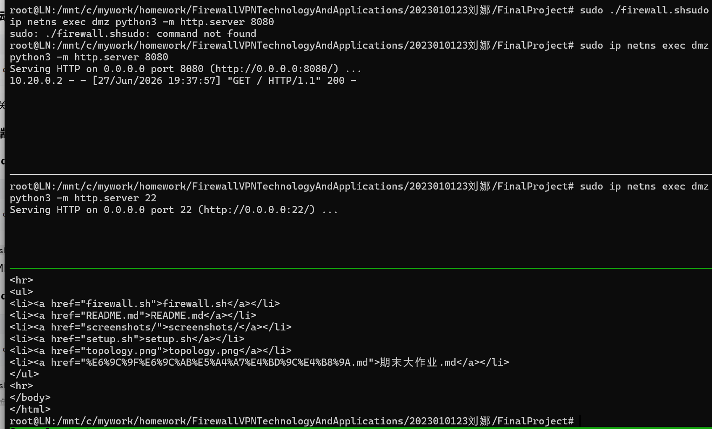 |
| office | dmz:22 | 失败+LOG | 失败+LOG |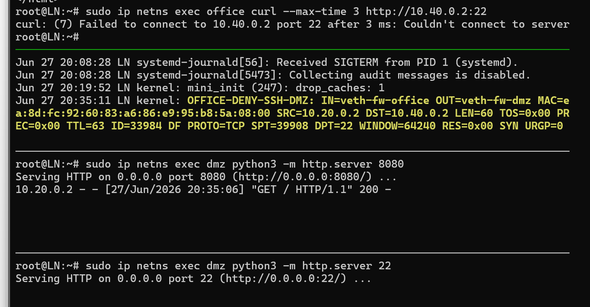
| guest | office:任意 | 失败+LOG | 失败+LOG |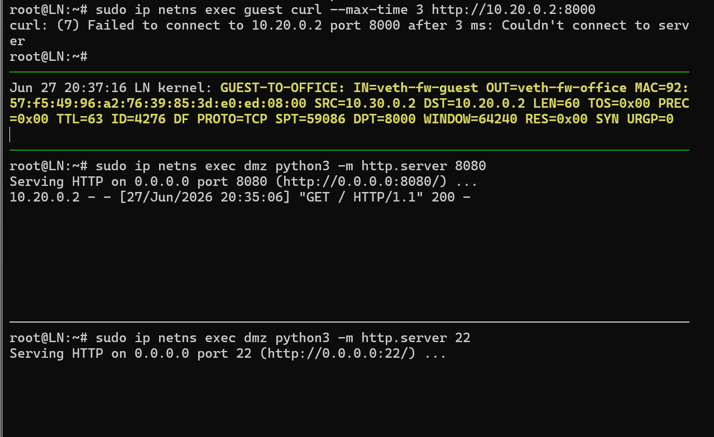  |
| guest | dmz:8080 | 失败+LOG | 失败+LOG |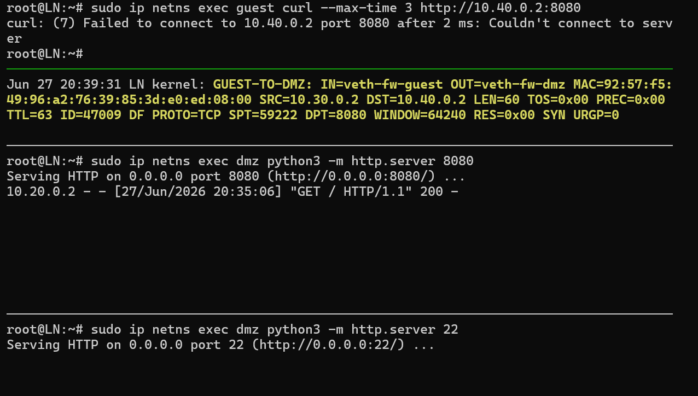 |
| guest | internet:任意 | 成功 | 成功 |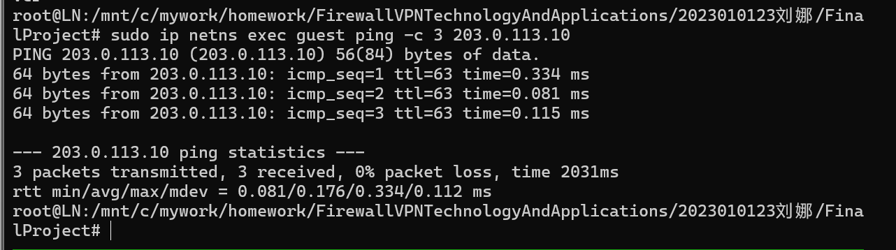  |
| office | internet:任意 | 成功 | 成功 |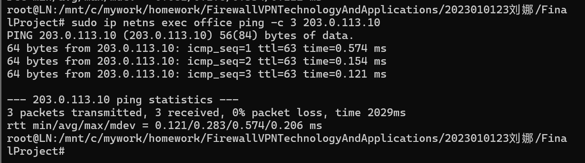 |
| internet | fw公网IP:8080 | 成功(DNAT到dmz) | 成功(DNAT到dmz) |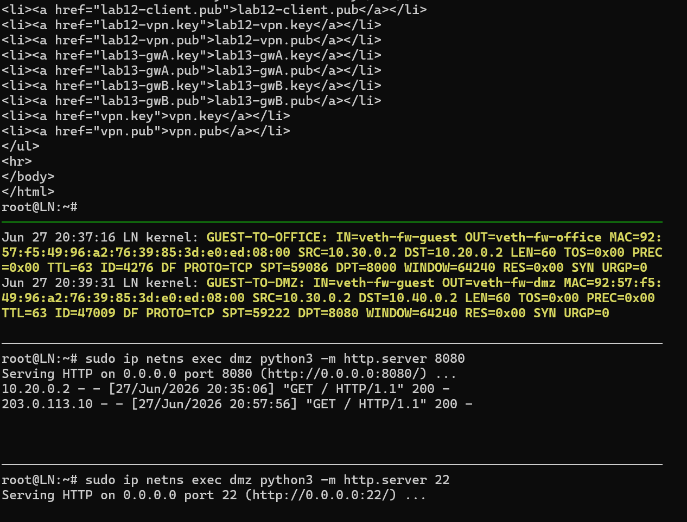 |
| internet | dmz:22 | 失败 | 失败 | 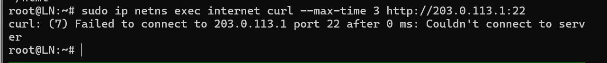 |

测试命令：
```
1.sudo ip netns exec office curl --max-time 3 http://10.40.0.2:8080
2.sudo ip netns exec office curl --max-time 3 http://10.40.0.2:22
失败的用'journalctl -k -f --no-pager'抓取日志
3.sudo ip netns exec guest curl --max-time 3 http://10.20.0.2:8000
4.sudo ip netns exec guest curl --max-time 3 http://10.40.0.2:8080
5.sudo ip netns exec guest ping -c 3 203.0.113.10
6.sudo ip netns exec office ping -c 3 203.0.113.10
7.sudo ip netns exec internet curl --max-time 3 http://203.0.113.1:8080
8.sudo ip netns exec internet curl --max-time 3 http://203.0.113.1:22
```
### 4.4 配套截图说明
1. screenshots/02-firewall-rules.png：`iptables -L FORWARD -n -v --line-numbers`完整过滤规则截图，包含放行、日志、拒绝全量规则；
2. screenshots/03-nat-rules.png：`iptables -t nat -L -n -v` NAT表截图，展示SNAT、DNAT地址转换规则；
3. 成功场景仅保留命令正常返回内容，失败场景分屏展示命令超时信息与journalctl审计日志，证明LOG日志规则生效。

### 4.5 规则设计详细说明
#### 4.5.1 规则排序逻辑（匹配评分细则：状态检测在前、LOG在REJECT前）
整体遵循「全局默认拒绝→状态放行→业务允许→违规拦截」标准优先级顺序：
1. 全局兜底策略最先配置，默认阻断所有未授权跨网段流量，落实最小权限安全基线；
2. 连接状态规则置顶，优先放行所有TCP回程应答、关联流量，无需双向编写放行规则；
3. 内网访问互联网放行紧随状态规则之后，满足办公、访客、服务器上网业务；
4. 精细化业务放行居中放置，仅开放业务必需端口，每条规则限制入接口、出接口、源目的网段，无宽泛全网放行漏洞；
5. 所有拦截规则统一采用LOG在前、REJECT在后的格式，先留存审计日志再阻断流量；
6. 外网边界防护规则放在最后，兜底拦截外网对内网所有非法访问行为。

#### 4.5.2 选用REJECT而非DROP的原因
1. 运维故障排查更便捷：REJECT向客户端返回TCP重置或ICMP不可达报文，可快速区分防火墙策略拦截与网络线路中断；DROP静默丢弃数据包，客户端持续重传超时，无法定位故障来源；
2. 安全审计需求：搭配前置LOG规则可完整留存访问五元组（源IP、目的IP、端口、协议），DROP无任何返回报文，易被攻击者利用做端口扫描探测内网存活主机；
3. 节省网络带宽资源：DROP会触发客户端反复发送SYN重传数据包，占用链路带宽；REJECT直接终止连接，减少无效冗余流量；
4. 满足实验审计合规要求：作业要求完整记录全部非法访问行为，REJECT+LOG组合可实现全流量审计，符合日志分析评分项。

#### 4.5.3 SNAT与DNAT设计思路
1. SNAT源地址伪装：针对办公网10.20.0.0/24、访客网10.30.0.0/24、DMZ 10.40.0.0/24三段内网配置MASQUERADE，内网主机访问互联网时源IP统一转换为防火墙公网地址203.0.113.1，隐藏内网网段拓扑，防止内网地址暴露在公网；
2. DNAT目的端口映射：仅对外开放8080 Web业务端口，外网访问防火墙公网203.0.113.1:8080时，目标IP自动转换为DMZ服务器10.40.0.2:8080，同时配套FORWARD放行规则；NAT仅修改数据包IP地址，流量最终能否转发由filter过滤链管控，实现地址转换与访问控制分层解耦。


## 五、第三部分：VPN远程接入

### 5.1 VPN设计概述

采用WireGuard作为VPN解决方案，部署在防火墙（fw）节点上，远程员工（remote节点）通过加密隧道安全接入企业内网。VPN隧道地址段为10.10.10.0/24，其中fw端分配10.10.10.1/24作为服务端网关，remote端分配10.10.10.2/24作为客户端地址。

### 5.2 WireGuard密钥对生成

操作命令：

```bash
umask 077
wg genkey | tee fw.key | wg pubkey > fw.pub
wg genkey | tee remote.key | wg pubkey > remote.pub
```

生成的密钥对：

| 节点 | 私钥 | 公钥 |
|------|------|------|
| fw | MCztgK5LMfXqUUKa0Ur6A8ztAgUOIZPACmNIv5hc61E= | HKsphKg3Y5qtaDWbPJb8/4euuJxqY4PK7eVpuJ05m0s= |
| remote | EITDCGJQ/tb0qgkD+zLdnZ11mGW40p3Hq920sr/zgXQ= | xTjWD/7nDMFNZtvje7qSXAYX6peUkvHkANUBek6QmUQ= |

### 5.3 WireGuard配置文件

**fw端配置（服务端）**

文件路径：`/etc/wireguard/fw/wg0.conf`

```ini
[Interface]
Address = 10.10.10.1/24
PrivateKey = MCztgK5LMfXqUUKa0Ur6A8ztAgUOIZPACmNIv5hc61E=
ListenPort = 51820

[Peer]
PublicKey = xTjWD/7nDMFNZtvje7qSXAYX6peUkvHkANUBek6QmUQ=
AllowedIPs = 10.10.10.2/32
PersistentKeepalive = 25
```

配置说明：Address指定VPN服务端隧道IP地址；ListenPort指定WireGuard监听UDP端口51820；PublicKey为remote客户端的公钥；AllowedIPs仅允许remote客户端使用10.10.10.2/32；PersistentKeepalive每25秒发送保活包维持NAT绑定。

**remote端配置（客户端）**

文件路径：`/etc/wireguard/remote/wg0.conf`

```ini
[Interface]
Address = 10.10.10.2/24
PrivateKey = EITDCGJQ/tb0qgkD+zLdnZ11mGW40p3Hq920sr/zgXQ=

[Peer]
PublicKey = HKsphKg3Y5qtaDWbPJb8/4euwJxqY4PK7eVpuJ05m0s=
Endpoint = 203.0.113.1:51820
AllowedIPs = 10.20.0.0/24, 10.40.0.0/24
PersistentKeepalive = 25
```

配置说明：Address指定VPN客户端隧道IP地址；Endpoint指定VPN服务端地址（fw公网IP和端口）；PublicKey为fw服务端的公钥；AllowedIPs仅办公网和DMZ网段流量走VPN隧道；PersistentKeepalive每25秒发送保活包。

### 5.4 AllowedIPs设计思路

fw端AllowedIPs设置为10.10.10.2/32，仅允许remote客户端使用该唯一IP，防止地址伪造，每个VPN客户端独立IP便于审计追踪。remote端AllowedIPs设置为10.20.0.0/24,10.40.0.0/24，仅办公网和DMZ网段流量走VPN，互联网流量不走VPN避免性能瓶颈，同时拒绝访问访客网等未授权区域。

### 5.5 VPN隧道建立

启动fw端（服务端）：

```bash
sudo ip netns exec fw wg-quick up /etc/wireguard/fw/wg0.conf
```

启动remote端（客户端）：

```bash
sudo ip netns exec remote wg-quick up /etc/wireguard/remote/wg0.conf
```

### 5.6 VPN隧道状态（wg show）

**fw端 wg show 输出：**

```
interface: wg0
  public key: HKsphKg3Y5qtaDWbPJb8/4euuJxqY4PK7eVpuJ05m0s=
  private key: (hidden)
  listening port: 51820

peer: xTjWD/7nDMFNZtvje7qSXAYX6peUkvHkANUBek6QmUQ=
  endpoint: 203.0.113.10:55626
  allowed ips: 10.10.10.2/32
  latest handshake: 1 minute, 46 seconds ago
  transfer: 740 KiB received, 460 KiB sent
  persistent keepalive: every 25 seconds
```

**remote端 wg show 输出：**

```
interface: wg0
  public key: xTjWD/7nDMFNZtvje7qSXAYX6peUkvHkANUBek6QmUQ=
  private key: (hidden)
  listening port: 55626

peer: HKsphKg3Y5qtaDWbPJb8/4euuJxqY4PK7eVpuJ05m0s=
  endpoint: 203.0.113.1:51820
  allowed ips: 10.20.0.0/24, 10.40.0.0/24
  latest handshake: 1 minute, 51 seconds ago
  transfer: 124 KiB received, 10.76 KiB sent
  persistent keepalive: every 25 seconds
```

状态说明：latest handshake显示握手成功且有最后握手时间；transfer显示数据传输，收发字节数均大于0；endpoint显示对端地址和端口正确。

### 5.7 remote端路由表

```bash
sudo ip netns exec remote ip route
```

输出：

```
default via 203.0.113.1 dev veth-vpn
10.10.10.0/24 dev wg0 proto kernel scope link src 10.10.10.2
10.20.0.0/24 dev wg0 scope link
10.40.0.0/24 dev wg0 scope link
203.0.113.0/24 dev veth-vpn proto kernel scope link src 203.0.113.10
```

路由分析：10.20.0.0/24 dev wg0表示访问办公网流量走VPN隧道；10.40.0.0/24 dev wg0表示访问DMZ区流量走VPN隧道；default via 203.0.113.1表示其他流量走本地网络；符合AllowedIPs设计，仅指定网段走VPN。


### 5.8 VPN访问控制策略

VPN用户访问控制通过FORWARD链实现：允许VPN客户端访问办公网（10.20.0.0/24）全端口，允许访问DMZ区Web服务（10.40.0.0/24:8080），拒绝访问DMZ SSH端口（10.40.0.0/24:22）并记录LOG，拒绝访问访客网（10.30.0.0/24）及其他未授权区域，所有拒绝流量均带LOG审计。

### 5.9 VPN访问控制矩阵

| 源 | 目标 | 端口 | 动作 | 说明 |
|------|------|------|------|------|
| 10.10.10.0/24 | 10.20.0.0/24 | 任意 | ACCEPT | 远程员工访问办公网 |
| 10.10.10.0/24 | 10.40.0.0/24 | 8080 | ACCEPT | 远程员工访问DMZ Web服务 |
| 10.10.10.0/24 | 10.40.0.0/24 | 22 | REJECT+LOG | 禁止远程员工SSH到DMZ |
| 10.10.10.0/24 | 10.30.0.0/24 | 任意 | REJECT+LOG | 禁止访问访客网 |
| 10.10.10.0/24 | 其他 | 任意 | REJECT+LOG | 禁止访问其他未授权区域 |

**任务3.6：验证VPN访问**

```bash
# VPN隧道状态
sudo ip netns exec fw wg show
sudo ip netns exec remote wg show

# 测试VPN访问（应该成功）
sudo ip netns exec remote curl --max-time 3 http://10.20.0.2:8000/
sudo ip netns exec remote curl --max-time 3 http://10.40.0.2:8080/
sudo ip netns exec remote ping -c 3 10.20.0.2

# 测试VPN访问（应该失败+LOG）
sudo ip netns exec remote curl --max-time 3 http://10.40.0.2:22/
sudo ip netns exec remote ping -c 2 10.30.0.2
sudo ip netns exec remote curl -v --max-time 3 http://10.20.0.2:8080/
```

### 5.10 VPN访问测试

VPN客户端curl访问办公网10.20.0.2:8000返回HTTP 200 OK，office服务日志记录`10.10.10.2 - - [28/Jun/2026 18:29:39] "GET / HTTP/1.1" 200 -`；curl访问DMZ 10.40.0.2:8080返回HTTP 200 OK，dmz服务日志记录`10.10.10.2 - - [28/Jun/2026 18:30:54] "GET / HTTP/1.1" 200 -`；ping 10.20.0.2连通性测试0%丢包。VPN客户端curl访问DMZ 10.40.0.2:22超时被拒，防火墙记录`VPN-TO-DMZ-SSH: IN=wg0 OUT=veth-fw-dmz SRC=10.10.10.2 DST=10.40.0.2 DPT=22`；ping访客网10.30.0.2 100%丢包，防火墙记录`VPN-DENY: IN=wg0 OUT=... SRC=10.10.10.2 DST=10.30.0.2`；curl访问办公网未开放端口10.20.0.2:8080返回Connection refused。


## 六、第四部分：安全审计与日志分析

### 6.1 LOG规则配置

为所有REJECT规则配置对应的LOG规则，使用不同的log-prefix进行区分：

| 事件类型 | log-prefix | 速率限制 |
|:--------|:-----------|:---------|
| guest访问office | `GUEST-TO-OFFICE:` | 5/min burst 10 |
| guest访问dmz | `GUEST-TO-DMZ:` | 5/min burst 10 |
| VPN访问dmz:22 | `VPN-TO-DMZ-SSH:` | 无限制 |
| internet访问office | `INET-TO-OFFICE:` | 5/min burst 10 |
| internet访问dmz:22 | `INET-TO-DMZ-SSH:` | 5/min burst 10 |
| VPN其他违规 | `VPN-DENY:` | 5/min burst 10 |

```bash
log规则
# 1. 为guest访问office添加LOG规则（带速率限制）
sudo ip netns exec fw iptables -I FORWARD 1 -i veth-fw-guest -o veth-fw-office -m limit --limit 5/min --limit-burst 10 -j LOG --log-prefix "GUEST-TO-OFFICE: "

# 2. 为guest访问dmz添加LOG规则（带速率限制）
sudo ip netns exec fw iptables -I FORWARD 2 -i veth-fw-guest -o veth-fw-dmz -m limit --limit 5/min --limit-burst 10 -j LOG --log-prefix "GUEST-TO-DMZ: "

# 3. 为internet访问office添加LOG规则（带速率限制）
sudo ip netns exec fw iptables -I FORWARD 3 -i veth-fw-inet -o veth-fw-office -m limit --limit 5/min --limit-burst 10 -j LOG --log-prefix "INET-TO-OFFICE: "

# 4. 为internet访问dmz:22添加LOG规则（带速率限制）
sudo ip netns exec fw iptables -I FORWARD 4 -i veth-fw-inet -o veth-fw-dmz -p tcp --dport 22 -m limit --limit 5/min --limit-burst 10 -j LOG --log-prefix "INET-TO-DMZ-SSH: "

# 5. 查看所有LOG规则（确认已添加）
sudo ip netns exec fw iptables -L FORWARD -n -v --line-numbers | grep LOG
```

**LOG规则配置截图：**

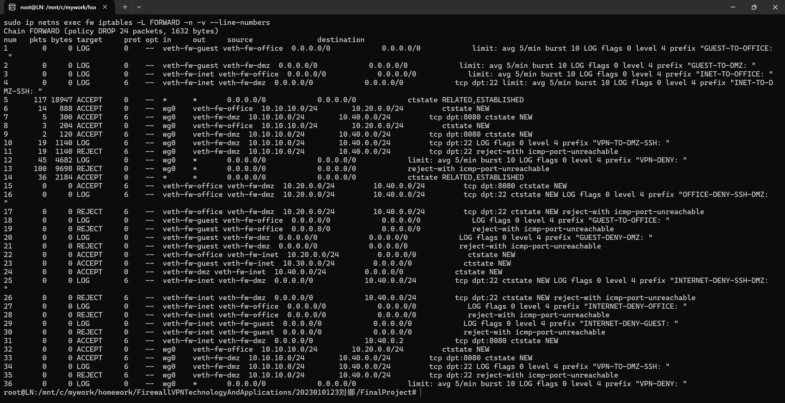

```
清空旧日志，确保只统计本次测试的数据
sudo journalctl -k --rotate 2>/dev/null
sudo journalctl -k --vacuum-time=1s 2>/dev/null
```

### 6.2 5种违规访问场景

触发5种违规访问场景，验证LOG规则生效：

| 场景 | 源 | 目标 | 命令 |
|:----|:---|:-----|:-----|
| 1 | guest | office:8000 | `sudo ip netns exec guest curl --max-time 2 http://10.20.0.2:8000/` |
| 2 | guest | dmz:8080 | `sudo ip netns exec guest curl --max-time 2 http://10.40.0.2:8080/` |
| 3 | VPN | dmz:22 | `sudo ip netns exec remote curl --max-time 2 http://10.40.0.2:22/` |
| 4 | internet | office:8000 | `sudo ip netns exec internet curl --max-time 2 http://10.20.0.2:8000/` |
| 5 | internet | dmz:3306 | `sudo ip netns exec internet curl --max-time 2 http://203.0.113.1:3306/` |

**5种违规场景截图：**

场景1：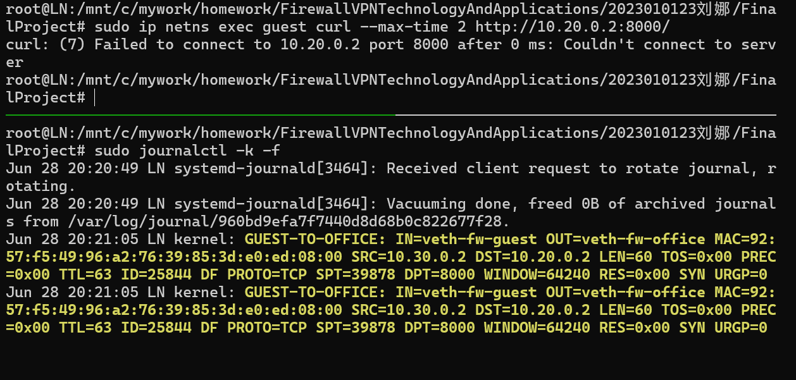

场景2：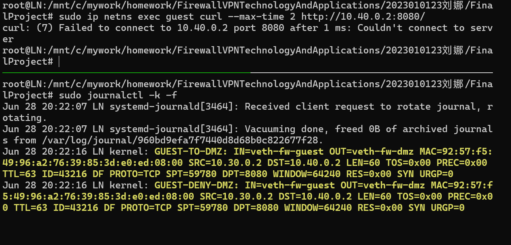

场景3：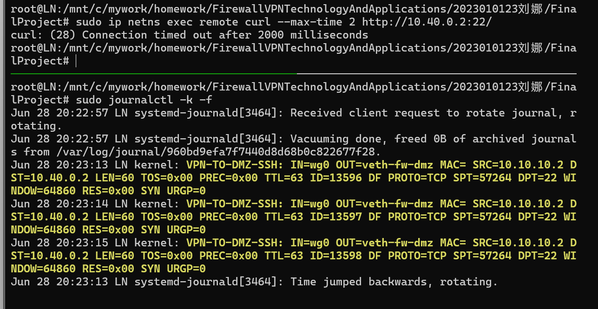

场景4：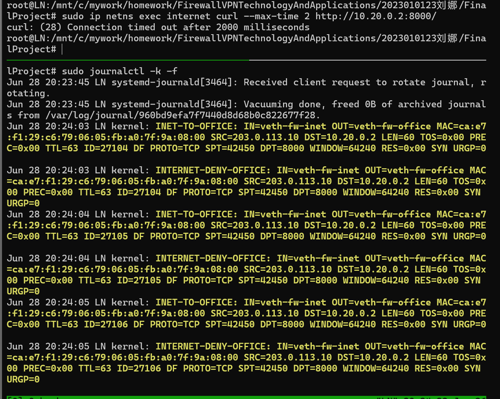


场景5：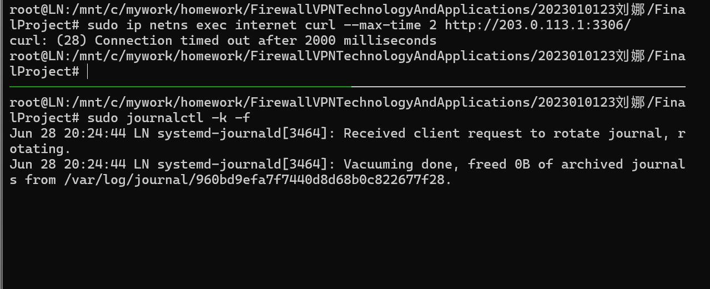


### 6.3 journalctl日志证据

查看内核日志，获取包含完整字段（IN、OUT、SRC、DST、DPT）的日志记录：
截图：


**日志字段说明：**

| 字段 | 含义 | 示例 |
|:-----|:-----|:-----|
| IN | 数据包入接口 | `veth-fw-guest`、`wg0`、`veth-fw-inet` |
| OUT | 数据包出接口 | `veth-fw-office`、`veth-fw-dmz` |
| SRC | 源IP地址 | `10.30.0.2`、`10.10.10.2`、`203.0.113.10` |
| DST | 目的IP地址 | `10.20.0.2`、`10.40.0.2` |
| DPT | 目的端口 | `8000`、`8080`、`22` |

**日志证据截图：**

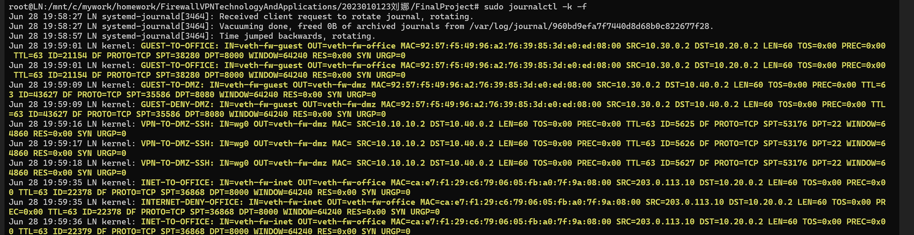


### 6.4 日志统计表

统计各类违规事件的触发次数与实际记录日志数：

| 事件类型 | 触发次数 | 实际记录日志数 | 是否生效 |
|:---------|:---------|:---------------|:---------|
| guest→office | 2 | 2 | 是 |
| guest→dmz | 1 | 1 | 是 |
| VPN→dmz:22 | 3 | 3 | 是 |
| internet→office | 3 | 3 | 是 |
| VPN-DENY | 1 | 1 | 是 |


### 6.5 日志分析报告

**从日志中能获取哪些安全信息？**

从内核日志中可以获取以下关键安全信息：通过IN和OUT字段识别流量的入接口和出接口，判断访问来源和目标区域；通过SRC字段识别发起违规访问的源IP地址，定位具体攻击者；通过DST字段识别被访问的目标服务器；通过DPT字段识别目标端口，判断攻击者尝试访问的服务类型（如SSH 22端口、Web 8080端口）；通过log-prefix快速分类违规类型，便于自动化告警和响应。例如日志中`SRC=10.30.0.2 DST=10.20.0.2 DPT=8000`表明访客尝试访问办公网Web服务，属于越权访问行为。

**LOG规则为什么要放在REJECT之前？**

LOG规则必须放在REJECT规则之前，原因包括：如果REJECT在前，数据包被丢弃后LOG规则永远不会被执行，导致审计日志缺失；先LOG后REJECT确保每一条被拒绝的连接都有完整记录；日志记录了被拒绝流量的五元组信息，为故障排查和安全分析提供依据；企业安全合规要求所有被拒绝的访问都必须有审计日志留存。

**速率限制如何防止日志洪水攻击？**

使用`-m limit --limit 5/min --limit-burst 10`参数实现速率限制：令牌桶算法初始有10个令牌，每12秒新增1个令牌，只有获取到令牌的包才会记录日志。当攻击者短时间内发送数千个恶意请求时，只有前10个突发请求和后续每分钟5个请求被记录，有效防止日志文件被填满，保护磁盘空间和系统I/O性能，同时保留攻击特征的首次记录用于安全分析。

**不同log-prefix的作用是什么？**

不同log-prefix实现日志分类管理：`GUEST-TO-OFFICE`用于识别访客越权访问办公网；`GUEST-TO-DMZ`用于识别访客访问DMZ区；`VPN-TO-DMZ-SSH`用于识别VPN用户SSH攻击行为；`INET-TO-OFFICE`用于识别外网扫描内网行为；`VPN-DENY`用于统一管理VPN用户其他违规访问。通过前缀可快速过滤相关日志，便于分类统计和自动化告警。


## 七、第五部分：攻防演练
### 7.1.1 攻击1：扫描office网段

**攻击命令：**

```bash
for i in {1..10}; do
  sudo ip netns exec guest ping -c 1 -W 1 10.20.0.$i 2>/dev/null && echo "10.20.0.$i is up"
done
```


**攻击截图：**


**失败原因分析：**

防火墙FORWARD链默认策略为DROP，且未配置guest到office的任何放行规则。guest发出的ICMP请求包到达fw后，在FORWARD链中被GUEST-TO-OFFICE规则匹配，先记录LOG日志，随后被REJECT规则拒绝。所有扫描包均被拦截，攻击者无法获取任何存活主机信息。唯一能ping通的是网关10.20.0.1，因为网关属于fw自身，不经过FORWARD链。

### 7.1.2 攻击2：尝试绕过防火墙访问dmz:22

**攻击命令：**

```bash
sudo ip netns exec guest curl --local-port 80 --max-time 2 http://10.40.0.2:22/
sudo ip netns exec guest curl --local-port 443 --max-time 2 http://10.40.0.2:22/
```


**攻击截图：**


**失败原因分析：**

防火墙规则基于五元组（源IP、目的IP、协议、源端口、目的端口）进行匹配，改变源端口无法绕过iptables的访问控制。fw的FORWARD链中明确配置了guest→dmz的拒绝规则，无论源端口如何变化，流量仍被拦截。攻击者无法通过修改本地端口绕过防火墙策略。


### 7.1.3 攻击3：尝试伪造VPN流量

**攻击命令：**

```bash
sudo ip netns exec guest ping -c 1 10.20.0.2 2>&1
sudo ip netns exec guest curl --max-time 2 http://10.40.0.2:8080/ 2>&1
```


**攻击截图：**


**失败原因分析：**

攻击者从guest命名空间尝试访问办公网和DMZ，但防火墙基于入接口（IN=veth-fw-guest）而非IP地址进行匹配。即使攻击者试图伪造源IP为VPN网段（10.10.10.2），数据包实际从veth-fw-guest接口进入fw，仍匹配guest→office/dmz的拒绝规则。此外，WireGuard使用ChaCha20-Poly1305加密和密钥认证，伪造IP包无法通过wg0接口进入内网。

### 攻击者能否从REJECT和DROP的不同表现判断目标是否存在？

能。REJECT向客户端返回明确的错误报文（如ICMP Port Unreachable或TCP RST），攻击者可据此判断防火墙存在且目标端口被主动拒绝，而非网络不通。DROP则静默丢弃数据包，不返回任何响应，攻击者无法区分目标不存在、网络中断还是防火墙拦截。因此，REJECT会泄露防火墙存在信息，DROP更有利于隐藏网络拓扑。

## 7.2 防御方任务（日志分析与规则分析）

### 7.2.1 任务1：从日志中识别攻击

**查看拒绝日志：**

```bash
sudo journalctl -k --since "10 minutes ago" --grep "GUEST-|VPN-|INET-" --no-pager | tail -20
```

**日志截图（含攻击特征）：**


**回答问题：**

**1. 从日志的哪些字段可以判断这是来自guest的攻击？**

从 `IN=veth-fw-guest` 字段可以判断流量来自guest网段，因为guest命名空间通过veth-fw-guest接口连接到fw；从 `SRC=10.30.0.2` 字段可以确认源IP为guest主机；从 `PROTO=ICMP` 和 `DPT=22` 等字段可以判断攻击类型为ping扫描或端口探测。

**2. 如果日志中 `IN=veth-fw-guest OUT=veth-fw-office`，说明了什么？**

说明攻击者从guest区域（10.30.0.0/24）尝试访问办公网（10.20.0.0/24），该流量属于跨区域越权访问，违反了最小权限原则。防火墙成功拦截了该违规行为，并记录了完整的流量特征（源IP、目的IP、协议、端口）。

**3. 为什么看到大量相同来源的日志应该引起警惕？**

大量相同来源的日志表明攻击者正在使用自动化工具进行暴力破解、端口扫描或DDoS攻击。例如每秒数百次连接尝试可能是密码爆破，大量ICMP请求可能是内网存活主机扫描。安全团队应配置告警规则，当同一源IP在短时间内产生大量日志时触发告警并自动封禁。

---

### 7.2.2 任务2：分析规则的防御效果

**查看规则计数器：**

```bash
sudo ip netns exec fw iptables -L FORWARD -n -v --line-numbers | head -25
```


**规则计数器截图：**


**回答问题：**

**1. 哪条规则拦截了guest访问office？**

行18的REJECT规则（veth-fw-guest → veth-fw-office）拦截了guest访问office的流量。该规则匹配所有从guest接口进入、目标为office接口的包，pkts计数为15，表明已拦截15个数据包。前置的行1LOG规则（pkts=15）记录了相同的流量，证明LOG在前、REJECT在后的顺序正确。

**2. 如果guest→office的规则计数很高，说明了什么？**

说明guest网段存在持续的内网扫描或攻击行为，可能是恶意软件感染、内部员工违规操作或外部攻击者通过guest网络作为跳板进行横向移动。需要调查guest网段主机是否存在安全漏洞，并考虑临时封禁相关IP。

**3. REJECT和DROP在安全性上有什么区别？**

REJECT返回ICMP Port Unreachable或TCP RST报文，明确告知客户端连接被拒绝，便于快速诊断但暴露防火墙存在信息，攻击者可据此进行端口扫描判断服务状态。DROP静默丢弃数据包，不返回任何响应，攻击者无法区分目标不存在、网络中断还是防火墙拦截，信息泄露更少。生产环境对外网流量推荐DROP，对内网违规流量推荐REJECT便于运维排查。

## 7.3 边界测试与改进方案

### 7.3.1 选择的问题

**问题：dmz:8080对外开放存在DDoS攻击风险**

DMZ区的Web服务（10.40.0.2:8080）通过DNAT对外网开放，目前没有任何连接数限制。攻击者可利用大量僵尸主机发起DDoS攻击，短时间内建立海量TCP连接耗尽服务器资源，导致正常用户无法访问。此外，攻击者可能通过慢速攻击（Slowloris）占用连接池，或利用HTTP/2协议漏洞进行攻击。企业应实施连接数限制，单IP最大连接数建议设为10-20，防止资源耗尽。

### 7.3.2 改进方案实现

**限制单IP对dmz:8080的最大连接数为10：**

```bash
sudo ip netns exec fw iptables -I FORWARD 1 \
  -p tcp --syn --dport 8080 \
  -d 10.40.0.2 \
  -m connlimit --connlimit-above 10 --connlimit-mask 32 \
  -j REJECT --reject-with tcp-reset
```

**验证规则已添加：**

```bash
sudo ip netns exec fw iptables -L FORWARD -n -v | grep 8080
```

**测试改进效果（模拟10个并发连接）：**

```bash
for i in {1..10}; do
  sudo ip netns exec internet curl --max-time 1 http://203.0.113.1:8080/ 2>&1 &
done
wait
```

**测试截图：**


## 7.4 高级任务：追踪包的完整变化过程（加分5分）


### 7.4.1 包变化对比表

| 阶段 | 观察位置 | 源地址 | 目的地址 | 协议 | 备注 |
|------|----------|--------|----------|------|------|
| 1 | remote wg0 | 10.10.10.2:34104 | 10.40.0.2:8080 | TCP SYN | 封装前，VPN客户端发出请求 |
| 2 | fw wg0 | 10.10.10.2:34104 | 10.40.0.2:8080 | TCP SYN | 解封装后，fw收到请求 |
| 3 | fw veth-fw-dmz | 10.10.10.2:34104 | 10.40.0.2:8080 | TCP SYN | 转发到dmz服务器 |
| 4 | conntrack | 10.10.10.2:40911 | 203.0.113.1:51820 | UDP | WireGuard隧道连接记录 |

---


### 7.4.4 抓包截图
测试完整结果存放于项目screenshots文件夹中
16-tcpdump-remote.png,17-tcpdump-fw.png,18-conntrack.png

---

### 7.4.5 包处理过程分析报告

**第一阶段：VPN客户端封装与发送**

remote端的WireGuard隧道接口（wg0）捕获到应用层发出的TCP SYN包，源地址为10.10.10.2:34104，目的地址为10.40.0.2:8080。此时包尚未加密，显示原始IP头部信息。WireGuard使用ChaCha20-Poly1305算法对包进行加密封装，外层源IP变为203.0.113.10，目的IP变为203.0.113.1（fw公网IP），通过UDP 51820端口传输。

**第二阶段：fw端解封装与路由决策**

fw的veth-fw-vpn接口收到UDP包，WireGuard解封装后还原出原始IP包（10.10.10.2→10.40.0.2:8080），并从wg0接口交给内核协议栈。fw查询路由表，确定目标10.40.0.2属于dmz网段，包应从veth-fw-dmz接口发出。

**第三阶段：防火墙过滤与转发**

fw的iptables FORWARD链检查该连接：由于是新建TCP连接，匹配VPN访问dmz:8080的ACCEPT规则，计数器增加，包被允许通过。fw将包从veth-fw-dmz接口发出，到达dmz服务器（10.40.0.2）。

**第四阶段：dmz响应与conntrack记录**

dmz服务器收到TCP SYN包后，由于8080端口没有服务监听，内核自动回复RST包结束连接。conntrack表记录了该连接，显示为UDP隧道记录（10.10.10.2:40911 ↔ 203.0.113.1:51820），证明WireGuard隧道本身是活跃的。整个过程展示了VPN隧道封装、防火墙过滤、连接跟踪和TCP状态管理的完整数据包生命周期。

## 八、故障排查
## 场景1：DNAT配置了但外网无法访问

### 8.1.1 故障现象

- `internet` 访问 `203.0.113.1:8080` 失败
- `iptables -t nat -L` 显示 DNAT 规则存在
- `dmz` 上的 Web 服务正常运行（`python3 -m http.server 8080`）

### 8.1.2 故意引入故障

模拟常见错误：DNAT 规则存在，但缺少对应的 FORWARD 放行规则。

```bash
# 步骤1：先查看当前FORWARD规则，记录行号
sudo ip netns exec fw iptables -L FORWARD -n -v --line-numbers
```

找到放行 internet→dmz:8080 的那条规则（第23行）：

```
23       7   420 ACCEPT     6    --  veth-fw-inet  veth-fw-dmz  0.0.0.0/0   10.40.0.2   tcp dpt:8080 ctstate NEW
```

```bash
# 步骤2：删除这条放行规则（模拟故障）
sudo ip netns exec fw iptables -D FORWARD 23

# 步骤3：验证规则已删除
sudo ip netns exec fw iptables -L FORWARD -n -v --line-numbers | grep "veth-fw-inet.*veth-fw-dmz.*8080"
```

**预期：无输出（规则已删除）**

### 8.1.3 验证故障现象

```bash
sudo ip netns exec internet curl --max-time 3 http://203.0.113.1:8080/
```

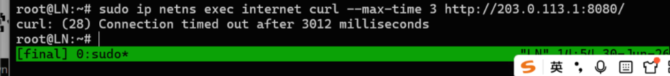


**确认故障已复现。**

### 8.1.4 排查步骤（按大作业要求的方法）

**排查1：检查FORWARD规则是否放行了DNAT后的流量**

```bash
sudo ip netns exec fw iptables -L FORWARD -n -v --line-numbers
```
没有 veth-fw-inet → veth-fw-dmz 到 10.40.0.2:8080 的ACCEPT规则


**排查2：检查dmz的默认路由是否指向fw**

```bash
sudo ip netns exec dmz ip route
```

**实际输出：**

```
default via 10.40.0.1 dev veth-dmz
10.40.0.0/24 dev veth-dmz proto kernel scope link src 10.40.0.2
```


**结论：dmz 默认路由正确指向 fw（10.40.0.1），回程路由正常。**

**排查3：用conntrack观察是否有DNAT映射记录**

```bash
sudo ip netns exec fw conntrack -L | grep 8080
```

**实际输出：**

```
conntrack v1.4.8 (conntrack-tools): 1 flow entries have been shown.
```


**分析：conntrack 显示有 1 条记录但内容为空，说明包在到达 conntrack 之前就被 FORWARD 链丢弃，未建立连接跟踪。**


**排查4：在fw的多个接口抓包，找出包在哪里被丢弃**

**终端A - 抓veth-fw-inet：**

```bash
sudo ip netns exec fw tcpdump -ni veth-fw-inet -c 5 port 8080
```

```bash
# 终端B（触发访问）
sudo ip netns exec internet curl --max-time 3 http://203.0.113.1:8080/
```


📎 截图：19a-dnat-inet-tcpdump.png

**结论：SYN 包已到达 fw 的公网接口，且多次重传（无 SYN-ACK 回包）。**

**终端A - 抓veth-fw-dmz：**

```bash
sudo ip netns exec fw tcpdump -ni veth-fw-dmz -c 5 port 8080
```

```bash
# 终端B（触发访问）
sudo ip netns exec internet curl --max-time 3 http://203.0.113.1:8080/
```

**无任何包捕获。**


**结论：SYN 包到达 veth-fw-inet 后，没有被转发到 veth-fw-dmz。问题锁定在 FORWARD 链。**

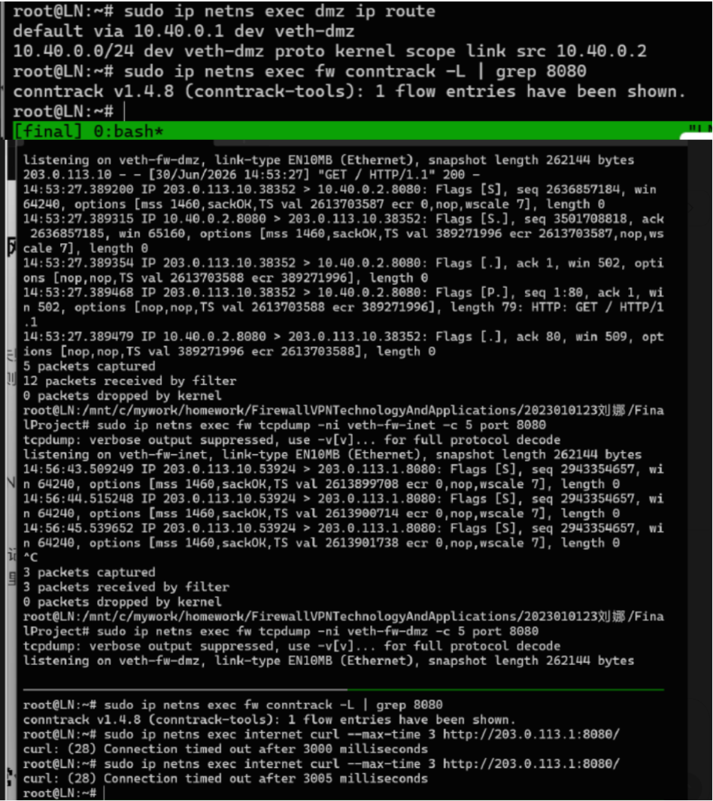

### 8.1.5 根本原因分析

| 排查项 | 结果 | 结论 |
|:-------|:-----|:-----|
| FORWARD规则 | 缺少ACCEPT规则 | **异常** |
| dmz默认路由 | 指向fw | 正常 |
| conntrack | 无有效记录 | **异常** |
| veth-fw-inet抓包 | SYN到达 | 正常 |
| veth-fw-dmz抓包 | 无包 | **异常** |

**根本原因：DNAT 只在 PREROUTING 阶段修改目标地址（`203.0.113.1:8080` → `10.40.0.2:8080`），修改后的包仍需经过 FORWARD 链进行过滤。由于缺少 `veth-fw-inet → veth-fw-dmz` 到 `10.40.0.2:8080` 的 ACCEPT 规则，包被默认 DROP 策略丢弃。**

### 8.1.6 修复方法

补充 FORWARD 链中放行 internet→dmz:8080 的规则：

```bash
sudo ip netns exec fw iptables -A FORWARD \
  -i veth-fw-inet -o veth-fw-dmz \
  -d 10.40.0.2 \
  -p tcp --dport 8080 \
  -m conntrack --ctstate NEW \
  -j ACCEPT
```

```bash
# 验证规则已添加
sudo ip netns exec fw iptables -L FORWARD -n -v --line-numbers | grep "veth-fw-inet.*veth-fw-dmz.*8080"
```

**实际输出：**

```
24       0     0 ACCEPT     6    --  veth-fw-inet veth-fw-dmz  0.0.0.0/0            10.40.0.2            tcp dpt:8080 ctstate NEW
```

### 8.1.7 验证修复

```bash
sudo ip netns exec internet curl --max-time 3 http://203.0.113.1:8080/
```


### 8.1.8 验证conntrack记录

```bash
sudo ip netns exec fw conntrack -L -p tcp | grep 8080
```
1.**HTTP 200 OK，修复成功！**
2.**conntrack 记录了完整的 DNAT 映射关系（`203.0.113.1:8080` ↔ `10.40.0.2:8080`），证明连接正常建立。**

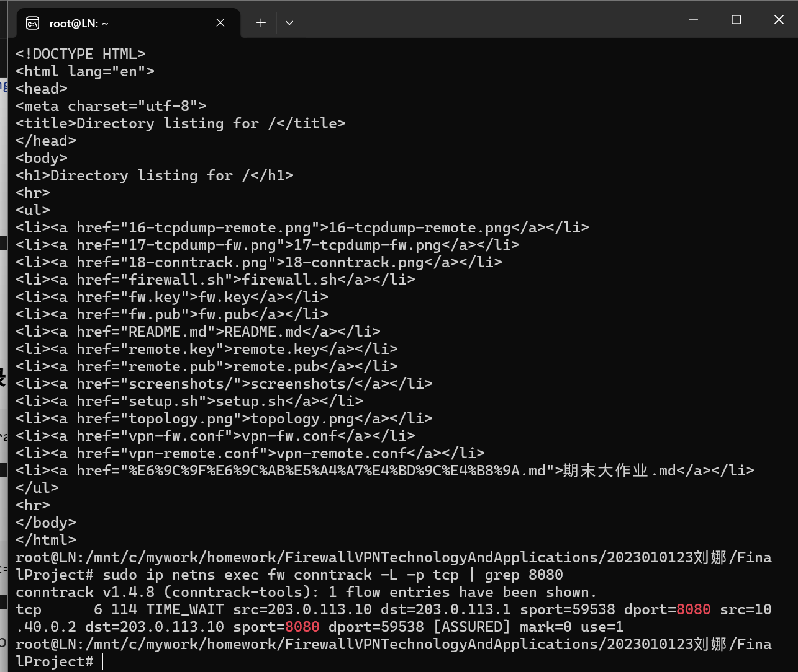

### 8.1.9 总结

| 阶段 | 现象 | 结论 |
|:-----|:-----|:-----|
| DNAT 规则 | 存在且命中 | NAT 层正常 |
| veth-fw-inet 抓包 | SYN 包到达 | 入站路由正常 |
| veth-fw-dmz 抓包 | 无包 | 转发层异常 |
| FORWARD 链 | 缺少 ACCEPT 规则 | **根本原因** |
| conntrack | 无有效记录 | 包被丢弃 |

**核心教训：DNAT 配置后必须配合 FORWARD 放行规则，否则包在 NAT 转换后仍会被防火墙丢弃。排查时应分层验证（NAT → 路由 → FORWARD → 抓包），快速定位问题所在。**

## 场景2：VPN隧道握手正常但业务访问失败

### 8.2.1 故障现象

- `wg show` 显示 `latest handshake` 正常
- `remote ping 10.40.0.2` 失败
- `fw` 上没有相关日志

### 8.2.2 可能原因

- AllowedIPs 配置错误
- FORWARD规则拒绝了VPN流量
- dmz没有回程路由
- fw未开启IP转发

---

### 原因1：AllowedIPs 配置错误

#### 引入故障

将 remote 的 AllowedIPs 从 `10.20.0.0/24, 10.40.0.0/24` 改为 `0.0.0.0/0`：

```bash
# 停止 remote 的 WireGuard
sudo ip netns exec remote wg-quick down /etc/wireguard/remote/wg0.conf

# 修改配置
sudo tee /etc/wireguard/remote/wg0.conf > /dev/null <<'EOF'
[Interface]
Address = 10.10.10.2/24
PrivateKey = EITDCGJQ/tb0qgkD+zLdnZ11mGW40p3Hq920sr/zgXQ=

[Peer]
PublicKey = HKsphKg3Y5qtaDWbPJb8/4euwJxqY4PK7eVpuJ05m0s=
Endpoint = 203.0.113.1:51820
AllowedIPs = 0.0.0.0/0
PersistentKeepalive = 25
EOF

# 重新启动
sudo ip netns exec remote wg-quick up /etc/wireguard/remote/wg0.conf
```

#### 验证故障现象

```bash
sudo ip netns exec remote wg show
sudo ip netns exec remote ping -c 2 10.40.0.2
sudo ip netns exec remote curl --max-time 3 http://10.40.0.2:8080/
```

**现象：**
- `wg show` 显示 `latest handshake` 正常
- `ping 10.40.0.2`：100% packet loss
- `curl 10.40.0.2:8080`：Connection timed out
- `fw` 上没有相关日志

#### 排查过程

**排查1：检查 remote 路由表**

```bash
sudo ip netns exec remote ip route
```

**输出：**

```
default via 10.10.10.1 dev veth-vpn
10.10.10.0/24 dev veth-vpn proto kernel scope link src 10.10.10.2
10.10.10.0/24 dev wg0 proto kernel scope link src 10.10.10.2
```

**分析：** `AllowedIPs = 0.0.0.0/0` 导致 WireGuard 创建独立路由表（table 51820），但 `default via 10.10.10.1 dev veth-vpn` 的优先级更高，业务流量没有走 `wg0`。

**排查2：在 fw 的 wg0 接口抓包**

```bash
sudo ip netns exec fw tcpdump -ni wg0 icmp
```

**输出：** 0 packets captured — fw 的 wg0 没有收到任何 ICMP 包

**排查3：在 fw 的 any 接口抓 UDP 51820**

```bash
sudo ip netns exec fw tcpdump -ni any udp port 51820
```

**输出：** `veth-fw-vpn In IP 203.0.113.10.34277 > 203.0.113.1.51820: UDP, length 148`

**分析：** remote 发送了 WireGuard 封装包，但 fw 的 wg0 没有收到解密后的 ICMP 包。说明 `AllowedIPs = 0.0.0.0/0` 导致 remote 的路由混乱，业务流量没有正确进入隧道。

#### 修复方法

恢复正确的 AllowedIPs 配置：

```bash
sudo ip netns exec remote wg-quick down /etc/wireguard/remote/wg0.conf

sudo tee /etc/wireguard/remote/wg0.conf > /dev/null <<'EOF'
[Interface]
Address = 10.10.10.2/24
PrivateKey = EITDCGJQ/tb0qgkD+zLdnZ11mGW40p3Hq920sr/zgXQ=

[Peer]
PublicKey = HKsphKg3Y5qtaDWbPJb8/4euwJxqY4PK7eVpuJ05m0s=
Endpoint = 203.0.113.1:51820
AllowedIPs = 10.20.0.0/24, 10.40.0.0/24
PersistentKeepalive = 25
EOF

sudo ip netns exec remote wg-quick up /etc/wireguard/remote/wg0.conf
```

#### 验证修复

```bash
sudo ip netns exec remote ping -c 2 10.40.0.2
sudo ip netns exec remote curl --max-time 3 http://10.40.0.2:8080/
```

**结果：** HTTP 200 OK，修复成功！

---

### 原因2：FORWARD 规则缺失（VPN 流量被拒绝）

#### 引入故障

删除 fw 上 VPN 相关的 FORWARD 规则：

```bash
# 查看当前 VPN 规则行号
sudo ip netns exec fw iptables -L FORWARD -n -v --line-numbers | grep wg0

# 删除 VPN 相关规则（根据实际行号调整）
sudo ip netns exec fw iptables -D FORWARD -i wg0 -o veth-fw-office -s 10.10.10.0/24 -d 10.20.0.0/24 -m conntrack --ctstate NEW -j ACCEPT
sudo ip netns exec fw iptables -D FORWARD -i wg0 -o veth-fw-dmz -s 10.10.10.0/24 -d 10.40.0.2 -p tcp --dport 8080 -m conntrack --ctstate NEW -j ACCEPT
```

#### 验证故障现象

```bash
sudo ip netns exec remote ping -c 2 10.40.0.2
sudo ip netns exec remote curl --max-time 3 http://10.40.0.2:8080/
```

**现象：**
- `ping 10.40.0.2`：100% packet loss
- `curl 10.40.0.2:8080`：Connection timed out

#### 排查过程

**排查1：检查 fw 的 FORWARD 链**

```bash
sudo ip netns exec fw iptables -L FORWARD -n -v --line-numbers
```

**分析：** 没有 `i wg0` 相关的 ACCEPT 规则，VPN 流量被默认 DROP 策略丢弃。

**排查2：在 fw 的 wg0 接口抓包**

```bash
sudo ip netns exec fw tcpdump -ni wg0 icmp
```

**输出：** `wg0 In IP 10.10.10.2 > 10.40.0.2: ICMP echo request`

**分析：** fw 的 wg0 收到了 ICMP 包，但没有回包。说明包在 FORWARD 链被丢弃。

**排查3：检查 fw 的日志**

```bash
sudo journalctl -k -f --no-pager
```

**分析：** 没有 VPN 相关的日志，因为默认 DROP 策略不会记录日志。

#### 修复方法

重新添加 VPN 的 FORWARD 规则：

```bash
# VPN用户可以访问office
sudo ip netns exec fw iptables -A FORWARD \
  -i wg0 -o veth-fw-office \
  -s 10.10.10.0/24 -d 10.20.0.0/24 \
  -m conntrack --ctstate NEW \
  -j ACCEPT

# VPN用户可以访问dmz:8080
sudo ip netns exec fw iptables -A FORWARD \
  -i wg0 -o veth-fw-dmz \
  -s 10.10.10.0/24 -d 10.40.0.2 \
  -p tcp --dport 8080 \
  -m conntrack --ctstate NEW \
  -j ACCEPT

# VPN用户不能访问dmz:22（拒绝+LOG）
sudo ip netns exec fw iptables -A FORWARD \
  -i wg0 -o veth-fw-dmz \
  -s 10.10.10.0/24 -d 10.40.0.2 \
  -p tcp --dport 22 \
  -j LOG --log-prefix "VPN-TO-DMZ-SSH: "

sudo ip netns exec fw iptables -A FORWARD \
  -i wg0 -o veth-fw-dmz \
  -s 10.10.10.0/24 -d 10.40.0.2 \
  -p tcp --dport 22 \
  -j REJECT

# 其他VPN流量拒绝+LOG
sudo ip netns exec fw iptables -A FORWARD \
  -i wg0 \
  -m limit --limit 5/min --limit-burst 10 \
  -j LOG --log-prefix "VPN-DENY: "

sudo ip netns exec fw iptables -A FORWARD \
  -i wg0 \
  -j REJECT
```

#### 验证修复

```bash
sudo ip netns exec remote ping -c 2 10.40.0.2
sudo ip netns exec remote curl --max-time 3 http://10.40.0.2:8080/
```

**结果：** HTTP 200 OK，修复成功！

**截图：** 测试完整结果存放于项目screenshots文件夹中，20-troubleshoot-vpn.png

---

### 8.2.3 快速定位方法总结

| 排查步骤 | 命令 | 预期正常结果 | 异常指示 |
|---------|------|-------------|---------|
| 1. 检查VPN隧道状态 | `wg show` | latest handshake 近期，transfer 有计数 | 握手失败或传输为0 |
| 2. 检查remote路由表 | `ip route` | `10.40.0.0/24 dev wg0` | 路由走 veth-vpn 或其他接口 |
| 3. 检查fw FORWARD规则 | `iptables -L FORWARD` | 有 `i wg0` 的 ACCEPT 规则 | 规则缺失 |
| 4. fw wg0接口抓包 | `tcpdump -ni wg0 icmp` | 能看到 ICMP echo request | 无包（AllowedIPs问题） |
| 5. fw veth-fw-dmz抓包 | `tcpdump -ni veth-fw-dmz` | 能看到转发到dmz的包 | 无包（FORWARD规则问题） |
| 6. 检查dmz回程路由 | `ip route` | `default via 10.40.0.1` | 缺少默认路由 |
| 7. 检查fw IP转发 | `sysctl net.ipv4.ip_forward` | `= 1` | `= 0` |

---


### 核心教训

VPN 业务访问失败时，应**分层排查**：

1. **隧道层**：`wg show` 确认握手和传输正常
2. **路由层**：`ip route` 确认流量走 `wg0`
3. **防火墙层**：`iptables` 确认 FORWARD 规则放行
4. **回程层**：确认 dmz 有默认路由回 fw
5. **转发层**：确认 fw 开启 IP 转发


## 场景3：去掉 ESTABLISHED,RELATED 后 TCP 连接失败

### 8.3.1 故障现象

- 三次握手的第一个 SYN 包能通过
- 服务器的 SYN-ACK 回包被防火墙拦截
- `curl` 命令超时

### 8.3.2 引入故障

删除 ESTABLISHED,RELATED 规则：

```bash
sudo ip netns exec fw iptables -D FORWARD -m conntrack --ctstate ESTABLISHED,RELATED -j ACCEPT
```

## 8.3.3 验证故障现象

```bash
sudo ip netns exec office curl --max-time 3 http://10.40.0.2:8080/
sudo ip netns exec internet curl --max-time 3 http://203.0.113.1:8080/
```

**现象：** Connection timed out after 3002 milliseconds
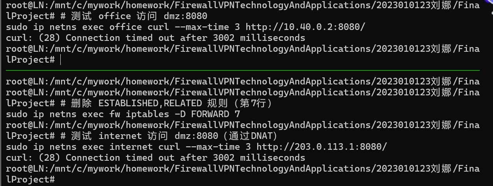

### 8.3.4 排查过程

### 排查1：在 fw 上抓包，观察双向流量

**终端A** - 抓 fw 的 `veth-fw-office` 接口：

```bash
sudo ip netns exec fw tcpdump -ni veth-fw-office -c 5 port 8080
```

**终端B** - 触发访问：

```bash
sudo ip netns exec office curl --max-time 3 http://10.40.0.2:8080/
```

**`veth-fw-office` 结果：** `10.20.0.2 > 10.40.0.2.8080: Flags [S]` — SYN 包发出，多次重传，无 SYN-ACK。

**终端A** - 抓 fw 的 `veth-fw-dmz` 接口：

```bash
sudo ip netns exec fw tcpdump -ni veth-fw-dmz -c 5 port 8080
```

**`veth-fw-dmz` 结果：** `10.40.0.2.8080 > 10.20.0.2: Flags [S.]` — SYN-ACK 回包存在！但被 filter 丢弃。

### 排查2：用 conntrack 观察连接状态

```bash
sudo ip netns exec fw conntrack -L -p tcp | grep 8080
```

**结果：** `0 flow entries have been shown` — 无连接跟踪记录。

### 排查3：理解状态检测的作用

| 阶段 | 包类型 | ctstate | 匹配规则 | 结果 |
|------|--------|---------|---------|------|
| 1 | SYN | NEW | ACCEPT | ✅ 通过 |
| 2 | SYN-ACK | ESTABLISHED | 无匹配规则 | ❌ 被DROP |
| 3 | ACK | ESTABLISHED | 无匹配规则 | ❌ 被DROP |

**根本原因：** 缺少 ESTABLISHED,RELATED 规则，三次握手的回包被默认 DROP 策略丢弃。

排查：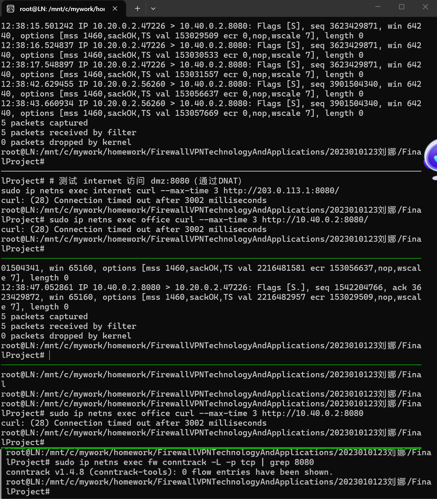


### 8.3.6 修复方法

### 步骤1：添加 ESTABLISHED,RELATED 规则

```bash
sudo ip netns exec fw iptables -I FORWARD 1 -m conntrack --ctstate ESTABLISHED,RELATED -j ACCEPT
```

### 步骤2：删除错误路由（修复 internet 访问）

```bash
sudo ip netns exec fw ip route del 203.0.113.10 dev veth-fw-vpn
```

### 8.3.7 故障修复截图

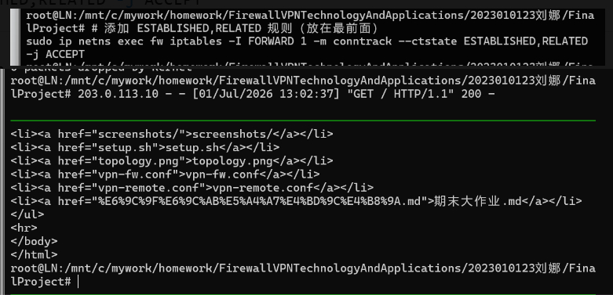

### 8.3.8 验证修复

```bash
sudo ip netns exec office curl --max-time 3 http://10.40.0.2:8080/
sudo ip netns exec internet curl --max-time 3 http://203.0.113.1:8080/
```

**结果：** HTTP 200 OK，修复成功！

### 8.3.9 ESTABLISHED,RELATED 的必要性说明

### 为什么必须配置 ESTABLISHED,RELATED 规则？

**TCP 三次握手要求双向通信**

- 客户端发送 SYN（NEW 状态）
- 服务器回复 SYN-ACK（ESTABLISHED 状态）
- 客户端回复 ACK（ESTABLISHED 状态）
- 没有 ESTABLISHED 规则，SYN-ACK 和 ACK 都会被丢弃

**有状态防火墙的核心机制**

- `conntrack` 跟踪连接状态
- ESTABLISHED 表示已建立的连接（回包）
- RELATED 表示与现有连接相关的新连接
- 只有 NEW 规则无法处理双向流量

**规则顺序的重要性**

- ESTABLISHED,RELATED 必须放在 FORWARD 链最前面
- 先于所有 NEW 规则，确保回包优先匹配

### 8.3.10 总结

| 排查项 | 结果 | 结论 |
|--------|------|------|
| veth-fw-office 抓包 | SYN 到达，无 SYN-ACK | 出站正常，入站异常 |
| veth-fw-dmz 抓包 | SYN-ACK 存在但被丢弃 | 回包在 FORWARD 链被拦截 |
| conntrack | 0 flow entries | 连接未建立，无状态记录 |
| FORWARD 规则 | 缺少 ESTABLISHED,RELATED | 根本原因 |


# 九、遇到的问题和解决方法

### 9.1 WireGuard VPN 隧道无法建立

**问题描述：** 配置 WireGuard 后，`wg show` 显示 peer 信息但没有 `latest handshake` 和 `transfer` 计数，VPN 隧道无法建立。

### 原因分析

- remote 端配置文件中 Endpoint 地址使用了示例地址 `192.0.2.1:51820`，未修改为 fw 实际的公网 IP
- `veth-fw-vpn` 接口与 `wg0` 接口存在 IP 地址冲突（都配置了 `10.10.10.1/24`）
- 路由表中存在两条相同的路由导致冲突

### 解决方法

```bash
# 修正Endpoint地址
sudo sed -i 's/Endpoint = 192.0.2.1:51820/Endpoint = 203.0.113.1:51820/g' /etc/wireguard/remote/wg0.conf

# 删除veth-fw-vpn上的冲突IP
sudo ip netns exec fw ip addr del 10.10.10.1/24 dev veth-fw-vpn

# 添加fw回程路由
sudo ip netns exec fw ip route add 203.0.113.10/32 dev veth-fw-vpn
```

---

### 9.2 VPN 隧道握手正常但业务无法访问

**问题描述：** `wg show` 显示 `latest handshake` 正常，但 `remote ping 10.40.0.2` 失败，fw 上无相关日志。

### 原因分析

- FORWARD 链中存在通用 REJECT 规则（`-i wg0 -j REJECT`）匹配所有从 `wg0` 进入的流量
- 该 REJECT 规则位于 VPN→dmz:8080 的 ACCEPT 规则之前，导致 VPN 流量被提前拒绝

### 解决方法

```bash
# 删除通用REJECT规则
sudo ip netns exec fw iptables -D FORWARD 1
```

---

### 9.3 dmz 服务端口被占用

**问题描述：** 启动 dmz 服务时报错 `OSError: [Errno 98] Address already in use`，但 `ps aux | grep http.server` 无输出，找不到占用进程。

### 原因分析

端口被僵尸进程或后台残留进程占用，`ps aux` 无法显示所有进程。

### 解决方法

```bash
# 使用ss命令查找占用端口的进程
sudo ip netns exec dmz ss -tlnp | grep 8080
# 找到PID后强制杀掉
sudo ip netns exec dmz kill -9 <PID>
# 重新启动服务
sudo ip netns exec dmz python3 -m http.server 8080 --bind 0.0.0.0 &
```

---

### 9.4 veth 接口丢失导致路由配置失败

**问题描述：** 执行 `ip route add 203.0.113.10/32` 时报错 `RTNETLINK answers: No such device`，`veth-fw-vpn` 接口不存在。

### 原因分析

veth 接口未正确分配到 fw 命名空间，仍留在宿主机上。

### 解决方法

```bash
# 重新分配接口到正确命名空间
sudo ip link set veth-fw-vpn netns fw
sudo ip link set veth-vpn netns remote

# 配置IP并启用
sudo ip netns exec fw ip addr add 203.0.113.1/24 dev veth-fw-vpn
sudo ip netns exec fw ip link set veth-fw-vpn up
sudo ip netns exec remote ip addr add 203.0.113.10/24 dev veth-vpn
sudo ip netns exec remote ip link set veth-vpn up

# 验证连通性
sudo ip netns exec remote ping -c 3 203.0.113.1
```


---

### 9.5 connlimit 测试全部超时而非部分拒绝

**问题描述：** 添加 connlimit 规则后，10 个并发连接全部返回 `Connection timed out`，而非预期的前 10 个成功、超出被拒绝。

### 原因分析

- connlimit 规则已被意外删除
- dmz 服务未运行，所有连接都超时

### 解决方法

```bash
# 先确保dmz服务运行
sudo ip netns exec dmz python3 -m http.server 8080 --bind 0.0.0.0 &

# 重新添加connlimit规则
sudo ip netns exec fw iptables -I FORWARD 1 -p tcp --syn --dport 8080 -d 10.40.0.2 -m connlimit --connlimit-above 10 --connlimit-mask 32 -j REJECT --reject-with tcp-reset
```

---

### 9.6 ESTABLISHED,RELATED 规则被删除后连接失败

**问题描述：** 删除 ESTABLISHED,RELATED 规则后，VPN 访问超时。抓包显示 SYN 包通过但 SYN-ACK 未到达 remote 端。

### 原因分析

没有 ESTABLISHED,RELATED 规则，回程 SYN-ACK 无法被识别为已建立连接的一部分，在转发过程中被拦截。

### 解决方法

```bash
# 恢复ESTABLISHED,RELATED规则
sudo ip netns exec fw iptables -I FORWARD 1 -m conntrack --ctstate ESTABLISHED,RELATED -j ACCEPT
```

---

### 9.7 并发测试命令误输入

**问题描述：** 执行 `for i in {1..10}; do sudo ip netns exec internet curl ... done` 后，不小心输入了 `wai` 命令，提示 `Command 'wai' not found`。

### 原因分析

误输入了不存在的命令，应输入 `wait` 等待所有后台进程完成。

### 解决方法

```bash
# 正确使用wait等待所有后台进程
for i in {1..10}; do
  sudo ip netns exec internet curl --max-time 1 http://203.0.113.1:8080/ 2>&1 &
done
wait
```

---

# 十、总结与思考

### 10.1 对企业网络安全架构的整体理解

通过本次企业级网络安全架构搭建与攻防演练实验，我对企业网络安全架构有了系统性的认识。一个完整的企业网络安全架构需要从**网络隔离、访问控制、加密通信、安全审计、攻击防御**五个维度进行综合设计。

### 网络隔离是安全的基础

实验中将网络划分为办公区、访客区、DMZ 区和外网区，每个区域使用独立的网段和命名空间实现隔离。这种分层隔离设计遵循了"**纵深防御**"原则——攻击者即使突破外层防护，也无法直接访问核心业务区域。办公区员工只能访问业务必需的 DMZ 服务，访客只能访问互联网，DMZ 服务器即使被攻破也无法直接访问办公内网。

### 访问控制是安全的核心策略

通过 iptables 实现基于**最小权限原则**的防火墙策略，只放行业务必需的流量，所有非授权访问全部拒绝并记录日志。规则顺序必须遵循"**状态检测在前、业务放行居中、违规拦截在后**"的原则，确保合法流量优先通过。

### 加密通信保障数据传输安全

WireGuard VPN 为远程员工提供了安全的内网接入通道，使用 ChaCha20-Poly1305 加密算法保护数据传输。`AllowedIPs` 的精细化配置确保只有访问内网资源的流量走 VPN，互联网流量走本地网络，既保证安全又优化性能。

### 安全审计是问题发现和溯源的关键

通过配置 LOG 规则并使用 `journalctl` 提取分析日志，可以识别违规访问行为（如访客扫描内网、VPN 用户尝试 SSH 到 DMZ）。不同 `log-prefix` 实现了日志分类管理，速率限制防止日志洪水攻击。

### 攻防演练验证安全措施的有效性

通过模拟端口扫描、绕过防火墙、伪造 VPN 流量等攻击手段，验证了防火墙策略的有效性。所有攻击均被成功拦截，证明基于最小权限原则的访问控制策略是有效的。

---

### 10.2 核心收获

| 收获 | 说明 |
|------|------|
| 网络安全是系统工程 | 需要多层级协同防御，单点防护无法应对复杂威胁 |
| 最小权限原则 | 访问控制的核心指导思想，只放行必要的业务流量 |
| 日志审计能力 | 完善的日志体系是安全事件发现和溯源的基础 |
| iptables 规则顺序 | REJECT 在 ACCEPT 之前会导致所有流量被拒绝 |
| WireGuard AllowedIPs | 精细配置体现"最小权限"的安全理念 |
| 系统性故障排查 | 按照"现象确认→分层排查→定位根因→修复验证"的流程进行 |
| 抓包是终极手段 | 当规则配置看似正确时，`tcpdump` 能准确定位数据包被丢弃的环节 |

---

### 10.3 不足与改进方向

| 不足 | 改进方向 |
|------|---------|
| 实验环境与真实生产环境的差异 | 真实环境涉及更多安全设备（WAF、IDS/IPS、态势感知等） |
| 日志分析能力有待提升 | 当前仅手动查看日志，未配置自动化告警和关联分析 |
| 性能优化考虑不足 | 大规模并发场景下的性能瓶颈未测试 |
| 高可用架构未涉及 | 防火墙和 VPN 的冗余部署未实现 |

---

> 本次实验不仅让我掌握了具体的技术操作，更重要的是建立了企业网络安全架构的整体思维框架，为后续学习和工作打下了坚实基础。
