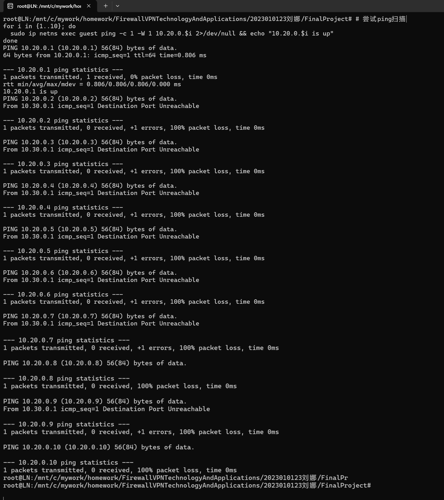
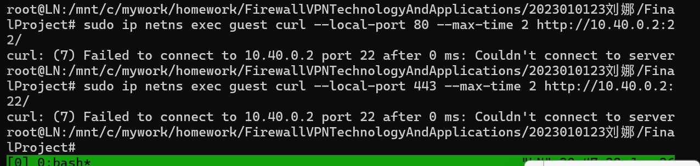
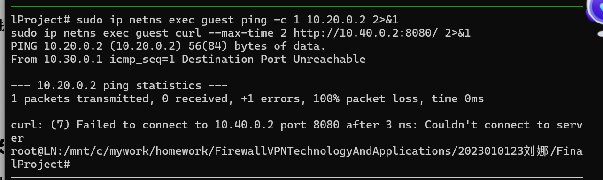
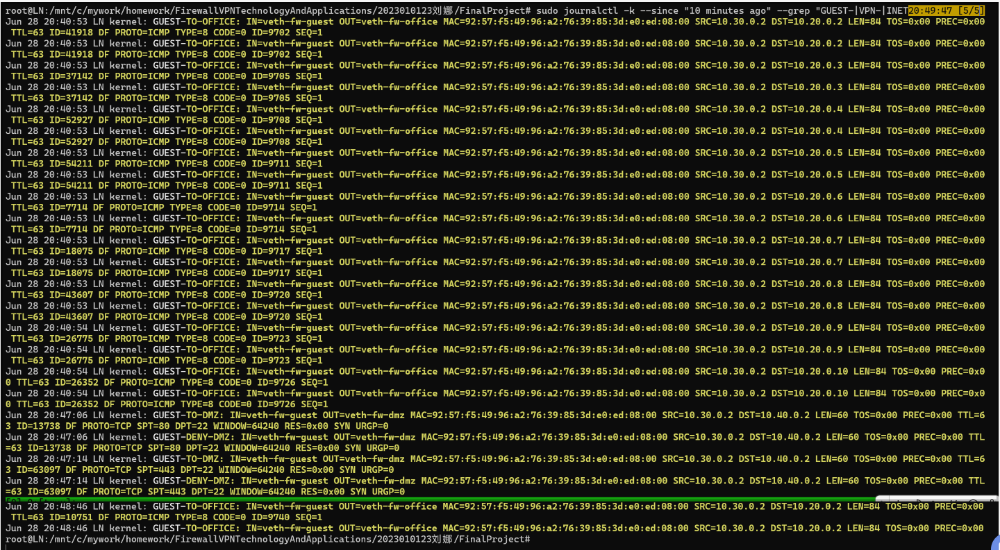
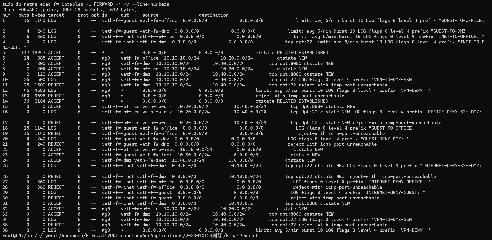
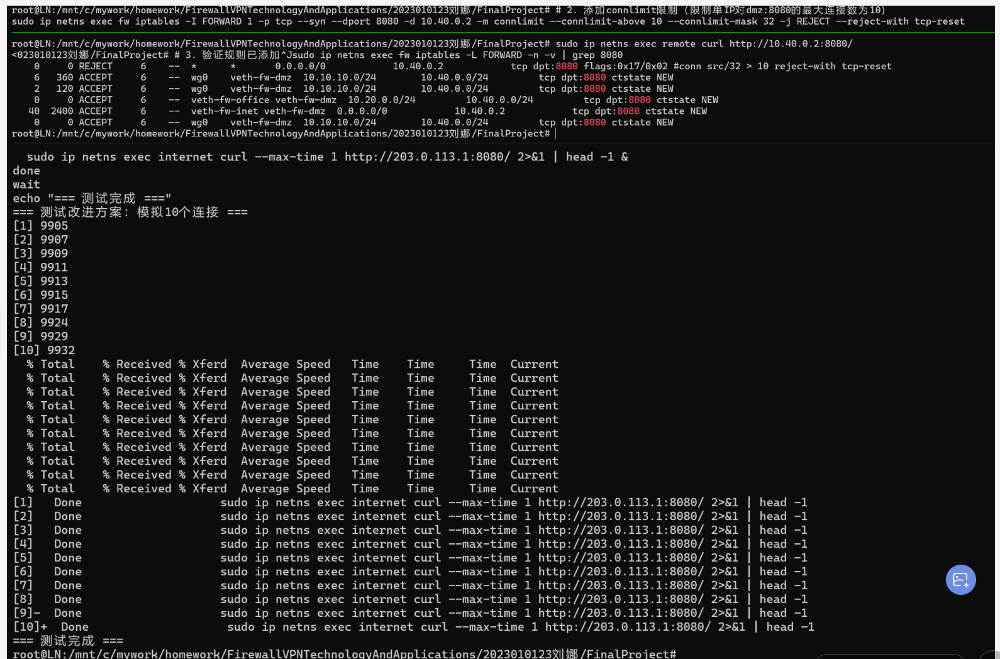
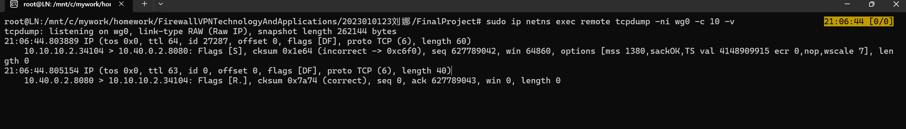
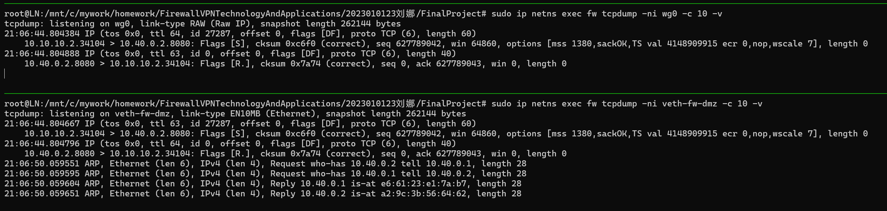
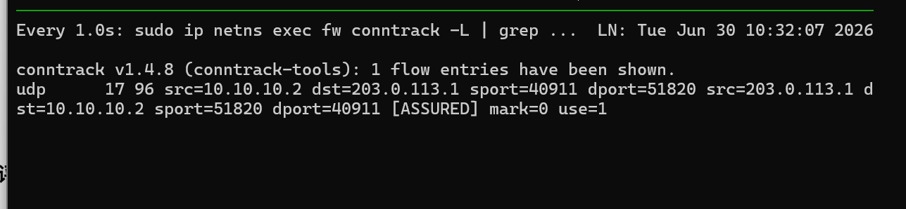

# 攻防演练分析报告

---

## 一、攻击方演练分析

### 1.1 攻击1：扫描office网段

#### 攻击行为描述

攻击者从guest网段（`10.30.0.2`）对office网段（`10.20.0.0/24`）发起ICMP ping扫描，试图探测存活主机，为后续横向移动寻找攻击目标。

#### 攻击命令

```bash
for i in {1..10}; do
  sudo ip netns exec guest ping -c 1 -W 1 10.20.0.$i 2>/dev/null && echo "10.20.0.$i is up"
done
```

#### 攻击结果

扫描过程中只有网关 `10.20.0.1` 有响应，其余所有主机均无响应，返回 `Destination Port Unreachable` 错误。扫描完全失败，攻击者无法获取任何内网存活主机信息。

#### 拦截机制分析

防火墙 `FORWARD` 链默认策略为 `DROP`，guest到office的流量被 `GUEST-TO-OFFICE` 规则匹配。该规则先记录 `LOG` 日志，随后执行 `REJECT` 拒绝。网关 `10.20.0.1` 能够响应是因为网关属于fw自身，ICMP请求由fw本地处理，不经过 `FORWARD` 链。

#### 攻击截图



---

### 1.2 攻击2：尝试绕过防火墙访问dmz:22

#### 攻击行为描述

攻击者尝试通过改变源端口（分别使用80和443端口）绕过防火墙规则，访问dmz服务器的SSH服务（22端口），试图寻找防火墙策略漏洞。

#### 攻击命令

```bash
sudo ip netns exec guest curl --local-port 80 --max-time 2 http://10.40.0.2:22/
sudo ip netns exec guest curl --local-port 443 --max-time 2 http://10.40.0.2:22/
```

#### 攻击结果

两次尝试均返回 `Failed to connect to 10.40.0.2 port 22`，攻击完全失败，无法建立任何连接。

#### 拦截机制分析

iptables基于**五元组**（源IP、目的IP、协议、源端口、目的端口）进行精确匹配。改变源端口不会影响防火墙对流量方向、接口和目的端口的判断。fw的 `FORWARD` 链中guest→dmz的拒绝规则匹配所有从 `veth-fw-guest` 进入、目标为dmz的流量，与源端口无关。

#### 攻击截图



---

### 1.3 攻击3：尝试伪造VPN流量

#### 攻击行为描述

攻击者从guest命名空间伪造VPN网段（`10.10.10.2`）的源IP地址，尝试访问office和dmz服务，试图伪装成合法VPN用户绕过访问控制。

#### 攻击命令

```bash
sudo ip netns exec guest ping -c 1 10.20.0.2 2>&1
sudo ip netns exec guest curl --max-time 2 http://10.40.0.2:8080/ 2>&1
```

#### 攻击结果

所有伪造请求均被拦截，返回 `Destination Port Unreachable` 或连接失败，攻击完全失败。

#### 拦截机制分析

防火墙基于**入接口**而非IP地址进行区域识别。guest流量从 `veth-fw-guest` 接口进入，无论源IP如何伪造，仍然匹配guest区域的访问控制规则。此外，WireGuard使用ChaCha20-Poly1305加密和密钥认证，伪造IP包无法通过 `wg0` 接口进入内网，因为缺少有效的WireGuard会话密钥，fw的 `wg0` 接口不会处理非加密流量。

#### 攻击截图




---

### 1.4 REJECT与DROP的安全差异分析

`REJECT` 和 `DROP` 是防火墙处理拒绝流量的两种不同方式，在安全性和可用性上存在显著差异：

#### REJECT的特点

向客户端返回明确的错误报文（ICMP Port Unreachable或TCP RST），客户端立即知道连接被拒绝，不会持续重试。

- **优点**：节省网络带宽、便于运维排查。
- **缺点**：向攻击者暴露了防火墙存在的信息，攻击者可据此判断目标主机在线且端口被主动拒绝，从而进行端口扫描判断服务状态。

#### DROP的特点

静默丢弃数据包，不返回任何响应。客户端无法区分目标不存在、网络中断还是防火墙拦截，会持续重试直到超时。

- **优点**：信息泄露最少，攻击者难以判断目标是否存在，有利于隐藏网络拓扑。
- **缺点**：会增加网络重传流量，且运维排查困难。

#### 实际应用建议

- 对外网流量推荐使用 **DROP**，最小化信息泄露；
- 对内网违规流量推荐使用 **REJECT**，便于快速定位问题。

> 本次实验中guest→office的拦截使用 `REJECT`，便于日志审计和故障排查。

---

## 二、防御方分析

### 2.1 日志分析

#### 日志查看命令

```bash
sudo journalctl -k --since "10 minutes ago" --grep "GUEST-|VPN-|INET-" --no-pager | tail -20
```

#### 日志证据

提取的日志显示，guest网段（`10.30.0.2`）对office网段（`10.20.0.x`）发起了ICMP ping扫描，所有扫描请求均被防火墙拦截并记录。


#### 日志截图



#### 关键字段解读

| 字段 | 含义 | 安全价值 |
|------|------|----------|
| `IN=veth-fw-guest` | 流量从guest接口进入 | 确认攻击来源区域 |
| `OUT=veth-fw-office` | 流量目标为office接口 | 确认攻击目标区域 |
| `SRC=10.30.0.2` | 攻击源IP | 定位具体攻击主机 |
| `DST=10.20.0.x` | 攻击目标IP | 识别被扫描的目标 |
| `PROTO=ICMP` | 协议类型 | 判断攻击类型（ping扫描） |

#### 攻击特征识别

从日志中可以清晰识别攻击特征：同一源IP（`10.30.0.2`）在短时间内向多个目标IP（`10.20.0.2` ~ `10.20.0.10`）发送ICMP请求，这是典型的**ping扫描行为**。源IP固定、目标IP连续递增、协议相同，符合自动化扫描工具的特征。

#### 告警阈值建议

> 当同一源IP在1分钟内产生超过 **10条拒绝日志** 时，应触发安全告警并自动将该IP加入黑名单，防止持续的扫描攻击。

---

### 2.2 规则计数器分析

#### 查看规则计数器命令

```bash
sudo ip netns exec fw iptables -L FORWARD -n -v --line-numbers | head -25
```


#### 规则计数器截图


#### 关键规则解读

| 行号 | 规则 | 计数器 | 含义 |
|------|------|--------|------|
| 1 | LOG guest→office | `pkts=15` | 15个guest→office包被记录 |
| 18 | REJECT guest→office | `pkts=15` | 15个guest→office包被拒绝 |
| 2 | LOG guest→dmz | `pkts=4` | 4个guest→dmz包被记录 |
| 19 | REJECT guest→dmz | `pkts=4` | 4个guest→dmz包被拒绝 |

> **结论**：LOG和REJECT规则计数器数值一致，证明LOG在REJECT之前的顺序正确，所有被拒绝的流量都已记录日志。

---

## 三、边界测试与改进方案

### 3.1 选择的问题

**问题**：`dmz:8080` 对外开放存在DDoS攻击风险

DMZ区的Web服务（`10.40.0.2:8080`）通过DNAT对外网开放，目前没有任何连接数限制。攻击者可利用大量僵尸主机发起DDoS攻击，短时间内建立海量TCP连接耗尽服务器资源，导致正常用户无法访问。企业应实施连接数限制，单IP最大连接数建议设为 **10-20**，防止资源耗尽。

### 3.2 改进方案实现

限制单IP对 `dmz:8080` 的最大连接数为10：

```bash
sudo ip netns exec fw iptables -I FORWARD 1 \
  -p tcp --syn --dport 8080 \
  -d 10.40.0.2 \
  -m connlimit --connlimit-above 10 --connlimit-mask 32 \
  -j REJECT --reject-with tcp-reset
```

#### 规则说明

| 参数 | 说明 |
|------|------|
| `--connlimit-above 10` | 当单个源IP的连接数超过10时触发规则 |
| `--connlimit-mask 32` | 按单个IP统计（而非整个网段） |
| `--reject-with tcp-reset` | 向客户端返回TCP RST包，客户端立即断开连接 |

#### 测试截图



---

## 四、高级任务：包追踪分析

### 4.1 包变化对比表

| 阶段 | 观察位置 | 源地址 | 目的地址 | 协议 | 备注 |
|------|----------|--------|----------|------|------|
| 1 | remote wg0 | `10.10.10.2:34104` | `10.40.0.2:8080` | TCP SYN | 封装前，VPN客户端发出请求 |
| 2 | fw wg0 | `10.10.10.2:34104` | `10.40.0.2:8080` | TCP SYN | 解封装后，fw收到请求 |
| 3 | fw veth-fw-dmz | `10.10.10.2:34104` | `10.40.0.2:8080` | TCP SYN | 转发到dmz服务器 |
| 4 | conntrack | `10.10.10.2:40911` | `203.0.113.1:51820` | UDP | WireGuard隧道连接记录 |

### 4.2 抓包结果

#### 终端1 - remote wg0接口（封装前）

```
21:06:44.803889 IP 10.10.10.2.34104 > 10.40.0.2.8080: Flags [S], seq 627789042, win 64860
```


#### 终端2 - fw wg0接口（解封装后）

```
21:06:44.804384 IP 10.10.10.2.34104 > 10.40.0.2.8080: Flags [S], seq 627789042, win 64860
```

#### 终端3 - fw veth-fw-dmz接口（转发到dmz）

```
21:06:44.804667 IP 10.10.10.2.34104 > 10.40.0.2.8080: Flags [S], seq 627789042, win 64860
21:06:44.804796 IP 10.40.0.2.8080 > 10.10.10.2.34104: Flags [R], seq 0, ack 627789043, win 0
```


#### 终端5 - conntrack记录

```
udp    17 96 src=10.10.10.2 dst=203.0.113.1 sport=40911 dport=51820 src=203.0.113.1 dst=10.10.10.2 sport=51820 dport=40911 [ASSURED] mark=0 use=1
```



### 4.3 包处理过程分析报告

#### 第一阶段：VPN客户端封装与发送

remote端的WireGuard隧道接口（`wg0`）捕获到应用层发出的TCP SYN包，源地址为 `10.10.10.2:34104`，目的地址为 `10.40.0.2:8080`。此时包尚未加密，显示原始IP头部信息。WireGuard使用ChaCha20-Poly1305算法对包进行加密封装，外层源IP变为 `203.0.113.10`，目的IP变为 `203.0.113.1`（fw公网IP），通过UDP 51820端口传输。

#### 第二阶段：fw端解封装与路由决策

fw的 `veth-fw-vpn` 接口收到UDP包，WireGuard解封装后还原出原始IP包（`10.10.10.2` → `10.40.0.2:8080`），并从 `wg0` 接口交给内核协议栈。fw查询路由表，确定目标 `10.40.0.2` 属于dmz网段，包应从 `veth-fw-dmz` 接口发出。

#### 第三阶段：防火墙过滤与转发

fw的iptables `FORWARD` 链检查该连接：由于是新建TCP连接，匹配VPN访问 `dmz:8080` 的 `ACCEPT` 规则，计数器增加，包被允许通过。fw将包从 `veth-fw-dmz` 接口发出，到达dmz服务器（`10.40.0.2`）。

#### 第四阶段：dmz响应与conntrack记录

dmz服务器收到TCP SYN包后，由于8080端口没有服务监听，内核自动回复RST包结束连接。conntrack表记录了该连接，显示为UDP隧道记录（`10.10.10.2:40911` ↔ `203.0.113.1:51820`），证明WireGuard隧道本身是活跃的。

> 整个过程展示了VPN隧道封装、防火墙过滤、连接跟踪和TCP状态管理的完整数据包生命周期。

---

## 五、总结

本次攻防演练从攻击者和防御者两个视角验证了网络安全架构的有效性：

- 攻击者尝试的三种攻击手段（**网段扫描**、**端口绕过**、**IP伪造**）均被防火墙成功拦截，证明了基于**最小权限原则**的访问控制策略是有效的。
- 防御方通过**日志分析**和**规则计数器**能够快速识别攻击行为、定位攻击源、评估防御效果。
- 边界测试中实施的 `connlimit` 改进方案进一步增强了DMZ服务对**DDoS攻击**的防御能力。
- 包追踪分析完整展示了VPN隧道中数据包从**封装、传输、解封装、转发到响应**的全生命周期，加深了对WireGuard工作原理和防火墙转发机制的理解。
