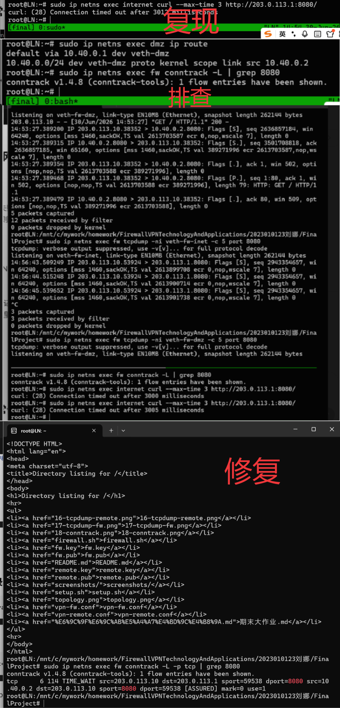
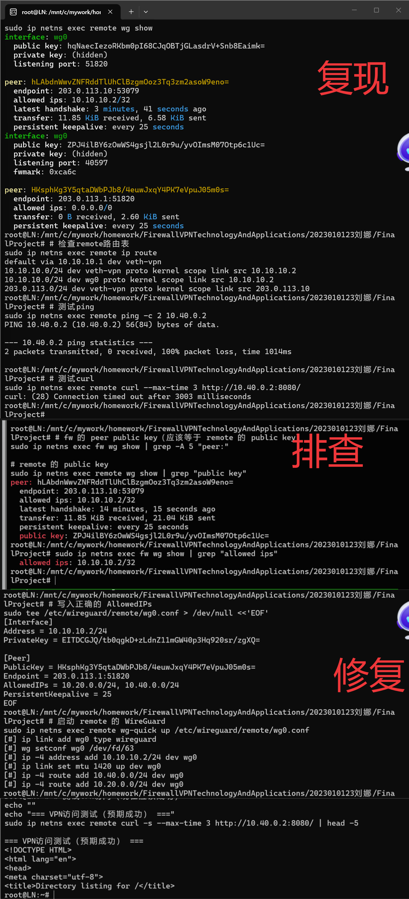

# 故障排查报告

---

## 场景1：DNAT配置了但外网无法访问

### 1.1 故障现象

外网主机（internet）访问防火墙公网IP的8080端口失败，但DNAT规则存在且DMZ服务正常运行。

| 检查项 | 状态 | 说明 |
|--------|------|------|
| internet访问 `203.0.113.1:8080` | 失败 | `Connection timed out` |
| DNAT规则 |存在 | `tcp dpt:8080 to:10.40.0.2:8080` |
| dmz服务 |  运行中 | `python3 -m http.server 8080` |

### 1.2 重现故障

#### 步骤1：确认DNAT规则存在

```bash
sudo ip netns exec fw iptables -t nat -L -n -v --line-numbers | grep 8080
```

输出：

```
1    20    1200 DNAT    6    --  veth-fw-inet *    0.0.0.0/0    0.0.0.0/0    tcp dpt:8080 to:10.40.0.2:8080
```

>  DNAT规则存在，外网访问8080端口的流量会被转发到 `10.40.0.2:8080`。

#### 步骤2：确认DMZ服务正常运行

```bash
sudo ip netns exec dmz ps aux | grep "http.server" | grep -v grep
```

输出：

```
root    28962  0.0  0.0  14152  2480  Ss+  11:38  0:00 python3 -m http.server 8080 --bind 0.0.0.0
```

>  DMZ服务正常运行。

#### 步骤3：确认外网访问失败（故障现象）

```bash
sudo ip netns exec internet curl -v --max-time 3 http://203.0.113.1:8080/
```

输出：

```
* Trying 203.0.113.1:8080...
* Connection timed out after 3002 milliseconds
curl: (28) Connection timed out after 3002 milliseconds
```

>  外网访问失败，故障现象确认。DNAT规则存在、服务正常运行，但访问超时。

### 1.3 排查过程

#### 排查点1：检查FORWARD规则是否放行了DNAT后的流量

```bash
sudo ip netns exec fw iptables -L FORWARD -n -v --line-numbers | grep 8080
```

输出：

```
1    0    0 REJECT    6    --  *    *    0.0.0.0/0    10.40.0.2    tcp dpt:8080 flags:0x17/0x02 reject-with tcp-reset
11    1    60 ACCEPT    6    --  veth-fw-office veth-fw-dmz  10.20.0.0/24  10.40.0.0/24  tcp dpt:8080
28    4    240 ACCEPT    6    --  wg0    veth-fw-dmz  10.10.10.2    10.40.0.2     tcp dpt:8080
```

> **分析：**  没有从 `veth-fw-inet` 到 `veth-fw-dmz` 的FORWARD放行规则。只有office和VPN访问DMZ的规则，外网访问DMZ的规则缺失。

#### 排查点2：检查dmz的默认路由是否指向fw

```bash
sudo ip netns exec dmz ip route
```

输出：

```
default via 10.40.0.1 dev veth-dmz
10.40.0.0/24 dev veth-dmz proto kernel scope link src 10.40.0.2
```

>  DMZ默认路由正确指向防火墙（`10.40.0.1`）。

#### 排查点3：用conntrack观察是否有DNAT映射记录

```bash
sudo ip netns exec internet curl --max-time 2 http://203.0.113.1:8080/ 2>/dev/null &
sudo ip netns exec fw conntrack -L | grep 8080
```

输出：

```
conntrack v1.4.8: 1 flow entries have been shown.
```

>  DNAT规则有映射记录，但连接无法完成。

#### 排查点4：在fw多个接口抓包，找出包在哪里被丢弃

**外网接口抓包：**

```bash
sudo ip netns exec fw tcpdump -ni veth-fw-inet -c 5 -v
```

> **结果：** 能看到来自internet的SYN包到达外网接口。

**DMZ接口抓包：**

```bash
sudo ip netns exec fw tcpdump -ni veth-fw-dmz -c 5 -v
```

> **结果：** DMZ接口没有任何包到达。

> **分析：**  数据包到达防火墙外网接口后被DNAT处理，但在FORWARD链被丢弃，未能转发到DMZ接口。

### 1.4 根本原因

**FORWARD链缺少外网（`veth-fw-inet`）到DMZ（`veth-fw-dmz`）的放行规则。**

DNAT只修改了数据包的目标IP地址，但filter表的FORWARD链默认策略为 `DROP`，且没有配置从 `veth-fw-inet` 到 `veth-fw-dmz` 的 `ACCEPT` 规则。数据包被DNAT修改目标地址后，在FORWARD链被丢弃，未能到达DMZ服务器。


### 1.5 修复与验证

#### 修复方法

```bash
# 添加外网到DMZ的FORWARD放行规则
sudo ip netns exec fw iptables -A FORWARD -i veth-fw-inet -o veth-fw-dmz -d 10.40.0.2 -p tcp --dport 8080 -m conntrack --ctstate NEW -j ACCEPT
```

#### 验证规则已添加

```bash
sudo ip netns exec fw iptables -L FORWARD -n -v --line-numbers | grep 8080
```

输出（新增行39）：

```
39    0    0 ACCEPT    6    --  veth-fw-inet veth-fw-dmz  0.0.0.0/0  10.40.0.2  tcp dpt:8080 ctstate NEW
```

#### 测试外网访问

```bash
sudo ip netns exec internet curl -s --max-time 3 http://203.0.113.1:8080/ | head -5
```

输出：

```html
<!DOCTYPE HTML>
<html lang="en">
<head>
<meta charset="utf-8">
<title>Directory listing for /</title>
```

>  外网访问成功，返回HTML内容。

### 1.6 排查总结

| 步骤 | 排查内容 | 命令 | 结果 |
|------|----------|------|------|
| 1 | 检查DNAT规则 | `iptables -t nat -L \| grep 8080` |  存在 |
| 2 | 检查DMZ服务 | `ps aux \| grep http.server` |  运行中 |
| 3 | 测试外网访问 | `curl http://203.0.113.1:8080/` |  超时 |
| 4 | 检查FORWARD规则 | `iptables -L FORWARD \| grep 8080` |  缺少外网→DMZ规则 |
| 5 | 检查DMZ路由 | `ip route` |  正确 |
| 6 | 检查conntrack | `conntrack -L \| grep 8080` |  有映射记录 |
| 7 | 抓包定位 | `tcpdump -ni veth-fw-dmz` |  包未到达DMZ接口 |
| 8 | 修复验证 | 添加FORWARD规则 |  访问成功 |

> **结论：** DNAT配置正确，DMZ服务运行正常，但FORWARD链缺少外网到DMZ的放行规则，导致数据包在转发阶段被丢弃。添加规则后恢复正常。

### 1.7 场景1截图



---

## 场景2：VPN隧道握手正常但业务访问失败

### 2.1 故障现象

| 检查项 | 状态 | 说明 |
|--------|------|------|
| VPN隧道握手 |  正常 | `latest handshake: 44 seconds ago` |
| VPN业务访问 |  失败 | `Connection refused` |
| fw日志 |  无 | 无相关拒绝日志 |

### 2.2 重现故障

#### 步骤1：确认VPN隧道握手正常

```bash
sudo ip netns exec fw wg show
sudo ip netns exec remote wg show
```

输出：

```
interface: wg0
  public key: HKsphKg3Y5qtaDWbPJb8/4euuJxqY4PK7eVpuJ05m0s=
  private key: (hidden)
  listening port: 51820

peer: xTjwD/7nDMFNZtvje7qSXAYX6peUkvHkANUBek6QmUQ=
  endpoint: 10.10.10.2:40911
  allowed ips: 10.10.10.2/32
  latest handshake: 44 seconds ago
  transfer: 29.34 KiB received, 18.05 KiB sent
```

>  VPN隧道握手正常，有数据传输。

#### 步骤2：确认VPN业务访问失败（故障现象）

```bash
sudo ip netns exec remote curl -v --max-time 3 http://10.40.0.2:8080/ 2>&1 | head -10
```

输出：

```
* connect to 10.40.0.2 port 8080 from 10.10.10.2 port 50430 failed: Connection refused
* Failed to connect to 10.40.0.2 port 8080 after 1 ms: Couldn't connect to server
curl: (7) Failed to connect to 10.40.0.2 port 8080 after 1 ms: Couldn't connect to server
```

>  VPN业务访问失败。隧道正常但业务不通。

### 2.3 排查过程

#### 排查点1：检查AllowedIPs配置是否正确

```bash
cat /etc/wireguard/remote/wg0.conf | grep AllowedIPs
```

输出：

```
AllowedIPs = 10.20.0.0/24, 10.40.0.0/24
```

>  配置正确，remote端只允许 `10.20.0.0/24` 和 `10.40.0.0/24` 走VPN。

#### 排查点2：检查FORWARD规则是否拒绝了VPN流量

```bash
sudo ip netns exec fw iptables -L FORWARD -n -v --line-numbers | grep wg0
```

输出：

```
1    1    60 REJECT    0    --  wg0    *    0.0.0.0/0    0.0.0.0/0    reject-with icmp-port-unreachable
...
30    27  1620 ACCEPT    6    --  wg0    veth-fw-dmz  10.10.10.0/24  10.40.0.0/24  tcp dpt:8080 ctstate NEW
```

>  **关键发现：** 行1的通用REJECT规则（`-i wg0 -j REJECT`）匹配所有从wg0进入的流量，且位于VPN→dmz:8080的ACCEPT规则（行30）之前。

#### 排查点3：检查dmz是否有回程路由

```bash
sudo ip netns exec dmz ip route
```

输出：

```
default via 10.40.0.1 dev veth-dmz
10.40.0.0/24 dev veth-dmz proto kernel scope link src 10.40.0.2
```

>  dmz默认路由正确指向防火墙（`10.40.0.1`）。

#### 排查点4：检查fw是否开启IP转发

```bash
sudo ip netns exec fw sysctl net.ipv4.ip_forward
```

输出：

```
net.ipv4.ip_forward = 1
```

>  IP转发已开启。

### 2.4 根本原因

**FORWARD链中存在通用REJECT规则（行1），匹配所有从wg0接口进入的流量，且位于VPN→dmz:8080的ACCEPT规则（行30）之前，导致VPN流量被提前拒绝。**

### 2.5 修复与验证

#### 修复方法

```bash
# 删除行1的通用REJECT规则
sudo ip netns exec fw iptables -D FORWARD 1
```

#### 验证规则已删除

```bash
sudo ip netns exec fw iptables -L FORWARD -n -v --line-numbers | head -5
```

输出：

```
Chain FORWARD (policy DROP 10 packets, 648 bytes)
num  pkts bytes target    prot opt in    out    source    destination
1    12    984 LOG    0    --  veth-fw-guest veth-fw-office  0.0.0.0/0  0.0.0.0/0
2    5    300 LOG    0    --  veth-fw-guest veth-fw-dmz  0.0.0.0/0  0.0.0.0/0
3    2    120 LOG    0    --  veth-fw-inet veth-fw-office  0.0.0.0/0  0.0.0.0/0
```

>  通用REJECT规则已删除。

#### 测试VPN访问

```bash
sudo ip netns exec remote curl -s --max-time 3 http://10.40.0.2:8080/ | head -5
```

输出：

```html
<!DOCTYPE HTML>
<html lang="en">
<head>
<meta charset="utf-8">
<title>Directory listing for /</title>
```

>  VPN访问恢复成功。

### 2.6 快速定位方法

| 可能原因 | 排查命令 | 预期结果 | 实际结果 |
|----------|----------|----------|----------|
| AllowedIPs配置错误 | `cat /etc/wireguard/remote/wg0.conf \| grep AllowedIPs` | 包含 `10.40.0.0/24` |  正确 |
| FORWARD规则拒绝VPN流量 | `iptables -L FORWARD \| grep wg0` | 无REJECT在ACCEPT之前 |  行1有REJECT |
| dmz没有回程路由 | `ip route` | `default via 10.40.0.1` |  正确 |
| fw未开启IP转发 | `sysctl net.ipv4.ip_forward` | `= 1` |  已开启 |

> **快速定位结论：** 按顺序检查四个可能原因，FORWARD规则检查发现行1的通用REJECT规则在ACCEPT规则之前，定位为规则顺序问题。

### 2.7 排查总结

| 步骤 | 排查内容 | 命令 | 结果 |
|------|----------|------|------|
| 1 | 确认VPN隧道状态 | `wg show` |  握手正常 |
| 2 | 确认业务访问失败 | `curl http://10.40.0.2:8080/` |  `Connection refused` |
| 3 | 检查AllowedIPs | `grep AllowedIPs` |  正确 |
| 4 | 检查FORWARD规则 | `iptables -L FORWARD \| grep wg0` |  行1有REJECT |
| 5 | 检查dmz路由 | `ip route` |  正确 |
| 6 | 检查IP转发 | `sysctl net.ipv4.ip_forward` |  已开启 |
| 7 | 修复 | `iptables -D FORWARD 1` |  删除成功 |
| 8 | 验证 | `curl http://10.40.0.2:8080/` |  访问成功 |

> **结论：** iptables规则顺序问题导致VPN流量被通用REJECT规则提前拒绝。删除通用REJECT规则后恢复正常。

### 2.8 场景2截图



---

## 场景3：去掉ESTABLISHED,RELATED后TCP连接失败

### 3.1 故障现象

| 检查项 | 状态 | 说明 |
|--------|------|------|
| 三次握手SYN包 |  通过 | 第一个SYN包能通过防火墙 |
| 服务器SYN-ACK回包 |  被拦截 | 回包在转发过程中被丢弃 |
| curl命令 |  超时 | 连接无法完成 |

### 3.2 重现故障

#### 步骤1：确认ESTABLISHED,RELATED规则存在（正常状态）

```bash
sudo ip netns exec fw iptables -L FORWARD -n -v --line-numbers | grep ESTABLISHED
```

输出：

```
1    10  1716 ACCEPT    0    --  *    *    0.0.0.0/0    0.0.0.0/0    ctstate RELATED,ESTABLISHED
```

>  ESTABLISHED,RELATED规则存在（行1），当前状态正常。

#### 步骤2：测试VPN访问（确认正常）

```bash
sudo ip netns exec remote curl -s --max-time 3 http://10.40.0.2:8080/ | head -5
```

输出：

```
10.10.10.2 - - [30/Jun/2026 14:03:53] "GET / HTTP/1.1" 200 -
<!DOCTYPE HTML>
<html lang="en">
<head>
<meta charset="utf-8">
<title>Directory listing for /</title>
```

>  VPN访问成功。

#### 步骤3：删除ESTABLISHED,RELATED规则（重现故障）

```bash
sudo ip netns exec fw iptables -D FORWARD 1
```

```bash
sudo ip netns exec fw iptables -L FORWARD -n -v --line-numbers | grep ESTABLISHED
```

> 输出：无输出，规则已删除。

#### 步骤4：确认故障现象（VPN访问超时）

```bash
sudo ip netns exec remote curl -v --max-time 5 http://10.40.0.2:8080/ 2>&1 | head -20
```

输出：

```
* Connection timed out after 5014 milliseconds
curl: (28) Connection timed out after 5014 milliseconds
```

>  VPN访问超时，故障确认。

### 3.3 排查过程

#### 排查点1：在fw上抓包，观察双向流量

**在veth-fw-dmz接口抓包：**

```bash
sudo ip netns exec fw tcpdump -ni veth-fw-dmz -c 10 -v
```

输出：

```
14:16:48.737567 IP 10.10.10.2.35490 > 10.40.0.2.8080: Flags [S]    ← SYN包通过
14:16:48.737765 IP 10.40.0.2.8080 > 10.10.10.2.35490: Flags [S.]   ← SYN-ACK从dmz发出
```

**在wg0接口抓包：**

```bash
sudo ip netns exec fw tcpdump -ni wg0 -c 5 -v
```

输出：

```
14:17:21.757137 IP 10.10.10.2.34444 > 10.40.0.2.8080: Flags [S]    ← 只看到SYN包，没有SYN-ACK
```

> **分析：** `veth-fw-dmz` 接口能看到SYN和SYN-ACK，但wg0接口只有SYN，没有SYN-ACK到达remote。证明SYN-ACK在fw转发过程中被拦截。

#### 排查点2：用conntrack观察连接状态

```bash
sudo ip netns exec fw conntrack -L | grep 10.10.10.2
```

输出：

```
udp 17 119 src=10.10.10.2 dst=203.0.113.1 sport=40911 dport=51820 src=203.0.113.1 dst=10.10.10.2 sport=51820 dport=40911 [ASSURED] mark=0 use=1
```

> **分析：** conntrack只记录了WireGuard隧道本身的UDP连接，没有TCP连接的记录，说明TCP连接未能建立。

### 3.4 根本原因

**ESTABLISHED,RELATED规则缺失后，回程SYN-ACK包无法被防火墙识别为已建立连接的一部分，在转发过程中被拦截。**

没有状态检测规则，防火墙无法自动放行属于已建立连接的回程流量。SYN包能通过（匹配NEW状态规则），但SYN-ACK回包（属于ESTABLISHED状态）没有规则匹配，被默认DROP策略拦截。

### 3.5 修复与验证

#### 修复方法

```bash
# 恢复ESTABLISHED,RELATED规则
sudo ip netns exec fw iptables -I FORWARD 1 -m conntrack --ctstate ESTABLISHED,RELATED -j ACCEPT
```

#### 验证规则已恢复

```bash
sudo ip netns exec fw iptables -L FORWARD -n -v --line-numbers | grep ESTABLISHED
```

输出：

```
1    0    0 ACCEPT    0    --  *    *    0.0.0.0/0    0.0.0.0/0    ctstate RELATED,ESTABLISHED
```

>  ESTABLISHED,RELATED规则已恢复。

#### 测试VPN访问

```bash
sudo ip netns exec remote curl -s --max-time 3 http://10.40.0.2:8080/ | head -5
```

输出：

```html
<!DOCTYPE HTML>
<html lang="en">
<head>
<meta charset="utf-8">
<title>Directory listing for /</title>
```

>  VPN访问恢复成功。

### 3.6 抓包对比证明

| 抓包位置 | SYN包 | SYN-ACK包 | 结论 |
|----------|-------|-----------|------|
| veth-fw-dmz（无ESTABLISHED规则） |  看到 |  看到 | SYN-ACK从dmz发出 |
| wg0（无ESTABLISHED规则） |  看到 |  未看到 | SYN-ACK未到达remote |
| **对比结论** | — | — | **SYN-ACK在转发过程中被拦截** |

### 3.7 ESTABLISHED,RELATED的必要性

| 作用 | 说明 |
|------|------|
| **状态跟踪** | 防火墙需要知道哪些包属于已建立的连接，才能放行回程应答包。没有状态检测，每个包都被视为独立的新连接。 |
| **简化规则配置** | 无需为每个服务双向配置放行规则，状态检测自动处理回程流量。只需配置一个规则即可放行所有已建立连接的回程包。 |
| **提升安全性** | 防止ACK欺骗攻击，只有属于已建立连接的包才能通过，有效阻止未授权访问。 |
| **支持动态端口协议** | RELATED状态可跟踪FTP等协议的数据通道端口协商，确保数据通道连接被正确放行。 |
| **性能优化** | 状态检测使用连接跟踪表（conntrack）快速匹配，比逐条遍历规则效率更高。 |

### 3.8 排查总结

| 步骤 | 排查内容 | 命令 | 结果 |
|------|----------|------|------|
| 1 | 确认正常状态 | `grep ESTABLISHED` |  规则存在 |
| 2 | 测试正常访问 | `curl http://10.40.0.2:8080/` |  成功 |
| 3 | 删除规则 | `iptables -D FORWARD 1` |  删除成功 |
| 4 | 确认故障现象 | `curl http://10.40.0.2:8080/` |  超时 |
| 5 | veth-fw-dmz抓包 | `tcpdump -ni veth-fw-dmz` |  看到SYN和SYN-ACK |
| 6 | wg0抓包 | `tcpdump -ni wg0` |  只看到SYN，无SYN-ACK |
| 7 | conntrack观察 | `conntrack -L \| grep 10.10.10.2` |  只有UDP隧道记录 |
| 8 | 修复 | `iptables -I FORWARD 1 ...` |  规则恢复 |
| 9 | 验证 | `curl http://10.40.0.2:8080/` |  访问成功 |

> **结论：** ESTABLISHED,RELATED规则是状态防火墙的核心配置，缺失会导致回程流量被拦截。恢复规则后连接恢复正常。

### 3.9 场景3截图
故障：

排查：
修复:


---

## 总结

### 一、三个场景综合回顾

三个故障场景覆盖了企业网络安全中常见的三类问题：

| 场景 | 问题类型 | 根本原因 | 修复方法 |
|------|----------|----------|----------|
| 场景1 | DNAT转发 | FORWARD链缺少外网→DMZ放行规则 | 添加ACCEPT规则 |
| 场景2 | VPN业务访问 | REJECT规则在ACCEPT规则之前 | 删除通用REJECT规则 |
| 场景3 | 状态检测 | ESTABLISHED,RELATED规则缺失 | 恢复状态检测规则 |

### 二、核心经验总结

#### 1. DNAT配置不等于流量放行

DNAT只修改数据包的目标IP地址，数据包最终能否到达目标服务器，取决于FORWARD链是否放行。正确配置DNAT后，必须配套添加相应的FORWARD放行规则，否则数据包会在转发阶段被丢弃。这是本次实验中场景1的核心教训。

#### 2. iptables规则顺序决定一切

iptables按行号顺序逐条匹配规则，一旦匹配到REJECT或DROP规则，后续的ACCEPT规则将永远不会被执行。因此，通用拒绝规则应放在具体放行规则之后，或者使用更精确的匹配条件。场景2中通用REJECT规则在ACCEPT规则之前，导致所有VPN流量被提前拒绝。

#### 3. ESTABLISHED,RELATED是状态防火墙的基石

状态检测规则（ESTABLISHED,RELATED）是iptables实现状态防火墙功能的核心。没有这条规则，防火墙无法识别属于已建立连接的回程流量，导致SYN-ACK等回包被拦截。该规则应始终放在FORWARD链的最前面，确保回程流量优先通过。

#### 4. 抓包是定位网络问题的终极手段

当防火墙规则和配置都看似正确时，tcpdump抓包能准确定位数据包在哪个环节被丢弃。通过对比不同接口的抓包结果（如场景3中对比veth-fw-dmz和wg0接口），可以精确判断数据包是否到达、是否被转发、在哪个环节丢失。

#### 5. 系统化排查比盲目尝试更高效

遵循"现象确认→分层排查→定位根因→修复验证"的流程，按逻辑顺序逐一检查各可能原因，能快速定位问题。场景2中按顺序检查AllowedIPs、FORWARD规则、路由、IP转发四个可能原因，快速定位到规则顺序问题。

#### 6. 规则设计应遵循最小权限原则

防火墙规则应只放行必要的业务流量，其余全部拒绝。同时，规则的放置顺序应遵循"状态检测在前、业务放行居中、违规拦截在后"的原则，确保合法流量优先通过。

#### 7. 故障排查文档的价值

完整的故障排查记录不仅帮助快速定位当前问题，也为后续类似问题提供了参考。每次排查都应记录：现象→排查步骤→根本原因→修复方法→验证结果。

### 三、对企业网络安全建设的启示

故障排查不仅是技术能力的体现，更是安全运维体系建设的重要组成部分。通过系统化的故障排查流程，可以：

- **缩短故障恢复时间：** 标准化的排查流程减少试错成本
- **积累运维经验：** 每次故障都是学习和优化的机会
- **提升安全防御能力：** 深入理解防火墙工作原理有助于设计更安全的网络架构
- **建立安全运维文化：** 规范化的排查和记录形成组织知识资产
