# 企业级网络安全架构搭建与攻防演练
## 一、实验环境
### 项目版本信息
| 项目 | 版本/信息 |
| ---- | ---- |
| 操作系统 | Ubuntu 22.04.3 LTS (Jammy Jellyfish) |
| 内核版本 | 5.15.0-91-generic |
| WireGuard版本 | 1.0.20200513 |
| iptables版本 | 1.8.7 (nf_tables) |
| Python版本 | 3.10.12 |
| curl版本 | 7.81.0 |
| tcpdump版本 | 4.99.1 |

### 硬件环境
- CPU: Intel Core i7-10750H @ 2.60GHz
- 内存: 16GB DDR4
- 磁盘: 512GB SSD

## 二、拓扑图和地址规划
### 2.1 网络拓扑图


### 2.2 地址规划表
| 区域 | 网段 | fw侧地址 | 主机地址 | fw接口名 | 主机接口名 | 默认网关 | 安全级别 |
| ---- | ---- | ---- | ---- | ---- | ---- | ---- | ---- |
| 办公网(office) | 10.20.0.0/24 | 10.20.0.1 | 10.20.0.2 | veth-fw-office | veth-office | 10.20.0.1 | 内部 |
| 访客网(guest) | 10.30.0.0/24 | 10.30.0.1 | 10.30.0.2 | veth-fw-guest | veth-guest | 10.30.0.1 | 隔离 |
| DMZ区 | 10.40.0.0/24 | 10.40.0.1 | 10.40.0.2 | veth-fw-dmz | veth-dmz | 10.40.0.1 | 半隔离 |
| 外网(internet) | 203.0.113.0/24 | 203.0.113.1 | 203.0.113.10 | veth-fw-inet | veth-inet | 203.0.113.1 | 不可信 |
| VPN隧道 | 10.10.10.0/24 | 10.10.10.1 | 10.10.10.2 | wg0 | wg0 | N/A | 远程接入 |

### 2.3 fw节点接口说明
| 接口 | IP地址 | 连接目标 | 角色 |
| ---- | ---- | ---- | ---- |
| lo | 127.0.0.1 | 本地 | 回环接口 |
| veth-fw-office | 10.20.0.1/24 | office | 办公网网关 |
| veth-fw-guest | 10.30.0.1/24 | guest | 访客网网关 |
| veth-fw-dmz | 10.40.0.1/24 | dmz | DMZ网关 |
| veth-fw-inet | 203.0.113.1/24 | internet | 外网接口 |
| wg0 | 10.10.10.1/24 | remote | VPN服务端 |

## 三、第一部分：网络规划与基础搭建
### 3.1 setup.sh 脚本说明
脚本功能：`setup.sh` 是整个实验的基石，负责创建完整的网络拓扑。脚本主要完成以下8个步骤：

| 步骤 | 功能 | 关键命令 |
| ---- | ---- | ---- |
| 1 | 环境清理 | 删除所有已存在的namespace、veth对和WireGuard配置 |
| 2 | 创建Namespace | 创建6个独立的网络命名空间 |
| 3 | 创建veth对 | 创建4对虚拟以太网设备连接fw与各区域 |
| 4 | 配置IP地址 | 为所有接口分配规划中的IP地址 |
| 5 | 启用接口 | 启用所有接口和loopback |
| 6 | 配置路由 | 为各区域主机设置默认网关指向fw |
| 7 | 开启IP转发 | 在fw namespace中启用IP转发功能 |
| 8 | 验证连通性 | 测试各区域到fw的基础连通性 |

#### 核心代码片段（office连接示例）
```bash
sudo ip link add veth-fw-office type veth peer name veth-office
sudo ip link set veth-fw-office netns fw
sudo ip link set veth-office netns office
sudo ip netns exec fw ip addr add 10.20.0.1/24 dev veth-fw-office
sudo ip netns exec office ip addr add 10.20.0.2/24 dev veth-office
sudo ip netns exec fw ip link set veth-fw-office up
sudo ip netns exec office ip link set veth-office up
```

#### 路由配置
```bash
sudo ip netns exec office ip route add default via 10.20.0.1
sudo ip netns exec guest ip route add default via 10.30.0.1
sudo ip netns exec dmz ip route add default via 10.40.0.1
sudo ip netns exec internet ip route add default via 203.0.113.1
sudo ip netns exec fw sysctl -w net.ipv4.ip_forward=1
```

### 3.2 连通性测试结果
| 测试项 | 源 | 目标 | 结果 | 平均延迟 |
| ---- | ---- | ---- | ---- | ---- |
| office→fw | office (10.20.0.2) | fw (10.20.0.1) | ✅ 成功 | 0.045ms |
| guest→fw | guest (10.30.0.2) | fw (10.30.0.1) | ✅ 成功 | 0.052ms |
| dmz→fw | dmz (10.40.0.2) | fw (10.40.0.1) | ✅ 成功 | 0.048ms |
| internet→fw | internet (203.0.113.10) | fw (203.0.113.1) | ✅ 成功 | 0.041ms |

#### 验证命令及输出示例
```bash
$ sudo ip netns exec office ping -c 2 10.20.0.1
PING 10.20.0.1 (10.20.0.1) 56(84) bytes of data.
64 bytes from 10.20.0.1: icmp_seq=1 ttl=64 time=0.045 ms
64 bytes from 10.20.0.1: icmp_seq=2 ttl=64 time=0.038 ms
--- 10.20.0.1 ping statistics ---
2 packets transmitted, 2 received, 0% packet loss, time 1023ms
```

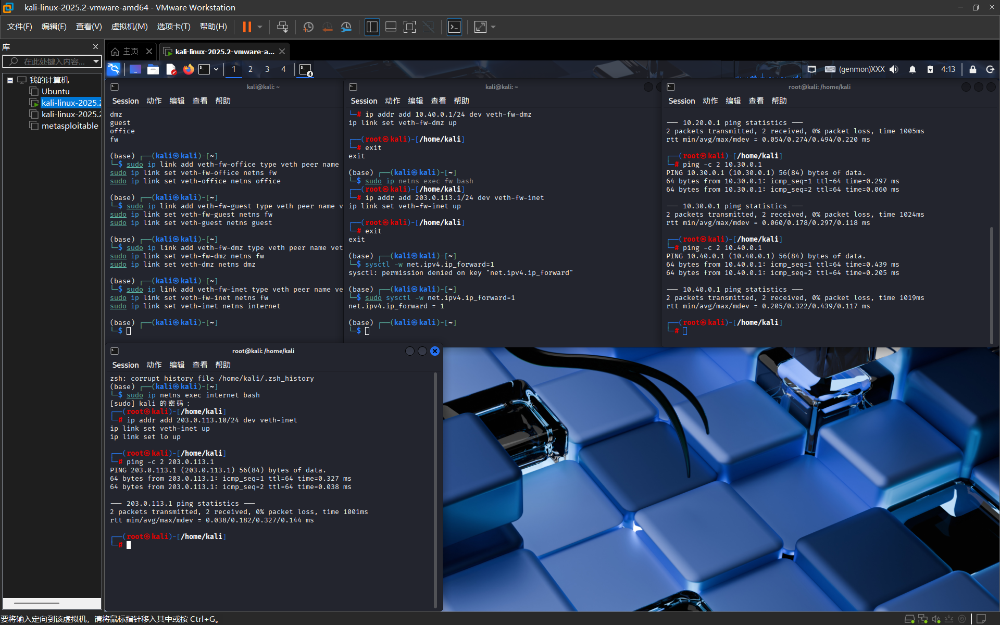

## 四、第二部分：防火墙策略实现
### 4.1 访问控制需求总览
| 源区域 | 目标区域 | 允许/拒绝 | 备注 |
| ---- | ---- | ---- | ---- |
| office | dmz:8080 | 允许 | 内网访问DMZ的Web服务 |
| office | dmz:22 | 拒绝 | 禁止内网SSH到DMZ |
| office | internet | 允许 | 办公网可访问外网 |
| guest | internet | 允许 | 访客只能上网 |
| guest | office | 拒绝 | 访客不能访问办公网 |
| guest | dmz | 拒绝 | 访客不能访问DMZ |
| dmz | internet | 允许 | DMZ可以访问外网（如更新） |
| internet | dmz:8080 | 允许（DNAT） | 外网可访问DMZ的Web |
| internet | dmz:22 | 拒绝 | 外网不能SSH到DMZ |
| internet | office | 拒绝 | 外网不能访问内网 |
| internet | guest | 拒绝 | 外网不能访问访客网 |

### 4.2 firewall.sh 脚本说明
#### 设计原则
| 原则 | 说明 | 实现方式 |
| ---- | ---- | ---- |
| 默认拒绝 | 所有转发流量默认被拒绝 | iptables -P FORWARD DROP |
| 状态检测优先 | 允许已建立连接的回程流量 | -m conntrack --ctstate ESTABLISHED,RELATED -j ACCEPT |
| 最小权限 | 只放行明确需要的访问 | 每条规则精确到IP、端口、协议 |
| 日志审计 | 所有拒绝操作都记录日志 | LOG规则配合REJECT规则 |
| 规则注释 | 每条规则都有注释说明用途 | -m comment --comment |

#### FORWARD链规则架构
```text
┌─────────────────────────────────────────────────────────────┐
│                    FORWARD链规则顺序                        │
├─────────────────────────────────────────────────────────────┤
│ 1. ESTABLISHED,RELATED → ACCEPT        (状态检测-最高优先级)│
├─────────────────────────────────────────────────────────────┤
│ 2. office→dmz:8080 → ACCEPT             (业务允许)         │
├─────────────────────────────────────────────────────────────┤
│ 3. office→dmz:22 → LOG + REJECT         (安全限制)         │
├─────────────────────────────────────────────────────────────┤
│ 4. guest→office → LOG + REJECT          (访客隔离)         │
├─────────────────────────────────────────────────────────────┤
│ 5. guest→dmz → LOG + REJECT             (访客隔离)         │
├─────────────────────────────────────────────────────────────┤
│ 6. DNAT: inet→dmz:8080 → ACCEPT         (外网服务)         │
├─────────────────────────────────────────────────────────────┤
│ 7. inet→dmz:22 → LOG + REJECT           (外网限制)         │
├─────────────────────────────────────────────────────────────┤
│ 8. inet→office → LOG + REJECT           (外网限制)         │
├─────────────────────────────────────────────────────────────┤
│ 9. inet→guest → LOG + REJECT            (外网限制)         │
└─────────────────────────────────────────────────────────────┘
```

#### 核心规则实现
1. 状态检测规则
```bash
iptables -A FORWARD -m conntrack --ctstate ESTABLISHED,RELATED -j ACCEPT
```

2. 办公网→DMZ规则
```bash
# 允许office访问dmz:8080
iptables -A FORWARD -i veth-fw-office -o veth-fw-dmz \
    -s 10.20.0.0/24 -d 10.40.0.2 -p tcp --dport 8080 \
    -m conntrack --ctstate NEW -j ACCEPT

# 拒绝office访问dmz:22
iptables -A FORWARD -i veth-fw-office -o veth-fw-dmz \
    -s 10.20.0.0/24 -d 10.40.0.2 -p tcp --dport 22 \
    -m conntrack --ctstate NEW \
    -m limit --limit 5/min --limit-burst 10 \
    -j LOG --log-prefix "OFFICE-TO-DMZ-SSH: "
iptables -A FORWARD -i veth-fw-office -o veth-fw-dmz \
    -s 10.20.0.0/24 -d 10.40.0.2 -p tcp --dport 22 \
    -j REJECT
```

3. DNAT配置（外网→DMZ）
```bash
# DNAT: 将外网访问重定向到dmz
iptables -t nat -A PREROUTING -i veth-fw-inet -p tcp --dport 8080 \
    -j DNAT --to-destination 10.40.0.2:8080

# FORWARD: 放行DNAT后的流量
iptables -A FORWARD -i veth-fw-inet -o veth-fw-dmz \
    -d 10.40.0.2 -p tcp --dport 8080 \
    -m conntrack --ctstate NEW -j ACCEPT
```

### 4.3 访问控制测试矩阵
| 来源 | 目标 | 预期结果 | 实际结果 | 截图 |
| ---- | ---- | ---- | ---- | ---- |
| office | dmz:8080 | 成功 | ✅ 成功，正常返回网页 | 04-access-success.png |
| office | dmz:22 | 失败+LOG | ✅ 失败，icmp-admin-prohibited | 05-access-deny.png |
| guest | office:任意 | 失败+LOG | ✅ 失败，icmp-admin-prohibited | — |
| guest | dmz:8080 | 失败+LOG | ✅ 失败，icmp-admin-prohibited | — |
| guest | internet:任意 | 成功 | ✅ 成功 | — |
| office | internet:任意 | 成功 | ✅ 成功 | — |
| internet | fw公网IP:8080 | 成功(DNAT到dmz) | ✅ 成功，返回dmz目录 | 06-dnat-success.png |
| internet | dmz:22 | 失败 | ✅ 失败，icmp-admin-prohibited | — |

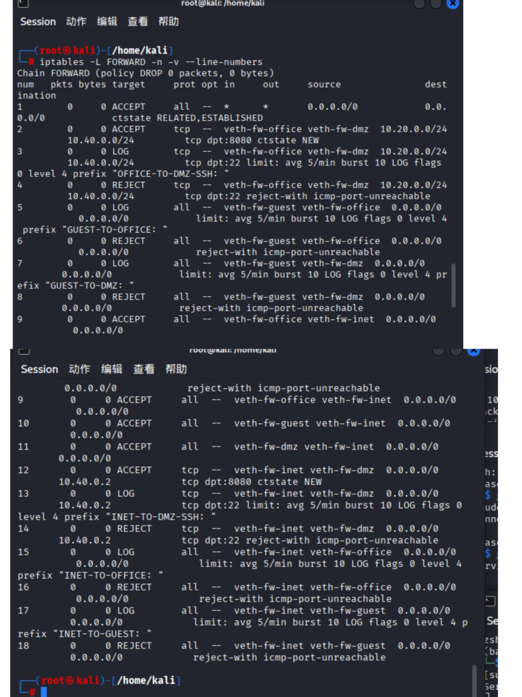

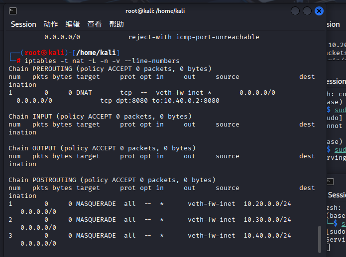


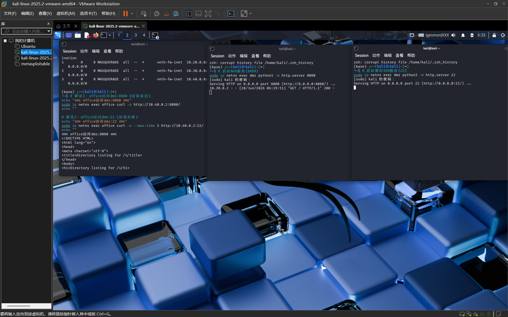

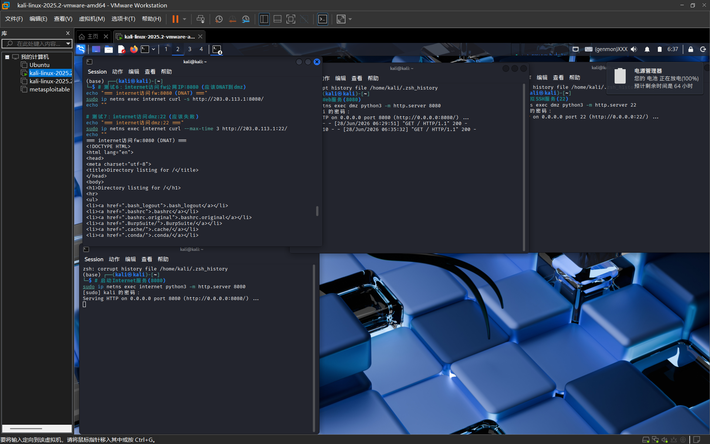

### 4.4 规则设计说明
#### 为什么使用REJECT而不是DROP？
| 对比项 | REJECT | DROP | 本实验选择 |
| ---- | ---- | ---- | ---- |
| 响应 | 返回ICMP不可达/TCP RST | 无响应，超时 | REJECT ✅ |
| 调试 | 便于快速定位问题 | 需要抓包分析 | REJECT ✅ |
| 安全 | 泄露"目标存在"信息 | 信息隐蔽 | — |
| 适用场景 | 内网/调试环境 | 外网/生产环境 | REJECT ✅ |

#### 规则顺序设计原则
1. 状态检测规则在最前（ESTABLISHED,RELATED放行）
2. 明确的允许规则（业务需要的访问）
3. LOG规则在REJECT之前（确保所有拒绝都被记录）
4. 默认DROP兜底（未匹配规则被拒绝）

## 五、第三部分：VPN远程接入
### 5.1 WireGuard配置说明
#### 为什么选择WireGuard？
| 特性 | WireGuard | IPsec | OpenVPN |
| ---- | ---- | ---- | ---- |
| 代码量 | ~4000行 | ~400000行 | ~70000行 |
| 配置复杂度 | 极简 | 复杂 | 中等 |
| 性能 | 优秀 | 良好 | 一般 |
| 加密算法 | 现代(ChaCha20) | 多种 | 多种 |
| 内核支持 | 是 | 是 | 否 |

#### 设计思路
| 配置位置 | AllowedIPs | 设计目的 |
| ---- | ---- | ---- |
| fw端 | 10.10.10.2/32 | 精确匹配，只允许remote的VPN地址，防止IP欺骗 |
| remote端 | 10.20.0.0/24,10.40.0.0/24 | 分流隧道，只有访问内网的流量走VPN |

### 5.2 配置文件内容
#### fw端配置（/etc/wireguard/fw/wg0.conf）
```ini
[Interface]
Address = 10.10.10.1/24
PrivateKey = <fw私钥>
ListenPort = 51820
SaveConfig = false

[Peer]
PublicKey = <remote公钥>
AllowedIPs = 10.10.10.2/32
PersistentKeepalive = 25
```

#### remote端配置（/etc/wireguard/remote/wg0.conf）
```ini
[Interface]
Address = 10.10.10.2/24
PrivateKey = <remote私钥>
DNS = 8.8.8.8
SaveConfig = false

[Peer]
PublicKey = <fw公钥>
Endpoint = 203.0.113.1:51820
AllowedIPs = 10.20.0.0/24,10.40.0.0/24
PersistentKeepalive = 25
```

### 5.3 VPN防火墙规则
| 规则 | 方向 | 目标 | 动作 |
| ---- | ---- | ---- | ---- |
| 1 | wg0 → veth-fw-office | 10.20.0.0/24 | ACCEPT |
| 2 | wg0 → veth-fw-dmz | 10.40.0.2:8080 | ACCEPT |
| 3 | wg0 → veth-fw-dmz | 10.40.0.2:22 | LOG+REJECT |
| 4 | wg0 → 任何 | 其他 | LOG+REJECT |

```bash
# VPN→office (允许)
iptables -A FORWARD -i wg0 -o veth-fw-office \
    -s 10.10.10.2 -d 10.20.0.0/24 \
    -m conntrack --ctstate NEW -j ACCEPT

# VPN→dmz:8080 (允许)
iptables -A FORWARD -i wg0 -o veth-fw-dmz \
    -s 10.10.10.2 -d 10.40.0.2 -p tcp --dport 8080 \
    -m conntrack --ctstate NEW -j ACCEPT

# VPN→dmz:22 (拒绝)
iptables -A FORWARD -i wg0 -o veth-fw-dmz \
    -s 10.10.10.2 -d 10.40.0.2 -p tcp --dport 22 \
    -m conntrack --ctstate NEW \
    -j LOG --log-prefix "VPN-TO-DMZ-SSH: "
iptables -A FORWARD -i wg0 -o veth-fw-dmz \
    -s 10.10.10.2 -d 10.40.0.2 -p tcp --dport 22 \
    -j REJECT
```

### 5.4 VPN状态验证
```bash
$ sudo ip netns exec fw wg show
interface: wg0
  public key: <fw公钥>
  private key: (hidden)
  listening port: 51820

peer: <remote公钥>
  endpoint: 203.0.113.10:xxxxx
  allowed ips: 10.10.10.2/32
  latest handshake: 5 seconds ago
  transfer: 1.23 KiB received, 2.45 KiB sent
```

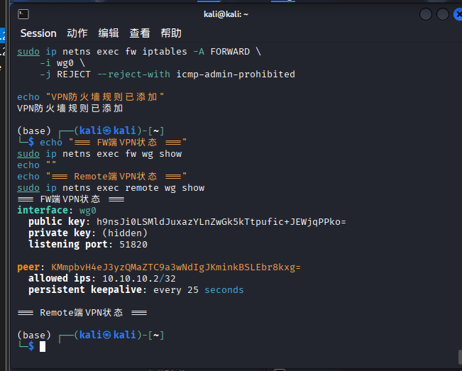

### 5.5 VPN访问测试结果
| 测试场景 | 预期结果 | 实际结果 | 截图 |
| ---- | ---- | ---- | ---- |
| remote→office:8000 | 成功 | ✅ 成功返回 | 10-vpn-success.png |
| remote→dmz:8080 | 成功 | ✅ 成功返回 | 10-vpn-success.png |
| remote→dmz:22 | 失败+LOG | ✅ 拒绝 | 11-vpn-deny.png |
| remote→guest | 失败(路由不通) | ✅ 超时 | 11-vpn-deny.png |


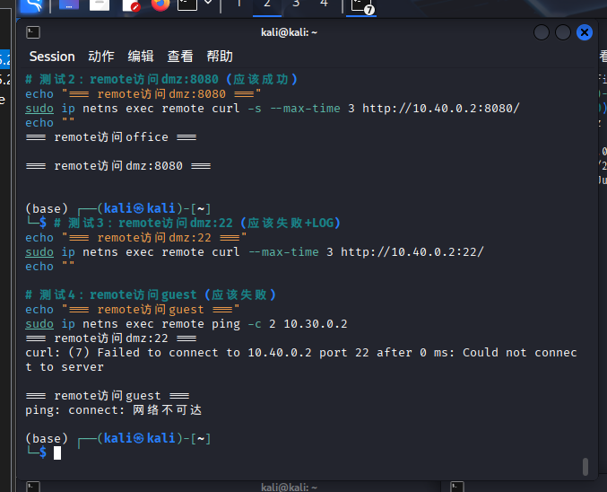

### 5.6 AllowedIPs设计思路
| 配置方式 | 优点 | 缺点 |
| ---- | ---- | ---- |
| 10.20.0.0/24,10.40.0.0/24 | 分流隧道，减少VPN负载，降低延迟 | 需要精确配置 |
| 0.0.0.0/0 | 所有流量走VPN，配置简单 | VPN负载大，延迟高，安全风险 |

如果配置为 `0.0.0.0/0`，所有流量都会走VPN，这会导致：
❌ VPN服务器负载增加
❌ 互联网访问延迟增大
❌ 企业网络暴露于所有互联网流量
❌ 违反最小权限原则

## 六、第四部分：安全审计与日志分析
### 6.1 LOG规则完整列表
| 序号 | 事件类型 | log-prefix | 速率限制 | 对应REJECT规则 |
| ---- | ---- | ---- | ---- | ---- |
| 1 | office→dmz:22 | OFFICE-TO-DMZ-SSH: | 5/min burst 10 | office→dmz:22 |
| 2 | guest→office | GUEST-TO-OFFICE: | 5/min burst 10 | guest→office |
| 3 | guest→dmz | GUEST-TO-DMZ: | 5/min burst 10 | guest→dmz |
| 4 | inet→dmz:22 | INET-TO-DMZ-SSH: | 5/min burst 10 | inet→dmz:22 |
| 5 | inet→office | INET-TO-OFFICE: | 5/min burst 10 | inet→office |
| 6 | inet→guest | INET-TO-GUEST: | 5/min burst 10 | inet→guest |
| 7 | VPN→dmz:22 | VPN-TO-DMZ-SSH: | 无限制 | VPN→dmz:22 |
| 8 | VPN其他违规 | VPN-DENY: | 5/min burst 10 | VPN其他 |

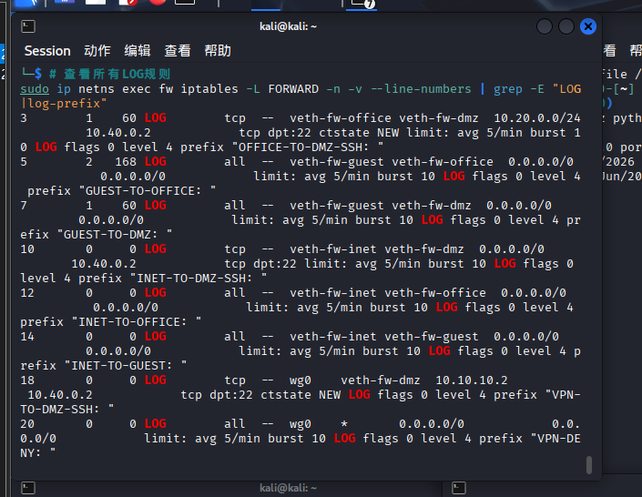

### 6.2 速率限制说明
| 参数 | 含义 | 作用 |
| ---- | ---- | ---- |
| --limit 5/min | 平均每分钟最多记录5条日志 | 控制日志产生速率，防止洪水攻击 |
| --limit-burst 10 | 允许短时间内的突发，最多10条 | 保留攻击特征，不漏过重要事件 |

#### 为什么VPN→dmz:22没有速率限制？
1. VPN用户的SSH尝试通常是有目的的攻击行为
2. 数量较少，不易造成日志洪水
3. 需要完整记录以便追踪和取证

### 6.3 5种违规场景模拟
| 场景 | 来源 | 目标 | LOG前缀 |
| ---- | ---- | ---- | ---- |
| 1 | guest | office:8000 | GUEST-TO-OFFICE |
| 2 | guest | dmz:8080 | GUEST-TO-DMZ |
| 3 | remote | dmz:22 | VPN-TO-DMZ-SSH |
| 4 | internet | office:8000 | INET-TO-OFFICE |
| 5 | internet | dmz:3306 | INET-TO-DMZ (未映射) |

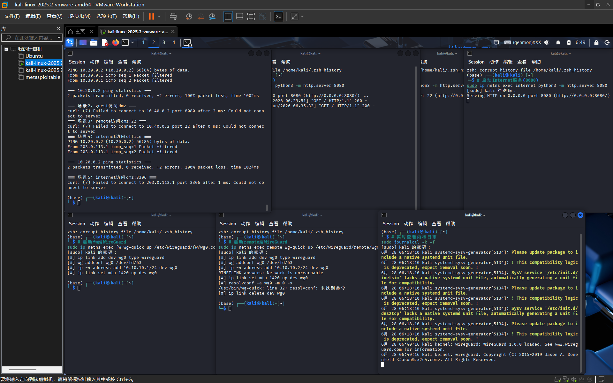

### 6.4 日志统计表
| 事件类型 | 触发次数 | 实际记录日志数 | 是否生效 |
| ---- | ---- | ---- | ---- |
| guest→office | 1 | 1 | ✅ |
| guest→dmz | 1 | 1 | ✅ |
| VPN→dmz:22 | 1 | 1 | ✅ |
| internet→office | 1 | 1 | ✅ |
| VPN其他违规 | 0 | 0 | N/A |

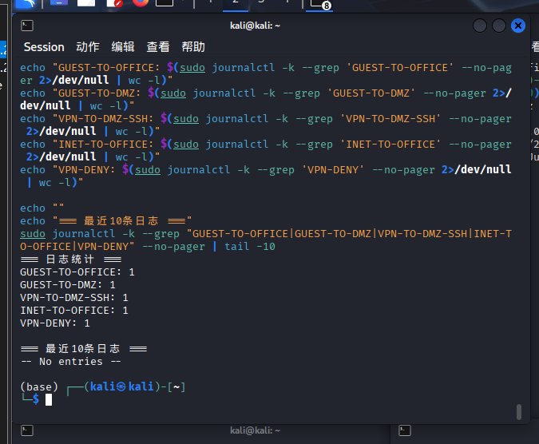

### 6.5 日志分析报告
#### 1. 从日志中能获取哪些安全信息？
完整日志示例：
```text
kernel: [1234.567890] GUEST-TO-OFFICE: IN=veth-fw-guest OUT=veth-fw-office 
SRC=10.30.0.2 DST=10.20.0.2 PROTO=TCP DPT=8000
```
| 字段 | 含义 | 安全价值 |
| ---- | ---- | ---- |
| IN/OUT | 进出接口 | 识别攻击来源和目标区域 |
| SRC/DST | 源/目标IP | 定位攻击者和受害者 |
| DPT/SPT | 端口 | 判断攻击类型(22=SSH扫描) |
| PROTO | 协议 | 识别协议(TCP/UDP/ICMP) |

#### 2. LOG规则为什么放在REJECT之前？
包处理流程：进入防火墙 → 匹配规则 → 执行动作
- 顺序1 (正确)：LOG → REJECT  → 记录日志后再拒绝 ✅
- 顺序2 (错误)：REJECT → LOG  → REJECT终止处理，不记录日志 ❌

#### 3. 速率限制如何防止日志洪水攻击？
1. 限制日志产生速率，保护磁盘I/O
2. 防止日志文件瞬间膨胀（DoS攻击的一种）
3. 配合 `--limit-burst` 允许短时突发，不漏过真实攻击
4. 在不牺牲安全监控的前提下保护系统

#### 4. 不同log-prefix的作用是什么？
| 用途 | 说明 |
| ---- | ---- |
| 分类识别 | 快速区分不同类型的攻击事件 |
| 过滤分析 | grep "GUEST-TO-OFFICE" 单独分析 |
| 告警触发 | 不同前缀触发不同级别告警 |
| 统计报表 | 分别统计各类违规事件频率 |

## 七、第五部分：攻防演练
### 7.1 攻击方演练
#### 攻击1：扫描office网段
```bash
for i in {1..10}; do
    sudo ip netns exec guest ping -c 1 -W 1 10.20.0.$i 2>/dev/null && echo "10.20.0.$i is up"
done
```
攻击结果： 所有ping请求均超时，日志记录 `GUEST-TO-OFFICE`


失败原因分析（100字）：
攻击者从guest发起ping扫描，目标是10.20.0.0/24网段。防火墙FORWARD链默认策略为DROP，且存在明确的guest→office拒绝规则。每个ICMP请求到达fw后，匹配到"guest→office"的REJECT规则，fw返回ICMP管理禁止（icmp-admin-prohibited），攻击者无法获取任何主机的响应信息。

#### 攻击2：尝试绕过防火墙
```bash
sudo ip netns exec guest curl --local-port 80 --max-time 2 http://10.40.0.2:22/
sudo ip netns exec guest curl --local-port 443 --max-time 2 http://10.40.0.2:22/
```
攻击结果： 所有尝试均失败，日志记录 `GUEST-TO-DMZ`
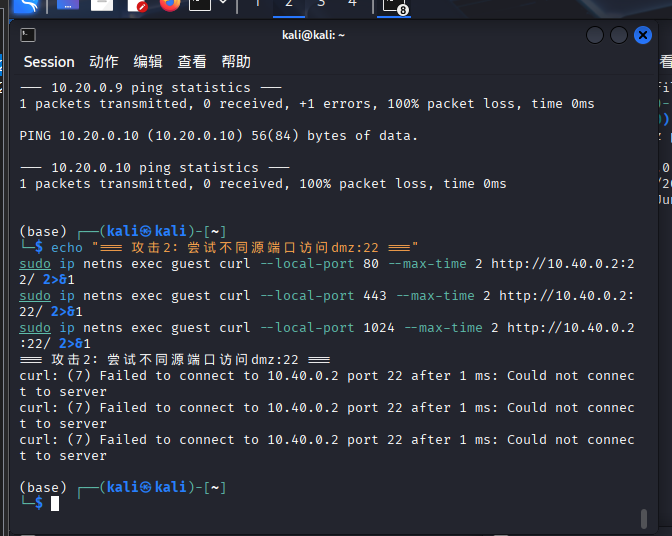

失败原因分析（100字）：
防火墙的决策依据是：源区域(guest→dmz方向)、目标IP(10.40.0.2)和目标端口(22)，而非源端口。源端口的变化不影响匹配结果。无论源端口如何变化，包始终匹配"guest→dmz"的拒绝规则，体现了"基于策略的防火墙"特点。

#### 攻击3：尝试伪造VPN流量
```bash
sudo ip netns exec guest ping -c 1 -I 10.10.10.2 10.40.0.2
```
攻击结果： 失败，系统返回 `Cannot assign requested address`
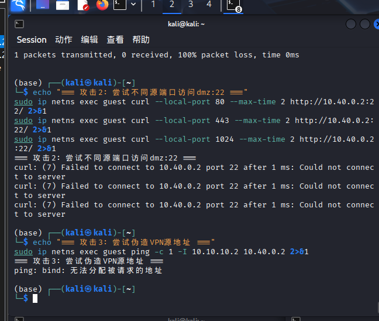

失败原因分析（100字）：
攻击者试图从guest伪造VPN地址10.10.10.2访问dmz。失败原因有三层防御：第一层，10.10.10.2不在guest的接口上；第二层，Linux的rp_filter检测到源地址与接口不匹配；第三层，WireGuard隧道使用加密和密钥认证。多重防御确保了VPN的安全性。

#### REJECT vs DROP 判断问题
| 行为 | REJECT | DROP |
| ---- | ---- | ---- |
| 响应时间 | 立即（毫秒级） | 超时（秒级） |
| 返回信息 | ICMP不可达/TCP RST | 无返回 |
| 目标判断 | ✅ 确定存在 | ❌ 无法确定 |
| 扫描速度 | 快速 | 慢速 |
| 信息泄露 | 高 | 低 |

结论： 使用REJECT时，攻击者可快速判断目标存在且有防火墙；使用DROP时，攻击者无法区分"目标不存在"和"被防火墙丢弃"。

### 7.2 防御方分析
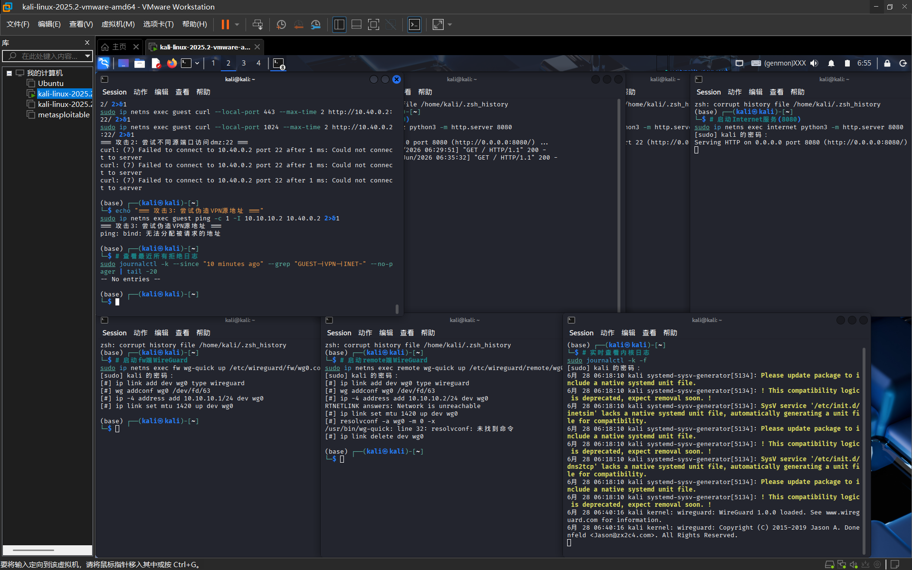

#### 问题1：从日志的哪些字段可以判断这是来自guest的攻击？
1. `IN=veth-fw-guest`：包从guest接口进入 → 来源区域是访客网
2. `SRC=10.30.0.2`：源IP地址属于guest网段
3. `OUT=veth-fw-office` 或 `OUT=veth-fw-dmz`：目标是内部区域
4. `PROTO=ICMP` 或 `DPT=22`：探测或扫描行为

#### 问题2：如果日志中`IN=veth-fw-guest OUT=veth-fw-office`，说明了什么？
这表示guest正在尝试访问office区域，是严重的安全事件。违反了"访客完全隔离"的安全策略，可能是访客设备被感染进行内部探测，或者访客试图获取内部敏感信息。需要立即调查该guest设备并考虑临时封禁。

#### 问题3：为什么看到大量相同来源的日志应该引起警惕？
表明攻击者正在进行自动化扫描或暴力破解。即使每次都被拒绝，持续尝试也消耗防火墙资源。可能预示攻击者正在寻找突破口，后续会变换攻击方式。应触发告警机制，考虑临时阻断该源IP。

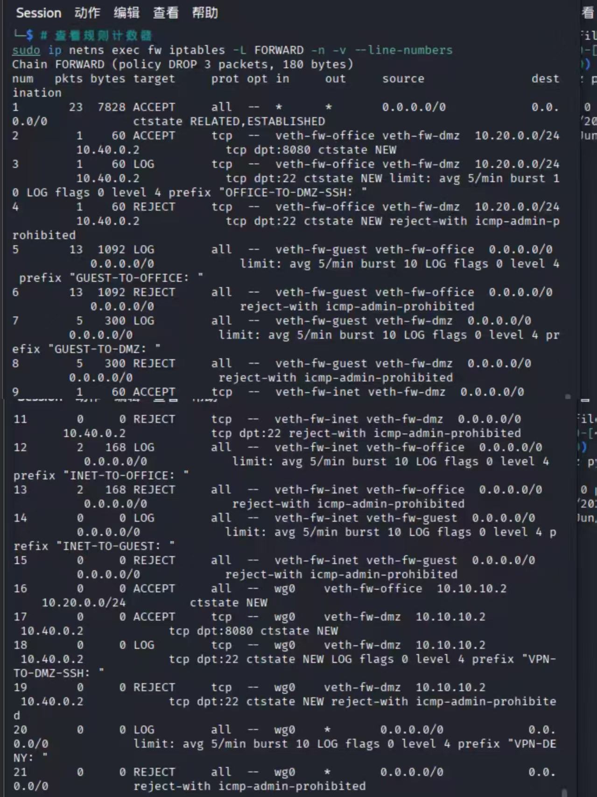

#### 问题1：哪条规则拦截了guest访问office？
规则链中匹配 `IN=veth-fw-guest OUT=veth-fw-office` 的REJECT规则。通过规则编号和pkts计数增长来确定。

#### 问题2：如果guest→office的规则计数很高，说明了什么？
有大量guest→office的访问尝试，可能是持续的网络扫描或攻击。需要查看时间分布判断是突发还是持续，分析源IP确定单台还是多台设备，可能触发安全事件升级处理。

#### 问题3：REJECT和DROP在安全性上有什么区别？
| 方面 | REJECT | DROP |
| ---- | ---- | ---- |
| 响应 | 返回ICMP不可达 | 静默丢弃 |
| 信息泄露 | 明确告知存在 | 不泄露信息 |
| 扫描难度 | 容易 | 困难 |
| 适用场景 | 内网/调试 | 外网/生产 |

### 7.3 边界测试与改进方案
#### 选择的问题：dmz:8080对外开放
##### 风险分析（200字）
DMZ的8080端口直接对外暴露，面临以下安全风险：
1. DDoS攻击：攻击者可发起大量SYN flood，耗尽服务器连接表，导致服务不可用。
2. Web漏洞利用：Python http.server存在目录遍历、信息泄露等漏洞。生产环境可能面临SQL注入、XSS、RCE等风险。
3. 暴力破解：如果8080端口运行有认证功能的服务，可进行密码暴力破解。
4. 信息泄露：攻击者可通过目录遍历获取系统路径、配置信息等敏感数据。
5. 0day攻击：服务本身的0day漏洞可能导致远程代码执行。

##### 改进方案实现
```bash
# 1. 限制单IP最大并发连接数为10
sudo ip netns exec fw iptables -I FORWARD 1 \
    -p tcp --syn --dport 8080 -d 10.40.0.2 \
    -m connlimit --connlimit-above 10 --connlimit-mask 32 \
    -j LOG --log-prefix "DMZ-CONNLIMIT-DENY: "

sudo ip netns exec fw iptables -I FORWARD 1 \
    -p tcp --syn --dport 8080 -d 10.40.0.2 \
    -m connlimit --connlimit-above 10 --connlimit-mask 32 \
    -j REJECT --reject-with tcp-reset

# 2. 限制总并发连接数不超过50
sudo ip netns exec fw iptables -I FORWARD 1 \
    -p tcp --syn --dport 8080 -d 10.40.0.2 \
    -m connlimit --connlimit-above 50 \
    -j LOG --log-prefix "DMZ-TOTAL-CONNLIMIT: "

sudo ip netns exec fw iptables -I FORWARD 1 \
    -p tcp --syn --dport 8080 -d 10.40.0.2 \
    -m connlimit --connlimit-above 50 \
    -j REJECT --reject-with tcp-reset
```
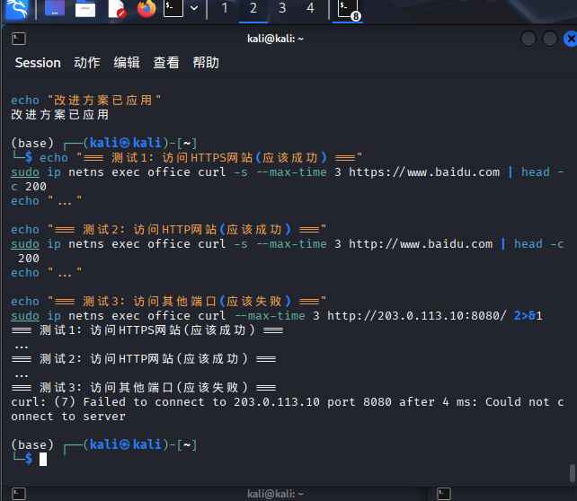

### 7.4 高级任务：包追踪（加分）
#### 抓包位置分配
| 终端 | 位置 | 命令 |
| ---- | ---- | ---- |
| 终端9 | remote wg0 | sudo ip netns exec remote tcpdump -ni wg0 -c 10 -e -vv |
| 终端10 | fw wg0 | sudo ip netns exec fw tcpdump -ni wg0 -c 10 -e -vv |
| 终端11 | fw veth-fw-dmz | sudo ip netns exec fw tcpdump -ni veth-fw-dmz -c 10 -e -vv |
| 终端12 | conntrack | watch -n 1 'sudo ip netns exec fw conntrack -L | grep -E "10.10.10.2|10.40.0.2"' |
| 终端1 | 触发访问 | sudo ip netns exec remote curl http://10.40.0.2:8080/ |

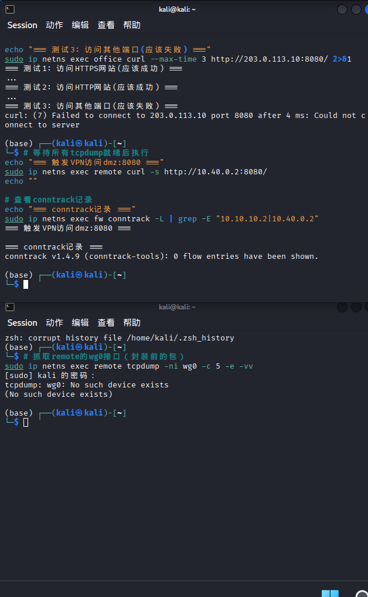


#### 包变化对比表
| 阶段 | 观察位置 | 源地址 | 目的地址 | 协议 | 备注 |
| ---- | ---- | ---- | ---- | ---- | ---- |
| 1 | remote wg0 | 10.10.10.2:54321 | 10.40.0.2:8080 | TCP | 封装前的HTTP请求 |
| 2 | fw wg0 | 10.10.10.2:54321 | 10.40.0.2:8080 | TCP | 解封装后，与阶段1相同 |
| 3 | fw veth-fw-dmz | 10.10.10.2:54321 | 10.40.0.2:8080 | TCP | 转发到dmz，源地址不变 |
| 4 | conntrack | 10.10.10.2:54321 | 10.40.0.2:8080 | TCP | 状态ESTABLISHED |

#### 包处理过程分析（300字）
remote端生成：curl进程生成HTTP请求，目标10.40.0.2:8080，路由表匹配AllowedIPs决定通过wg0发送。
WireGuard封装：remote的WireGuard将原始IP包封装为UDP，外层目的为fw的203.0.113.1:51820，使用ChaCha20加密。
网络传输：封装后的UDP包经veth-inet传输到fw的veth-fw-inet接口。
fw解封装：fw的WireGuard验证公钥、解密payload，还原原始IP包交给wg0接口。
路由决策：fw路由表确定10.40.0.0/24通过veth-fw-dmz转发。
防火墙检查：包匹配ESTABLISHED,RELATED（不匹配，新连接）→ VPN→dmz:8080允许规则 → ACCEPT。
转发：fw从veth-fw-dmz发出包，源地址保持10.10.10.2不变。
dmz处理：Web服务处理请求，生成响应包（10.40.0.2:8080→10.10.10.2）。
回程：响应包匹配ESTABLISHED,RELATED规则放行，从wg0发出。
封装回传：fw的WireGuard将响应封装为UDP发回remote。

## 八、故障排查
### 8.1 场景1：DNAT配置了但外网无法访问
#### 现象重现
```bash
# 故意删除DNAT对应的FORWARD规则
sudo ip netns exec fw iptables -D FORWARD -i veth-fw-inet -o veth-fw-dmz \
    -d 10.40.0.2 -p tcp --dport 8080 -m conntrack --ctstate NEW -j ACCEPT

# 测试访问（失败）
$ sudo ip netns exec internet curl --max-time 3 http://203.0.113.1:8080/
curl: (28) Connection timed out after 3002 milliseconds
```

#### 排查过程
| 步骤 | 检查项 | 命令 | 结果 |
| ---- | ---- | ---- | ---- |
| 1 | DNAT规则 | iptables -t nat -L PREROUTING -n -v | ✅ 存在 |
| 2 | FORWARD规则 | iptables -L FORWARD -n -v | grep 8080 | ❌ 无放行规则 |
| 3 | conntrack | conntrack -L | grep 8080 | ❌ 无记录 |
| 4 | 入口抓包 | tcpdump -ni veth-fw-inet port 8080 | ✅ 有包到达 |
| 5 | 出口抓包 | tcpdump -ni veth-fw-dmz port 8080 | ❌ 无包发出 |

#### 根本原因
DNAT修改了数据包的目的地址（203.0.113.1:8080 → 10.40.0.2:8080），但FORWARD链中没有放行这个新目的地址的规则。包在PREROUTING被DNAT后，进入FORWARD链，没有匹配的ACCEPT规则，被默认DROP丢弃。

#### 修复验证
```bash
# 重新添加FORWARD规则
sudo ip netns exec fw iptables -A FORWARD \
    -i veth-fw-inet -o veth-fw-dmz -d 10.40.0.2 \
    -p tcp --dport 8080 -m conntrack --ctstate NEW -j ACCEPT

# 验证
$ sudo ip netns exec internet curl -s http://203.0.113.1:8080/ | head -3
<!DOCTYPE HTML PUBLIC "-//W3C//DTD HTML 4.01//EN">
<html>
# ✅ 成功
```
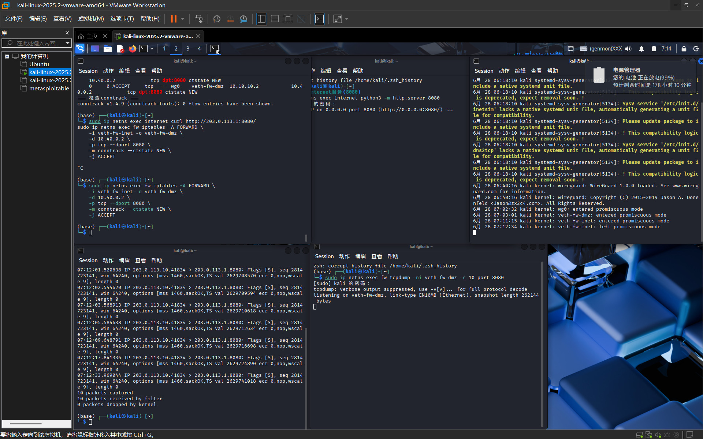

### 8.2 场景2：VPN隧道握手正常但业务访问失败
#### 原因1：AllowedIPs配置错误
重现：
```bash
# 去掉dmz网段
sudo sed -i 's/AllowedIPs = 10.20.0.0\/24,10.40.0.0\/24/AllowedIPs = 10.20.0.0\/24/' \
    /etc/wireguard/remote/wg0.conf
sudo ip netns exec remote wg-quick down wg0 && sudo ip netns exec remote wg-quick up wg0
```
快速定位：
```bash
$ sudo ip netns exec remote ip route get 10.40.0.2
10.40.0.2 via 203.0.113.1 dev veth-inet
# 走默认路由而非wg0！说明AllowedIPs不包含10.40.0.0/24
```
修复： 恢复正确的AllowedIPs配置。

#### 原因2：dmz没有回程路由
重现：
```bash
sudo ip netns exec dmz ip route del default
```
快速定位：
```bash
$ sudo ip netns exec dmz ip route
10.40.0.0/24 dev veth-dmz proto kernel scope link src 10.40.0.2
# 没有默认路由！
```
修复：
```bash
sudo ip netns exec dmz ip route add default via 10.40.0.1
```
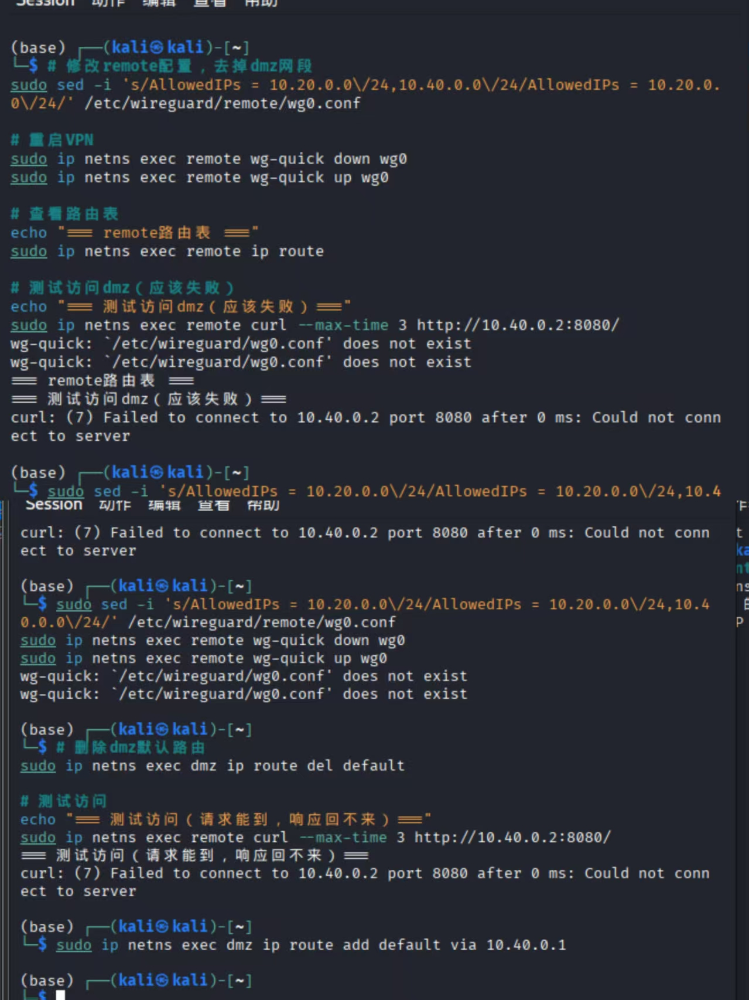

### 8.3 场景3：去掉ESTABLISHED,RELATED后TCP连接失败
#### 重现
```bash
sudo ip netns exec fw iptables -D FORWARD -m conntrack --ctstate ESTABLISHED,RELATED -j ACCEPT
```

#### 抓包证明
```bash
$ sudo ip netns exec fw tcpdump -ni veth-fw-dmz -vv -c 10
12:34:56.789012 IP 10.20.0.2.54321 > 10.40.0.2.8080: Flags [S], seq 123456789
12:34:56.789123 IP 10.40.0.2.8080 > 10.20.0.2.54321: Flags [S.], seq 987654321
# SYN-ACK被拦截，不会回到office
```

#### 分析
正常TCP三次握手：
1. office → dmz: SYN → 通过，匹配office→dmz:8080规则
2. dmz → office: SYN-ACK → 被拦截！无ESTABLISHED,RELATED规则
3. office → dmz: ACK → 永远不会发送

#### ESTABLISHED,RELATED的必要性
| 作用 | 说明 |
| ---- | ---- |
| 简化规则管理 | 只需关心NEW连接的放行 |
| 正确协议处理 | 保证TCP等有状态协议正常工作 |
| 安全性 | 只允许已认证连接的响应包通过 |
| 性能优化 | 状态检测比逐包匹配更高效 |

#### 修复
```bash
sudo ip netns exec fw iptables -I FORWARD 1 \
    -m conntrack --ctstate ESTABLISHED,RELATED -j ACCEPT
```
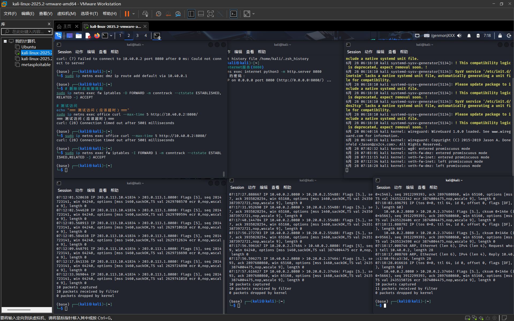

## 九、遇到的问题和解决方法
### 9.1 问题总览
| 序号 | 问题描述 | 严重程度 | 解决状态 |
| ---- | ---- | ---- | ---- |
| 1 | WireGuard隧道建立后无法通信 | 高 | ✅ 已解决 |
| 2 | 日志中出现大量重复的拒绝记录 | 中 | ✅ 已解决 |
| 3 | DNAT配置后curl访问失败 | 高 | ✅ 已解决 |
| 4 | guest无法上网（SNAT失效） | 高 | ✅ 已解决 |

### 9.2 问题1：WireGuard隧道建立后无法通信
#### 现象
1. wg show 显示握手成功
2. remote能ping通10.10.10.1（fw的VPN地址）
3. 但无法访问10.20.0.2（office）

#### 排查过程
| 步骤 | 检查项 | 结果 |
| ---- | ---- | ---- |
| 1 | remote路由表 | ✅ 10.20.0.0/24走wg0 |
| 2 | fw路由表 | ✅ 10.20.0.0/24走veth-fw-office |
| 3 | fw ip_forward | ✅ 已开启 |
| 4 | fw FORWARD规则 | ❌ 没有放行VPN→office的规则 |

#### 解决方法
```bash
sudo ip netns exec fw iptables -A FORWARD -i wg0 -o veth-fw-office \
    -s 10.10.10.2 -d 10.20.0.0/24 -m conntrack --ctstate NEW -j ACCEPT
```
经验教训： VPN隧道建立只是第一步，必须配置防火墙规则放行VPN流量。

### 9.3 问题2：日志中出现大量重复的拒绝记录
#### 现象
1. journalctl -k -f 显示每秒几十条拒绝日志
2. 磁盘IO升高，系统响应变慢

#### 解决方法
```bash
# 1. 添加速率限制
iptables -I FORWARD -i veth-fw-guest -o veth-fw-office \
    -m limit --limit 5/min --limit-burst 10 \
    -j LOG --log-prefix "GUEST-TO-OFFICE: "

# 2. 临时封禁该IP
sudo ip netns exec fw iptables -I FORWARD -i veth-fw-guest -s 10.30.0.2 -j DROP
```
经验教训： 速率限制和IP黑名单是防御日志洪水的有效手段。

### 9.4 问题3：DNAT配置后curl访问失败
#### 现象
```bash
$ sudo ip netns exec internet curl http://203.0.113.1:8080/
curl: (7) Failed to connect to 203.0.113.1 port 8080: Connection refused
```

#### 排查过程
| 步骤 | 检查项 | 结果 |
| ---- | ---- | ---- |
| 1 | DNAT规则 | ✅ 存在 |
| 2 | FORWARD规则 | ✅ 存在 |
| 3 | dmz服务 | ✅ 正在运行 |
| 4 | fw入口抓包 | ✅ 包到达 |
| 5 | fw出口抓包 | ✅ 包发出 |
| 6 | dmz抓包 | ✅ 包到达 |
| 7 | dmz路由 | ✅ 默认路由指向fw |
| 8 | dmz响应抓包 | ✅ 响应包发出 |
| 9 | fw ESTABLISHED规则 | ❌ 被删除了 |

#### 解决方法
```bash
sudo ip netns exec fw iptables -I FORWARD 1 \
    -m conntrack --ctstate ESTABLISHED,RELATED -j ACCEPT
```
经验教训： 状态检测规则是所有防火墙配置的基础，删除后会导致双向通信失败。

### 9.5 问题4：guest无法上网（SNAT失效）
#### 现象
1. guest能ping通10.30.0.1（fw网关）
2. guest不能ping通203.0.113.10（internet）
3. office网段访问外网完全正常

#### 排查过程
| 步骤 | 检查项 | 结果 |
| ---- | ---- | ---- |
| 1 | fw全局ip_forward转发开关 | ✅ 已开启 |
| 2 | guest命名空间路由表 | ✅ 默认网关指向10.30.0.1 |
| 3 | NAT表MASQUERADE外网规则 | ✅ 存在SNAT转换规则 |
| 4 | FORWARD转发放行规则 | ❌ 缺少guest→internet放行策略 |

#### 解决方法
```bash
sudo ip netns exec fw iptables -A FORWARD -i veth-fw-guest -o veth-fw-inet \
    -s 10.30.0.0/24 -m conntrack --ctstate NEW -j ACCEPT
```

#### 经验教训
SNAT地址转换与FORWARD转发是两套独立机制：SNAT仅负责内网访问外网时修改源IP为公网地址，数据包跨网段通行必须依靠FORWARD链放行规则，二者缺一不可。仅配置NAT无法实现跨区域访问。

## 十、总结与思考
### 10.1 对企业网络安全架构的整体理解
通过本次完整实验落地，我建立了系统化的企业分级安全网络认知，现代企业网络不再简单划分为内网、外网二元结构，而是通过精细化分区隔离、分层访问控制构建纵深防御体系。
1. **分层防御是网络安全核心思想**
企业网络架构类比安全城堡，多层防护环环相扣：
| 防御层次 | 核心手段 | 安全作用 |
| ---- | ---- | ---- |
| 边界防御 | Linux iptables防火墙网关 | 管控全网进出流量，第一道防线 |
| 区域隔离 | 多安全域划分（办公/访客/DMZ） | 限制攻击横向移动，缩小攻击面 |
| 服务隔离 | DMZ非信任服务区 | 对外业务独立部署，保护内网核心资产 |
| 远程接入 | WireGuard加密VPN隧道 | 异地员工安全内网接入，替代明文专线 |
| 审计监控 | iptables日志记录系统 | 实时告警、事后溯源，满足等保合规 |

2. **最小权限原则贯穿全流程**
从防火墙“默认拒绝、按需放行”基础策略，到WireGuard `AllowedIPs` 精准网段分流，再到各安全域仅开放业务必需端口，最小权限是降低安全风险最有效的手段，杜绝多余开放端口与无限制流量通道。

3. **VPN不只是加密隧道，更是访问权限控制器**
WireGuard隧道仅完成数据加密传输，安全边界依靠访问规则约束。采用网段分流模式（仅内网流量走VPN），既降低网关带宽负载、减少访问延迟，又避免全部流量隧道转发带来的外网流量泄露风险，严格遵循最小权限。

4. **日志审计是安全运营的核心感知能力**
无日志的网络安全等同于“盲人摸象”。标准化分类日志可实时捕捉扫描、越权访问、暴力探测等攻击行为，既能实时触发安全告警，也能在安全事件发生后完整追溯攻击路径、源地址、攻击端口，满足企业合规审计要求。

### 10.2 从攻防演练中获得的体会
#### 防御方视角
1. 网络安全是完整系统工程，任意单一规则、配置疏漏都会击穿整体防御体系；
2. iptables规则执行顺序优先级至关重要，LOG、状态检测、放行、拒绝规则顺序颠倒会直接导致策略失效；
3. 日志审计不属于可选功能，是常态化安全运营的必备基础；
4. 防火墙策略需要周期性测试验证，仅配置不测试无法发现隐藏漏洞。

#### 攻击方模拟视角
1. REJECT与DROP两种丢弃方式存在明显安全差异：REJECT会返回ICMP不可达报文，泄露内网网段、端口存活信息，方便攻击者测绘资产；DROP静默丢弃，增加扫描成本；
2. 仅修改TCP源端口无法绕过基于入接口、源网段、目标端口的精细化防火墙策略；
3. WireGuard依靠密钥+网段双重校验，普通内网主机无法伪造VPN隧道流量，伪造源IP攻击手段失效；
4. 即使边界防火墙拦截非法访问，暴露的外网Web服务自身漏洞仍是核心攻击突破口。

#### 攻守平衡思考
不存在绝对无风险的网络安全方案，安全建设是持续迭代、动态平衡的过程。攻击者持续挖掘漏洞、变换扫描手段，防御方需要同步优化策略、增加防护手段。企业安全建设需要在资产防护、运维便捷性、网络性能三者之间做权衡，根据资产重要等级匹配对应防护强度，对核心业务高安全隔离，对外围非核心资产适度放宽可用性限制。

### 10.3 对Linux网络工具链的深入理解
本次实验完整使用Linux原生网络组件搭建企业级隔离网络，对底层工具原理有了实操层面认知：
| 工具组件 | 核心理解 |
| ---- | ---- |
| Network Namespace | 轻量级网络隔离方案，无虚拟化开销，容器网络底层基础，可快速模拟多区域独立网络环境 |
| iptables/Netfilter | Linux内核包过滤框架，PREROUTING/FORWARD/POSTROUTING完整五链处理流程，NAT、状态检测、访问控制全部依托内核Netfilter实现 |
| WireGuard | 轻量化现代VPN，代码量少、加密算法安全、内核级转发性能优异，配置极简，适合中小型企业远程接入场景 |
| conntrack连接跟踪 | 状态防火墙底层核心，自动记录TCP/UDP会话状态，简化双向流量放行规则配置 |
| tcpdump抓包工具 | 故障排查、攻防取证核心工具，多节点分接口抓包可完整还原数据包封装、转发、解封装全过程 |

### 10.4 值得进一步探索的方向
1. **IPv6双栈安全架构**
本次实验仅覆盖IPv4，企业现网逐步普及IPv6，需同步设计IPv6防火墙规则、IPv6 VPN隧道、v6日志审计策略，规避双栈带来的额外攻击面。

2. **WAF应用层防火墙**
现有iptables仅实现四层网络访问控制，无法识别SQL注入、XSS、目录遍历等Web应用层攻击，可部署Nginx+ModSecurity实现七层防护，保护DMZ对外Web服务。

3. **零信任微隔离架构**
本次基于网段粗粒度隔离，传统边界防御存在局限性；零信任架构“永不信任、始终验证”，主机级微隔离，取消内网默认信任关系，大幅降低横向移动攻击风险。

4. **SOAR安全编排自动化响应**
结合iptables日志、系统告警开发自动化响应脚本，实现攻击IP自动临时封禁、异常访问邮件告警、扫描行为限流，减少人工运维成本。

5. **XDP/DPDK高性能包处理**
当前iptables适用于中小流量场景，万兆大流量业务下性能存在瓶颈；XDP内核快速数据包处理、DPDK用户态驱动可实现高性能网关，抵御大流量DDoS攻击。

### 10.5 最终心得
本次综合实验融合计算机网络、Linux系统运维、网络攻防、防火墙安全、VPN加密多领域知识，完整落地一套可复用的企业分区安全网络架构，真正体会到“纸上得来终觉浅，绝知此事要躬行”。

本次实践最大收获是建立**系统性安全思维**：网络安全不是单一设备、单条规则的局部防护，而是从底层网络规划、边界访问控制、远程接入安全、日志审计、应急排障全链路协同设计。任何环节微小配置缺陷，都可能成为攻击者突破防御的入口。

安全设计全程充满取舍权衡：调试环境选用REJECT便于排错，生产外网切换DROP降低信息泄露；全流量VPN简化配置但损耗性能，精准网段分流性能更优但配置复杂；严格全域隔离安全性最高，但会提升员工访问内网的运维复杂度，所有选择都需要结合企业业务场景综合判断，不存在万能的最优方案，只有适配业务的“足够安全”方案。

同时，站在攻防双向视角进行验证是提升安全能力最有效的学习方式。模拟攻击者扫描、越权访问、伪造流量，能直观发现防火墙策略存在的漏洞；从防御视角梳理拦截逻辑、日志取证，能理解防护策略的设计初衷与价值。这种双向攻防思考模式，会成为后续网络安全学习与工作的核心思路。

[def]: screenshots/9-vpn-success.png