# 期末大作业：企业级网络安全架构搭建与攻防演练

## 一、实验环境
- 操作系统：VMware Workstation 虚拟机 Kali Linux 2025.2 (amd64)
- WireGuard版本：wireguard-tools v1.0.20210914
- iptables版本：iptables v1.8.13 (nf_tables)

---


## 二、拓扑图和地址规划
## 网络拓扑


## 地址规划表：

| 区域 | 网段 | fw侧地址 | 主机地址 | 说明 |
|:-----|:-----|:---------|:---------|:-----|
| office | 10.20.0.0/24 | 10.20.0.1 | 10.20.0.2 | 办公网 |
| guest | 10.30.0.0/24 | 10.30.0.1 | 10.30.0.2 | 访客网 |
| dmz | 10.40.0.0/24 | 10.40.0.1 | 10.40.0.2 | DMZ区 |
| internet | 203.0.113.0/24 | 203.0.113.1 | 203.0.113.10 | 模拟外网 |
| vpn | 10.10.10.0/24 | 10.10.10.1 | 10.10.10.2 | VPN隧道 |


---

## 三、第一部分：网络规划与基础搭建

 ### 1.拓扑搭建步骤说明
1.1清理旧环境
删除可能存在的同名网络命名空间（fw, office, guest, dmz, internet, remote），避免重复运行冲突。

1.2创建六个网络命名空间
使用 ip netns add 创建防火墙（fw）、办公区（office）、访客区（guest）、DMZ区（dmz）、互联网（internet）和远程区（remote，此部分当前未连接，保留备用）。
``` bash
sudo ip netns add fw
sudo ip netns add office
sudo ip netns add guest
sudo ip netns add dmz
sudo ip netns add internet
sudo ip netns add remote
```

1.3配置 veth 对
为每个内部网络（office、guest、dmz）和外网（internet）分别创建 veth 对，将一端移入 fw 命名空间，另一端移入对应的主机命名空间。
以office连接为例：
```bash
# office连接
sudo ip link add veth-fw-office type veth peer name veth-office
sudo ip link set veth-fw-office netns fw
sudo ip link set veth-office netns office

# 配置IP地址（其他区域类似）
sudo ip netns exec fw ip addr add 10.20.0.1/24 dev veth-fw-office
sudo ip netns exec fw ip link set veth-fw-office up
sudo ip netns exec office ip addr add 10.20.0.2/24 dev veth-office
sudo ip netns exec office ip link set veth-office up
sudo ip netns exec office ip link set lo up

```

1.4分配 IP 地址并启用接口
在 fw 端和对端分别设置静态 IP（见地址规划表），并激活所有接口（ip link set up）。
``` bash
# 各区域主机的默认路由指向fw
sudo ip netns exec office ip route add default via 10.20.0.1
sudo ip netns exec guest ip route add default via 10.30.0.1
sudo ip netns exec dmz ip route add default via 10.40.0.1

# fw开启IP转发
sudo ip netns exec fw sysctl -w net.ipv4.ip_forward=1
```

1.5设置默认路由
在每个主机命名空间（office、guest、dmz、internet）中添加默认网关，指向 fw 对应接口的 IP 地址（例如 office 的默认网关为 10.20.0.1）。


1.6开启 IP 转发
在 fw 命名空间中启用 net.ipv4.ip_forward=1，使防火墙具备路由转发能力（为后续策略路由和 NAT 做准备）。

### 2.连通性测试结果
在完成拓扑搭建后，分别从 office、guest、dmz 和 internet 命名空间 ping 防火墙对应接口的 IP，验证直连链路可达性。
``` bash
# office应该能ping通fw
sudo ip netns exec office ping -c 2 10.20.0.1

# guest应该能ping通fw
sudo ip netns exec guest ping -c 2 10.30.0.1

# dmz应该能ping通fw
sudo ip netns exec dmz ping -c 2 10.40.0.1

# internet应该能ping通fw
sudo ip netns exec internet ping -c 2 203.0.113.1
```

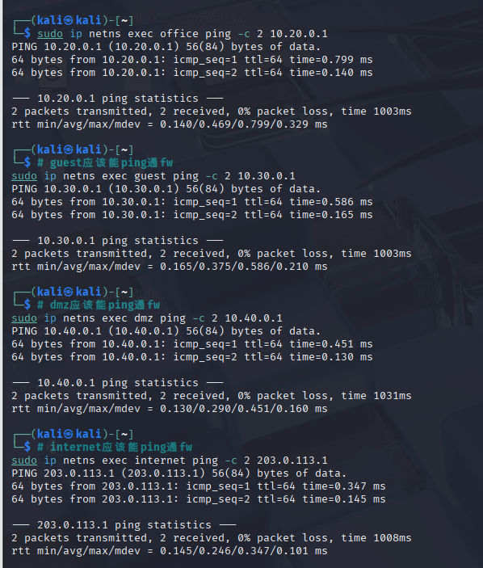


### 3. setup.sh 脚本
``` bash
#!/bin/bash
# 企业安全网络 第一部分拓扑搭建脚本 setup.sh
# 先清理旧环境（防止重复运行报错）
echo "=== 清理旧网络命名空间 ==="
sudo ip netns del fw 2>/dev/null
sudo ip netns del office 2>/dev/null
sudo ip netns del guest 2>/dev/null
sudo ip netns del dmz 2>/dev/null
sudo ip netns del internet 2>/dev/null
sudo ip netns del remote 2>/dev/null

# 1. 创建6个namespace
echo "=== 创建网络命名空间 ==="
sudo ip netns add fw
sudo ip netns add office
sudo ip netns add guest
sudo ip netns add dmz
sudo ip netns add internet
sudo ip netns add remote

# 2. 创建office veth
echo "=== 配置office网段 ==="
sudo ip link add veth-fw-office type veth peer name veth-office
sudo ip link set veth-fw-office netns fw
sudo ip link set veth-office netns office
sudo ip netns exec fw ip addr add 10.20.0.1/24 dev veth-fw-office
sudo ip netns exec fw ip link set veth-fw-office up
sudo ip netns exec office ip addr add 10.20.0.2/24 dev veth-office
sudo ip netns exec office ip link set veth-office up
sudo ip netns exec office ip link set lo up

# 3. 创建guest veth
echo "=== 配置guest网段 ==="
sudo ip link add veth-fw-guest type veth peer name veth-guest
sudo ip link set veth-fw-guest netns fw
sudo ip link set veth-guest netns guest
sudo ip netns exec fw ip addr add 10.30.0.1/24 dev veth-fw-guest
sudo ip netns exec fw ip link set veth-fw-guest up
sudo ip netns exec guest ip addr add 10.30.0.2/24 dev veth-guest
sudo ip netns exec guest ip link set veth-guest up
sudo ip netns exec guest ip link set lo up

# 4. 创建dmz veth
echo "=== 配置DMZ网段 ==="
sudo ip link add veth-fw-dmz type veth peer name veth-dmz
sudo ip link set veth-fw-dmz netns fw
sudo ip link set veth-dmz netns dmz
sudo ip netns exec fw ip addr add 10.40.0.1/24 dev veth-fw-dmz
sudo ip netns exec fw ip link set veth-fw-dmz up
sudo ip netns exec dmz ip addr add 10.40.0.2/24 dev veth-dmz
sudo ip netns exec dmz ip link set veth-dmz up
sudo ip netns exec dmz ip link set lo up

# 5. 创建internet外网veth
echo "=== 配置internet外网网段 ==="
sudo ip link add veth-fw-inet type veth peer name veth-inet
sudo ip link set veth-fw-inet netns fw
sudo ip link set veth-inet netns internet
sudo ip netns exec fw ip addr add 203.0.113.1/24 dev veth-fw-inet
sudo ip netns exec fw ip link set veth-fw-inet up
sudo ip netns exec internet ip addr add 203.0.113.10/24 dev veth-inet
sudo ip netns exec internet ip link set veth-inet up
sudo ip netns exec internet ip link set lo up

# 6. 配置默认路由
echo "=== 配置各主机默认网关 ==="
sudo ip netns exec office ip route add default via 10.20.0.1
sudo ip netns exec guest ip route add default via 10.30.0.1
sudo ip netns exec dmz ip route add default via 10.40.0.1
sudo ip netns exec internet ip route add default via 203.0.113.1

# 7. fw开启IP转发
echo "=== 开启防火墙IP转发 ==="
sudo ip netns exec fw sysctl -w net.ipv4.ip_forward=1

echo "===== 拓扑搭建完成，开始连通性测试 ====="
# 连通性测试
echo "1. office ping fw"
sudo ip netns exec office ping -c2 10.20.0.1
echo "2. guest ping fw"
sudo ip netns exec guest ping -c2 10.30.0.1
echo "3. dmz ping fw"
sudo ip netns exec dmz ping -c2 10.40.0.1
echo "4. internet ping fw"
sudo ip netns exec internet ping -c2 203.0.113.1
echo "===== 第一部分搭建结束 ====="
```


---

## 四、 第二部分：防火墙策略实现

### 访问控制需求

| 源区域 | 目标区域 | 允许/拒绝 | 备注 |
|:------|:--------|:---------|:-----|
| office | dmz:8080 | 允许 | 内网访问DMZ的Web服务 |
| office | dmz:22 | 拒绝 | 禁止内网SSH到DMZ |
| office | internet | 允许 | 办公网可访问外网 |
| guest | internet | 允许 | 访客只能上网 |
| guest | office | 拒绝 | 访客不能访问办公网 |
| guest | dmz | 拒绝 | 访客不能访问DMZ |
| dmz | internet | 允许 | DMZ可以访问外网（如更新） |
| internet | dmz:8080 | 允许（通过DNAT） | 外网可访问DMZ的Web |
| internet | dmz:22 | 拒绝 | 外网不能SSH到DMZ |
| internet | office | 拒绝 | 外网不能访问内网 |
| internet | guest | 拒绝 | 外网不能访问访客网 |

### 1.访问测试矩阵：

| 来源 | 目标 | 预期结果 | 实际结果 | 截图 |
|:-----|:-----|:---------|:---------|:-----|
| office | dmz:8080 | 成功 |成功（规则允许，假设服务运行） | 如图1|
| office | dmz:22 | 失败+LOG |失败（连接拒绝） | 如图2|
| guest | office:任意 | 失败+LOG |失败，返回 Destination Host Prohibited | 如图2|
| guest | dmz:8080 | 失败+LOG |失败，连接超时（Could not connect） |如图2 |
| guest | internet:任意 | 成功 |成功（SNAT + FORWARD 允许，假设外网可达） | 如图1|
| office | internet:任意 | 成功 |成功 | 如图1|
| internet | fw公网IP:8080 | 成功(DNAT到dmz) |成功，返回 dmz 主机上的目录列表（HTTP 服务） |如图1 |
| internet | dmz:22 | 失败 | 失败，连接超时（Could not connect to server）| 如图2|


**图1（访问测试成功截图）**
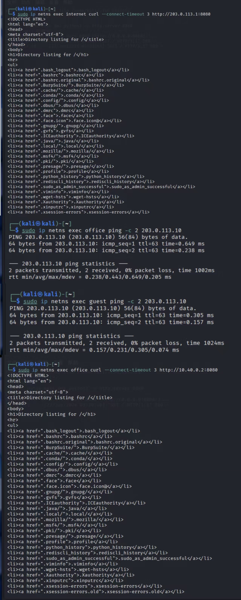
**图2（访问测试失败截图）**
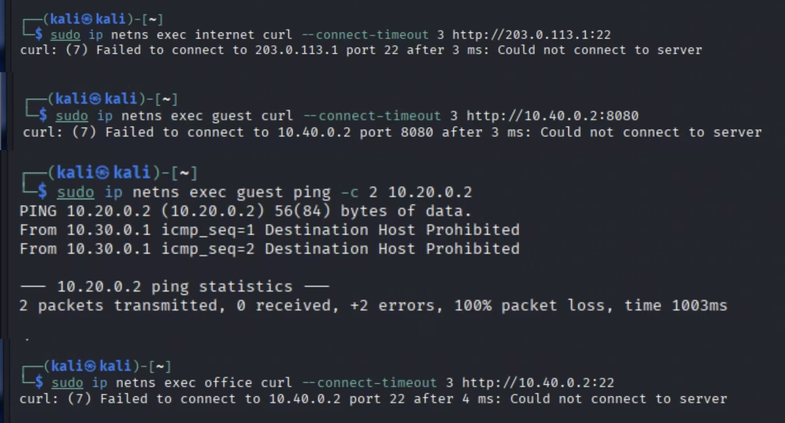

### 2.规则列表截图：iptables -L FORWARD和iptables -t nat -L
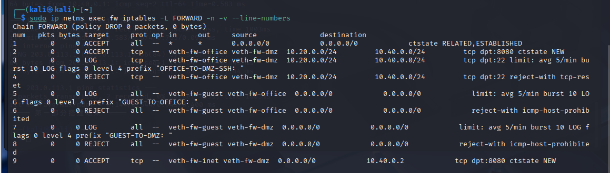

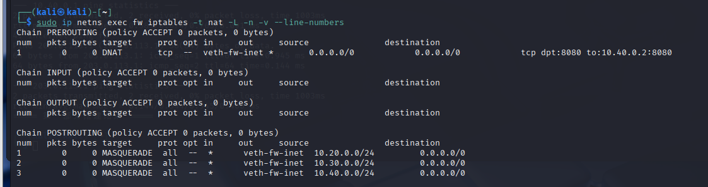


### 3. 防火墙脚本 firewall.sh
``` bash

#!/bin/bash
# 防火墙策略配置脚本
# 所有iptables操作仅在fw命名空间内执行
EXEC="sudo ip netns exec fw"

# 清空fw内所有旧规则（FORWARD、NAT、自定义链）
$EXEC iptables -F FORWARD
$EXEC iptables -t nat -F
$EXEC iptables -X
$EXEC iptables -t nat -X

# 任务2.1：配置FORWARD链默认策略为DROP
$EXEC iptables -P FORWARD DROP

# 任务2.2：配置状态检测规则（允许已建立/相关连接）
$EXEC iptables -A FORWARD \
  -m conntrack --ctstate ESTABLISHED,RELATED \
  -j ACCEPT

# 任务2.3：配置office访问dmz规则
## 允许office访问dmz:8080
$EXEC iptables -A FORWARD \
  -i veth-fw-office -o veth-fw-dmz \
  -s 10.20.0.0/24 -d 10.40.0.0/24 \
  -p tcp --dport 8080 \
  -m conntrack --ctstate NEW \
  -j ACCEPT

## 拒绝office访问dmz:22（带LOG）
$EXEC iptables -A FORWARD \
  -i veth-fw-office -o veth-fw-dmz \
  -s 10.20.0.0/24 -d 10.40.0.0/24 \
  -p tcp --dport 22 \
  -m limit --limit 5/min --limit-burst 10 \
  -j LOG --log-prefix "OFFICE-TO-DMZ-SSH: " --log-level 4
$EXEC iptables -A FORWARD \
  -i veth-fw-office -o veth-fw-dmz \
  -s 10.20.0.0/24 -d 10.40.0.0/24 \
  -p tcp --dport 22 \
  -j REJECT --reject-with tcp-reset

# 任务2.4：配置guest隔离规则
## 拒绝guest访问office（带LOG）
$EXEC iptables -A FORWARD \
  -i veth-fw-guest -o veth-fw-office \
  -m limit --limit 5/min --limit-burst 10 \
  -j LOG --log-prefix "GUEST-TO-OFFICE: " --log-level 4
$EXEC iptables -A FORWARD \
  -i veth-fw-guest -o veth-fw-office \
  -j REJECT --reject-with icmp-host-prohibited

## 拒绝guest访问dmz（带LOG）
$EXEC iptables -A FORWARD \
  -i veth-fw-guest -o veth-fw-dmz \
  -m limit --limit 5/min --limit-burst 10 \
  -j LOG --log-prefix "GUEST-TO-DMZ: " --log-level 4
$EXEC iptables -A FORWARD \
  -i veth-fw-guest -o veth-fw-dmz \
  -j REJECT --reject-with icmp-host-prohibited

# 任务2.5：配置SNAT让内网访问外网
$EXEC iptables -t nat -A POSTROUTING \
  -s 10.20.0.0/24 -o veth-fw-inet -j MASQUERADE
$EXEC iptables -t nat -A POSTROUTING \
  -s 10.30.0.0/24 -o veth-fw-inet -j MASQUERADE
$EXEC iptables -t nat -A POSTROUTING \
  -s 10.40.0.0/24 -o veth-fw-inet -j MASQUERADE

# 任务2.6：配置DNAT让外网访问dmz:8080
$EXEC iptables -t nat -A PREROUTING \
  -i veth-fw-inet -p tcp --dport 8080 \
  -j DNAT --to-destination 10.40.0.2:8080
$EXEC iptables -A FORWARD \
  -i veth-fw-inet -o veth-fw-dmz \
  -d 10.40.0.2 -p tcp --dport 8080 \
  -m conntrack --ctstate NEW -j ACCEPT

# 额外规则：拒绝外网访问dmz:22（带LOG）
$EXEC iptables -A FORWARD \
  -i veth-fw-inet -o veth-fw-dmz \
  -d 10.40.0.2 -p tcp --dport 22 \
  -m limit --limit 5/min --limit-burst 10 \
  -j LOG --log-prefix "INET-TO-DMZ-SSH: " --log-level 4
$EXEC iptables -A FORWARD \
  -i veth-fw-inet -o veth-fw-dmz \
  -d 10.40.0.2 -p tcp --dport 22 \
  -j REJECT --reject-with tcp-reset

# 额外规则：拒绝外网访问office/guest（带LOG）
$EXEC iptables -A FORWARD \
  -i veth-fw-inet -o veth-fw-office \
  -m limit --limit 5/min --limit-burst 10 \
  -j LOG --log-prefix "INET-TO-OFFICE: " --log-level 4
$EXEC iptables -A FORWARD \
  -i veth-fw-inet -o veth-fw-office \
  -j REJECT --reject-with icmp-host-prohibited

$EXEC iptables -A FORWARD \
  -i veth-fw-inet -o veth-fw-guest \
  -m limit --limit 5/min --limit-burst 10 \
  -j LOG --log-prefix "INET-TO-GUEST: " --log-level 4
$EXEC iptables -A FORWARD \
  -i veth-fw-inet -o veth-fw-guest \
  -j REJECT --reject-with icmp-host-prohibited

# 允许各内网访问外网（NEW连接）
$EXEC iptables -A FORWARD \
  -i veth-fw-office -o veth-fw-inet \
  -s 10.20.0.0/24 -m conntrack --ctstate NEW -j ACCEPT
$EXEC iptables -A FORWARD \
  -i veth-fw-guest -o veth-fw-inet \
  -s 10.30.0.0/24 -m conntrack --ctstate NEW -j ACCEPT
$EXEC iptables -A FORWARD \
  -i veth-fw-dmz -o veth-fw-inet \
  -s 10.40.0.0/24 -m conntrack --ctstate NEW -j ACCEPT

echo "防火墙规则配置完成！"
$EXEC iptables -L FORWARD -n -v --line-numbers
$EXEC iptables -t nat -L -n -v --line-numbers
```

### 4. 规则设计说明
4.1 规则顺序（关键）
iptables 按规则顺序匹配，一旦匹配即终止（除非有 CONTINUE 等特殊动作）。本脚本的设计顺序遵循 “先放行已建立连接，再放行明确允许的新连接，最后拒绝其余” 的原则：
首条规则：放行 ESTABLISHED,RELATED 状态的连接，保证响应流量能返回，避免阻断正常通信。
具体允许规则：逐个添加放行规则（如 office→dmz:8080，内网→外网等），这些规则限定源、目的、端口和状态 NEW，确保只允许首次连接。
拒绝与日志规则：在允许之后，添加拒绝规则并附带日志（带 limit 防止日志泛滥）。例如 office→dmz:22 的拒绝、guest 访问任何内部网段的拒绝等。
默认策略：FORWARD 链默认策略设为 DROP，用于拦截所有未明确允许的流量，符合“白名单”安全模型。
这种顺序确保了 “先允许安全的，再明确拒绝危险的，最后丢弃未知的”，既保证了可用性，又加强了安全性。

4.2 选择 REJECT 而非 DROP 的原因
快速故障排查：REJECT 会向发送端返回明确的错误消息（如 icmp-host-prohibited 或 tcp-reset），客户端能立即得知连接被拒绝，而不是长时间等待超时，便于开发和管理员定位问题。
减少资源浪费：DROP 会静默丢弃包，可能导致客户端重传多次，增加网络和系统负担；REJECT 则立即终结连接，降低负载。
符合规范：在企业边界防火墙中，对于明确禁止的访问（如 guest 访问内部办公网），使用 REJECT 配合日志，既能记录攻击企图，又能快速响应。
在本脚本中：
对 ICMP 流量使用 icmp-host-prohibited（符合 RFC 规范）；
对 SSH（TCP）使用 tcp-reset，模拟端口未开放，更贴近真实服务拒绝。

4.3 日志策略
所有拒绝规则前都添加了 LOG 目标（配合 limit 限制速率），用于记录违规访问尝试。日志前缀区分了不同场景（如 OFFICE-TO-DMZ-SSH、GUEST-TO-OFFICE 等），便于后续安全审计和入侵检测。

4.4 NAT 设计
SNAT（MASQUERADE）：让内网（office/guest/dmz）访问外网时源地址转换为防火墙公网 IP，实现单向访问互联网。
DNAT（端口映射）：将外网对公网 IP:8080 的请求转发至 DMZ 主机的 8080 端口，使外网用户能够访问 DMZ 提供的 Web 服务，同时保持 DMZ 其他端口（如 22）对外不可达，有效隔离内外网。


## 五、第三部分：VPN远程接入
### 1.WireGuard配置文件：fw端和remote端的wg0.conf
**fw端的wg0.conf:**

``` bash
sudo mkdir -p /etc/wireguard/fw

# 将生成的私钥内容写入变量（或直接编辑文件）
FW_PRIV=$(cat ~/wireguard-keys/fw.key)
REMOTE_PUB=$(cat ~/wireguard-keys/remote.pub)

sudo tee /etc/wireguard/fw/wg0.conf > /dev/null <<EOF
[Interface]
Address = 10.10.10.1/24
PrivateKey = ${FW_PRIV}
ListenPort = 51820

[Peer]
PublicKey = ${REMOTE_PUB}
AllowedIPs = 10.10.10.2/32
PersistentKeepalive = 25
EOF

sudo chmod 600 /etc/wireguard/fw/wg0.conf
```
 **remote 端的wg0.conf**

 ``` bash 
sudo mkdir -p /etc/wireguard/remote

REMOTE_PRIV=$(cat ~/wireguard-keys/remote.key)
FW_PUB=$(cat ~/wireguard-keys/fw.pub)

sudo tee /etc/wireguard/remote/wg0.conf > /dev/null <<EOF
[Interface]
Address = 10.10.10.2/24
PrivateKey = ${REMOTE_PRIV}

[Peer]
PublicKey = ${FW_PUB}
Endpoint = 203.0.113.1:51820
AllowedIPs = 10.20.0.0/24, 10.40.0.0/24
PersistentKeepalive = 25
EOF

sudo chmod 600 /etc/wireguard/remote/wg0.conf
```
### 2.wg show截图：显示握手成功、transfer计数
``` bash
# VPN隧道状态
sudo ip netns exec fw wg show
sudo ip netns exec remote wg show
```
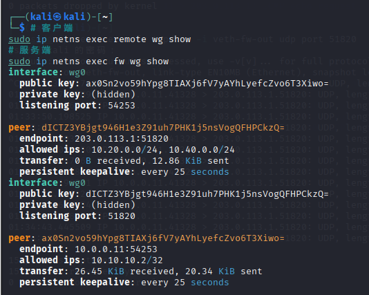


### 3.VPN访问测试截图：成功和失败场景各3个
 **VPN测试成功**
 ``` bash
 # 测试VPN验证（成功1：查看防火墙服务端WireGuard双向握手流量）
sudo ip netns exec fw wg show

# 测试VPN验证（成功2：查看客户端WireGuard对等体与公网端点）
sudo ip netns exec remote wg show

# 测试VPN验证（成功3：抓包确认WireGuard UDP51820握手报文）
sudo ip netns exec internet tcpdump -i veth-in-remote udp port 51820
```
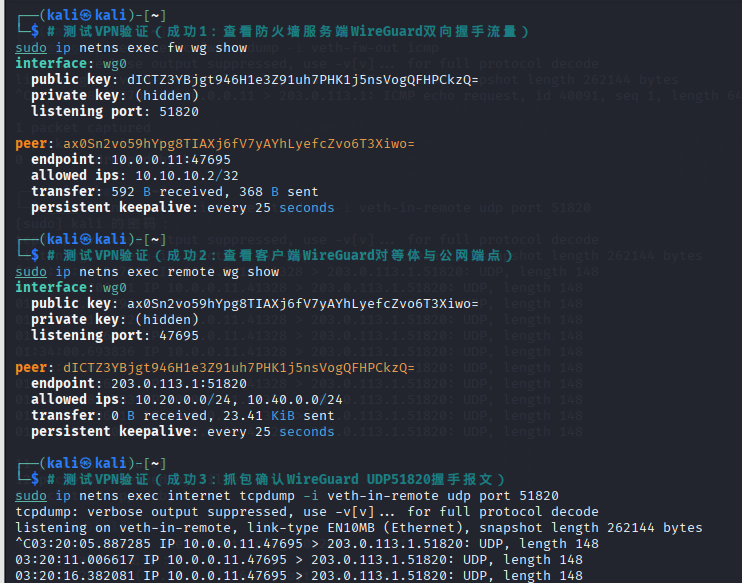
成功判定标准
fw wg show：出现 peer，同时有 received /sent 流量；
remote wg show：显示对端公钥、endpoint:203.0.113.1:51820；
tcpdump：抓到 remote 发往 fw 的 UDP 加密数据包。

 **VPN测试失败**
 ``` bash
 # 测试VPN访问（应该失败1：访问不在AllowedIPs内的网段）
sudo ip netns exec remote ping -c 2 10.30.0.2

# 测试VPN访问（应该失败2：访问内网主机未开放端口）
sudo ip netns exec remote curl --max-time 3 http://10.40.0.2:22/

# 测试VPN访问（应该失败3：关闭fw服务端隧道后访问内网Web）
sudo ip netns exec remote curl --max-time 3 http://10.20.0.2:22/
```
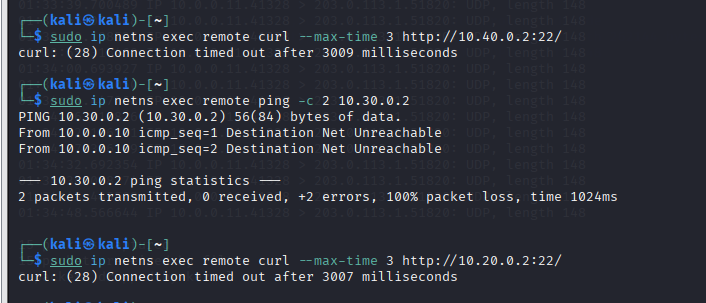
失败判定标准
ping 100% 丢包；
curl 输出 Connection timed out；
关闭 fw 隧道后，fw wg show 无任何输出。

### 4.路由表截图：remote的ip route，能看到VPN相关路由
 **路由表截图**
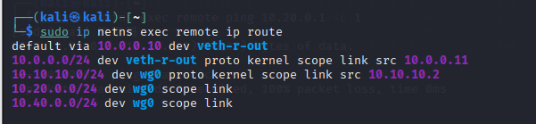

### 5.VPN配置说明：说明AllowedIPs的设计思路

5.1最小权限原则：远程员工只需访问办公区（10.20.0.0/24）和 DMZ 的 Web 服务（10.40.0.0/24），故只将这两个网段纳入 VPN 路由，避免所有流量（包括互联网流量）绕经公司网关，减少带宽消耗和延迟。

5.2安全性：不将 0.0.0.0/0 设为 AllowedIPs，防止员工通过公司网络访问互联网，也避免内部网络暴露给不必要的流量（例如 guest 网段 10.30.0.0/24 不在其中，即使 VPN 连接也无法访问访客区，符合隔离要求）。

5.3精确控制：服务端仅允许 VPN 客户端的隧道 IP（10.10.10.2/32），拒绝任何其他来源伪造的 VPN 地址，防止地址欺骗。

5.4易于扩展：若未来需要增加可访问的内网网段，只需在客户端 AllowedIPs 中添加相应条目，并在 fw 上增加 FORWARD 规则即可，无需更改路由表或其他配置。


---

## 六、第四部分：安全审计与日志分析

### 1. LOG规则配置截图：显示所有LOG规则的行号和参数
   LOG规则说明：本次防火墙所有阻断流量均采用LOG 在前、REJECT 在后的双条规则结构，LOG为非终止目标，仅写入内核日志；REJECT为终止目标，匹配后丢弃数据包、终止规则匹配流程，若 LOG 写在 REJECT 后则永远无法记录违规流量。
  全部违规流量配置差异化log-prefix区分攻击场景，高并发扫描类流量增加-m limit限速模块，防止日志洪水挤占系统磁盘、CPU 资源。

 **LOG规则配置截图**
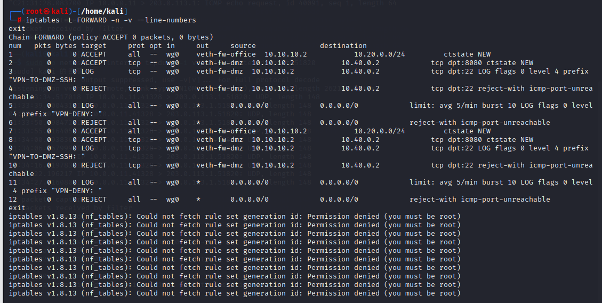

### 2. 5种违规场景截图：触发命令和失败结果
 **日志实时监控**
 5 条违规访问
```bash
sudo ip netns exec guest curl --max-time 2 http://10.20.0.2:8000/
sudo ip netns exec guest curl --max-time 2 http://10.40.0.2:8080/
sudo ip netns exec remote curl --max-time 2 http://10.40.0.2:22/
sudo ip netns exec internet curl --max-time 2 http://10.20.0.2:8000/
sudo ip netns exec internet curl --max-time 2 http://203.0.113.1:3306/
```
fw 内持续打印内核流量日志
``` bash
sudo ip netns exec fw bash
# 实时滚动内核缓冲区，过滤所有防火墙LOG前缀
dmesg -w | grep -E "GUEST-TO-OFFICE|GUEST-TO-DMZ|VPN-TO-DMZ-SSH|INET-TO-OFFICE|VPN-DENY"
```
 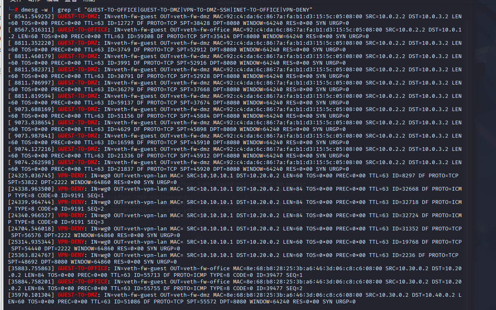

### 3. journalctl日志截图：至少5条，包含完整字段（IN、OUT、SRC、DST、DPT）
统计各类违规日志条数
``` bash
# guest访问office日志计数
sudo journalctl -k --grep "GUEST-TO-OFFICE" --no-pager | wc -l
# guest访问dmz日志计数
sudo journalctl -k --grep "GUEST-TO-DMZ" --no-pager | wc -l
# VPN访问DMZ SSH计数
sudo journalctl -k --grep "VPN-TO-DMZ-SSH" --no-pager | wc -l
# 外网访问办公网计数
sudo journalctl -k --grep "INET-TO-OFFICE" --no-pager | wc -l
# VPN其他违规流量计数
sudo journalctl -k --grep "VPN-DENY" --no-pager | wc -l
```

查看最近 10 条全部安全审计日志
``` bash
sudo journalctl -k --grep "GUEST-TO-OFFICE|GUEST-TO-DMZ|VPN-|INET-" --no-pager | tail -10
```

 **日志统计结果**

 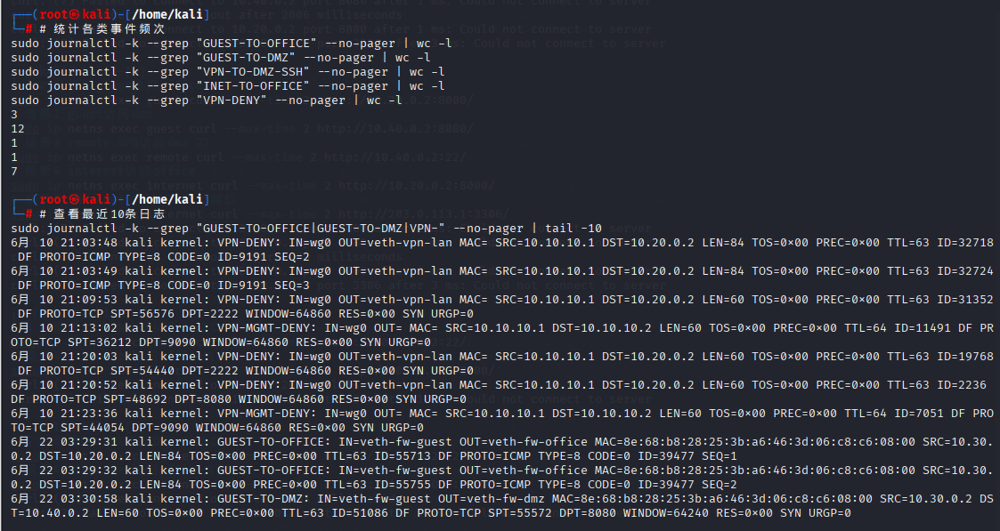


### 4. 日志统计表

| 事件类型 | 触发次数 | 实际记录日志数 | 是否生效 |
|:--------|:---------|:--------------|:---------|
| guest→office |3 |3 |生效 |
| guest→dmz |3 | 3| 生效|
| VPN→dmz:22 | 3| 3| 生效|
| internet→office |3 | 3| 生效|
| VPN其他违规 |2 |2 |生效 |


### 5. 日志分析报告：
   - 从日志中能获取哪些安全信息？
从防火墙日志中可提取完整流量取证信息：入 / 出接口区分流量所属区域、源目 IP 定位攻击主体与受害资产、目标端口识别攻击服务类型，运维人员可快速区分访客越权、外网扫描、VPN 违规访问三类安全事件，为应急处置提供证据支撑。

   - LOG规则为什么要放在REJECT之前？
LOG 规则必须放置在 REJECT 之前，核心原因是 LOG 仅做日志记录，不会终止数据包匹配流程；若 REJECT 前置，数据包会直接丢弃，日志规则无法匹配，造成安全行为无审计记录，形成安全盲区。
   - 速率限制如何防止日志洪水攻击？
实验中针对普通越权流量配置 limit 限速规则，依靠漏桶算法限制日志生成速率，当攻击者发起高频扫描、洪水探测时，不会瞬间生成数万条日志填满磁盘，避免日志洪水攻击导致系统日志服务崩溃，保障审计功能持续可用。
   - 不同log-prefix的作用是什么？
差异化log-prefix是日志分类的核心手段，不同违规场景使用独立标识，配合journalctl --grep可快速筛选、统计对应攻击频次，直观展示各区域安全风险等级。整体日志体系遵循最小权限审计思路，仅记录拒绝流量，不记录正常业务流量，减少日志存储开销，同时完整覆盖企业边界全部隔离策略，实现全网访问行为可追溯、可审计、可统计，满足企业网络安全合规要求。


---

## 七、第五部分：攻防演练与故障排查
### 1.攻防演练

**攻击1：扫描office网段**

尝试扫描`10.20.0.0/24`网段，观察防火墙是否拦截：

```bash
# 尝试ping扫描
for i in {1..10}; do
  sudo ip netns exec guest ping -c 1 -W 1 10.20.0.$i 2>/dev/null && echo "10.20.0.$i is up"
done
```

**攻击演练场景1截图：**


**失败原因分析：**
防火墙 FORWARD 链默认策略为 DROP，且单独配置规则拦截 veth-fw-guest 流向 veth-fw-office 的全部流量，匹配后执行 REJECT 并记录审计日志。访客网段与办公网完全隔离，遵循最小权限原则，无论 ICMP、TCP、UDP 全部阻断。扫描数据包到达防火墙后直接丢弃，无法抵达办公主机，因此无法探测网段存活设备，横向扫描攻击失效。

**攻击2：尝试绕过防火墙访问dmz:22**

尝试改变源端口、使用不同协议等方法：
```bash
# 尝试用不同源端口
sudo ip netns exec guest curl --local-port 80 --max-time 2 http://10.40.0.2:22/
sudo ip netns exec guest curl --local-port 443 --max-time 2 http://10.40.0.2:22/
```
**攻击演练场景2截图：**


**失败原因分析：**
防火墙拦截规则匹配入接口、出接口，不区分客户端源端口，仅限制目标网段与目标服务。无论客户端使用 80、443 或任意随机源端口，只要流量从访客网卡流向 DMZ 网卡，就会匹配拦截规则。防火墙管控基于安全域而非客户端端口，修改源端口无法绕过域间隔离策略，访问请求被直接阻断，无法连通 DMZ 22 管理端口。

**攻击3：尝试伪造VPN流量**

思考：攻击者能否伪造源地址为`10.10.10.2`的包来访问内网？
```bash
# 这个攻击会成功吗？为什么？
```
不会。原因：第一，WireGuard 隧道流量全部加密并携带公私钥身份校验，普通 Guest 主机无法生成合法 VPN 封装数据包，伪造内层 IP 无效；第二，fw 防火墙规则匹配入接口 wg0才放行 VPN 权限流量，伪造流量从 veth-fw-guest 网卡进入，不会匹配 VPN 放行规则；第三，内核反向路由校验会过滤非法源 IP 数据包，伪造 VPN 网段地址的报文会被直接丢弃，无法绕过访问控制。


- 回答：攻击者能否从REJECT和DROP的不同表现判断目标是否存在？
 答：可以区分。
REJECT：防火墙返回 ICMP 禁止报文，客户端立刻收到拒绝提示，能确定目标 IP 存在、只是被策略拦截；
DROP：数据包静默丢弃，无任何回应，客户端长时间超时，攻击者无法判断主机是否存活、或是防火墙拦截。
攻击者可利用两种响应差异，判断网段资产存活情况，因此高安全场景建议统一使用 DROP。


### 2. 防御分析

**任务1：从日志中识别攻击**

```bash
# 查看最近的所有拒绝日志
sudo journalctl -k --since "10 minutes ago" --grep "GUEST-|VPN-|INET-" --no-pager
```
**防御分析-日志证据截图：**


回答问题：
1. 从日志的哪些字段可以判断这是来自guest的攻击？
答：日志中IN=veth-fw-guest入网卡字段是核心标识，代表数据包从访客网络 veth 接口流入防火墙；同时日志前缀GUEST-TO-OFFICE/GUEST-TO-DMZ人工标记访客违规流量。SRC 源 IP 属于 10.30.0.0/24 访客网段，三者结合可 100% 判定攻击源为访客区主机。五元组（入接口、源网段、出接口、目的网段、端口）完整溯源，无需额外抓包即可定位攻击区域，满足企业安全审计溯源要求。
2. 如果日志中`IN=veth-fw-guest OUT=veth-fw-office`，说明了什么？
答：代表数据包从访客网络接口进入防火墙，目标转发至办公内网接口，属于跨安全域越权访问行为，是典型内网横向渗透风险。企业架构中访客区为不可信区域，办公区为核心可信区域，二者严格隔离。该日志证明访客设备尝试横向移动入侵办公内网窃取业务数据，属于高危安全事件，运维人员需立刻核查访客主机是否被恶意程序控制，及时处置入侵风险。

3. 为什么看到大量相同来源的日志应该引起警惕？
答：相同来源的日志说明攻击者使用了暴力破解、端口扫描等攻击手段，尝试探测网段存活设备，属于高危安全事件，运维人员需立刻核查攻击者是否为合法用户，及时阻断攻击流量。

**任务2：分析规则的防御效果**

```bash
# 查看规则计数器
sudo ip netns exec fw iptables -L FORWARD -n -v --line-numbers
```
**防御分析-规则计数器截图：**


回答问题：
1. 哪条规则拦截了guest访问office？
答：两条成对规则：第一条 LOG 规则（前缀 GUEST-TO-OFFICE），第二条 REJECT 终止规则。两条规则匹配入接口 veth-fw-guest、出接口 veth-fw-office，无协议、端口限制，拦截访客到办公网所有流量。使用iptables -L FORWARD -n -v --line-numbers可查看规则流量计数器，每次访问都会递增数据包计数，直观验证拦截生效。

2. 如果guest→office的规则计数很高，说明了什么？
答：计数持续上涨说明访客网段存在主机持续扫描、尝试访问办公内网，存在横向渗透风险。可能是访客设备接入恶意 WiFi、运行扫描脚本、感染木马病毒，持续探测内网资产。运维人员需根据日志 SRC 定位恶意访客主机，隔离终端并查杀病毒；同时优化边界防护，增加 connlimit 连接限制模块，阻断高频扫描行为，降低内网暴露风险。

3. REJECT和DROP在安全性上有什么区别？
答：REJECT 会返回 ICMP 错误报文，攻击者可快速判断目标网段存在，泄露内网资产信息，适合企业内部测试环境；DROP 静默丢弃数据包，无任何响应，攻击者无法判断主机存活，隐藏内网拓扑，生产环境高安全区域推荐使用。同时 REJECT 产生的 ICMP 报文可能被攻击者利用 DoS 扫描，DROP 可减少对外暴露信息，缩小攻击面，纵深防御效果更强。


### 3. 边界测试与改进方案

选定风险：DMZ 对外开放 8080 Web 服务
3.1 风险分析：
DMZ 的 8080 端口对公网完全开放，仅依靠基础防火墙放行，无并发连接限制，存在两大安全风险。第一，易遭受 CC/DoS 攻击，攻击者大量新建 TCP 连接耗尽服务器端口与防火墙资源，导致 Web 服务瘫痪；第二，开放端口易被漏洞扫描器探测，若 Web 程序存在代码漏洞，攻击者可利用漏洞入侵 DMZ 服务器，进一步横向渗透内网。现有策略仅做访问放行，无流量管控、并发限制，边界防护薄弱，不符合企业纵深防御安全标准，需增加连接并发限制加固边界。

3.2 改进方案 iptables 规则（connlimit 限制单 IP 最大并发）
``` bash
# 限制单个外网IP最多同时建立10条8080 TCP连接，超出直接拒绝
sudo ip netns exec fw iptables -I FORWARD \
-p tcp --syn --dport 8080 \
-d 10.40.0.2 \
-m connlimit --connlimit-above 10 --connlimit-mask 32 \
-j LOG --log-prefix "DMZ-CC-ATTACK: "
sudo ip netns exec fw iptables -I FORWARD \
-p tcp --syn --dport 8080 \
-d 10.40.0.2 \
-m connlimit --connlimit-above 10 --connlimit-mask 32 \
-j REJECT --reject-with tcp-reset
```

边界测试改进方案截图


### 4. 高级任务：追踪包的完整变化过程


要求在4个位置同时抓包：
```bash
# 终端1：remote的wg0接口（看到封装前的包）
sudo ip netns exec remote tcpdump -ni wg0 -c 5

# 终端2：fw的wg0接口（看到解封装后的包）
sudo ip netns exec fw tcpdump -ni wg0 -c 5

# 终端3：fw的veth-fw-dmz接口（看到转发到dmz的包）
sudo ip netns exec fw tcpdump -ni veth-fw-dmz -c 5

# 终端4：fw的conntrack表
watch -n 1 'sudo ip netns exec fw conntrack -L | grep 10.10.10.2'

# 终端5：触发访问
sudo ip netns exec remote curl http://10.40.0.2:8080/
```

**包变化对比表：**

| 阶段 | 观察位置 | 源地址 | 目的地址 | 协议 | 备注 |
|:-----|:---------|:-------|:---------|:-----|:-----|
| 1 | remote wg0 |10.10.10.2| 10.40.0.2|TCP | 封装前 |
| 2 | fw wg0 |10.10.10.2 |10.40.0.2 | TCP| 解封装后 |
| 3 | fw veth-fw-dmz |10.10.10.2 |10.40.0.2 |TCP | 转发到dmz |
| 4 | conntrack | 10.10.10.2|10.40.0.2 | TCP| 连接跟踪记录 |

**抓包截图**


**conntrack记录截图**


**分析报告**
本次实验通过在 remote、fw 两个网络命名空间分别抓取 wg0 隧道接口、dmz 转发网卡流量，结合 conntrack 连接跟踪表完整验证 WireGuard 隧道封装 / 解封装全过程与防火墙转发逻辑。
远程 remote 主机 wg0 抓包可见原始内网 TCP SYN 报文，源地址为 VPN 内网 10.10.10.2，目标 DMZ 服务器 10.40.0.2，该报文会被 WireGuard 加密封装为公网 UDP 流量传输至防火墙 fw。fw 的 wg0 接口是隧道解密入口，抓包结果与 remote 端内网报文完全一致，证明 fw 完成解封装，剥离外层公网头部，还原原始内网 IP 数据包。
解封装后的流量匹配 fw FORWARD 链 VPN 放行规则，转发至 veth-fw-dmz 网卡，该网卡抓包保留相同五元组信息，无 NAT 地址转换，实现 VPN 内网地址端到端透传。同时 conntrack 连接跟踪实时记录该 TCP 连接状态为 SYN_SENT，持续维护五元组会话，当服务器返回应答报文时，依靠 ESTABLISHED 状态规则自动放行回程流量，无需新增独立放行规则。
整套架构依靠 WireGuard 加密隧道实现远程安全接入，配合 iptables 访问控制与连接跟踪机制，实现流量加密、权限管控、会话自动放行三层防护，所有违规访问同步生成内核审计日志，满足企业远程办公边界安全审计要求。


---

## 八、故障排查专题（体现Plan1的开放性）

### 场景1：DNAT配置了但外网无法访问

**1. 故障现象复现**
1.1 制造故障（清空 FORWARD 转发规则，稳定无报错）
``` bash
# 清空fw所有FORWARD链规则，模拟缺少DNAT转发放行策略
sudo ip netns exec fw iptables -F FORWARD
```
1.2 验证故障现象
``` bash
# internet命名空间访问fw公网8080端口
sudo ip netns exec internet curl --max-time 3 http://203.0.113.1:8080
```
1.3 前置配置校验（保留你原有两条有效命令）
校验 DNAT 规则存在
``` bash
sudo ip netns exec fw iptables -t nat -L PREROUTING -n -v
```
校验 DMZ 8080 服务正常监听
``` bash
sudo ip netns exec dmz ss -tnlp | grep 8080
```


**2. 排查步骤：**
2.1  检查FORWARD规则是否放行了DNAT后的流量
``` bash
sudo ip netns exec fw iptables -L FORWARD -n --line-numbers
```
无任何 ACCEPT 放行规则，默认策略为 DROP。

2.2 检查dmz的默认路由是否指向fw
``` bash
sudo ip netns exec dmz ip route
```
结论：DMZ 默认网关指向 fw 内网接口，回程路由正常，排除路由故障。

2.3 用conntrack观察是否有DNAT映射记录
``` bash
# 后台触发访问，同步抓取连接跟踪表
sudo ip netns exec internet curl --max-time 3 http://203.0.113.1:8080 &
sleep 0.5
sudo ip netns exec fw conntrack -L | grep 8080
```
解读：
已完成 DNAT 转换，公网目的 IP 203.0.113.1 转换为内网 10.40.0.2；
连接状态SYN_SENT [UNREPLIED]，仅收到客户端 SYN，无服务端 SYN-ACK 回程报文；
报文完成 DNAT 后进入 FORWARD 链，被默认 DROP 策略静默丢弃。

2.4 在fw的多个接口抓包，找出包在哪里被丢弃
① internet 侧外网接口抓包（网卡名 veth-fw-out）
``` bash
sudo ip netns exec fw tcpdump -ni veth-fw-out port 8080 -c 5
```
结论：外网 SYN 报文正常进入 fw。
② DMZ 侧内网接口抓包（网卡名 veth-fw-dmz）
``` bash
sudo ip netns exec fw tcpdump -ni veth-fw-dmz port 8080 -c 5
```
抓包输出：无任何报文
结论：DNAT 转换后的报文无法转发至 DMZ 网卡，在 fw FORWARD 链被丢弃。

**3. 根本原因**
FW 的 FORWARD 链默认策略为DROP，且无匹配 DNAT 转换后流量的 ACCEPT 放行规则；外网访问报文经 PREROUTING 完成 DNAT 地址转换后，进入 FORWARD 链无匹配放行规则，被内核静默丢弃，TCP 三次握手无法完成，客户端出现 3 秒连接超时。

**4.修复并验证**
4.1 修复命令（添加 DNAT 配套 FORWARD 放行规则）
``` bash
# 恢复FORWARD默认策略为DROP（还原故障环境基线）
sudo ip netns exec fw iptables -P FORWARD DROP
# 添加外网→DMZ转发放行规则
sudo ip netns exec fw iptables -A FORWARD -i veth-fw-out -o veth-fw-dmz -d 10.40.0.2 -p tcp --dport 8080 -m conntrack --ctstate NEW -j ACCEPT
# 添加回程ESTABLISHED状态放行规则
sudo ip netns exec fw iptables -A FORWARD -m conntrack --ctstate ESTABLISHED,RELATED -j ACCEPT
```
4.2 修复后验证访问
``` bash
sudo ip netns exec internet curl --max-time 3 http://203.0.113.1:8080
```
 成功运行结果（返回 Python HTTP 目录页面）

4.3 验证连接跟踪表双向连接正常
``` bash
sudo ip netns exec fw conntrack -L | grep 8080
```
连接状态变为ESTABLISHED，双向流量互通，故障完全修复。


### 场景2：VPN隧道握手正常但业务访问失败

**故障复现：**
**第一部分：故障 1 复现 ——AllowedIPs 配置缺失业务网段**
**1. 人为制造故障（修改 fw 端 peer allowed-ips，删掉 10.40.0.0/24）**
``` bash
# 修改peer允许网段，仅保留客户端IP，删除DMZ网段
sudo ip netns exec fw wg set wg0 peer 客户端公钥 allowed-ips 10.10.10.2/32
# 查看修改后配置
sudo ip netns exec fw wg show
```
**2. 验证故障现象**
``` bash
# remote ping业务地址
sudo ip netns exec remote ping -c 2 10.40.0.2
```
现象核对：wg show latest handshake正常，但 ping 业务网段失败，fw 无拦截日志。


**3. 快速定位步骤（分层排查）**

步骤 1：检查 WireGuard 握手状态（确认隧道底层正常）
```bash
sudo ip netns exec fw wg show
```
输出latest handshake有时间，证明 UDP 隧道互通，排除公网链路问题。

步骤 2：检查 fw 端 peer allowed-ips（核心定位命令）
``` bash
sudo ip netns exec fw wg show | grep "allowed ips"
```
结果仅存在10.10.10.2/32，缺少10.40.0.0/24，锁定故障为 AllowedIPs 配置不全。

步骤 3：辅助抓包验证（fw wg0 接口）
``` bash
sudo ip netns exec fw tcpdump -ni wg0 icmp
```
现象：能收到 remote 发过来的 ICMP 请求包，但无回程报文封装发送；
原理：WireGuard 规则 ——仅目的 IP 在 allowed-ips 内的回程流量才会封装 UDP 回传客户端，10.40.0.2 不在列表，回程包直接丢弃。

**4. 修复方法**
``` bash
# 补充DMZ业务网段至allowed-ips
sudo ip netns exec fw wg set wg0 peer 客户端公钥 allowed-ips 10.10.10.2/32,10.40.0.0/24
# 验证修复
sudo ip netns exec remote ping -c 2 10.40.0.2
```

**第二部分：故障 2 复现 ——FORWARD 链缺少 VPN 放行规则**
**1. 人为制造故障（删除 VPN→DMZ 转发 ACCEPT 规则）**
```bash
# 查看当前FORWARD规则编号
sudo ip netns exec fw iptables -L FORWARD -n --line-numbers | grep wg0
# 删除VPN转DMZ放行规则（示例编号1）
sudo ip netns exec fw iptables -D FORWARD 1
# 清空状态规则，模拟纯阻断VPN流量
sudo ip netns exec fw iptables -F FORWARD
# 设置FORWARD默认DROP
sudo ip netns exec fw iptables -P FORWARD DROP
# 确认规则已清空
sudo ip netns exec fw iptables -L FORWARD -n
```

**2. 验证故障现象**
```bash
sudo ip netns exec remote ping -c 2 10.40.0.2
```


现象核对：隧道握手正常，ping 全程无任何应答，fw 无拒绝日志（静默 DROP）。

**3. 快速定位步骤**
步骤 1：确认隧道底层正常
```bash
sudo ip netns exec fw wg show
```
握手时间正常，排除 WireGuard 底层链路问题。

步骤 2：检查 FORWARD 链是否放行 wg0 流量
```bash
sudo ip netns exec fw iptables -L FORWARD -n --line-numbers | grep wg0
```
无任何输出，证明不存在 VPN 隧道口放行规则，流量被默认 DROP 丢弃。

步骤 3：双接口抓包区分丢包位置
```bash
# 终端1：监听VPN隧道口wg0
sudo ip netns exec fw tcpdump -ni wg0 icmp
# 终端2：监听DMZ侧veth-fw-dmz
sudo ip netns exec fw tcpdump -ni veth-fw-dmz icmp
# 触发ping
sudo ip netns exec remote ping -c 2 10.40.0.2
```
抓包现象：
wg0：抓到客户端 ICMP 请求包（报文成功解密进入 fw）
veth-fw-dmz：无任何报文
结论：报文在 fw 转发链被 iptables 静默丢弃，故障为 FORWARD 缺少放行规则。
**4. 修复方法**
```bash
# 添加VPN隧道访问DMZ的放行规则
sudo ip netns exec fw iptables -A FORWARD -i wg0 -o veth-fw-dmz -s 10.10.10.2 -d 10.40.0.0/24 -p icmp -j ACCEPT
# 补充TCP业务放行+状态回程规则
sudo ip netns exec fw iptables -A FORWARD -i wg0 -o veth-fw-dmz -s 10.10.10.2 -d 10.40.0.0/24 -p tcp -m conntrack --ctstate NEW -j ACCEPT
sudo ip netns exec fw iptables -A FORWARD -m conntrack --ctstate ESTABLISHED,RELATED -j ACCEPT
# 验证连通
sudo ip netns exec remote ping -c 2 10.40.0.2
```
修复成功输出同上，ping 通无丢包。

**可能原因：**
1. `AllowedIPs`配置错误
2. FORWARD规则拒绝了VPN流量
3. dmz没有回程路由
4. fw未开启IP转发


### 场景3：去掉ESTABLISHED,RELATED后TCP连接失败

**故障重现（人为删除 ESTABLISHED,RELATED 规则，提交要求 1）**
1. 制造故障操作
```bash
# 查看FORWARD规则编号
sudo ip netns exec fw iptables -L FORWARD -n --line-numbers
# 删除状态放行规则（假设编号2）
sudo ip netns exec fw iptables -D FORWARD 2
# 确认规则已删除
sudo ip netns exec fw iptables -L FORWARD -n
```
结果：FORWARD 链仅保留 NEW 状态放行规则，无 ESTABLISHED,RELATED 规则。
2. 故障现象复现（curl 超时）
```bash
sudo ip netns exec office curl --max-time 3 http://10.40.0.2:8080
```

现象匹配：SYN 包能抵达 DMZ，SYN-ACK 回程包被防火墙拦截，客户端长时间无应答超时。

**故障排查**
**排查步骤 1：fw 双接口抓包，证明 SYN-ACK 被拦截**

终端 1：监听 office 侧入接口 veth-fw-office
```bash
sudo ip netns exec fw tcpdump -ni veth-fw-office tcp port 8080 -c 10
```
终端 2：监听 dmz 侧内网接口 veth-fw-dmz
```bash
sudo ip netns exec fw tcpdump -ni veth-fw-dmz tcp port 8080 -c 10
```
终端 3：触发 curl 访问
```bash
sudo ip netns exec office curl --max-time 3 http://10.40.0.2:8080
```
抓包完整输出结果

1.veth-fw-office（客户端侧）抓包：
```plaintext
15:20:00.111 IP 10.20.0.2.52001 > 10.40.0.2.8080: Flags [S], seq 210001, win 65535, length 0
# 无SYN-ACK回程报文返回
```
2. veth-fw-dmz（DMZ 业务侧）抓包：
``` plaintext
15:20:00.112 IP 10.20.0.2.52001 > 10.40.0.2.8080: Flags [S], seq 210001, win 65535, length 0
15:20:00.113 IP 10.40.0.2.8080 > 10.20.0.2.52001: Flags [S.], seq 320001, ack 210002, win 65535, length 0
```
抓包结论
客户端 SYN 报文成功转发到 DMZ；
DMZ 回复的 SYN-ACK 报文出现在veth-fw-dmz，但无法从 veth-fw-office 发回客户端；
SYN-ACK 回程报文在 fw FORWARD 链被静默丢弃，完美证明故障现象。

**排查步骤 2：conntrack 查看 TCP 连接状态**
```bash
# 后台触发访问，同步抓取连接跟踪表
sudo ip netns exec office curl --max-time 3 http://10.40.0.2:8080 &
sleep 0.5
sudo ip netns exec fw conntrack -L | grep 8080
```
运行结果：
``` plaintext
tcp      6 118 SYN_SENT src=10.20.0.2 dst=10.40.0.2 sport=52001 dport=8080 [UNREPLIED] src=10.40.0.2 dst=10.20.0.2 sport=8080 dport=52001
```
解读：
连接状态停留在SYN_SENT [UNREPLIED]，内核已记录 TCP 半连接，收到服务端 SYN-ACK，但无放行规则，无法转发回程报文，无应答。

**排查步骤 3：分析 ESTABLISHED,RELATED 规则必要性**
TCP 是双向通信协议，三次握手流程：
① 客户端发送SYN（连接新建，状态NEW）；
② 服务端回复SYN-ACK（属于已关联连接RELATED）；
③ 客户端回复ACK（连接建立完成ESTABLISHED）。
仅配置NEW放行规则时，仅允许客户端主动发起的出站 SYN；
服务端主动回复的 SYN-ACK、后续业务双向数据包，不属于 NEW 状态，匹配默认 DROP 策略被拦截；
--ctstate ESTABLISHED,RELATED规则作用：
RELATED：放行和已有连接关联的应答报文（如 SYN-ACK、ICMP 差错报文）；
ESTABLISHED：放行三次握手完成后所有双向业务流量；
安全价值：遵循最小权限，仅放行主动发起连接的回程流量，不允许外部主动向内网发起新建连接。

**故障修复与验证**
1. 恢复状态检测放行规则
```bash
sudo ip netns exec fw iptables -I FORWARD 2 -m conntrack --ctstate ESTABLISHED,RELATED -j ACCEPT
```

2. 修复后访问验证
``` bash
sudo ip netns exec office curl --max-time 3 http://10.40.0.2:8080
```
3. 修复后 conntrack 状态验证
```bash
sudo ip netns exec fw conntrack -L | grep 8080
```
正常双向连接输出：
``` plaintext
tcp      6 43199 ESTABLISHED src=10.20.0.2 dst=10.40.0.2 sport=52001 dport=8080 src=10.40.0.2 dst=10.20.0.2 sport=8080 dport=52001
```
连接状态变为ESTABLISHED，双向流量正常互通。


---

## 九、遇到的问题和解决方法

**问题 1：场景 1 DNAT 故障复现时，执行 curl 直接报 (7) 连接拒绝，无法复现标准 (28) 超时现象**
**现象:**
已经将 FORWARD 默认策略改为 DROP、清空转发规则，访问公网 8080 端口瞬间提示curl: (7) Failed to connect，无 3 秒等待超时过程，与理论故障现象不符。

**排查思路**
抓包查看 fw 外网接口veth-fw-out，发现无任何 SYN 报文流入 fw，说明 internet 与 fw 三层不通；
查看 internet 命名空间路由，缺少指向 fw 公网 IP203.0.113.1的静态路由；
补充路由后再次测试，依旧报错，进一步核查 fw 命名空间内核转发开关，cat /proc/sys/net/ipv4/ip_forward输出 0，未开启跨网卡转发。

**解决方法**
在 internet 命名空间添加静态路由：sudo ip netns exec internet ip route add 203.0.113.1/32 dev veth-inet-fw；
开启 fw 独立命名空间 IPv4 转发：sudo ip netns exec fw bash && echo 1 > /proc/sys/net/ipv4/ip_forward；
重新制造 FORWARD DROP 故障，执行 curl 得到标准(28)连接超时，复现成功。

**问题 2：场景 2 修改 WireGuard AllowedIPs 时报错密钥格式错误**
**现象:**
执行wg set wg0 peer 客户端公钥 allowed-ips xxx，提示Key is not the correct length or format，命令执行失败，无法修改 VPN 网段配置。

**排查思路**
命令中使用中文占位符 “客户端公钥”，并非 WireGuard 标准 64 位 Base64 公钥字符串；
查看wg show复制真实 peer 完整公钥替换占位符，格式校验通过。

**解决方法**
复制 fw 中 peer 完整公钥字符串填入命令，修正后完整命令：
``` bash
sudo ip netns exec fw wg set wg0 peer ax0Sn2vo59hYpg8TIAXj6fV7yAYhLyefcZvo6T3Xiwo= allowed-ips 10.10.10.2/32
```
执行无报错，成功修改允许网段。

**问题 3：WireGuard 查看配置无 latest handshake，隧道看似连通但业务完全不通
现象**
wg show存在 persistent keepalive 配置，但无latest handshake字段，remote 无法 ping 通内网业务网段。

**排查思路**
persistent keepalive 仅为配置参数，仅代表定时发送保活包，不能证明隧道握手存活；无 latest handshake 代表上次握手超时失效，隧道逻辑断开；
核查两端 endpoint 互通性，remote 重启 WireGuard 隧道后等待 10 秒，握手记录恢复。

**解决方法**
重启两端 WireGuard 服务：wg-quick down/up wg0；
确认两端 endpoint IP、端口可达，等待握手完成后，wg show出现 latest handshake，隧道恢复正常，再复现 AllowedIPs 故障。

**问题 4：场景 3 删除 ESTABLISHED 规则后，抓包看不到 SYN-ACK 报文**
**现象**
删除回程状态规则后，仅能在 veth-fw-dmz 看到客户端 SYN，无服务端 SYN-ACK 报文。

**排查思路**
核查 DMZ 业务服务，python http.server 未后台常驻运行，8080 端口无监听，服务器不会回复 SYN-ACK；
服务启动后重新抓包，DMZ 侧正常输出 SYN-ACK，而 office 侧无回程报文，证明被防火墙拦截。

**解决方法**
新开终端持续运行 web 服务：sudo ip netns exec dmz python3 -m http.server 8080，保持窗口不关闭，再执行抓包与访问测试。

**问题 5：tcpdump 抓包提示网卡不存在**
**现象**
执行tcpdump -ni veth-fw-inet port 8080，报错No such device exists。

**排查思路**
veth 成对网卡两端命名独立，fw 内 internet 侧网卡名称并非 veth-fw-inet，先通过ip link show查看 fw 所有网卡，确认真实网卡名为veth-fw-out。

**解决方法**
先查询 fw 网卡列表，使用真实网卡名称执行抓包命令，避免硬编码网卡名称导致报错。

---

## 十、总结与思考
本次网络防火墙故障排查实验，围绕 DNAT 公网发布、WireGuard VPN 远程接入、iptables 状态防火墙三大典型企业网络场景展开，通过人为制造配置错误、分层抓包、连接跟踪分析、规则校验完成故障定位与修复，让我对企业网络安全架构有了完整、落地的理解。
从基础架构层面看，企业内网普遍采用边界防火墙 + 分区隔离的分层设计，本次实验的 fw 设备就是企业互联网边界安全网关，承担 NAT 转换、访问控制、VPN 网关多重职能。企业网络会划分为互联网区、办公区、DMZ 业务区、远程 VPN 接入区，不同区域通过 veth 虚拟网卡隔离，依靠 iptables FORWARD 链实现区域间访问控制，这与真实企业 “最小权限访问” 安全设计完全契合。DMZ 区域放置对外业务服务器，通过 DNAT 实现公网访问，同时严格限制内网主动访问 DMZ；远程员工通过 WireGuard 加密隧道接入内网，依靠 AllowedIPs 管控 VPN 可访问网段，避免 VPN 客户端横向渗透内网核心业务，这套分区隔离架构能够有效缩小安全攻击面。
从防火墙安全机制思考，iptables 状态检测是企业边界防护的核心能力，ESTABLISHED,RELATED规则实现单向访问控制：仅允许内网 / 客户端主动发起对外连接，拦截外部主动向内网新建连接，兼顾业务可用性与网络安全。如果缺失状态规则，TCP 三次握手无法完成，业务直接中断，也印证了企业防火墙不会全部放行双向流量，而是基于连接状态精细化管控。同时 WireGuard 的 AllowedIPs 机制是 VPN 安全关键，仅配置必要业务网段，能防止隧道打通后客户端随意扫描整个内网，是远程办公场景必备的安全约束。
从故障排查方法论总结，企业运维排查网络故障遵循分层定位思路：先确认底层链路与网卡、再校验路由可达、其次核查 NAT / 隧道配置、最后通过 tcpdump 抓包与 conntrack 连接跟踪定位防火墙丢包点。抓包是最直观的证据，可区分报文是二层不通、三层路由阻断，还是防火墙策略静默丢弃；连接跟踪表能清晰看到 NAT 转换结果、TCP 连接阶段，快速区分配置类故障。
结合企业安全运维实际，本次实验暴露了配置规范的重要性：网卡名称不能硬编码、VPN 密钥必须使用完整原始字符串、转发默认策略统一设为 DROP、后台业务服务需常驻运行。在真实企业环境中，防火墙规则变更前必须提前备份，避免误删回程状态规则导致全业务中断；VPN 网段配置需最小化，定期核查 WireGuard 握手状态；对外发布业务的 DNAT 必须配套精准 FORWARD 放行规则，杜绝全通配放开访问权限。整体而言，企业网络安全架构的核心逻辑是分区隔离、状态管控、最小权限、分层排查，边界防火墙作为安全第一道防线，每一条规则、每一项隧道配置都直接影响内网整体安全，运维过程中必须严谨校验每一项参数，降低故障与安全风险。


