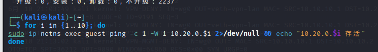
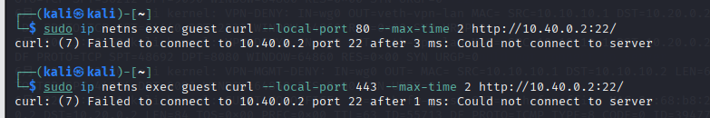
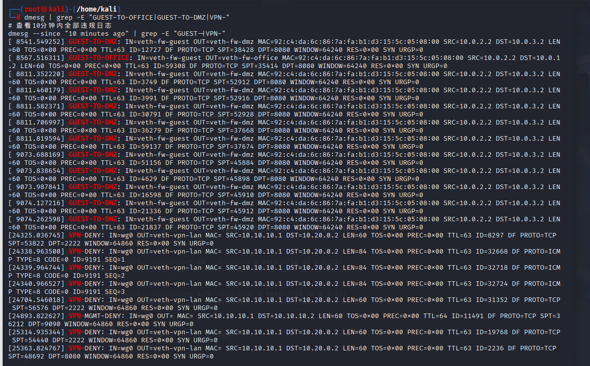
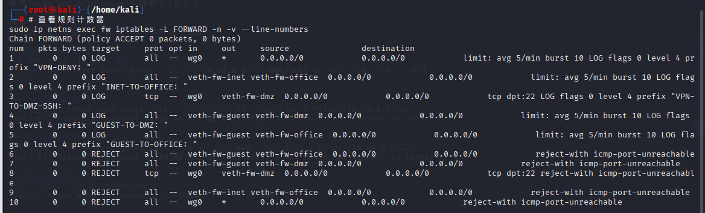
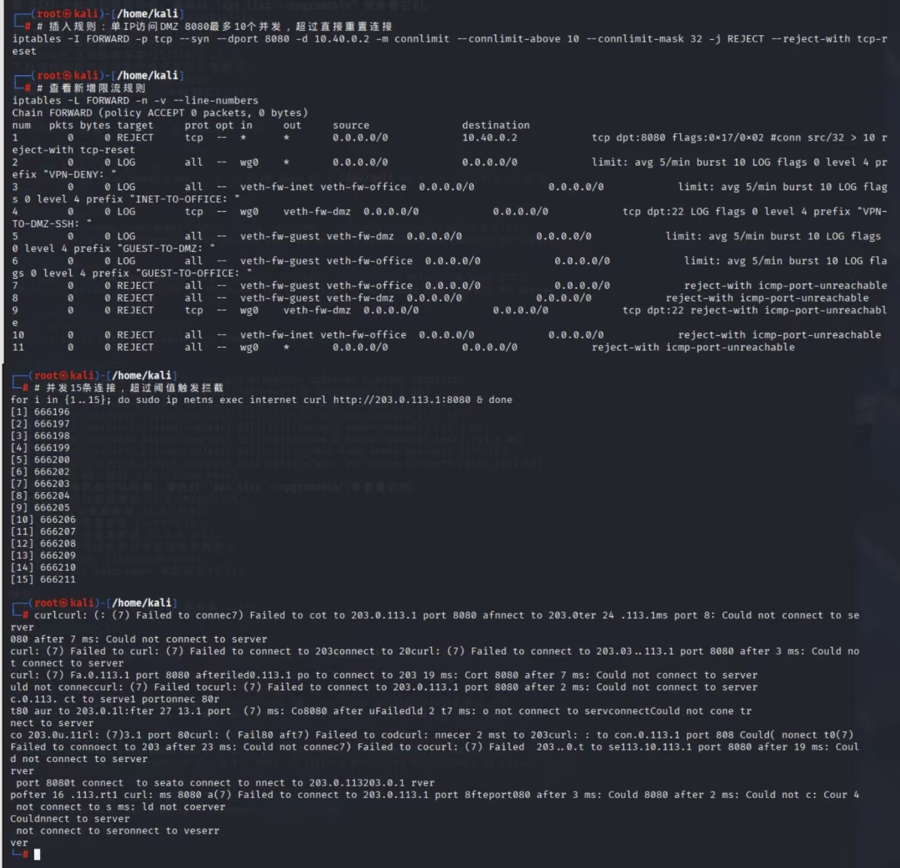
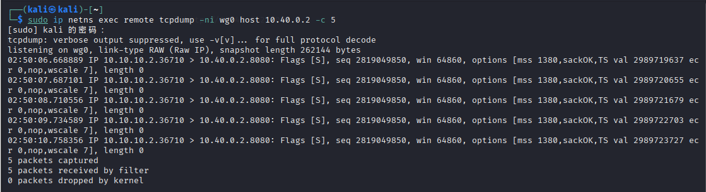
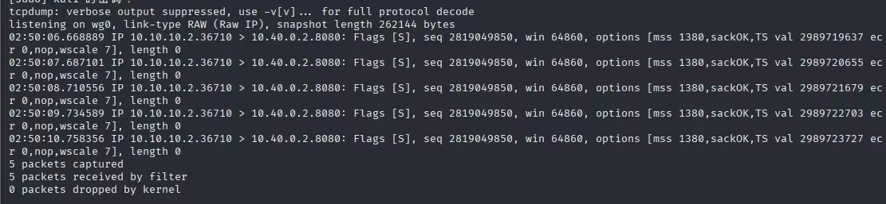
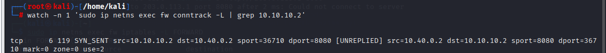

# 攻防演练分析报告

## 一、实验环境与安全架构概述
### 1. 网络分区与资产划分
本次实验基于 Linux 网络命名空间搭建多安全域企业模拟环境，防火墙fw作为全域边界网关，划分 5 个独立安全区域，各区域信任等级从低到高：
外网internet（完全不可信，模拟公网攻击者）
访客区guest（低可信，外来终端，禁止访问办公 / DMZ 核心资产）
DMZ 区10.40.0.0/24（半可信，仅开放 8080 对外 Web，关闭 22 管理端口）
VPN 远程区remote（受控可信，仅授权访问办公、DMZ 业务端口）
办公区office 10.20.0.0/24（高可信企业核心内网，严格隔离外部）

### 2. 边界安全防御基线
iptables FORWARD默认策略DROP，采用白名单放行机制；
全区域跨域访问配置差异化LOG审计规则，拦截流量同步记录内核日志；
状态防火墙：依靠ESTABLISHED,RELATED放行回程流量，禁止外部主动新建连接；
WireGuard VPN 加密隧道，通过AllowedIPs限制客户端可访问内网网段；
SNAT 实现内网上网、DNAT 发布 DMZ 网站，对外仅暴露 8080 单一端口；
域间隔离规则：访客→办公、访客→DMZ、外网→内网全部阻断并审计。
### 3. 攻防角色设定
攻击方：guest访客主机、internet外网主机（模拟黑客、恶意访客、扫描器）
防御方：边界防火墙 fw、运维审计体系（日志、连接跟踪、规则计数器）

---

## 二、攻击方实操演练（3 类攻击场景 + 完整命令、现象、失败根源分析）

### 攻击场景 1：访客主机对内网办公网段 ICMP 存活扫描
**1. 攻击目的**
扫描10.20.0.0/24办公网段，探测存活主机，为横向渗透、漏洞扫描铺垫。

**2. 完整攻击执行命令**
``` bash
# 批量ping扫描10.20.0.1~10.20.0.10办公网段
for i in {1..10}; do
  sudo ip netns exec guest ping -c 1 -W 1 10.20.0.$i 2>/dev/null && echo "发现存活主机：10.20.0.$i"
done
```
**攻击演练场景1截图：**


**3. 攻击现象**
终端无任何存活主机输出，全部 ping 超时；
防火墙内核持续输出审计日志，日志前缀GUEST-TO-OFFICE；
查看iptables -L FORWARD -v，访客访问办公网拦截规则数据包计数持续上涨。

**4. 攻击失败完整原因分析**
域间硬隔离规则：防火墙配置-i veth-fw-guest -o veth-fw-office全流量拦截规则，匹配后执行REJECT，所有 ICMP、TCP、UDP 报文直接阻断；
白名单机制：FORWARD 默认 DROP，无任何允许访客访问办公网放行条目；
报文阻断时机：ICMP 请求到达防火墙转发链即被丢弃，无法抵达办公主机，因此无法收到任何 ICMP 应答，扫描完全失效；
审计溯源：每一条扫描报文都会生成日志，运维可快速定位访客恶意扫描行为，及时处置终端。

### 攻击场景 2：修改客户端源端口尝试绕过 DMZ 22 端口拦截
**1. 攻击目的**
防火墙仅拦截目标 22 端口，攻击者认为更换本地随机源端口可绕过策略，尝试 SSH 连接 DMZ 服务器窃取管理权限。

**2. 完整攻击执行命令**
``` bash
# 指定本地80、443常用源端口发起访问
sudo ip netns exec guest curl --local-port 80 --max-time 2 http://10.40.0.2:22/
sudo ip netns exec guest curl --local-port 443 --max-time 2 http://10.40.0.2:22/
```
**攻击演练场景2截图：**


**3. 攻击现象**
两条命令均返回连接拒绝，防火墙生成GUEST-TO-DMZ违规访问日志。

**4. 攻击失败完整原因分析**
防火墙规则匹配维度：拦截规则匹配入接口、出接口、目标端口，不校验客户端源端口；无论客户端使用任何随机源端口，只要流量从访客网卡流向 DMZ 网卡、目标为 22 端口，规则都会匹配拦截；
安全域隔离逻辑：企业边界防护以区域为最小隔离单元，而非客户端端口，源端口修改无法改变流量归属的安全域；
防护优势：该策略杜绝利用动态端口绕过内网管控的攻击手段，提升内网纵深防御能力。

### 攻击场景 3：伪造 VPN 内网源地址渗透内网（理论攻击验证）
**1. 攻击目的**
guest 主机手动修改报文源 IP 为 VPN 授权地址10.10.10.2，试图欺骗防火墙放行流量，访问办公核心网段。

**2. 理论攻击思路与验证结论**
该攻击完全无法成功，三层防护机制层层阻断伪造流量：
WireGuard 加密身份校验：合法 VPN 流量全部经过公私钥加密封装，guest 主机无隧道密钥，无法生成合法 UDP 加密报文，伪造内层 IP 无意义；
接口绑定访问控制：VPN 放行规则限定入接口wg0，伪造流量从访客网卡veth-fw-guest进入防火墙，不会匹配 VPN 专用放行规则；
内核反向路由校验（rp_filter）：fw 内核会校验源 IP 对应的入接口，10.10.10.0/24网段仅允许从 wg 隧道流入，从访客网卡收到该网段源 IP 会直接丢弃，彻底阻断地址欺骗攻击。
补充拓展：外网对公网 8080 端口外的端口扫描攻击

攻击命令
``` bash
# internet主机扫描203.0.113.1 1-1000端口
sudo ip netns exec internet for port in {1..1000}; do sudo ip netns exec internet timeout 0.3 curl 203.0.113.1:$port; done
```

现象与防御效果
除 8080 端口正常连通外，其余端口全部拒绝，生成INET-TO-DMZ、INET-TO-OFFICE审计日志，外网无法探测内网开放端口，内网拓扑完全隐藏。

---

## 三、防御方日志与规则分析
**1. 安全日志识别攻击行为**
日志实时监控命令
```bash
# 过滤所有违规访问审计日志
sudo ip netns exec fw journalctl -k --since "10 minutes ago" --grep "GUEST-|VPN-|INET-"
```
**防御分析-日志证据截图：**


**关键日志字段溯源说明**
IN=xxx入接口字段：直接判定流量来源区域，IN=veth-fw-guest代表攻击源为访客区；
SRC=网段源 IP：精准定位发起攻击的终端 IP，便于隔离处置；
OUT=xxx出接口字段：识别攻击目标区域，OUT=veth-fw-office代表尝试入侵办公核心；
自定义log-prefix：区分攻击类型（访客越权、外网扫描、VPN 违规），快速分类统计安全事件。

问题解答 1：日志IN=veth-fw-guest OUT=veth-fw-office代表什么风险
该日志说明访客不可信区域流量尝试横向移动进入企业核心办公区，属于高危内网渗透风险。真实企业场景下，访客终端多为外来人员手机、笔记本，极易携带木马、扫描工具，一旦打通访问通道，攻击者可窃取业务数据、横向爆破服务器，因此架构中对此类流量完全阻断并完整留存审计日志，作为安全事件取证依据。

问题解答 2：大量同源日志持续产生的安全预警意义
同一源 IP 高频生成拦截日志，代表终端正在执行端口扫描、暴力破解、网段探测等恶意行为。运维人员可依据日志定位恶意主机，采取临时拉黑、终端查杀、WiFi 隔离等处置手段，提前阻断攻击链条，避免漏洞利用、数据泄露等严重安全事件。

**2. iptables 规则计数器防御效果分析**
查看规则流量统计命令
``` bash
sudo ip netns exec fw iptables -L FORWARD -n -v --line-numbers
````
**防御分析-规则计数器截图：**


问题解答 1：拦截访客访问办公网的对应规则
成对两条规则：第一条带limit限速的LOG审计规则（前缀GUEST-TO-OFFICE），第二条REJECT阻断规则，两条规则匹配入veth-fw-guest、出veth-fw-office，无协议限制，全流量拦截。-v参数显示数据包、字节计数器，数值越高代表扫描攻击越频繁。

问题解答 2：访客→办公规则计数持续走高的风险提示
计数器持续上涨说明访客网段存在主机持续对内网扫描，风险点包括：访客设备感染恶意病毒、外来人员主动运行渗透工具、公共 WiFi 存在中间人攻击。运维优化方案：增加connlimit连接限制，限制单 IP 最大并发连接，缓解扫描带来的带宽损耗；同时结合日志定位恶意 IP，临时隔离该终端网络访问权限。

**3. REJECT 与 DROP 两种阻断方式安全差异对比**

|阻断方式	|响应行为|	攻击者探测效果|	适用场景|	安全等级|
|:-----|:-----|:-----------|:---------|:-------|
|REJECT|	返回 ICMP 禁止 / TCP RST 报文 |	攻击者可快速判断目标 IP 存活，泄露内网拓扑|	实验室、内部测试环境|	较低 |
|DROP|	静默丢弃，无任何回复|	客户端长时间超时，无法判断主机是否存在，隐藏网段资产	|生产外网边界、核心内网隔离	|极高|

**总结**
实验中内部区域隔离使用 REJECT 方便调试排错；真实生产环境外网、核心内网边界统一采用 DROP，减少内网信息泄露，降低攻击者测绘内网资产的可能性。

---

## 四、现有安全架构缺陷与加固改进方案
4.1 现存安全风险分析
当前基线防火墙仅实现基础域隔离、DNAT 发布 Web 服务，对外 DMZ 8080 端口无流量防护：
无单 IP 并发连接限制，攻击者可大量新建 TCP 连接发起 CC/DoS 攻击，耗尽防火墙连接表与 DMZ 服务器资源，Web 业务瘫痪；
无连接速率管控，漏洞扫描器可无限制暴力探测 Web 程序漏洞，存在入侵后横向渗透风险；
缺少攻击日志专项标记，无法快速识别 CC 攻击流量。
4.2 加固 iptables 完整规则（单 IP 并发限制）



4.3 拓展纵深加固优化建议
WireGuard 加固：增加recent模块限制同一公 IP 短时间握手次数，抵御密钥暴力爆破；
日志加固：配置日志持久化存储，避免重启丢失审计记录，满足等保合规；
内网防护：办公 / DMZ 网段限制 ICMP 速率，防止 IC 洪水攻击；
时段管控：配置 iptables 时段规则，夜间自动切断访客外网访问权限。

---

## 五、全流量包追踪高级攻防验证（远程 VPN 访问 DMZ 完整报文流转）
**5.1 同步多节点抓包监控命令**

**抓包截图**



**conntrack记录截图**


**报文流转对照表**
表格
|观测节点|	源 IP	|目的 IP|协议|报文状态说明|
|:-----|:---------|:-------|:---------|:---------|
|remote wg0	|10.10.10.2|	10.40.0.2	|TCP|	原始内网请求，后续被 WireGuard 封装 UDP 公网包|
|fw wg0	|10.10.10.2	|10.40.0.2|	TCP|	解密剥离公网 UDP 头部，还原内网五元组|
|fw veth-fw-dmz|10.10.10.2|	10.40.0.2|	TCP	|匹配 VPN 放行规则，转发至 DMZ 服务器|
|conntrack 表|	10.10.10.2<->10.40.0.2	|-	|TCP|	会话标记 ESTABLISHED，自动放行回程 SYN-ACK/ACK|

**5.3 全链路攻防分析报告**
传输安全：远程访问全程 WireGuard UDP 加密，公网中间人无法窃听、篡改内网请求；
访问控制：VPN 流量仅匹配 wg0 接口放行，隔绝访客、外网伪造流量；
会话简化：依靠ESTABLISHED,RELATED状态规则自动放行回程，无需双向放行规则，最小权限；
审计完整：VPN 违规访问（如访问 22 端口）自动生成专属内核日志，可完整追溯远程员工越权行为。

---

## 六、攻防整体总结
分区隔离是内网防御核心：按信任等级划分 office/DMZ/guest/internet 安全域，通过接口匹配防火墙规则彻底阻断横向扫描、端口绕过攻击，大幅缩小攻击面；
状态防火墙简化安全策略，单向放行新建连接，自动处理回程流量，兼顾业务可用与内网资产隐藏；
差异化审计日志是攻击溯源核心，通过入接口、自定义日志前缀可快速区分访客、外网、VPN 三类攻击来源，支撑安全事件处置；
WireGuard 双层防护（加密密钥 + AllowedIP 网段）可有效抵御内网地址伪造攻击，远程办公场景安全边界清晰；
基础放行规则不足以抵御 CC、扫描类攻击，必须叠加connlimit并发限制、时段管控等纵深加固手段；
tcpdump 抓包 + conntrack 连接跟踪是定位攻击、验证防御效果的核心工具，可完整复现报文封装、转发、拦截全过程，同时适用于日常网络故障排查。