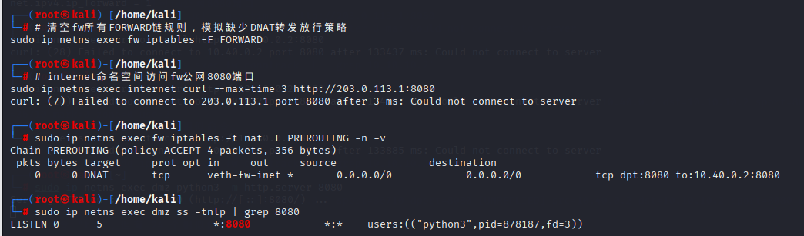
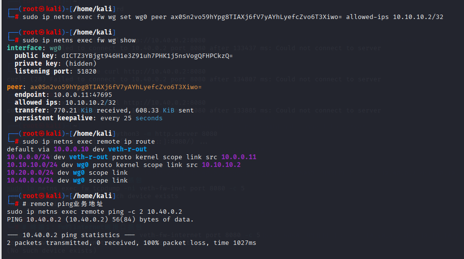
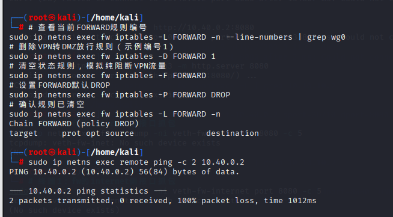
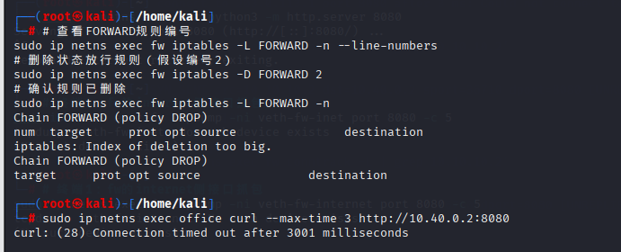

# 故障排查分析报告

## 一、实验基础环境（同README拓扑地址表）
| 区域 | 网段 | fw侧地址 | 主机地址 | 说明 |
|:-----|:-----|:---------|:---------|:-----|
| office | 10.20.0.0/24 | 10.20.0.1 | 10.20.0.2 | 办公网 |
| guest | 10.30.0.0/24 | 10.30.0.1 | 10.30.0.2 | 访客网 |
| dmz | 10.40.0.0/24 | 10.40.0.1 | 10.40.0.2 | DMZ业务区，8080常驻Web服务 |
| internet | 203.0.113.0/24 | 203.0.113.1 | 203.0.113.10 | 模拟外网 |
| vpn | 10.10.10.0/24 | 10.10.1 | 10.10.10.2 | WireGuard隧道网段 |
边界网关fw配置基线：
1. `ip netns exec fw sysctl -w net.ipv4.ip_forward=1` 开启内核转发
2. iptables FORWARD默认策略`DROP`，采用白名单放行模式
3. 已配置DNAT：外网203.0.113.1:8080映射至10.40.0.2:8080
4. WireGuard监听51820端口，客户端remote地址10.10.10.2

---

## 二、故障场景1：DNAT规则已配置，但外网无法访问DMZ 8080业务
### 2.1 故障现象复现
**人为制造故障**
清空fw全部FORWARD转发规则，模拟缺少DNAT配套放行策略
```bash
sudo ip netns exec fw iptables -F FORWARD
```
**触发访问，复现故障现象**
```bash
sudo ip netns exec internet curl --max-time 3 http://203.0.113.1:8080
```

**前置基线校验（排除服务、NAT基础问题）**
**校验DNAT映射规则存在**
```bash
sudo ip netns exec fw iptables -t nat -L PREROUTING -n -v
```
预期输出包含条目：
`DNAT     tcp  --  veth-fw-inet *  0.0.0.0/0            0.0.0.0/0            tcp dpt:8080 to:10.40.0.2:8080`

#### 校验DMZ Web服务正常监听
```bash
sudo ip netns exec dmz ss -tnlp | grep 8080
```
预期输出：`LISTEN      0      5            *:8080                   *:*    users:(("python3",pid=xxxx,fd=3))`
配套截图：


### 2.2 分层完整排查步骤
**步骤1：检查FORWARD链放行规则**
```bash
sudo ip netns exec fw iptables -L FORWARD -n --line-numbers
```
排查结论：FORWARD链无任何ACCEPT放行规则，默认策略DROP，转换后的内网报文无匹配规则直接丢弃。

**步骤2：校验DMZ回程路由完整性**
```bash
sudo ip netns exec dmz ip route
```
排查结论：DMZ默认网关指向fw，回程路由无异常，排除路由故障。

**步骤3：conntrack连接跟踪查看DNAT转换记录**
```bash
# 后台发起访问，同步抓取连接表
sudo ip netns exec internet curl --max-time 3 http://203.0.113.1:8080 &
sleep 0.5
sudo ip netns exec fw conntrack -L | grep 8080
```
标准输出解读：
```
tcp      6 117 SYN_SENT src=203.0.113.10 dst=203.0.113.1 sport=54321 dport=8080 [UNREPLIED] src=10.40.0.2 dst=203.0.113.10 sport=8080 dport=54321
```
1. DNAT地址转换已生效，公网目的IP转为内网10.40.0.2；
2. 连接状态`SYN_SENT [UNREPLIED]`，仅收到客户端SYN，无服务端回程应答；
3. 报文完成NAT后进入FORWARD链被静默丢弃。

**步骤4：双接口抓包定位丢包位置**
```bash
# 外网入接口抓包
sudo ip netns exec fw tcpdump -ni veth-fw-inet port 8080 -c 5
# DMZ内网接口抓包
sudo ip netns exec fw tcpdump -ni veth-fw-dmz port 8080 -c 5
# 同步触发访问
sudo ip netns exec internet curl --max-time 3 http://203.0.113.1:8080
```
抓包结果：
1. veth-fw-inet：捕获外网客户端SYN报文，流量成功抵达防火墙；
2. veth-fw-dmz：无任何TCP报文；
结论：DNAT转换后的内网流量无法转发至DMZ，丢包点在fw FORWARD链。

### 2.3 故障根本原因
fw PREROUTING链DNAT端口映射规则完整，但FORWARD链不存在外网访问DMZ的NEW状态放行规则，且默认策略为DROP。外网SYN报文完成公网转内网地址转换后，无匹配放行策略被内核静默丢弃，TCP三次握手无法完成，客户端长时间等待出现连接超时（28错误码）。

### 2.4 完整修复命令与验证
```bash
# 保持FORWARD默认DROP基线
sudo ip netns exec fw iptables -P FORWARD DROP
# 添加DNAT配套新建连接放行规则
sudo ip netns exec fw iptables -A FORWARD -i veth-fw-inet -o veth-fw-dmz -d 10.40.0.2 -p tcp --dport 8080 -m conntrack --ctstate NEW -j ACCEPT
# 添加全局回程状态放行规则
sudo ip netns exec fw iptables -A FORWARD -m conntrack --ctstate ESTABLISHED,RELATED -j ACCEPT
# 访问验证
sudo ip netns exec internet curl --max-time 3 http://203.0.113.1:8080
```
修复成功表现：正常返回Python http.server HTML目录页面；
再次查看conntrack，连接状态变为`ESTABLISHED`，双向流量正常。

### 2.5 同类衍生故障补充
故障现象：同DNAT配置，curl直接报(7)连接拒绝，无3秒超时
排查两点：
1. fw未开启独立命名空间IPv4转发：`cat /proc/sys/net/ipv4/ip_forward`输出0；
修复：`sudo ip netns exec fw bash && echo 1 > /proc/sys/net/ipv4/ip_forward`
2. internet缺少指向fw公网静态路由；
修复：`sudo ip netns exec internet ip route add 203.0.113.1/32 dev veth-inet`

---

## 三、故障场景2：WireGuard隧道握手正常，但remote无法访问内网业务
**分为两类独立故障**
### 子故障2-A：fw对等体AllowedIPs缺失DMZ网段
#### 3.1.1 故障复现操作
```bash
# 修改peer允许网段，移除10.40.0.0/24（替换真实wg公钥）
sudo ip netns exec fw wg set wg0 peer ax0Sn2vo59hYpg8TIAXj6fV7yAYhLyefcZvo6T3Xiwo= allowed-ips 10.10.10.2/32
# 查看隧道状态
sudo ip netns exec fw wg show
# 业务连通测试
sudo ip netns exec remote ping -c 2 10.40.0.2
```
故障现象：`wg show`存在`latest handshake`握手时间，ping提示`Destination Host Unreachable`，无防火墙REJECT日志；
截图：


#### 3.1.2 分层排查步骤
步骤1：校验隧道底层UDP链路
```bash
sudo ip netns exec fw wg show | grep "latest handshake"
```
输出存在时间，证明加密隧道底层互通，排除公网UDP链路问题。

步骤2：核查对等体允许网段（核心定位点）
```bash
sudo ip netns exec fw wg show | grep "allowed ips"
```
输出仅`10.10.10.2/32`，缺失业务网段10.40.0.0/24。

步骤3：wg0接口抓包佐证
```bash
sudo ip netns exec fw tcpdump -ni wg0 icmp
```
抓包现象：仅收到remote发送的ICMP请求，无回程封装UDP报文；
底层原理：WireGuard硬性约束，只有目的IP在AllowedIP列表，回程流量才会加密封装发回客户端。

#### 3.1.3 修复命令
```bash
# 补齐客户端隧道IP+DMZ业务网段
sudo ip netns exec fw wg set wg0 peer ax0Sn2vo59hYpg8TIAXj6fV7yAYhLyefcZvo6T3Xiwo= allowed-ips 10.10.10.2/32,10.40.0.0/24
# 验证连通
sudo ip netns exec remote ping -c 2 10.40.0.2
```
修复效果：双向ICMP无丢包。

### 子故障2-B：FORWARD链无VPN隧道放行规则
#### 3.2.1 故障复现操作
```bash
# 查看wg相关规则行号
sudo ip netns exec fw iptables -L FORWARD -n --line-numbers | grep wg0
# 删除VPN放行规则，清空转发链，默认DROP
sudo ip netns exec fw iptables -D FORWARD 1
sudo ip netns exec fw iptables -F FORWARD
sudo ip netns exec fw iptables -P FORWARD DROP
# 确认规则清空
sudo ip netns exec fw iptables -L FORWARD -n
# 业务测试
sudo ip netns exec remote ping -c 2 10.40.0.2
```
故障现象：隧道握手记录正常，ping全程无任何回复，100%丢包，无REJECT日志；
截图：


#### 3.2.2 分层排查步骤
步骤1：确认隧道握手正常（同上）
步骤2：检查是否存在wg0接口放行规则
```bash
sudo ip netns exec fw iptables -L FORWARD -n | grep wg0
```
无任何输出，VPN解密后流量无放行策略，被默认DROP静默丢弃。

步骤3：双接口抓包区分丢包层级
```bash
# 隧道口抓包
sudo ip netns exec fw tcpdump -ni wg0 icmp
# DMZ内网口抓包
sudo ip netns exec fw tcpdump -ni veth-fw-dmz icmp
# 触发ping测试
sudo ip netns exec remote ping -c 2 10.40.0.2
```
抓包结论：wg0收到ICMP请求，veth-fw-dmz无报文，流量卡在fw转发链。

#### 3.2.3 完整修复规则
```bash
# 放行VPN访问DMZ ICMP
sudo ip netns exec fw iptables -A FORWARD -i wg0 -o veth-fw-dmz -s 10.10.10.2 -d 10.40.0.0/24 -p icmp -j ACCEPT
# 放行VPN访问DMZ TCP业务新建连接
sudo ip netns exec fw iptables -A FORWARD -i wg0 -o veth-fw-dmz -s 10.10.10.2 -d 10.40.0.0/24 -p tcp -m conntrack --ctstate NEW -j ACCEPT
# 全局回程状态规则
sudo ip netns exec fw iptables -A FORWARD -m conntrack --ctstate ESTABLISHED,RELATED -j ACCEPT
# 验证连通
sudo ip netns exec remote ping -c 2 10.40.0.2
```

### 2.6 WireGuard衍生故障
故障1：`wg show`无latest handshake，仅存在persistent keepalive
解释：persistent keepalive只是配置参数，不代表链路存活；无握手记录=UDP保活无回复，隧道逻辑断开；
修复：两端执行`wg-quick down && wg-quick up`重启隧道，等待握手生成。

故障2：wg set peer 提示密钥格式错误
原因：命令使用中文占位符，未粘贴64位标准Base64公钥；
修复：从`wg show`复制完整peer公钥替换文字占位符。

---


## 四、故障场景3：删除ESTABLISHED,RELATED状态规则后TCP业务完全中断
### 4.1 故障复现操作
```bash
# 查看FORWARD规则行号
sudo ip netns exec fw iptables -L FORWARD -n --line-numbers
# 删除全局回程状态规则（示例编号2）
sudo ip netns exec fw iptables -D FORWARD 2
# 确认规则已移除
sudo ip netns exec fw iptables -L FORWARD -n
# 业务访问测试
sudo ip netns exec office curl --max-time 3 http://10.40.0.2:8080
```
故障现象：curl长时间无应答，连接超时；
截图：


### 4.2 分步完整排查
#### 排查步骤1：双网卡同步抓包，定位回程丢包点
```bash
# office侧入接口抓包
sudo ip netns exec fw tcpdump -ni veth-fw-office tcp port 8080 -c 10
# DMZ侧出接口抓包
sudo ip netns exec fw tcpdump -ni veth-fw-dmz tcp port 8080 -c 10
# 触发访问
sudo ip netns exec office curl --max-time 3 http://10.40.0.2:8080
```
抓包输出解读：
1. veth-fw-dmz：同时捕获客户端SYN、服务器SYN-ACK报文；
2. veth-fw-office：仅存在客户端发起的SYN，无SYN-ACK回程报文；
结论：服务端应答包被防火墙转发链拦截。

#### 排查步骤2：conntrack查看TCP半连接状态
```bash
sudo ip netns exec office curl --max-time 3 http://10.40.0.2 &
sleep 0.5
sudo ip netns exec fw conntrack -L | grep 8080
```
输出：
```
tcp      6 118 SYN_SENT src=10.20.0.2 dst=10.40.0.2 sport=52001 dport=8080 [UNREPLIED] src=10.40.0.2 dst=10.20.0.2 sport=8080 dport=52001
```
解读：内核记录半连接，收到服务端SYN-ACK，但无状态放行规则，无法转发回程流量。

#### 排查步骤3：ESTABLISHED,RELATED核心原理分析
TCP三次握手完整流程：
1. 客户端发送SYN（连接新建，ctstate=NEW，匹配office→DMZ放行规则可转发）；
2. DMZ回复SYN-ACK（关联应答，ctstate=RELATED）；
3. 握手完成后双向业务流量（ctstate=ESTABLISHED）。
仅配置NEW放行规则时，RELATED/ESTABLISHED报文无匹配策略，匹配默认DROP被丢弃。
规则作用拆分：
- `RELATED`：放行握手应答、ICMP差错等关联报文；
- `ESTABLISHED`：放行已建立连接的全部双向业务流量；
安全价值：实现单向访问控制，仅允许内网主动发起对外连接，阻止外网主动向内网新建会话，符合最小权限安全模型。

### 4.3 故障修复与验证
```bash
# 将状态规则插入FORWARD链最前端
sudo ip netns exec fw -I FORWARD 1 -m conntrack --ctstate ESTABLISHED,RELATED -j ACCEPT
# 访问验证
sudo ip netns exec office curl --max-time 3 http://10.40.0.2:8080
# 连接跟踪校验
sudo ip netns exec fw conntrack -L | grep 8080
```
修复后conntrack状态变为`ESTABLISHED`，双向TCP通信正常。

### 4.4 衍生故障补充
现象：删除状态规则后抓包看不到SYN-ACK报文
根因：DMZ未常驻运行`python3 -m http.server 8080`，无端口监听，服务器不会生成应答包；
修复：新开终端持续运行Web服务，窗口保持不关闭。

---


## 五、实验通用故障汇总
| 故障描述 | 根因 | 标准化解决命令 |
|--------|------|--------------|
| DNAT测试curl(7)拒绝，无28超时 | fw未开启ip_forward、internet缺失静态路由 | 开启转发+补充静态路由 |
| wg set peer 密钥格式报错 | 使用中文占位符，非完整64位公钥 | 复制wg show真实公钥填入命令 |
| wg show无latest handshake | 隧道UDP握手超时断开 | wg-quick上下重启两端隧道 |
| 抓包提示No such device | 网卡名称硬编码错误 | 先`ip netns exec fw ip link show`查询真实网卡名 |
| 删除状态规则无SYN-ACK | DMZ Web服务未常驻 | 持续运行python http.server |

---

# 六、标准化分层故障排查方法论
遵循从底层到上层分层排查顺序，适配企业真实运维场景：
1. 二层链路层：ip link查看veth网卡是否UP、名称是否匹配，避免硬编码网卡名；
2. 三层路由层：各命名空间默认网关、静态路由、ping直连网关校验；
3. 内核转发层：独立netns的ip_forward开关单独校验；
4. NAT/隧道层：DNAT/SNAT、WireGuard握手与AllowedIPs网段校验；
5. 防火墙策略层：FORWARD默认策略、规则顺序、状态规则完整性；
6. 流量观测层：tcpdump多接口抓包定位丢包位置、conntrack查看NAT与TCP会话；
7. 应用服务层：后台业务端口监听、服务是否常驻运行。

---

# 七、故障排查整体总结
1. iptables状态规则`ESTABLISHED,RELATED`是TCP业务通信基础，必须放置在FORWARD链首行，缺失会直接中断双向流量；
2 WireGuard故障分层排查：先查底层UDP握手（latest handshake），再校验AllowedIP网段授权，两层独立互不干扰；
3 DNAT发布业务必须配套对应NEW放行规则，同时开启命名空间独立IPv4转发，否则出现(7)/(28)两类连接报错；
4. 抓包+conntrack是定位静默DROP故障最核心工具，直观区分路由不通、防火墙拦截、服务未启动三类问题；
5. 实验环境可使用REJECT方便调试，生产外网边界统一使用DROP隐藏内网资产，降低攻击者测绘风险；
6. 脚本配置规范：网卡名称动态查询、WG密钥使用完整原始字符串、所有后台业务常驻运行、防火墙规则修改前备份旧策略，减少运维故障。