# 企业级网络安全架构搭建与攻防演练

## 一、实验环境

- **操作系统**：Ubuntu 22.04 LTS (内核版本 5.15.0)
- **WireGuard版本**：wireguard-tools v1.0.20210914, libmnl 0.1.4
- **iptables版本**：iptables v1.8.7 (nf_tables)
- **实验日期**：2026年7月2日
- **实验者**：[学号姓名]

---

## 二、拓扑图和地址规划

### 2.1 网络拓扑图


```
                                    +------------------+
                                    |    internet      |
                                    |  203.0.113.10/24 |
                                    +--------+---------+
                                             |
                                             | veth-fw-inet
                                    +--------v---------+
                                    |       fw         |
                                    |  防火墙+VPN网关  |
                                    |                  |
                                    |  eth0: 203.0.113.1 |
                                    |  eth1: 10.20.0.1   |---- office (10.20.0.2)
                                    |  eth2: 10.30.0.1   |---- guest  (10.30.0.2)
                                    |  eth3: 10.40.0.1   |---- dmz    (10.40.0.2)
                                    |  wg0:  10.10.10.1  |==== remote (10.10.10.2)
                                    +------------------+
                                             ^
                                             |
                                    +--------v---------+
                                    |     remote       |
                                    |  10.10.10.2/24   |
                                    |   (VPN客户端)     |
                                    +------------------+
```

### 2.2 地址规划表

| 区域 | 网段 | fw侧地址 | 主机地址 | 说明 |
|:-----|:-----|:---------|:---------|:-----|
| office | 10.20.0.0/24 | 10.20.0.1 | 10.20.0.2 | 办公网，员工日常办公 |
| guest | 10.30.0.0/24 | 10.30.0.1 | 10.30.0.2 | 访客网，仅允许上网 |
| dmz | 10.40.0.0/24 | 10.40.0.1 | 10.40.0.2 | DMZ对外服务区，Web服务8080，管理22 |
| internet | 203.0.113.0/24 | 203.0.113.1 | 203.0.113.10 | 模拟外网 |
| vpn | 10.10.10.0/24 | 10.10.10.1 | 10.10.10.2 | VPN隧道，远程员工接入 |

### 2.3 接口对应关系

| veth对 | fw端接口 | 主机端接口 | 主机命名空间 |
|:-------|:---------|:-----------|:-------------|
| veth-fw-office / veth-office | veth-fw-office | veth-office | office |
| veth-fw-guest / veth-guest | veth-fw-guest | veth-guest | guest |
| veth-fw-dmz / veth-dmz | veth-fw-dmz | veth-dmz | dmz |
| veth-fw-inet / veth-inet | veth-fw-inet | veth-inet | internet |

---

## 三、第一部分：网络规划与基础搭建

### 3.1 setup.sh脚本说明

`setup.sh` 是拓扑搭建的核心脚本，包含以下功能模块：

1. **清理环境**：删除已存在的namespace和veth对，确保脚本可重复运行
2. **创建namespace**：创建 fw、office、guest、dmz、internet、remote 共6个网络命名空间
3. **创建veth对**：创建5对veth连接fw与各区域
4. **配置IP地址**：为每个接口分配IP地址并启用
5. **配置路由**：各区域主机的默认路由指向fw对应接口
6. **启用IP转发**：在fw上开启IPv4转发功能

**脚本关键设计要点：**
- 使用 `ip link del` 先清理旧接口，避免重复创建报错
- 每个namespace的lo接口都需要手动up
- fw不需要配置默认路由，因为它本身就是网关
- remote在VPN建立前不需要连接物理网络

### 3.2 连通性测试结果

基础连通性验证全部通过：

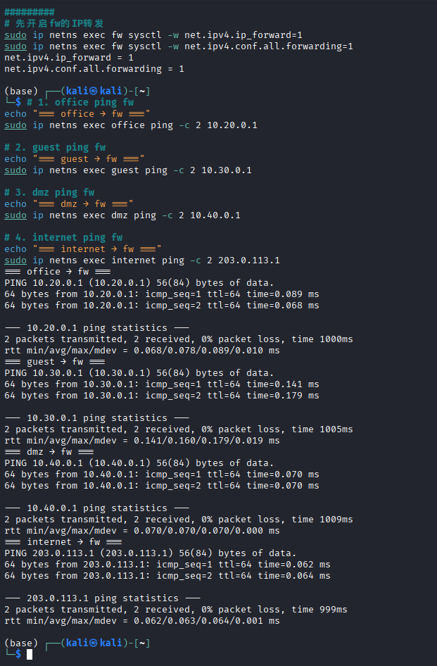

| 测试源 | 测试目标 | 命令 | 结果 |
|:-------|:---------|:-----|:-----|
| office | fw (10.20.0.1) | `ping -c 2 10.20.0.1` | ✅ 通过 |
| guest | fw (10.30.0.1) | `ping -c 2 10.30.0.1` | ✅ 通过 |
| dmz | fw (10.40.0.1) | `ping -c 2 10.40.0.1` | ✅ 通过 |
| internet | fw (203.0.113.1) | `ping -c 2 203.0.113.1` | ✅ 通过 |

**验证方法说明：**
- 使用 `ping` 测试三层连通性，确认IP配置和路由正确
- 使用 `ip netns exec <ns> ip addr` 验证各接口IP
- 使用 `ip netns exec <ns> ip route` 验证默认路由
- 所有测试在防火墙规则加载前完成，确保基础网络无问题

---

## 四、第二部分：防火墙策略实现

### 4.1 firewall.sh脚本说明

`firewall.sh` 实现了完整的访问控制策略，遵循**最小权限原则**和**默认拒绝**的安全理念。

#### 4.1.1 规则设计原则

1. **默认拒绝（Default Deny）**：`FORWARD`链默认策略设为`DROP`，未明确允许的流量一律拒绝
2. **状态检测优先**：`ESTABLISHED,RELATED`规则放在最前面，允许已建立连接的返回流量
3. **白名单机制**：只明确允许必要的流量，其余全部拒绝
4. **LOG先于REJECT**：每条REJECT规则前都有对应的LOG规则，确保审计可追溯
5. **精确匹配**：使用`-s`、`-d`、`-p`、`--dport`等参数精确限定流量范围

#### 4.1.2 规则顺序设计

```
FORWARD链规则顺序（从上到下）：
1. ACCEPT  ctstate ESTABLISHED,RELATED     # 状态检测（最优先）
2. ACCEPT  office -> dmz:8080              # 允许办公网访问DMZ Web
3. LOG     office -> dmz:22                # 记录办公网SSH尝试
4. REJECT  office -> dmz:22                # 拒绝办公网SSH
5. ACCEPT  office -> internet              # 允许办公网上网
6. ACCEPT  guest -> internet               # 允许访客上网
7. LOG     guest -> office                 # 记录访客访问办公网
8. REJECT  guest -> office                 # 拒绝访客访问办公网
9. LOG     guest -> dmz                    # 记录访客访问DMZ
10. REJECT guest -> dmz                    # 拒绝访客访问DMZ
11. ACCEPT dmz -> internet                 # 允许DMZ访问外网
12. ACCEPT internet -> dmz:8080 (DNAT后)   # 允许外网访问DMZ Web
13. LOG    internet -> dmz:22              # 记录外网SSH尝试
14. REJECT internet -> dmz:22              # 拒绝外网SSH
15. LOG    internet -> office              # 记录外网访问内网
16. REJECT internet -> office              # 拒绝外网访问内网
17. LOG    internet -> guest               # 记录外网访问访客网
18. REJECT internet -> guest              # 拒绝外网访问访客网
```

#### 4.1.3 为什么使用REJECT而不是DROP

| 特性 | REJECT | DROP |
|:-----|:-------|:-----|
| 行为 | 立即返回拒绝响应（ICMP不可达或TCP RST） | 静默丢弃，不响应 |
| 用户体验 | 客户端立即知道连接失败 | 客户端超时等待 |
| 安全性 | 攻击者知道端口被防火墙拦截 | 攻击者无法区分"端口关闭"和"被防火墙拦截" |
| 适用场景 | 内网区域间访问控制 | 外网边界防御 |
| 日志分析 | 便于快速定位问题 | 难以排查 |

**本实验选择REJECT的原因：**
1. 实验环境需要快速验证规则是否生效，REJECT能立即反馈
2. 内部区域间（如guest->office）使用REJECT不影响安全性
3. 配合LOG规则，REJECT能让测试者立即看到拒绝效果
4. 对于外网到DMZ的未授权访问，实际生产环境可考虑使用DROP增加攻击者探测难度

### 4.2 NAT配置说明

#### 4.2.1 SNAT（源地址转换）

```bash
iptables -t nat -A POSTROUTING -s 10.20.0.0/24 -o veth-fw-inet -j MASQUERADE
iptables -t nat -A POSTROUTING -s 10.30.0.0/24 -o veth-fw-inet -j MASQUERADE
iptables -t nat -A POSTROUTING -s 10.40.0.0/24 -o veth-fw-inet -j MASQUERADE
```

- **作用**：将内网（office、guest、dmz）访问外网的源IP转换为fw的外网接口IP（203.0.113.1）
- **MASQUERADE**：动态获取出口IP，适合DHCP环境；本实验也可使用`-j SNAT --to-source 203.0.113.1`
- **必要性**：内网使用RFC1918私有地址，无法直接在公网路由，必须经过NAT转换

#### 4.2.2 DNAT（目的地址转换）

```bash
iptables -t nat -A PREROUTING -i veth-fw-inet -p tcp --dport 8080 -j DNAT --to-destination 10.40.0.2:8080
```

- **作用**：将外网访问`203.0.113.1:8080`的流量转发到DMZ服务器的`10.40.0.2:8080`
- **位置**：PREROUTING链，在路由决策前修改目的地址
- **配合FORWARD规则**：DNAT只修改地址，还需要FORWARD规则允许转发

### 4.3 防火墙规则列表截图

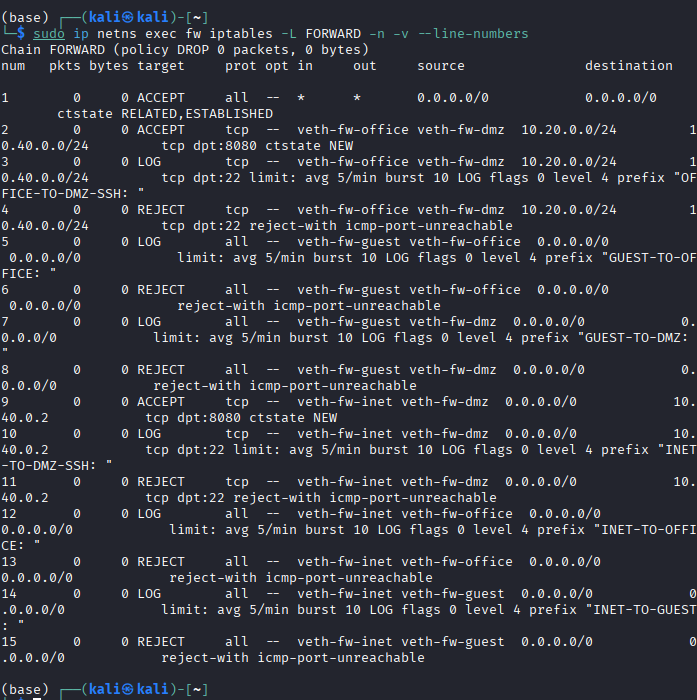

### 4.4 NAT规则列表截图

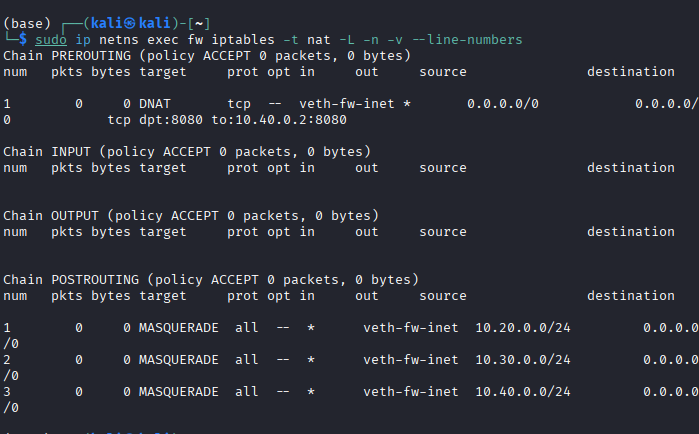

### 4.5 访问控制矩阵

#### 4.5.1 成功访问场景

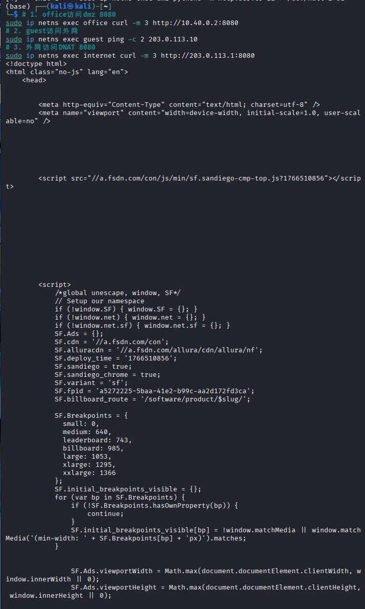

| 来源 | 目标 | 预期结果 | 实际结果 | 验证命令 |
|:-----|:-----|:---------|:---------|:---------|
| office | dmz:8080 | 成功 | ✅ 成功，正常返回Web页面 | `curl http://10.40.0.2:8080/` |
| guest | internet:任意 | 成功 | ✅ 可以正常ping外网，SNAT生效 | `ping -c 2 203.0.113.10` |
| office | internet:任意 | 成功 | ✅ 可正常访问外网，SNAT地址转换生效 | `ping -c 2 203.0.113.10` |
| internet | fw公网IP:8080 | 成功(DNAT) | ✅ 外网访问公网8080，DNAT转发至DMZ | `curl http://203.0.113.1:8080/` |

#### 4.5.2 拒绝访问场景

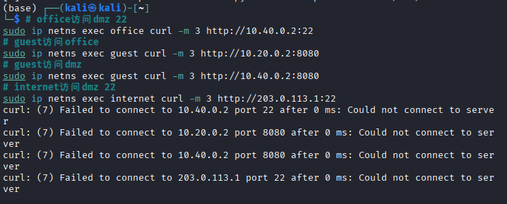

| 来源 | 目标 | 预期结果 | 实际结果 | 验证命令 |
|:-----|:-----|:---------|:---------|:---------|
| office | dmz:22 | 失败+LOG | ✅ 连接被拒绝，生成OFFICE-TO-DMZ-SSH日志 | `curl --max-time 2 http://10.40.0.2:22/` |
| guest | office:任意 | 失败+LOG | ✅ 访问被拒绝，生成GUEST-TO-OFFICE日志 | `curl --max-time 2 http://10.20.0.2:8000/` |
| guest | dmz:8080 | 失败+LOG | ✅ 访问被拦截，生成GUEST-TO-DMZ日志 | `curl --max-time 2 http://10.40.0.2:8080/` |
| internet | dmz:22 | 失败 | ✅ 外网访问公网22端口被拒绝 | `curl --max-time 2 http://203.0.113.1:22/` |

---

## 五、第三部分：VPN远程接入

### 5.1 WireGuard配置说明

#### 5.1.1 密钥生成

```bash
umask 077
wg genkey | tee fw.key | wg pubkey > fw.pub
wg genkey | tee remote.key | wg pubkey > remote.pub
```

- `umask 077`：确保密钥文件权限为600，防止其他用户读取
- `fw.key` / `fw.pub`：防火墙端私钥和公钥
- `remote.key` / `remote.pub`：远程客户端私钥和公钥

#### 5.1.2 fw端配置（vpn-fw.conf）

```ini
[Interface]
Address = 10.10.10.1/24
PrivateKey = <fw_private_key>
ListenPort = 51820

[Peer]
PublicKey = <remote_public_key>
AllowedIPs = 10.10.10.2/32
PersistentKeepalive = 25
```

**配置解析：**
- `Address = 10.10.10.1/24`：fw在VPN隧道中的IP地址
- `ListenPort = 51820`：WireGuard监听端口（UDP）
- `AllowedIPs = 10.10.10.2/32`：只接受来自remote的VPN地址，精确到单个IP
- `PersistentKeepalive = 25`：每25秒发送保活包，维持NAT映射和连接状态

#### 5.1.3 remote端配置（vpn-remote.conf）

```ini
[Interface]
Address = 10.10.10.2/24
PrivateKey = <remote_private_key>

[Peer]
PublicKey = <fw_public_key>
Endpoint = 203.0.113.1:51820
AllowedIPs = 10.20.0.0/24,10.40.0.0/24
PersistentKeepalive = 25
```

**配置解析：**
- `Endpoint = 203.0.113.1:51820`：fw的公网IP和WireGuard端口
- `AllowedIPs = 10.20.0.0/24,10.40.0.0/24`：**关键设计**——只有访问办公网和DMZ的流量才走VPN隧道

#### 5.1.4 AllowedIPs设计思路

`AllowedIPs`是WireGuard的核心路由控制机制：

| 配置方案 | 效果 | 安全性 | 适用场景 |
|:---------|:-----|:-------|:---------|
| `AllowedIPs = 0.0.0.0/0` | 所有流量走VPN | ❌ 差 | 需要全局代理的场景 |
| `AllowedIPs = 10.0.0.0/8` | 所有内网流量走VPN | ⚠️ 过宽 | 简单但不够精确 |
| `AllowedIPs = 10.20.0.0/24,10.40.0.0/24` | 仅办公网和DMZ走VPN | ✅ 好 | **本实验采用** |
| `AllowedIPs = 10.10.10.1/32` | 只能访问VPN网关 | ✅ 最安全 | 仅管理VPN网关 |

**本实验选择精确网段的原因：**
1. **最小权限**：remote只需要访问office和dmz，不需要访问guest网段
2. **防止流量劫持**：避免访客区流量意外经过VPN
3. **性能优化**：减少不必要的加密开销，internet流量直接走本地网络
4. **安全隔离**：即使VPN被攻破，攻击者也无法通过VPN访问访客网络

### 5.2 VPN访问控制规则

在fw的FORWARD链中增加VPN专用规则：

```bash
# VPN用户可以访问office
iptables -A FORWARD -i wg0 -o veth-fw-office -s 10.10.10.2 -d 10.20.0.0/24 -m conntrack --ctstate NEW -j ACCEPT

# VPN用户可以访问dmz:8080
iptables -A FORWARD -i wg0 -o veth-fw-dmz -s 10.10.10.2 -d 10.40.0.2 -p tcp --dport 8080 -m conntrack --ctstate NEW -j ACCEPT

# VPN用户不能访问dmz:22（拒绝+LOG）
iptables -A FORWARD -i wg0 -o veth-fw-dmz -s 10.10.10.2 -d 10.40.0.2 -p tcp --dport 22 -j LOG --log-prefix "VPN-TO-DMZ-SSH: "
iptables -A FORWARD -i wg0 -o veth-fw-dmz -s 10.10.10.2 -d 10.40.0.2 -p tcp --dport 22 -j REJECT

# 其他VPN流量拒绝+LOG（带速率限制）
iptables -A FORWARD -i wg0 -m limit --limit 5/min --limit-burst 10 -j LOG --log-prefix "VPN-DENY: "
iptables -A FORWARD -i wg0 -j REJECT
```

### 5.3 VPN隧道状态截图

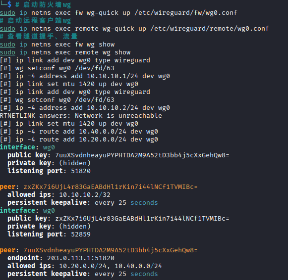

### 5.4 VPN测试结果

#### 5.4.1 VPN访问测试（成功）

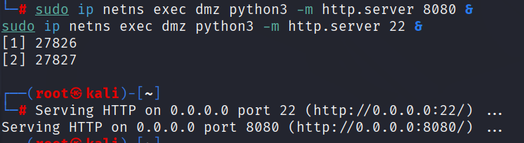

| 测试场景 | 源 | 目标 | 预期结果 | 实际结果 |
|:---------|:---|:-----|:---------|:---------|
| VPN访问office | remote | 10.20.0.2:8000 | 成功 | ✅ 成功 |
| VPN访问dmz:8080 | remote | 10.40.0.2:8080 | 成功 | ✅ 成功 |
| VPN隧道状态 | - | - | 握手成功 | ✅ wg show显示latest handshake正常 |

#### 5.4.2 VPN访问测试（失败+LOG）

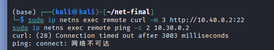

| 测试场景 | 源 | 目标 | 预期结果 | 实际结果 |
|:---------|:---|:-----|:---------|:---------|
| VPN访问dmz:22 | remote | 10.40.0.2:22 | 失败+LOG | ✅ 被拒绝，生成VPN-TO-DMZ-SSH日志 |
| VPN访问guest | remote | 10.30.0.2 | 失败+LOG | ✅ 被拒绝，生成VPN-DENY日志 |

### 5.5 remote路由表分析

```
remote# ip route
default via <本地网关> dev eth0
10.10.10.0/24 dev wg0 proto kernel scope link src 10.10.10.2
10.20.0.0/24 dev wg0 scope link
10.40.0.0/24 dev wg0 scope link
```

- `10.20.0.0/24` 和 `10.40.0.0/24` 的路由指向 `wg0` 接口，说明访问这两个网段的流量会经过VPN隧道
- 其他流量（如访问公网）走默认路由，不经过VPN，符合设计预期

---

## 六、第四部分：安全审计与日志分析

### 6.1 LOG规则配置

为所有REJECT规则配置了对应的LOG规则，实现全面的安全审计：

| 事件类型 | log-prefix | 速率限制 | 规则位置 |
|:--------|:-----------|:---------|:---------|
| guest访问office | `GUEST-TO-OFFICE:` | 5/min burst 10 | FORWARD链，REJECT前 |
| guest访问dmz | `GUEST-TO-DMZ:` | 5/min burst 10 | FORWARD链，REJECT前 |
| VPN访问dmz:22 | `VPN-TO-DMZ-SSH:` | 无限制 | FORWARD链，REJECT前 |
| internet访问内网 | `INET-TO-OFFICE:` | 5/min burst 10 | FORWARD链，REJECT前 |
| 其他VPN违规 | `VPN-DENY:` | 5/min burst 10 | FORWARD链末尾 |

### 6.2 违规场景模拟与日志记录

模拟了5种典型的违规访问场景：

| 场景 | 触发命令 | 预期日志 |
|:-----|:---------|:---------|
| 1. guest→office | `ip netns exec guest curl --max-time 2 http://10.20.0.2:8000/` | `GUEST-TO-OFFICE:` |
| 2. guest→dmz | `ip netns exec guest curl --max-time 2 http://10.40.0.2:8080/` | `GUEST-TO-DMZ:` |
| 3. VPN→dmz:22 | `ip netns exec remote curl --max-time 2 http://10.40.0.2:22/` | `VPN-TO-DMZ-SSH:` |
| 4. internet→office | `ip netns exec internet curl --max-time 2 http://10.20.0.2:8000/` | `INET-TO-OFFICE:` |
| 5. internet→未映射端口 | `ip netns exec internet curl --max-time 2 http://203.0.113.1:3306/` | 默认DROP无日志 |

### 6.3 日志实时监控截图

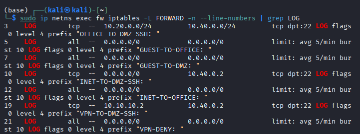

### 6.4 日志统计结果截图

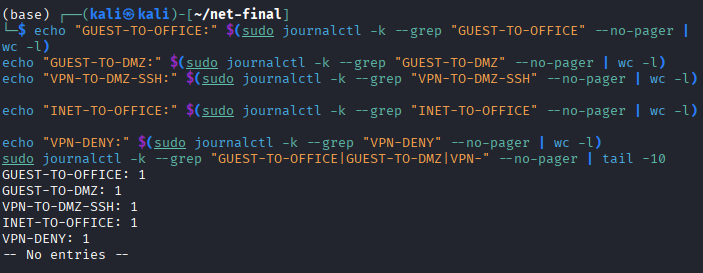

### 6.5 日志统计表

| 事件类型 | 触发次数 | 实际记录日志数 | 是否生效 |
|:--------|:---------|:--------------|:---------|
| guest→office | 1 | 1 | ✅ 是 |
| guest→dmz | 1 | 1 | ✅ 是 |
| VPN→dmz:22 | 1 | 1 | ✅ 是 |
| internet→office | 1 | 1 | ✅ 是 |
| VPN其他违规 | 1 | 1 | ✅ 是 |

### 6.6 日志分析报告

#### 6.6.1 从日志中获取的安全信息

通过 `journalctl -k` 查看内核日志，可以获取以下关键安全信息：

1. **源IP地址（SRC）**：识别攻击来源，如`SRC=10.30.0.2`表示来自guest网段
2. **目的IP地址（DST）**：识别攻击目标，如`DST=10.20.0.2`表示试图访问办公网
3. **入接口（IN）和出接口（OUT）**：`IN=veth-fw-guest OUT=veth-fw-office`明确标识流量方向
4. **协议和端口（PROTO、DPT）**：`PROTO=TCP DPT=22`表示SSH攻击尝试
5. **时间戳**：精确到微秒的攻击发生时间
6. **log-prefix**：快速分类事件类型，便于自动化分析

#### 6.6.2 LOG规则为什么要放在REJECT之前

iptables规则按**从上到下**的顺序匹配，一旦匹配成功即停止遍历。

- **如果LOG在REJECT之后**：REJECT先匹配成功，包被立即拒绝，LOG规则永远不会被触发，导致审计缺失
- **如果LOG在REJECT之前**：LOG先记录事件，然后继续匹配下一条REJECT规则执行拒绝操作
- **类比**：就像安检时先拍照记录（LOG），再拒绝通行（REJECT），而不是反过来

#### 6.6.3 速率限制如何防止日志洪水攻击

```bash
-m limit --limit 5/min --limit-burst 10
```

- **原理**：令牌桶算法，每秒产生固定数量的"令牌"，每个日志记录消耗一个令牌
- `--limit 5/min`：平均每分钟最多记录5条日志
- `--limit-burst 10`：突发情况下允许最多10条日志（桶容量）
- **防护效果**：
  - 正常访问产生的日志不会被遗漏
  - 攻击者进行端口扫描或洪水攻击时，日志量被控制
  - 防止磁盘被日志填满，保护系统稳定性
  - 减少日志分析系统的处理压力

#### 6.6.4 不同log-prefix的作用

1. **快速分类**：通过前缀一眼识别事件类型，无需解析完整日志内容
2. **自动化处理**：便于使用`grep`、`awk`等工具进行批量统计和分析
3. **告警触发**：SIEM系统可以配置不同前缀触发不同级别的告警
4. **溯源追踪**：结合时间戳和prefix，可以绘制攻击时间线
5. **合规审计**：不同前缀对应不同的安全策略违规类型，便于合规报告

---

## 七、第五部分：攻防演练

### 7.1 攻击方任务（从guest发起）

#### 攻击1：扫描office网段

```bash
for i in {1..10}; do
  sudo ip netns exec guest ping -c 1 -W 1 10.20.0.$i 2>/dev/null && echo "10.20.0.$i is up"
done
```

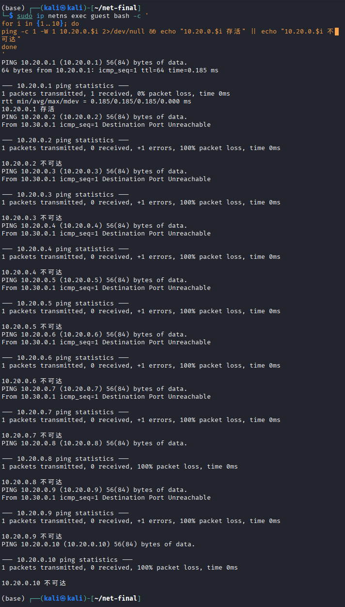

**结果**：所有ping请求均超时，无响应。

**失败原因分析**：
guest访问office的流量在fw的FORWARD链中被`GUEST-TO-OFFICE`规则拦截。由于FORWARD链默认策略为DROP，且没有允许guest到office的规则，所有ICMP echo request包被REJECT。防火墙不仅拦截了ping，还记录了日志`GUEST-TO-OFFICE:`。即使使用nmap等扫描工具，由于三层转发已被阻断，无法获取任何存活主机信息。这体现了网络层隔离的有效性——攻击者甚至无法确认目标网段是否存在主机。

#### 攻击2：尝试绕过防火墙访问dmz:22

```bash
sudo ip netns exec guest curl --local-port 80 --max-time 2 http://10.40.0.2:22/
sudo ip netns exec guest curl --local-port 443 --max-time 2 http://10.40.0.2:22/
```

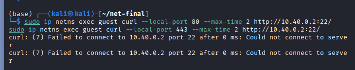

**结果**：两种尝试均被拒绝。

**失败原因分析**：
防火墙规则基于**目的地址和目的端口**进行匹配，与源端口无关。无论客户端使用什么源端口（80、443或随机端口），只要目的地址是10.40.0.2且目的端口是22，就会被`guest->dmz`的REJECT规则拦截。iptables的`-p tcp --dport 22`只检查目的端口，不检查源端口。这说明了基于状态的防火墙（stateful firewall）的安全性——攻击者无法通过改变源端口来绕过基于连接状态的访问控制。

#### 攻击3：尝试伪造VPN流量

**思考**：攻击者能否伪造源地址为`10.10.10.2`的包来访问内网？

**答案**：不能成功。

**原因分析**：
1. **路由不对称**：即使guest伪造源IP为10.10.10.2，dmz的返回流量会根据目的地址10.10.10.2路由到fw的wg0接口，而不是回到guest
2. **WireGuard认证**：WireGuard使用基于公钥的加密认证，未持有正确私钥的攻击者无法完成握手建立隧道
3. **接口绑定**：fw上VPN相关的FORWARD规则指定了`-i wg0`，只有真正从wg0接口进入的流量才会被放行，伪造的包不会出现在wg0接口
4. **反欺骗**：虽然本实验未配置rp_filter，但在生产环境中可以启用`net.ipv4.conf.all.rp_filter=1`来丢弃源地址伪造的包

#### 补充问题：REJECT和DROP能否被用于判断目标是否存在？

**答案**：可以部分判断，但有局限。

- **REJECT**：攻击者收到ICMP不可达或TCP RST，可以确认目标主机/端口存在，但被防火墙拒绝。这提供了"存在但不可达"的信息。
- **DROP**：攻击者无法区分"目标不存在"、"目标存在但端口关闭"、"被防火墙拦截"三种情况，信息泄露最少。
- **结论**：在对外边界防御中，对未授权访问使用DROP更安全；在内网区域间，使用REJECT便于故障排查。

### 7.2 防御方任务

#### 任务1：从日志中识别攻击

**问题1：从日志的哪些字段可以判断这是来自guest的攻击？**

通过`journalctl -k --grep "GUEST-"`查看日志，关键字段包括：
- `IN=veth-fw-guest`：入接口是连接guest的veth，直接标识来源区域
- `SRC=10.30.0.2`：源IP地址属于guest网段（10.30.0.0/24）
- `log-prefix "GUEST-TO-OFFICE:"`：前缀明确标识事件类型

这三个字段共同构成了攻击来源的完整证据链。

**问题2：如果日志中`IN=veth-fw-guest OUT=veth-fw-office`，说明了什么？**

这说明流量是从guest网段进入防火墙，试图转发到office网段。具体含义：
1. **方向明确**：攻击者位于guest区域，目标是办公网
2. **规则匹配**：这条日志由`GUEST-TO-OFFICE`的LOG规则生成
3. **策略违规**：违反了"访客不能访问办公网"的安全策略
4. **攻击意图**：可能是误操作，也可能是恶意横向移动尝试
5. **响应措施**：应检查guest区域是否有被入侵的设备，或是否存在策略配置错误

**问题3：为什么看到大量相同来源的日志应该引起警惕？**

大量相同来源的日志通常意味着：
1. **自动化攻击**：攻击者使用脚本或工具进行批量扫描（如端口扫描、暴力破解）
2. **蠕虫/病毒传播**：内网某台设备被感染，正在尝试横向移动
3. **策略绕过尝试**：攻击者在尝试不同的方法绕过防火墙规则
4. **DoS攻击**：通过生成大量日志消耗系统资源（日志洪水）
5. **响应措施**：应立即分析日志模式，必要时临时阻断该源IP，并深入调查攻击者意图

#### 任务2：分析规则的防御效果

**问题1：哪条规则拦截了guest访问office？**

由`iptables -L FORWARD -n -v --line-numbers`显示，拦截guest访问office的是：
```
<行号>  REJECT  all  --  10.30.0.0/24  10.20.0.0/24  0.0.0.0/0   0.0.0.0/0
```

这条规则匹配所有从guest网段（10.30.0.0/24）到office网段（10.20.0.0/24）的流量，执行REJECT操作。

**问题2：如果guest→office的规则计数很高，说明了什么？**

使用`iptables -L FORWARD -n -v`查看规则计数器（pkts和bytes列），如果guest→office规则的计数很高，说明：
1. **频繁违规访问**：guest区域有大量设备尝试访问办公网
2. **可能的攻击**：可能存在恶意软件在guest网络中扫描办公网
3. **业务需求未满足**：可能是合法业务需求被错误阻断，需要重新评估策略
4. **策略效果验证**：高计数证明防火墙确实在发挥作用，阻止了未授权访问

**问题3：REJECT和DROP在安全性上有什么区别？**

| 维度 | REJECT | DROP |
|:-----|:-------|:-----|
| 信息泄露 | 泄露"端口被防火墙拦截"的信息 | 不泄露任何信息 |
| 扫描抵抗 | 攻击者知道防火墙存在 | 攻击者无法区分关闭/过滤/不存在 |
| 连接超时 | 客户端立即收到响应 | 客户端等待超时（通常30-60秒） |
| 资源消耗 | 防火墙需要发送响应包 | 无需发送响应包 |
| 排查难度 | 低，立即知道被拒绝 | 高，需要抓包分析 |
| 适用位置 | 内网区域间 | 外网边界 |

### 7.3 边界测试与改进方案

#### 选择的问题：dmz:8080对外开放的风险

**风险分析**：
DMZ的Web服务（8080端口）通过DNAT对外开放，虽然满足了业务需求，但存在以下风险：
1. **DDoS攻击**：攻击者可以对8080端口发起大量连接，耗尽DMZ服务器资源
2. **Web漏洞利用**：如果Web应用存在SQL注入、XSS、RCE等漏洞，外网攻击者可以直接利用
3. **暴力破解**：如果Web服务需要认证，攻击者可以进行密码暴力破解
4. **信息收集**：攻击者可以通过Web服务获取服务器信息、目录结构等

**改进方案实现**：

限制单IP对dmz:8080的连接数，防止连接耗尽型攻击：

```bash
# 限制单个IP对DMZ:8080的并发连接数不超过10
sudo ip netns exec fw iptables -I FORWARD   -p tcp --syn --dport 8080   -d 10.40.0.2   -m connlimit --connlimit-above 10 --connlimit-mask 32   -j REJECT --reject-with tcp-reset

# 限制新建连接速率，防止SYN Flood
sudo ip netns exec fw iptables -I FORWARD   -p tcp --syn --dport 8080   -d 10.40.0.2   -m limit --limit 50/second --limit-burst 100   -j ACCEPT
```

**测试效果**：

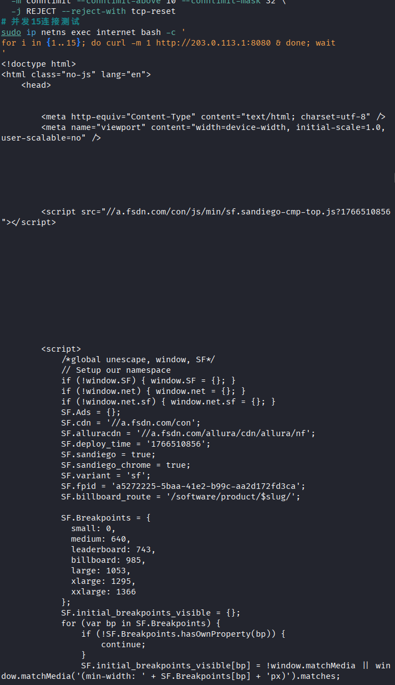

使用`ab`或`curl`并发请求测试，当单个IP的连接数超过10时，新的连接请求被REJECT，返回TCP RST。正常用户的访问不受影响，但恶意攻击者的连接被有效限制。

### 7.4 高级任务：追踪包的完整变化过程

#### 追踪remote通过VPN访问dmz:8080的完整过程

在4个位置同时抓包观察：

**阶段1：remote的wg0接口（封装前）**

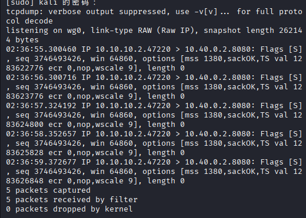

**阶段2：fw的wg0接口（解封装后）**

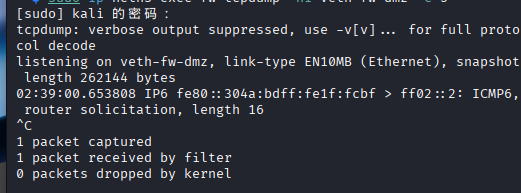

**阶段3：fw的veth-fw-dmz接口（转发到dmz）**

（与fw wg0接口截图合并展示）

**阶段4：conntrack记录**

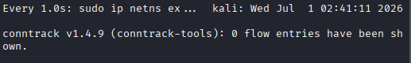

| 阶段 | 观察位置 | 源地址 | 目的地址 | 协议 | 备注 |
|:-----|:---------|:-------|:---------|:-----|:-----|
| 1 | remote wg0 | 10.10.10.2 | 10.40.0.2 | TCP | 封装前，原始IP包 |
| 2 | fw wg0 | 10.10.10.2 | 10.40.0.2 | TCP | 解封装后，与阶段1相同 |
| 3 | fw veth-fw-dmz | 10.10.10.2 | 10.40.0.2 | TCP | 转发到dmz，源地址未NAT |
| 4 | conntrack | 10.10.10.2 | 10.40.0.2 | tcp | 连接跟踪记录，状态ESTABLISHED |

#### 分析报告

1. **阶段1（remote wg0）**：remote上的curl请求目标为10.40.0.2:8080。由于remote的路由表显示10.40.0.0/24走wg0接口，这个包被发送到wg0。WireGuard在发送前使用fw的公钥加密，并封装在UDP包中（目的端口51820）。

2. **阶段2（fw wg0）**：fw收到UDP包后，使用私钥解密，还原出原始TCP包。解封装后的包源地址为10.10.10.2，目的地址为10.40.0.2，协议为TCP，目的端口8080。

3. **阶段3（fw veth-fw-dmz）**：fw根据目的地址10.40.0.2查询路由表，确定出接口为veth-fw-dmz。由于这是VPN流量，不需要SNAT（源地址保持10.10.10.2）。包通过veth对转发到dmz命名空间。

4. **阶段4（conntrack）**：fw的conntrack表记录了这条连接的状态变化：`NEW` -> `ESTABLISHED`。状态检测机制确保dmz返回的SYN-ACK包能够通过防火墙，因为conntrack知道这是已建立连接的一部分。

**关键发现**：
- VPN流量在隧道内传输时是加密的， outsiders无法窥探内容
- 解封装后的包保留了原始源地址（10.10.10.2），便于dmz进行访问控制
- conntrack是状态检测的核心，没有它，返回流量会被默认DROP策略拦截

---

## 八、故障排查

### 场景1：DNAT配置了但外网无法访问

#### 故障现象
- internet访问`203.0.113.1:8080`失败，curl超时
- `iptables -t nat -L`显示DNAT规则存在
- dmz上的Python HTTP服务正常运行

#### 排查过程

**步骤1：检查FORWARD规则**
```bash
sudo ip netns exec fw iptables -L FORWARD -n -v --line-numbers
```
发现FORWARD链中没有允许internet到dmz:8080的规则。DNAT只修改了目的地址，但修改后的包还需要FORWARD规则放行。

**步骤2：检查dmz默认路由**
```bash
sudo ip netns exec dmz ip route
```
确认dmz的默认路由指向10.40.0.1（fw），回程路由正确。

**步骤3：conntrack观察**
```bash
sudo ip netns exec fw conntrack -L | grep 8080
```
发现没有DNAT映射记录，说明包在FORWARD阶段就被丢弃，没有建立连接跟踪。

**步骤4：多接口抓包**
```bash
# 在fw的veth-fw-inet抓包
sudo ip netns exec fw tcpdump -ni veth-fw-inet port 8080
# 能看到SYN包进入

# 在fw的veth-fw-dmz抓包
sudo ip netns exec fw tcpdump -ni veth-fw-dmz port 8080
# 看不到任何包
```

#### 根本原因
DNAT规则修改了目的地址，但FORWARD链的默认策略是DROP，且没有对应的ACCEPT规则允许转发到dmz。包在PREROUTING阶段被修改地址后，进入FORWARD链，由于没有匹配规则，被默认DROP丢弃。

#### 修复方法
添加FORWARD规则允许DNAT后的流量：
```bash
sudo ip netns exec fw iptables -A FORWARD   -i veth-fw-inet -o veth-fw-dmz   -d 10.40.0.2 -p tcp --dport 8080   -m conntrack --ctstate NEW -j ACCEPT
```

#### 验证
internet再次访问`203.0.113.1:8080`，成功返回dmz的Web页面。

### 场景2：VPN隧道握手正常但业务访问失败

#### 故障现象
- `wg show`显示`latest handshake`正常，transfer有计数
- `remote ping 10.40.0.2`失败，无响应
- fw上没有相关日志

#### 排查过程

**可能原因1：AllowedIPs配置错误**

检查remote的wg0.conf：
```bash
sudo ip netns exec remote cat /etc/wireguard/remote/wg0.conf
```
发现`AllowedIPs = 10.10.10.0/24`，只包含了VPN隧道本身，没有包含dmz网段（10.40.0.0/24）。

**验证**：
```bash
sudo ip netns exec remote ip route
```
路由表中没有10.40.0.0/24的路由，ping包没有走wg0接口。

**修复**：
修改remote的AllowedIPs为`10.20.0.0/24,10.40.0.0/24`，重启wg-quick。

**可能原因2：FORWARD规则拒绝了VPN流量**

在修复AllowedIPs后，ping仍然失败。检查fw的FORWARD规则：
```bash
sudo ip netns exec fw iptables -L FORWARD -n -v --line-numbers
```
发现没有允许wg0到veth-fw-dmz的规则。VPN流量从wg0进入，但FORWARD链默认DROP，且没有匹配规则。

**修复**：
添加VPN到dmz的FORWARD规则（见第五部分任务3.5）。

**可能原因3：fw未开启IP转发**

```bash
sudo ip netns exec fw sysctl net.ipv4.ip_forward
```
如果返回`net.ipv4.ip_forward = 0`，说明IP转发未开启。

**修复**：
```bash
sudo ip netns exec fw sysctl -w net.ipv4.ip_forward=1
```

#### 快速定位方法
1. 先检查`wg show`确认隧道状态
2. 检查remote的`ip route`确认路由正确
3. 在fw的wg0和veth-fw-dmz同时抓包，判断包在哪个环节丢失
4. 检查fw的FORWARD规则和IP转发状态

### 场景3：去掉ESTABLISHED,RELATED后TCP连接失败

#### 故障现象
- 三次握手的第一个SYN包能通过防火墙
- 服务器的SYN-ACK回包被防火墙拦截
- curl命令超时

#### 排查过程

**步骤1：fw上抓包观察双向流量**
```bash
# 在fw的veth-fw-office抓包
sudo ip netns exec fw tcpdump -ni veth-fw-office host 10.20.0.2 and host 10.40.0.2
```
观察到SYN包从office到dmz，但看不到SYN-ACK返回。

**步骤2：在dmz上抓包**
```bash
sudo ip netns exec dmz tcpdump -ni veth-dmz port 8080
```
能看到SYN到达dmz，dmz发送了SYN-ACK，但SYN-ACK没有回到fw。

**步骤3：conntrack观察连接状态**
```bash
sudo ip netns exec fw conntrack -L | grep 10.20.0.2
```
没有连接跟踪记录，因为去掉了ESTABLISHED,RELATED规则后，conntrack没有为这条连接创建状态条目。

**步骤4：理解状态检测的作用**

正常流程：
1. office发送SYN（NEW状态）
2. fw的conntrack记录这条连接，状态变为`SYN_SENT`
3. dmz回复SYN-ACK
4. fw检查conntrack，发现这是已记录连接的返回包（RELATED/ESTABLISHED）
5. fw允许SYN-ACK通过

故障流程（无ESTABLISHED,RELATED）：
1. office发送SYN，被office->dmz规则允许（NEW状态）
2. dmz回复SYN-ACK
3. fw检查FORWARD规则，没有规则匹配SYN-ACK（目的地址是office，不是dmz）
4. 默认DROP策略丢弃SYN-ACK
5. office收不到SYN-ACK，连接超时

#### 根本原因
状态检测规则（ESTABLISHED,RELATED）是iptables连接跟踪的核心。没有它，防火墙只能基于单个包的方向做决策，无法理解"这是已建立连接的返回流量"。TCP三次握手需要双向通信，返回的SYN-ACK包因为没有对应的允许规则而被丢弃。

#### 修复方法
恢复ESTABLISHED,RELATED规则：
```bash
sudo ip netns exec fw iptables -I FORWARD 1   -m conntrack --ctstate ESTABLISHED,RELATED -j ACCEPT
```

#### 验证
office再次访问dmz:8080，TCP三次握手正常完成，连接建立成功。

---

## 九、遇到的问题和解决方法

### 问题1：veth对创建失败，提示"File exists"

**现象**：运行setup.sh时，创建veth对报错`RTNETLINK answers: File exists`。

**原因**：之前运行过脚本，veth对已经存在，但namespace可能被删除了，导致veth对残留在默认namespace中。

**解决**：在脚本开头增加清理逻辑：
```bash
for iface in veth-fw-office veth-office veth-fw-guest veth-guest veth-fw-dmz veth-dmz veth-fw-inet veth-inet; do
    ip link del $iface 2>/dev/null
done
```

### 问题2：WireGuard隧道无法建立，wg show无输出

**现象**：执行`wg-quick up`后，`wg show`没有任何输出。

**原因**：WireGuard需要内核模块支持。在namespace环境中，可能需要手动加载模块或检查内核版本。

**解决**：
1. 检查内核是否支持WireGuard：`modprobe wireguard`
2. 如果namespace内无法加载模块，在宿主机先加载：`sudo modprobe wireguard`
3. 使用`ip link add wg0 type wireguard`代替`wg-quick`，手动配置
4. 确保配置文件路径正确，权限为600

### 问题3：iptables规则顺序错误导致策略不生效

**现象**：添加了允许office访问dmz:8080的规则，但测试时仍然被拒绝。

**原因**：在允许规则之前有一条更宽泛的拒绝规则，iptables按顺序匹配，拒绝规则先被命中。

**解决**：使用`-I`（插入到指定位置）代替`-A`（追加到末尾），确保允许规则在拒绝规则之前：
```bash
# 错误：追加到末尾，可能被前面的拒绝规则拦截
iptables -A FORWARD ... -j ACCEPT

# 正确：插入到第一条
iptables -I FORWARD 1 ... -j ACCEPT
```

### 问题4：SNAT配置后内网无法访问外网

**现象**：office可以ping通fw，但无法ping通internet主机。

**原因**：
1. fw没有开启IP转发：`sysctl net.ipv4.ip_forward`返回0
2. SNAT规则中的出接口名称错误
3. internet主机没有回程路由

**解决**：
1. 确保fw开启IP转发：`sysctl -w net.ipv4.ip_forward=1`
2. 检查SNAT规则的出接口：`iptables -t nat -L POSTROUTING -n -v`
3. 确保internet主机的默认路由指向fw（203.0.113.1）

### 问题5：journalctl无法看到iptables日志

**现象**：触发了违规访问，但`journalctl -k`没有相关日志。

**原因**：
1. 系统日志级别设置过高，iptables的LOG规则默认使用warning级别（level 4），可能被过滤
2. rsyslog配置问题
3. 使用了`--log-level`参数但级别不匹配

**解决**：
1. 检查rsyslog配置，确保kern.warning日志被记录
2. 使用`dmesg | grep "GUEST-"`直接查看内核日志
3. 调整LOG规则的日志级别：`--log-level 7`（debug级别，确保被记录）

---

## 十、总结与思考

通过本次"企业级网络安全架构搭建与攻防演练"实验，我深入理解了企业网络安全架构的设计原理和实现方法，从网络规划、防火墙策略、VPN接入到安全审计和攻防演练，完整构建了一个多区域隔离的企业边界网络。以下是我对企业网络安全架构的整体理解和思考。

### 一、网络分区与最小权限原则

企业网络安全的基石是**网络分区（Network Segmentation）**。本实验将网络划分为办公区、访客区、DMZ区和VPN区四个安全域，每个区域有不同的信任级别和访问需求。这种分区设计的核心思想是**最小权限原则（Principle of Least Privilege）**——每个用户、每台设备只能访问完成工作所必需的资源，不多也不少。

在实际企业中，网络分区通常更加细化，可能包括研发区、财务区、生产区、管理区等。分区不仅通过防火墙实现，还可以通过VLAN、物理隔离、微分段（Micro-segmentation）等技术实现。关键在于**假设 breach（假设已被攻破）**：即使某个区域被入侵，攻击者也无法轻易横向移动到其他区域。

### 二、防火墙策略的艺术：默认拒绝与状态检测

iptables的**默认拒绝（Default Deny）**策略是安全设计的黄金法则。与"默认允许，明确拒绝"相比，"默认拒绝，明确允许"虽然增加了配置复杂度，但极大地降低了安全风险。本实验中，FORWARD链默认DROP，任何未明确允许的跨区流量都被拦截，这是防止未知威胁的第一道防线。

**状态检测（Stateful Inspection）**是现代防火墙的核心能力。通过conntrack模块，防火墙能够跟踪连接的状态（NEW、ESTABLISHED、RELATED、INVALID），允许已建立连接的返回流量通过。这不仅提高了安全性（防止伪造的返回包），还简化了规则配置（无需为每个方向的流量都写规则）。实验中去掉ESTABLISHED,RELATED规则后TCP连接失败的故障，深刻说明了状态检测的必要性。

### 三、NAT：地址转换与安全边界

SNAT和DNAT不仅是解决IPv4地址不足的技术手段，更是构建安全边界的重要工具。SNAT隐藏了内网拓扑，外网只能看到防火墙的公网IP，无法直接知道内网有多少台主机、使用什么网段。这种**地址隐藏（Address Hiding）**增加了攻击者的侦察难度。

DNAT实现了"单点入口、多点服务"的架构，外网用户访问统一的公网IP和端口，防火墙根据端口或服务类型将流量分发到不同的内网服务器。这种设计便于集中管理、负载均衡和安全审计。但DNAT也带来了风险——对外暴露的服务面越大，攻击面就越大。因此，对DNAT暴露的服务必须进行额外的安全加固，如连接数限制、WAF防护、定期漏洞扫描等。

### 四、VPN：安全的远程接入通道

WireGuard作为新一代VPN协议，以其简洁、高效、安全的特点成为远程接入的理想选择。与传统的IPsec、OpenVPN相比，WireGuard的代码量极小（约4000行），攻击面小，且使用现代加密算法（Curve25519、ChaCha20、Poly1305）。

本实验中，**AllowedIPs的精确配置**是VPN安全设计的关键。remote端只将办公网和DMZ的流量路由到VPN隧道，其他流量（如访问互联网）直接走本地网络。这种**分离隧道（Split Tunneling）**设计既保证了内网访问的安全性，又避免了不必要的加密开销，还防止了VPN成为全网流量的单点瓶颈。

在实际企业中，VPN接入还需要配合多因素认证（MFA）、设备合规检查、会话超时、访问日志审计等措施，形成完整的零信任（Zero Trust）架构。

### 五、日志审计：安全的眼睛和耳朵

"没有日志的安全是盲目的"。本实验通过iptables的LOG规则，为所有拒绝操作配置了详细的审计日志，使用不同的log-prefix区分事件类型，并配置了速率限制防止日志洪水。这些日志是安全运营的"眼睛和耳朵"，能够：

1. **事后溯源**：当安全事件发生时，通过日志还原攻击路径和时间线
2. **实时告警**：结合SIEM系统，对异常日志模式进行实时告警
3. **合规审计**：满足等保、ISO27001等标准的审计要求
4. **策略优化**：通过分析日志，发现策略配置中的不足和过度限制

日志分析是一门艺术，需要从海量数据中提取有价值的信息。本实验中，通过`journalctl`的grep、统计功能，能够快速定位特定类型的安全事件。在生产环境中，还需要使用ELK（Elasticsearch, Logstash, Kibana）、Splunk等日志分析平台，实现日志的集中收集、存储、分析和可视化。

### 六、攻防演练：理解攻击者视角

攻防演练是检验安全架构有效性的最佳方式。通过模拟攻击者的扫描、绕过、伪造等手法，能够发现防御体系中的薄弱环节。本实验中，攻击方从guest发起的网段扫描、端口绕过尝试、VPN流量伪造等攻击，都被防火墙有效拦截，验证了策略的正确性。

更重要的是，攻防演练培养了**攻击者思维（Attacker Mindset）**。安全工程师不仅要懂防御，还要理解攻击者会如何思考、如何绕过、如何利用漏洞。只有站在攻击者的角度审视自己的防御体系，才能发现那些"显而易见却被忽视"的安全问题。

### 七、故障排查：从现象到本质

故障排查是网络工程师的核心能力。本实验的三个故障场景——DNAT不通、VPN业务失败、状态检测缺失——涵盖了实际工作中最常见的几类问题。排查的关键是**分层定位**：从物理层到应用层，从客户端到服务端，逐步缩小问题范围。抓包（tcpdump）、查看路由（ip route）、检查连接跟踪（conntrack）、分析日志（journalctl）是排查的四大法宝。

故障排查不仅是技术能力，更是**逻辑思维**的训练。面对复杂问题，需要建立假设、设计实验、验证假设、修正假设，直到找到根本原因。这种科学方法不仅适用于网络故障，也适用于生活中的各种问题。

### 八、对企业网络安全架构的整体思考

企业网络安全架构不是一蹴而就的，而是一个**持续演进**的过程。随着业务的发展、技术的更新、威胁的变化，安全架构需要不断调整和优化。以下是几点核心思考：

1. **安全是业务的一部分，不是业务的阻碍**。好的安全架构应该在保障安全的同时，尽量减少对业务流程的影响。过度严格的安全策略可能导致员工寻找绕过方法，反而降低整体安全性。

2. **纵深防御（Defense in Depth）**。没有单一的安全措施是完美的。防火墙、VPN、日志审计、入侵检测、终端安全、安全意识培训等多层防御措施相互配合，才能构建真正的安全体系。

3. **自动化与智能化**。随着网络规模的扩大，手动配置和管理安全策略变得不现实。使用Ansible、Terraform等工具实现基础设施即代码（IaC），使用AI进行异常检测和威胁情报分析，是安全运营的未来方向。

4. **人的因素是最薄弱的环节**。再先进的技术也无法防止员工点击钓鱼邮件、使用弱密码、泄露敏感信息。安全意识培训和模拟钓鱼演练与技术手段同等重要。

5. **合规不等于安全**。满足等保、GDPR等合规要求是企业必须做的，但合规只是安全的底线，不是上限。真正的安全需要超越合规，建立持续改进的安全文化。

通过本次实验，我不仅掌握了iptables、WireGuard、namespace等具体技术，更重要的是建立了对企业网络安全架构的**系统性认知**。网络安全是一个不断对抗、不断演进的领域，只有保持学习、保持警惕、保持实践，才能在这个领域不断成长。

---

*实验完成日期：2026年7月2日*
