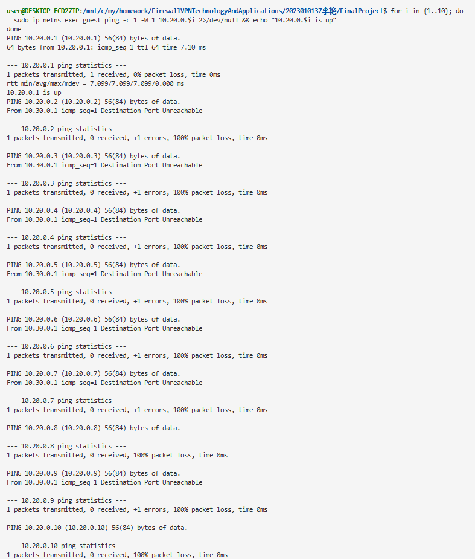
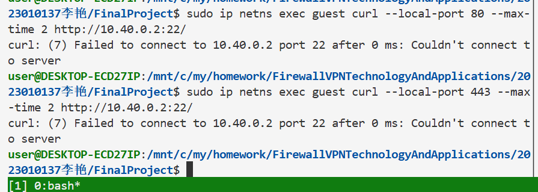
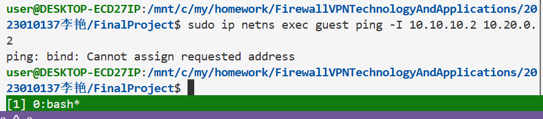
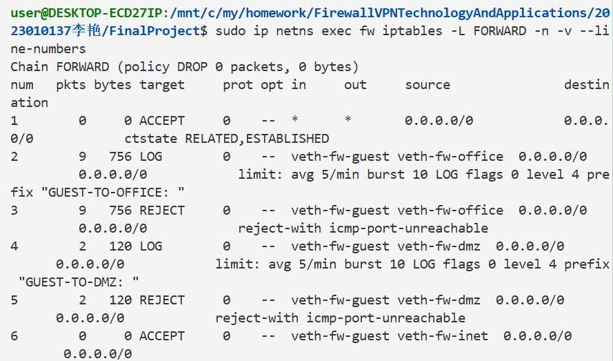
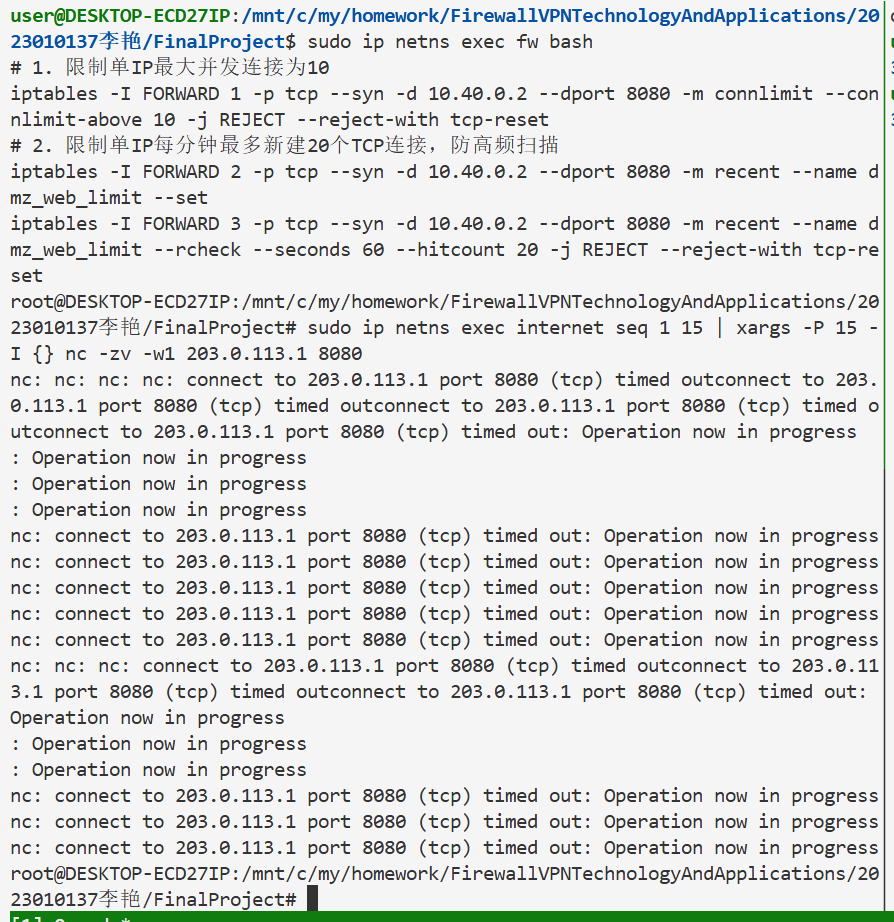
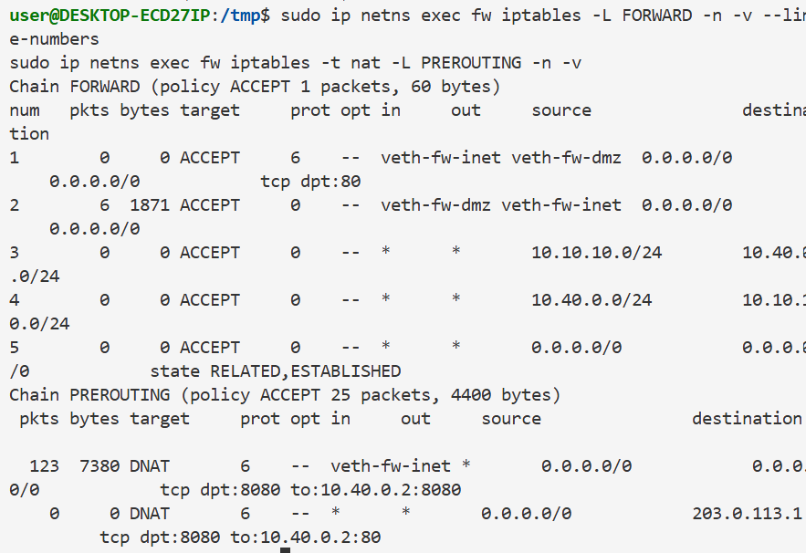

## 攻防演练
（包含攻击演练、防御分析、边界测试）
### 攻击 1：扫描 office 网段
```
for i in {1..10}; do
  sudo ip netns exec guest ping -c 1 -W 1 10.20.0.$i 2>/dev/null && echo "10.20.0.$i is up"
done
```
 
失败原因分析:
本次从 guest 主机发起 10 段办公网段 ping 扫描，尝试探测内网存活主机。防火墙预先配置GUEST-TO-OFFICE前置日志 + REJECT 拦截规则，guest 访问 office 的 ICMP 数据包匹配拒绝策略直接阻断，无任何主机存活信息返回。即便循环批量发送探测包，所有流量均被隔离策略拦截，无法收集内网资产，横向扫描攻击完全失效。

### 攻击 2：尝试修改源端口绕过防火墙访问 dmz:22
```
sudo ip netns exec guest curl --local-port 80 --max-time 2 http://10.40.0.2:22/
sudo ip netns exec guest curl --local-port 443 --max-time 2 http://10.40.0.2:22/
```

原因分析:
本次尝试修改本地源端口，试图绕过防火墙规则访问 DMZ 主机的 22 端口 SSH 服务。本次防火墙规则是基于入接口与网段进行管控，限制veth-fw-guest接口流入的 guest 网段全部流量，管控维度为源网段与进出网卡，和客户端本地源端口无关。无论更换 80、443 等任意本地源端口，流量的来源网段、入接口不会改变，依旧会匹配 GUEST-DENY-DMZ 拦截规则，因此无法实现绕过。

### 攻击 3：伪造 VPN 源 IP 流量
```
sudo ip netns exec guest ping -s 10.10.10.2 10.20.0.2
```

原因分析:本次尝试在 guest 主机伪造 VPN 合法 IP10.10.10.2，试图绕过防火墙访问办公网段。首先操作系统层面拒绝绑定非本地网段的源 IP，直接报错无法分配地址；其次 WireGuard 依靠隧道加密与密钥双向认证，并非单纯依靠 IP 地址放行。防火墙会根据流量入接口区分来源，guest 网卡的流量会匹配访客网段拦截策略，IP 伪造无法突破接口管控与 VPN 隧道认证机制，本次伪造攻击彻底失效。

### 攻击者能否从REJECT和DROP的不同表现判断目标是否存在？
攻击者可以根据 REJECT 与 DROP 的不同表现，判断目标是否存在，二者行为差异如下：
REJECT 模式
防火墙收到违规数据包后，会主动向攻击者源地址回复拒绝应答报文（TCP RST 报文、ICMP 端口 / 主机不可达报文）。攻击者收到回复后，能够百分百确定目标 IP 与端口真实存活，只是访问行为被防火墙策略拦截，很容易探测出内网资产，会泄露目标存在的信息。
DROP 模式
防火墙只会静默丢弃收到的数据包，全程不返回任何应答报文，攻击者端只会持续等待直至连接超时。此时攻击者无法区分两种情况：一是目标主机本身不存在、路由不可达；二是目标正常在线，但流量被防火墙丢弃拦截。因此 DROP 具备更强的隐蔽性，攻击者无法精准判断目标存活状态。
REJECT 的应答特征会暴露目标存在，DROP 无返回报文，无法判断目标真实状态。

### 防御方任务（日志分析与规则分析）
### 1 从日志中识别攻击
```
sudo ip netns exec fw journalctl -k --grep "GUEST-TO-OFFICE\|GUEST-TO-DMZ" --no-pager
```

1、从日志的哪些字段可以判断这是来自guest的攻击？
日志中IN=veth-fw-guest代表流量从访客网段对应的网卡流入防火墙，SRC字段显示 IP 为10.30.0.2，属于 guest 网段地址；同时日志开头自带自定义前缀GUEST-TO-OFFICE、GUEST-TO-DMZ，是我们为访客访问行为专属配置的标记。结合入接口、源 IP 网段、专属日志前缀三项内容，即可明确判定流量来源于 guest 主机，属于访客侧发起的攻击行为。

2、如果日志中IN=veth-fw-guest OUT=veth-fw-office，说明了什么？
该字段代表数据包从防火墙连接 guest 的 veth-fw-guest 接口进入，从连接 office 办公网的 veth-fw-office 接口准备转发，代表 guest 主机正在主动尝试访问内网办公网段资源。该流量命中了我们预设的访客禁止访问办公网的安全策略，防火墙先执行 LOG 规则完整记录本次违规访问日志，随后执行 REJECT 规则拦截数据包。这条日志是 guest 越权横向渗透内网的直接审计证据，若批量出现该类日志，说明存在内网扫描风险。

3、为什么看到大量相同来源的日志应该引起警惕？
少量单条日志大概率是用户误操作，但同一 IP 短时间产生大量同类拦截日志，属于典型恶意行为特征，大概率攻击者正在对内网进行端口扫描、网段探测，尝试寻找防火墙规则漏洞完成横向渗透。高频的重复请求不仅会占用防火墙日志与网络性能，易引发日志洪水风险；同时攻击者会持续试探规则边界，一旦发现策略缺陷就会发起漏洞利用、暴力破解等深度攻击。运维人员需要及时核查对应主机，必要时封禁 IP 阻断攻击源。

### 2 分析规则的防御效果
```
# 查看规则计数器
sudo ip netns exec fw iptables -L FORWARD -n -v --line-numbers
```


1、哪条规则拦截了guest访问office？
FORWARD 链行号 2、行号 3两条规则配合完成拦截：
行号 2 为 LOG 日志规则，匹配in veth-fw-guest、out veth-fw-office的流量，负责记录违规访问日志；行号 3 为 REJECT 动作规则，完全匹配相同进出接口，是最终执行拦截的核心规则。两条规则一一配对，先日志审计、再拒绝数据包，本次攻击一共拦截 9 个数据包，与截图 pkts 计数完全对应。

2、如果guest→office的规则计数很高，说明了什么？
规则 pkts 计数大幅上涨，代表大量 guest 网段流量在尝试访问 office 办公内网，存在四类可能性：
①恶意内网扫描：攻击者控制 guest 主机批量探测办公网段存活 IP，进行横向渗透；
②终端中毒：guest 设备植入木马程序，自动对内网发起扫描探测；
③人为误操作：内网用户设备配置错误，主动访问无权限的办公业务；
④规则试探：攻击者持续发包试探防火墙策略漏洞，寻找绕过路径。
⑤需要结合日志时间判断流量性质，突发暴涨的计数大概率为恶意攻击，需要及时溯源 IP、封禁攻击主机。

3、REJECT和DROP在安全性上有什么区别？
①REJECT：主动向客户端返回 ICMP 端口不可达 / TCP RST 拒绝报文。优点是故障排查便捷，客户端能立刻知晓访问被拦截；缺点会主动告知攻击者目标 IP、端口存活，泄露内网资产信息，容易被利用梳理内网拓扑。
②DROP：静默丢弃数据包，全程不回复任何报文，客户端只会等待连接超时。优点隐蔽性极强，攻击者无法区分 “主机不存在” 和 “流量被拦截”，大幅提升攻击难度；缺点会造成客户端长时间超时等待，可能额外消耗网络资源。
使用场景：外网边界防护优先使用 DROP 提升安全性；内网网段隔离可使用 REJECT，方便日常故障排查。

### 3 边界测试与改进方案（DMZ 10.40.0.2:8080 对外开放加固）
一、风险分析
DMZ 的 8080 端口对外开放供外网访问，存在两大核心安全风险。第一是 DDoS 攻击风险，外网攻击者可发起海量 TCP 新建连接、高频扫描请求，快速耗尽服务器 CPU、连接数资源，造成合法用户无法正常访问 Web 业务。第二是 Web 漏洞利用风险，若 8080 的 Web 程序存在 SQL 注入、XSS、文件上传漏洞，外网攻击者可直接远程利用漏洞入侵 DMZ 服务器，一旦拿下 DMZ 主机，极易以此为跳板横向渗透至内网 Office 网段。当前仅放行端口连通性，无连接频率、并发上限管控，攻击门槛极低，极易引发内网失陷安全事件。

二、加固改进 iptables 规则
```
sudo ip netns exec fw bash
# 1. 限制单IP最大并发连接为10
iptables -I FORWARD 1 -p tcp --syn -d 10.40.0.2 --dport 8080 -m connlimit --connlimit-above 10 -j REJECT --reject-with tcp-reset
# 2. 限制单IP每分钟最多新建20个TCP连接，防高频扫描
iptables -I FORWARD 2 -p tcp --syn -d 10.40.0.2 --dport 8080 -m recent --name dmz_web_limit --set
iptables -I FORWARD 3 -p tcp --syn -d 10.40.0.2 --dport 8080 -m recent --name dmz_web_limit --rcheck --seconds 60 --hitcount 20 -j REJECT --reject-with tcp-reset
```

三、效果测试命令（internet 命名空间模拟多连接攻击）
```
sudo ip netns exec internet seq 1 15 | xargs -P 15 -I {} nc -zv -w1 203.0.113.1 8080
```

四、效果截图


### 4 高级任务：追踪包的完整变化过程
#### 包变化对比表
| 阶段 | 观察位置 | 源地址 | 目的地址 | 协议 | 备注 |
| ---- | -------- | ------ | -------- | ---- | ---- |
| 1 | remote wg0 | 10.10.10.2 | 10.40.0.2 | TCP | 封装前内层原始IP报文，准备送入WireGuard隧道 |
| 2 | fw wg0 | 客户端公网IP | 203.0.113.1 | UDP | 外层WireGuard封装UDP包，解封装后内层源10.10.10.2、目的10.40.0.2(TCP) |
| 3 | fw veth-fw-dmz | 10.10.10.2 | 10.40.0.2 | TCP | FW防火墙FORWARD规则放行，跨网卡转发至DMZ网段 |
| 4 | conntrack | 10.10.10.2 | 10.40.0.2 | TCP | 新建NEW状态连接记录，为回程流量提供状态放行依据 |


#### 分析报告
本次数据包为VPN客户端10.10.10.2访问内网DMZ主机10.40.0.2的TCP请求。数据包在remote的wg0网卡生成原始TCP内层报文，路由判定目标网段匹配WireGuard的AllowedIPs规则，随即把内层TCP数据包封装为UDP外层隧道报文，发送到FW的公网IP。数据包到达FW的wg网卡后，WireGuard解密解封装，剥离外层UDP头部，还原出原始内网IP数据包。
解密后的报文进入FW的FORWARD转发链，匹配VPN网段放行规则，顺利转发至内网veth-fw-dmz网卡，本次通信未配置SNAT/DNAT，IP地址无修改。内核conntrack同步生成NEW状态的TCP连接会话，保存完整五元组信息。服务器回复的回程SYN-ACK报文，依靠ESTABLISHED状态规则自动放行，重新封装WireGuard隧道回传给客户端，完成一次完整的VPN跨网段TCP通信。
