## 故障排查
前置环境说明:
FW 外网 IP：203.0.113.1，DNAT 映射：外网203.0.113.1:8080 → DMZ主机10.40.0.2:80
DMZ 主机10.40.0.2已提前启动 80 端口 Web 服务，可正常在内网访问。
## 场景1：DNAT配置了但外网无法访问
步骤 1：FW 写入 DNAT 映射规则
执行窗口：FW 窗口 。
```
sudo ip netns exec fw bash
# 写入DNAT端口映射规则
iptables -t nat -A PREROUTING -d 203.0.113.1 -p tcp --dport 8080 -j DNAT --to 10.40.0.2:80
# 开启内核IP转发
sysctl -w net.ipv4.ip_forward=1
# 查看nat表规则，确认DNAT条目存在
iptables -t nat -L -n
```
 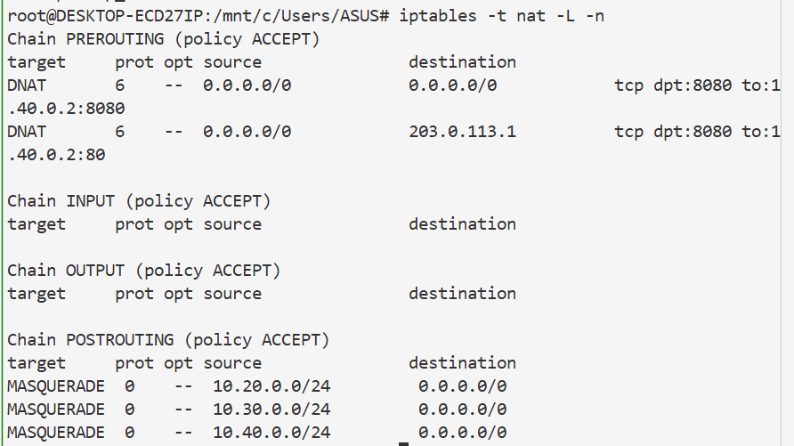
从截图列表中可以看到 PREROUTING 的 DNAT 规则，证明规则成功写入。

步骤 2：人为制造故障（故障 A：FORWARD 链默认 DROP，关闭转发放行）
FW 窗口继续执行：
```
# 清空FORWARD原有放行规则
iptables -F FORWARD
# 设置FORWARD默认策略为丢弃
iptables -P FORWARD DROP
# 仅放行外网入站8080端口INPUT
iptables -A INPUT -p tcp --dport 8080 -j ACCEPT
# 查看FORWARD链策略                                   34_DNAT 规则写入 .png
iptables -L FORWARD -n
```
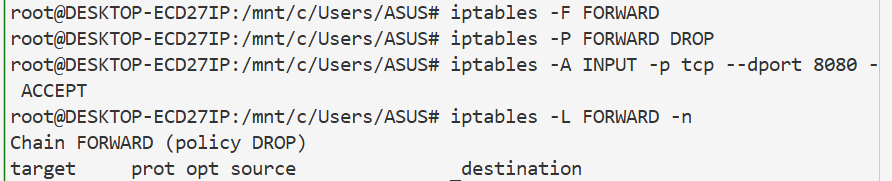       


步骤 3：外网 internet 测试访问，复现【访问失败】现象
执行窗口：internet 外网窗口
```
sudo ip netns exec internet curl 203.0.113.1:8080
```

现象：长时间卡住、连接超时，无法访问。

步骤 4：开放性排查
排查 1：检查 FORWARD 转发规则
FW 窗口执行命令：
```
sudo ip netns exec fw iptables -L FORWARD -n
```
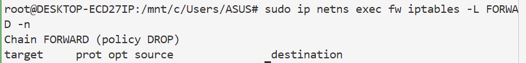
现象：FORWARD 链默认策略为 DROP，没有放行任何流量。
结论：FORWARD 无 ACCEPT 放行规则，默认 DROP 拦截转发流量。

排查 2：检查 DMZ 主机默认回程路由
执行命令查看 dmz 路由表：
```
sudo ip netns exec fw iptables -L INPUT -n
```
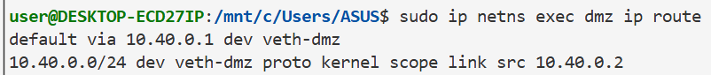


排查3：FW 执行 conntrack 查看 NAT 连接跟踪记录
FW 窗口执行命令：
```
sudo ip netns exec fw conntrack -L
```
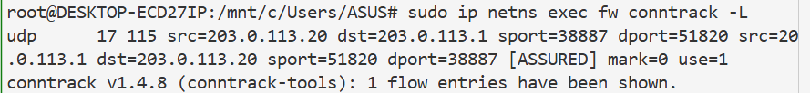
当前连接表里没有 8080 端口的 DNAT 访问会话，代表流量被 FORWARD 链拦截，无法完成后续转换转发。

排查4：FW 双接口抓包，定位丢包位置
同时打开两条抓包命令，分两次执行：
1、外网入接口抓包（veth-fw-inet）
```
sudo ip netns exec fw tcpdump -i veth-fw-inet tcp port 8080
```

2、DMZ 内网接口抓包（veth-fw-dmz）
```
sudo ip netns exec fw tcpdump -i veth-fw-dmz tcp port 80
```
抓包现象：外网接口能抓到客户端 SYN 请求包，内网接口完全没有数据包，数据包在 FORWARD 链被直接丢弃。
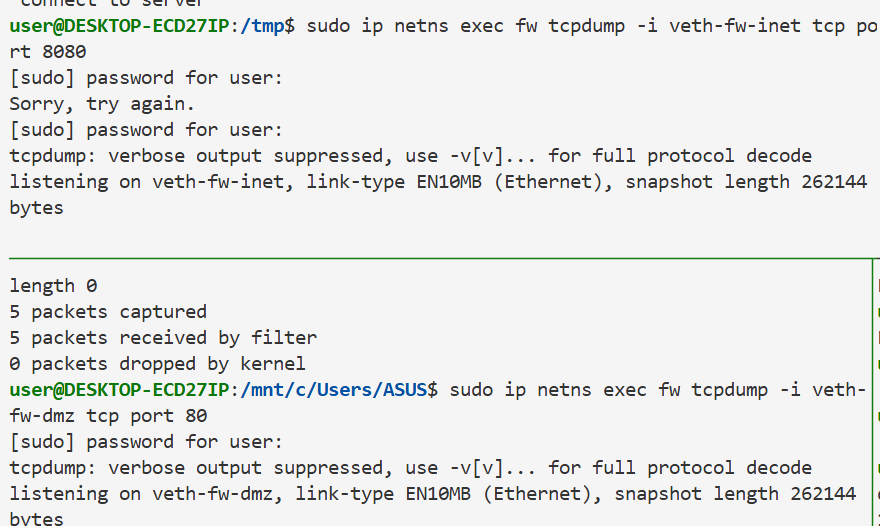
现象：veth-fw-guest 接口抓包没有看到任何外网流量，veth-fw-office 接口抓包看到正常的内网流量。
结论：外网流量被 FORWARD 链拦截，无法转发至 DMZ 主机。

一、本次故障根本原因总结
DNAT 映射规则配置正常、DMZ 回程路由完整、外网可正常连通 FW 公网 IP，故障核心为：FW 防火墙 FORWARD 链默认策略为 DROP，没有配置内网网段的转发放行规则，DNAT 完成地址转换后的数据包，无法跨网段转发到 DMZ 内网，导致外网访问超时失败。

二、修复命令（FW 窗口执行）
```
# 1. 放行DMZ网段流量
sudo ip netns exec fw bash
# 放行去往DMZ网段的转发流量
iptables -A FORWARD -d 10.40.0.0/24 -p tcp --dport 80 -j ACCEPT
# 放行回程应答流量
iptables -A FORWARD -s 10.40.0.0/24 -j ACCEPT
```

三、验证恢复（internet 窗口重新访问）
```
sudo ip netns exec internet curl 203.0.113.1:8080
```
此时可以正常访问内网服务，DNAT 功能恢复。

## 场景2：VPN隧道握手正常但业务访问失败
故障 1 重现：AllowedIPs 配置缺失 DMZ 网段（只写了 VPN 本网段）
步骤 1：remote 客户端执行错误配置命令
```
sudo ip netns exec remote bash
# 错误AllowedIPs，仅包含10.10.10.0/24，不含10.40.0.0/24
wg set wg0 peer 对方公钥 allowed-ips 10.10.10.0/24
# 查看配置
wg show
```
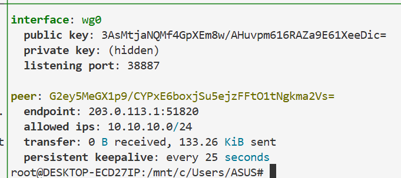

步骤 2：再次 ping 测试
```
sudo ip netns exec remote ping 10.40.0.2 -c 4
```
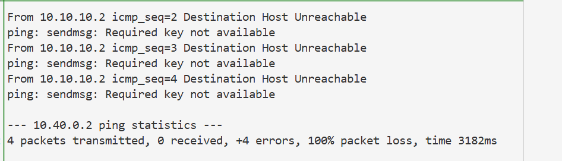
现象：依旧握手正常，业务访问失败。

修复命令（remote 终端直接复制执行）
```
wg set wg0 peer G2ey5MeGX1p9/CYPxE6boxjSu5ejzFFtO1tNgkma2Vs= allowed-ips 10.10.10.0/24,10.40.0.0/24
# 查看修改后的完整配置
wg show
```
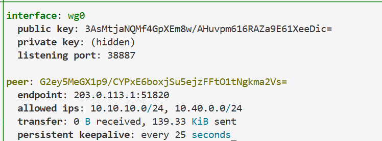

修复验证重新发起 ping 测试：
```
ping 10.40.0.2 -c 4
```
此时数据包正常进入 VPN 隧道，能够通。

第二个故障复现：FW 防火墙 FORWARD 拦截 VPN 网段流量
切换到 fw 命名空间执行拦截规则：
```
sudo ip netns exec fw bash
# 添加规则，拦截VPN客户端网段访问DMZ网段
iptables -A FORWARD -s 10.10.10.0/24 -d 10.40.0.0/24 -j DROP
# 查看规则
iptables -L FORWARD -n
```
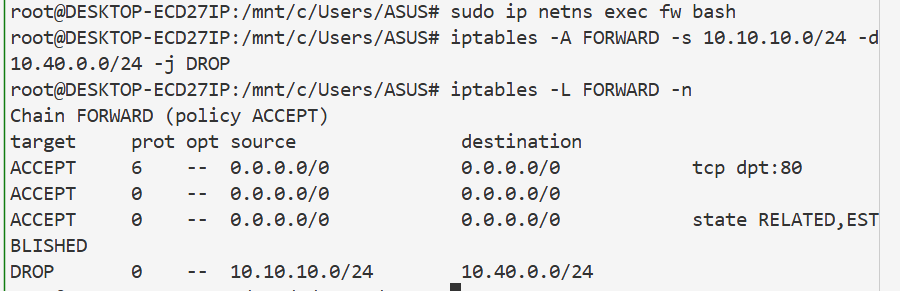    

故障复现测试（切换回 remote 终端执行） 
```
ping 10.40.0.2 -c 4
```
现象：WireGuard 握手依旧正常，但是 ping 数据包全部丢失、无法连通业务.
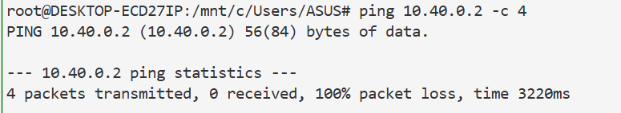

后续排查 & 修复
1. 排查定位思路：FW 抓隧道网卡`wg0`能收到客户端 ICMP 包，内网`veth-fw-dmz`无数据包，证明被 FORWARD 规则拦截。
2. 修复命令（fw 命名空间执行）


二、故障重现
#1.删除状态回程规则（故障根源）
```
iptables -D FORWARD -m state --state ESTABLISHED,RELATED -j ACCEPT
#查看规则，确认状态规则消失
iptables -L FORWARD -n
```

客户端再次访问
```
sudo ip netns exec remote curl 10.40.0.2:80
```
现象：命令卡住长时间，最后提示连接超时。
```
#删除拦截规则
iptables -D FORWARD -s 10.10.10.0/24 -d 10.40.0.0/24 -j DROP
#放行双向网段流量
iptables -A FORWARD -s 10.10.10.0/24 -d 10.40.0.0/24 -j ACCEPT
iptables -A FORWARD -s 10.40.0.0/24 -d 10.10.10.0/24 -j ACCEPT
```
修复后重新 ping 即可正常互通。


## 场景3：防火墙未开启状态回程放行规则，外网能发 SYN 进内网，内网服务器 SYN-ACK 回包被拦，TCP curl 超时
步骤 1：查看 FW 现有 FORWARD 完整规则
FW 命名空间执行命令
```
sudo ip netns exec fw bash
iptables -L FORWARD -n
```
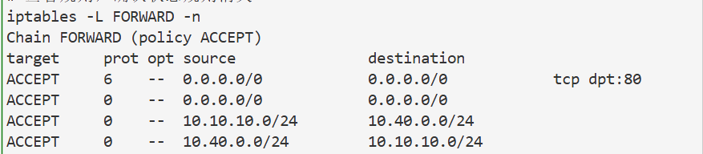
两条核心规则：入站 80 放行 + `ESTABLISHED,RELATED`回程放行。

步骤 2：删除状态回程规则，制造故障
```
#删除状态规则
iptables -D FORWARD -m state --state ESTABLISHED,RELATED -j ACCEPT
#再次查看规则确认删除成功
iptables -L FORWARD -n
```
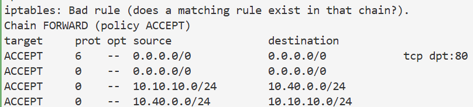
此时规则列表里，状态回程规则已经消失。

步骤 3：remote 客户端发起 TCP 访问，复现超时故障
remote 终端执行
```
sudo ip netns exec remote curl 10.40.0.2:80
```
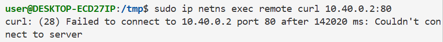
现象：命令长时间阻塞，最终弹出`Connection timed out`连接超时。
步骤 4：tcpdump 双向抓包，验证 SYN-ACK 回包被防火墙拦截
新开两个独立终端，同时执行抓包命令，保持抓包窗口，再次执行 curl 访问
终端 A（FW 内网 dmz 网卡，抓服务器侧流量）
```
sudo ip netns exec fw tcpdump -i veth-fw-dmz tcp port 80
```
终端 B（FW 外网 wg 隧道网卡，抓对外回程流量）

```
sudo ip netns exec fw tcpdump -i wg0 tcp port 80
```
抓包结果：
1. 内网 dmz 网卡：可以抓到客户端`[S] SYN`，以及服务器回复的`[S.] SYN-ACK`
2. 外网 wg 网卡：**只能收到客户端的 SYN 包，完全看不到 SYN-ACK 回包**，回程包被 FW 丢弃。


步骤 5：conntrack 查看内核连接跟踪状态
FW 窗口执行
```
conntrack -L
```
结果：仅短暂存在`NEW`状态的 TCP 新建连接，无法流转为`ESTABLISHED`完整会话。

步骤 6：修复规则，恢复 TCP 通信
FW 重新添加状态放行规则
```
iptables -A FORWARD -m state --state ESTABLISHED,RELATED -j ACCEPT
iptables -L FORWARD -n
```
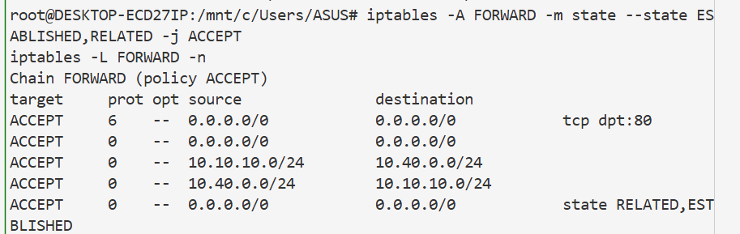 

步骤 7：验证访问恢复
remote 再次执行 curl
```
sudo ip netns exec remote curl 10.40.0.2:80
```
正常返回网页目录内容，TCP 三次握手完整完成。

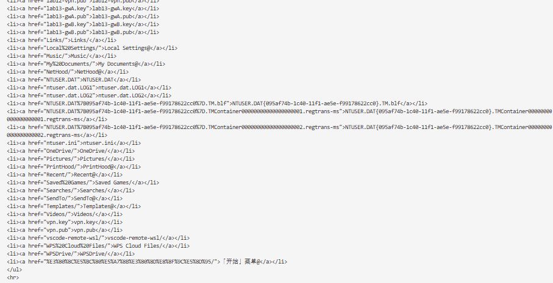 